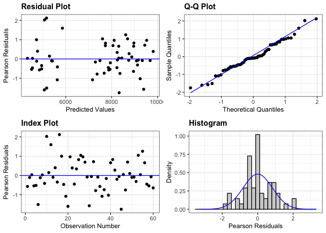
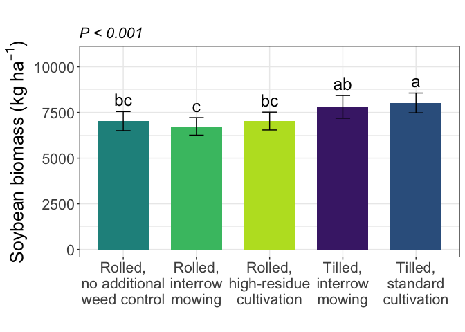
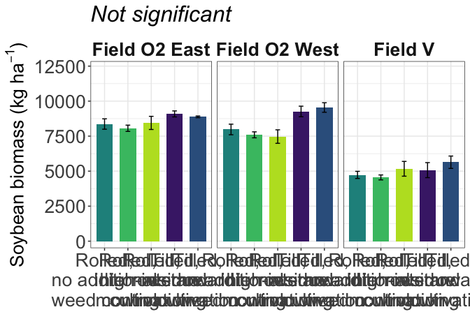

Soybean biomass
================

# Load libraries

``` r
#Set work directory
setwd("/Users/ey239/Github/Mowtivation/rmarkdowns")

#Load packages 
library(tidyverse) ##install.packages("tidyverse")
library(knitr)
library(patchwork) ##install.packages("patchwork")
library(skimr)     ##install.packages("skimr")
library(readxl)
library(janitor) ##install.packages("janitor")

library(kableExtra) ##install.packages("kableExtra")
library(webshot) ##install.packages("webshot")
webshot::install_phantomjs()
library(viridis) ##install.packages("viridis")
library(lme4) ##install.packages("lme4")
library(lmerTest) ##install.packages("lmerTest")
library(emmeans) ##install.packages("emmeans")
library(rstatix) ##install.packages("rstatix")
#library(Matrix) ##install.packages("Matrix")
library(multcomp) ##install.packages("multcomp")
library(multcompView) ##install.packages("multcompView")
library(ggResidpanel) ##install.packages("ggResidpanel")
#library(car)
#library(TMB)  ##install.packages("TMB")
#library(glmmTMB)  ##install.packages("glmmTMB")
library(DHARMa)  ##install.packages("DHARMa")
library(performance) 
#Load Functions
MeanPlusSe<-function(x) mean(x)+plotrix::std.error(x)

find_logw0=function(x){c=trunc(log(min(x[x>0],na.rm=T)))
d=exp(c)
return(d)}
```

<br>

# Load and clean data

## Load data

``` r
combined_raw <- read_excel("~/Github/Mowtivation/raw-data/All Treatments/combined_raw.xlsx")
kable(head(combined_raw))
```

| id | location | year | treatment | block | plot | bean_emergence | bean_biomass | intrarow_weed_biomass | interrow_weed_biomass | weed_biomass | bean_population | bean_yield | seed_weight |
|:---|:---|---:|:---|---:|---:|---:|---:|---:|---:|---:|---:|---:|---:|
| CU_B1_P101 | field v | 2023 | TIM | 1 | 101 | 46.5 | 223.740 | 19.000 | 44.490 | 63.490 | 34.5 | 417.21 | 17.1200 |
| CU_B1_P102 | field v | 2023 | TIC | 1 | 102 | 42.5 | 267.460 | 30.975 | 0.720 | 31.695 | 39.5 | 565.54 | 17.4750 |
| CU_B1_P103 | field v | 2023 | RIM | 1 | 103 | 36.5 | 217.890 | 0.950 | 6.890 | 7.840 | 37.5 | 449.93 | 16.7525 |
| CU_B1_P104 | field v | 2023 | RNO | 1 | 104 | 41.0 | 207.675 | 0.660 | 45.735 | 46.395 | 35.0 | 412.59 | 16.1450 |
| CU_B1_P105 | field v | 2023 | RIC | 1 | 105 | 41.0 | 230.285 | 0.495 | 22.025 | 22.520 | 39.0 | 473.79 | 17.0475 |
| CU_B1_P201 | field v | 2023 | RIC | 2 | 201 | 36.5 | 208.105 | 6.395 | 19.460 | 25.855 | 33.5 | 484.04 | 17.1500 |

\#Clean data

``` r
#Standardaze column names, convert to factors, check for outliers of variable**
clean_combined <- clean_names(combined_raw) |>  
  rename ('weed_control'= treatment) |> 
  mutate(across(c(weed_control, block, plot, location, year), as.factor)) #|> 
  #mutate(is_outlier = totwbm < (quantile(totwbm, 0.25) - 1.5 * IQR(totwbm)) |
                       #wbm > (quantile(totwbm, 0.75) + 1.5 * IQR(totwbm)))

#select and convert data for wbm analysis
bean_biomass_clean <-clean_combined |>              
  mutate(bean_biomass_grams_meter = (bean_biomass * 2)) |> 
  mutate(bean_biomass_kg_ha = ((bean_biomass/0.5) *(10000))/(1000)) |>
  mutate(bean_biomass_lbs_ac = (((bean_biomass/0.5) *(10000))/(1000))* 0.892179)
kable(head(bean_biomass_clean)) 
```

| id | location | year | weed_control | block | plot | bean_emergence | bean_biomass | intrarow_weed_biomass | interrow_weed_biomass | weed_biomass | bean_population | bean_yield | seed_weight | bean_biomass_grams_meter | bean_biomass_kg_ha | bean_biomass_lbs_ac |
|:---|:---|:---|:---|:---|:---|---:|---:|---:|---:|---:|---:|---:|---:|---:|---:|---:|
| CU_B1_P101 | field v | 2023 | TIM | 1 | 101 | 46.5 | 223.740 | 19.000 | 44.490 | 63.490 | 34.5 | 417.21 | 17.1200 | 447.48 | 4474.8 | 3992.323 |
| CU_B1_P102 | field v | 2023 | TIC | 1 | 102 | 42.5 | 267.460 | 30.975 | 0.720 | 31.695 | 39.5 | 565.54 | 17.4750 | 534.92 | 5349.2 | 4772.444 |
| CU_B1_P103 | field v | 2023 | RIM | 1 | 103 | 36.5 | 217.890 | 0.950 | 6.890 | 7.840 | 37.5 | 449.93 | 16.7525 | 435.78 | 4357.8 | 3887.938 |
| CU_B1_P104 | field v | 2023 | RNO | 1 | 104 | 41.0 | 207.675 | 0.660 | 45.735 | 46.395 | 35.0 | 412.59 | 16.1450 | 415.35 | 4153.5 | 3705.665 |
| CU_B1_P105 | field v | 2023 | RIC | 1 | 105 | 41.0 | 230.285 | 0.495 | 22.025 | 22.520 | 39.0 | 473.79 | 17.0475 | 460.57 | 4605.7 | 4109.109 |
| CU_B1_P201 | field v | 2023 | RIC | 2 | 201 | 36.5 | 208.105 | 6.395 | 19.460 | 25.855 | 33.5 | 484.04 | 17.1500 | 416.21 | 4162.1 | 3713.338 |

<br> \# Model testing

Block is random Tyler is under the impression that block should always
be random and that post-hoc comparisons should use TUKEY rather the
Fischer. Fisher is bogus apparently.

## Lmer

``` r
biomass.lmer <- lmer(bean_biomass_kg_ha  ~ weed_control*location + (1|location:block) , data =bean_biomass_clean)

resid_panel(biomass.lmer)
```

<!-- -->

``` r
simulateResiduals(biomass.lmer ,plot = TRUE) # Residuals and normality look good
```

<!-- -->

    ## Object of Class DHARMa with simulated residuals based on 250 simulations with refit = FALSE . See ?DHARMa::simulateResiduals for help. 
    ##  
    ## Scaled residual values: 0.188 0.36 0.416 0.256 0.248 0.08 0.448 0.54 0.364 0.972 0.64 0.944 0.616 0.76 0.54 0.976 0.784 0.304 0.124 0.056 ...

``` r
check_model(biomass.lmer ) #Perfect, preditions match real data
```

<!-- -->

## Joint test (anova)

``` r
joint_tests(emmeans(biomass.lmer, ~ weed_control * location))
```

    ##  model term            df1 df2 F.ratio p.value
    ##  weed_control            4  36   8.355  0.0001
    ##  location                2   9  90.159  <.0001
    ##  weed_control:location   8  36   1.574  0.1671

``` r
options(contrasts = c("contr.sum", "contr.poly"))
biomass.anova <- anova(biomass.lmer, ddf = "Satterthwaite")
print(biomass.anova)
```

    ## Type III Analysis of Variance Table with Satterthwaite's method
    ##                         Sum Sq  Mean Sq NumDF DenDF F value    Pr(>F)    
    ## weed_control          14903576  3725894     4    36  8.3546 7.114e-05 ***
    ## location              80415994 40207997     2     9 90.1587 1.114e-06 ***
    ## weed_control:location  5617281   702160     8    36  1.5745    0.1671    
    ## ---
    ## Signif. codes:  0 '***' 0.001 '**' 0.01 '*' 0.05 '.' 0.1 ' ' 1

<br>

## Tukey means comparisons

### Weed-control (significant)

``` r
tukey_weed_control <- emmeans(biomass.lmer, pairwise ~ weed_control, adjust = "tukey")
```

    ## NOTE: Results may be misleading due to involvement in interactions

``` r
tukey_weed_control
```

    ## $emmeans
    ##  weed_control emmean  SE   df lower.CL upper.CL
    ##  RIC            7027 211 40.8     6602     7452
    ##  RIM            6736 211 40.8     6310     7161
    ##  RNO            7024 211 40.8     6599     7449
    ##  TIC            8020 211 40.8     7595     8445
    ##  TIM            7807 211 40.8     7382     8232
    ## 
    ## Results are averaged over the levels of: location 
    ## Degrees-of-freedom method: kenward-roger 
    ## Confidence level used: 0.95 
    ## 
    ## $contrasts
    ##  contrast  estimate  SE df t.ratio p.value
    ##  RIC - RIM   291.40 273 36   1.069  0.8211
    ##  RIC - RNO     2.82 273 36   0.010  1.0000
    ##  RIC - TIC  -993.10 273 36  -3.643  0.0071
    ##  RIC - TIM  -779.81 273 36  -2.860  0.0512
    ##  RIM - RNO  -288.58 273 36  -1.059  0.8262
    ##  RIM - TIC -1284.50 273 36  -4.711  0.0003
    ##  RIM - TIM -1071.21 273 36  -3.929  0.0032
    ##  RNO - TIC  -995.92 273 36  -3.653  0.0069
    ##  RNO - TIM  -782.62 273 36  -2.871  0.0500
    ##  TIC - TIM   213.29 273 36   0.782  0.9341
    ## 
    ## Results are averaged over the levels of: location 
    ## Degrees-of-freedom method: kenward-roger 
    ## P value adjustment: tukey method for comparing a family of 5 estimates

``` r
cld_weed_control_tukey <- cld(emmeans(biomass.lmer, ~ weed_control), adjust = "tukey", Letters = letters, sort = TRUE, reversed = TRUE)
```

    ## NOTE: Results may be misleading due to involvement in interactions

    ## Note: adjust = "tukey" was changed to "sidak"
    ## because "tukey" is only appropriate for one set of pairwise comparisons

``` r
cld_weed_control_tukey
```

    ##  weed_control emmean  SE   df lower.CL upper.CL .group
    ##  TIC            8020 211 40.8     7453     8587  a    
    ##  TIM            7807 211 40.8     7240     8374  ab   
    ##  RIC            7027 211 40.8     6460     7594   bc  
    ##  RNO            7024 211 40.8     6457     7591   bc  
    ##  RIM            6736 211 40.8     6169     7303    c  
    ## 
    ## Results are averaged over the levels of: location 
    ## Degrees-of-freedom method: kenward-roger 
    ## Confidence level used: 0.95 
    ## Conf-level adjustment: sidak method for 5 estimates 
    ## P value adjustment: tukey method for comparing a family of 5 estimates 
    ## significance level used: alpha = 0.05 
    ## NOTE: If two or more means share the same grouping symbol,
    ##       then we cannot show them to be different.
    ##       But we also did not show them to be the same.

<br>

### Location (Significant)

``` r
tukey_location <- emmeans(biomass.lmer, list(pairwise ~ location), adjust = "tukey")
```

    ## NOTE: Results may be misleading due to involvement in interactions

``` r
tukey_location
```

    ## $`emmeans of location`
    ##  location      emmean  SE df lower.CL upper.CL
    ##  field O2 east   8567 209  9     8094     9040
    ##  field O2 west   8369 209  9     7896     8842
    ##  field v         5032 209  9     4559     5505
    ## 
    ## Results are averaged over the levels of: weed_control 
    ## Degrees-of-freedom method: kenward-roger 
    ## Confidence level used: 0.95 
    ## 
    ## $`pairwise differences of location`
    ##  1                             estimate  SE df t.ratio p.value
    ##  field O2 east - field O2 west      198 296  9   0.670  0.7863
    ##  field O2 east - field v           3535 296  9  11.950  <.0001
    ##  field O2 west - field v           3337 296  9  11.280  <.0001
    ## 
    ## Results are averaged over the levels of: weed_control 
    ## Degrees-of-freedom method: kenward-roger 
    ## P value adjustment: tukey method for comparing a family of 3 estimates

``` r
cld_location_tukey <- cld(emmeans(biomass.lmer, ~ location), adjust = "tukey", Letters = letters, sort = TRUE, reversed = TRUE)
```

    ## NOTE: Results may be misleading due to involvement in interactions

    ## Note: adjust = "tukey" was changed to "sidak"
    ## because "tukey" is only appropriate for one set of pairwise comparisons

``` r
cld_location_tukey
```

    ##  location      emmean  SE df lower.CL upper.CL .group
    ##  field O2 east   8567 209  9     7956     9178  a    
    ##  field O2 west   8369 209  9     7758     8980  a    
    ##  field v         5032 209  9     4421     5644   b   
    ## 
    ## Results are averaged over the levels of: weed_control 
    ## Degrees-of-freedom method: kenward-roger 
    ## Confidence level used: 0.95 
    ## Conf-level adjustment: sidak method for 3 estimates 
    ## P value adjustment: tukey method for comparing a family of 3 estimates 
    ## significance level used: alpha = 0.05 
    ## NOTE: If two or more means share the same grouping symbol,
    ##       then we cannot show them to be different.
    ##       But we also did not show them to be the same.

\###weed_control:location (not significant)

``` r
tukey_weed_control_location <- emmeans(biomass.lmer, list(pairwise ~ weed_control|location), adjust = "tukey")
tukey_weed_control_location
```

    ## $`emmeans of weed_control | location`
    ## location = field O2 east:
    ##  weed_control emmean  SE   df lower.CL upper.CL
    ##  RIC            8445 365 40.8     7708     9181
    ##  RIM            8061 365 40.8     7324     8797
    ##  RNO            8365 365 40.8     7628     9101
    ##  TIC            8878 365 40.8     8142     9615
    ##  TIM            9086 365 40.8     8350     9823
    ## 
    ## location = field O2 west:
    ##  weed_control emmean  SE   df lower.CL upper.CL
    ##  RIC            7469 365 40.8     6732     8205
    ##  RIM            7594 365 40.8     6857     8330
    ##  RNO            7976 365 40.8     7240     8713
    ##  TIC            9545 365 40.8     8808    10281
    ##  TIM            9262 365 40.8     8525     9998
    ## 
    ## location = field v:
    ##  weed_control emmean  SE   df lower.CL upper.CL
    ##  RIC            5168 365 40.8     4431     5904
    ##  RIM            4552 365 40.8     3816     5289
    ##  RNO            4732 365 40.8     3995     5468
    ##  TIC            5637 365 40.8     4901     6374
    ##  TIM            5073 365 40.8     4336     5809
    ## 
    ## Degrees-of-freedom method: kenward-roger 
    ## Confidence level used: 0.95 
    ## 
    ## $`pairwise differences of weed_control | location`
    ## location = field O2 east:
    ##  2         estimate  SE df t.ratio p.value
    ##  RIC - RIM    383.8 472 36   0.813  0.9250
    ##  RIC - RNO     79.8 472 36   0.169  0.9998
    ##  RIC - TIC   -433.7 472 36  -0.918  0.8879
    ##  RIC - TIM   -641.8 472 36  -1.359  0.6569
    ##  RIM - RNO   -303.9 472 36  -0.644  0.9667
    ##  RIM - TIC   -817.5 472 36  -1.731  0.4285
    ##  RIM - TIM  -1025.5 472 36  -2.172  0.2135
    ##  RNO - TIC   -513.5 472 36  -1.087  0.8118
    ##  RNO - TIM   -721.6 472 36  -1.528  0.5516
    ##  TIC - TIM   -208.1 472 36  -0.441  0.9918
    ## 
    ## location = field O2 west:
    ##  2         estimate  SE df t.ratio p.value
    ##  RIC - RIM   -124.8 472 36  -0.264  0.9989
    ##  RIC - RNO   -507.4 472 36  -1.075  0.8182
    ##  RIC - TIC  -2076.0 472 36  -4.396  0.0008
    ##  RIC - TIM  -1792.7 472 36  -3.796  0.0046
    ##  RIM - RNO   -382.6 472 36  -0.810  0.9258
    ##  RIM - TIC  -1951.2 472 36  -4.132  0.0018
    ##  RIM - TIM  -1667.8 472 36  -3.532  0.0095
    ##  RNO - TIC  -1568.6 472 36  -3.322  0.0165
    ##  RNO - TIM  -1285.2 472 36  -2.722  0.0702
    ##  TIC - TIM    283.4 472 36   0.600  0.9742
    ## 
    ## location = field v:
    ##  2         estimate  SE df t.ratio p.value
    ##  RIC - RIM    615.2 472 36   1.303  0.6911
    ##  RIC - RNO    436.1 472 36   0.923  0.8859
    ##  RIC - TIC   -469.6 472 36  -0.994  0.8561
    ##  RIC - TIM     95.0 472 36   0.201  0.9996
    ##  RIM - RNO   -179.2 472 36  -0.379  0.9954
    ##  RIM - TIC  -1084.8 472 36  -2.297  0.1692
    ##  RIM - TIM   -520.2 472 36  -1.102  0.8045
    ##  RNO - TIC   -905.7 472 36  -1.918  0.3265
    ##  RNO - TIM   -341.1 472 36  -0.722  0.9500
    ##  TIC - TIM    564.6 472 36   1.196  0.7538
    ## 
    ## Degrees-of-freedom method: kenward-roger 
    ## P value adjustment: tukey method for comparing a family of 5 estimates

``` r
cld_weed_control_location_tukey <- cld(emmeans(biomass.lmer, ~ weed_control|location), adjust = "tukey", Letters = letters, sort = TRUE, reversed = TRUE)
```

    ## Note: adjust = "tukey" was changed to "sidak"
    ## because "tukey" is only appropriate for one set of pairwise comparisons

``` r
cld_weed_control_location_tukey
```

    ## location = field O2 east:
    ##  weed_control emmean  SE   df lower.CL upper.CL .group
    ##  TIM            9086 365 40.8     8104    10069  a    
    ##  TIC            8878 365 40.8     7896     9861  a    
    ##  RIC            8445 365 40.8     7462     9427  a    
    ##  RNO            8365 365 40.8     7383     9347  a    
    ##  RIM            8061 365 40.8     7079     9043  a    
    ## 
    ## location = field O2 west:
    ##  weed_control emmean  SE   df lower.CL upper.CL .group
    ##  TIC            9545 365 40.8     8563    10527  a    
    ##  TIM            9262 365 40.8     8279    10244  ab   
    ##  RNO            7976 365 40.8     6994     8959   bc  
    ##  RIM            7594 365 40.8     6611     8576    c  
    ##  RIC            7469 365 40.8     6487     8451    c  
    ## 
    ## location = field v:
    ##  weed_control emmean  SE   df lower.CL upper.CL .group
    ##  TIC            5637 365 40.8     4655     6619  a    
    ##  RIC            5168 365 40.8     4185     6150  a    
    ##  TIM            5073 365 40.8     4090     6055  a    
    ##  RNO            4732 365 40.8     3749     5714  a    
    ##  RIM            4552 365 40.8     3570     5535  a    
    ## 
    ## Degrees-of-freedom method: kenward-roger 
    ## Confidence level used: 0.95 
    ## Conf-level adjustment: sidak method for 5 estimates 
    ## P value adjustment: tukey method for comparing a family of 5 estimates 
    ## significance level used: alpha = 0.05 
    ## NOTE: If two or more means share the same grouping symbol,
    ##       then we cannot show them to be different.
    ##       But we also did not show them to be the same.

# 

# Figures using Tukey

## Weed-control (Significant)

``` r
bean_biomass_clean |> 
  left_join(cld_weed_control_tukey) |> 
  ggplot(aes(x = factor(weed_control, levels = c("RNO", "RIM", "RIC", "TIM", "TIC")),, y = bean_biomass_kg_ha, fill = weed_control)) +
  stat_summary(geom = "bar", fun = "mean", width = 0.7) +
  stat_summary(geom = "errorbar", fun.data = "mean_se", width = 0.2) +
  stat_summary(geom="text", fun = "MeanPlusSe", aes(label= trimws(.group)),size=6.5,vjust=-0.5) +
  labs(
    x = "",
    y = expression(paste("Soybean biomass (", kg~ha^{-1}, ")")),
    title = str_c(""),
    subtitle = expression(italic("P < 0.001"))) +
  
  scale_x_discrete(labels =  c("Rolled,\nno additional\nweed control",
                              "Rolled,\ninterrow\nmowing",
                              "Rolled,\nhigh-residue\ncultivation",
                              "Tilled,\ninterrow\nmowing",
                          "Tilled,\nstandard\ncultivation")) +
  scale_y_continuous(expand = expansion(mult = c(0.05, 0.3))) +
  scale_fill_viridis(discrete = TRUE, option = "D", direction = -1, end = 0.9, begin = 0.1) +
   theme_bw() +
  theme(
    legend.position = "none",
    strip.background = element_blank(),
    strip.text = element_text(face = "bold", size = 12),
    axis.title = element_text(size = 20),  # Increase font size of axis titles
    axis.text = element_text(size = 16),   # Increase font size of axis labels
    plot.title = element_text(size = 20, face = "bold"),  # Increase font size of title
    plot.subtitle = element_text(size = 16, face = "italic")  # Increase font size of subtitle
  )
```

<!-- -->

``` r
ggsave("bean_biomass_weed_control_tukey_lbA.png", width = 10, height = 6, dpi = 300)
```

## Location (Significant)

``` r
bean_biomass_clean |> 
  left_join(cld_location_tukey) |> 
  ggplot(aes(x = location, y = bean_biomass_kg_ha, fill = location)) +
  stat_summary(geom = "bar", fun = "mean", width = 0.7) +
  stat_summary(geom = "errorbar", fun.data = "mean_se", width = 0.2) +
  stat_summary(geom="text", fun = "MeanPlusSe", aes(label= trimws(.group)),size=6.5,vjust=-0.5) +
  labs(
    x = "",
    y = expression(paste("Soybean biomass (", kg~ha^{-1}, ")")),
    title = str_c(""),
    subtitle = expression(italic("P < 0.001"))) +
  
   scale_x_discrete(labels = c("Field O2 East ",
                              "Field O2 West",
                              "Field X")) +
  scale_y_continuous(expand = expansion(mult = c(0.05, 0.3))) +
  scale_fill_viridis(discrete = TRUE, option = "D", direction = -1, end = 0.9, begin = 0.1) +
   theme_bw() +
  theme(
    legend.position = "none",
    strip.background = element_blank(),
    strip.text = element_text(face = "bold", size = 12),
    axis.title = element_text(size = 20),  # Increase font size of axis titles
    axis.text = element_text(size = 16),   # Increase font size of axis labels
    plot.title = element_text(size = 20, face = "bold"),  # Increase font size of title
    plot.subtitle = element_text(size = 16, face = "italic")  # Increase font size of subtitle
  
  )
```

<!-- -->

``` r
ggsave("bean_biomass_location_tukey_lbA.png", width = 12, height = 6, dpi = 300)
```

\###Kg/hectare \#### weed_control:location (not significant)

``` r
bean_biomass_clean |> 
  left_join(cld_weed_control_location_tukey ) |> 
  ggplot(aes(x = factor(weed_control, levels = c("RNO", "RIM", "RIC", "TIM", "TIC")), y =  bean_biomass_kg_ha, fill = weed_control)) +
  facet_wrap( ~location, labeller = labeller(
    location = c("field O2 east" = "Field O2 East", "field O2 west" = "Field O2 West","field v" = "Field V" )))+
  stat_summary(geom = "bar", fun = "mean", width = 0.7) +
  stat_summary(geom = "errorbar", fun.data = "mean_se", width = 0.2) +
  #stat_summary(geom="text", fun = "MeanPlusSe", aes(label= trimws(.group)),size=6.5,vjust=-0.5) +
  labs(
    x = "",
    y = expression(paste("Soybean biomass (", kg~ha^{-1}, ")")),

    #title = str_c("The influence of interrow weed control on soybean yield"),
    subtitle = expression(italic("Not significant"))) +
  
  scale_x_discrete(labels = c("Rolled,\nno additional\nweed control",
                              "Rolled,\ninterrow\nmowing",
                              "Rolled,\nhigh-residue\ncultivation",
                              "Tilled,\ninterrow\nmowing",
                          "Tilled,\nstandard\ncultivation")) +
  scale_y_continuous(expand = expansion(mult = c(0.05, 0.3))) +
  scale_fill_viridis(discrete = TRUE, option = "D", direction = -1, end = 0.9, begin = 0.1) +
   theme_bw() +
  theme(
    legend.position = "none",
    strip.background = element_blank(),
    strip.text = element_text(face = "bold", size = 20),
    axis.title = element_text(size = 20),  # Increase font size of axis titles
    axis.text = element_text(size = 20),   # Increase font size of axis labels
    plot.title = element_text(size = 24, face = "bold"),  # Increase font size of title
    plot.subtitle = element_text(size = 24, face = "italic")  # Increase font size of subtitle
  )
```

<!-- -->

``` r
ggsave("bean_biomass_weed_control_location_kgha.png", width = 24, height = 8, dpi = 300)
```
