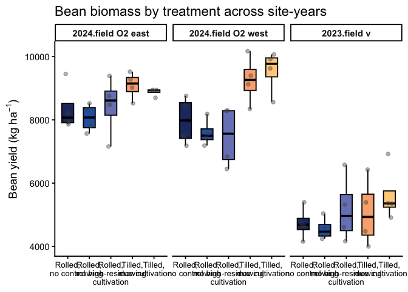
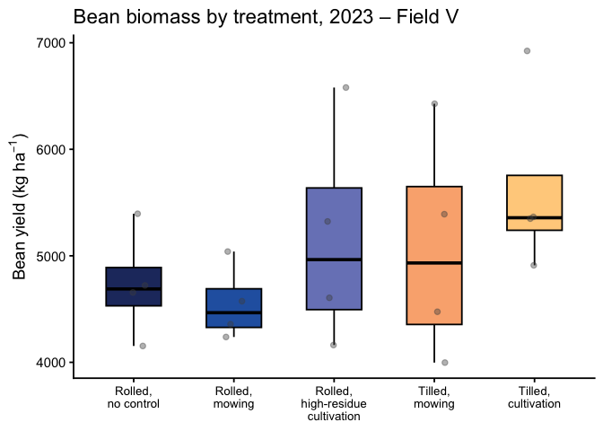
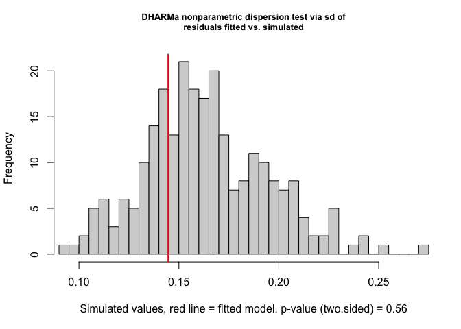
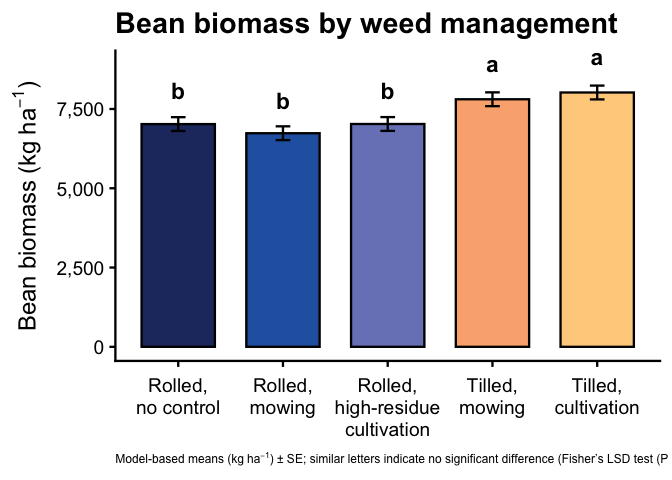
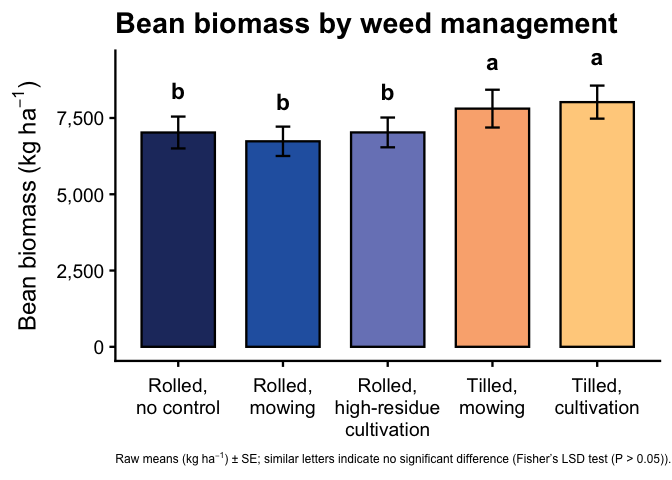

Soybean biomass
================

- [Setup](#setup)
- [Packages](#packages)
- [Data import & prep](#data-import--prep)
- [Model testing](#model-testing)
  - [Exploratory Analysis: Soybean
    biomass](#exploratory-analysis-soybean-biomass)
    - [Selection:](#selection)
    - [Post-hoc summary table](#post-hoc-summary-table)
    - [ANOVA-style summary tables for bean
      biomass](#anova-style-summary-tables-for-bean-biomass)
- [Figures](#figures)
  - [Pooled model](#pooled-model)
  - [Pooled Raw](#pooled-raw)

# Setup

# Packages

``` r
# Packages
library(tidyverse) # includes dplyr, ggplot2, readr, tibble, etc.
library(janitor)
library(readxl)
library(glmmTMB)
library(DHARMa)
library(emmeans)
library(multcomp)
library(car)
library(kableExtra)
library(here)
library(conflicted)
library(lme4)

# Handle conflicts
conflicts_prefer(dplyr::select)
conflicts_prefer(dplyr::filter)
conflicts_prefer(dplyr::recode)

# Treatment level order (use everywhere)
mow_levels <- c(
"Rolled, no control",
"Rolled + mowing",
"Rolled + high-residue cult.",
"Tilled + mowing",
"Tilled + cultivation"
)

# One consistent color palette for all figures

fill_cols <- c(
"Rolled, no control" = "#0072B2", # blue
"Rolled + mowing" = "#009E73", # green
"Rolled + high-residue cult." = "#F0E442", # yellow
"Tilled + mowing" = "#D55E00", # reddish
"Tilled + cultivation" = "#CC79A7" # magenta
)

#x-axis label helpers

label_break_spaces <- function(x) {
  stringr::str_replace_all(x, " ", "\n")
}

label_break_plus <- function(x) {
  stringr::str_replace_all(x, " \\+ ", "\n+ ")
}


#Helper: tidy emmeans output regardless of CI column names
#(works directly on an emmeans object)

tidy_emm <- function(emm, ref_levels = NULL) {
emm_df <- as.data.frame(emm)

lcl_col <- intersect(c("lower.CL", "asymp.LCL"), names(emm_df))[1]
ucl_col <- intersect(c("upper.CL", "asymp.UCL"), names(emm_df))[1]

if (is.na(lcl_col) || is.na(ucl_col)) {
stop("Could not find CI columns in emmeans output.")
}

out <- emm_df |>
mutate(
ci_low = .data[[lcl_col]],
ci_high = .data[[ucl_col]]
)

if (!is.null(ref_levels) && "weed_trt" %in% names(out)) {
out <- out |>
mutate(weed_trt = factor(weed_trt, levels = ref_levels))
}

out
}
```

# Data import & prep

``` r
bean_biomass_clean <- read_excel(
  here("data", "raw", "All Treatments", "combined_raw.xlsx")
) |>
  clean_names() |>
  rename(weed_trt = treatment) |>
  mutate(
    year      = factor(year),
    location  = factor(location),
    site_year = factor(interaction(year, location, drop = TRUE)),
    block     = factor(block),
    weed_trt  = recode(
      weed_trt,
      "RNO" = "Rolled, no control",
      "RIM" = "Rolled + mowing",
      "RIC" = "Rolled + high-residue cult.",
      "TIM" = "Tilled + mowing",
      "TIC" = "Tilled + cultivation"
    ),
    weed_trt = factor(weed_trt, levels = mow_levels)
  ) |>
  # keep only rows with non-missing biomass
  filter(!is.na(bean_biomass)) |>
  # per-area metrics, assuming bean_biomass = g per 0.5 m² quadrat
  mutate(
    bean_biomass_g_m2   = bean_biomass * 2,          # g/m²
    bean_biomass_kg_ha  = bean_biomass * 20,         # kg/ha
    bean_biomass_lbs_acre = bean_biomass_kg_ha * 0.892179
  )

# 2023 Field V subset (for the boxplot later)
bean_biomass_field_v_2023 <- bean_biomass_clean |>
  filter(year == 2023, location == "field v")

# Quick check
kable(
  head(bean_biomass_clean),
  caption = "All site-years, cleaned (bean biomass)"
)
```

| id | location | year | weed_trt | block | plot | bean_emergence | bean_biomass | inrow_weed_biomass | interrow_weed_biomass | weed_biomass | bean_population | bean_yield | seed_weight | site_year | bean_biomass_g_m2 | bean_biomass_kg_ha | bean_biomass_lbs_acre |
|:---|:---|:---|:---|:---|---:|---:|---:|---:|---:|---:|---:|---:|---:|:---|---:|---:|---:|
| CU_B1_P101 | field v | 2023 | Tilled + mowing | 1 | 101 | 46.5 | 223.740 | 19.000 | 44.490 | 63.490 | 34.5 | 417.21 | 17.1200 | 2023.field v | 447.48 | 4474.8 | 3992.323 |
| CU_B1_P102 | field v | 2023 | Tilled + cultivation | 1 | 102 | 42.5 | 267.460 | 30.975 | 0.720 | 31.695 | 39.5 | 565.54 | 17.4750 | 2023.field v | 534.92 | 5349.2 | 4772.444 |
| CU_B1_P103 | field v | 2023 | Rolled + mowing | 1 | 103 | 36.5 | 217.890 | 0.950 | 6.890 | 7.840 | 37.5 | 449.93 | 16.7525 | 2023.field v | 435.78 | 4357.8 | 3887.938 |
| CU_B1_P104 | field v | 2023 | Rolled, no control | 1 | 104 | 41.0 | 207.675 | 0.660 | 45.735 | 46.395 | 35.0 | 412.59 | 16.1450 | 2023.field v | 415.35 | 4153.5 | 3705.665 |
| CU_B1_P105 | field v | 2023 | Rolled + high-residue cult. | 1 | 105 | 41.0 | 230.285 | 0.495 | 22.025 | 22.520 | 39.0 | 473.79 | 17.0475 | 2023.field v | 460.57 | 4605.7 | 4109.109 |
| CU_B1_P201 | field v | 2023 | Rolled + high-residue cult. | 2 | 201 | 36.5 | 208.105 | 6.395 | 19.460 | 25.855 | 33.5 | 484.04 | 17.1500 | 2023.field v | 416.21 | 4162.1 | 3713.338 |

All site-years, cleaned (bean biomass)

# Model testing

## Exploratory Analysis: Soybean biomass

``` r
# 1) Summary table: bean biomass by site-year × treatment
bean_biomass_clean |>
  group_by(site_year, weed_trt) |>
  summarise(
    n      = n(),
    mean   = mean(bean_biomass_kg_ha, na.rm = TRUE),
    median = median(bean_biomass_kg_ha, na.rm = TRUE),
    sd     = sd(bean_biomass_kg_ha, na.rm = TRUE),
    .groups = "drop"
  ) |>
  arrange(site_year, weed_trt) |>
  kable(
    digits  = 1,
    caption = "Bean biomass (kg/ha) by site-year × treatment"
  ) |>
  kable_styling(full_width = FALSE, bootstrap_options = c("striped", "hover"))
```

<table class="table table-striped table-hover" style="color: black; width: auto !important; margin-left: auto; margin-right: auto;">

<caption>

Bean biomass (kg/ha) by site-year × treatment
</caption>

<thead>

<tr>

<th style="text-align:left;">

site_year
</th>

<th style="text-align:left;">

weed_trt
</th>

<th style="text-align:right;">

n
</th>

<th style="text-align:right;">

mean
</th>

<th style="text-align:right;">

median
</th>

<th style="text-align:right;">

sd
</th>

</tr>

</thead>

<tbody>

<tr>

<td style="text-align:left;">

2024.field O2 east
</td>

<td style="text-align:left;">

Rolled, no control
</td>

<td style="text-align:right;">

4
</td>

<td style="text-align:right;">

8364.9
</td>

<td style="text-align:right;">

8072.2
</td>

<td style="text-align:right;">

741.7
</td>

</tr>

<tr>

<td style="text-align:left;">

2024.field O2 east
</td>

<td style="text-align:left;">

Rolled + mowing
</td>

<td style="text-align:right;">

4
</td>

<td style="text-align:right;">

8061.0
</td>

<td style="text-align:right;">

8076.2
</td>

<td style="text-align:right;">

445.9
</td>

</tr>

<tr>

<td style="text-align:left;">

2024.field O2 east
</td>

<td style="text-align:left;">

Rolled + high-residue cult.
</td>

<td style="text-align:right;">

4
</td>

<td style="text-align:right;">

8444.7
</td>

<td style="text-align:right;">

8613.2
</td>

<td style="text-align:right;">

939.2
</td>

</tr>

<tr>

<td style="text-align:left;">

2024.field O2 east
</td>

<td style="text-align:left;">

Tilled + mowing
</td>

<td style="text-align:right;">

4
</td>

<td style="text-align:right;">

9086.5
</td>

<td style="text-align:right;">

9150.0
</td>

<td style="text-align:right;">

429.0
</td>

</tr>

<tr>

<td style="text-align:left;">

2024.field O2 east
</td>

<td style="text-align:left;">

Tilled + cultivation
</td>

<td style="text-align:right;">

4
</td>

<td style="text-align:right;">

8878.4
</td>

<td style="text-align:right;">

8933.2
</td>

<td style="text-align:right;">

120.2
</td>

</tr>

<tr>

<td style="text-align:left;">

2024.field O2 west
</td>

<td style="text-align:left;">

Rolled, no control
</td>

<td style="text-align:right;">

4
</td>

<td style="text-align:right;">

7976.3
</td>

<td style="text-align:right;">

7982.0
</td>

<td style="text-align:right;">

755.6
</td>

</tr>

<tr>

<td style="text-align:left;">

2024.field O2 west
</td>

<td style="text-align:left;">

Rolled + mowing
</td>

<td style="text-align:right;">

4
</td>

<td style="text-align:right;">

7593.7
</td>

<td style="text-align:right;">

7499.0
</td>

<td style="text-align:right;">

426.1
</td>

</tr>

<tr>

<td style="text-align:left;">

2024.field O2 west
</td>

<td style="text-align:left;">

Rolled + high-residue cult.
</td>

<td style="text-align:right;">

4
</td>

<td style="text-align:right;">

7468.9
</td>

<td style="text-align:right;">

7563.8
</td>

<td style="text-align:right;">

964.6
</td>

</tr>

<tr>

<td style="text-align:left;">

2024.field O2 west
</td>

<td style="text-align:left;">

Tilled + mowing
</td>

<td style="text-align:right;">

4
</td>

<td style="text-align:right;">

9261.5
</td>

<td style="text-align:right;">

9263.3
</td>

<td style="text-align:right;">

754.3
</td>

</tr>

<tr>

<td style="text-align:left;">

2024.field O2 west
</td>

<td style="text-align:left;">

Tilled + cultivation
</td>

<td style="text-align:right;">

4
</td>

<td style="text-align:right;">

9544.9
</td>

<td style="text-align:right;">

9774.1
</td>

<td style="text-align:right;">

682.1
</td>

</tr>

<tr>

<td style="text-align:left;">

2023.field v
</td>

<td style="text-align:left;">

Rolled, no control
</td>

<td style="text-align:right;">

4
</td>

<td style="text-align:right;">

4731.6
</td>

<td style="text-align:right;">

4688.9
</td>

<td style="text-align:right;">

509.9
</td>

</tr>

<tr>

<td style="text-align:left;">

2023.field v
</td>

<td style="text-align:left;">

Rolled + mowing
</td>

<td style="text-align:right;">

4
</td>

<td style="text-align:right;">

4552.4
</td>

<td style="text-align:right;">

4465.8
</td>

<td style="text-align:right;">

353.6
</td>

</tr>

<tr>

<td style="text-align:left;">

2023.field v
</td>

<td style="text-align:left;">

Rolled + high-residue cult.
</td>

<td style="text-align:right;">

4
</td>

<td style="text-align:right;">

5167.6
</td>

<td style="text-align:right;">

4964.2
</td>

<td style="text-align:right;">

1056.0
</td>

</tr>

<tr>

<td style="text-align:left;">

2023.field v
</td>

<td style="text-align:left;">

Tilled + mowing
</td>

<td style="text-align:right;">

4
</td>

<td style="text-align:right;">

5072.6
</td>

<td style="text-align:right;">

4932.8
</td>

<td style="text-align:right;">

1072.4
</td>

</tr>

<tr>

<td style="text-align:left;">

2023.field v
</td>

<td style="text-align:left;">

Tilled + cultivation
</td>

<td style="text-align:right;">

4
</td>

<td style="text-align:right;">

5637.2
</td>

<td style="text-align:right;">

5357.3
</td>

<td style="text-align:right;">

883.0
</td>

</tr>

</tbody>

</table>

``` r
# 2) Faceted boxplot: all site-years
bean_biomass_clean |>
  ggplot(aes(x = weed_trt, y = bean_biomass_kg_ha, fill = weed_trt)) +
  geom_boxplot(
    outlier.shape = NA,
    width  = 0.55,
    color  = "black"
  ) +
  geom_jitter(
    width  = 0.12,
    height = 0,
    alpha  = 0.4,
    size   = 1.8,
    color  = "grey30"
  ) +
  facet_wrap(~ site_year, nrow = 1, scales = "free_y") +
  scale_fill_manual(values = fill_cols, guide = "none") +
  scale_x_discrete(labels = label_break_plus) +
  labs(
    x     = NULL,
    y     = "Bean biomass (kg/ha)",
    title = "Bean biomass by treatment across site-years"
  ) +
  theme_classic(base_size = 14) +
  theme(
    axis.text.x = element_text(size = 10),
    strip.text  = element_text(face = "bold")
  )
```

<!-- -->

``` r
# 3) Boxplot: 2023 – Field V only
bean_biomass_field_v_2023 |>
  ggplot(aes(x = weed_trt, y = bean_biomass_kg_ha, fill = weed_trt)) +
  geom_boxplot(
    outlier.shape = NA,
    width  = 0.55,
    color  = "black"
  ) +
  geom_jitter(
    width  = 0.12,
    height = 0,
    alpha  = 0.4,
    size   = 1.8,
    color  = "grey30"
  ) +
  scale_fill_manual(values = fill_cols, guide = "none") +
  scale_x_discrete(labels = label_break_plus) +
  labs(
    x     = NULL,
    y     = "Bean biomass (kg/ha)",
    title = "Bean biomass by treatment, 2023 – Field V"
  ) +
  theme_classic(base_size = 14) +
  theme(
    axis.text.x = element_text(size = 10)
  )
```

<!-- -->

### Selection:

#### Pooled, Raw by site-year

``` r
### Model testing / selection for bean biomass (kg/ha)

options(contrasts = c("contr.sum", "contr.poly"))

# Interaction model: weed_trt * site_year --------------------------------
bio_int <- lmer(
  bean_biomass_kg_ha ~ weed_trt * site_year + (1 | site_year:block),
  data = bean_biomass_clean
)

# Additive model: weed_trt + site_year -----------------------------------
bio_add <- lmer(
  bean_biomass_kg_ha ~ weed_trt + site_year + (1 | site_year:block),
  data = bean_biomass_clean
)

# Compare models (AIC + LRT) ---------------------------------------------
aic_biomass <- tibble(
  model = c(
    "Additive: weed_trt + site_year",
    "Interaction: weed_trt * site_year"
  ),
  AIC = c(AIC(bio_add), AIC(bio_int))
)

kable(
  aic_biomass,
  digits  = 1,
  caption = "Bean biomass (kg/ha): model comparison (additive vs interaction)"
)
```

| model                              |   AIC |
|:-----------------------------------|------:|
| Additive: weed_trt + site_year     | 891.0 |
| Interaction: weed_trt \* site_year | 794.6 |

Bean biomass (kg/ha): model comparison (additive vs interaction)

``` r
anova(bio_add, bio_int)  # LRT: is the interaction worth keeping?
```

    ## Data: bean_biomass_clean
    ## Models:
    ## bio_add: bean_biomass_kg_ha ~ weed_trt + site_year + (1 | site_year:block)
    ## bio_int: bean_biomass_kg_ha ~ weed_trt * site_year + (1 | site_year:block)
    ##         npar    AIC     BIC  logLik -2*log(L)  Chisq Df Pr(>Chisq)  
    ## bio_add    9 973.98  992.83 -477.99    955.98                       
    ## bio_int   17 975.58 1011.18 -470.79    941.58 14.401  8     0.0719 .
    ## ---
    ## Signif. codes:  0 '***' 0.001 '**' 0.01 '*' 0.05 '.' 0.1 ' ' 1

``` r
# Choose simpler additive model unless interaction is clearly needed -----
# (this is the model used in all downstream emmeans/plots)
bio.lmer <- bio_add

# Diagnostics on chosen model --------------------------------------------
set.seed(123)
res_bio <- DHARMa::simulateResiduals(bio.lmer)
plot(res_bio)
```

<!-- -->

``` r
DHARMa::testDispersion(bio.lmer)
```

<!-- -->

    ## 
    ##  DHARMa nonparametric dispersion test via sd of residuals fitted vs.
    ##  simulated
    ## 
    ## data:  simulationOutput
    ## dispersion = 0.8834, p-value = 0.56
    ## alternative hypothesis: two.sided

``` r
car::Anova(bio.lmer, type = 3)
```

    ## Analysis of Deviance Table (Type III Wald chisquare tests)
    ## 
    ## Response: bean_biomass_kg_ha
    ##                Chisq Df Pr(>Chisq)    
    ## (Intercept) 3676.809  1  < 2.2e-16 ***
    ## weed_trt      30.258  4  4.337e-06 ***
    ## site_year    180.317  2  < 2.2e-16 ***
    ## ---
    ## Signif. codes:  0 '***' 0.001 '**' 0.01 '*' 0.05 '.' 0.1 ' ' 1

### Post-hoc summary table

``` r
### Bean biomass (kg/ha) with Fisher's LSD CLDs

# Estimated marginal means for weed_trt
emm_bio <- emmeans(bio.lmer, ~ weed_trt)

# Tidy emmeans (adds ci_low / ci_high and enforces treatment order)
emm_bio_df <- tidy_emm(emm_bio, ref_levels = mow_levels) |>
  as_tibble()

# Compact letter display (Fisher's LSD, no adjustment; "a" = highest)
cld_bio <- cld(
  emm_bio,
  adjust  = "none",
  Letters = letters,
  sort    = TRUE,   # default, but explicit
  reversed = TRUE   # now 'a' goes to the highest group(s)
) |>
  as_tibble() |>
  mutate(
    weed_trt = factor(weed_trt, levels = mow_levels),
    .group   = str_trim(.group)
  ) |>
  select(weed_trt, .group)

# Join emmeans + CLDs and format for reporting
emm_bio_df |>
  left_join(cld_bio, by = "weed_trt") |>
  select(weed_trt, emmean, SE, ci_low, ci_high, .group) |>
  mutate(across(c(emmean, SE, ci_low, ci_high), ~ round(.x, 1))) |>
  kable(
    caption   = "Estimated bean biomass (kg/ha) with 95% CI and Fisher's LSD group letters",
    col.names = c("Treatment", "Mean", "SE", "Lower CI", "Upper CI", "Group")
  ) |>
  kable_styling(full_width = FALSE, bootstrap_options = c("striped", "hover"))
```

<table class="table table-striped table-hover" style="color: black; width: auto !important; margin-left: auto; margin-right: auto;">

<caption>

Estimated bean biomass (kg/ha) with 95% CI and Fisher’s LSD group
letters
</caption>

<thead>

<tr>

<th style="text-align:left;">

Treatment
</th>

<th style="text-align:right;">

Mean
</th>

<th style="text-align:right;">

SE
</th>

<th style="text-align:right;">

Lower CI
</th>

<th style="text-align:right;">

Upper CI
</th>

<th style="text-align:left;">

Group
</th>

</tr>

</thead>

<tbody>

<tr>

<td style="text-align:left;">

Rolled, no control
</td>

<td style="text-align:right;">

7024.2
</td>

<td style="text-align:right;">

217.8
</td>

<td style="text-align:right;">

6586.1
</td>

<td style="text-align:right;">

7462.4
</td>

<td style="text-align:left;">

b
</td>

</tr>

<tr>

<td style="text-align:left;">

Rolled + mowing
</td>

<td style="text-align:right;">

6735.7
</td>

<td style="text-align:right;">

217.8
</td>

<td style="text-align:right;">

6297.5
</td>

<td style="text-align:right;">

7173.8
</td>

<td style="text-align:left;">

b
</td>

</tr>

<tr>

<td style="text-align:left;">

Rolled + high-residue cult.
</td>

<td style="text-align:right;">

7027.1
</td>

<td style="text-align:right;">

217.8
</td>

<td style="text-align:right;">

6588.9
</td>

<td style="text-align:right;">

7465.2
</td>

<td style="text-align:left;">

b
</td>

</tr>

<tr>

<td style="text-align:left;">

Tilled + mowing
</td>

<td style="text-align:right;">

7806.9
</td>

<td style="text-align:right;">

217.8
</td>

<td style="text-align:right;">

7368.7
</td>

<td style="text-align:right;">

8245.0
</td>

<td style="text-align:left;">

a
</td>

</tr>

<tr>

<td style="text-align:left;">

Tilled + cultivation
</td>

<td style="text-align:right;">

8020.2
</td>

<td style="text-align:right;">

217.8
</td>

<td style="text-align:right;">

7582.0
</td>

<td style="text-align:right;">

8458.3
</td>

<td style="text-align:left;">

a
</td>

</tr>

</tbody>

</table>

### ANOVA-style summary tables for bean biomass

``` r
## 1) P-value summary (Location, Treatment, Interaction) -----------------

# Type-III tests for additive model (weed_trt + site_year)
anova_bio <- Anova(bio.lmer, type = 3)

anova_bio_df <- anova_bio |>
  as.data.frame() |>
  tibble::rownames_to_column("Effect")

# LRT for interaction (additive vs interaction models)
anova_interaction_bio <- anova(bio_add, bio_int)

pvals_bio <- tibble(
  Effect = c("Location (site_year)", "Treatment (weed_trt)", "Location × Treatment"),
  p_raw  = c(
    anova_bio_df$`Pr(>Chisq)`[anova_bio_df$Effect == "site_year"],
    anova_bio_df$`Pr(>Chisq)`[anova_bio_df$Effect == "weed_trt"],
    anova_interaction_bio$`Pr(>Chisq)`[2]
  )
) |>
  mutate(
    `P-value` = case_when(
      p_raw < 0.001 ~ "<0.001",
      p_raw < 0.01  ~ "<0.01",
      TRUE          ~ sprintf("%.3f", p_raw)
    )
  ) |>
  select(Effect, `P-value`)

pvals_bio |>
  kable(
    caption   = "Bean biomass (kg/ha): P-values for location, treatment, and interaction",
    col.names = c("Effect", "P-value")
  ) |>
  kable_styling(full_width = FALSE, bootstrap_options = c("striped", "hover"))
```

<table class="table table-striped table-hover" style="color: black; width: auto !important; margin-left: auto; margin-right: auto;">

<caption>

Bean biomass (kg/ha): P-values for location, treatment, and interaction
</caption>

<thead>

<tr>

<th style="text-align:left;">

Effect
</th>

<th style="text-align:left;">

P-value
</th>

</tr>

</thead>

<tbody>

<tr>

<td style="text-align:left;">

Location (site_year)
</td>

<td style="text-align:left;">

\<0.001
</td>

</tr>

<tr>

<td style="text-align:left;">

Treatment (weed_trt)
</td>

<td style="text-align:left;">

\<0.001
</td>

</tr>

<tr>

<td style="text-align:left;">

Location × Treatment
</td>

<td style="text-align:left;">

0.072
</td>

</tr>

</tbody>

</table>

``` r
## 2) Location block: site-year means (model + raw) ----------------------

# Model-based emmeans by site_year
emm_loc_bio <- emmeans(bio.lmer, ~ site_year)

emm_loc_bio_df <- tidy_emm(emm_loc_bio) |>
  as_tibble() |>
  mutate(
    site_year  = as.factor(site_year),
    model_mean = emmean
  ) |>
  select(site_year, model_mean)

# CLDs for site_year (a = highest)
cld_loc_bio <- cld(
  emm_loc_bio,
  adjust   = "none",
  Letters  = letters,
  sort     = TRUE,
  reversed = TRUE
) |>
  as_tibble() |>
  mutate(
    site_year = as.factor(site_year),
    loc_CLD   = str_trim(.group)
  ) |>
  select(site_year, loc_CLD)

# Raw means by site_year
raw_loc_bio <- bean_biomass_clean |>
  group_by(site_year) |>
  summarise(
    raw_mean = mean(bean_biomass_kg_ha, na.rm = TRUE),
    .groups  = "drop"
  ) |>
  mutate(site_year = as.factor(site_year))

loc_summary_bio <- emm_loc_bio_df |>
  left_join(cld_loc_bio, by = "site_year") |>
  left_join(raw_loc_bio, by = "site_year") |>
  mutate(
    model_mean = round(model_mean, 1),
    raw_mean   = round(raw_mean, 1),
    raw_CLD    = loc_CLD  # use same letters for model + raw
  ) |>
  arrange(site_year)

loc_summary_bio |>
  kable(
    caption   = "Bean biomass (kg/ha): location (site-year) means with CLDs",
    col.names = c("Site-year", "Model mean", "Model CLD", "Raw mean", "Raw CLD")
  ) |>
  kable_styling(full_width = FALSE, bootstrap_options = c("striped", "hover"))
```

<table class="table table-striped table-hover" style="color: black; width: auto !important; margin-left: auto; margin-right: auto;">

<caption>

Bean biomass (kg/ha): location (site-year) means with CLDs
</caption>

<thead>

<tr>

<th style="text-align:left;">

Site-year
</th>

<th style="text-align:right;">

Model mean
</th>

<th style="text-align:left;">

Model CLD
</th>

<th style="text-align:right;">

Raw mean
</th>

<th style="text-align:left;">

Raw CLD
</th>

</tr>

</thead>

<tbody>

<tr>

<td style="text-align:left;">

2024.field O2 east
</td>

<td style="text-align:right;">

8567.1
</td>

<td style="text-align:left;">

a
</td>

<td style="text-align:right;">

8567.1
</td>

<td style="text-align:left;">

a
</td>

</tr>

<tr>

<td style="text-align:left;">

2024.field O2 west
</td>

<td style="text-align:right;">

8369.0
</td>

<td style="text-align:left;">

a
</td>

<td style="text-align:right;">

8369.0
</td>

<td style="text-align:left;">

a
</td>

</tr>

<tr>

<td style="text-align:left;">

2023.field v
</td>

<td style="text-align:right;">

5032.3
</td>

<td style="text-align:left;">

b
</td>

<td style="text-align:right;">

5032.3
</td>

<td style="text-align:left;">

b
</td>

</tr>

</tbody>

</table>

``` r
## 3) Treatment block: means (model + raw) -------------------------------

# emmeans for treatment
emm_bio <- emmeans(bio.lmer, ~ weed_trt)

emm_trt_bio_df <- tidy_emm(emm_bio, ref_levels = mow_levels) |>
  as_tibble() |>
  mutate(
    weed_trt   = factor(weed_trt, levels = mow_levels),
    model_mean = emmean
  ) |>
  select(weed_trt, model_mean)

# CLDs for treatment (a = highest)
cld_bio <- cld(
  emm_bio,
  adjust   = "none",
  Letters  = letters,
  sort     = TRUE,
  reversed = TRUE
) |>
  as_tibble() |>
  mutate(
    weed_trt = factor(weed_trt, levels = mow_levels),
    trt_CLD  = str_trim(.group)
  ) |>
  select(weed_trt, trt_CLD)

# Raw means by treatment
raw_trt_bio <- bean_biomass_clean |>
  group_by(weed_trt) |>
  summarise(
    raw_mean = mean(bean_biomass_kg_ha, na.rm = TRUE),
    .groups  = "drop"
  ) |>
  mutate(weed_trt = factor(weed_trt, levels = mow_levels))

trt_summary_bio <- emm_trt_bio_df |>
  left_join(cld_bio, by = "weed_trt") |>
  left_join(raw_trt_bio, by = "weed_trt") |>
  mutate(
    model_mean = round(model_mean, 1),
    raw_mean   = round(raw_mean, 1),
    raw_CLD    = trt_CLD
  ) |>
  arrange(weed_trt)

trt_summary_bio |>
  kable(
    caption   = "Bean biomass (kg/ha): treatment means with CLDs",
    col.names = c("Treatment", "Model mean", "Model CLD", "Raw mean", "Raw CLD")
  ) |>
  kable_styling(full_width = FALSE, bootstrap_options = c("striped", "hover"))
```

<table class="table table-striped table-hover" style="color: black; width: auto !important; margin-left: auto; margin-right: auto;">

<caption>

Bean biomass (kg/ha): treatment means with CLDs
</caption>

<thead>

<tr>

<th style="text-align:left;">

Treatment
</th>

<th style="text-align:right;">

Model mean
</th>

<th style="text-align:left;">

Model CLD
</th>

<th style="text-align:right;">

Raw mean
</th>

<th style="text-align:left;">

Raw CLD
</th>

</tr>

</thead>

<tbody>

<tr>

<td style="text-align:left;">

Rolled, no control
</td>

<td style="text-align:right;">

7024.2
</td>

<td style="text-align:left;">

b
</td>

<td style="text-align:right;">

7024.2
</td>

<td style="text-align:left;">

b
</td>

</tr>

<tr>

<td style="text-align:left;">

Rolled + mowing
</td>

<td style="text-align:right;">

6735.7
</td>

<td style="text-align:left;">

b
</td>

<td style="text-align:right;">

6735.7
</td>

<td style="text-align:left;">

b
</td>

</tr>

<tr>

<td style="text-align:left;">

Rolled + high-residue cult.
</td>

<td style="text-align:right;">

7027.1
</td>

<td style="text-align:left;">

b
</td>

<td style="text-align:right;">

7027.1
</td>

<td style="text-align:left;">

b
</td>

</tr>

<tr>

<td style="text-align:left;">

Tilled + mowing
</td>

<td style="text-align:right;">

7806.9
</td>

<td style="text-align:left;">

a
</td>

<td style="text-align:right;">

7806.9
</td>

<td style="text-align:left;">

a
</td>

</tr>

<tr>

<td style="text-align:left;">

Tilled + cultivation
</td>

<td style="text-align:right;">

8020.2
</td>

<td style="text-align:left;">

a
</td>

<td style="text-align:right;">

8020.2
</td>

<td style="text-align:left;">

a
</td>

</tr>

</tbody>

</table>

``` r
## 4) Interaction block: site-year × treatment means ---------------------

# Model emmeans by treatment within site_year
emm_sy_bio <- emmeans(bio.lmer, ~ weed_trt | site_year)

emm_sy_bio_df <- tidy_emm(emm_sy_bio, ref_levels = mow_levels) |>
  as_tibble() |>
  mutate(
    weed_trt   = factor(weed_trt, levels = mow_levels),
    site_year  = as.factor(site_year),
    model_mean = emmean
  ) |>
  select(site_year, weed_trt, model_mean)

# CLDs within each site_year (a = highest within that site_year)
cld_sy_bio <- cld(
  emm_sy_bio,
  adjust   = "none",
  Letters  = letters,
  sort     = TRUE,
  reversed = TRUE
) |>
  as_tibble() |>
  mutate(
    weed_trt  = factor(weed_trt, levels = mow_levels),
    site_year = as.factor(site_year),
    int_CLD   = str_trim(.group)
  ) |>
  select(site_year, weed_trt, int_CLD)

# Raw means by site_year × treatment
raw_sy_bio <- bean_biomass_clean |>
  group_by(site_year, weed_trt) |>
  summarise(
    raw_mean = mean(bean_biomass_kg_ha, na.rm = TRUE),
    .groups  = "drop"
  ) |>
  mutate(
    site_year = as.factor(site_year),
    weed_trt  = factor(weed_trt, levels = mow_levels)
  )

int_summary_bio <- emm_sy_bio_df |>
  left_join(cld_sy_bio, by = c("site_year", "weed_trt")) |>
  left_join(raw_sy_bio, by = c("site_year", "weed_trt")) |>
  mutate(
    model_mean = round(model_mean, 1),
    raw_mean   = round(raw_mean, 1),
    raw_CLD    = int_CLD
  ) |>
  arrange(site_year, weed_trt)

int_summary_bio |>
  kable(
    caption   = "Bean biomass (kg/ha): site-year × treatment means with CLDs",
    col.names = c(
      "Site-year", "Treatment",
      "Model mean", "Model CLD",
      "Raw mean",   "Raw CLD"
    )
  ) |>
  kable_styling(full_width = FALSE, bootstrap_options = c("striped", "hover"))
```

<table class="table table-striped table-hover" style="color: black; width: auto !important; margin-left: auto; margin-right: auto;">

<caption>

Bean biomass (kg/ha): site-year × treatment means with CLDs
</caption>

<thead>

<tr>

<th style="text-align:left;">

Site-year
</th>

<th style="text-align:left;">

Treatment
</th>

<th style="text-align:right;">

Model mean
</th>

<th style="text-align:left;">

Model CLD
</th>

<th style="text-align:right;">

Raw mean
</th>

<th style="text-align:left;">

Raw CLD
</th>

</tr>

</thead>

<tbody>

<tr>

<td style="text-align:left;">

2024.field O2 east
</td>

<td style="text-align:left;">

Rolled, no control
</td>

<td style="text-align:right;">

8268.6
</td>

<td style="text-align:left;">

b
</td>

<td style="text-align:right;">

8364.9
</td>

<td style="text-align:left;">

b
</td>

</tr>

<tr>

<td style="text-align:left;">

2024.field O2 east
</td>

<td style="text-align:left;">

Rolled + mowing
</td>

<td style="text-align:right;">

7980.0
</td>

<td style="text-align:left;">

b
</td>

<td style="text-align:right;">

8061.0
</td>

<td style="text-align:left;">

b
</td>

</tr>

<tr>

<td style="text-align:left;">

2024.field O2 east
</td>

<td style="text-align:left;">

Rolled + high-residue cult.
</td>

<td style="text-align:right;">

8271.4
</td>

<td style="text-align:left;">

b
</td>

<td style="text-align:right;">

8444.7
</td>

<td style="text-align:left;">

b
</td>

</tr>

<tr>

<td style="text-align:left;">

2024.field O2 east
</td>

<td style="text-align:left;">

Tilled + mowing
</td>

<td style="text-align:right;">

9051.2
</td>

<td style="text-align:left;">

a
</td>

<td style="text-align:right;">

9086.5
</td>

<td style="text-align:left;">

a
</td>

</tr>

<tr>

<td style="text-align:left;">

2024.field O2 east
</td>

<td style="text-align:left;">

Tilled + cultivation
</td>

<td style="text-align:right;">

9264.5
</td>

<td style="text-align:left;">

a
</td>

<td style="text-align:right;">

8878.4
</td>

<td style="text-align:left;">

a
</td>

</tr>

<tr>

<td style="text-align:left;">

2024.field O2 west
</td>

<td style="text-align:left;">

Rolled, no control
</td>

<td style="text-align:right;">

8070.5
</td>

<td style="text-align:left;">

b
</td>

<td style="text-align:right;">

7976.3
</td>

<td style="text-align:left;">

b
</td>

</tr>

<tr>

<td style="text-align:left;">

2024.field O2 west
</td>

<td style="text-align:left;">

Rolled + mowing
</td>

<td style="text-align:right;">

7781.9
</td>

<td style="text-align:left;">

b
</td>

<td style="text-align:right;">

7593.7
</td>

<td style="text-align:left;">

b
</td>

</tr>

<tr>

<td style="text-align:left;">

2024.field O2 west
</td>

<td style="text-align:left;">

Rolled + high-residue cult.
</td>

<td style="text-align:right;">

8073.3
</td>

<td style="text-align:left;">

b
</td>

<td style="text-align:right;">

7468.9
</td>

<td style="text-align:left;">

b
</td>

</tr>

<tr>

<td style="text-align:left;">

2024.field O2 west
</td>

<td style="text-align:left;">

Tilled + mowing
</td>

<td style="text-align:right;">

8853.1
</td>

<td style="text-align:left;">

a
</td>

<td style="text-align:right;">

9261.5
</td>

<td style="text-align:left;">

a
</td>

</tr>

<tr>

<td style="text-align:left;">

2024.field O2 west
</td>

<td style="text-align:left;">

Tilled + cultivation
</td>

<td style="text-align:right;">

9066.4
</td>

<td style="text-align:left;">

a
</td>

<td style="text-align:right;">

9544.9
</td>

<td style="text-align:left;">

a
</td>

</tr>

<tr>

<td style="text-align:left;">

2023.field v
</td>

<td style="text-align:left;">

Rolled, no control
</td>

<td style="text-align:right;">

4733.7
</td>

<td style="text-align:left;">

b
</td>

<td style="text-align:right;">

4731.6
</td>

<td style="text-align:left;">

b
</td>

</tr>

<tr>

<td style="text-align:left;">

2023.field v
</td>

<td style="text-align:left;">

Rolled + mowing
</td>

<td style="text-align:right;">

4445.1
</td>

<td style="text-align:left;">

b
</td>

<td style="text-align:right;">

4552.4
</td>

<td style="text-align:left;">

b
</td>

</tr>

<tr>

<td style="text-align:left;">

2023.field v
</td>

<td style="text-align:left;">

Rolled + high-residue cult.
</td>

<td style="text-align:right;">

4736.5
</td>

<td style="text-align:left;">

b
</td>

<td style="text-align:right;">

5167.6
</td>

<td style="text-align:left;">

b
</td>

</tr>

<tr>

<td style="text-align:left;">

2023.field v
</td>

<td style="text-align:left;">

Tilled + mowing
</td>

<td style="text-align:right;">

5516.3
</td>

<td style="text-align:left;">

a
</td>

<td style="text-align:right;">

5072.6
</td>

<td style="text-align:left;">

a
</td>

</tr>

<tr>

<td style="text-align:left;">

2023.field v
</td>

<td style="text-align:left;">

Tilled + cultivation
</td>

<td style="text-align:right;">

5729.6
</td>

<td style="text-align:left;">

a
</td>

<td style="text-align:right;">

5637.2
</td>

<td style="text-align:left;">

a
</td>

</tr>

</tbody>

</table>

# Figures

## Pooled model

``` r
# Figure: Bean biomass by weed management treatment (pooled across site-years)

# Estimated marginal means for treatments
emm_bio <- emmeans(bio.lmer, ~ weed_trt)

# Tidy emmeans for plotting
emm_bio_df <- tidy_emm(emm_bio, ref_levels = mow_levels) |>
  as_tibble() |>
  mutate(
    response = emmean,
    ymin     = pmax(response - SE, 0),
    ymax     = response + SE
  )

# CLDs for treatments (Fisher's LSD, "a" = highest)
cld_bio <- cld(
  emm_bio,
  adjust   = "none",
  Letters  = letters,
  sort     = TRUE,
  reversed = TRUE
) |>
  as_tibble() |>
  mutate(
    weed_trt = factor(weed_trt, levels = mow_levels),
    .group   = str_trim(.group)
  ) |>
  select(weed_trt, .group)

# Merge means and CLDs
plot_df_bio <- emm_bio_df |>
  left_join(cld_bio, by = "weed_trt")

# Plot
ggplot(plot_df_bio, aes(x = weed_trt, y = response, fill = weed_trt)) +
  geom_col(width = 0.7, color = "black") +
  geom_errorbar(aes(ymin = ymin, ymax = ymax), width = 0.14) +
  geom_text(
    aes(y = ymax * 1.08, label = .group),
    vjust    = 0,
    fontface = "bold",
    size     = 6
  ) +
  scale_fill_manual(values = fill_cols, guide = "none") +
  scale_x_discrete(labels = label_break_plus) +
  scale_y_continuous(labels = scales::label_comma()) +
  labs(
    x        = NULL,
    y        = "Bean biomass (kg/ha)",
    title    = "Bean biomass by weed management treatment",
    caption  = "Model-based means ± SE; letters = Fisher-style CLD for treatment main effect."
  ) +
  theme_classic(base_size = 18) +
  theme(
    axis.text.x  = element_text(lineheight = 0.95, margin = margin(t = 8)),
    axis.title.y = element_text(margin = margin(r = 8)),
    plot.title   = element_text(face = "bold")
  )
```

<!-- -->

``` r
# Save figure
ggsave(
  filename = here("figs", "analysis", "fig_bean_biomass_mowing_pooled.png"),
  width    = 7.5,
  height   = 5.5,
  dpi      = 300
)
```

## Pooled Raw

``` r
# Figure: Bean biomass by weed management treatment (raw means ± SE, model CLDs)

# 1) Raw means and SE by treatment --------------------------------------
raw_bio_summary <- bean_biomass_clean |>
  group_by(weed_trt) |>
  summarise(
    n    = n(),
    mean = mean(bean_biomass_kg_ha, na.rm = TRUE),
    sd   = sd(bean_biomass_kg_ha, na.rm = TRUE),
    se   = sd / sqrt(n),
    .groups = "drop"
  ) |>
  mutate(
    weed_trt = factor(weed_trt, levels = mow_levels),
    ymin     = pmax(mean - se, 0),
    ymax     = mean + se
  )

# 2) Model-based CLDs for treatment main effect -------------------------
emm_bio <- emmeans(bio.lmer, ~ weed_trt)

cld_bio <- cld(
  emm_bio,
  adjust   = "none",
  Letters  = letters,
  sort     = TRUE,
  reversed = TRUE   # "a" = highest mean
) |>
  as_tibble() |>
  mutate(
    weed_trt = factor(weed_trt, levels = mow_levels),
    .group   = str_trim(.group)
  ) |>
  select(weed_trt, .group)

# 3) Join raw means and model CLDs --------------------------------------
plot_df_bio_raw <- raw_bio_summary |>
  left_join(cld_bio, by = "weed_trt")

# 4) Plot ---------------------------------------------------------------
ggplot(plot_df_bio_raw, aes(x = weed_trt, y = mean, fill = weed_trt)) +
  geom_col(width = 0.7, color = "black") +
  geom_errorbar(aes(ymin = ymin, ymax = ymax), width = 0.14) +
  geom_text(
    aes(y = ymax * 1.08, label = .group),
    vjust    = 0,
    fontface = "bold",
    size     = 6
  ) +
  scale_fill_manual(values = fill_cols, guide = "none") +
  scale_x_discrete(labels = label_break_plus) +
  scale_y_continuous(labels = scales::label_comma()) +
  labs(
    x        = NULL,
    y        = "Bean biomass (kg/ha)",
    title    = "Bean biomass by weed management treatment",
    caption  = "Raw means ± SE; letters = model-based Fisher-style CLD for treatment main effect."
  ) +
  theme_classic(base_size = 18) +
  theme(
    axis.text.x  = element_text(lineheight = 0.95, margin = margin(t = 8)),
    axis.title.y = element_text(margin = margin(r = 8)),
    plot.title   = element_text(face = "bold")
  )
```

<!-- -->

``` r
# Save figure
ggsave(
  filename = here("figs", "analysis", "fig_bean_biomass_mowing_pooled_raw.png"),
  width    = 7.5,
  height   = 5.5,
  dpi      = 300
)
```
