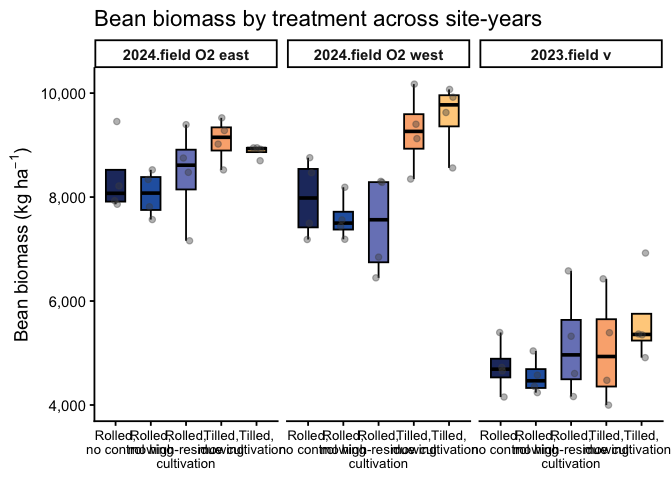
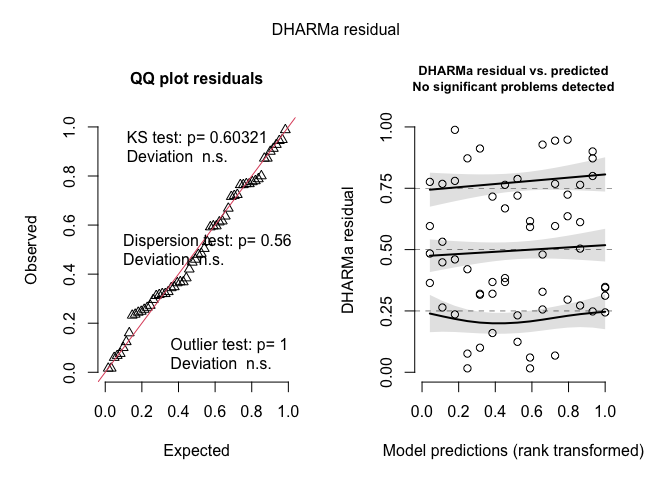
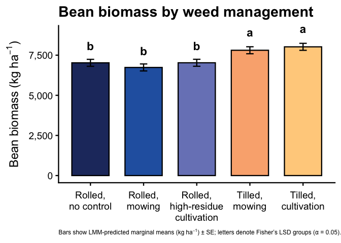
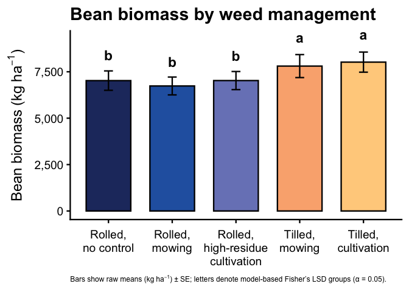
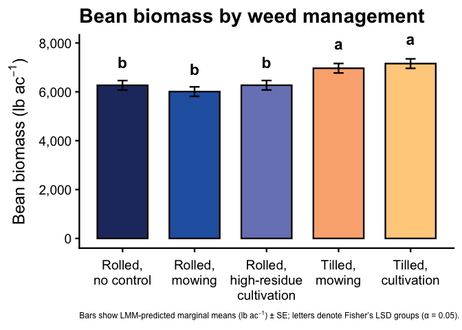
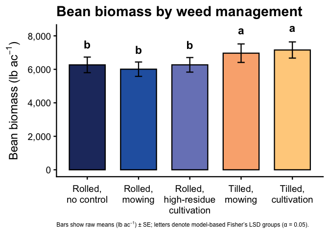

Soybean biomass
================

- [Setup](#setup)
- [Packages](#packages)
- [Data import and preparation](#data-import-and-preparation)
- [Model testing and diagnostics](#model-testing-and-diagnostics)
  - [Exploratory checks](#exploratory-checks)
  - [Model selection](#model-selection)
  - [Diagnostics (residuals, dispersion, zero
    inflation)](#diagnostics-residuals-dispersion-zero-inflation)
- [Summary tables](#summary-tables)
  - [Post-hoc treatment means and
    CLDs](#post-hoc-treatment-means-and-clds)
  - [Global response summary (ANOVA, AIC, model
    info)](#global-response-summary-anova-aic-model-info)
- [Figures](#figures)
  - [Model-predicted means (kg ha⁻¹)](#model-predicted-means-kg-ha¹)
  - [Raw means (kg ha⁻¹)](#raw-means-kg-ha¹)
  - [Extension figures (lb ac⁻¹)](#extension-figures-lb-ac¹)
    - [Model-predicted means (lb ac⁻¹)](#model-predicted-means-lb-ac¹)
    - [Raw means (lb ac⁻¹)](#raw-means-lb-ac¹)

# Setup

# Packages

``` r
# Packages
library(tidyverse)    # includes dplyr, ggplot2, readr, tibble, etc.
library(janitor)
library(readxl)
library(glmmTMB)
library(DHARMa)
library(emmeans)
library(multcomp)
library(car)
library(kableExtra)
library(here)
library(conflicted)
library(lme4)
library(WrensBookshelf)
library(writexl)

# Handle conflicts
conflicts_prefer(dplyr::select)
conflicts_prefer(dplyr::filter)
conflicts_prefer(dplyr::recode)

# Treatment level order (use everywhere)
mow_levels <- c(
  "Rolled, no control",
  "Rolled, mowing",
  "Rolled, high-residue cultivation",
  "Tilled, mowing",
  "Tilled, cultivation"
)

# One consistent CVD-safe color palette for all figures (WrensBookshelf)
fill_cols <- WB_brewer(
  name = "WhatWellBuild",
  n    = length(mow_levels),
  type = "discrete"
) |>
  setNames(mow_levels)

# x-axis label helpers ---------------------------------------------------

# Break on spaces (if you ever want every word on its own line)
label_break_spaces <- function(x) {
  stringr::str_replace_all(x, " ", "\n")
}

# Break after the comma: "Rolled,\nno control", etc.
label_break_comma <- function(x) {
  stringr::str_replace_all(x, ", ", ",\n")
}

# Break after comma AND split "high-residue cultivation"
# -> "Rolled,\nhigh-residue\ncultivation"
label_break_comma_cult <- function(x) {
  x |>
    stringr::str_replace("high-residue cultivation",
                         "high-residue\ncultivation") |>
    stringr::str_replace_all(", ", ",\n")
}

# Helper: tidy emmeans output regardless of CI column names --------------
# (works directly on an emmeans object)

tidy_emm <- function(emm, ref_levels = NULL) {
  emm_df <- as.data.frame(emm)

  lcl_col <- intersect(c("lower.CL", "asymp.LCL"), names(emm_df))[1]
  ucl_col <- intersect(c("upper.CL", "asymp.UCL"), names(emm_df))[1]

  if (is.na(lcl_col) || is.na(ucl_col)) {
    stop("Could not find CI columns in emmeans output.")
  }

  out <- emm_df |>
    dplyr::mutate(
      ci_low  = .data[[lcl_col]],
      ci_high = .data[[ucl_col]]
    )

  if (!is.null(ref_levels) && "weed_trt" %in% names(out)) {
    out <- out |>
      dplyr::mutate(weed_trt = factor(weed_trt, levels = ref_levels))
  }

  out
}
```

# Data import and preparation

``` r
bean_biomass_clean <- read_excel(
  here("data", "raw", "All Treatments", "combined_raw.xlsx")
) |>
  clean_names() |>
  rename(weed_trt = treatment) |>
  mutate(
    year      = factor(year),
    location  = factor(location),
    site_year = factor(interaction(year, location, drop = TRUE)),
    block     = factor(block),
    weed_trt  = recode(
      weed_trt,
      "RNO" = "Rolled, no control",
      "RIM" = "Rolled, mowing",
      "RIC" = "Rolled, high-residue cultivation",
      "TIM" = "Tilled, mowing",
      "TIC" = "Tilled, cultivation"
    ),
    weed_trt = factor(weed_trt, levels = mow_levels)
  ) |>
  # keep only rows with non-missing biomass
  filter(!is.na(bean_biomass)) |>
  # per-area metrics, assuming bean_biomass = g per 0.5 m² quadrat
  mutate(
    bean_biomass_g_m2   = bean_biomass * 2,          # g/m²
    bean_biomass_kg_ha  = bean_biomass * 20,         # kg/ha
    bean_biomass_lbs_acre = bean_biomass_kg_ha * 0.892179
  )
```

# Model testing and diagnostics

## Exploratory checks

``` r
## 0) Directories for bean-biomass tables & figures ----------------------
tab_dir_bean_biomass <- here("analysis", "tables", "bean-biomass")
dir.create(tab_dir_bean_biomass, showWarnings = FALSE, recursive = TRUE)

fig_dir_bean_biomass <- here("analysis", "figs", "bean-biomass")
dir.create(fig_dir_bean_biomass, showWarnings = FALSE, recursive = TRUE)

## 1) Summary table: bean biomass by site-year × treatment ---------------

bean_biomass_sy_trt_summary <- bean_biomass_clean |>
  group_by(site_year, weed_trt) |>
  summarise(
    n      = n(),
    mean   = mean(bean_biomass_kg_ha, na.rm = TRUE),
    median = median(bean_biomass_kg_ha, na.rm = TRUE),
    sd     = sd(bean_biomass_kg_ha, na.rm = TRUE),
    se     = sd / sqrt(n),
    .groups = "drop"
  ) |>
  mutate(
    site_year = as.factor(site_year),
    weed_trt  = factor(weed_trt, levels = mow_levels)
  ) |>
  arrange(site_year, weed_trt)

# Save summary table for bean biomass
readr::write_csv(
  bean_biomass_sy_trt_summary,
  file.path(tab_dir_bean_biomass, "tab_bean-biomass_site-year_treatment_summary_raw_kg_ha.csv")
)

bean_biomass_sy_trt_summary |>
  kable(
    digits  = 1,
    caption = "Bean biomass (kg ha^-1) by site-year × treatment (raw means ± SD and SE)"
  ) |>
  kable_styling(full_width = FALSE, bootstrap_options = c("striped", "hover"))
```

<table class="table table-striped table-hover" style="color: black; width: auto !important; margin-left: auto; margin-right: auto;">

<caption>

Bean biomass (kg ha^-1) by site-year × treatment (raw means ± SD and SE)
</caption>

<thead>

<tr>

<th style="text-align:left;">

site_year
</th>

<th style="text-align:left;">

weed_trt
</th>

<th style="text-align:right;">

n
</th>

<th style="text-align:right;">

mean
</th>

<th style="text-align:right;">

median
</th>

<th style="text-align:right;">

sd
</th>

<th style="text-align:right;">

se
</th>

</tr>

</thead>

<tbody>

<tr>

<td style="text-align:left;">

2024.field O2 east
</td>

<td style="text-align:left;">

Rolled, no control
</td>

<td style="text-align:right;">

4
</td>

<td style="text-align:right;">

8364.9
</td>

<td style="text-align:right;">

8072.2
</td>

<td style="text-align:right;">

741.7
</td>

<td style="text-align:right;">

370.8
</td>

</tr>

<tr>

<td style="text-align:left;">

2024.field O2 east
</td>

<td style="text-align:left;">

Rolled, mowing
</td>

<td style="text-align:right;">

4
</td>

<td style="text-align:right;">

8061.0
</td>

<td style="text-align:right;">

8076.2
</td>

<td style="text-align:right;">

445.9
</td>

<td style="text-align:right;">

223.0
</td>

</tr>

<tr>

<td style="text-align:left;">

2024.field O2 east
</td>

<td style="text-align:left;">

Rolled, high-residue cultivation
</td>

<td style="text-align:right;">

4
</td>

<td style="text-align:right;">

8444.7
</td>

<td style="text-align:right;">

8613.2
</td>

<td style="text-align:right;">

939.2
</td>

<td style="text-align:right;">

469.6
</td>

</tr>

<tr>

<td style="text-align:left;">

2024.field O2 east
</td>

<td style="text-align:left;">

Tilled, mowing
</td>

<td style="text-align:right;">

4
</td>

<td style="text-align:right;">

9086.5
</td>

<td style="text-align:right;">

9150.0
</td>

<td style="text-align:right;">

429.0
</td>

<td style="text-align:right;">

214.5
</td>

</tr>

<tr>

<td style="text-align:left;">

2024.field O2 east
</td>

<td style="text-align:left;">

Tilled, cultivation
</td>

<td style="text-align:right;">

4
</td>

<td style="text-align:right;">

8878.4
</td>

<td style="text-align:right;">

8933.2
</td>

<td style="text-align:right;">

120.2
</td>

<td style="text-align:right;">

60.1
</td>

</tr>

<tr>

<td style="text-align:left;">

2024.field O2 west
</td>

<td style="text-align:left;">

Rolled, no control
</td>

<td style="text-align:right;">

4
</td>

<td style="text-align:right;">

7976.3
</td>

<td style="text-align:right;">

7982.0
</td>

<td style="text-align:right;">

755.6
</td>

<td style="text-align:right;">

377.8
</td>

</tr>

<tr>

<td style="text-align:left;">

2024.field O2 west
</td>

<td style="text-align:left;">

Rolled, mowing
</td>

<td style="text-align:right;">

4
</td>

<td style="text-align:right;">

7593.7
</td>

<td style="text-align:right;">

7499.0
</td>

<td style="text-align:right;">

426.1
</td>

<td style="text-align:right;">

213.0
</td>

</tr>

<tr>

<td style="text-align:left;">

2024.field O2 west
</td>

<td style="text-align:left;">

Rolled, high-residue cultivation
</td>

<td style="text-align:right;">

4
</td>

<td style="text-align:right;">

7468.9
</td>

<td style="text-align:right;">

7563.8
</td>

<td style="text-align:right;">

964.6
</td>

<td style="text-align:right;">

482.3
</td>

</tr>

<tr>

<td style="text-align:left;">

2024.field O2 west
</td>

<td style="text-align:left;">

Tilled, mowing
</td>

<td style="text-align:right;">

4
</td>

<td style="text-align:right;">

9261.5
</td>

<td style="text-align:right;">

9263.3
</td>

<td style="text-align:right;">

754.3
</td>

<td style="text-align:right;">

377.2
</td>

</tr>

<tr>

<td style="text-align:left;">

2024.field O2 west
</td>

<td style="text-align:left;">

Tilled, cultivation
</td>

<td style="text-align:right;">

4
</td>

<td style="text-align:right;">

9544.9
</td>

<td style="text-align:right;">

9774.1
</td>

<td style="text-align:right;">

682.1
</td>

<td style="text-align:right;">

341.0
</td>

</tr>

<tr>

<td style="text-align:left;">

2023.field v
</td>

<td style="text-align:left;">

Rolled, no control
</td>

<td style="text-align:right;">

4
</td>

<td style="text-align:right;">

4731.6
</td>

<td style="text-align:right;">

4688.9
</td>

<td style="text-align:right;">

509.9
</td>

<td style="text-align:right;">

254.9
</td>

</tr>

<tr>

<td style="text-align:left;">

2023.field v
</td>

<td style="text-align:left;">

Rolled, mowing
</td>

<td style="text-align:right;">

4
</td>

<td style="text-align:right;">

4552.4
</td>

<td style="text-align:right;">

4465.8
</td>

<td style="text-align:right;">

353.6
</td>

<td style="text-align:right;">

176.8
</td>

</tr>

<tr>

<td style="text-align:left;">

2023.field v
</td>

<td style="text-align:left;">

Rolled, high-residue cultivation
</td>

<td style="text-align:right;">

4
</td>

<td style="text-align:right;">

5167.6
</td>

<td style="text-align:right;">

4964.2
</td>

<td style="text-align:right;">

1056.0
</td>

<td style="text-align:right;">

528.0
</td>

</tr>

<tr>

<td style="text-align:left;">

2023.field v
</td>

<td style="text-align:left;">

Tilled, mowing
</td>

<td style="text-align:right;">

4
</td>

<td style="text-align:right;">

5072.6
</td>

<td style="text-align:right;">

4932.8
</td>

<td style="text-align:right;">

1072.4
</td>

<td style="text-align:right;">

536.2
</td>

</tr>

<tr>

<td style="text-align:left;">

2023.field v
</td>

<td style="text-align:left;">

Tilled, cultivation
</td>

<td style="text-align:right;">

4
</td>

<td style="text-align:right;">

5637.2
</td>

<td style="text-align:right;">

5357.3
</td>

<td style="text-align:right;">

883.0
</td>

<td style="text-align:right;">

441.5
</td>

</tr>

</tbody>

</table>

``` r
## 2) Faceted boxplot: all site-years -----------------------------------

fig_bean_biomass_box_sy <- bean_biomass_clean |>
  mutate(
    weed_trt  = factor(weed_trt, levels = mow_levels),
    site_year = as.factor(site_year)
  ) |>
  ggplot(aes(x = weed_trt, y = bean_biomass_kg_ha, fill = weed_trt)) +
  geom_boxplot(
    outlier.shape = NA,
    width  = 0.55,
    color  = "black"
  ) +
  geom_jitter(
    width  = 0.12,
    height = 0,
    alpha  = 0.4,
    size   = 1.8,
    color  = "grey30"
  ) +
  facet_wrap(~ site_year, nrow = 1) +
  scale_fill_manual(values = fill_cols, guide = "none") +
  scale_x_discrete(labels = label_break_comma_cult) +
  scale_y_continuous(labels = scales::label_comma()) +
  labs(
    x     = NULL,
    y     = expression(Bean~biomass~"(kg"~ha^{-1}*")"),
    title = "Bean biomass by treatment across site-years"
  ) +
  theme_classic(base_size = 14) +
  theme(
    axis.text.x = element_text(size = 10),
    strip.text  = element_text(face = "bold")
  )

fig_bean_biomass_box_sy  # print in the Rmd
```

<!-- -->

``` r
# Save figure
ggsave(
  filename = file.path(fig_dir_bean_biomass, "fig_bean-biomass_box_by-site-year_raw_kg_ha.png"),
  plot     = fig_bean_biomass_box_sy,
  width    = 12,
  height   = 5.5,
  dpi      = 300
)
```

## Model selection

``` r
### Model testing / selection for bean biomass (kg ha^-1)

options(contrasts = c("contr.sum", "contr.poly"))

# 1) Fit Gaussian LMMs with REML (for estimation) ------------------------

bio_int <- lmer(
  bean_biomass_kg_ha ~ weed_trt * site_year + (1 | site_year:block),
  data = bean_biomass_clean
)

bio_add <- lmer(
  bean_biomass_kg_ha ~ weed_trt + site_year + (1 | site_year:block),
  data = bean_biomass_clean
)

# 2) Likelihood-ratio test and ML-based AIC via anova() ------------------
# anova() refits models with REML = FALSE internally for the comparison

lrt_bio <- anova(bio_add, bio_int)  # ML fits used here

# Extract ML AICs (these are the ones you see in the printed table)
AIC_add_bio <- lrt_bio$AIC[1]
AIC_int_bio <- lrt_bio$AIC[2]
deltaAIC_bio <- AIC_add_bio - AIC_int_bio   # > 0 => interaction has lower AIC

# Extract LRT p-value
p_int_bio <- lrt_bio$`Pr(>Chisq)`[2]

# 3) Classify evidence for interaction (same rule as weed biomass) -------

p_strong_bio    <- 0.01  # strong evidence
p_none_bio      <- 0.20  # essentially none
dAIC_strong_bio <- 4     # substantial AIC improvement

interaction_class_bio <- dplyr::case_when(
  p_int_bio < p_strong_bio | deltaAIC_bio >= dAIC_strong_bio ~ "interaction",
  p_int_bio > p_none_bio  & abs(deltaAIC_bio) < 2            ~ "additive",
  TRUE                                                       ~ "gray_zone"
)

primary_model_name_bio <- dplyr::case_when(
  interaction_class_bio == "interaction" ~ "Interaction: weed_trt * site_year",
  TRUE                                   ~ "Additive: weed_trt + site_year"
)

# 4) Final model used for emmeans / plots (REML fits) --------------------

bio.lmer <- if (primary_model_name_bio == "Interaction: weed_trt * site_year") {
  bio_int
} else {
  bio_add
}

family_structure_bio <- "Gaussian LMM (identity link)"

# 5) AIC table for reporting (using ML AICs from lrt_bio) ----------------

aic_biomass_out <- tibble(
  model = c(
    "Additive: weed_trt + site_year",
    "Interaction: weed_trt * site_year"
  ),
  AIC = c(AIC_add_bio, AIC_int_bio)
) |>
  dplyr::mutate(
    deltaAIC                = AIC - min(AIC),
    Selected                = dplyr::if_else(model == primary_model_name_bio, "Yes", ""),
    Evidence_for_interaction = interaction_class_bio
  )

kable(
  aic_biomass_out,
  digits  = 2,
  caption = "Bean biomass (kg ha^-1): additive vs interaction (Gaussian LMM, ML AIC)"
) |>
  kable_styling(full_width = FALSE, bootstrap_options = c("striped", "hover"))
```

<table class="table table-striped table-hover" style="color: black; width: auto !important; margin-left: auto; margin-right: auto;">

<caption>

Bean biomass (kg ha^-1): additive vs interaction (Gaussian LMM, ML AIC)
</caption>

<thead>

<tr>

<th style="text-align:left;">

model
</th>

<th style="text-align:right;">

AIC
</th>

<th style="text-align:right;">

deltaAIC
</th>

<th style="text-align:left;">

Selected
</th>

<th style="text-align:left;">

Evidence_for_interaction
</th>

</tr>

</thead>

<tbody>

<tr>

<td style="text-align:left;">

Additive: weed_trt + site_year
</td>

<td style="text-align:right;">

973.98
</td>

<td style="text-align:right;">

0.0
</td>

<td style="text-align:left;">

Yes
</td>

<td style="text-align:left;">

gray_zone
</td>

</tr>

<tr>

<td style="text-align:left;">

Interaction: weed_trt \* site_year
</td>

<td style="text-align:right;">

975.58
</td>

<td style="text-align:right;">

1.6
</td>

<td style="text-align:left;">

</td>

<td style="text-align:left;">

gray_zone
</td>

</tr>

</tbody>

</table>

## Diagnostics (residuals, dispersion, zero inflation)

``` r
#1) Quick reminder + diagnostics ---------------------------------------

cat(
  "\nSelected primary model for bean biomass (used in emmeans/plots):\n  ",
  primary_model_name_bio,
  sprintf(
    "  [LRT p = %.3f; ΔAIC (add - int) = %.2f; class = %s]\n",
    p_int_bio, deltaAIC_bio, interaction_class_bio
  )
)
```

    ## 
    ## Selected primary model for bean biomass (used in emmeans/plots):
    ##    Additive: weed_trt + site_year   [LRT p = 0.072; ΔAIC (add - int) = -1.60; class = gray_zone]

``` r
set.seed(123)
res_bio <- DHARMa::simulateResiduals(bio.lmer)
plot(res_bio)
```

<!-- -->

``` r
DHARMa::testDispersion(bio.lmer)
```

<!-- -->

    ## 
    ##  DHARMa nonparametric dispersion test via sd of residuals fitted vs.
    ##  simulated
    ## 
    ## data:  simulationOutput
    ## dispersion = 0.8834, p-value = 0.56
    ## alternative hypothesis: two.sided

``` r
car::Anova(bio.lmer, type = 3)
```

    ## Analysis of Deviance Table (Type III Wald chisquare tests)
    ## 
    ## Response: bean_biomass_kg_ha
    ##                Chisq Df Pr(>Chisq)    
    ## (Intercept) 3676.809  1  < 2.2e-16 ***
    ## weed_trt      30.258  4  4.337e-06 ***
    ## site_year    180.317  2  < 2.2e-16 ***
    ## ---
    ## Signif. codes:  0 '***' 0.001 '**' 0.01 '*' 0.05 '.' 0.1 ' ' 1

# Summary tables

## Post-hoc treatment means and CLDs

``` r
##### Post-hoc summary table

### Bean biomass (kg ha^-1) with Fisher's LSD CLDs

# Estimated marginal means for weed_trt on the response scale (kg ha^-1)
emm_bio <- emmeans(
  bio.lmer,
  ~ weed_trt         # Gaussian LMM, so response scale is the data scale
)

# Tidy emmeans for reporting (rename columns to match other RMDs)
emm_bio_df <- as_tibble(emm_bio) |>
  mutate(
    weed_trt = factor(weed_trt, levels = mow_levels)
  ) |>
  rename(
    emmean = emmean,       # mean on response (kg ha^-1)
    ci_low = lower.CL,     # lower 95% CI
    ci_high = upper.CL     # upper 95% CI
  )

# Compact letter display (Fisher's LSD, no adjustment; "a" = highest)
cld_bio <- cld(
  emm_bio,
  adjust   = "none",
  Letters  = letters,
  sort     = TRUE,
  reversed = TRUE   # so "a" = highest biomass group(s)
) |>
  as_tibble() |>
  mutate(
    weed_trt = factor(weed_trt, levels = mow_levels),
    .group   = str_trim(.group)
  ) |>
  select(weed_trt, .group)

# Join emmeans + CLDs and format for reporting
emm_bio_df |>
  left_join(cld_bio, by = "weed_trt") |>
  select(weed_trt, emmean, SE, ci_low, ci_high, .group) |>
  mutate(
    across(c(emmean, SE, ci_low, ci_high), ~ round(.x, 1))
  ) |>
  kable(
    caption   = "Estimated bean biomass (kg ha^-1) with 95% CI and Fisher's LSD group letters",
    col.names = c("Treatment", "Mean", "SE", "Lower CI", "Upper CI", "Group")
  ) |>
  kable_styling(full_width = FALSE, bootstrap_options = c("striped", "hover"))
```

<table class="table table-striped table-hover" style="color: black; width: auto !important; margin-left: auto; margin-right: auto;">

<caption>

Estimated bean biomass (kg ha^-1) with 95% CI and Fisher’s LSD group
letters
</caption>

<thead>

<tr>

<th style="text-align:left;">

Treatment
</th>

<th style="text-align:right;">

Mean
</th>

<th style="text-align:right;">

SE
</th>

<th style="text-align:right;">

Lower CI
</th>

<th style="text-align:right;">

Upper CI
</th>

<th style="text-align:left;">

Group
</th>

</tr>

</thead>

<tbody>

<tr>

<td style="text-align:left;">

Rolled, no control
</td>

<td style="text-align:right;">

7024.2
</td>

<td style="text-align:right;">

217.8
</td>

<td style="text-align:right;">

6586.1
</td>

<td style="text-align:right;">

7462.4
</td>

<td style="text-align:left;">

b
</td>

</tr>

<tr>

<td style="text-align:left;">

Rolled, mowing
</td>

<td style="text-align:right;">

6735.7
</td>

<td style="text-align:right;">

217.8
</td>

<td style="text-align:right;">

6297.5
</td>

<td style="text-align:right;">

7173.8
</td>

<td style="text-align:left;">

b
</td>

</tr>

<tr>

<td style="text-align:left;">

Rolled, high-residue cultivation
</td>

<td style="text-align:right;">

7027.1
</td>

<td style="text-align:right;">

217.8
</td>

<td style="text-align:right;">

6588.9
</td>

<td style="text-align:right;">

7465.2
</td>

<td style="text-align:left;">

b
</td>

</tr>

<tr>

<td style="text-align:left;">

Tilled, mowing
</td>

<td style="text-align:right;">

7806.9
</td>

<td style="text-align:right;">

217.8
</td>

<td style="text-align:right;">

7368.7
</td>

<td style="text-align:right;">

8245.0
</td>

<td style="text-align:left;">

a
</td>

</tr>

<tr>

<td style="text-align:left;">

Tilled, cultivation
</td>

<td style="text-align:right;">

8020.2
</td>

<td style="text-align:right;">

217.8
</td>

<td style="text-align:right;">

7582.0
</td>

<td style="text-align:right;">

8458.3
</td>

<td style="text-align:left;">

a
</td>

</tr>

</tbody>

</table>

## Global response summary (ANOVA, AIC, model info)

``` r
#### Global response summary table: Bean biomass (kg ha^-1)

## 0) Directory for all bean-biomass tables ------------------------------

tab_dir_bio <- here("analysis", "tables", "bean-biomass")
dir.create(tab_dir_bio, showWarnings = FALSE, recursive = TRUE)


# 1) P-value summary (Location, Treatment, Interaction) ------------------

anova_bio <- Anova(bio.lmer, type = 3)

anova_bio_df <- anova_bio |>
  as.data.frame() |>
  tibble::rownames_to_column("Effect")

p_site_bio <- anova_bio_df$`Pr(>Chisq)`[anova_bio_df$Effect == "site_year"]
p_trt_bio  <- anova_bio_df$`Pr(>Chisq)`[anova_bio_df$Effect == "weed_trt"]
p_int_bio3 <- anova_bio_df$`Pr(>Chisq)`[anova_bio_df$Effect == "weed_trt:site_year"]

pvals_bio <- tibble(
  Effect = c(
    "Location (site_year)",
    "Treatment (weed_trt)"
  ),
  p_raw = c(p_site_bio, p_trt_bio)
)

# Only include the interaction row if the *selected* primary model uses the interaction
if (primary_model_name_bio == "Interaction: weed_trt * site_year") {
  pvals_bio <- bind_rows(
    pvals_bio,
    tibble(
      Effect = "Location × Treatment",
      p_raw  = p_int_bio3
    )
  )
}

pvals_bio <- pvals_bio |>
  mutate(
    `P-value` = case_when(
      p_raw < 0.001 ~ "<0.001",
      p_raw < 0.01  ~ "<0.01",
      TRUE          ~ sprintf("%.3f", p_raw)
    )
  ) |>
  select(Effect, `P-value`)

# Save ANOVA p-value summary
readr::write_csv(
  pvals_bio,
  file.path(tab_dir_bio, "tab_bean-biomass_Anova_pvals.csv")
)


## 1b) Likelihood-ratio test: additive vs interaction --------------------

# This uses the ML-based comparison results you computed earlier
lrt_table_bio <- tibble(
  Test  = "LRT (additive vs interaction)",
  p_raw = p_int_bio    # from your model-selection chunk
) |>
  mutate(
    `P-value` = case_when(
      p_raw < 0.001 ~ "<0.001",
      p_raw < 0.01  ~ "<0.01",
      TRUE          ~ sprintf("%.3f", p_raw)
    )
  ) |>
  select(Test, `P-value`)

# Save LRT summary
readr::write_csv(
  lrt_table_bio,
  file.path(tab_dir_bio, "tab_bean-biomass_LRT_add-vs-int.csv")
)

lrt_table_bio |>
  kable(
    caption   = "Bean biomass (kg ha^-1): Likelihood-ratio test comparing additive vs interaction models",
    col.names = c("Test", "P-value")
  ) |>
  kable_styling(full_width = FALSE, bootstrap_options = c("striped", "hover"))
```

<table class="table table-striped table-hover" style="color: black; width: auto !important; margin-left: auto; margin-right: auto;">

<caption>

Bean biomass (kg ha^-1): Likelihood-ratio test comparing additive vs
interaction models
</caption>

<thead>

<tr>

<th style="text-align:left;">

Test
</th>

<th style="text-align:left;">

P-value
</th>

</tr>

</thead>

<tbody>

<tr>

<td style="text-align:left;">

LRT (additive vs interaction)
</td>

<td style="text-align:left;">

0.072
</td>

</tr>

</tbody>

</table>

``` r
## 2) Location block: site-year means (model + raw) ----------------------

emm_loc_bio <- emmeans(
  bio.lmer,
  ~ site_year,
  type = "response"
)

emm_loc_bio_df <- as_tibble(emm_loc_bio) |>
  mutate(
    site_year  = as.factor(site_year),
    model_mean = emmean   # kg ha^-1
  ) |>
  select(site_year, model_mean)

cld_loc_bio <- cld(
  emm_loc_bio,
  adjust   = "none",
  Letters  = letters,
  sort     = TRUE,
  reversed = TRUE
) |>
  as_tibble() |>
  mutate(
    site_year = as.factor(site_year),
    loc_CLD   = str_trim(.group)
  ) |>
  select(site_year, loc_CLD)

raw_loc_bio <- bean_biomass_clean |>
  group_by(site_year) |>
  summarise(
    raw_mean = mean(bean_biomass_kg_ha, na.rm = TRUE),
    .groups  = "drop"
  ) |>
  mutate(site_year = as.factor(site_year))

loc_summary_bio <- emm_loc_bio_df |>
  left_join(cld_loc_bio, by = "site_year") |>
  left_join(raw_loc_bio, by = "site_year") |>
  mutate(
    model_mean = round(model_mean, 1),
    raw_mean   = round(raw_mean, 1),
    raw_CLD    = loc_CLD
  ) |>
  arrange(site_year)

# Save location summary
readr::write_csv(
  loc_summary_bio,
  file.path(tab_dir_bio, "tab_bean-biomass_location_means_CLD.csv")
)

loc_summary_bio |>
  kable(
    caption   = "Bean biomass (kg ha^-1): location (site-year) means with CLDs",
    col.names = c("Site-year", "Model mean", "Model CLD", "Raw mean", "Raw CLD")
  ) |>
  kable_styling(full_width = FALSE, bootstrap_options = c("striped", "hover"))
```

<table class="table table-striped table-hover" style="color: black; width: auto !important; margin-left: auto; margin-right: auto;">

<caption>

Bean biomass (kg ha^-1): location (site-year) means with CLDs
</caption>

<thead>

<tr>

<th style="text-align:left;">

Site-year
</th>

<th style="text-align:right;">

Model mean
</th>

<th style="text-align:left;">

Model CLD
</th>

<th style="text-align:right;">

Raw mean
</th>

<th style="text-align:left;">

Raw CLD
</th>

</tr>

</thead>

<tbody>

<tr>

<td style="text-align:left;">

2024.field O2 east
</td>

<td style="text-align:right;">

8567.1
</td>

<td style="text-align:left;">

a
</td>

<td style="text-align:right;">

8567.1
</td>

<td style="text-align:left;">

a
</td>

</tr>

<tr>

<td style="text-align:left;">

2024.field O2 west
</td>

<td style="text-align:right;">

8369.0
</td>

<td style="text-align:left;">

a
</td>

<td style="text-align:right;">

8369.0
</td>

<td style="text-align:left;">

a
</td>

</tr>

<tr>

<td style="text-align:left;">

2023.field v
</td>

<td style="text-align:right;">

5032.3
</td>

<td style="text-align:left;">

b
</td>

<td style="text-align:right;">

5032.3
</td>

<td style="text-align:left;">

b
</td>

</tr>

</tbody>

</table>

``` r
## 3) Treatment block: means (model + raw) -------------------------------

emm_bio_trt <- emmeans(
  bio.lmer,
  ~ weed_trt
)

emm_trt_bio_df <- as_tibble(emm_bio_trt) |>
  mutate(
    weed_trt   = factor(weed_trt, levels = mow_levels),
    model_mean = emmean   # kg ha^-1
  ) |>
  select(weed_trt, model_mean)

cld_bio_trt <- cld(
  emm_bio_trt,
  adjust   = "none",
  Letters  = letters,
  sort     = TRUE,
  reversed = TRUE
) |>
  as_tibble() |>
  mutate(
    weed_trt = factor(weed_trt, levels = mow_levels),
    trt_CLD  = str_trim(.group)
  ) |>
  select(weed_trt, trt_CLD)

raw_trt_bio <- bean_biomass_clean |>
  group_by(weed_trt) |>
  summarise(
    raw_mean = mean(bean_biomass_kg_ha, na.rm = TRUE),
    .groups  = "drop"
  ) |>
  mutate(weed_trt = factor(weed_trt, levels = mow_levels))

trt_summary_bio <- emm_trt_bio_df |>
  left_join(cld_bio_trt,  by = "weed_trt") |>
  left_join(raw_trt_bio,  by = "weed_trt") |>
  mutate(
    model_mean = round(model_mean, 1),
    raw_mean   = round(raw_mean, 1),
    raw_CLD    = trt_CLD
  ) |>
  arrange(weed_trt)

# Save treatment summary
readr::write_csv(
  trt_summary_bio,
  file.path(tab_dir_bio, "tab_bean-biomass_treatment_means_CLD.csv")
)

trt_summary_bio |>
  kable(
    caption   = "Bean biomass (kg ha^-1): treatment means with CLDs",
    col.names = c("Treatment", "Model mean", "Model CLD", "Raw mean", "Raw CLD")
  ) |>
  kable_styling(full_width = FALSE, bootstrap_options = c("striped", "hover"))
```

<table class="table table-striped table-hover" style="color: black; width: auto !important; margin-left: auto; margin-right: auto;">

<caption>

Bean biomass (kg ha^-1): treatment means with CLDs
</caption>

<thead>

<tr>

<th style="text-align:left;">

Treatment
</th>

<th style="text-align:right;">

Model mean
</th>

<th style="text-align:left;">

Model CLD
</th>

<th style="text-align:right;">

Raw mean
</th>

<th style="text-align:left;">

Raw CLD
</th>

</tr>

</thead>

<tbody>

<tr>

<td style="text-align:left;">

Rolled, no control
</td>

<td style="text-align:right;">

7024.2
</td>

<td style="text-align:left;">

b
</td>

<td style="text-align:right;">

7024.2
</td>

<td style="text-align:left;">

b
</td>

</tr>

<tr>

<td style="text-align:left;">

Rolled, mowing
</td>

<td style="text-align:right;">

6735.7
</td>

<td style="text-align:left;">

b
</td>

<td style="text-align:right;">

6735.7
</td>

<td style="text-align:left;">

b
</td>

</tr>

<tr>

<td style="text-align:left;">

Rolled, high-residue cultivation
</td>

<td style="text-align:right;">

7027.1
</td>

<td style="text-align:left;">

b
</td>

<td style="text-align:right;">

7027.1
</td>

<td style="text-align:left;">

b
</td>

</tr>

<tr>

<td style="text-align:left;">

Tilled, mowing
</td>

<td style="text-align:right;">

7806.9
</td>

<td style="text-align:left;">

a
</td>

<td style="text-align:right;">

7806.9
</td>

<td style="text-align:left;">

a
</td>

</tr>

<tr>

<td style="text-align:left;">

Tilled, cultivation
</td>

<td style="text-align:right;">

8020.2
</td>

<td style="text-align:left;">

a
</td>

<td style="text-align:right;">

8020.2
</td>

<td style="text-align:left;">

a
</td>

</tr>

</tbody>

</table>

``` r
## 4) Interaction block: site-year × treatment means ---------------------

emm_sy_bio <- emmeans(
  bio.lmer,
  ~ weed_trt | site_year
)

emm_sy_bio_df <- as_tibble(emm_sy_bio) |>
  mutate(
    weed_trt   = factor(weed_trt, levels = mow_levels),
    site_year  = as.factor(site_year),
    model_mean = emmean   # kg ha^-1
  ) |>
  select(site_year, weed_trt, model_mean)

cld_sy_bio <- cld(
  emm_sy_bio,
  adjust   = "none",
  Letters  = letters,
  sort     = TRUE,
  reversed = TRUE
) |>
  as_tibble() |>
  mutate(
    weed_trt  = factor(weed_trt, levels = mow_levels),
    site_year = as.factor(site_year),
    int_CLD   = str_trim(.group)
  ) |>
  select(site_year, weed_trt, int_CLD)

raw_sy_bio <- bean_biomass_clean |>
  group_by(site_year, weed_trt) |>
  summarise(
    raw_mean = mean(bean_biomass_kg_ha, na.rm = TRUE),
    .groups  = "drop"
  ) |>
  mutate(
    site_year = as.factor(site_year),
    weed_trt  = factor(weed_trt, levels = mow_levels)
  )

int_summary_bio <- emm_sy_bio_df |>
  left_join(cld_sy_bio, by = c("site_year", "weed_trt")) |>
  left_join(raw_sy_bio, by = c("site_year", "weed_trt")) |>
  mutate(
    model_mean = round(model_mean, 1),
    raw_mean   = round(raw_mean, 1),
    raw_CLD    = int_CLD
  ) |>
  arrange(site_year, weed_trt)

# Save interaction summary
readr::write_csv(
  int_summary_bio,
  file.path(tab_dir_bio, "tab_bean-biomass_site-year_treatment_means_CLD.csv")
)

int_summary_bio |>
  kable(
    caption   = "Bean biomass (kg ha^-1): site-year × treatment means with CLDs",
    col.names = c(
      "Site-year", "Treatment",
      "Model mean", "Model CLD",
      "Raw mean",   "Raw CLD"
    )
  ) |>
  kable_styling(full_width = FALSE, bootstrap_options = c("striped", "hover"))
```

<table class="table table-striped table-hover" style="color: black; width: auto !important; margin-left: auto; margin-right: auto;">

<caption>

Bean biomass (kg ha^-1): site-year × treatment means with CLDs
</caption>

<thead>

<tr>

<th style="text-align:left;">

Site-year
</th>

<th style="text-align:left;">

Treatment
</th>

<th style="text-align:right;">

Model mean
</th>

<th style="text-align:left;">

Model CLD
</th>

<th style="text-align:right;">

Raw mean
</th>

<th style="text-align:left;">

Raw CLD
</th>

</tr>

</thead>

<tbody>

<tr>

<td style="text-align:left;">

2024.field O2 east
</td>

<td style="text-align:left;">

Rolled, no control
</td>

<td style="text-align:right;">

8268.6
</td>

<td style="text-align:left;">

b
</td>

<td style="text-align:right;">

8364.9
</td>

<td style="text-align:left;">

b
</td>

</tr>

<tr>

<td style="text-align:left;">

2024.field O2 east
</td>

<td style="text-align:left;">

Rolled, mowing
</td>

<td style="text-align:right;">

7980.0
</td>

<td style="text-align:left;">

b
</td>

<td style="text-align:right;">

8061.0
</td>

<td style="text-align:left;">

b
</td>

</tr>

<tr>

<td style="text-align:left;">

2024.field O2 east
</td>

<td style="text-align:left;">

Rolled, high-residue cultivation
</td>

<td style="text-align:right;">

8271.4
</td>

<td style="text-align:left;">

b
</td>

<td style="text-align:right;">

8444.7
</td>

<td style="text-align:left;">

b
</td>

</tr>

<tr>

<td style="text-align:left;">

2024.field O2 east
</td>

<td style="text-align:left;">

Tilled, mowing
</td>

<td style="text-align:right;">

9051.2
</td>

<td style="text-align:left;">

a
</td>

<td style="text-align:right;">

9086.5
</td>

<td style="text-align:left;">

a
</td>

</tr>

<tr>

<td style="text-align:left;">

2024.field O2 east
</td>

<td style="text-align:left;">

Tilled, cultivation
</td>

<td style="text-align:right;">

9264.5
</td>

<td style="text-align:left;">

a
</td>

<td style="text-align:right;">

8878.4
</td>

<td style="text-align:left;">

a
</td>

</tr>

<tr>

<td style="text-align:left;">

2024.field O2 west
</td>

<td style="text-align:left;">

Rolled, no control
</td>

<td style="text-align:right;">

8070.5
</td>

<td style="text-align:left;">

b
</td>

<td style="text-align:right;">

7976.3
</td>

<td style="text-align:left;">

b
</td>

</tr>

<tr>

<td style="text-align:left;">

2024.field O2 west
</td>

<td style="text-align:left;">

Rolled, mowing
</td>

<td style="text-align:right;">

7781.9
</td>

<td style="text-align:left;">

b
</td>

<td style="text-align:right;">

7593.7
</td>

<td style="text-align:left;">

b
</td>

</tr>

<tr>

<td style="text-align:left;">

2024.field O2 west
</td>

<td style="text-align:left;">

Rolled, high-residue cultivation
</td>

<td style="text-align:right;">

8073.3
</td>

<td style="text-align:left;">

b
</td>

<td style="text-align:right;">

7468.9
</td>

<td style="text-align:left;">

b
</td>

</tr>

<tr>

<td style="text-align:left;">

2024.field O2 west
</td>

<td style="text-align:left;">

Tilled, mowing
</td>

<td style="text-align:right;">

8853.1
</td>

<td style="text-align:left;">

a
</td>

<td style="text-align:right;">

9261.5
</td>

<td style="text-align:left;">

a
</td>

</tr>

<tr>

<td style="text-align:left;">

2024.field O2 west
</td>

<td style="text-align:left;">

Tilled, cultivation
</td>

<td style="text-align:right;">

9066.4
</td>

<td style="text-align:left;">

a
</td>

<td style="text-align:right;">

9544.9
</td>

<td style="text-align:left;">

a
</td>

</tr>

<tr>

<td style="text-align:left;">

2023.field v
</td>

<td style="text-align:left;">

Rolled, no control
</td>

<td style="text-align:right;">

4733.7
</td>

<td style="text-align:left;">

b
</td>

<td style="text-align:right;">

4731.6
</td>

<td style="text-align:left;">

b
</td>

</tr>

<tr>

<td style="text-align:left;">

2023.field v
</td>

<td style="text-align:left;">

Rolled, mowing
</td>

<td style="text-align:right;">

4445.1
</td>

<td style="text-align:left;">

b
</td>

<td style="text-align:right;">

4552.4
</td>

<td style="text-align:left;">

b
</td>

</tr>

<tr>

<td style="text-align:left;">

2023.field v
</td>

<td style="text-align:left;">

Rolled, high-residue cultivation
</td>

<td style="text-align:right;">

4736.5
</td>

<td style="text-align:left;">

b
</td>

<td style="text-align:right;">

5167.6
</td>

<td style="text-align:left;">

b
</td>

</tr>

<tr>

<td style="text-align:left;">

2023.field v
</td>

<td style="text-align:left;">

Tilled, mowing
</td>

<td style="text-align:right;">

5516.3
</td>

<td style="text-align:left;">

a
</td>

<td style="text-align:right;">

5072.6
</td>

<td style="text-align:left;">

a
</td>

</tr>

<tr>

<td style="text-align:left;">

2023.field v
</td>

<td style="text-align:left;">

Tilled, cultivation
</td>

<td style="text-align:right;">

5729.6
</td>

<td style="text-align:left;">

a
</td>

<td style="text-align:right;">

5637.2
</td>

<td style="text-align:left;">

a
</td>

</tr>

</tbody>

</table>

``` r
## 5) Model-info row for global response summary -------------------------

model_info_bio <- tibble::tibble(
  response_label    = "Bean biomass (kg ha^-1), model-predicted means*",
  family_structure  = family_structure_bio,
  fixed_effects     = primary_model_name_bio,
  random_effects    = "(1 | site_year:block)",
  AIC_additive      = round(AIC_add_bio, 2),
  AIC_interaction   = round(AIC_int_bio, 2),
  deltaAIC_add_int  = round(deltaAIC_bio, 2),
  LRT_p_int_raw     = p_int_bio,
  LRT_p_int_label   = dplyr::case_when(
    p_int_bio < 0.001 ~ "<0.001",
    p_int_bio < 0.01  ~ "<0.01",
    TRUE              ~ sprintf("%.3f", p_int_bio)
  ),
  interaction_class = interaction_class_bio
)

readr::write_csv(
  model_info_bio,
  file.path(tab_dir_bio, "tab_bean-biomass_model-info.csv")
)

## 6) OPTIONAL: Combine all bean-biomass tables into one Excel workbook --
## (requires: library(writexl) in your Packages chunk)

bio_tables <- list(
  Anova_pvals            = pvals_bio,
  LRT_add_vs_int         = lrt_table_bio,
  Location_means_CLD     = loc_summary_bio,
  Treatment_means_CLD    = trt_summary_bio,
  SiteYear_trt_means     = int_summary_bio,
  Model_info             = model_info_bio
)

write_xlsx(
  bio_tables,
  path = file.path(tab_dir_bio, "bean-biomass_all-tables.xlsx")
)
```

# Figures

## Model-predicted means (kg ha⁻¹)

``` r
## 0) Directory for bean-biomass figures ---------------------------------
fig_dir_bio <- here("analysis", "figs", "bean-biomass")
dir.create(fig_dir_bio, showWarnings = FALSE, recursive = TRUE)

## Figure: Bean biomass by weed management treatment 
## (model-predicted means ± SE, model CLDs)

# 1) Model-based emmeans by treatment -----------------------------------
emm_bio_trt <- emmeans(
  bio.lmer,
  ~ weed_trt
)

# Tidy emmeans and prepare SE-based error bars ---------------------------
emm_bio_trt_df <- as_tibble(emm_bio_trt) |>
  mutate(
    weed_trt = factor(weed_trt, levels = mow_levels),
    mean     = emmean,             # LMM-predicted marginal mean (kg ha^-1)
    ymin     = pmax(mean - SE, 0),
    ymax     = mean + SE
  )

# 2) Model-based CLDs for treatment main effect -------------------------
cld_bio_trt <- cld(
  emm_bio_trt,
  adjust   = "none",
  Letters  = letters,
  sort     = TRUE,
  reversed = TRUE   # "a" = highest biomass group(s)
) |>
  as_tibble() |>
  mutate(
    weed_trt = factor(weed_trt, levels = mow_levels),
    .group   = str_trim(.group)
  ) |>
  select(weed_trt, .group)

# 3) Join model-predicted means + CLDs ----------------------------------
plot_df_bio_model <- emm_bio_trt_df |>
  left_join(cld_bio_trt, by = "weed_trt")

# 4) Plot ---------------------------------------------------------------
fig_bio_total_model <- ggplot(
  plot_df_bio_model,
  aes(x = weed_trt, y = mean, fill = weed_trt)
) +
  geom_col(width = 0.7, color = "black") +
  geom_errorbar(aes(ymin = ymin, ymax = ymax), width = 0.14) +
  geom_text(
    aes(y = ymax * 1.08, label = .group),
    vjust    = 0,
    fontface = "bold",
    size     = 6
  ) +
  scale_fill_manual(values = fill_cols, guide = "none") +
  scale_x_discrete(labels = label_break_comma_cult) +
  scale_y_continuous(labels = scales::label_comma()) +
  labs(
    x       = NULL,
    y       = expression(Bean~biomass~"(kg"~ha^{-1}*")"),
    title   = "Bean biomass by weed management",
    caption = "Bars show LMM-predicted marginal means (kg"~ha^{-1}*") ± SE; letters denote Fisher’s LSD groups (α = 0.05)."
  ) +
  theme_classic(base_size = 18) +
  theme(
    axis.text.x  = element_text(lineheight = 0.95, margin = margin(t = 8)),
    axis.title.y = element_text(margin = margin(r = 8)),
    plot.title   = element_text(face = "bold"),
    plot.caption = element_text(size = 9, hjust = 0)
  )

fig_bio_total_model  # print in the Rmd
```

<!-- -->

``` r
# 5) Save figure --------------------------------------------------------
ggsave(
  filename = file.path(fig_dir_bio, "fig_bean_biomass_total_model_kg_ha.png"),
  plot     = fig_bio_total_model,
  width    = 9,
  height   = 5.5,
  dpi      = 300
)
```

## Raw means (kg ha⁻¹)

``` r
## 0) Directory for bean-biomass figures ---------------------------------
fig_dir_bio <- here("analysis", "figs", "bean-biomass")
dir.create(fig_dir_bio, showWarnings = FALSE, recursive = TRUE)

## Figure: Bean biomass by weed management treatment 
## (raw means ± SE, model-based CLDs)

# 1) Raw means and SE by treatment --------------------------------------
raw_bio_summary <- bean_biomass_clean |>
  group_by(weed_trt) |>
  summarise(
    n    = n(),
    mean = mean(bean_biomass_kg_ha, na.rm = TRUE),
    sd   = sd(bean_biomass_kg_ha, na.rm = TRUE),
    se   = sd / sqrt(n),
    .groups = "drop"
  ) |>
  mutate(
    weed_trt = factor(weed_trt, levels = mow_levels),
    ymin     = pmax(mean - se, 0),
    ymax     = mean + se
  )

# 2) Model-based CLDs for treatment main effect -------------------------
emm_bio_trt <- emmeans(
  bio.lmer,
  ~ weed_trt
)

cld_bio_trt <- cld(
  emm_bio_trt,
  adjust   = "none",
  Letters  = letters,
  sort     = TRUE,
  reversed = TRUE   # "a" = highest biomass group(s)
) |>
  as_tibble() |>
  mutate(
    weed_trt = factor(weed_trt, levels = mow_levels),
    .group   = str_trim(.group)
  ) |>
  select(weed_trt, .group)

# 3) Join raw means + model CLDs ----------------------------------------
plot_df_bio_raw <- raw_bio_summary |>
  left_join(cld_bio_trt, by = "weed_trt")

# 4) Plot ---------------------------------------------------------------
fig_bio_total_raw <- ggplot(
  plot_df_bio_raw,
  aes(x = weed_trt, y = mean, fill = weed_trt)
) +
  geom_col(width = 0.7, color = "black") +
  geom_errorbar(aes(ymin = ymin, ymax = ymax), width = 0.14) +
  geom_text(
    aes(y = ymax * 1.08, label = .group),
    vjust    = 0,
    fontface = "bold",
    size     = 6
  ) +
  scale_fill_manual(values = fill_cols, guide = "none") +
  scale_x_discrete(labels = label_break_comma_cult) +
  scale_y_continuous(labels = scales::label_comma()) +
  labs(
    x       = NULL,
    y       = expression(Bean~biomass~"(kg"~ha^{-1}*")"),
    title   = "Bean biomass by weed management",
    caption = "Bars show raw means (kg"~ha^{-1}*") ± SE; letters denote model-based Fisher’s LSD groups (α = 0.05)."
  ) +
  theme_classic(base_size = 18) +
  theme(
    axis.text.x  = element_text(lineheight = 0.95, margin = margin(t = 8)),
    axis.title.y = element_text(margin = margin(r = 8)),
    plot.title   = element_text(face = "bold"),
    plot.caption = element_text(size = 9, hjust = 0)
  )

fig_bio_total_raw  # print in the Rmd
```

<!-- -->

``` r
# 5) Save figure --------------------------------------------------------
ggsave(
  filename = file.path(fig_dir_bio, "fig_bean_biomass_total_raw_kg_ha.png"),
  plot     = fig_bio_total_raw,
  width    = 9,
  height   = 5.5,
  dpi      = 300
)
```

## Extension figures (lb ac⁻¹)

### Model-predicted means (lb ac⁻¹)

``` r
## 0) Directory for bean-biomass figures ---------------------------------
fig_dir_bio <- here("analysis", "figs", "bean-biomass")
dir.create(fig_dir_bio, showWarnings = FALSE, recursive = TRUE)

## kg/ha → lb/ac conversion factor ---------------------------------------
kg_ha_to_lb_ac <- 0.892179

## Figure: Bean biomass by weed management treatment 
## (model-predicted means ± SE, model CLDs; units = lb ac^-1)

# 1) Model-based emmeans by treatment (still in kg ha^-1 internally) -----
emm_bio_trt <- emmeans(
  bio.lmer,
  ~ weed_trt
)

# Tidy emmeans and prepare SE-based error bars (converted to lb ac^-1) ---
emm_bio_trt_df <- as_tibble(emm_bio_trt) |>
  mutate(
    weed_trt = factor(weed_trt, levels = mow_levels),
    mean     = emmean * kg_ha_to_lb_ac,   # convert mean to lb ac^-1
    SE_lb    = SE * kg_ha_to_lb_ac,       # convert SE to lb ac^-1
    ymin     = pmax(mean - SE_lb, 0),
    ymax     = mean + SE_lb
  )

# 2) Model-based CLDs for treatment main effect --------------------------
cld_bio_trt <- cld(
  emm_bio_trt,
  adjust   = "none",
  Letters  = letters,
  sort     = TRUE,
  reversed = TRUE   # "a" = highest biomass group(s)
) |>
  as_tibble() |>
  mutate(
    weed_trt = factor(weed_trt, levels = mow_levels),
    .group   = str_trim(.group)
  ) |>
  select(weed_trt, .group)

# 3) Join model-predicted means + CLDs ----------------------------------
plot_df_bio_model <- emm_bio_trt_df |>
  left_join(cld_bio_trt, by = "weed_trt")

# 4) Plot ---------------------------------------------------------------
fig_bio_total_model_lb <- ggplot(
  plot_df_bio_model,
  aes(x = weed_trt, y = mean, fill = weed_trt)
) +
  geom_col(width = 0.7, color = "black") +
  geom_errorbar(aes(ymin = ymin, ymax = ymax), width = 0.14) +
  geom_text(
    aes(y = ymax * 1.08, label = .group),
    vjust    = 0,
    fontface = "bold",
    size     = 6
  ) +
  scale_fill_manual(values = fill_cols, guide = "none") +
  scale_x_discrete(labels = label_break_comma_cult) +
  scale_y_continuous(labels = scales::label_comma()) +
  labs(
    x       = NULL,
    y       = expression(Bean~biomass~"(lb"~ac^{-1}*")"),
    title   = "Bean biomass by weed management",
    caption = "Bars show LMM-predicted marginal means (lb"~ac^{-1}*") ± SE; letters denote Fisher’s LSD groups (α = 0.05)."
  ) +
  theme_classic(base_size = 18) +
  theme(
    axis.text.x  = element_text(lineheight = 0.95, margin = margin(t = 8)),
    axis.title.y = element_text(margin = margin(r = 8)),
    plot.title   = element_text(face = "bold"),
    plot.caption = element_text(size = 9, hjust = 0)
  )

fig_bio_total_model_lb  # print in the Rmd
```

<!-- -->

``` r
# 5) Save figure --------------------------------------------------------
ggsave(
  filename = file.path(fig_dir_bio, "fig_bean_biomass_total_model_lb_ac.png"),
  plot     = fig_bio_total_model_lb,
  width    = 9,
  height   = 5.5,
  dpi      = 300
)
```

### Raw means (lb ac⁻¹)

``` r
## 0) Directory for bean-biomass figures ---------------------------------
fig_dir_bio <- here("analysis", "figs", "bean-biomass")
dir.create(fig_dir_bio, showWarnings = FALSE, recursive = TRUE)

## kg/ha → lb/ac conversion factor ---------------------------------------
kg_ha_to_lb_ac <- 0.892179

## Figure: Bean biomass by weed management treatment 
## (raw means ± SE, model-based CLDs; lb ac^-1)

# 1) Raw means and SE by treatment (in lb ac^-1) -------------------------
raw_bio_summary <- bean_biomass_clean |>
  group_by(weed_trt) |>
  summarise(
    n    = n(),
    mean = mean(bean_biomass_kg_ha, na.rm = TRUE),
    sd   = sd(bean_biomass_kg_ha, na.rm = TRUE),
    se   = sd / sqrt(n),
    .groups = "drop"
  ) |>
  mutate(
    # convert to lb ac^-1
    mean     = mean * kg_ha_to_lb_ac,
    sd       = sd   * kg_ha_to_lb_ac,
    se       = se   * kg_ha_to_lb_ac,
    weed_trt = factor(weed_trt, levels = mow_levels),
    ymin     = pmax(mean - se, 0),
    ymax     = mean + se
  )

# 2) Model-based CLDs for treatment main effect (still from LMM) ---------
emm_bio_trt <- emmeans(
  bio.lmer,
  ~ weed_trt
)

cld_bio_trt <- cld(
  emm_bio_trt,
  adjust   = "none",
  Letters  = letters,
  sort     = TRUE,
  reversed = TRUE   # "a" = highest biomass group(s)
) |>
  as_tibble() |>
  mutate(
    weed_trt = factor(weed_trt, levels = mow_levels),
    .group   = str_trim(.group)
  ) |>
  select(weed_trt, .group)

# 3) Join raw means (lb ac^-1) + model CLDs ------------------------------
plot_df_bio_raw <- raw_bio_summary |>
  left_join(cld_bio_trt, by = "weed_trt")

# 4) Plot ---------------------------------------------------------------
fig_bio_total_raw_lb <- ggplot(
  plot_df_bio_raw,
  aes(x = weed_trt, y = mean, fill = weed_trt)
) +
  geom_col(width = 0.7, color = "black") +
  geom_errorbar(aes(ymin = ymin, ymax = ymax), width = 0.14) +
  geom_text(
    aes(y = ymax * 1.08, label = .group),
    vjust    = 0,
    fontface = "bold",
    size     = 6
  ) +
  scale_fill_manual(values = fill_cols, guide = "none") +
  scale_x_discrete(labels = label_break_comma_cult) +
  scale_y_continuous(labels = scales::label_comma()) +
  labs(
    x       = NULL,
    y       = expression(Bean~biomass~"(lb"~ac^{-1}*")"),
    title   = "Bean biomass by weed management",
    caption = "Bars show raw means (lb"~ac^{-1}*") ± SE; letters denote model-based Fisher’s LSD groups (α = 0.05)."
  ) +
  theme_classic(base_size = 18) +
  theme(
    axis.text.x  = element_text(lineheight = 0.95, margin = margin(t = 8)),
    axis.title.y = element_text(margin = margin(r = 8)),
    plot.title   = element_text(face = "bold"),
    plot.caption = element_text(size = 9, hjust = 0)
  )

fig_bio_total_raw_lb  # print in the Rmd
```

<!-- -->

``` r
# 5) Save figure --------------------------------------------------------
ggsave(
  filename = file.path(fig_dir_bio, "fig_bean_biomass_total_raw_lb_ac.png"),
  plot     = fig_bio_total_raw_lb,
  width    = 9,
  height   = 5.5,
  dpi      = 300
)
```
