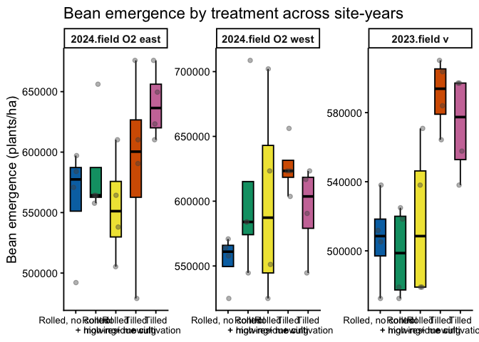
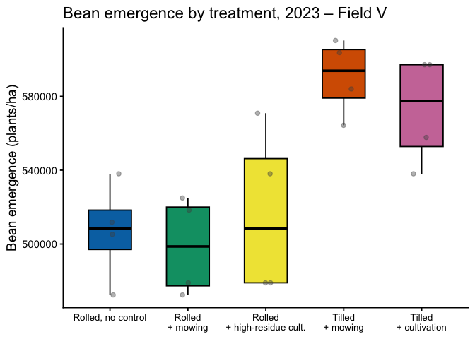
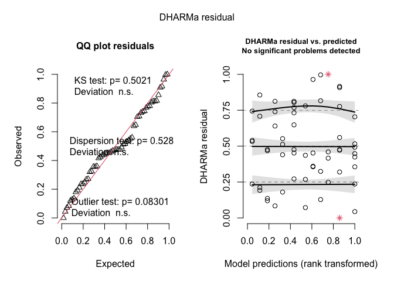
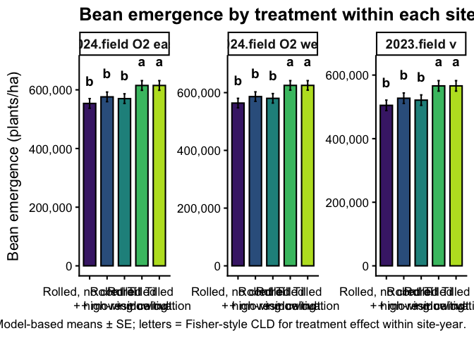
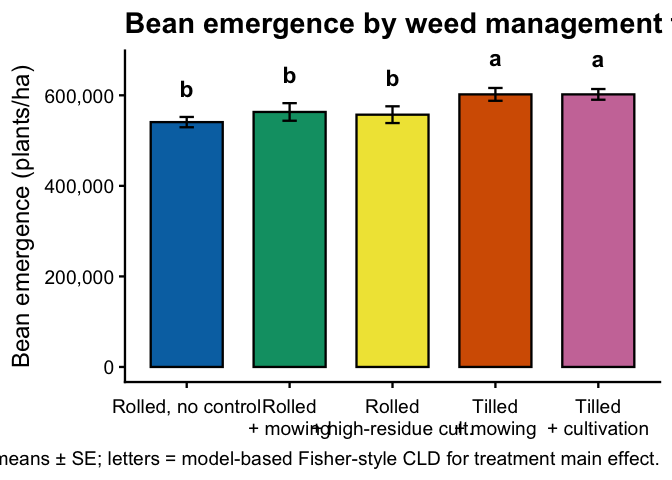

Soybean emergence
================

- [Data imort and prep](#data-imort-and-prep)

\#Setup

\#Packages

``` r
# Packages
library(tidyverse) # includes dplyr, ggplot2, readr, tibble, etc.
library(janitor)
library(readxl)
library(glmmTMB)
library(DHARMa)
library(emmeans)
library(multcomp)
library(car)
library(kableExtra)
library(here)
library(conflicted)
library(lme4)

# Handle conflicts
conflicts_prefer(dplyr::select)
conflicts_prefer(dplyr::filter)
conflicts_prefer(dplyr::recode)

# Treatment level order (use everywhere)
mow_levels <- c(
"Rolled, no control",
"Rolled + mowing",
"Rolled + high-residue cult.",
"Tilled + mowing",
"Tilled + cultivation"
)

# One consistent color palette for all figures

fill_cols <- c(
"Rolled, no control" = "#0072B2", # blue
"Rolled + mowing" = "#009E73", # green
"Rolled + high-residue cult." = "#F0E442", # yellow
"Tilled + mowing" = "#D55E00", # reddish
"Tilled + cultivation" = "#CC79A7" # magenta
)

#x-axis label helpers

label_break_spaces <- function(x) {
  stringr::str_replace_all(x, " ", "\n")
}

label_break_plus <- function(x) {
  stringr::str_replace_all(x, " \\+ ", "\n+ ")
}


#Helper: tidy emmeans output regardless of CI column names
#(works directly on an emmeans object)

tidy_emm <- function(emm, ref_levels = NULL) {
emm_df <- as.data.frame(emm)

lcl_col <- intersect(c("lower.CL", "asymp.LCL"), names(emm_df))[1]
ucl_col <- intersect(c("upper.CL", "asymp.UCL"), names(emm_df))[1]

if (is.na(lcl_col) || is.na(ucl_col)) {
stop("Could not find CI columns in emmeans output.")
}

out <- emm_df |>
mutate(
ci_low = .data[[lcl_col]],
ci_high = .data[[ucl_col]]
)

if (!is.null(ref_levels) && "weed_trt" %in% names(out)) {
out <- out |>
mutate(weed_trt = factor(weed_trt, levels = ref_levels))
}

out
}
```

# Data imort and prep

``` r
# 1) Read + clean master
bean_emergence_clean <- read_excel(
  here("data", "raw", "All Treatments", "combined_raw.xlsx")
) |>
  clean_names() |>
  rename(weed_trt = treatment) |>
  mutate(
    year      = factor(year),
    location  = factor(location),
    site_year = factor(interaction(year, location, drop = TRUE)),
    block     = factor(block),
    weed_trt  = recode(
      weed_trt,
      "RNO" = "Rolled, no control",
      "RIM" = "Rolled + mowing",
      "RIC" = "Rolled + high-residue cult.",
      "TIM" = "Tilled + mowing",
      "TIC" = "Tilled + cultivation"
    ),
    weed_trt = factor(weed_trt, levels = mow_levels),
    bean_emergence_two_meter = bean_emergence * 2,
    bean_emergence_hectare   = (bean_emergence / 0.762) * 10000,
    bean_emergence_acre      = bean_emergence_hectare / 2.471
  ) |>
  filter(!is.na(bean_emergence))

# 2) 2023 Field V subset
bean_emergence_field_v_2023 <- bean_emergence_clean |>
  filter(year == 2023, location == "field v")

# Quick check
kable(
  head(bean_emergence_clean),
  caption = "All site-years, cleaned (bean emergence)"
)
```

| id | location | year | weed_trt | block | plot | bean_emergence | bean_biomass | inrow_weed_biomass | interrow_weed_biomass | weed_biomass | bean_population | bean_yield | seed_weight | site_year | bean_emergence_two_meter | bean_emergence_hectare | bean_emergence_acre |
|:---|:---|:---|:---|:---|---:|---:|---:|---:|---:|---:|---:|---:|---:|:---|---:|---:|---:|
| CU_B1_P101 | field v | 2023 | Tilled + mowing | 1 | 101 | 46.5 | 223.740 | 19.000 | 44.490 | 63.490 | 34.5 | 417.21 | 17.1200 | 2023.field v | 93 | 610236.2 | 246959.2 |
| CU_B1_P102 | field v | 2023 | Tilled + cultivation | 1 | 102 | 42.5 | 267.460 | 30.975 | 0.720 | 31.695 | 39.5 | 565.54 | 17.4750 | 2023.field v | 85 | 557742.8 | 225715.4 |
| CU_B1_P103 | field v | 2023 | Rolled + mowing | 1 | 103 | 36.5 | 217.890 | 0.950 | 6.890 | 7.840 | 37.5 | 449.93 | 16.7525 | 2023.field v | 73 | 479002.6 | 193849.7 |
| CU_B1_P104 | field v | 2023 | Rolled, no control | 1 | 104 | 41.0 | 207.675 | 0.660 | 45.735 | 46.395 | 35.0 | 412.59 | 16.1450 | 2023.field v | 82 | 538057.7 | 217749.0 |
| CU_B1_P105 | field v | 2023 | Rolled + high-residue cult. | 1 | 105 | 41.0 | 230.285 | 0.495 | 22.025 | 22.520 | 39.0 | 473.79 | 17.0475 | 2023.field v | 82 | 538057.7 | 217749.0 |
| CU_B1_P201 | field v | 2023 | Rolled + high-residue cult. | 2 | 201 | 36.5 | 208.105 | 6.395 | 19.460 | 25.855 | 33.5 | 484.04 | 17.1500 | 2023.field v | 73 | 479002.6 | 193849.7 |

All site-years, cleaned (bean emergence)

\#Model testing \### Exploratory Analysis: Bean Emergence

``` r
# Model testing
### Exploratory Analysis: Bean Emergence

# 1) Summary table: bean emergence by site-year × treatment
bean_emergence_clean |>
  group_by(site_year, weed_trt) |>
  summarise(
    n      = n(),
    mean   = mean(bean_emergence_hectare, na.rm = TRUE),
    median = median(bean_emergence_hectare, na.rm = TRUE),
    sd     = sd(bean_emergence_hectare, na.rm = TRUE),
    .groups = "drop"
  ) |>
  arrange(site_year, weed_trt) |>
  kable(
    digits  = 1,
    caption = "Bean emergence (plants/ha) by site-year × treatment"
  ) |>
  kable_styling(full_width = FALSE, bootstrap_options = c("striped", "hover"))
```

<table class="table table-striped table-hover" style="color: black; width: auto !important; margin-left: auto; margin-right: auto;">

<caption>

Bean emergence (plants/ha) by site-year × treatment
</caption>

<thead>

<tr>

<th style="text-align:left;">

site_year
</th>

<th style="text-align:left;">

weed_trt
</th>

<th style="text-align:right;">

n
</th>

<th style="text-align:right;">

mean
</th>

<th style="text-align:right;">

median
</th>

<th style="text-align:right;">

sd
</th>

</tr>

</thead>

<tbody>

<tr>

<td style="text-align:left;">

2024.field O2 east
</td>

<td style="text-align:left;">

Rolled, no control
</td>

<td style="text-align:right;">

4
</td>

<td style="text-align:right;">

561023.6
</td>

<td style="text-align:right;">

577427.8
</td>

<td style="text-align:right;">

47165.0
</td>

</tr>

<tr>

<td style="text-align:left;">

2024.field O2 east
</td>

<td style="text-align:left;">

Rolled + mowing
</td>

<td style="text-align:right;">

4
</td>

<td style="text-align:right;">

585629.9
</td>

<td style="text-align:right;">

564304.5
</td>

<td style="text-align:right;">

47127.0
</td>

</tr>

<tr>

<td style="text-align:left;">

2024.field O2 east
</td>

<td style="text-align:left;">

Rolled + high-residue cult.
</td>

<td style="text-align:right;">

4
</td>

<td style="text-align:right;">

554461.9
</td>

<td style="text-align:right;">

551181.1
</td>

<td style="text-align:right;">

44341.9
</td>

</tr>

<tr>

<td style="text-align:left;">

2024.field O2 east
</td>

<td style="text-align:left;">

Tilled + mowing
</td>

<td style="text-align:right;">

4
</td>

<td style="text-align:right;">

588910.8
</td>

<td style="text-align:right;">

600393.7
</td>

<td style="text-align:right;">

81845.8
</td>

</tr>

<tr>

<td style="text-align:left;">

2024.field O2 east
</td>

<td style="text-align:left;">

Tilled + cultivation
</td>

<td style="text-align:right;">

4
</td>

<td style="text-align:right;">

639763.8
</td>

<td style="text-align:right;">

636482.9
</td>

<td style="text-align:right;">

29099.2
</td>

</tr>

<tr>

<td style="text-align:left;">

2024.field O2 west
</td>

<td style="text-align:left;">

Rolled, no control
</td>

<td style="text-align:right;">

4
</td>

<td style="text-align:right;">

554461.9
</td>

<td style="text-align:right;">

561023.6
</td>

<td style="text-align:right;">

20401.1
</td>

</tr>

<tr>

<td style="text-align:left;">

2024.field O2 west
</td>

<td style="text-align:left;">

Rolled + mowing
</td>

<td style="text-align:right;">

4
</td>

<td style="text-align:right;">

605315.0
</td>

<td style="text-align:right;">

583989.5
</td>

<td style="text-align:right;">

71353.6
</td>

</tr>

<tr>

<td style="text-align:left;">

2024.field O2 west
</td>

<td style="text-align:left;">

Rolled + high-residue cult.
</td>

<td style="text-align:right;">

4
</td>

<td style="text-align:right;">

600393.7
</td>

<td style="text-align:right;">

587270.3
</td>

<td style="text-align:right;">

79556.1
</td>

</tr>

<tr>

<td style="text-align:left;">

2024.field O2 west
</td>

<td style="text-align:left;">

Tilled + mowing
</td>

<td style="text-align:right;">

4
</td>

<td style="text-align:right;">

626640.4
</td>

<td style="text-align:right;">

623359.6
</td>

<td style="text-align:right;">

21762.6
</td>

</tr>

<tr>

<td style="text-align:left;">

2024.field O2 west
</td>

<td style="text-align:left;">

Tilled + cultivation
</td>

<td style="text-align:right;">

4
</td>

<td style="text-align:right;">

593832.0
</td>

<td style="text-align:right;">

603674.5
</td>

<td style="text-align:right;">

35739.6
</td>

</tr>

<tr>

<td style="text-align:left;">

2023.field v
</td>

<td style="text-align:left;">

Rolled, no control
</td>

<td style="text-align:right;">

4
</td>

<td style="text-align:right;">

506889.8
</td>

<td style="text-align:right;">

508530.2
</td>

<td style="text-align:right;">

26988.1
</td>

</tr>

<tr>

<td style="text-align:left;">

2023.field v
</td>

<td style="text-align:left;">

Rolled + mowing
</td>

<td style="text-align:right;">

4
</td>

<td style="text-align:right;">

498687.7
</td>

<td style="text-align:right;">

498687.7
</td>

<td style="text-align:right;">

26787.9
</td>

</tr>

<tr>

<td style="text-align:left;">

2023.field v
</td>

<td style="text-align:left;">

Rolled + high-residue cult.
</td>

<td style="text-align:right;">

4
</td>

<td style="text-align:right;">

516732.3
</td>

<td style="text-align:right;">

508530.2
</td>

<td style="text-align:right;">

45578.9
</td>

</tr>

<tr>

<td style="text-align:left;">

2023.field v
</td>

<td style="text-align:left;">

Tilled + mowing
</td>

<td style="text-align:right;">

4
</td>

<td style="text-align:right;">

590551.2
</td>

<td style="text-align:right;">

593832.0
</td>

<td style="text-align:right;">

20749.9
</td>

</tr>

<tr>

<td style="text-align:left;">

2023.field v
</td>

<td style="text-align:left;">

Tilled + cultivation
</td>

<td style="text-align:right;">

4
</td>

<td style="text-align:right;">

572506.6
</td>

<td style="text-align:right;">

577427.8
</td>

<td style="text-align:right;">

29527.6
</td>

</tr>

</tbody>

</table>

``` r
# 2) Faceted boxplot: all site-years
bean_emergence_clean |>
  ggplot(aes(x = weed_trt, y = bean_emergence_hectare, fill = weed_trt)) +
  geom_boxplot(
    outlier.shape = NA,
    width  = 0.55,
    color  = "black"
  ) +
  geom_jitter(
    width  = 0.12,
    height = 0,
    alpha  = 0.4,
    size   = 1.8,
    color  = "grey30"
  ) +
  facet_wrap(~ site_year, nrow = 1, scales = "free_y") +
  scale_fill_manual(values = fill_cols, guide = "none") +
  scale_x_discrete(labels = label_break_plus) +
  labs(
    x     = NULL,
    y     = "Bean emergence (plants/ha)",
    title = "Bean emergence by treatment across site-years"
  ) +
  theme_classic(base_size = 14) +
  theme(
    axis.text.x = element_text(size = 10),
    strip.text  = element_text(face = "bold")
  )
```

<!-- -->

``` r
# 3) Boxplot: 2023 – Field V only
bean_emergence_field_v_2023 |>
  ggplot(aes(x = weed_trt, y = bean_emergence_hectare, fill = weed_trt)) +
  geom_boxplot(
    outlier.shape = NA,
    width  = 0.55,
    color  = "black"
  ) +
  geom_jitter(
    width  = 0.12,
    height = 0,
    alpha  = 0.4,
    size   = 1.8,
    color  = "grey30"
  ) +
  scale_fill_manual(values = fill_cols, guide = "none") +
  scale_x_discrete(labels = label_break_plus) +
  labs(
    x     = NULL,
    y     = "Bean emergence (plants/ha)",
    title = "Bean emergence by treatment, 2023 – Field V"
  ) +
  theme_classic(base_size = 14) +
  theme(
    axis.text.x = element_text(size = 10)
  )
```

<!-- -->

\##Selection

``` r
## Selection
### Model testing / selection for bean emergence (plants/ha)

options(contrasts = c("contr.sum", "contr.poly"))

# Interaction model: weed_trt * site_year --------------------------------
emergence_int <- lmer(
  bean_emergence_hectare ~ weed_trt * site_year + (1 | site_year:block),
  data = bean_emergence_clean
)

# Additive model: weed_trt + site_year -----------------------------------
emergence_add <- lmer(
  bean_emergence_hectare ~ weed_trt + site_year + (1 | site_year:block),
  data = bean_emergence_clean
)

# Compare models (AIC + LRT) ---------------------------------------------
aic_emergence <- tibble(
  model = c(
    "Additive: weed_trt + site_year",
    "Interaction: weed_trt * site_year"
  ),
  AIC = c(AIC(emergence_add), AIC(emergence_int))
)

kable(
  aic_emergence,
  digits  = 1,
  caption = "Bean emergence (plants/ha): model comparison (additive vs interaction)"
)
```

| model                              |    AIC |
|:-----------------------------------|-------:|
| Additive: weed_trt + site_year     | 1331.4 |
| Interaction: weed_trt \* site_year | 1170.1 |

Bean emergence (plants/ha): model comparison (additive vs interaction)

``` r
anova(emergence_add, emergence_int)  # LRT: is the interaction worth keeping?
```

    ## Data: bean_emergence_clean
    ## Models:
    ## emergence_add: bean_emergence_hectare ~ weed_trt + site_year + (1 | site_year:block)
    ## emergence_int: bean_emergence_hectare ~ weed_trt * site_year + (1 | site_year:block)
    ##               npar    AIC    BIC  logLik -2*log(L) Chisq Df Pr(>Chisq)
    ## emergence_add    9 1471.8 1490.6 -726.90    1453.8                    
    ## emergence_int   17 1476.3 1511.9 -721.15    1442.3  11.5  8      0.175

``` r
# Choose simpler additive model unless interaction is clearly needed -----
# (this is the model used in all downstream emmeans/plots)
emergence.lmer <- emergence_add

# Diagnostics on chosen model --------------------------------------------
set.seed(123)
res_emergence <- DHARMa::simulateResiduals(emergence.lmer)
plot(res_emergence)
```

<!-- -->

``` r
DHARMa::testDispersion(emergence.lmer)
```

<!-- -->

    ## 
    ##  DHARMa nonparametric dispersion test via sd of residuals fitted vs.
    ##  simulated
    ## 
    ## data:  simulationOutput
    ## dispersion = 0.88979, p-value = 0.528
    ## alternative hypothesis: two.sided

``` r
car::Anova(emergence.lmer, type = 3)
```

    ## Analysis of Deviance Table (Type III Wald chisquare tests)
    ## 
    ## Response: bean_emergence_hectare
    ##                Chisq Df Pr(>Chisq)    
    ## (Intercept) 7631.351  1  < 2.2e-16 ***
    ## weed_trt      17.262  4  0.0017194 ** 
    ## site_year     15.443  2  0.0004433 ***
    ## ---
    ## Signif. codes:  0 '***' 0.001 '**' 0.01 '*' 0.05 '.' 0.1 ' ' 1

\###Post-hoc summary table

``` r
### Bean emergence (plants/ha) with Fisher's LSD CLDs

# Estimated marginal means for weed_trt
emm_emergence <- emmeans(emergence.lmer, ~ weed_trt)

# Tidy emmeans (adds ci_low / ci_high and enforces treatment order)
emm_emergence_df <- tidy_emm(emm_emergence, ref_levels = mow_levels) |>
  as_tibble()

# Compact letter display (Fisher's LSD, no adjustment)
cld_emergence <- cld(
  emm_emergence,
  adjust = "none",
  Letters = letters,
  sort = TRUE,   # default, but explicit
  reversed = TRUE    # now 'a' goes to the highest group(s)
) |>
  as_tibble() |>
  mutate(
    weed_trt = factor(weed_trt, levels = mow_levels),
    .group   = stringr::str_trim(.group)
  ) |>
  select(weed_trt, .group)

# Join emmeans + CLDs and format for reporting
emm_emergence_df |>
  left_join(cld_emergence, by = "weed_trt") |>
  select(weed_trt, emmean, SE, ci_low, ci_high, .group) |>
  mutate(across(c(emmean, SE, ci_low, ci_high), ~ round(.x, 1))) |>
  kable(
    caption = "Estimated means (plants/ha) with 95% CI and Fisher's LSD group letters",
    col.names = c("Treatment", "Mean", "SE", "Lower CI", "Upper CI", "Group")
  ) |>
  kable_styling(full_width = FALSE, bootstrap_options = c("striped", "hover"))
```

<table class="table table-striped table-hover" style="color: black; width: auto !important; margin-left: auto; margin-right: auto;">

<caption>

Estimated means (plants/ha) with 95% CI and Fisher’s LSD group letters
</caption>

<thead>

<tr>

<th style="text-align:left;">

Treatment
</th>

<th style="text-align:right;">

Mean
</th>

<th style="text-align:right;">

SE
</th>

<th style="text-align:right;">

Lower CI
</th>

<th style="text-align:right;">

Upper CI
</th>

<th style="text-align:left;">

Group
</th>

</tr>

</thead>

<tbody>

<tr>

<td style="text-align:left;">

Rolled, no control
</td>

<td style="text-align:right;">

540791.8
</td>

<td style="text-align:right;">

13611.1
</td>

<td style="text-align:right;">

513473.6
</td>

<td style="text-align:right;">

568109.9
</td>

<td style="text-align:left;">

b
</td>

</tr>

<tr>

<td style="text-align:left;">

Rolled + mowing
</td>

<td style="text-align:right;">

563210.8
</td>

<td style="text-align:right;">

13611.1
</td>

<td style="text-align:right;">

535892.7
</td>

<td style="text-align:right;">

590529.0
</td>

<td style="text-align:left;">

b
</td>

</tr>

<tr>

<td style="text-align:left;">

Rolled + high-residue cult.
</td>

<td style="text-align:right;">

557196.0
</td>

<td style="text-align:right;">

13611.1
</td>

<td style="text-align:right;">

529877.8
</td>

<td style="text-align:right;">

584514.1
</td>

<td style="text-align:left;">

b
</td>

</tr>

<tr>

<td style="text-align:left;">

Tilled + mowing
</td>

<td style="text-align:right;">

602034.1
</td>

<td style="text-align:right;">

13611.1
</td>

<td style="text-align:right;">

574716.0
</td>

<td style="text-align:right;">

629352.3
</td>

<td style="text-align:left;">

a
</td>

</tr>

<tr>

<td style="text-align:left;">

Tilled + cultivation
</td>

<td style="text-align:right;">

602034.1
</td>

<td style="text-align:right;">

13611.1
</td>

<td style="text-align:right;">

574716.0
</td>

<td style="text-align:right;">

629352.3
</td>

<td style="text-align:left;">

a
</td>

</tr>

</tbody>

</table>

``` r
## 1) P-value summary (Location, Treatment, Interaction) -----------------

# Type-III tests for additive model (weed_trt + site_year)
anova_emergence <- Anova(emergence.lmer, type = 3)

anova_emergence_df <- anova_emergence |>
  as.data.frame() |>
  tibble::rownames_to_column("Effect")

# LRT for interaction (additive vs interaction models)
anova_interaction <- anova(emergence_add, emergence_int)

pvals_emergence <- tibble(
  Effect = c("Location (site_year)", "Treatment (weed_trt)", "Location × Treatment"),
  p_raw  = c(
    anova_emergence_df$`Pr(>Chisq)`[anova_emergence_df$Effect == "site_year"],
    anova_emergence_df$`Pr(>Chisq)`[anova_emergence_df$Effect == "weed_trt"],
    anova_interaction$`Pr(>Chisq)`[2]
  )
) |>
  mutate(
    `P-value` = dplyr::case_when(
      p_raw < 0.001 ~ "<0.001",
      p_raw < 0.01  ~ "<0.01",
      TRUE          ~ sprintf("%.3f", p_raw)
    )
  ) |>
  select(Effect, `P-value`)

pvals_emergence |>
  kable(
    caption   = "Bean emergence: P-values for location, treatment, and interaction",
    col.names = c("Effect", "P-value")
  ) |>
  kable_styling(full_width = FALSE, bootstrap_options = c("striped", "hover"))
```

<table class="table table-striped table-hover" style="color: black; width: auto !important; margin-left: auto; margin-right: auto;">

<caption>

Bean emergence: P-values for location, treatment, and interaction
</caption>

<thead>

<tr>

<th style="text-align:left;">

Effect
</th>

<th style="text-align:left;">

P-value
</th>

</tr>

</thead>

<tbody>

<tr>

<td style="text-align:left;">

Location (site_year)
</td>

<td style="text-align:left;">

\<0.001
</td>

</tr>

<tr>

<td style="text-align:left;">

Treatment (weed_trt)
</td>

<td style="text-align:left;">

\<0.01
</td>

</tr>

<tr>

<td style="text-align:left;">

Location × Treatment
</td>

<td style="text-align:left;">

0.175
</td>

</tr>

</tbody>

</table>

``` r
## 2) Location block: site-year means (model + raw) ----------------------

# Model-based emmeans by site_year
emm_loc <- emmeans(emergence.lmer, ~ site_year)

emm_loc_df <- tidy_emm(emm_loc) |>
  as_tibble() |>
  mutate(
    site_year = as.factor(site_year),
    model_mean = emmean
  ) |>
  select(site_year, model_mean)

# CLDs for site_year (a = highest)
cld_loc <- cld(
  emm_loc,
  adjust   = "none",
  Letters  = letters,
  sort     = TRUE,
  reversed = TRUE
) |>
  as_tibble() |>
  mutate(
    site_year = as.factor(site_year),
    loc_CLD   = str_trim(.group)
  ) |>
  select(site_year, loc_CLD)

# Raw means by site_year
raw_loc <- bean_emergence_clean |>
  group_by(site_year) |>
  summarise(
    raw_mean = mean(bean_emergence_hectare, na.rm = TRUE),
    .groups  = "drop"
  ) |>
  mutate(site_year = as.factor(site_year))

loc_summary <- emm_loc_df |>
  left_join(cld_loc, by = "site_year") |>
  left_join(raw_loc, by = "site_year") |>
  mutate(
    model_mean = round(model_mean, 1),
    raw_mean   = round(raw_mean, 1),
    raw_CLD    = loc_CLD  # use same letters for model + raw
  ) |>
  arrange(site_year)

loc_summary |>
  kable(
    caption   = "Bean emergence: location (site-year) means with CLDs",
    col.names = c("Site-year", "Model mean", "Model CLD", "Raw mean", "Raw CLD")
  ) |>
  kable_styling(full_width = FALSE, bootstrap_options = c("striped", "hover"))
```

<table class="table table-striped table-hover" style="color: black; width: auto !important; margin-left: auto; margin-right: auto;">

<caption>

Bean emergence: location (site-year) means with CLDs
</caption>

<thead>

<tr>

<th style="text-align:left;">

Site-year
</th>

<th style="text-align:right;">

Model mean
</th>

<th style="text-align:left;">

Model CLD
</th>

<th style="text-align:right;">

Raw mean
</th>

<th style="text-align:left;">

Raw CLD
</th>

</tr>

</thead>

<tbody>

<tr>

<td style="text-align:left;">

2024.field O2 east
</td>

<td style="text-align:right;">

585958.0
</td>

<td style="text-align:left;">

a
</td>

<td style="text-align:right;">

585958.0
</td>

<td style="text-align:left;">

a
</td>

</tr>

<tr>

<td style="text-align:left;">

2024.field O2 west
</td>

<td style="text-align:right;">

596128.6
</td>

<td style="text-align:left;">

a
</td>

<td style="text-align:right;">

596128.6
</td>

<td style="text-align:left;">

a
</td>

</tr>

<tr>

<td style="text-align:left;">

2023.field v
</td>

<td style="text-align:right;">

537073.5
</td>

<td style="text-align:left;">

b
</td>

<td style="text-align:right;">

537073.5
</td>

<td style="text-align:left;">

b
</td>

</tr>

</tbody>

</table>

``` r
## 3) Treatment block: means (model + raw) -------------------------------

# emmeans for treatment
emm_emergence <- emmeans(emergence.lmer, ~ weed_trt)

emm_trt_df <- tidy_emm(emm_emergence, ref_levels = mow_levels) |>
  as_tibble() |>
  mutate(
    weed_trt   = factor(weed_trt, levels = mow_levels),
    model_mean = emmean
  ) |>
  select(weed_trt, model_mean)

# CLDs for treatment (a = highest)
cld_emergence <- cld(
  emm_emergence,
  adjust   = "none",
  Letters  = letters,
  sort     = TRUE,
  reversed = TRUE
) |>
  as_tibble() |>
  mutate(
    weed_trt = factor(weed_trt, levels = mow_levels),
    trt_CLD  = str_trim(.group)
  ) |>
  select(weed_trt, trt_CLD)

# Raw means by treatment
raw_trt <- bean_emergence_clean |>
  group_by(weed_trt) |>
  summarise(
    raw_mean = mean(bean_emergence_hectare, na.rm = TRUE),
    .groups  = "drop"
  ) |>
  mutate(weed_trt = factor(weed_trt, levels = mow_levels))

trt_summary <- emm_trt_df |>
  left_join(cld_emergence, by = "weed_trt") |>
  left_join(raw_trt, by = "weed_trt") |>
  mutate(
    model_mean = round(model_mean, 1),
    raw_mean   = round(raw_mean, 1),
    raw_CLD    = trt_CLD
  ) |>
  arrange(weed_trt)

trt_summary |>
  kable(
    caption   = "Bean emergence: treatment means with CLDs",
    col.names = c("Treatment", "Model mean", "Model CLD", "Raw mean", "Raw CLD")
  ) |>
  kable_styling(full_width = FALSE, bootstrap_options = c("striped", "hover"))
```

<table class="table table-striped table-hover" style="color: black; width: auto !important; margin-left: auto; margin-right: auto;">

<caption>

Bean emergence: treatment means with CLDs
</caption>

<thead>

<tr>

<th style="text-align:left;">

Treatment
</th>

<th style="text-align:right;">

Model mean
</th>

<th style="text-align:left;">

Model CLD
</th>

<th style="text-align:right;">

Raw mean
</th>

<th style="text-align:left;">

Raw CLD
</th>

</tr>

</thead>

<tbody>

<tr>

<td style="text-align:left;">

Rolled, no control
</td>

<td style="text-align:right;">

540791.8
</td>

<td style="text-align:left;">

b
</td>

<td style="text-align:right;">

540791.8
</td>

<td style="text-align:left;">

b
</td>

</tr>

<tr>

<td style="text-align:left;">

Rolled + mowing
</td>

<td style="text-align:right;">

563210.8
</td>

<td style="text-align:left;">

b
</td>

<td style="text-align:right;">

563210.8
</td>

<td style="text-align:left;">

b
</td>

</tr>

<tr>

<td style="text-align:left;">

Rolled + high-residue cult.
</td>

<td style="text-align:right;">

557196.0
</td>

<td style="text-align:left;">

b
</td>

<td style="text-align:right;">

557196.0
</td>

<td style="text-align:left;">

b
</td>

</tr>

<tr>

<td style="text-align:left;">

Tilled + mowing
</td>

<td style="text-align:right;">

602034.1
</td>

<td style="text-align:left;">

a
</td>

<td style="text-align:right;">

602034.1
</td>

<td style="text-align:left;">

a
</td>

</tr>

<tr>

<td style="text-align:left;">

Tilled + cultivation
</td>

<td style="text-align:right;">

602034.1
</td>

<td style="text-align:left;">

a
</td>

<td style="text-align:right;">

602034.1
</td>

<td style="text-align:left;">

a
</td>

</tr>

</tbody>

</table>

``` r
## 4) Interaction block: site-year × treatment means ---------------------

# Model emmeans by treatment within site_year
emm_sy <- emmeans(emergence.lmer, ~ weed_trt | site_year)

emm_sy_df <- tidy_emm(emm_sy, ref_levels = mow_levels) |>
  as_tibble() |>
  mutate(
    weed_trt   = factor(weed_trt, levels = mow_levels),
    site_year  = as.factor(site_year),
    model_mean = emmean
  ) |>
  select(site_year, weed_trt, model_mean)

# CLDs within each site_year (a = highest within that site_year)
cld_sy <- cld(
  emm_sy,
  adjust   = "none",
  Letters  = letters,
  sort     = TRUE,
  reversed = TRUE
) |>
  as_tibble() |>
  mutate(
    weed_trt  = factor(weed_trt, levels = mow_levels),
    site_year = as.factor(site_year),
    int_CLD   = str_trim(.group)
  ) |>
  select(site_year, weed_trt, int_CLD)

# Raw means by site_year × treatment
raw_sy <- bean_emergence_clean |>
  group_by(site_year, weed_trt) |>
  summarise(
    raw_mean = mean(bean_emergence_hectare, na.rm = TRUE),
    .groups  = "drop"
  ) |>
  mutate(
    site_year = as.factor(site_year),
    weed_trt  = factor(weed_trt, levels = mow_levels)
  )

int_summary <- emm_sy_df |>
  left_join(cld_sy, by = c("site_year", "weed_trt")) |>
  left_join(raw_sy, by = c("site_year", "weed_trt")) |>
  mutate(
    model_mean = round(model_mean, 1),
    raw_mean   = round(raw_mean, 1),
    raw_CLD    = int_CLD
  ) |>
  arrange(site_year, weed_trt)

int_summary |>
  kable(
    caption   = "Bean emergence: site-year × treatment means with CLDs",
    col.names = c(
      "Site-year", "Treatment",
      "Model mean", "Model CLD",
      "Raw mean",   "Raw CLD"
    )
  ) |>
  kable_styling(full_width = FALSE, bootstrap_options = c("striped", "hover"))
```

<table class="table table-striped table-hover" style="color: black; width: auto !important; margin-left: auto; margin-right: auto;">

<caption>

Bean emergence: site-year × treatment means with CLDs
</caption>

<thead>

<tr>

<th style="text-align:left;">

Site-year
</th>

<th style="text-align:left;">

Treatment
</th>

<th style="text-align:right;">

Model mean
</th>

<th style="text-align:left;">

Model CLD
</th>

<th style="text-align:right;">

Raw mean
</th>

<th style="text-align:left;">

Raw CLD
</th>

</tr>

</thead>

<tbody>

<tr>

<td style="text-align:left;">

2024.field O2 east
</td>

<td style="text-align:left;">

Rolled, no control
</td>

<td style="text-align:right;">

553696.4
</td>

<td style="text-align:left;">

b
</td>

<td style="text-align:right;">

561023.6
</td>

<td style="text-align:left;">

b
</td>

</tr>

<tr>

<td style="text-align:left;">

2024.field O2 east
</td>

<td style="text-align:left;">

Rolled + mowing
</td>

<td style="text-align:right;">

576115.5
</td>

<td style="text-align:left;">

b
</td>

<td style="text-align:right;">

585629.9
</td>

<td style="text-align:left;">

b
</td>

</tr>

<tr>

<td style="text-align:left;">

2024.field O2 east
</td>

<td style="text-align:left;">

Rolled + high-residue cult.
</td>

<td style="text-align:right;">

570100.6
</td>

<td style="text-align:left;">

b
</td>

<td style="text-align:right;">

554461.9
</td>

<td style="text-align:left;">

b
</td>

</tr>

<tr>

<td style="text-align:left;">

2024.field O2 east
</td>

<td style="text-align:left;">

Tilled + mowing
</td>

<td style="text-align:right;">

614938.8
</td>

<td style="text-align:left;">

a
</td>

<td style="text-align:right;">

588910.8
</td>

<td style="text-align:left;">

a
</td>

</tr>

<tr>

<td style="text-align:left;">

2024.field O2 east
</td>

<td style="text-align:left;">

Tilled + cultivation
</td>

<td style="text-align:right;">

614938.8
</td>

<td style="text-align:left;">

a
</td>

<td style="text-align:right;">

639763.8
</td>

<td style="text-align:left;">

a
</td>

</tr>

<tr>

<td style="text-align:left;">

2024.field O2 west
</td>

<td style="text-align:left;">

Rolled, no control
</td>

<td style="text-align:right;">

563867.0
</td>

<td style="text-align:left;">

b
</td>

<td style="text-align:right;">

554461.9
</td>

<td style="text-align:left;">

b
</td>

</tr>

<tr>

<td style="text-align:left;">

2024.field O2 west
</td>

<td style="text-align:left;">

Rolled + mowing
</td>

<td style="text-align:right;">

586286.1
</td>

<td style="text-align:left;">

b
</td>

<td style="text-align:right;">

605315.0
</td>

<td style="text-align:left;">

b
</td>

</tr>

<tr>

<td style="text-align:left;">

2024.field O2 west
</td>

<td style="text-align:left;">

Rolled + high-residue cult.
</td>

<td style="text-align:right;">

580271.2
</td>

<td style="text-align:left;">

b
</td>

<td style="text-align:right;">

600393.7
</td>

<td style="text-align:left;">

b
</td>

</tr>

<tr>

<td style="text-align:left;">

2024.field O2 west
</td>

<td style="text-align:left;">

Tilled + mowing
</td>

<td style="text-align:right;">

625109.4
</td>

<td style="text-align:left;">

a
</td>

<td style="text-align:right;">

626640.4
</td>

<td style="text-align:left;">

a
</td>

</tr>

<tr>

<td style="text-align:left;">

2024.field O2 west
</td>

<td style="text-align:left;">

Tilled + cultivation
</td>

<td style="text-align:right;">

625109.4
</td>

<td style="text-align:left;">

a
</td>

<td style="text-align:right;">

593832.0
</td>

<td style="text-align:left;">

a
</td>

</tr>

<tr>

<td style="text-align:left;">

2023.field v
</td>

<td style="text-align:left;">

Rolled, no control
</td>

<td style="text-align:right;">

504811.9
</td>

<td style="text-align:left;">

b
</td>

<td style="text-align:right;">

506889.8
</td>

<td style="text-align:left;">

b
</td>

</tr>

<tr>

<td style="text-align:left;">

2023.field v
</td>

<td style="text-align:left;">

Rolled + mowing
</td>

<td style="text-align:right;">

527231.0
</td>

<td style="text-align:left;">

b
</td>

<td style="text-align:right;">

498687.7
</td>

<td style="text-align:left;">

b
</td>

</tr>

<tr>

<td style="text-align:left;">

2023.field v
</td>

<td style="text-align:left;">

Rolled + high-residue cult.
</td>

<td style="text-align:right;">

521216.1
</td>

<td style="text-align:left;">

b
</td>

<td style="text-align:right;">

516732.3
</td>

<td style="text-align:left;">

b
</td>

</tr>

<tr>

<td style="text-align:left;">

2023.field v
</td>

<td style="text-align:left;">

Tilled + mowing
</td>

<td style="text-align:right;">

566054.2
</td>

<td style="text-align:left;">

a
</td>

<td style="text-align:right;">

590551.2
</td>

<td style="text-align:left;">

a
</td>

</tr>

<tr>

<td style="text-align:left;">

2023.field v
</td>

<td style="text-align:left;">

Tilled + cultivation
</td>

<td style="text-align:right;">

566054.2
</td>

<td style="text-align:left;">

a
</td>

<td style="text-align:right;">

572506.6
</td>

<td style="text-align:left;">

a
</td>

</tr>

</tbody>

</table>

\#Figures

\##Pooled model

``` r
## Pooled model

# Figure: Bean emergence by weed management treatment (pooled across site-years)

# Estimated marginal means for treatments
emm_emergence <- emmeans(emergence.lmer, ~ weed_trt)

# Tidy emmeans for plotting
emm_emergence_df <- tidy_emm(emm_emergence, ref_levels = mow_levels) |>
  as_tibble() |>
  mutate(
    response = emmean,
    ymin     = pmax(response - SE, 0),
    ymax     = response + SE
  )

# CLDs for treatments (Fisher's LSD, "a" = highest)
cld_emergence <- cld(
  emm_emergence,
  adjust   = "none",
  Letters  = letters,
  sort     = TRUE,
  reversed = TRUE
) |>
  as_tibble() |>
  mutate(
    weed_trt = factor(weed_trt, levels = mow_levels),
    .group   = str_trim(.group)
  ) |>
  select(weed_trt, .group)

# Merge means and CLDs
plot_df_emergence <- emm_emergence_df |>
  left_join(cld_emergence, by = "weed_trt")

# Plot
ggplot(plot_df_emergence, aes(x = weed_trt, y = response, fill = weed_trt)) +
  geom_col(width = 0.7, color = "black") +
  geom_errorbar(aes(ymin = ymin, ymax = ymax), width = 0.14) +
  geom_text(
    aes(y = ymax * 1.08, label = .group),
    vjust    = 0,
    fontface = "bold",
    size     = 6
  ) +
  scale_fill_manual(values = fill_cols, guide = "none") +
  scale_x_discrete(labels = label_break_plus) +
  scale_y_continuous(labels = scales::label_comma()) +
  labs(
    x        = NULL,
    y        = "Bean emergence (plants/ha)",
    title    = "Bean emergence by weed management treatment (pooled across site-years)",
    caption  = "Model-based means ± SE; letters = Fisher-style CLD for treatment main effect."
  ) +
  theme_classic(base_size = 18) +
  theme(
    axis.text.x  = element_text(lineheight = 0.95, margin = margin(t = 8)),
    axis.title.y = element_text(margin = margin(r = 8)),
    plot.title   = element_text(face = "bold")
  )
```

<!-- -->

``` r
# Save figure
ggsave(
  filename = here("figs", "analysis", "fig_bean_emergence_mowing_pooled.png"),
  width    = 7.5,
  height   = 5.5,
  dpi      = 300
)
```

\##Pooled raw

``` r
# Figure: Bean emergence by weed management treatment (raw means ± SE, model CLDs)

# 1) Raw means and SE by treatment --------------------------------------
raw_emergence_summary <- bean_emergence_clean |>
  group_by(weed_trt) |>
  summarise(
    n    = n(),
    mean = mean(bean_emergence_hectare, na.rm = TRUE),
    sd   = sd(bean_emergence_hectare, na.rm = TRUE),
    se   = sd / sqrt(n),
    .groups = "drop"
  ) |>
  mutate(
    weed_trt = factor(weed_trt, levels = mow_levels),
    ymin     = pmax(mean - se, 0),
    ymax     = mean + se
  )

# 2) Model-based CLDs for treatment main effect -------------------------
emm_emergence <- emmeans(emergence.lmer, ~ weed_trt)

cld_emergence <- cld(
  emm_emergence,
  adjust   = "none",
  Letters  = letters,
  sort     = TRUE,
  reversed = TRUE   # "a" = highest mean
) |>
  as_tibble() |>
  mutate(
    weed_trt = factor(weed_trt, levels = mow_levels),
    .group   = str_trim(.group)
  ) |>
  select(weed_trt, .group)

# 3) Join raw means and model CLDs --------------------------------------
plot_df_raw <- raw_emergence_summary |>
  left_join(cld_emergence, by = "weed_trt")

# 4) Plot ---------------------------------------------------------------
ggplot(plot_df_raw, aes(x = weed_trt, y = mean, fill = weed_trt)) +
  geom_col(width = 0.7, color = "black") +
  geom_errorbar(aes(ymin = ymin, ymax = ymax), width = 0.14) +
  geom_text(
    aes(y = ymax * 1.08, label = .group),
    vjust    = 0,
    fontface = "bold",
    size     = 6
  ) +
  scale_fill_manual(values = fill_cols, guide = "none") +
  scale_x_discrete(labels = label_break_plus) +
  scale_y_continuous(labels = scales::label_comma()) +
  labs(
    x        = NULL,
    y        = "Bean emergence (plants/ha)",
    title    = "Bean emergence by weed management treatment (raw means ± SE)",
    caption  = "Raw means ± SE; letters = model-based Fisher-style CLD for treatment main effect."
  ) +
  theme_classic(base_size = 18) +
  theme(
    axis.text.x  = element_text(lineheight = 0.95, margin = margin(t = 8)),
    axis.title.y = element_text(margin = margin(r = 8)),
    plot.title   = element_text(face = "bold")
  )
```

<!-- -->

``` r
# Save figure
ggsave(
  filename = here("figs", "analysis", "fig_bean_emergence_mowing_pooled_raw.png"),
  width    = 7.5,
  height   = 5.5,
  dpi      = 300
)
```
