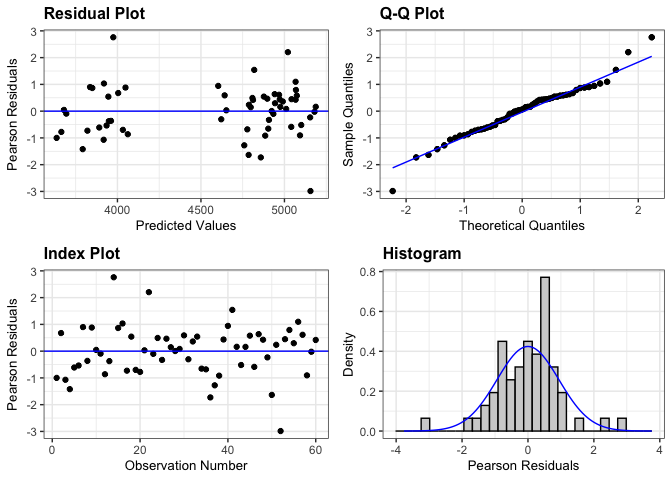
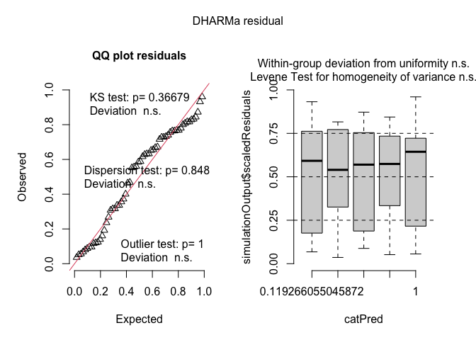

Bean Yield
================

# Load libraries

``` r
#Set work directory
setwd("/Users/ey239/Github/Mowtivation/rmarkdowns")

#Load packages 
library(tidyverse) ##install.packages("tidyverse")
library(knitr)
library(patchwork) ##install.packages("patchwork")
library(skimr)     ##install.packages("skimr")
library(readxl)
library(janitor) ##install.packages("janitor")
library(kableExtra) ##install.packages("kableExtra")
library(webshot) ##install.packages("webshot")
webshot::install_phantomjs()
library(viridis) ##install.packages("viridis")
library(lme4) ##install.packages("lme4")
library(lmerTest) ##install.packages("lmerTest")
library(emmeans) ##install.packages("emmeans")
library(rstatix) ##install.packages("rstatix")
#library(Matrix) ##install.packages("Matrix")
library(multcomp) ##install.packages("multcomp")
library(multcompView) ##install.packages("multcompView")
library(ggResidpanel) ##install.packages("ggResidpanel")
#library(car)
#library(TMB)  ##install.packages("TMB")
#library(glmmTMB)  ##install.packages("glmmTMB")
library(DHARMa)  ##install.packages("DHARMa")
library(performance) ##install.packages("performance")
#Load Functions
MeanPlusSe<-function(x) mean(x)+plotrix::std.error(x)

find_logw0=function(x){c=trunc(log(min(x[x>0],na.rm=T)))
d=exp(c)
return(d)}
```

<br>

# Load and clean data

## Load data

``` r
combined_raw <- read_excel("~/Github/Mowtivation/raw-data/All Treatments/combined_raw.xlsx")
kable(head(combined_raw))
```

| id | location | year | treatment | block | plot | bean_emergence | bean_biomass | intrarow_weed_biomass | interrow_weed_biomass | weed_biomass | bean_population | bean_yield | seed_weight |
|:---|:---|---:|:---|---:|---:|---:|---:|---:|---:|---:|---:|---:|---:|
| CU_B1_P101 | field x | 2023 | TIM | 1 | 101 | 46.5 | 223.740 | 19.000 | 44.490 | 63.490 | 34.5 | 417.21 | 17.1200 |
| CU_B1_P102 | field x | 2023 | TIC | 1 | 102 | 42.5 | 267.460 | 30.975 | 0.720 | 31.695 | 39.5 | 565.54 | 17.4750 |
| CU_B1_P103 | field x | 2023 | RIM | 1 | 103 | 36.5 | 217.890 | 0.950 | 6.890 | 7.840 | 37.5 | 449.93 | 16.7525 |
| CU_B1_P104 | field x | 2023 | RNO | 1 | 104 | 41.0 | 207.675 | 0.660 | 45.735 | 46.395 | 35.0 | 412.59 | 16.1450 |
| CU_B1_P105 | field x | 2023 | RIC | 1 | 105 | 41.0 | 230.285 | 0.495 | 22.025 | 22.520 | 39.0 | 473.79 | 17.0475 |
| CU_B1_P201 | field x | 2023 | RIC | 2 | 201 | 36.5 | 208.105 | 6.395 | 19.460 | 25.855 | 33.5 | 484.04 | 17.1500 |

<br>

## Clean data

``` r
#Standardaze column names, convert to factors, check for outliers of variable**
clean_combined <- clean_names(combined_raw) |>  
  rename ('weed_control'= treatment) |> 
  mutate(across(c(weed_control, block, plot, location, year), as.factor)) #|> 
  #mutate(is_outlier = totwbm < (quantile(totwbm, 0.25) - 1.5 * IQR(totwbm)) |
                       #wbm > (quantile(totwbm, 0.75) + 1.5 * IQR(totwbm)))

#select and convert data for wbm analysis
  bean_yield_clean <- clean_combined |>  
    filter(!is.na(bean_yield)) |>
  mutate(bean_yield = as.numeric(bean_yield)) |>  # Convert beanyd to numeric
    # Exclude rows with NA in beanyd
  mutate(
    bean_yield_adj_bu_acre = (((bean_yield / 454) / (16.4 / 43560)) / 60) * ((100 - 0.00001) / (100 - 14)),
    bean_yield_adj_lbs_acre = ((bean_yield / 454) / (16.4 / 43560)) * ((100 - 0.00001) / (100 - 14)),
    bean_yield_adj_kg_ha = ((bean_yield / 454) / (16.4 / 43560)) * 1.12085 * ((100 - 0.00001) / (100 - 14))
  )
kable(head(bean_yield_clean)) 
```

| id | location | year | weed_control | block | plot | bean_emergence | bean_biomass | intrarow_weed_biomass | interrow_weed_biomass | weed_biomass | bean_population | bean_yield | seed_weight | bean_yield_adj_bu_acre | bean_yield_adj_lbs_acre | bean_yield_adj_kg_ha |
|:---|:---|:---|:---|:---|:---|---:|---:|---:|---:|---:|---:|---:|---:|---:|---:|---:|
| CU_B1_P101 | field x | 2023 | TIM | 1 | 101 | 46.5 | 223.740 | 19.000 | 44.490 | 63.490 | 34.5 | 417.21 | 17.1200 | 47.30348 | 2838.209 | 3181.207 |
| CU_B1_P102 | field x | 2023 | TIC | 1 | 102 | 42.5 | 267.460 | 30.975 | 0.720 | 31.695 | 39.5 | 565.54 | 17.4750 | 64.12122 | 3847.273 | 4312.216 |
| CU_B1_P103 | field x | 2023 | RIM | 1 | 103 | 36.5 | 217.890 | 0.950 | 6.890 | 7.840 | 37.5 | 449.93 | 16.7525 | 51.01330 | 3060.798 | 3430.695 |
| CU_B1_P104 | field x | 2023 | RNO | 1 | 104 | 41.0 | 207.675 | 0.660 | 45.735 | 46.395 | 35.0 | 412.59 | 16.1450 | 46.77967 | 2806.780 | 3145.979 |
| CU_B1_P105 | field x | 2023 | RIC | 1 | 105 | 41.0 | 230.285 | 0.495 | 22.025 | 22.520 | 39.0 | 473.79 | 17.0475 | 53.71855 | 3223.113 | 3612.626 |
| CU_B1_P201 | field x | 2023 | RIC | 2 | 201 | 36.5 | 208.105 | 6.395 | 19.460 | 25.855 | 33.5 | 484.04 | 17.1500 | 54.88070 | 3292.842 | 3690.782 |

<br>

# Model testing

## Lmer

Block is random Tyler is under the impression that block should always
be random and that post-hoc comparisons should use TUKEY rather the
Fischer. Fisher is bogus apparently.

``` r
random <- lmer( bean_yield_adj_kg_ha  ~ weed_control + (1|location) + (1|location:block) , data =  bean_yield_clean)

resid_panel(random)
```

<!-- -->

``` r
simulateResiduals(random,plot = TRUE) # Residuals and normality look good
```

<!-- -->

    ## Object of Class DHARMa with simulated residuals based on 250 simulations with refit = FALSE . See ?DHARMa::simulateResiduals for help. 
    ##  
    ## Scaled residual values: 0.068 0.308 0.052 0.036 0.088 0.14 0.336 0.116 0.336 0.192 0.16 0.056 0.12 0.8 0.356 0.372 0.08 0.268 0.096 0.096 ...

``` r
check_model(random)
```

<!-- -->

<br>

## Joint test (anova)

``` r
 random |> 
  joint_tests() |> 
  kable()  
```

| model term   | df1 | df2 | F.ratio |   p.value |
|:-------------|----:|----:|--------:|----------:|
| weed_control |   4 |  44 |   1.148 | 0.3467171 |

<br>

## Means comparison

### Weed-control (Not significant)

``` r
means_weed_control <- emmeans(random, ~  weed_control)
pairwise_comparisons_weed_control<- pairs(means_weed_control) 
kable(head(pairwise_comparisons_weed_control))
```

| contrast  |   estimate |       SE |  df |    t.ratio |   p.value |
|:----------|-----------:|---------:|----:|-----------:|----------:|
| RIC - RIM |  -26.38234 | 185.7662 |  44 | -0.1420190 | 0.9999980 |
| RIC - RNO |   99.02908 | 185.7662 |  44 |  0.5330845 | 0.9956943 |
| RIC - TIC | -113.31951 | 185.7662 |  44 | -0.6100115 | 0.9911261 |
| RIC - TIM |  255.11187 | 185.7662 |  44 |  1.3732955 | 0.6883932 |
| RIM - RNO |  125.41141 | 185.7662 |  44 |  0.6751036 | 0.9849550 |
| RIM - TIC |  -86.93717 | 185.7662 |  44 | -0.4679924 | 0.9978983 |

<br>

## Tukey compact letter display

### Weed-control (Not significant)

``` r
cld_weed_control_tukey <-cld(emmeans(random, ~  weed_control, type = "response"), Letters = letters, sort = TRUE, reversed=TRUE)
cld_weed_control_tukey
```

    ##  weed_control emmean  SE   df lower.CL upper.CL .group
    ##  TIC            4735 381 2.44     3351     6118  a    
    ##  RIM            4648 381 2.44     3264     6032  a    
    ##  RIC            4621 381 2.44     3238     6005  a    
    ##  RNO            4522 381 2.44     3139     5906  a    
    ##  TIM            4366 381 2.44     2983     5750  a    
    ## 
    ## Degrees-of-freedom method: kenward-roger 
    ## Confidence level used: 0.95 
    ## P value adjustment: tukey method for comparing a family of 5 estimates 
    ## significance level used: alpha = 0.05 
    ## NOTE: If two or more means share the same grouping symbol,
    ##       then we cannot show them to be different.
    ##       But we also did not show them to be the same.

<br>

## Fisher compact letter display

### Weed-control (No significant)

``` r
cld_weed_control_fisher <-cld(emmeans(random, ~  weed_control , type = "response"), Letters = letters, adjust = "none",sort = TRUE, reversed=TRUE)
cld_weed_control_fisher
```

    ##  weed_control emmean  SE   df lower.CL upper.CL .group
    ##  TIC            4735 381 2.44     3351     6118  a    
    ##  RIM            4648 381 2.44     3264     6032  a    
    ##  RIC            4621 381 2.44     3238     6005  a    
    ##  RNO            4522 381 2.44     3139     5906  a    
    ##  TIM            4366 381 2.44     2983     5750  a    
    ## 
    ## Degrees-of-freedom method: kenward-roger 
    ## Confidence level used: 0.95 
    ## significance level used: alpha = 0.05 
    ## NOTE: If two or more means share the same grouping symbol,
    ##       then we cannot show them to be different.
    ##       But we also did not show them to be the same.

# Figures using fisher

\###Bu/a \#### Weed-control (NS)

``` r
bean_yield_clean |> 
  left_join(cld_weed_control_fisher) |> 
  ggplot(aes(x = factor(weed_control, levels = c("RNO", "RIM", "RIC", "TIM", "TIC")), y = bean_yield_adj_bu_acre, fill = weed_control)) +
  stat_summary(geom = "bar", fun = "mean", width = 0.7) +
  stat_summary(geom = "errorbar", fun.data = "mean_se", width = 0.2) +
  #stat_summary(geom="text", fun = "MeanPlusSe", aes(label= trimws(.group)),size=6.5,vjust=-0.5) +
  labs(
    x = "",
    y = expression(paste("Soybean yield (", bu, "/", a, " at 13% moisture)")),
    #title = str_c("The influence of interrow weed control on soybean yield"),
    subtitle = expression(italic("Not signficant"))) +
  
  scale_x_discrete(labels = c("Rolled,\nno additional\nweed control",
                              "Rolled,\ninterrow\nmowing",
                              "Rolled,\nhigh-residue\ncultivation",
                              "Tilled,\ninterrow\nmowing",
                          "Tilled,\nstandard\ncultivation")) +
  scale_y_continuous(expand = expansion(mult = c(0.05, 0.3))) +
  scale_fill_viridis(discrete = TRUE, option = "D", direction = -1, end = 0.9, begin = 0.1) +
   theme_bw() +
  theme(
    legend.position = "none",
    strip.background = element_blank(),
    strip.text = element_text(face = "bold", size = 12),
    axis.title = element_text(size = 24),  # Increase font size of axis titles
    axis.text = element_text(size = 24),   # Increase font size of axis labels
    plot.title = element_text(size = 24, face = "bold"),  # Increase font size of title
    plot.subtitle = element_text(size = 24, face = "italic")  # Increase font size of subtitle
  )
```

<!-- -->

``` r
ggsave("bean_yield_weed_control_bua.png", width = 10, height = 8, dpi = 300)
```

\###Kg/hectare \#### Weed-control (NS)

``` r
bean_yield_clean |> 
  left_join(cld_weed_control_fisher) |> 
  ggplot(aes(x = factor(weed_control, levels = c("RNO", "RIM", "RIC", "TIM", "TIC")), y =  bean_yield_adj_kg_ha, fill = weed_control)) +
  stat_summary(geom = "bar", fun = "mean", width = 0.7) +
  stat_summary(geom = "errorbar", fun.data = "mean_se", width = 0.2) +
  #stat_summary(geom="text", fun = "MeanPlusSe", aes(label= trimws(.group)),size=6.5,vjust=-0.5) +
  labs(
    x = "",
    y = expression(paste("Soybean yield (", kg~ha^{-1}, " at 13% moisture)")),

    #title = str_c("The influence of interrow weed control on soybean yield"),
    subtitle = expression(italic("Not signficant"))) +
  
  scale_x_discrete(labels = c("Rolled,\nno additional\nweed control",
                              "Rolled,\ninterrow\nmowing",
                              "Rolled,\nhigh-residue\ncultivation",
                              "Tilled,\ninterrow\nmowing",
                          "Tilled,\nstandard\ncultivation")) +
  scale_y_continuous(expand = expansion(mult = c(0.05, 0.3))) +
  scale_fill_viridis(discrete = TRUE, option = "D", direction = -1, end = 0.9, begin = 0.1) +
   theme_bw() +
  theme(
    legend.position = "none",
    strip.background = element_blank(),
    strip.text = element_text(face = "bold", size = 12),
    axis.title = element_text(size = 24),  # Increase font size of axis titles
    axis.text = element_text(size = 24),   # Increase font size of axis labels
    plot.title = element_text(size = 24, face = "bold"),  # Increase font size of title
    plot.subtitle = element_text(size = 24, face = "italic")  # Increase font size of subtitle
  )
```

<!-- -->

``` r
ggsave("bean_yield_weed_control_kgha.png", width = 10, height = 8, dpi = 300)
```
