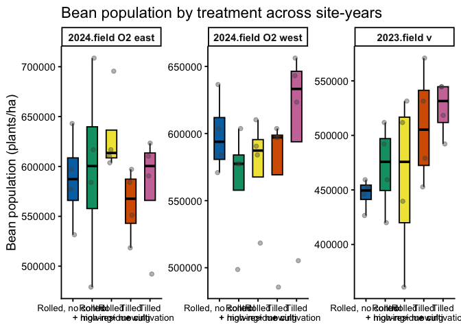
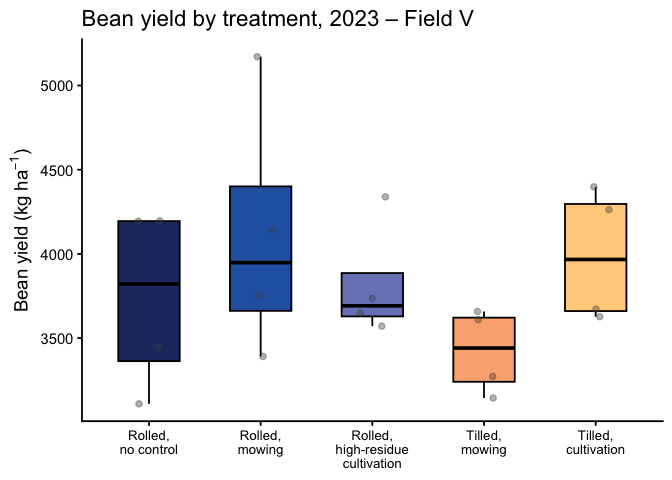
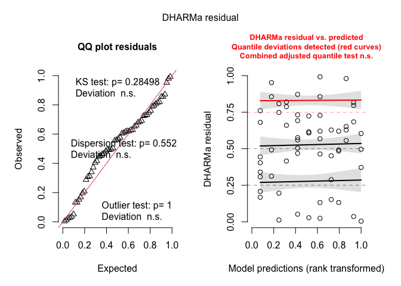
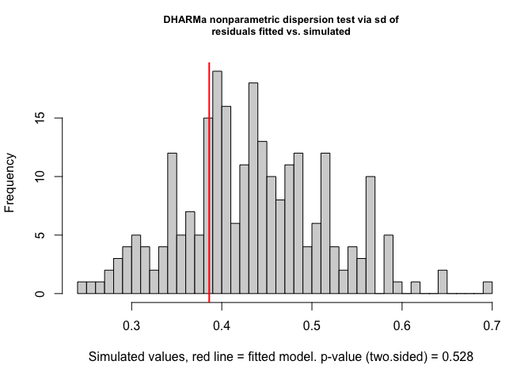
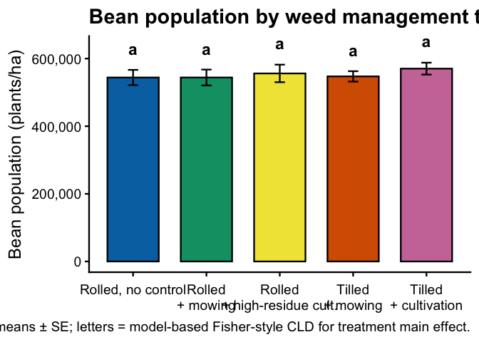
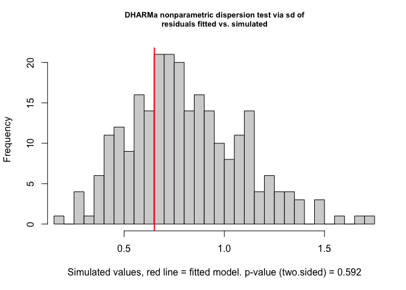
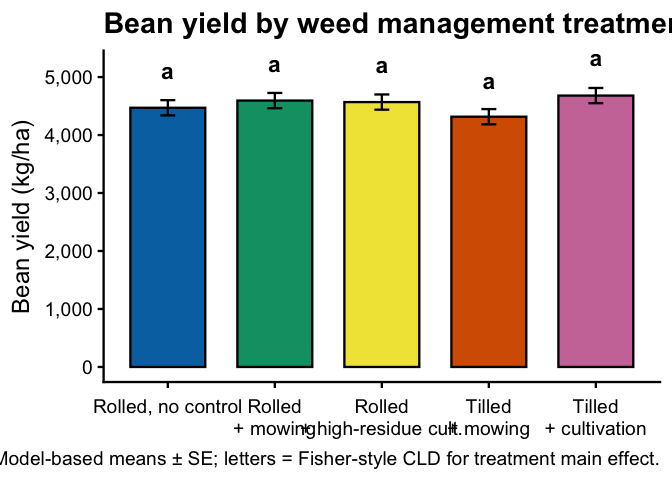
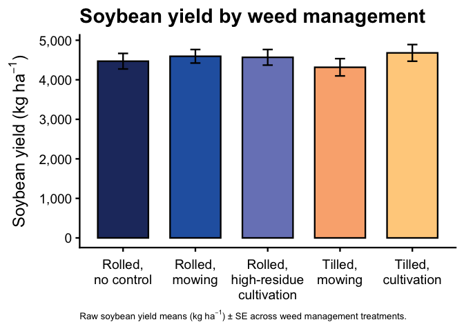

Soybean yield
================

- [Data import & prep](#data-import--prep)
- [Model testing](#model-testing)
  - [Exploratory:](#exploratory)
  - [Selection:](#selection)
    - [Pooled, Raw by site-year](#pooled-raw-by-site-year)
  - [Equivalence testing](#equivalence-testing)
  - [Post-hoc summary table](#post-hoc-summary-table)
  - [ANOVA-style summary tables for bean
    yield](#anova-style-summary-tables-for-bean-yield)
- [Figures](#figures)
  - [Pooled model](#pooled-model)
  - [Pooled raw](#pooled-raw)

\#Setup

\#Packages

``` r
# Packages
library(tidyverse)    # includes dplyr, ggplot2, readr, tibble, etc.
library(janitor)
library(readxl)
library(glmmTMB)
library(DHARMa)
library(emmeans)
library(multcomp)
library(car)
library(kableExtra)
library(here)
library(conflicted)
library(lme4)
library(WrensBookshelf)


# Handle conflicts
conflicts_prefer(dplyr::select)
conflicts_prefer(dplyr::filter)
conflicts_prefer(dplyr::recode)

# Treatment level order (use everywhere)
mow_levels <- c(
  "Rolled, no control",
  "Rolled, mowing",
  "Rolled, high-residue cultivation",
  "Tilled, mowing",
  "Tilled, cultivation"
)

# One consistent CVD-safe color palette for all figures (WrensBookshelf)
fill_cols <- WB_brewer(
  name = "WhatWellBuild",
  n    = length(mow_levels),
  type = "discrete"
) |>
  setNames(mow_levels)

# x-axis label helpers ---------------------------------------------------

# Break on spaces (if you ever want every word on its own line)
label_break_spaces <- function(x) {
  stringr::str_replace_all(x, " ", "\n")
}

# Break after the comma: "Rolled,\nno control", etc.
label_break_comma <- function(x) {
  stringr::str_replace_all(x, ", ", ",\n")
}

# Break after comma AND split "high-residue cultivation"
# -> "Rolled,\nhigh-residue\ncultivation"
label_break_comma_cult <- function(x) {
  x |>
    stringr::str_replace("high-residue cultivation",
                         "high-residue\ncultivation") |>
    stringr::str_replace_all(", ", ",\n")
}

# Helper: tidy emmeans output regardless of CI column names --------------
# (works directly on an emmeans object)

tidy_emm <- function(emm, ref_levels = NULL) {
  emm_df <- as.data.frame(emm)

  lcl_col <- intersect(c("lower.CL", "asymp.LCL"), names(emm_df))[1]
  ucl_col <- intersect(c("upper.CL", "asymp.UCL"), names(emm_df))[1]

  if (is.na(lcl_col) || is.na(ucl_col)) {
    stop("Could not find CI columns in emmeans output.")
  }

  out <- emm_df |>
    dplyr::mutate(
      ci_low  = .data[[lcl_col]],
      ci_high = .data[[ucl_col]]
    )

  if (!is.null(ref_levels) && "weed_trt" %in% names(out)) {
    out <- out |>
      dplyr::mutate(weed_trt = factor(weed_trt, levels = ref_levels))
  }

  out
}
```

# Data import & prep

``` r
bean_yield_clean <- read_excel(
  here("data", "raw", "All Treatments", "combined_raw.xlsx")
) |>
  clean_names() |>
  rename(weed_trt = treatment) |>
  mutate(
    year      = factor(year),
    location  = factor(location),
    site_year = factor(interaction(year, location, drop = TRUE)),
    block     = factor(block),
    weed_trt  = recode(
      weed_trt,
      "RNO" = "Rolled, no control",
      "RIM" = "Rolled, mowing",
      "RIC" = "Rolled, high-residue cultivation",
      "TIM" = "Tilled, mowing",
      "TIC" = "Tilled, cultivation"
    ),
    weed_trt = factor(weed_trt, levels = mow_levels)
  ) |>
  # keep only rows with non-missing yield
  filter(!is.na(bean_yield)) |>
  # add adjusted yield columns (no adjusted emergence here)
  mutate(
    bean_yield_adj_bu_acre = (((bean_yield / 454) / (16.4 / 43560)) / 60) *
      ((100 - 0.00001) / (100 - 13)),
    bean_yield_adj_lbs_acre = ((bean_yield / 454) / (16.4 / 43560)) *
      ((100 - 0.00001) / (100 - 13)),
    bean_yield_adj_kg_ha = ((bean_yield / 454) / (16.4 / 43560)) * 1.12085 *
      ((100 - 0.00001) / (100 - 13))
  )

# convenience aliases for plotting / modeling
bean_yield_clean <- bean_yield_clean |>
  mutate(
    bean_yield_kg_ha   = bean_yield_adj_kg_ha,
    bean_yield_bu_acre = bean_yield_adj_bu_acre
  )

# 2023 Field V subset (for the boxplot later)
bean_yield_field_v_2023 <- bean_yield_clean |>
  filter(year == 2023, location == "field v")

# Quick check
kable(
  head(bean_yield_clean),
  caption = "All site-years, cleaned (bean yield)"
)
```

| id | location | year | weed_trt | block | plot | bean_emergence | bean_biomass | inrow_weed_biomass | interrow_weed_biomass | weed_biomass | bean_population | bean_yield | seed_weight | site_year | bean_yield_adj_bu_acre | bean_yield_adj_lbs_acre | bean_yield_adj_kg_ha | bean_yield_kg_ha | bean_yield_bu_acre |
|:---|:---|:---|:---|:---|---:|---:|---:|---:|---:|---:|---:|---:|---:|:---|---:|---:|---:|---:|---:|
| CU_B1_P101 | field v | 2023 | Tilled, mowing | 1 | 101 | 46.5 | 223.740 | 19.000 | 44.490 | 63.490 | 34.5 | 417.21 | 17.1200 | 2023.field v | 46.75977 | 2805.586 | 3144.641 | 3144.641 | 46.75977 |
| CU_B1_P102 | field v | 2023 | Tilled, cultivation | 1 | 102 | 42.5 | 267.460 | 30.975 | 0.720 | 31.695 | 39.5 | 565.54 | 17.4750 | 2023.field v | 63.38419 | 3803.051 | 4262.650 | 4262.650 | 63.38419 |
| CU_B1_P103 | field v | 2023 | Rolled, mowing | 1 | 103 | 36.5 | 217.890 | 0.950 | 6.890 | 7.840 | 37.5 | 449.93 | 16.7525 | 2023.field v | 50.42694 | 3025.616 | 3391.262 | 3391.262 | 50.42694 |
| CU_B1_P104 | field v | 2023 | Rolled, no control | 1 | 104 | 41.0 | 207.675 | 0.660 | 45.735 | 46.395 | 35.0 | 412.59 | 16.1450 | 2023.field v | 46.24197 | 2774.518 | 3109.819 | 3109.819 | 46.24197 |
| CU_B1_P105 | field v | 2023 | Rolled, high-residue cultivation | 1 | 105 | 41.0 | 230.285 | 0.495 | 22.025 | 22.520 | 39.0 | 473.79 | 17.0475 | 2023.field v | 53.10110 | 3186.066 | 3571.102 | 3571.102 | 53.10110 |
| CU_B1_P201 | field v | 2023 | Rolled, high-residue cultivation | 2 | 201 | 36.5 | 208.105 | 6.395 | 19.460 | 25.855 | 33.5 | 484.04 | 17.1500 | 2023.field v | 54.24989 | 3254.994 | 3648.359 | 3648.359 | 54.24989 |

All site-years, cleaned (bean yield)

<br>

# Model testing

## Exploratory:

\###Raw by site-year

``` r
# 1) Summary table: bean yield by site-year × treatment
bean_yield_clean |>
  group_by(site_year, weed_trt) |>
  summarise(
    n      = n(),
    mean   = mean(bean_yield_kg_ha, na.rm = TRUE),
    median = median(bean_yield_kg_ha, na.rm = TRUE),
    sd     = sd(bean_yield_kg_ha, na.rm = TRUE),
    .groups = "drop"
  ) |>
  arrange(site_year, weed_trt) |>
  kable(
    digits  = 1,
    caption = "Bean yield (kg ha⁻¹) by site-year × treatment"
  ) |>
  kable_styling(full_width = FALSE, bootstrap_options = c("striped", "hover"))
```

<table class="table table-striped table-hover" style="color: black; width: auto !important; margin-left: auto; margin-right: auto;">

<caption>

Bean yield (kg ha⁻¹) by site-year × treatment
</caption>

<thead>

<tr>

<th style="text-align:left;">

site_year
</th>

<th style="text-align:left;">

weed_trt
</th>

<th style="text-align:right;">

n
</th>

<th style="text-align:right;">

mean
</th>

<th style="text-align:right;">

median
</th>

<th style="text-align:right;">

sd
</th>

</tr>

</thead>

<tbody>

<tr>

<td style="text-align:left;">

2024.field O2 east
</td>

<td style="text-align:left;">

Rolled, no control
</td>

<td style="text-align:right;">

4
</td>

<td style="text-align:right;">

5091.5
</td>

<td style="text-align:right;">

5095.2
</td>

<td style="text-align:right;">

101.0
</td>

</tr>

<tr>

<td style="text-align:left;">

2024.field O2 east
</td>

<td style="text-align:left;">

Rolled, mowing
</td>

<td style="text-align:right;">

4
</td>

<td style="text-align:right;">

5001.0
</td>

<td style="text-align:right;">

5004.8
</td>

<td style="text-align:right;">

341.4
</td>

</tr>

<tr>

<td style="text-align:left;">

2024.field O2 east
</td>

<td style="text-align:left;">

Rolled, high-residue cultivation
</td>

<td style="text-align:right;">

4
</td>

<td style="text-align:right;">

5170.6
</td>

<td style="text-align:right;">

5230.9
</td>

<td style="text-align:right;">

329.6
</td>

</tr>

<tr>

<td style="text-align:left;">

2024.field O2 east
</td>

<td style="text-align:left;">

Tilled, mowing
</td>

<td style="text-align:right;">

4
</td>

<td style="text-align:right;">

4808.8
</td>

<td style="text-align:right;">

4891.7
</td>

<td style="text-align:right;">

606.1
</td>

</tr>

<tr>

<td style="text-align:left;">

2024.field O2 east
</td>

<td style="text-align:left;">

Tilled, cultivation
</td>

<td style="text-align:right;">

4
</td>

<td style="text-align:right;">

4763.6
</td>

<td style="text-align:right;">

5050.0
</td>

<td style="text-align:right;">

678.9
</td>

</tr>

<tr>

<td style="text-align:left;">

2024.field O2 west
</td>

<td style="text-align:left;">

Rolled, no control
</td>

<td style="text-align:right;">

4
</td>

<td style="text-align:right;">

4582.7
</td>

<td style="text-align:right;">

4612.8
</td>

<td style="text-align:right;">

381.6
</td>

</tr>

<tr>

<td style="text-align:left;">

2024.field O2 west
</td>

<td style="text-align:left;">

Rolled, mowing
</td>

<td style="text-align:right;">

4
</td>

<td style="text-align:right;">

4667.5
</td>

<td style="text-align:right;">

4692.0
</td>

<td style="text-align:right;">

218.7
</td>

</tr>

<tr>

<td style="text-align:left;">

2024.field O2 west
</td>

<td style="text-align:left;">

Rolled, high-residue cultivation
</td>

<td style="text-align:right;">

4
</td>

<td style="text-align:right;">

4710.8
</td>

<td style="text-align:right;">

4876.6
</td>

<td style="text-align:right;">

486.8
</td>

</tr>

<tr>

<td style="text-align:left;">

2024.field O2 west
</td>

<td style="text-align:left;">

Tilled, mowing
</td>

<td style="text-align:right;">

4
</td>

<td style="text-align:right;">

4718.4
</td>

<td style="text-align:right;">

4733.4
</td>

<td style="text-align:right;">

243.1
</td>

</tr>

<tr>

<td style="text-align:left;">

2024.field O2 west
</td>

<td style="text-align:left;">

Tilled, cultivation
</td>

<td style="text-align:right;">

4
</td>

<td style="text-align:right;">

5287.4
</td>

<td style="text-align:right;">

5102.8
</td>

<td style="text-align:right;">

447.9
</td>

</tr>

<tr>

<td style="text-align:left;">

2023.field v
</td>

<td style="text-align:left;">

Rolled, no control
</td>

<td style="text-align:right;">

4
</td>

<td style="text-align:right;">

3737.1
</td>

<td style="text-align:right;">

3821.1
</td>

<td style="text-align:right;">

546.9
</td>

</tr>

<tr>

<td style="text-align:left;">

2023.field v
</td>

<td style="text-align:left;">

Rolled, mowing
</td>

<td style="text-align:right;">

4
</td>

<td style="text-align:right;">

4114.7
</td>

<td style="text-align:right;">

3948.2
</td>

<td style="text-align:right;">

768.5
</td>

</tr>

<tr>

<td style="text-align:left;">

2023.field v
</td>

<td style="text-align:left;">

Rolled, high-residue cultivation
</td>

<td style="text-align:right;">

4
</td>

<td style="text-align:right;">

3823.5
</td>

<td style="text-align:right;">

3692.0
</td>

<td style="text-align:right;">

350.2
</td>

</tr>

<tr>

<td style="text-align:left;">

2023.field v
</td>

<td style="text-align:left;">

Tilled, mowing
</td>

<td style="text-align:right;">

4
</td>

<td style="text-align:right;">

3421.2
</td>

<td style="text-align:right;">

3441.0
</td>

<td style="text-align:right;">

251.7
</td>

</tr>

<tr>

<td style="text-align:left;">

2023.field v
</td>

<td style="text-align:left;">

Tilled, cultivation
</td>

<td style="text-align:right;">

4
</td>

<td style="text-align:right;">

3990.0
</td>

<td style="text-align:right;">

3967.1
</td>

<td style="text-align:right;">

397.4
</td>

</tr>

</tbody>

</table>

``` r
# 2) Faceted boxplot: all site-years
bean_yield_clean |>
  ggplot(aes(x = weed_trt, y = bean_yield_kg_ha, fill = weed_trt)) +
  geom_boxplot(
    outlier.shape = NA,
    width  = 0.55,
    color  = "black"
  ) +
  geom_jitter(
    width  = 0.12,
    height = 0,
    alpha  = 0.4,
    size   = 1.8,
    color  = "grey30"
  ) +
  facet_wrap(~ site_year, nrow = 1) +
  scale_fill_manual(values = fill_cols, guide = "none") +
 scale_x_discrete(labels = label_break_comma_cult) +
  labs(
    x     = NULL,
    y = expression(Bean~yield~"(kg"~ha^{-1}*")"),
    title = "Bean yield by treatment across site-years"
  ) +
  theme_classic(base_size = 14) +
  theme(
    axis.text.x = element_text(size = 10),
    strip.text  = element_text(face = "bold")
  )
```

<!-- -->

``` r
# 3) Boxplot: 2023 – Field V only
bean_yield_field_v_2023 |>
  ggplot(aes(x = weed_trt, y = bean_yield_kg_ha, fill = weed_trt)) +
  geom_boxplot(
    outlier.shape = NA,
    width  = 0.55,
    color  = "black"
  ) +
  geom_jitter(
    width  = 0.12,
    height = 0,
    alpha  = 0.4,
    size   = 1.8,
    color  = "grey30"
  ) +
  scale_fill_manual(values = fill_cols, guide = "none") +
  scale_x_discrete(labels = label_break_comma_cult) +
  labs(
    x     = NULL,
    y = expression(Bean~yield~"(kg"~ha^{-1}*")"),
    title = "Bean yield by treatment, 2023 – Field V"
  ) +
  theme_classic(base_size = 14) +
  theme(
    axis.text.x = element_text(size = 10)
  )
```

<!-- -->

## Selection:

### Pooled, Raw by site-year

``` r
### Model testing / selection for bean yield (kg ha⁻¹)

options(contrasts = c("contr.sum", "contr.poly"))

# Interaction model: weed_trt * site_year --------------------------------
yield_int <- lmer(
  bean_yield_kg_ha ~ weed_trt * site_year + (1 | site_year:block),
  data = bean_yield_clean
)

# Additive model: weed_trt + site_year -----------------------------------
yield_add <- lmer(
  bean_yield_kg_ha ~ weed_trt + site_year + (1 | site_year:block),
  data = bean_yield_clean
)

# Compare models (AIC + LRT) ---------------------------------------------
# AIC table
aic_yield <- tibble(
  model = c(
    "Additive: weed_trt + site_year",
    "Interaction: weed_trt * site_year"
  ),
  AIC = c(AIC(yield_add), AIC(yield_int))
)

# Likelihood-ratio test (is the interaction worth keeping?)
lrt_yield <- anova(yield_add, yield_int)

p_int <- lrt_yield$`Pr(>Chisq)`[2]

# Apply your rule: choose simpler additive model unless interaction is clearly needed
chosen_model_name <- if (p_int < 0.05) {
  "Interaction: weed_trt * site_year"
} else {
  "Additive: weed_trt + site_year"
}

yield.lmer <- if (p_int < 0.05) yield_int else yield_add

# Add ΔAIC and "Selected" flag to the table ------------------------------
aic_yield_out <- aic_yield |>
  mutate(
    deltaAIC = AIC - min(AIC),
    Selected = if_else(model == chosen_model_name, "Yes", "")
  )

kable(
  aic_yield_out,
  digits  = 2,
  caption = "Bean yield (kg ha⁻¹): model comparison (additive vs interaction)"
) |>
  kable_styling(full_width = FALSE, bootstrap_options = c("striped", "hover"))
```

<table class="table table-striped table-hover" style="color: black; width: auto !important; margin-left: auto; margin-right: auto;">

<caption>

Bean yield (kg ha⁻¹): model comparison (additive vs interaction)
</caption>

<thead>

<tr>

<th style="text-align:left;">

model
</th>

<th style="text-align:right;">

AIC
</th>

<th style="text-align:right;">

deltaAIC
</th>

<th style="text-align:left;">

Selected
</th>

</tr>

</thead>

<tbody>

<tr>

<td style="text-align:left;">

Additive: weed_trt + site_year
</td>

<td style="text-align:right;">

839.62
</td>

<td style="text-align:right;">

87.48
</td>

<td style="text-align:left;">

Yes
</td>

</tr>

<tr>

<td style="text-align:left;">

Interaction: weed_trt \* site_year
</td>

<td style="text-align:right;">

752.14
</td>

<td style="text-align:right;">

0.00
</td>

<td style="text-align:left;">

</td>

</tr>

</tbody>

</table>

``` r
# Also show the LRT table (optional but handy)
lrt_yield
```

    ## Data: bean_yield_clean
    ## Models:
    ## yield_add: bean_yield_kg_ha ~ weed_trt + site_year + (1 | site_year:block)
    ## yield_int: bean_yield_kg_ha ~ weed_trt * site_year + (1 | site_year:block)
    ##           npar    AIC    BIC logLik -2*log(L)  Chisq Df Pr(>Chisq)
    ## yield_add    9 915.00 933.85 -448.5    897.00                     
    ## yield_int   17 919.01 954.61 -442.5    885.01 11.997  8     0.1514

``` r
# Quick text reminder of which model is used downstream ------------------
cat("\nSelected model for bean yield (used in all downstream emmeans/plots):\n  ",
    chosen_model_name,
    sprintf("  [LRT p = %.3f]\n", p_int))
```

    ## 
    ## Selected model for bean yield (used in all downstream emmeans/plots):
    ##    Additive: weed_trt + site_year   [LRT p = 0.151]

``` r
# Diagnostics on chosen model --------------------------------------------
set.seed(123)
res_yield <- DHARMa::simulateResiduals(yield.lmer)
plot(res_yield)
```

<!-- -->

``` r
DHARMa::testDispersion(yield.lmer)
```

<!-- -->

    ## 
    ##  DHARMa nonparametric dispersion test via sd of residuals fitted vs.
    ##  simulated
    ## 
    ## data:  simulationOutput
    ## dispersion = 0.89112, p-value = 0.528
    ## alternative hypothesis: two.sided

``` r
car::Anova(yield.lmer, type = 3)
```

    ## Analysis of Deviance Table (Type III Wald chisquare tests)
    ## 
    ## Response: bean_yield_kg_ha
    ##                 Chisq Df Pr(>Chisq)    
    ## (Intercept) 5469.5514  1  < 2.2e-16 ***
    ## weed_trt       4.5918  4     0.3318    
    ## site_year     68.3827  2  1.415e-15 ***
    ## ---
    ## Signif. codes:  0 '***' 0.001 '**' 0.01 '*' 0.05 '.' 0.1 ' ' 1

## Equivalence testing

``` r
## Equivalence testing: are no-till yields "close enough" to tilled? ----

# 1) EMMs for soybean yield ---------------------------------------------
emm_yield <- emmeans(yield.lmer, ~ weed_trt)

# Name of the tilled "control" treatment (must match mow_levels exactly)
tilled_trt <- "Tilled, cultivation"

# Extract treatment levels from emmGrid
trt_levels <- levels(emm_yield)$weed_trt

# Check the reference actually exists
if (!tilled_trt %in% trt_levels) {
  stop(
    "tilled_trt ('", tilled_trt, "') is not a level of weed_trt.\n",
    "Current levels are: ",
    paste(trt_levels, collapse = ", ")
  )
}

# 2) Define equivalence margin (as % of tilled yield) -------------------

# Get model-based tilled yield (kg ha⁻¹)
tilled_mean <- summary(emm_yield) |>
  as_tibble() |>
  filter(weed_trt == tilled_trt) |>
  pull(emmean)

margin_pct <- 0.10        # e.g., 0.10 = ±10% of tilled yield
delta_kg   <- margin_pct * tilled_mean

# For interpretation: convert margin to bu ac⁻¹ (approx)
kg_per_bu_ac <- 67.25     # ≈ kg ha⁻¹ per 1 bu ac⁻¹ for soybean
delta_bu_ac  <- delta_kg / kg_per_bu_ac

cat(
  "Equivalence margin:",
  sprintf("±%.0f kg ha⁻¹ (≈ ±%.1f bu ac⁻¹, %.0f%% of tilled yield)\n",
          delta_kg, delta_bu_ac, margin_pct * 100)
)
```

    ## Equivalence margin: ±468 kg ha⁻¹ (≈ ±7.0 bu ac⁻¹, 10% of tilled yield)

``` r
# 3) Contrasts: each treatment vs tilled --------------------------------
yield_vs_tilled <- contrast(
  emm_yield,
  method = "trt.vs.ctrl",
  ref    = which(trt_levels == tilled_trt)
)

# 4) TOST-style equivalence tests via emmeans ---------------------------
equiv_yield <- summary(
  yield_vs_tilled,
  infer  = c(TRUE, TRUE),     # show CI + tests
  level  = 0.90,              # 1 - 2*0.05 for α = 0.05 equivalence
  side   = "equivalence",     # two one-sided tests (TOST)
  delta  = delta_kg,
  adjust = "none"
) |>
  as_tibble() |>
  mutate(
    diff_bu_ac  = estimate / kg_per_bu_ac,
    lower_bu_ac = lower.CL / kg_per_bu_ac,
    upper_bu_ac = upper.CL / kg_per_bu_ac,
    p_equiv     = p.value
  )

# 5) Nicely formatted table for the Rmd ---------------------------------
equiv_yield_table <- equiv_yield |>
  transmute(
    Contrast    = contrast,
    diff_kg_ha  = estimate,
    lower_kg_ha = lower.CL,
    upper_kg_ha = upper.CL,
    diff_bu_ac,
    lower_bu_ac,
    upper_bu_ac,
    p_equiv
  ) |>
  mutate(
    across(
      c(diff_kg_ha, lower_kg_ha, upper_kg_ha,
        diff_bu_ac, lower_bu_ac, upper_bu_ac),
      ~ round(.x, 1)
    ),
    p_equiv = signif(p_equiv, 3)
  ) |>
  kable(
    caption = paste0(
      "Equivalence tests for soybean yield vs ",
      tilled_trt,
      " (margin = ±",
      round(delta_kg, 0), " kg ha⁻¹ ≈ ±",
      round(delta_bu_ac, 1), " bu ac⁻¹)."
    ),
    col.names = c(
      "Contrast",
      "Difference (kg ha⁻¹)", "Lower 90% CI", "Upper 90% CI",
      "Differrence (bu ac⁻¹ )", "Lower 90% CI", "Upper 90% CI",
      "p (equiv.)"
    )
  ) |>
  kable_styling(full_width = FALSE, bootstrap_options = c("striped", "hover"))

equiv_yield_table
```

<table class="table table-striped table-hover" style="color: black; width: auto !important; margin-left: auto; margin-right: auto;">

<caption>

Equivalence tests for soybean yield vs Tilled, cultivation (margin =
±468 kg ha⁻¹ ≈ ±7 bu ac⁻¹).
</caption>

<thead>

<tr>

<th style="text-align:left;">

Contrast
</th>

<th style="text-align:right;">

Difference (kg ha⁻¹)
</th>

<th style="text-align:right;">

Lower 90% CI
</th>

<th style="text-align:right;">

Upper 90% CI
</th>

<th style="text-align:right;">

Differrence (bu ac⁻¹ )
</th>

<th style="text-align:right;">

Lower 90% CI
</th>

<th style="text-align:right;">

Upper 90% CI
</th>

<th style="text-align:right;">

p (equiv.)
</th>

</tr>

</thead>

<tbody>

<tr>

<td style="text-align:left;">

Rolled, no control - Tilled, cultivation
</td>

<td style="text-align:right;">

-209.9
</td>

<td style="text-align:right;">

-518.5
</td>

<td style="text-align:right;">

98.6
</td>

<td style="text-align:right;">

-3.1
</td>

<td style="text-align:right;">

-7.7
</td>

<td style="text-align:right;">

1.5
</td>

<td style="text-align:right;">

0.0834
</td>

</tr>

<tr>

<td style="text-align:left;">

Rolled, mowing - Tilled, cultivation
</td>

<td style="text-align:right;">

-85.9
</td>

<td style="text-align:right;">

-394.5
</td>

<td style="text-align:right;">

222.6
</td>

<td style="text-align:right;">

-1.3
</td>

<td style="text-align:right;">

-5.9
</td>

<td style="text-align:right;">

3.3
</td>

<td style="text-align:right;">

0.0217
</td>

</tr>

<tr>

<td style="text-align:left;">

(Rolled, high-residue cultivation) - Tilled, cultivation
</td>

<td style="text-align:right;">

-112.0
</td>

<td style="text-align:right;">

-420.6
</td>

<td style="text-align:right;">

196.5
</td>

<td style="text-align:right;">

-1.7
</td>

<td style="text-align:right;">

-6.3
</td>

<td style="text-align:right;">

2.9
</td>

<td style="text-align:right;">

0.0295
</td>

</tr>

<tr>

<td style="text-align:left;">

Tilled, mowing - Tilled, cultivation
</td>

<td style="text-align:right;">

-364.2
</td>

<td style="text-align:right;">

-672.7
</td>

<td style="text-align:right;">

-55.7
</td>

<td style="text-align:right;">

-5.4
</td>

<td style="text-align:right;">

-10.0
</td>

<td style="text-align:right;">

-0.8
</td>

<td style="text-align:right;">

0.2870
</td>

</tr>

</tbody>

</table>

## Post-hoc summary table

``` r
### Bean yield (kg ha⁻¹) with Fisher's LSD CLDs

# Estimated marginal means for weed_trt
emm_yield <- emmeans(yield.lmer, ~ weed_trt)

# Tidy emmeans (adds ci_low / ci_high and enforces treatment order)
emm_yield_df <- tidy_emm(emm_yield, ref_levels = mow_levels) |>
  as_tibble()

# Compact letter display (Fisher's LSD, no adjustment; "a" = highest)
cld_yield <- cld(
  emm_yield,
  adjust  = "none",
  Letters = letters,
  sort    = TRUE,
  reversed = TRUE
) |>
  as_tibble() |>
  mutate(
    weed_trt = factor(weed_trt, levels = mow_levels),
    .group   = str_trim(.group)
  ) |>
  select(weed_trt, .group)

# Join emmeans + CLDs and format for reporting
emm_yield_df |>
  left_join(cld_yield, by = "weed_trt") |>
  select(weed_trt, emmean, SE, ci_low, ci_high, .group) |>
  mutate(across(c(emmean, SE, ci_low, ci_high), ~ round(.x, 1))) |>
  kable(
    caption   = "Estimated bean yield (kg ha⁻¹) with 95% CI and Fisher's LSD group letters",
    col.names = c("Treatment", "Mean", "SE", "Lower CI", "Upper CI", "Group")
  ) |>
  kable_styling(full_width = FALSE, bootstrap_options = c("striped", "hover"))
```

<table class="table table-striped table-hover" style="color: black; width: auto !important; margin-left: auto; margin-right: auto;">

<caption>

Estimated bean yield (kg ha⁻¹) with 95% CI and Fisher’s LSD group
letters
</caption>

<thead>

<tr>

<th style="text-align:left;">

Treatment
</th>

<th style="text-align:right;">

Mean
</th>

<th style="text-align:right;">

SE
</th>

<th style="text-align:right;">

Lower CI
</th>

<th style="text-align:right;">

Upper CI
</th>

<th style="text-align:left;">

Group
</th>

</tr>

</thead>

<tbody>

<tr>

<td style="text-align:left;">

Rolled, no control
</td>

<td style="text-align:right;">

4470.4
</td>

<td style="text-align:right;">

131.3
</td>

<td style="text-align:right;">

4207.0
</td>

<td style="text-align:right;">

4733.8
</td>

<td style="text-align:left;">

a
</td>

</tr>

<tr>

<td style="text-align:left;">

Rolled, mowing
</td>

<td style="text-align:right;">

4594.4
</td>

<td style="text-align:right;">

131.3
</td>

<td style="text-align:right;">

4331.0
</td>

<td style="text-align:right;">

4857.8
</td>

<td style="text-align:left;">

a
</td>

</tr>

<tr>

<td style="text-align:left;">

Rolled, high-residue cultivation
</td>

<td style="text-align:right;">

4568.3
</td>

<td style="text-align:right;">

131.3
</td>

<td style="text-align:right;">

4304.9
</td>

<td style="text-align:right;">

4831.7
</td>

<td style="text-align:left;">

a
</td>

</tr>

<tr>

<td style="text-align:left;">

Tilled, mowing
</td>

<td style="text-align:right;">

4316.1
</td>

<td style="text-align:right;">

131.3
</td>

<td style="text-align:right;">

4052.7
</td>

<td style="text-align:right;">

4579.5
</td>

<td style="text-align:left;">

a
</td>

</tr>

<tr>

<td style="text-align:left;">

Tilled, cultivation
</td>

<td style="text-align:right;">

4680.3
</td>

<td style="text-align:right;">

131.3
</td>

<td style="text-align:right;">

4416.9
</td>

<td style="text-align:right;">

4943.7
</td>

<td style="text-align:left;">

a
</td>

</tr>

</tbody>

</table>

## ANOVA-style summary tables for bean yield

``` r
## 1) P-value summary (Location, Treatment, Interaction) -----------------

# Type-III tests for additive model (weed_trt + site_year)
anova_yield <- Anova(yield.lmer, type = 3)

anova_yield_df <- anova_yield |>
  as.data.frame() |>
  tibble::rownames_to_column("Effect")

# LRT for interaction (additive vs interaction models)
anova_interaction_yield <- anova(yield_add, yield_int)

pvals_yield <- tibble(
  Effect = c("Location (site_year)", "Treatment (weed_trt)", "Location × Treatment"),
  p_raw  = c(
    anova_yield_df$`Pr(>Chisq)`[anova_yield_df$Effect == "site_year"],
    anova_yield_df$`Pr(>Chisq)`[anova_yield_df$Effect == "weed_trt"],
    anova_interaction_yield$`Pr(>Chisq)`[2]
  )
) |>
  mutate(
    `P-value` = case_when(
      p_raw < 0.001 ~ "<0.001",
      p_raw < 0.01  ~ "<0.01",
      TRUE          ~ sprintf("%.3f", p_raw)
    )
  ) |>
  select(Effect, `P-value`)

pvals_yield |>
  kable(
    caption   = "Bean yield (kg ha⁻¹): P-values for location, treatment, and interaction",
    col.names = c("Effect", "P-value")
  ) |>
  kable_styling(full_width = FALSE, bootstrap_options = c("striped", "hover"))
```

<table class="table table-striped table-hover" style="color: black; width: auto !important; margin-left: auto; margin-right: auto;">

<caption>

Bean yield (kg ha⁻¹): P-values for location, treatment, and interaction
</caption>

<thead>

<tr>

<th style="text-align:left;">

Effect
</th>

<th style="text-align:left;">

P-value
</th>

</tr>

</thead>

<tbody>

<tr>

<td style="text-align:left;">

Location (site_year)
</td>

<td style="text-align:left;">

\<0.001
</td>

</tr>

<tr>

<td style="text-align:left;">

Treatment (weed_trt)
</td>

<td style="text-align:left;">

0.332
</td>

</tr>

<tr>

<td style="text-align:left;">

Location × Treatment
</td>

<td style="text-align:left;">

0.151
</td>

</tr>

</tbody>

</table>

``` r
## 2) Location block: site-year means (model + raw) ----------------------

# Model-based emmeans by site_year
emm_loc_yield <- emmeans(yield.lmer, ~ site_year)

emm_loc_yield_df <- tidy_emm(emm_loc_yield) |>
  as_tibble() |>
  mutate(
    site_year  = as.factor(site_year),
    model_mean = emmean
  ) |>
  select(site_year, model_mean)

# CLDs for site_year (a = highest)
cld_loc_yield <- cld(
  emm_loc_yield,
  adjust   = "none",
  Letters  = letters,
  sort     = TRUE,
  reversed = TRUE
) |>
  as_tibble() |>
  mutate(
    site_year = as.factor(site_year),
    loc_CLD   = str_trim(.group)
  ) |>
  select(site_year, loc_CLD)

# Raw means by site_year
raw_loc_yield <- bean_yield_clean |>
  group_by(site_year) |>
  summarise(
    raw_mean = mean(bean_yield_kg_ha, na.rm = TRUE),
    .groups  = "drop"
  ) |>
  mutate(site_year = as.factor(site_year))

loc_summary_yield <- emm_loc_yield_df |>
  left_join(cld_loc_yield, by = "site_year") |>
  left_join(raw_loc_yield, by = "site_year") |>
  mutate(
    model_mean = round(model_mean, 1),
    raw_mean   = round(raw_mean, 1),
    raw_CLD    = loc_CLD  # use same letters for model + raw
  ) |>
  arrange(site_year)

loc_summary_yield |>
  kable(
    caption   = "Bean yield (kg ha⁻¹): location (site-year) means with CLDs",
    col.names = c("Site-year", "Model mean", "Model CLD", "Raw mean", "Raw CLD")
  ) |>
  kable_styling(full_width = FALSE, bootstrap_options = c("striped", "hover"))
```

<table class="table table-striped table-hover" style="color: black; width: auto !important; margin-left: auto; margin-right: auto;">

<caption>

Bean yield (kg ha⁻¹): location (site-year) means with CLDs
</caption>

<thead>

<tr>

<th style="text-align:left;">

Site-year
</th>

<th style="text-align:right;">

Model mean
</th>

<th style="text-align:left;">

Model CLD
</th>

<th style="text-align:right;">

Raw mean
</th>

<th style="text-align:left;">

Raw CLD
</th>

</tr>

</thead>

<tbody>

<tr>

<td style="text-align:left;">

2024.field O2 east
</td>

<td style="text-align:right;">

4967.1
</td>

<td style="text-align:left;">

a
</td>

<td style="text-align:right;">

4967.1
</td>

<td style="text-align:left;">

a
</td>

</tr>

<tr>

<td style="text-align:left;">

2024.field O2 west
</td>

<td style="text-align:right;">

4793.4
</td>

<td style="text-align:left;">

a
</td>

<td style="text-align:right;">

4793.4
</td>

<td style="text-align:left;">

a
</td>

</tr>

<tr>

<td style="text-align:left;">

2023.field v
</td>

<td style="text-align:right;">

3817.3
</td>

<td style="text-align:left;">

b
</td>

<td style="text-align:right;">

3817.3
</td>

<td style="text-align:left;">

b
</td>

</tr>

</tbody>

</table>

``` r
## 3) Treatment block: means (model + raw) -------------------------------

# emmeans for treatment
emm_yield <- emmeans(yield.lmer, ~ weed_trt)

emm_trt_yield_df <- tidy_emm(emm_yield, ref_levels = mow_levels) |>
  as_tibble() |>
  mutate(
    weed_trt   = factor(weed_trt, levels = mow_levels),
    model_mean = emmean
  ) |>
  select(weed_trt, model_mean)

# CLDs for treatment (a = highest)
cld_yield <- cld(
  emm_yield,
  adjust   = "none",
  Letters  = letters,
  sort     = TRUE,
  reversed = TRUE
) |>
  as_tibble() |>
  mutate(
    weed_trt = factor(weed_trt, levels = mow_levels),
    trt_CLD  = str_trim(.group)
  ) |>
  select(weed_trt, trt_CLD)

# Raw means by treatment
raw_trt_yield <- bean_yield_clean |>
  group_by(weed_trt) |>
  summarise(
    raw_mean = mean(bean_yield_kg_ha, na.rm = TRUE),
    .groups  = "drop"
  ) |>
  mutate(weed_trt = factor(weed_trt, levels = mow_levels))

trt_summary_yield <- emm_trt_yield_df |>
  left_join(cld_yield, by = "weed_trt") |>
  left_join(raw_trt_yield, by = "weed_trt") |>
  mutate(
    model_mean = round(model_mean, 1),
    raw_mean   = round(raw_mean, 1),
    raw_CLD    = trt_CLD
  ) |>
  arrange(weed_trt)

trt_summary_yield |>
  kable(
    caption   = "Bean yield (kg ha⁻¹): treatment means with CLDs",
    col.names = c("Treatment", "Model mean", "Model CLD", "Raw mean", "Raw CLD")
  ) |>
  kable_styling(full_width = FALSE, bootstrap_options = c("striped", "hover"))
```

<table class="table table-striped table-hover" style="color: black; width: auto !important; margin-left: auto; margin-right: auto;">

<caption>

Bean yield (kg ha⁻¹): treatment means with CLDs
</caption>

<thead>

<tr>

<th style="text-align:left;">

Treatment
</th>

<th style="text-align:right;">

Model mean
</th>

<th style="text-align:left;">

Model CLD
</th>

<th style="text-align:right;">

Raw mean
</th>

<th style="text-align:left;">

Raw CLD
</th>

</tr>

</thead>

<tbody>

<tr>

<td style="text-align:left;">

Rolled, no control
</td>

<td style="text-align:right;">

4470.4
</td>

<td style="text-align:left;">

a
</td>

<td style="text-align:right;">

4470.4
</td>

<td style="text-align:left;">

a
</td>

</tr>

<tr>

<td style="text-align:left;">

Rolled, mowing
</td>

<td style="text-align:right;">

4594.4
</td>

<td style="text-align:left;">

a
</td>

<td style="text-align:right;">

4594.4
</td>

<td style="text-align:left;">

a
</td>

</tr>

<tr>

<td style="text-align:left;">

Rolled, high-residue cultivation
</td>

<td style="text-align:right;">

4568.3
</td>

<td style="text-align:left;">

a
</td>

<td style="text-align:right;">

4568.3
</td>

<td style="text-align:left;">

a
</td>

</tr>

<tr>

<td style="text-align:left;">

Tilled, mowing
</td>

<td style="text-align:right;">

4316.1
</td>

<td style="text-align:left;">

a
</td>

<td style="text-align:right;">

4316.1
</td>

<td style="text-align:left;">

a
</td>

</tr>

<tr>

<td style="text-align:left;">

Tilled, cultivation
</td>

<td style="text-align:right;">

4680.3
</td>

<td style="text-align:left;">

a
</td>

<td style="text-align:right;">

4680.3
</td>

<td style="text-align:left;">

a
</td>

</tr>

</tbody>

</table>

``` r
## 4) Interaction block: site-year × treatment means ---------------------

# Model emmeans by treatment within site_year
emm_sy_yield <- emmeans(yield.lmer, ~ weed_trt | site_year)

emm_sy_yield_df <- tidy_emm(emm_sy_yield, ref_levels = mow_levels) |>
  as_tibble() |>
  mutate(
    weed_trt   = factor(weed_trt, levels = mow_levels),
    site_year  = as.factor(site_year),
    model_mean = emmean
  ) |>
  select(site_year, weed_trt, model_mean)

# CLDs within each site_year (a = highest within that site_year)
cld_sy_yield <- cld(
  emm_sy_yield,
  adjust   = "none",
  Letters  = letters,
  sort     = TRUE,
  reversed = TRUE
) |>
  as_tibble() |>
  mutate(
    weed_trt  = factor(weed_trt, levels = mow_levels),
    site_year = as.factor(site_year),
    int_CLD   = str_trim(.group)
  ) |>
  select(site_year, weed_trt, int_CLD)

# Raw means by site_year × treatment
raw_sy_yield <- bean_yield_clean |>
  group_by(site_year, weed_trt) |>
  summarise(
    raw_mean = mean(bean_yield_kg_ha, na.rm = TRUE),
    .groups  = "drop"
  ) |>
  mutate(
    site_year = as.factor(site_year),
    weed_trt  = factor(weed_trt, levels = mow_levels)
  )

int_summary_yield <- emm_sy_yield_df |>
  left_join(cld_sy_yield, by = c("site_year", "weed_trt")) |>
  left_join(raw_sy_yield, by = c("site_year", "weed_trt")) |>
  mutate(
    model_mean = round(model_mean, 1),
    raw_mean   = round(raw_mean, 1),
    raw_CLD    = int_CLD
  ) |>
  arrange(site_year, weed_trt)

int_summary_yield |>
  kable(
    caption   = "Bean yield (kg ha⁻¹): site-year × treatment means with CLDs",
    col.names = c(
      "Site-year", "Treatment",
      "Model mean", "Model CLD",
      "Raw mean",   "Raw CLD"
    )
  ) |>
  kable_styling(full_width = FALSE, bootstrap_options = c("striped", "hover"))
```

<table class="table table-striped table-hover" style="color: black; width: auto !important; margin-left: auto; margin-right: auto;">

<caption>

Bean yield (kg ha⁻¹): site-year × treatment means with CLDs
</caption>

<thead>

<tr>

<th style="text-align:left;">

Site-year
</th>

<th style="text-align:left;">

Treatment
</th>

<th style="text-align:right;">

Model mean
</th>

<th style="text-align:left;">

Model CLD
</th>

<th style="text-align:right;">

Raw mean
</th>

<th style="text-align:left;">

Raw CLD
</th>

</tr>

</thead>

<tbody>

<tr>

<td style="text-align:left;">

2024.field O2 east
</td>

<td style="text-align:left;">

Rolled, no control
</td>

<td style="text-align:right;">

4911.6
</td>

<td style="text-align:left;">

a
</td>

<td style="text-align:right;">

5091.5
</td>

<td style="text-align:left;">

a
</td>

</tr>

<tr>

<td style="text-align:left;">

2024.field O2 east
</td>

<td style="text-align:left;">

Rolled, mowing
</td>

<td style="text-align:right;">

5035.6
</td>

<td style="text-align:left;">

a
</td>

<td style="text-align:right;">

5001.0
</td>

<td style="text-align:left;">

a
</td>

</tr>

<tr>

<td style="text-align:left;">

2024.field O2 east
</td>

<td style="text-align:left;">

Rolled, high-residue cultivation
</td>

<td style="text-align:right;">

5009.5
</td>

<td style="text-align:left;">

a
</td>

<td style="text-align:right;">

5170.6
</td>

<td style="text-align:left;">

a
</td>

</tr>

<tr>

<td style="text-align:left;">

2024.field O2 east
</td>

<td style="text-align:left;">

Tilled, mowing
</td>

<td style="text-align:right;">

4757.3
</td>

<td style="text-align:left;">

a
</td>

<td style="text-align:right;">

4808.8
</td>

<td style="text-align:left;">

a
</td>

</tr>

<tr>

<td style="text-align:left;">

2024.field O2 east
</td>

<td style="text-align:left;">

Tilled, cultivation
</td>

<td style="text-align:right;">

5121.5
</td>

<td style="text-align:left;">

a
</td>

<td style="text-align:right;">

4763.6
</td>

<td style="text-align:left;">

a
</td>

</tr>

<tr>

<td style="text-align:left;">

2024.field O2 west
</td>

<td style="text-align:left;">

Rolled, no control
</td>

<td style="text-align:right;">

4737.9
</td>

<td style="text-align:left;">

a
</td>

<td style="text-align:right;">

4582.7
</td>

<td style="text-align:left;">

a
</td>

</tr>

<tr>

<td style="text-align:left;">

2024.field O2 west
</td>

<td style="text-align:left;">

Rolled, mowing
</td>

<td style="text-align:right;">

4861.8
</td>

<td style="text-align:left;">

a
</td>

<td style="text-align:right;">

4667.5
</td>

<td style="text-align:left;">

a
</td>

</tr>

<tr>

<td style="text-align:left;">

2024.field O2 west
</td>

<td style="text-align:left;">

Rolled, high-residue cultivation
</td>

<td style="text-align:right;">

4835.7
</td>

<td style="text-align:left;">

a
</td>

<td style="text-align:right;">

4710.8
</td>

<td style="text-align:left;">

a
</td>

</tr>

<tr>

<td style="text-align:left;">

2024.field O2 west
</td>

<td style="text-align:left;">

Tilled, mowing
</td>

<td style="text-align:right;">

4583.6
</td>

<td style="text-align:left;">

a
</td>

<td style="text-align:right;">

4718.4
</td>

<td style="text-align:left;">

a
</td>

</tr>

<tr>

<td style="text-align:left;">

2024.field O2 west
</td>

<td style="text-align:left;">

Tilled, cultivation
</td>

<td style="text-align:right;">

4947.8
</td>

<td style="text-align:left;">

a
</td>

<td style="text-align:right;">

5287.4
</td>

<td style="text-align:left;">

a
</td>

</tr>

<tr>

<td style="text-align:left;">

2023.field v
</td>

<td style="text-align:left;">

Rolled, no control
</td>

<td style="text-align:right;">

3761.8
</td>

<td style="text-align:left;">

a
</td>

<td style="text-align:right;">

3737.1
</td>

<td style="text-align:left;">

a
</td>

</tr>

<tr>

<td style="text-align:left;">

2023.field v
</td>

<td style="text-align:left;">

Rolled, mowing
</td>

<td style="text-align:right;">

3885.8
</td>

<td style="text-align:left;">

a
</td>

<td style="text-align:right;">

4114.7
</td>

<td style="text-align:left;">

a
</td>

</tr>

<tr>

<td style="text-align:left;">

2023.field v
</td>

<td style="text-align:left;">

Rolled, high-residue cultivation
</td>

<td style="text-align:right;">

3859.7
</td>

<td style="text-align:left;">

a
</td>

<td style="text-align:right;">

3823.5
</td>

<td style="text-align:left;">

a
</td>

</tr>

<tr>

<td style="text-align:left;">

2023.field v
</td>

<td style="text-align:left;">

Tilled, mowing
</td>

<td style="text-align:right;">

3607.5
</td>

<td style="text-align:left;">

a
</td>

<td style="text-align:right;">

3421.2
</td>

<td style="text-align:left;">

a
</td>

</tr>

<tr>

<td style="text-align:left;">

2023.field v
</td>

<td style="text-align:left;">

Tilled, cultivation
</td>

<td style="text-align:right;">

3971.7
</td>

<td style="text-align:left;">

a
</td>

<td style="text-align:right;">

3990.0
</td>

<td style="text-align:left;">

a
</td>

</tr>

</tbody>

</table>

\##2023 Raw

``` r
### Selection: 2023 – Field V only


options(contrasts = c("contr.sum", "contr.poly"))

# Field V 2023 subset
bean_yield_field_v_2023 <- bean_yield_clean |>
  dplyr::filter(year == 2023, location == "field v") |>
  dplyr::mutate(
    weed_trt = factor(weed_trt, levels = mow_levels)
  )

# 1) treatment model: yield ~ weed_trt + (1|block)
yield_fv.lmer <- lmer(
  bean_yield_adj_kg_ha ~ weed_trt + (1 | block),
  data = bean_yield_field_v_2023
)

# 2) optional null model: no treatment effect
yield_fv.null <- lmer(
  bean_yield_adj_kg_ha ~ 1 + (1 | block),
  data = bean_yield_field_v_2023
)

# compare models (does weed_trt help?)
AIC(yield_fv.null, yield_fv.lmer)
```

    ##               df      AIC
    ## yield_fv.null  3 299.3210
    ## yield_fv.lmer  7 252.8761

``` r
anova(yield_fv.null, yield_fv.lmer)
```

    ## Data: bean_yield_field_v_2023
    ## Models:
    ## yield_fv.null: bean_yield_adj_kg_ha ~ 1 + (1 | block)
    ## yield_fv.lmer: bean_yield_adj_kg_ha ~ weed_trt + (1 | block)
    ##               npar    AIC    BIC  logLik -2*log(L)  Chisq Df Pr(>Chisq)
    ## yield_fv.null    3 310.64 313.63 -152.32    304.64                     
    ## yield_fv.lmer    7 313.21 320.18 -149.61    299.21 5.4239  4     0.2465

``` r
# diagnostics on the treatment model
res_yield_fv <- DHARMa::simulateResiduals(yield_fv.lmer)
plot(res_yield_fv)
```

<!-- -->

``` r
DHARMa::testDispersion(yield_fv.lmer)
```

<!-- -->

    ## 
    ##  DHARMa nonparametric dispersion test via sd of residuals fitted vs.
    ##  simulated
    ## 
    ## data:  simulationOutput
    ## dispersion = 0.80609, p-value = 0.592
    ## alternative hypothesis: two.sided

``` r
car::Anova(yield_fv.lmer, type = 3)
```

    ## Analysis of Deviance Table (Type III Wald chisquare tests)
    ## 
    ## Response: bean_yield_adj_kg_ha
    ##               Chisq Df Pr(>Chisq)    
    ## (Intercept) 968.349  1     <2e-16 ***
    ## weed_trt      4.831  4     0.3051    
    ## ---
    ## Signif. codes:  0 '***' 0.001 '**' 0.01 '*' 0.05 '.' 0.1 ' ' 1

# Figures

### Pooled model

``` r
# Figure: Bean yield by weed management treatment (pooled across site-years)

# Estimated marginal means for treatments
emm_yield <- emmeans(yield.lmer, ~ weed_trt)

# Tidy emmeans for plotting
plot_df_yield <- tidy_emm(emm_yield, ref_levels = mow_levels) |>
  as_tibble() |>
  mutate(
    response = emmean,
    ymin     = pmax(response - SE, 0),
    ymax     = response + SE
  )


# Plot
ggplot(plot_df_yield, aes(x = weed_trt, y = response, fill = weed_trt)) +
  geom_col(width = 0.7, color = "black") +
  geom_errorbar(aes(ymin = ymin, ymax = ymax), width = 0.14) +
  scale_fill_manual(values = fill_cols, guide = "none") +
  scale_x_discrete(labels = label_break_comma_cult) +
  scale_y_continuous(labels = scales::label_comma()) +
  labs(
    x       = NULL,
    y = expression(Bean~yield~"(kg"~ha^{-1}*")"),,
    title   = "Soybean yield by weed management",
    caption = "Model-based soybean yield means (kg"~ha^{-1}*") ± SE across weed management treatments."
  ) +
  theme_classic(base_size = 18) +
  theme(
    axis.text.x    = element_text(lineheight = 0.95, margin = margin(t = 8)),
    axis.title.y   = element_text(margin = margin(r = 8)),
    plot.title     = element_text(face = "bold"),
    plot.caption   = element_text(size = 10, hjust = 0)  # a bit smaller, left-aligned
  )
```

<!-- -->

``` r
# Save figure
ggsave(
  filename = here("figs", "analysis", "fig_bean_yield_mowing_pooled.png"),
  width    = 7.5,
  height   = 5.5,
  dpi      = 300
)
```

### Pooled raw

``` r
# Figure: Bean yield by weed management treatment (raw means ± SE)

# 1) Raw means and SE by treatment --------------------------------------
raw_yield_summary <- bean_yield_clean |>
  group_by(weed_trt) |>
  summarise(
    n    = n(),
    mean = mean(bean_yield_kg_ha, na.rm = TRUE),
    sd   = sd(bean_yield_kg_ha, na.rm = TRUE),
    se   = sd / sqrt(n),
    .groups = "drop"
  ) |>
  mutate(
    weed_trt = factor(weed_trt, levels = mow_levels),
    ymin     = pmax(mean - se, 0),
    ymax     = mean + se
  )

# 2) Plot ---------------------------------------------------------------
ggplot(raw_yield_summary, aes(x = weed_trt, y = mean, fill = weed_trt)) +
  geom_col(width = 0.7, color = "black") +
  geom_errorbar(aes(ymin = ymin, ymax = ymax), width = 0.14) +
  scale_fill_manual(values = fill_cols, guide = "none") +
  scale_x_discrete(labels = label_break_comma_cult) +
  scale_y_continuous(labels = scales::label_comma()) +
  labs(
    x       = NULL,
    y       = "Soybean yield (kg"~ha^{-1}*")",
    title   = "Soybean yield by weed management",
    caption = "Raw soybean yield means (kg"~ha^{-1}*") ± SE across weed management treatments."
  ) +
  theme_classic(base_size = 18) +
  theme(
    axis.text.x    = element_text(lineheight = 0.95, margin = margin(t = 8)),
    axis.title.y   = element_text(margin = margin(r = 8)),
    plot.title     = element_text(face = "bold"),
    plot.caption   = element_text(size = 10, hjust = 0)  # smaller, left-aligned
  )
```

<!-- -->

``` r
# Save figure
ggsave(
  filename = here("figs", "analysis", "fig_bean_yield_mowing_pooled_raw.png"),
  width    = 7.5,
  height   = 5.5,
  dpi      = 300
)
```
