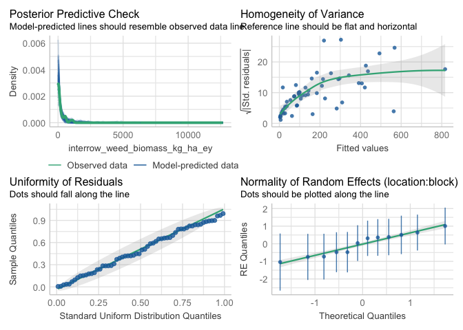
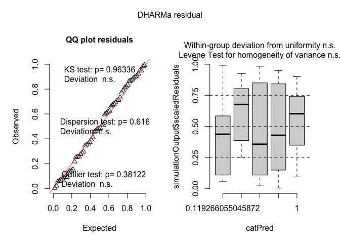
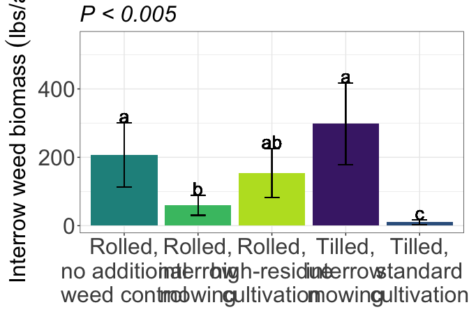

interrow weed biomass
================

# Load libraries

``` r
#Set work directory
setwd("/Users/ey239/Github/Mowtivation/rmarkdowns")

#Load packages 
library(tidyverse) ##install.packages("tidyverse")
library(knitr)
library(patchwork) ##install.packages("patchwork")
library(skimr)     ##install.packages("skimr")
library(readxl)
library(janitor) ##install.packages("janitor")

library(kableExtra) ##install.packages("kableExtra")
library(webshot) ##install.packages("webshot")
webshot::install_phantomjs()
library(viridis) ##install.packages("viridis")
library(lme4) ##install.packages("lme4")
library(lmerTest) ##install.packages("lmerTest")
library(emmeans) ##install.packages("emmeans")
library(rstatix) ##install.packages("rstatix")
#library(Matrix) ##install.packages("Matrix")
library(multcomp) ##install.packages("multcomp")
library(multcompView) ##install.packages("multcompView")
library(ggResidpanel) ##install.packages("ggResidpanel")
#library(car)
#library(TMB)  ##install.packages("TMB")
library(glmmTMB)  ##install.packages("glmmTMB")
library(DHARMa)  ##install.packages("DHARMa")
library(performance) ##install.packages("performance")

#Load Functions
MeanPlusSe<-function(x) mean(x)+plotrix::std.error(x)

find_logw0=function(x){c=trunc(log(min(x[x>0],na.rm=T)))
d=exp(c)
return(d)}
```

<br>

# Load and Clean Data

## Load data

``` r
combined_raw <- read_excel("~/Github/Mowtivation/raw-data/All Treatments/combined_raw.xlsx")
kable(head(combined_raw))
```

| id | location | year | treatment | block | plot | bean_emergence | bean_biomass | intrarow_weed_biomass | interrow_weed_biomass | weed_biomass | bean_population | bean_yield | seed_weight |
|:---|:---|---:|:---|---:|---:|---:|---:|---:|---:|---:|---:|---:|---:|
| CU_B1_P101 | field x | 2023 | TIM | 1 | 101 | 46.5 | 223.740 | 19.000 | 44.490 | 63.490 | 34.5 | 417.21 | 17.1200 |
| CU_B1_P102 | field x | 2023 | TIC | 1 | 102 | 42.5 | 267.460 | 30.975 | 0.720 | 31.695 | 39.5 | 565.54 | 17.4750 |
| CU_B1_P103 | field x | 2023 | RIM | 1 | 103 | 36.5 | 217.890 | 0.950 | 6.890 | 7.840 | 37.5 | 449.93 | 16.7525 |
| CU_B1_P104 | field x | 2023 | RNO | 1 | 104 | 41.0 | 207.675 | 0.660 | 45.735 | 46.395 | 35.0 | 412.59 | 16.1450 |
| CU_B1_P105 | field x | 2023 | RIC | 1 | 105 | 41.0 | 230.285 | 0.495 | 22.025 | 22.520 | 39.0 | 473.79 | 17.0475 |
| CU_B1_P201 | field x | 2023 | RIC | 2 | 201 | 36.5 | 208.105 | 6.395 | 19.460 | 25.855 | 33.5 | 484.04 | 17.1500 |

## Clean data

``` r
#Standardaze column names, convert to factors, check for outliers of variable**
clean_combined <- clean_names(combined_raw) |>  
  rename ('weed_control'= treatment) |> 
  mutate(across(c(weed_control, block, plot, location, year), as.factor)) #|> 
  #mutate(is_outlier = totwbm < (quantile(totwbm, 0.25) - 1.5 * IQR(totwbm)) |
                       #wbm > (quantile(totwbm, 0.75) + 1.5 * IQR(totwbm)))

#select and convert data for wbm analysis
interrow_weed_biomass_clean <- clean_combined |>
  mutate(
    log_interrow_weed_biomass_grams_meter = log((interrow_weed_biomass * 2) + 1),
    interrow_weed_biomass_grams_meter_mr = interrow_weed_biomass / 0.5,
    interrow_weed_biomass_grams_meter_ey = interrow_weed_biomass / 0.4,
    interrow_weed_biomass_kg_ha_mr = interrow_weed_biomass_grams_meter_mr * 10,
    interrow_weed_biomass_kg_ha_ey = interrow_weed_biomass_grams_meter_ey * 10,
    interrow_weed_biomass_lbs_ac_mr = interrow_weed_biomass_kg_ha_mr * 0.892179,
    interrow_weed_biomass_lbs_ac_ey = interrow_weed_biomass_kg_ha_ey * 0.892179
  )

kable(head(interrow_weed_biomass_clean))
```

| id | location | year | weed_control | block | plot | bean_emergence | bean_biomass | intrarow_weed_biomass | interrow_weed_biomass | weed_biomass | bean_population | bean_yield | seed_weight | log_interrow_weed_biomass_grams_meter | interrow_weed_biomass_grams_meter_mr | interrow_weed_biomass_grams_meter_ey | interrow_weed_biomass_kg_ha_mr | interrow_weed_biomass_kg_ha_ey | interrow_weed_biomass_lbs_ac_mr | interrow_weed_biomass_lbs_ac_ey |
|:---|:---|:---|:---|:---|:---|---:|---:|---:|---:|---:|---:|---:|---:|---:|---:|---:|---:|---:|---:|---:|
| CU_B1_P101 | field x | 2023 | TIM | 1 | 101 | 46.5 | 223.740 | 19.000 | 44.490 | 63.490 | 34.5 | 417.21 | 17.1200 | 4.499587 | 88.98 | 111.2250 | 889.8 | 1112.250 | 793.86087 | 992.32609 |
| CU_B1_P102 | field x | 2023 | TIC | 1 | 102 | 42.5 | 267.460 | 30.975 | 0.720 | 31.695 | 39.5 | 565.54 | 17.4750 | 0.891998 | 1.44 | 1.8000 | 14.4 | 18.000 | 12.84738 | 16.05922 |
| CU_B1_P103 | field x | 2023 | RIM | 1 | 103 | 36.5 | 217.890 | 0.950 | 6.890 | 7.840 | 37.5 | 449.93 | 16.7525 | 2.693275 | 13.78 | 17.2250 | 137.8 | 172.250 | 122.94227 | 153.67783 |
| CU_B1_P104 | field x | 2023 | RNO | 1 | 104 | 41.0 | 207.675 | 0.660 | 45.735 | 46.395 | 35.0 | 412.59 | 16.1450 | 4.526884 | 91.47 | 114.3375 | 914.7 | 1143.375 | 816.07613 | 1020.09516 |
| CU_B1_P105 | field x | 2023 | RIC | 1 | 105 | 41.0 | 230.285 | 0.495 | 22.025 | 22.520 | 39.0 | 473.79 | 17.0475 | 3.807773 | 44.05 | 55.0625 | 440.5 | 550.625 | 393.00485 | 491.25606 |
| CU_B1_P201 | field x | 2023 | RIC | 2 | 201 | 36.5 | 208.105 | 6.395 | 19.460 | 25.855 | 33.5 | 484.04 | 17.1500 | 3.686878 | 38.92 | 48.6500 | 389.2 | 486.500 | 347.23607 | 434.04508 |

Block is random Tyler is under the impression that block should always
be random and that post-hoc comparisons should use TUKEY rather the
Fischer. Fisher is bogus apparently.

\#Glmm with Tweedie regression

``` r
model_tweedie_log <- glmmTMB(
interrow_weed_biomass_kg_ha_ey ~  weed_control + 
  (1|location:block), 
  data = interrow_weed_biomass_clean, 
  family = tweedie(link = "log")

)
### Two checks specifically for a generalize linear approach
simulateResiduals(model_tweedie_log,plot = TRUE) # Residuals and normality look good
```

<!-- -->

    ## Object of Class DHARMa with simulated residuals based on 250 simulations with refit = FALSE . See ?DHARMa::simulateResiduals for help. 
    ##  
    ## Scaled residual values: 0.892 0.8 0.872 0.96 0.84 0.884 0.824 0.84 0.09439827 0.784 0.648 0.2327611 0.824 0.668 0.284 0.428 0.66 0.896 0.5 0.784 ...

``` r
check_model(model_tweedie_log) #Perfect, preditions match real data
```

    ## `check_outliers()` does not yet support models of class `glmmTMB`.

<!-- -->

``` r
summary(model_tweedie_log )
```

    ##  Family: tweedie  ( log )
    ## Formula:          
    ## interrow_weed_biomass_kg_ha_ey ~ weed_control + (1 | location:block)
    ## Data: interrow_weed_biomass_clean
    ## 
    ##      AIC      BIC   logLik deviance df.resid 
    ##    637.8    654.6   -310.9    621.8       52 
    ## 
    ## Random effects:
    ## 
    ## Conditional model:
    ##  Groups         Name        Variance Std.Dev.
    ##  location:block (Intercept) 0.6429   0.8018  
    ## Number of obs: 60, groups:  location:block, 12
    ## 
    ## Dispersion parameter for tweedie family (): 8.27 
    ## 
    ## Conditional model:
    ##                 Estimate Std. Error z value Pr(>|z|)    
    ## (Intercept)       5.0347     0.4668  10.785  < 2e-16 ***
    ## weed_controlRIM  -0.9445     0.5685  -1.661 0.096649 .  
    ## weed_controlRNO   0.2985     0.5173   0.577 0.563898    
    ## weed_controlTIC  -2.7064     0.7307  -3.704 0.000212 ***
    ## weed_controlTIM   0.6624     0.5192   1.276 0.201987    
    ## ---
    ## Signif. codes:  0 '***' 0.001 '**' 0.01 '*' 0.05 '.' 0.1 ' ' 1

``` r
VarCorr(model_tweedie_log )
```

    ## 
    ## Conditional model:
    ##  Groups         Name        Std.Dev.
    ##  location:block (Intercept) 0.80183

### Joint test (anova)

``` r
model_tweedie_log |> 
  joint_tests() |> 
  kable()  
```

| model term   | df1 | df2 | F.ratio |  Chisq |  p.value |
|:-------------|----:|----:|--------:|-------:|---------:|
| weed_control |   4 | Inf |   7.111 | 28.444 | 1.01e-05 |

## Fisher compact letter display

### Weed-control (significant)

``` r
cld_weed_control_fisher <-cld(emmeans(model_tweedie_log, ~  weed_control, type = "response"), Letters = letters,adjust = "none", sort = TRUE, reversed=TRUE)
cld_weed_control_fisher
```

    ##  weed_control response     SE  df asymp.LCL asymp.UCL .group
    ##  TIM             298.0 120.00 Inf    135.75     654.2  a    
    ##  RNO             207.1  94.10 Inf     85.03     504.5  a    
    ##  RIC             153.7  71.70 Inf     61.55     383.6  ab   
    ##  RIM              59.8  29.40 Inf     22.79     156.7   b   
    ##  TIC              10.3   6.91 Inf      2.74      38.4    c  
    ## 
    ## Confidence level used: 0.95 
    ## Intervals are back-transformed from the log scale 
    ## Tests are performed on the log scale 
    ## significance level used: alpha = 0.05 
    ## NOTE: If two or more means share the same grouping symbol,
    ##       then we cannot show them to be different.
    ##       But we also did not show them to be the same.

\#Glmm with zero inflated tweedie model

``` r
model_tweedie_zero <- glmmTMB(
interrow_weed_biomass_lbs_ac_mr ~  weed_control + 
  (1|location:block), 
  data = interrow_weed_biomass_clean, 
  family = tweedie(link = "log"),
  zi = ~ 1

)
### Two checks specifically for a generalize linear approach
simulateResiduals(model_tweedie_zero,plot = TRUE) # Residuals and normality look good
```

<!-- -->

    ## Object of Class DHARMa with simulated residuals based on 250 simulations with refit = FALSE . See ?DHARMa::simulateResiduals for help. 
    ##  
    ## Scaled residual values: 0.9 0.812 0.892 0.948 0.908 0.868 0.82 0.876 0.2881688 0.788 0.624 0.05441117 0.832 0.708 0.256 0.456 0.692 0.924 0.508 0.772 ...

``` r
check_model(model_tweedie_zero) #Perfect, preditions match real data
```

    ## `check_outliers()` does not yet support models of class `glmmTMB`.

<!-- -->

``` r
summary(model_tweedie_zero )
```

    ##  Family: tweedie  ( log )
    ## Formula:          
    ## interrow_weed_biomass_lbs_ac_mr ~ weed_control + (1 | location:block)
    ## Zero inflation:                                   ~1
    ## Data: interrow_weed_biomass_clean
    ## 
    ##      AIC      BIC   logLik deviance df.resid 
    ##    608.0    626.9   -295.0    590.0       51 
    ## 
    ## Random effects:
    ## 
    ## Conditional model:
    ##  Groups         Name        Variance Std.Dev.
    ##  location:block (Intercept) 0.6594   0.812   
    ## Number of obs: 60, groups:  location:block, 12
    ## 
    ## Dispersion parameter for tweedie family (): 6.81 
    ## 
    ## Conditional model:
    ##                 Estimate Std. Error z value Pr(>|z|)    
    ## (Intercept)       4.7423     0.4932   9.615  < 2e-16 ***
    ## weed_controlRIM  -0.9858     0.5710  -1.727 0.084255 .  
    ## weed_controlRNO   0.2653     0.5185   0.512 0.608849    
    ## weed_controlTIC  -2.7760     0.7462  -3.720 0.000199 ***
    ## weed_controlTIM   0.6691     0.5293   1.264 0.206158    
    ## ---
    ## Signif. codes:  0 '***' 0.001 '**' 0.01 '*' 0.05 '.' 0.1 ' ' 1
    ## 
    ## Zero-inflation model:
    ##             Estimate Std. Error z value Pr(>|z|)
    ## (Intercept)   -3.482      2.893  -1.204    0.229

``` r
VarCorr(model_tweedie_zero )
```

    ## 
    ## Conditional model:
    ##  Groups         Name        Std.Dev.
    ##  location:block (Intercept) 0.81204

### Joint test (anova)

``` r
model_tweedie_zero |> 
  joint_tests() |> 
  kable()  
```

| model term   | df1 | df2 | F.ratio |  Chisq | p.value |
|:-------------|----:|----:|--------:|-------:|--------:|
| weed_control |   4 | Inf |   7.022 | 28.088 | 1.2e-05 |

``` r
options(contrasts = c("contr.sum", "contr.poly"))
Anova(model_tweedie_zero, type = 3)
```

    ## Analysis of Deviance Table (Type III Wald chisquare tests)
    ## 
    ## Response: interrow_weed_biomass_lbs_ac_mr
    ##               Chisq Df Pr(>Chisq)    
    ## (Intercept)  92.457  1  < 2.2e-16 ***
    ## weed_control 28.088  4  1.197e-05 ***
    ## ---
    ## Signif. codes:  0 '***' 0.001 '**' 0.01 '*' 0.05 '.' 0.1 ' ' 1

## Fisher compact letter display

### Weed-control (significant)

``` r
cld_weed_control_fisher <-cld(emmeans(model_tweedie_log, ~  weed_control, type = "response"), Letters = letters,adjust = "none", sort = TRUE, reversed=TRUE)
cld_weed_control_fisher
```

    ##  weed_control response     SE  df asymp.LCL asymp.UCL .group
    ##  TIM             298.0 120.00 Inf    135.75     654.2  a    
    ##  RNO             207.1  94.10 Inf     85.03     504.5  a    
    ##  RIC             153.7  71.70 Inf     61.55     383.6  ab   
    ##  RIM              59.8  29.40 Inf     22.79     156.7   b   
    ##  TIC              10.3   6.91 Inf      2.74      38.4    c  
    ## 
    ## Confidence level used: 0.95 
    ## Intervals are back-transformed from the log scale 
    ## Tests are performed on the log scale 
    ## significance level used: alpha = 0.05 
    ## NOTE: If two or more means share the same grouping symbol,
    ##       then we cannot show them to be different.
    ##       But we also did not show them to be the same.

# Figures

\##lbs/a \###Matt conversion

``` r
interrow_weed_biomass_clean |> 
  left_join(cld_weed_control_fisher) |> 
  ggplot(aes(x = factor(weed_control, levels = c("RNO", "RIM", "RIC", "TIM", "TIC")), y = response, fill = weed_control)) +
  #stat_summary(geom = "bar", fun = mean, width = 0.7) +  # Ensuring mean calculation
  #stat_summary(geom = "errorbar", fun.data = mean_se, width = 0.2) +  # Explicit mean_se
  #stat_summary(geom = "text", fun = mean, aes(label = trimws(.group)), 
               #size = 6.5, vjust = -0.5) +  # Adjusting labels) 
  geom_bar(stat="identity", position=position_dodge()) + 
  geom_errorbar(aes(ymin=response-SE, ymax=response+SE), width=.2,
                 position=position_dodge(.9))+
geom_text(aes(label = trimws(.group), y = response + (SE + 20)), size = 7) +
  labs(
    x = "",
    y = expression("Interrow weed biomass" ~ (lbs * "/" * a)),
    #title = str_c("Influence of interrow weed control on interrow weed biomass"),
    subtitle = expression(italic("P < 0.005"))) +
  
 scale_x_discrete(labels = c("Rolled,\nno additional\nweed control",
                              "Rolled,\ninterrow\nmowing",
                              "Rolled,\nhigh-residue\ncultivation",
                              "Tilled,\ninterrow\nmowing",
                          "Tilled,\nstandard\ncultivation")) +
  scale_y_continuous(expand = expansion(mult = c(0.05, 0.3))) +
  scale_fill_viridis(discrete = TRUE, option = "D", direction = -1, end = 0.9, begin = 0.1) +
   theme_bw() +
  theme(
    legend.position = "none",
    strip.background = element_blank(),
    strip.text = element_text(face = "bold", size = 12),
    axis.title = element_text(size = 24),  # Increase font size of axis titles
    axis.text = element_text(size = 24),   # Increase font size of axis labels
    plot.title = element_text(size = 24, face = "bold"),  # Increase font size of title
    plot.subtitle = element_text(size = 24, face = "italic")  # Increase font size of subtitle
  )
```

<!-- -->

``` r
ggsave("interrow_weed_biomass_weed_control_lbac_mr.png", width = 10, height = 8, dpi = 300)
```

\###Eric conversion

``` r
interrow_weed_biomass_clean |> 
  left_join(cld_weed_control_fisher) |> 
  ggplot(aes(x = factor(weed_control, levels = c("RNO", "RIM", "RIC", "TIM", "TIC")), y = response, fill = weed_control)) +
  #stat_summary(geom = "bar", fun = mean, width = 0.7) +  # Ensuring mean calculation
  #stat_summary(geom = "errorbar", fun.data = mean_se, width = 0.2) +  # Explicit mean_se
  #stat_summary(geom = "text", fun = mean, aes(label = trimws(.group)), 
               #size = 6.5, vjust = -0.5) +  # Adjusting labels) 
  geom_bar(stat="identity", position=position_dodge()) + 
  geom_errorbar(aes(ymin=response-SE, ymax=response+SE), width=.2,
                 position=position_dodge(.9))+
geom_text(aes(label = trimws(.group), y = response + (SE + 20)), size = 7) +
  labs(
    x = "",
    y = expression("Interrow weed biomass" ~ (lbs * "/" * a)),
    #title = str_c("Influence of interrow weed control on interrow weed biomass"),
    subtitle = expression(italic("P < 0.005"))) +
  
 scale_x_discrete(labels = c("Rolled,\nno additional\nweed control",
                              "Rolled,\ninterrow\nmowing",
                              "Rolled,\nhigh-residue\ncultivation",
                              "Tilled,\ninterrow\nmowing",
                          "Tilled,\nstandard\ncultivation")) +
  scale_y_continuous(expand = expansion(mult = c(0.05, 0.3))) +
  scale_fill_viridis(discrete = TRUE, option = "D", direction = -1, end = 0.9, begin = 0.1) +
   theme_bw() +
  theme(
    legend.position = "none",
    strip.background = element_blank(),
    strip.text = element_text(face = "bold", size = 12),
    axis.title = element_text(size = 24),  # Increase font size of axis titles
    axis.text = element_text(size = 24),   # Increase font size of axis labels
    plot.title = element_text(size = 24, face = "bold"),  # Increase font size of title
    plot.subtitle = element_text(size = 24, face = "italic")  # Increase font size of subtitle
  )
```

<!-- -->

``` r
ggsave("interrow_weed_biomass_weed_control_lbac_ey.png", width = 10, height = 8, dpi = 300)
```

\##kg/hectarw \###Matt conversion

``` r
interrow_weed_biomass_clean |> 
  left_join(cld_weed_control_fisher) |> 
  ggplot(aes(x = factor(weed_control, levels = c("RNO", "RIM", "RIC", "TIM", "TIC")), y = response, fill = weed_control)) +
  #stat_summary(geom = "bar", fun = mean, width = 0.7) +  # Ensuring mean calculation
  #stat_summary(geom = "errorbar", fun.data = mean_se, width = 0.2) +  # Explicit mean_se
  #stat_summary(geom = "text", fun = mean, aes(label = trimws(.group)), 
               #size = 6.5, vjust = -0.5) +  # Adjusting labels) 
  geom_bar(stat="identity", position=position_dodge()) + 
  geom_errorbar(aes(ymin=response-SE, ymax=response+SE), width=.2,
                 position=position_dodge(.9))+
geom_text(aes(label = trimws(.group), y = response + (SE + 20)), size = 7) +
  labs(
    x = "",
    y = expression("Interrow weed biomass" ~ ~ (kg ~ ha^{-1})),
    #title = str_c("Influence of interrow weed control on interrow weed biomass"),
    subtitle = expression(italic("P < 0.005"))) +
  
 scale_x_discrete(labels = c("Rolled,\nno additional\nweed control",
                              "Rolled,\ninterrow\nmowing",
                              "Rolled,\nhigh-residue\ncultivation",
                              "Tilled,\ninterrow\nmowing",
                          "Tilled,\nstandard\ncultivation")) +
  scale_y_continuous(expand = expansion(mult = c(0.05, 0.3))) +
  scale_fill_viridis(discrete = TRUE, option = "D", direction = -1, end = 0.9, begin = 0.1) +
   theme_bw() +
  theme(
    legend.position = "none",
    strip.background = element_blank(),
    strip.text = element_text(face = "bold", size = 12),
    axis.title = element_text(size = 24),  # Increase font size of axis titles
    axis.text = element_text(size = 24),   # Increase font size of axis labels
    plot.title = element_text(size = 24, face = "bold"),  # Increase font size of title
    plot.subtitle = element_text(size = 24, face = "italic")  # Increase font size of subtitle
  )
```

<!-- -->

``` r
ggsave("interrow_weed_biomass_weed_control_kgha_mr.png", width = 10, height = 8, dpi = 300)
```

\###Eric conversion

``` r
interrow_weed_biomass_clean |> 
  left_join(cld_weed_control_fisher) |> 
  ggplot(aes(x = factor(weed_control, levels = c("RNO", "RIM", "RIC", "TIM", "TIC")), y = response, fill = weed_control)) +
  #stat_summary(geom = "bar", fun = mean, width = 0.7) +  # Ensuring mean calculation
  #stat_summary(geom = "errorbar", fun.data = mean_se, width = 0.2) +  # Explicit mean_se
  #stat_summary(geom = "text", fun = mean, aes(label = trimws(.group)), 
               #size = 6.5, vjust = -0.5) +  # Adjusting labels) 
  geom_bar(stat="identity", position=position_dodge()) + 
  geom_errorbar(aes(ymin=response-SE, ymax=response+SE), width=.2,
                 position=position_dodge(.9))+
geom_text(aes(label = trimws(.group), y = response + (SE + 20)), size = 7) +
  labs(
    x = "",
    y = expression("Interrow weed biomass" ~ (lbs * "/" * a)),
    #title = str_c("Influence of interrow weed control on interrow weed biomass"),
    subtitle = expression(italic("P < 0.005"))) +
  
 scale_x_discrete(labels = c("Rolled,\nno additional\nweed control",
                              "Rolled,\ninterrow\nmowing",
                              "Rolled,\nhigh-residue\ncultivation",
                              "Tilled,\ninterrow\nmowing",
                          "Tilled,\nstandard\ncultivation")) +
  scale_y_continuous(expand = expansion(mult = c(0.05, 0.3))) +
  scale_fill_viridis(discrete = TRUE, option = "D", direction = -1, end = 0.9, begin = 0.1) +
   theme_bw() +
  theme(
    legend.position = "none",
    strip.background = element_blank(),
    strip.text = element_text(face = "bold", size = 12),
    axis.title = element_text(size = 24),  # Increase font size of axis titles
    axis.text = element_text(size = 24),   # Increase font size of axis labels
    plot.title = element_text(size = 24, face = "bold"),  # Increase font size of title
    plot.subtitle = element_text(size = 24, face = "italic")  # Increase font size of subtitle
  )
```

<!-- -->

``` r
ggsave("interrow_weed_biomass_weed_control_kgha_ey.png", width = 10, height = 8, dpi = 300)
```
