Soybean yield
================

- [Setup](#setup)
- [Packages](#packages)
- [Project Directories](#project-directories)
- [Data import and preparation](#data-import-and-preparation)
  - [All data](#all-data)
  - [2024 subset](#2024-subset)
- [Model testing and diagnostics](#model-testing-and-diagnostics)
  - [Exploratory checks](#exploratory-checks)
  - [Model selection](#model-selection)
    - [All data](#all-data-1)
    - [2024 subset](#2024-subset-1)
- [Summary tables](#summary-tables)
- [Equivalence tests vs tilled
  control](#equivalence-tests-vs-tilled-control)
  - [All data](#all-data-2)
  - [2024 subset](#2024-subset-2)
- [Figures](#figures)
  - [All data](#all-data-3)
  - [2024 subset](#2024-subset-3)

# Setup

# Packages

``` r
# Packages
library(tidyverse)    # includes dplyr, ggplot2, readr, tibble, etc.
library(janitor)
library(readxl)
library(glmmTMB)
library(DHARMa)
library(emmeans)
library(multcomp)
library(car)
library(kableExtra)
library(here)
library(conflicted)
library(lme4)
library(WrensBookshelf)
library(writexl)
library(performance)

# Handle conflicts
conflicts_prefer(dplyr::select)
conflicts_prefer(dplyr::filter)
conflicts_prefer(dplyr::recode)

# Treatment level order (use everywhere)
mow_levels <- c(
  "Rolled, no control",
  "Rolled, mowing",
  "Rolled, high-residue cultivation",
  "Tilled, mowing",
  "Tilled, cultivation"
)

# One consistent CVD-safe color palette for all figures (WrensBookshelf)
fill_cols <- WB_brewer(
  name = "WhatWellBuild",
  n    = length(mow_levels),
  type = "discrete"
) |>
  setNames(mow_levels)

# x-axis label helpers ---------------------------------------------------

# Break on spaces (if you ever want every word on its own line)
label_break_spaces <- function(x) {
  stringr::str_replace_all(x, " ", "\n")
}

# Break after the comma: "Rolled,\nno control", etc.
label_break_comma <- function(x) {
  stringr::str_replace_all(x, ", ", ",\n")
}

# Break after comma AND split "high-residue cultivation"
# -> "Rolled,\nhigh-residue\ncultivation"
label_break_comma_cult <- function(x) {
  x |>
    stringr::str_replace("high-residue cultivation",
                         "high-residue\ncultivation") |>
    stringr::str_replace_all(", ", ",\n")
}

# Helper: tidy emmeans output regardless of CI column names --------------
# (works directly on an emmeans object)

tidy_emm <- function(emm, ref_levels = NULL) {
  emm_df <- as.data.frame(emm)

  lcl_col <- intersect(c("lower.CL", "asymp.LCL"), names(emm_df))[1]
  ucl_col <- intersect(c("upper.CL", "asymp.UCL"), names(emm_df))[1]

  if (is.na(lcl_col) || is.na(ucl_col)) {
    stop("Could not find CI columns in emmeans output.")
  }

  out <- emm_df |>
    dplyr::mutate(
      ci_low  = .data[[lcl_col]],
      ci_high = .data[[ucl_col]]
    )

  if (!is.null(ref_levels) && "weed_trt" %in% names(out)) {
    out <- out |>
      dplyr::mutate(weed_trt = factor(weed_trt, levels = ref_levels))
  }

  out
}

# Global options (set once per Rmd) --------------------------------------
options(contrasts = c("contr.sum", "contr.poly"))
```

# Project Directories

``` r
doc_name <- "soybean_yield"

fig_dir <- here("output", "figures", doc_name)
tab_dir <- here("output", "tables",  doc_name)

dir.create(fig_dir, recursive = TRUE, showWarnings = FALSE)
dir.create(tab_dir, recursive = TRUE, showWarnings = FALSE)
```

# Data import and preparation

## All data

``` r
bean_yield_clean <- read_excel(
  here("data", "raw", "All Treatments", "combined_raw.xlsx")
) |>
  clean_names() |>
  rename(weed_trt = treatment) |>
  mutate(
    year      = factor(year),
    location  = factor(location),
    site_year = factor(interaction(year, location, drop = TRUE)),
    block     = factor(block),
    weed_trt  = recode(
      weed_trt,
      "RNO" = "Rolled, no control",
      "RIM" = "Rolled, mowing",
      "RIC" = "Rolled, high-residue cultivation",
      "TIM" = "Tilled, mowing",
      "TIC" = "Tilled, cultivation"
    ),
    weed_trt = factor(weed_trt, levels = mow_levels)
  ) |>
  # keep only rows with non-missing yield
  filter(!is.na(bean_yield)) |>
  # add adjusted yield columns (no adjusted emergence here)
  mutate(
    bean_yield_adj_bu_acre = (((bean_yield / 454) / (16.4 / 43560)) / 60) *
      ((100 - 0.00001) / (100 - 13)),
    bean_yield_adj_lbs_acre = ((bean_yield / 454) / (16.4 / 43560)) *
      ((100 - 0.00001) / (100 - 13)),
    bean_yield_adj_kg_ha = ((bean_yield / 454) / (16.4 / 43560)) * 1.12085 *
      ((100 - 0.00001) / (100 - 13))
  )

bean_yield_clean <- bean_yield_clean |>
  mutate(
    bean_yield_kg_ha   = bean_yield_adj_kg_ha,
    bean_yield_bu_acre = bean_yield_adj_bu_acre,
    bean_yield_lb_acre = bean_yield_adj_lbs_acre
  )
```

## 2024 subset

``` r
# Subset for 2024-only (farmer meeting highlight) ------------------------

bean_yield_clean <- bean_yield_clean |>
  dplyr::mutate(
    year = readr::parse_number(as.character(site_year))
  )

soy_yield_2024 <- bean_yield_clean |>
  dplyr::filter(year == 2024) |>
  droplevels()

dplyr::count(soy_yield_2024, site_year)
```

    ## # A tibble: 2 × 2
    ##   site_year              n
    ##   <fct>              <int>
    ## 1 2024.field O2 east    20
    ## 2 2024.field O2 west    20

# Model testing and diagnostics

## Exploratory checks

``` r
## Exploratory: raw summaries + by-site-year boxplot ----------------------

## Prep a single exploratory dataframe (keeps factor levels consistent) --
soy_yield_explore <- bean_yield_clean |>
  dplyr::mutate(
    site_year = factor(site_year),
    weed_trt  = factor(weed_trt, levels = mow_levels)
  )

## 1) Summary table: soybean yield by site-year x treatment --------------

soy_yield_sy_trt_summary <- soy_yield_explore |>
  dplyr::group_by(site_year, weed_trt) |>
  dplyr::summarise(
    n      = sum(!is.na(bean_yield_kg_ha)),
    mean   = mean(bean_yield_kg_ha, na.rm = TRUE),
    median = median(bean_yield_kg_ha, na.rm = TRUE),
    sd     = sd(bean_yield_kg_ha, na.rm = TRUE),
    se     = dplyr::if_else(n >= 2, sd / sqrt(n), NA_real_),
    .groups = "drop"
  ) |>
  dplyr::arrange(site_year, weed_trt)

# Save summary table
readr::write_csv(
  soy_yield_sy_trt_summary,
  file.path(tab_dir, "tab_soybean-yield_site-year_treatment_summary_raw_kg_ha.csv")
)

soy_yield_sy_trt_summary |>
  knitr::kable(
    digits  = 1,
    caption = "Soybean yield (kg ha^-1) by site-year x treatment (raw means, median, SD, SE)"
  ) |>
  kableExtra::kable_styling(full_width = FALSE, bootstrap_options = c("striped", "hover"))
```

<table class="table table-striped table-hover" style="color: black; width: auto !important; margin-left: auto; margin-right: auto;">

<caption>

Soybean yield (kg ha^-1) by site-year x treatment (raw means, median,
SD, SE)
</caption>

<thead>

<tr>

<th style="text-align:left;">

site_year
</th>

<th style="text-align:left;">

weed_trt
</th>

<th style="text-align:right;">

n
</th>

<th style="text-align:right;">

mean
</th>

<th style="text-align:right;">

median
</th>

<th style="text-align:right;">

sd
</th>

<th style="text-align:right;">

se
</th>

</tr>

</thead>

<tbody>

<tr>

<td style="text-align:left;">

2024.field O2 east
</td>

<td style="text-align:left;">

Rolled, no control
</td>

<td style="text-align:right;">

4
</td>

<td style="text-align:right;">

5091.5
</td>

<td style="text-align:right;">

5095.2
</td>

<td style="text-align:right;">

101.0
</td>

<td style="text-align:right;">

50.5
</td>

</tr>

<tr>

<td style="text-align:left;">

2024.field O2 east
</td>

<td style="text-align:left;">

Rolled, mowing
</td>

<td style="text-align:right;">

4
</td>

<td style="text-align:right;">

5001.0
</td>

<td style="text-align:right;">

5004.8
</td>

<td style="text-align:right;">

341.4
</td>

<td style="text-align:right;">

170.7
</td>

</tr>

<tr>

<td style="text-align:left;">

2024.field O2 east
</td>

<td style="text-align:left;">

Rolled, high-residue cultivation
</td>

<td style="text-align:right;">

4
</td>

<td style="text-align:right;">

5170.6
</td>

<td style="text-align:right;">

5230.9
</td>

<td style="text-align:right;">

329.6
</td>

<td style="text-align:right;">

164.8
</td>

</tr>

<tr>

<td style="text-align:left;">

2024.field O2 east
</td>

<td style="text-align:left;">

Tilled, mowing
</td>

<td style="text-align:right;">

4
</td>

<td style="text-align:right;">

4808.8
</td>

<td style="text-align:right;">

4891.7
</td>

<td style="text-align:right;">

606.1
</td>

<td style="text-align:right;">

303.1
</td>

</tr>

<tr>

<td style="text-align:left;">

2024.field O2 east
</td>

<td style="text-align:left;">

Tilled, cultivation
</td>

<td style="text-align:right;">

4
</td>

<td style="text-align:right;">

4763.6
</td>

<td style="text-align:right;">

5050.0
</td>

<td style="text-align:right;">

678.9
</td>

<td style="text-align:right;">

339.4
</td>

</tr>

<tr>

<td style="text-align:left;">

2024.field O2 west
</td>

<td style="text-align:left;">

Rolled, no control
</td>

<td style="text-align:right;">

4
</td>

<td style="text-align:right;">

4582.7
</td>

<td style="text-align:right;">

4612.8
</td>

<td style="text-align:right;">

381.6
</td>

<td style="text-align:right;">

190.8
</td>

</tr>

<tr>

<td style="text-align:left;">

2024.field O2 west
</td>

<td style="text-align:left;">

Rolled, mowing
</td>

<td style="text-align:right;">

4
</td>

<td style="text-align:right;">

4667.5
</td>

<td style="text-align:right;">

4692.0
</td>

<td style="text-align:right;">

218.7
</td>

<td style="text-align:right;">

109.4
</td>

</tr>

<tr>

<td style="text-align:left;">

2024.field O2 west
</td>

<td style="text-align:left;">

Rolled, high-residue cultivation
</td>

<td style="text-align:right;">

4
</td>

<td style="text-align:right;">

4710.8
</td>

<td style="text-align:right;">

4876.6
</td>

<td style="text-align:right;">

486.8
</td>

<td style="text-align:right;">

243.4
</td>

</tr>

<tr>

<td style="text-align:left;">

2024.field O2 west
</td>

<td style="text-align:left;">

Tilled, mowing
</td>

<td style="text-align:right;">

4
</td>

<td style="text-align:right;">

4718.4
</td>

<td style="text-align:right;">

4733.4
</td>

<td style="text-align:right;">

243.1
</td>

<td style="text-align:right;">

121.5
</td>

</tr>

<tr>

<td style="text-align:left;">

2024.field O2 west
</td>

<td style="text-align:left;">

Tilled, cultivation
</td>

<td style="text-align:right;">

4
</td>

<td style="text-align:right;">

5287.4
</td>

<td style="text-align:right;">

5102.8
</td>

<td style="text-align:right;">

447.9
</td>

<td style="text-align:right;">

224.0
</td>

</tr>

<tr>

<td style="text-align:left;">

2023.field v
</td>

<td style="text-align:left;">

Rolled, no control
</td>

<td style="text-align:right;">

4
</td>

<td style="text-align:right;">

3737.1
</td>

<td style="text-align:right;">

3821.1
</td>

<td style="text-align:right;">

546.9
</td>

<td style="text-align:right;">

273.4
</td>

</tr>

<tr>

<td style="text-align:left;">

2023.field v
</td>

<td style="text-align:left;">

Rolled, mowing
</td>

<td style="text-align:right;">

4
</td>

<td style="text-align:right;">

4114.7
</td>

<td style="text-align:right;">

3948.2
</td>

<td style="text-align:right;">

768.5
</td>

<td style="text-align:right;">

384.2
</td>

</tr>

<tr>

<td style="text-align:left;">

2023.field v
</td>

<td style="text-align:left;">

Rolled, high-residue cultivation
</td>

<td style="text-align:right;">

4
</td>

<td style="text-align:right;">

3823.5
</td>

<td style="text-align:right;">

3692.0
</td>

<td style="text-align:right;">

350.2
</td>

<td style="text-align:right;">

175.1
</td>

</tr>

<tr>

<td style="text-align:left;">

2023.field v
</td>

<td style="text-align:left;">

Tilled, mowing
</td>

<td style="text-align:right;">

4
</td>

<td style="text-align:right;">

3421.2
</td>

<td style="text-align:right;">

3441.0
</td>

<td style="text-align:right;">

251.7
</td>

<td style="text-align:right;">

125.9
</td>

</tr>

<tr>

<td style="text-align:left;">

2023.field v
</td>

<td style="text-align:left;">

Tilled, cultivation
</td>

<td style="text-align:right;">

4
</td>

<td style="text-align:right;">

3990.0
</td>

<td style="text-align:right;">

3967.1
</td>

<td style="text-align:right;">

397.4
</td>

<td style="text-align:right;">

198.7
</td>

</tr>

</tbody>

</table>

``` r
## 2) Faceted boxplot: all site-years -----------------------------------

set.seed(123)  # keeps jitter stable across knits

fig_soy_yield_box_sy <- soy_yield_explore |>
  ggplot(aes(x = weed_trt, y = bean_yield_kg_ha, fill = weed_trt)) +
  geom_boxplot(outlier.shape = NA, width = 0.55, color = "black") +
  geom_jitter(width = 0.12, height = 0, alpha = 0.4, size = 1.8, color = "grey30") +
  facet_wrap(~ site_year, nrow = 1) +
  scale_fill_manual(values = fill_cols, breaks = mow_levels, guide = "none") +
  scale_x_discrete(labels = label_break_comma_cult) +
  scale_y_continuous(labels = scales::label_comma()) +
  labs(
    x     = NULL,
    y     = expression(Soybean~yield~"(kg"~ha^{-1}*")"),
    title = "Soybean yield by treatment across site-years"
  ) +
  theme_classic(base_size = 14) +
  theme(
    axis.text.x = element_text(size = 10),
    strip.text  = element_text(face = "bold")
  )

fig_soy_yield_box_sy
```

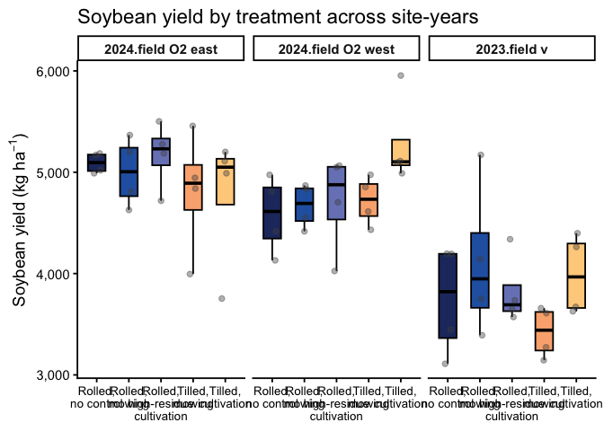<!-- -->

``` r
# Save figure
ggsave(
  filename = file.path(fig_dir, "fig_soybean-yield_box_by-site-year_raw_kg_ha.png"),
  plot     = fig_soy_yield_box_sy,
  width    = 12,
  height   = 5.5,
  units    = "in",
  dpi      = 300,
  bg       = "white"
)
```

## Model selection

### All data

``` r
### Soybean yield model (Gaussian LMM) -------------

# Fit interaction model (REML; used for emmeans/plots)
yield.lmer <- lmer(
  bean_yield_kg_ha ~ weed_trt * site_year + (1 | site_year:block),
  data = bean_yield_clean,
  REML = TRUE
)

family_structure_yield <- "Gaussian LMM (identity link)"
fixed_effects_yield    <- "weed_trt * site_year"
random_effects_yield   <- "(1 | site_year:block)"

# Quick reminder ----------------------------------------------------------
cat(
  "\nSoybean yield model used for inference:\n  ",
  fixed_effects_yield, " + ", random_effects_yield, "\n\n", sep = ""
)
```

    ## 
    ## Soybean yield model used for inference:
    ##   weed_trt * site_year + (1 | site_year:block)

``` r
# Diagnostics -------------------------------------------------------------
set.seed(123)
res_yield <- DHARMa::simulateResiduals(yield.lmer)
plot(res_yield)
```

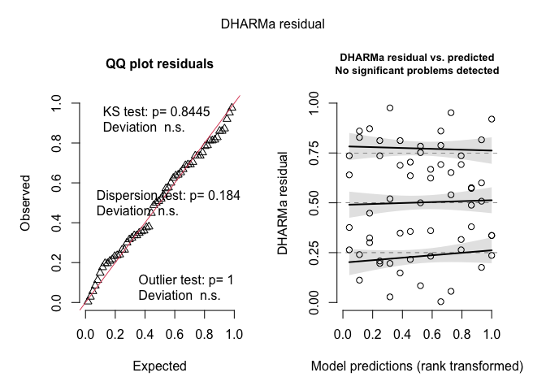<!-- -->

``` r
DHARMa::testDispersion(res_yield)
```

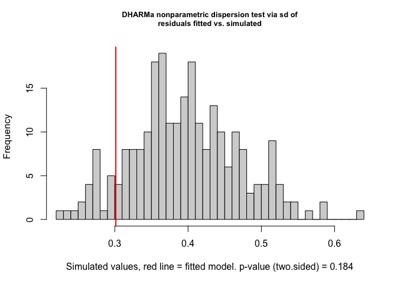<!-- -->

    ## 
    ##  DHARMa nonparametric dispersion test via sd of residuals fitted vs.
    ##  simulated
    ## 
    ## data:  simulationOutput
    ## dispersion = 0.75965, p-value = 0.184
    ## alternative hypothesis: two.sided

``` r
DHARMa::testUniformity(res_yield)
```

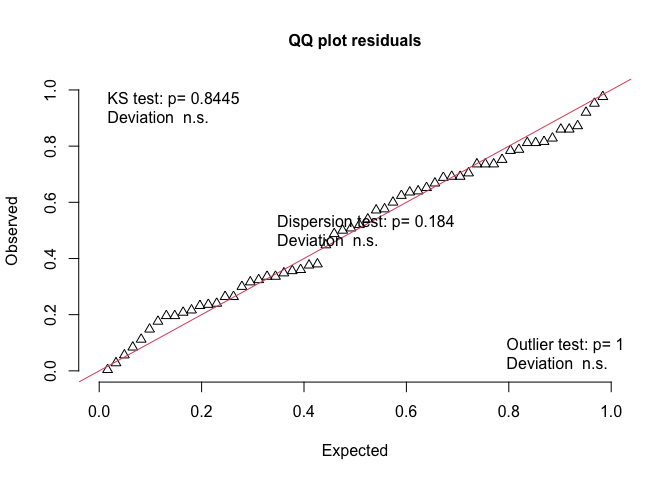<!-- -->

    ## 
    ##  Asymptotic one-sample Kolmogorov-Smirnov test
    ## 
    ## data:  simulationOutput$scaledResiduals
    ## D = 0.079333, p-value = 0.8445
    ## alternative hypothesis: two-sided

``` r
DHARMa::testOutliers(res_yield)
```

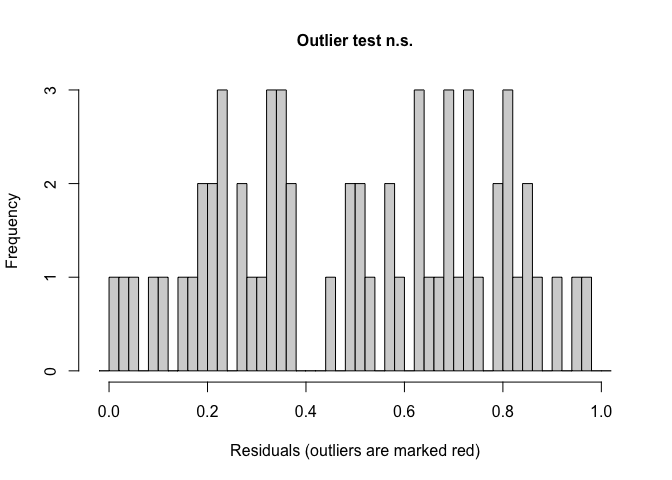<!-- -->

    ## 
    ##  DHARMa outlier test based on exact binomial test with approximate
    ##  expectations
    ## 
    ## data:  res_yield
    ## outliers at both margin(s) = 0, observations = 60, p-value = 1
    ## alternative hypothesis: true probability of success is not equal to 0.007968127
    ## 95 percent confidence interval:
    ##  0.00000000 0.05962949
    ## sample estimates:
    ## frequency of outliers (expected: 0.00796812749003984 ) 
    ##                                                      0

``` r
performance::check_model(yield.lmer)
```

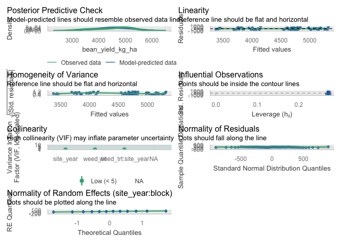<!-- -->

``` r
performance::r2_nakagawa(yield.lmer)
```

    ## # R2 for Mixed Models
    ## 
    ##   Conditional R2: 0.621
    ##      Marginal R2: 0.608

``` r
car::Anova(yield.lmer, type = 3)
```

    ## Analysis of Deviance Table (Type III Wald chisquare tests)
    ## 
    ## Response: bean_yield_kg_ha
    ##                        Chisq Df Pr(>Chisq)    
    ## (Intercept)        5469.5549  1  < 2.2e-16 ***
    ## weed_trt              4.8193  4     0.3063    
    ## site_year            68.3827  2  1.415e-15 ***
    ## weed_trt:site_year   10.1801  8     0.2526    
    ## ---
    ## Signif. codes:  0 '***' 0.001 '**' 0.01 '*' 0.05 '.' 0.1 ' ' 1

### 2024 subset

``` r
### Soybean yield model (2024 only; Gaussian LMM; interaction retained) ---

yield_2024.lmer <- lmer(
  bean_yield_kg_ha ~ weed_trt * site_year + (1 | site_year:block),
  data = soy_yield_2024,
  REML = TRUE
)

family_structure_yield_2024 <- "Gaussian LMM (identity link)"
fixed_effects_yield_2024    <- "weed_trt * site_year"
random_effects_yield_2024   <- "(1 | site_year:block)"

cat(
  "\n2024 soybean yield model used for inference:\n  ",
  fixed_effects_yield_2024, " + ", random_effects_yield_2024, "\n\n", sep = ""
)
```

    ## 
    ## 2024 soybean yield model used for inference:
    ##   weed_trt * site_year + (1 | site_year:block)

``` r
set.seed(123)
res_yield_2024 <- DHARMa::simulateResiduals(yield_2024.lmer)
plot(res_yield_2024)
```

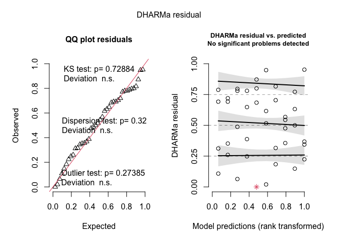<!-- -->

``` r
DHARMa::testDispersion(res_yield_2024)
```

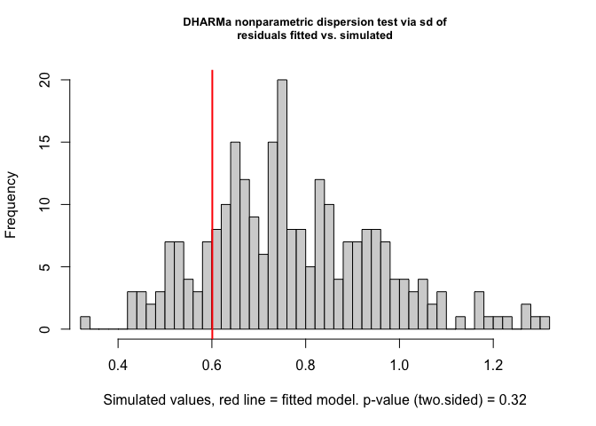<!-- -->

    ## 
    ##  DHARMa nonparametric dispersion test via sd of residuals fitted vs.
    ##  simulated
    ## 
    ## data:  simulationOutput
    ## dispersion = 0.77755, p-value = 0.32
    ## alternative hypothesis: two.sided

``` r
DHARMa::testUniformity(res_yield_2024)
```

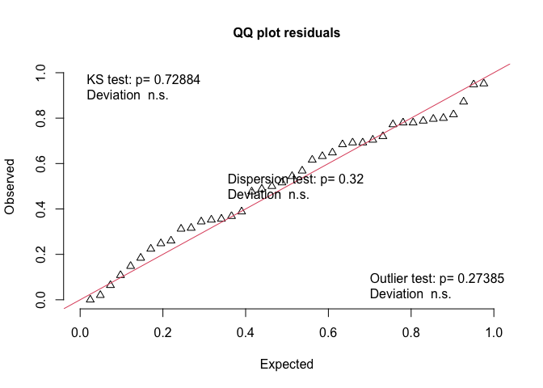<!-- -->

    ## 
    ##  Asymptotic one-sample Kolmogorov-Smirnov test
    ## 
    ## data:  simulationOutput$scaledResiduals
    ## D = 0.109, p-value = 0.7288
    ## alternative hypothesis: two-sided

``` r
DHARMa::testOutliers(res_yield_2024)
```

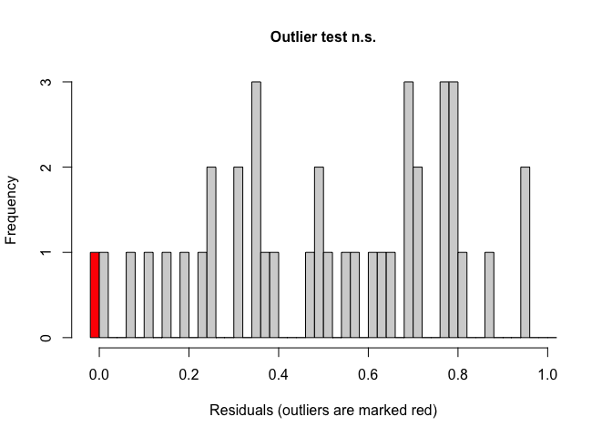<!-- -->

    ## 
    ##  DHARMa outlier test based on exact binomial test with approximate
    ##  expectations
    ## 
    ## data:  res_yield_2024
    ## outliers at both margin(s) = 1, observations = 40, p-value = 0.2739
    ## alternative hypothesis: true probability of success is not equal to 0.007968127
    ## 95 percent confidence interval:
    ##  0.0006327449 0.1315858585
    ## sample estimates:
    ## frequency of outliers (expected: 0.00796812749003984 ) 
    ##                                                  0.025

``` r
performance::check_model(yield_2024.lmer)
```

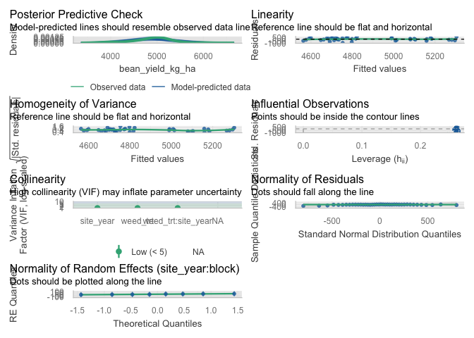<!-- -->

``` r
performance::r2_nakagawa(yield_2024.lmer)
```

    ## # R2 for Mixed Models
    ## 
    ##   Conditional R2: 0.244
    ##      Marginal R2: 0.232

``` r
car::Anova(yield_2024.lmer, type = 3)
```

    ## Analysis of Deviance Table (Type III Wald chisquare tests)
    ## 
    ## Response: bean_yield_kg_ha
    ##                        Chisq Df Pr(>Chisq)    
    ## (Intercept)        5106.0144  1    < 2e-16 ***
    ## weed_trt              1.9630  4    0.74257    
    ## site_year             1.6178  1    0.20340    
    ## weed_trt:site_year    8.2646  4    0.08235 .  
    ## ---
    ## Signif. codes:  0 '***' 0.001 '**' 0.01 '*' 0.05 '.' 0.1 ' ' 1

# Summary tables

``` r
### Soybean yield tables (interaction model; save Excel only) ------------

# Use the primary model (already fit as weed_trt * site_year)
yield_tbl      <- yield.lmer
yield_tbl_name <- "Interaction: weed_trt * site_year"

# Type III tests (used for global p-value summary + CLD guardrail)
anova_yield <- car::Anova(yield_tbl, type = 3) |>
  as.data.frame() |>
  tibble::rownames_to_column("Effect")

p_site_yield <- anova_yield$`Pr(>Chisq)`[anova_yield$Effect == "site_year"]
p_trt_yield  <- anova_yield$`Pr(>Chisq)`[anova_yield$Effect == "weed_trt"]
p_int_yield  <- anova_yield$`Pr(>Chisq)`[anova_yield$Effect == "weed_trt:site_year"]

# Only show CLD letters if global treatment effect is significant
show_letters_tbl <- !is.na(p_trt_yield) && (p_trt_yield < 0.05)


## A) Treatment means (pooled over site-years) ---------------------------

emm_yield <- emmeans(yield_tbl, ~ weed_trt)

emm_yield_df <- tidy_emm(emm_yield, ref_levels = mow_levels) |>
  as_tibble()

if (show_letters_tbl) {
  cld_yield <- cld(
    emm_yield,
    adjust   = "none",
    Letters  = letters,
    sort     = TRUE,
    reversed = TRUE
  ) |>
    as_tibble() |>
    mutate(
      weed_trt = factor(weed_trt, levels = mow_levels),
      .group   = stringr::str_trim(.group)
    ) |>
    select(weed_trt, .group)
} else {
  cld_yield <- tibble::tibble(
    weed_trt = factor(mow_levels, levels = mow_levels),
    .group   = ""
  )
}

yield_trt_table <- emm_yield_df |>
  left_join(cld_yield, by = "weed_trt") |>
  select(weed_trt, emmean, SE, ci_low, ci_high, .group) |>
  mutate(across(c(emmean, SE, ci_low, ci_high), ~ round(.x, 1)))

yield_trt_table |>
  kable(
    caption   = "Estimated soybean yield (kg ha^-1 at 13% moisture) pooled over site-years: 95% CI and Fisher's LSD letters",
    col.names = c("Treatment", "Mean", "SE", "Lower CI", "Upper CI", "Group")
  ) |>
  kable_styling(full_width = FALSE, bootstrap_options = c("striped", "hover"))
```

<table class="table table-striped table-hover" style="color: black; width: auto !important; margin-left: auto; margin-right: auto;">

<caption>

Estimated soybean yield (kg ha^-1 at 13% moisture) pooled over
site-years: 95% CI and Fisher’s LSD letters
</caption>

<thead>

<tr>

<th style="text-align:left;">

Treatment
</th>

<th style="text-align:right;">

Mean
</th>

<th style="text-align:right;">

SE
</th>

<th style="text-align:right;">

Lower CI
</th>

<th style="text-align:right;">

Upper CI
</th>

<th style="text-align:left;">

Group
</th>

</tr>

</thead>

<tbody>

<tr>

<td style="text-align:left;">

Rolled, no control
</td>

<td style="text-align:right;">

4470.4
</td>

<td style="text-align:right;">

128.8
</td>

<td style="text-align:right;">

4210.9
</td>

<td style="text-align:right;">

4729.9
</td>

<td style="text-align:left;">

</td>

</tr>

<tr>

<td style="text-align:left;">

Rolled, mowing
</td>

<td style="text-align:right;">

4594.4
</td>

<td style="text-align:right;">

128.8
</td>

<td style="text-align:right;">

4334.9
</td>

<td style="text-align:right;">

4853.9
</td>

<td style="text-align:left;">

</td>

</tr>

<tr>

<td style="text-align:left;">

Rolled, high-residue cultivation
</td>

<td style="text-align:right;">

4568.3
</td>

<td style="text-align:right;">

128.8
</td>

<td style="text-align:right;">

4308.8
</td>

<td style="text-align:right;">

4827.8
</td>

<td style="text-align:left;">

</td>

</tr>

<tr>

<td style="text-align:left;">

Tilled, mowing
</td>

<td style="text-align:right;">

4316.1
</td>

<td style="text-align:right;">

128.8
</td>

<td style="text-align:right;">

4056.6
</td>

<td style="text-align:right;">

4575.6
</td>

<td style="text-align:left;">

</td>

</tr>

<tr>

<td style="text-align:left;">

Tilled, cultivation
</td>

<td style="text-align:right;">

4680.3
</td>

<td style="text-align:right;">

128.8
</td>

<td style="text-align:right;">

4420.8
</td>

<td style="text-align:right;">

4939.8
</td>

<td style="text-align:left;">

</td>

</tr>

</tbody>

</table>

``` r
## B) Global p-value summary (Type III tests) ----------------------------

pvals_yield <- tibble::tibble(
  Effect = c("Site-year (site_year)", "Treatment (weed_trt)", "Site-year x Treatment"),
  p_raw  = c(p_site_yield, p_trt_yield, p_int_yield)
) |>
  mutate(
    `P-value` = case_when(
      is.na(p_raw)  ~ NA_character_,
      p_raw < 0.001 ~ "<0.001",
      p_raw < 0.01  ~ "<0.01",
      TRUE          ~ sprintf("%.3f", p_raw)
    )
  ) |>
  select(Effect, `P-value`)

pvals_yield |>
  kable(caption = "Soybean yield: Type III tests from Gaussian LMM (interaction model)") |>
  kable_styling(full_width = FALSE, bootstrap_options = c("striped", "hover"))
```

<table class="table table-striped table-hover" style="color: black; width: auto !important; margin-left: auto; margin-right: auto;">

<caption>

Soybean yield: Type III tests from Gaussian LMM (interaction model)
</caption>

<thead>

<tr>

<th style="text-align:left;">

Effect
</th>

<th style="text-align:left;">

P-value
</th>

</tr>

</thead>

<tbody>

<tr>

<td style="text-align:left;">

Site-year (site_year)
</td>

<td style="text-align:left;">

\<0.001
</td>

</tr>

<tr>

<td style="text-align:left;">

Treatment (weed_trt)
</td>

<td style="text-align:left;">

0.306
</td>

</tr>

<tr>

<td style="text-align:left;">

Site-year x Treatment
</td>

<td style="text-align:left;">

0.253
</td>

</tr>

</tbody>

</table>

``` r
## C) Site-year means (model + raw) --------------------------------------

emm_loc_yield <- emmeans(yield_tbl, ~ site_year)

loc_summary_yield <- as_tibble(emm_loc_yield) |>
  mutate(
    site_year  = as.factor(site_year),
    model_mean = emmean
  ) |>
  select(site_year, model_mean) |>
  left_join(
    cld(emm_loc_yield, adjust = "none", Letters = letters, sort = TRUE, reversed = TRUE) |>
      as_tibble() |>
      transmute(site_year = as.factor(site_year), CLD = stringr::str_trim(.group)),
    by = "site_year"
  ) |>
  left_join(
    bean_yield_clean |>
      group_by(site_year) |>
      summarise(raw_mean = mean(bean_yield_kg_ha, na.rm = TRUE), .groups = "drop") |>
      mutate(site_year = as.factor(site_year)),
    by = "site_year"
  ) |>
  mutate(
    model_mean = round(model_mean, 1),
    raw_mean   = round(raw_mean, 1)
  ) |>
  arrange(site_year)

loc_summary_yield |>
  kable(
    caption   = "Soybean yield (kg ha^-1 at 13% moisture): site-year means (model and raw)",
    col.names = c("Site-year", "Model mean", "Model CLD", "Raw mean")
  ) |>
  kable_styling(full_width = FALSE, bootstrap_options = c("striped", "hover"))
```

<table class="table table-striped table-hover" style="color: black; width: auto !important; margin-left: auto; margin-right: auto;">

<caption>

Soybean yield (kg ha^-1 at 13% moisture): site-year means (model and
raw)
</caption>

<thead>

<tr>

<th style="text-align:left;">

Site-year
</th>

<th style="text-align:right;">

Model mean
</th>

<th style="text-align:left;">

Model CLD
</th>

<th style="text-align:right;">

Raw mean
</th>

</tr>

</thead>

<tbody>

<tr>

<td style="text-align:left;">

2024.field O2 east
</td>

<td style="text-align:right;">

4967.1
</td>

<td style="text-align:left;">

a
</td>

<td style="text-align:right;">

4967.1
</td>

</tr>

<tr>

<td style="text-align:left;">

2024.field O2 west
</td>

<td style="text-align:right;">

4793.4
</td>

<td style="text-align:left;">

a
</td>

<td style="text-align:right;">

4793.4
</td>

</tr>

<tr>

<td style="text-align:left;">

2023.field v
</td>

<td style="text-align:right;">

3817.3
</td>

<td style="text-align:left;">

b
</td>

<td style="text-align:right;">

3817.3
</td>

</tr>

</tbody>

</table>

``` r
## D) Treatment means (model + raw) --------------------------------------

emm_yield_trt <- emmeans(yield_tbl, ~ weed_trt)

trt_summary_yield <- as_tibble(emm_yield_trt) |>
  mutate(
    weed_trt   = factor(weed_trt, levels = mow_levels),
    model_mean = emmean
  ) |>
  select(weed_trt, model_mean) |>
  left_join(
    cld(emm_yield_trt, adjust = "none", Letters = letters, sort = TRUE, reversed = TRUE) |>
      as_tibble() |>
      transmute(weed_trt = factor(weed_trt, levels = mow_levels), CLD = stringr::str_trim(.group)),
    by = "weed_trt"
  ) |>
  left_join(
    bean_yield_clean |>
      group_by(weed_trt) |>
      summarise(raw_mean = mean(bean_yield_kg_ha, na.rm = TRUE), .groups = "drop") |>
      mutate(weed_trt = factor(weed_trt, levels = mow_levels)),
    by = "weed_trt"
  ) |>
  mutate(
    model_mean = round(model_mean, 1),
    raw_mean   = round(raw_mean, 1)
  ) |>
  arrange(weed_trt)

trt_summary_yield |>
  kable(
    caption   = "Soybean yield (kg ha^-1 at 13% moisture): treatment means (model and raw)",
    col.names = c("Treatment", "Model mean", "Model CLD", "Raw mean")
  ) |>
  kable_styling(full_width = FALSE, bootstrap_options = c("striped", "hover"))
```

<table class="table table-striped table-hover" style="color: black; width: auto !important; margin-left: auto; margin-right: auto;">

<caption>

Soybean yield (kg ha^-1 at 13% moisture): treatment means (model and
raw)
</caption>

<thead>

<tr>

<th style="text-align:left;">

Treatment
</th>

<th style="text-align:right;">

Model mean
</th>

<th style="text-align:left;">

Model CLD
</th>

<th style="text-align:right;">

Raw mean
</th>

</tr>

</thead>

<tbody>

<tr>

<td style="text-align:left;">

Rolled, no control
</td>

<td style="text-align:right;">

4470.4
</td>

<td style="text-align:left;">

ab
</td>

<td style="text-align:right;">

4470.4
</td>

</tr>

<tr>

<td style="text-align:left;">

Rolled, mowing
</td>

<td style="text-align:right;">

4594.4
</td>

<td style="text-align:left;">

ab
</td>

<td style="text-align:right;">

4594.4
</td>

</tr>

<tr>

<td style="text-align:left;">

Rolled, high-residue cultivation
</td>

<td style="text-align:right;">

4568.3
</td>

<td style="text-align:left;">

ab
</td>

<td style="text-align:right;">

4568.3
</td>

</tr>

<tr>

<td style="text-align:left;">

Tilled, mowing
</td>

<td style="text-align:right;">

4316.1
</td>

<td style="text-align:left;">

b
</td>

<td style="text-align:right;">

4316.1
</td>

</tr>

<tr>

<td style="text-align:left;">

Tilled, cultivation
</td>

<td style="text-align:right;">

4680.3
</td>

<td style="text-align:left;">

a
</td>

<td style="text-align:right;">

4680.3
</td>

</tr>

</tbody>

</table>

``` r
## E) Site-year x treatment means (model + raw) --------------------------

emm_sy_yield <- emmeans(yield_tbl, ~ weed_trt | site_year)

int_summary_yield <- as_tibble(emm_sy_yield) |>
  mutate(
    weed_trt   = factor(weed_trt, levels = mow_levels),
    site_year  = as.factor(site_year),
    model_mean = emmean
  ) |>
  select(site_year, weed_trt, model_mean) |>
  left_join(
    cld(emm_sy_yield, adjust = "none", Letters = letters, sort = TRUE, reversed = TRUE) |>
      as_tibble() |>
      transmute(
        site_year = as.factor(site_year),
        weed_trt  = factor(weed_trt, levels = mow_levels),
        CLD       = stringr::str_trim(.group)
      ),
    by = c("site_year", "weed_trt")
  ) |>
  left_join(
    bean_yield_clean |>
      group_by(site_year, weed_trt) |>
      summarise(raw_mean = mean(bean_yield_kg_ha, na.rm = TRUE), .groups = "drop") |>
      mutate(
        site_year = as.factor(site_year),
        weed_trt  = factor(weed_trt, levels = mow_levels)
      ),
    by = c("site_year", "weed_trt")
  ) |>
  mutate(
    model_mean = round(model_mean, 1),
    raw_mean   = round(raw_mean, 1)
  ) |>
  arrange(site_year, weed_trt)

int_summary_yield |>
  kable(
    caption   = "Soybean yield (kg ha^-1 at 13% moisture): site-year x treatment means (model and raw)",
    col.names = c("Site-year", "Treatment", "Model mean", "Model CLD", "Raw mean")
  ) |>
  kable_styling(full_width = FALSE, bootstrap_options = c("striped", "hover"))
```

<table class="table table-striped table-hover" style="color: black; width: auto !important; margin-left: auto; margin-right: auto;">

<caption>

Soybean yield (kg ha^-1 at 13% moisture): site-year x treatment means
(model and raw)
</caption>

<thead>

<tr>

<th style="text-align:left;">

Site-year
</th>

<th style="text-align:left;">

Treatment
</th>

<th style="text-align:right;">

Model mean
</th>

<th style="text-align:left;">

Model CLD
</th>

<th style="text-align:right;">

Raw mean
</th>

</tr>

</thead>

<tbody>

<tr>

<td style="text-align:left;">

2024.field O2 east
</td>

<td style="text-align:left;">

Rolled, no control
</td>

<td style="text-align:right;">

5091.5
</td>

<td style="text-align:left;">

a
</td>

<td style="text-align:right;">

5091.5
</td>

</tr>

<tr>

<td style="text-align:left;">

2024.field O2 east
</td>

<td style="text-align:left;">

Rolled, mowing
</td>

<td style="text-align:right;">

5001.0
</td>

<td style="text-align:left;">

a
</td>

<td style="text-align:right;">

5001.0
</td>

</tr>

<tr>

<td style="text-align:left;">

2024.field O2 east
</td>

<td style="text-align:left;">

Rolled, high-residue cultivation
</td>

<td style="text-align:right;">

5170.6
</td>

<td style="text-align:left;">

a
</td>

<td style="text-align:right;">

5170.6
</td>

</tr>

<tr>

<td style="text-align:left;">

2024.field O2 east
</td>

<td style="text-align:left;">

Tilled, mowing
</td>

<td style="text-align:right;">

4808.8
</td>

<td style="text-align:left;">

a
</td>

<td style="text-align:right;">

4808.8
</td>

</tr>

<tr>

<td style="text-align:left;">

2024.field O2 east
</td>

<td style="text-align:left;">

Tilled, cultivation
</td>

<td style="text-align:right;">

4763.6
</td>

<td style="text-align:left;">

a
</td>

<td style="text-align:right;">

4763.6
</td>

</tr>

<tr>

<td style="text-align:left;">

2024.field O2 west
</td>

<td style="text-align:left;">

Rolled, no control
</td>

<td style="text-align:right;">

4582.7
</td>

<td style="text-align:left;">

b
</td>

<td style="text-align:right;">

4582.7
</td>

</tr>

<tr>

<td style="text-align:left;">

2024.field O2 west
</td>

<td style="text-align:left;">

Rolled, mowing
</td>

<td style="text-align:right;">

4667.5
</td>

<td style="text-align:left;">

ab
</td>

<td style="text-align:right;">

4667.5
</td>

</tr>

<tr>

<td style="text-align:left;">

2024.field O2 west
</td>

<td style="text-align:left;">

Rolled, high-residue cultivation
</td>

<td style="text-align:right;">

4710.8
</td>

<td style="text-align:left;">

ab
</td>

<td style="text-align:right;">

4710.8
</td>

</tr>

<tr>

<td style="text-align:left;">

2024.field O2 west
</td>

<td style="text-align:left;">

Tilled, mowing
</td>

<td style="text-align:right;">

4718.4
</td>

<td style="text-align:left;">

ab
</td>

<td style="text-align:right;">

4718.4
</td>

</tr>

<tr>

<td style="text-align:left;">

2024.field O2 west
</td>

<td style="text-align:left;">

Tilled, cultivation
</td>

<td style="text-align:right;">

5287.4
</td>

<td style="text-align:left;">

a
</td>

<td style="text-align:right;">

5287.4
</td>

</tr>

<tr>

<td style="text-align:left;">

2023.field v
</td>

<td style="text-align:left;">

Rolled, no control
</td>

<td style="text-align:right;">

3737.1
</td>

<td style="text-align:left;">

ab
</td>

<td style="text-align:right;">

3737.1
</td>

</tr>

<tr>

<td style="text-align:left;">

2023.field v
</td>

<td style="text-align:left;">

Rolled, mowing
</td>

<td style="text-align:right;">

4114.7
</td>

<td style="text-align:left;">

a
</td>

<td style="text-align:right;">

4114.7
</td>

</tr>

<tr>

<td style="text-align:left;">

2023.field v
</td>

<td style="text-align:left;">

Rolled, high-residue cultivation
</td>

<td style="text-align:right;">

3823.5
</td>

<td style="text-align:left;">

ab
</td>

<td style="text-align:right;">

3823.5
</td>

</tr>

<tr>

<td style="text-align:left;">

2023.field v
</td>

<td style="text-align:left;">

Tilled, mowing
</td>

<td style="text-align:right;">

3421.2
</td>

<td style="text-align:left;">

b
</td>

<td style="text-align:right;">

3421.2
</td>

</tr>

<tr>

<td style="text-align:left;">

2023.field v
</td>

<td style="text-align:left;">

Tilled, cultivation
</td>

<td style="text-align:right;">

3990.0
</td>

<td style="text-align:left;">

ab
</td>

<td style="text-align:right;">

3990.0
</td>

</tr>

</tbody>

</table>

``` r
## F) Model-info row (trimmed) -------------------------------------------

model_info_yield <- tibble::tibble(
  response_label   = "Soybean yield (kg ha^-1 at 13% moisture), model-predicted means*",
  family_structure = family_structure_yield,
  fixed_effects    = yield_tbl_name,
  random_effects   = "(1 | site_year:block)",
  p_site_year      = p_site_yield,
  p_weed_trt       = p_trt_yield,
  p_interaction    = p_int_yield
)


## G) Write everything to one Excel workbook -----------------------------

yield_tables <- list(
  Treatment_means_CI_CLD      = yield_trt_table,
  Type3_pvals                 = pvals_yield,
  SiteYear_means_model_raw    = loc_summary_yield,
  Treatment_means_model_raw   = trt_summary_yield,
  SiteYear_x_trt_model_raw    = int_summary_yield,
  Model_info                  = model_info_yield
)

writexl::write_xlsx(
  yield_tables,
  path = file.path(tab_dir, "soybean-yield_all-tables.xlsx")

)
```

# Equivalence tests vs tilled control

## All data

``` r
## Equivalence testing: are no-till yields "close enough" to tilled? -----

# NOTE: tab_dir is defined in your "Paths + output directories" chunk.

# 1) EMMs for soybean yield (kg ha^-1) -----------------------------------
emm_yield <- emmeans(yield.lmer, ~ weed_trt)

tilled_trt <- "Tilled, cultivation"
trt_levels <- levels(emm_yield)$weed_trt

if (!tilled_trt %in% trt_levels) {
  stop(
    "tilled_trt ('", tilled_trt, "') is not a level of weed_trt.\n",
    "Current levels are: ",
    paste(trt_levels, collapse = ", ")
  )
}

# 2) Define equivalence margin (as % of tilled yield) ---------------------

tilled_mean <- summary(emm_yield) |>
  as_tibble() |>
  filter(weed_trt == tilled_trt) |>
  pull(emmean)

margin_pct <- 0.10          # ±10% of tilled yield
delta_kg   <- margin_pct * tilled_mean

# For interpretation: convert margin to bu/ac (approx)
kg_ha_per_bu_ac <- 67.25
delta_bu_ac     <- delta_kg / kg_ha_per_bu_ac

cat(
  "Equivalence margin:",
  sprintf(
    "±%.0f kg ha^-1 (≈ ±%.1f bu/ac, %.0f%% of tilled yield)\n",
    delta_kg, delta_bu_ac, margin_pct * 100
  )
)
```

    ## Equivalence margin: ±468 kg ha^-1 (≈ ±7.0 bu/ac, 10% of tilled yield)

``` r
# 3) Contrasts: each treatment vs tilled ---------------------------------
yield_vs_tilled <- contrast(
  emm_yield,
  method = "trt.vs.ctrl",
  ref    = which(trt_levels == tilled_trt)
)

# 4) TOST-style equivalence tests via emmeans ----------------------------
equiv_yield <- summary(
  yield_vs_tilled,
  infer  = c(TRUE, TRUE),
  level  = 0.90,
  side   = "equivalence",
  delta  = delta_kg,
  adjust = "none"
) |>
  as_tibble() |>
  mutate(
    diff_bu_ac  = estimate / kg_ha_per_bu_ac,
    lower_bu_ac = lower.CL / kg_ha_per_bu_ac,
    upper_bu_ac = upper.CL / kg_ha_per_bu_ac,
    p_equiv     = p.value
  )

# 5) Tidy table for printing + saving ------------------------------------
equiv_yield_out <- equiv_yield |>
  transmute(
    Contrast    = contrast,
    diff_kg_ha  = estimate,
    lower_kg_ha = lower.CL,
    upper_kg_ha = upper.CL,
    diff_bu_ac,
    lower_bu_ac,
    upper_bu_ac,
    p_equiv
  ) |>
  mutate(
    across(
      c(diff_kg_ha, lower_kg_ha, upper_kg_ha,
        diff_bu_ac, lower_bu_ac, upper_bu_ac),
      ~ round(.x, 1)
    ),
    p_equiv = signif(p_equiv, 3)
  )

# 6) Save as a separate workbook ----------------------------------------
writexl::write_xlsx(
  list(Equivalence_TOST = equiv_yield_out),
  path = file.path(tab_dir, "soybean-yield_equivalence-tests.xlsx")
)

# 7) Print in Rmd --------------------------------------------------------
equiv_yield_out |>
  kable(
    caption = paste0(
      "Equivalence tests for soybean yield vs ", tilled_trt,
      " (margin = ±", round(delta_kg, 0), " kg ha^-1 ≈ ±",
      round(delta_bu_ac, 1), " bu/ac)."
    ),
    col.names = c(
      "Contrast",
      "Difference (kg ha^-1)", "Lower 90% CI", "Upper 90% CI",
      "Difference (bu/ac)", "Lower 90% CI", "Upper 90% CI",
      "p (equiv.)"
    )
  ) |>
  kable_styling(full_width = FALSE, bootstrap_options = c("striped", "hover"))
```

<table class="table table-striped table-hover" style="color: black; width: auto !important; margin-left: auto; margin-right: auto;">

<caption>

Equivalence tests for soybean yield vs Tilled, cultivation (margin =
±468 kg ha^-1 ≈ ±7 bu/ac).
</caption>

<thead>

<tr>

<th style="text-align:left;">

Contrast
</th>

<th style="text-align:right;">

Difference (kg ha^-1)
</th>

<th style="text-align:right;">

Lower 90% CI
</th>

<th style="text-align:right;">

Upper 90% CI
</th>

<th style="text-align:right;">

Difference (bu/ac)
</th>

<th style="text-align:right;">

Lower 90% CI
</th>

<th style="text-align:right;">

Upper 90% CI
</th>

<th style="text-align:right;">

p (equiv.)
</th>

</tr>

</thead>

<tbody>

<tr>

<td style="text-align:left;">

Rolled, no control - Tilled, cultivation
</td>

<td style="text-align:right;">

-209.9
</td>

<td style="text-align:right;">

-512.5
</td>

<td style="text-align:right;">

92.7
</td>

<td style="text-align:right;">

-3.1
</td>

<td style="text-align:right;">

-7.6
</td>

<td style="text-align:right;">

1.4
</td>

<td style="text-align:right;">

0.0792
</td>

</tr>

<tr>

<td style="text-align:left;">

Rolled, mowing - Tilled, cultivation
</td>

<td style="text-align:right;">

-85.9
</td>

<td style="text-align:right;">

-388.6
</td>

<td style="text-align:right;">

216.7
</td>

<td style="text-align:right;">

-1.3
</td>

<td style="text-align:right;">

-5.8
</td>

<td style="text-align:right;">

3.2
</td>

<td style="text-align:right;">

0.0200
</td>

</tr>

<tr>

<td style="text-align:left;">

(Rolled, high-residue cultivation) - Tilled, cultivation
</td>

<td style="text-align:right;">

-112.0
</td>

<td style="text-align:right;">

-414.6
</td>

<td style="text-align:right;">

190.6
</td>

<td style="text-align:right;">

-1.7
</td>

<td style="text-align:right;">

-6.2
</td>

<td style="text-align:right;">

2.8
</td>

<td style="text-align:right;">

0.0273
</td>

</tr>

<tr>

<td style="text-align:left;">

Tilled, mowing - Tilled, cultivation
</td>

<td style="text-align:right;">

-364.2
</td>

<td style="text-align:right;">

-666.8
</td>

<td style="text-align:right;">

-61.6
</td>

<td style="text-align:right;">

-5.4
</td>

<td style="text-align:right;">

-9.9
</td>

<td style="text-align:right;">

-0.9
</td>

<td style="text-align:right;">

0.2830
</td>

</tr>

</tbody>

</table>

## 2024 subset

``` r
## Equivalence testing (TOST): all-years + 2024 --------------------------

run_equiv_tost <- function(model_obj, label, out_xlsx) {

  emm_yield <- emmeans(model_obj, ~ weed_trt)

  tilled_trt <- "Tilled, cultivation"
  trt_levels <- levels(emm_yield)$weed_trt

  if (!tilled_trt %in% trt_levels) {
    stop(
      "tilled_trt ('", tilled_trt, "') is not a level of weed_trt.\n",
      "Current levels are: ",
      paste(trt_levels, collapse = ", ")
    )
  }

  tilled_mean <- summary(emm_yield) |>
    as_tibble() |>
    filter(weed_trt == tilled_trt) |>
    pull(emmean)

  margin_pct <- 0.10
  delta_kg   <- margin_pct * tilled_mean

  kg_ha_per_bu_ac <- 67.25
  delta_bu_ac     <- delta_kg / kg_ha_per_bu_ac

  cat(
    "\n", label, " equivalence margin: ",
    sprintf("±%.0f kg ha^-1 (≈ ±%.1f bu/ac, %.0f%% of tilled yield)\n",
            delta_kg, delta_bu_ac, margin_pct * 100),
    sep = ""
  )

  yield_vs_tilled <- contrast(
    emm_yield,
    method = "trt.vs.ctrl",
    ref    = which(trt_levels == tilled_trt)
  )

  equiv_yield <- summary(
    yield_vs_tilled,
    infer  = c(TRUE, TRUE),
    level  = 0.90,
    side   = "equivalence",
    delta  = delta_kg,
    adjust = "none"
  ) |>
    as_tibble() |>
    mutate(
      diff_bu_ac  = estimate / kg_ha_per_bu_ac,
      lower_bu_ac = lower.CL / kg_ha_per_bu_ac,
      upper_bu_ac = upper.CL / kg_ha_per_bu_ac,
      p_equiv     = p.value
    )

  equiv_yield_out <- equiv_yield |>
    transmute(
      Contrast    = contrast,
      diff_kg_ha  = estimate,
      lower_kg_ha = lower.CL,
      upper_kg_ha = upper.CL,
      diff_bu_ac,
      lower_bu_ac,
      upper_bu_ac,
      p_equiv
    ) |>
    mutate(
      across(
        c(diff_kg_ha, lower_kg_ha, upper_kg_ha,
          diff_bu_ac, lower_bu_ac, upper_bu_ac),
        ~ round(.x, 1)
      ),
      p_equiv = signif(p_equiv, 3)
    )

  writexl::write_xlsx(
    list(Equivalence_TOST = equiv_yield_out),
    path = out_xlsx
  )

  equiv_yield_out |>
    kable(
      caption = paste0(
        label, ": Equivalence tests for soybean yield vs ", tilled_trt,
        " (margin = ±", round(delta_kg, 0), " kg ha^-1 ≈ ±",
        round(delta_bu_ac, 1), " bu/ac)."
      ),
      col.names = c(
        "Contrast",
        "Difference (kg ha^-1)", "Lower 90% CI", "Upper 90% CI",
        "Difference (bu/ac)", "Lower 90% CI", "Upper 90% CI",
        "p (equiv.)"
      )
    ) |>
    kable_styling(full_width = FALSE, bootstrap_options = c("striped", "hover"))
}

# All-years workbook
run_equiv_tost(
  model_obj = yield.lmer,
  label     = "All years",
  out_xlsx  = file.path(tab_dir, "soybean-yield_equivalence-tests.xlsx")
)
```

    ## 
    ## All years equivalence margin: ±468 kg ha^-1 (≈ ±7.0 bu/ac, 10% of tilled yield)

<table class="table table-striped table-hover" style="color: black; width: auto !important; margin-left: auto; margin-right: auto;">

<caption>

All years: Equivalence tests for soybean yield vs Tilled, cultivation
(margin = ±468 kg ha^-1 ≈ ±7 bu/ac).
</caption>

<thead>

<tr>

<th style="text-align:left;">

Contrast
</th>

<th style="text-align:right;">

Difference (kg ha^-1)
</th>

<th style="text-align:right;">

Lower 90% CI
</th>

<th style="text-align:right;">

Upper 90% CI
</th>

<th style="text-align:right;">

Difference (bu/ac)
</th>

<th style="text-align:right;">

Lower 90% CI
</th>

<th style="text-align:right;">

Upper 90% CI
</th>

<th style="text-align:right;">

p (equiv.)
</th>

</tr>

</thead>

<tbody>

<tr>

<td style="text-align:left;">

Rolled, no control - Tilled, cultivation
</td>

<td style="text-align:right;">

-209.9
</td>

<td style="text-align:right;">

-512.5
</td>

<td style="text-align:right;">

92.7
</td>

<td style="text-align:right;">

-3.1
</td>

<td style="text-align:right;">

-7.6
</td>

<td style="text-align:right;">

1.4
</td>

<td style="text-align:right;">

0.0792
</td>

</tr>

<tr>

<td style="text-align:left;">

Rolled, mowing - Tilled, cultivation
</td>

<td style="text-align:right;">

-85.9
</td>

<td style="text-align:right;">

-388.6
</td>

<td style="text-align:right;">

216.7
</td>

<td style="text-align:right;">

-1.3
</td>

<td style="text-align:right;">

-5.8
</td>

<td style="text-align:right;">

3.2
</td>

<td style="text-align:right;">

0.0200
</td>

</tr>

<tr>

<td style="text-align:left;">

(Rolled, high-residue cultivation) - Tilled, cultivation
</td>

<td style="text-align:right;">

-112.0
</td>

<td style="text-align:right;">

-414.6
</td>

<td style="text-align:right;">

190.6
</td>

<td style="text-align:right;">

-1.7
</td>

<td style="text-align:right;">

-6.2
</td>

<td style="text-align:right;">

2.8
</td>

<td style="text-align:right;">

0.0273
</td>

</tr>

<tr>

<td style="text-align:left;">

Tilled, mowing - Tilled, cultivation
</td>

<td style="text-align:right;">

-364.2
</td>

<td style="text-align:right;">

-666.8
</td>

<td style="text-align:right;">

-61.6
</td>

<td style="text-align:right;">

-5.4
</td>

<td style="text-align:right;">

-9.9
</td>

<td style="text-align:right;">

-0.9
</td>

<td style="text-align:right;">

0.2830
</td>

</tr>

</tbody>

</table>

``` r
# 2024-only workbook
run_equiv_tost(
  model_obj = yield_2024.lmer,
  label     = "2024 only",
  out_xlsx  = file.path(tab_dir, "soybean-yield_equivalence-tests_2024.xlsx")
)
```

    ## 
    ## 2024 only equivalence margin: ±503 kg ha^-1 (≈ ±7.5 bu/ac, 10% of tilled yield)

<table class="table table-striped table-hover" style="color: black; width: auto !important; margin-left: auto; margin-right: auto;">

<caption>

2024 only: Equivalence tests for soybean yield vs Tilled, cultivation
(margin = ±503 kg ha^-1 ≈ ±7.5 bu/ac).
</caption>

<thead>

<tr>

<th style="text-align:left;">

Contrast
</th>

<th style="text-align:right;">

Difference (kg ha^-1)
</th>

<th style="text-align:right;">

Lower 90% CI
</th>

<th style="text-align:right;">

Upper 90% CI
</th>

<th style="text-align:right;">

Difference (bu/ac)
</th>

<th style="text-align:right;">

Lower 90% CI
</th>

<th style="text-align:right;">

Upper 90% CI
</th>

<th style="text-align:right;">

p (equiv.)
</th>

</tr>

</thead>

<tbody>

<tr>

<td style="text-align:left;">

Rolled, no control - Tilled, cultivation
</td>

<td style="text-align:right;">

-188.4
</td>

<td style="text-align:right;">

-543.8
</td>

<td style="text-align:right;">

166.9
</td>

<td style="text-align:right;">

-2.8
</td>

<td style="text-align:right;">

-8.1
</td>

<td style="text-align:right;">

2.5
</td>

<td style="text-align:right;">

0.0718
</td>

</tr>

<tr>

<td style="text-align:left;">

Rolled, mowing - Tilled, cultivation
</td>

<td style="text-align:right;">

-191.3
</td>

<td style="text-align:right;">

-546.6
</td>

<td style="text-align:right;">

164.1
</td>

<td style="text-align:right;">

-2.8
</td>

<td style="text-align:right;">

-8.1
</td>

<td style="text-align:right;">

2.4
</td>

<td style="text-align:right;">

0.0735
</td>

</tr>

<tr>

<td style="text-align:left;">

(Rolled, high-residue cultivation) - Tilled, cultivation
</td>

<td style="text-align:right;">

-84.8
</td>

<td style="text-align:right;">

-440.2
</td>

<td style="text-align:right;">

270.6
</td>

<td style="text-align:right;">

-1.3
</td>

<td style="text-align:right;">

-6.5
</td>

<td style="text-align:right;">

4.0
</td>

<td style="text-align:right;">

0.0278
</td>

</tr>

<tr>

<td style="text-align:left;">

Tilled, mowing - Tilled, cultivation
</td>

<td style="text-align:right;">

-261.9
</td>

<td style="text-align:right;">

-617.3
</td>

<td style="text-align:right;">

93.5
</td>

<td style="text-align:right;">

-3.9
</td>

<td style="text-align:right;">

-9.2
</td>

<td style="text-align:right;">

1.4
</td>

<td style="text-align:right;">

0.1290
</td>

</tr>

</tbody>

</table>

# Figures

## All data

``` r
### Soybean yield figures (pooled over site-years) -----------------------

# Use the model already fit earlier (kg/ha response)
yield_fig <- yield.lmer

# Guardrail for CLD letters (only show if global treatment effect is significant)
p_trt_yield_fig <- car::Anova(yield_fig, type = 3)$`Pr(>Chisq)`["weed_trt"]
show_letters <- !is.na(p_trt_yield_fig) && (p_trt_yield_fig < 0.05)


# 1) MODEL-PREDICTED MEANS (kg ha^-1) -----------------------------------

emm_yield_trt <- emmeans(
  yield_fig,
  ~ weed_trt
)

plot_df_yield_model_kg <- as_tibble(emm_yield_trt) |>
  mutate(
    weed_trt = factor(weed_trt, levels = mow_levels),
    mean     = emmean,
    ymin     = pmax(mean - SE, 0),
    ymax     = mean + SE
  )

if (show_letters) {
  cld_yield_trt <- cld(
    emm_yield_trt,
    adjust   = "none",
    Letters  = letters,
    sort     = TRUE,
    reversed = TRUE
  ) |>
    as_tibble() |>
    mutate(
      weed_trt = factor(weed_trt, levels = mow_levels),
      .group   = stringr::str_trim(.group)
    ) |>
    select(weed_trt, .group)

  plot_df_yield_model_kg <- plot_df_yield_model_kg |>
    left_join(cld_yield_trt, by = "weed_trt")
}

fig_soy_yield_total_model_kg <- ggplot(
  plot_df_yield_model_kg,
  aes(x = weed_trt, y = mean, fill = weed_trt)
) +
  geom_col(width = 0.7, color = "black") +
  geom_errorbar(aes(ymin = ymin, ymax = ymax), width = 0.14) +
  { if (show_letters) geom_text(aes(y = ymax * 1.08, label = .group),
                                vjust = 0, fontface = "bold", size = 6) } +
  scale_fill_manual(values = fill_cols, guide = "none") +
  scale_x_discrete(labels = label_break_comma_cult) +
  scale_y_continuous(labels = scales::label_comma()) +
  labs(
    x     = NULL,
    y     = expression(Soybean~yield~"(kg"~ha^{-1}*" at 13% moisture)"),
    title = "Soybean yield by weed management"
  ) +
  theme_classic(base_size = 18) +
  theme(
    axis.text.x  = element_text(lineheight = 0.95, margin = margin(t = 8)),
    axis.title.y = element_text(margin = margin(r = 8)),
    plot.title   = element_text(face = "bold"),
    plot.caption = element_text(size = 9, hjust = 0)
  )

fig_soy_yield_total_model_kg
```

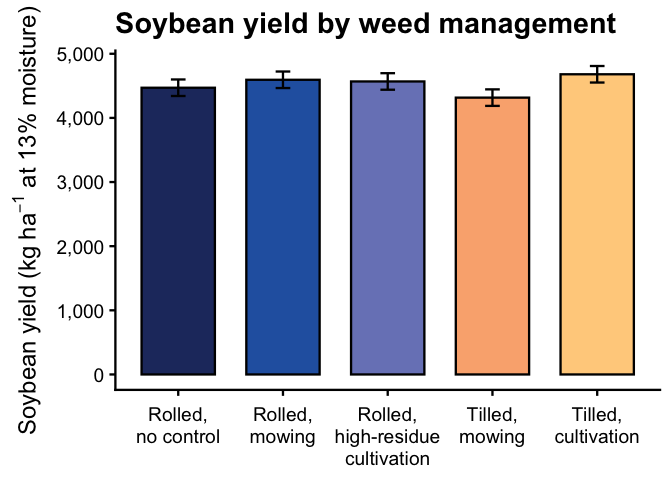<!-- -->

``` r
ggsave(
  filename = file.path(fig_dir, "fig_soybean-yield_total_model_kg_ha.png"),
  plot     = fig_soy_yield_total_model_kg,
  width    = 9,
  height   = 5.5,
  units    = "in",
  dpi      = 300,
  bg       = "white"
)


# 1a) MODEL-PREDICTED MEANS (lb/ac) -------------------------------------
# Fit same model structure, but using existing lb/ac response column

yield_fig_lb <- lmer(
  bean_yield_adj_lbs_acre ~ weed_trt * site_year + (1 | site_year:block),
  data = bean_yield_clean,
  REML = TRUE
)

emm_yield_trt_lb <- emmeans(yield_fig_lb, ~ weed_trt)

plot_df_yield_model_lb <- as_tibble(emm_yield_trt_lb) |>
  mutate(
    weed_trt = factor(weed_trt, levels = mow_levels),
    mean     = emmean,
    ymin     = pmax(mean - SE, 0),
    ymax     = mean + SE
  )

if (show_letters) {
  plot_df_yield_model_lb <- left_join(plot_df_yield_model_lb, cld_yield_trt, by = "weed_trt")
}

fig_soy_yield_total_model_lb <- ggplot(
  plot_df_yield_model_lb,
  aes(x = weed_trt, y = mean, fill = weed_trt)
) +
  geom_col(width = 0.7, color = "black") +
  geom_errorbar(aes(ymin = ymin, ymax = ymax), width = 0.14) +
  { if (show_letters) geom_text(aes(y = ymax * 1.08, label = .group),
                                vjust = 0, fontface = "bold", size = 6) } +
  scale_fill_manual(values = fill_cols, guide = "none") +
  scale_x_discrete(labels = label_break_comma_cult) +
  scale_y_continuous(labels = scales::label_comma()) +
  labs(
    x     = NULL,
    y     = "Soybean yield (lb/ac at 13% moisture)",
    title = "Soybean yield by weed management"
  ) +
  theme_classic(base_size = 18) +
  theme(
    axis.text.x  = element_text(lineheight = 0.95, margin = margin(t = 8)),
    axis.title.y = element_text(margin = margin(r = 8)),
    plot.title   = element_text(face = "bold"),
    plot.caption = element_text(size = 9, hjust = 0)
  )

fig_soy_yield_total_model_lb
```

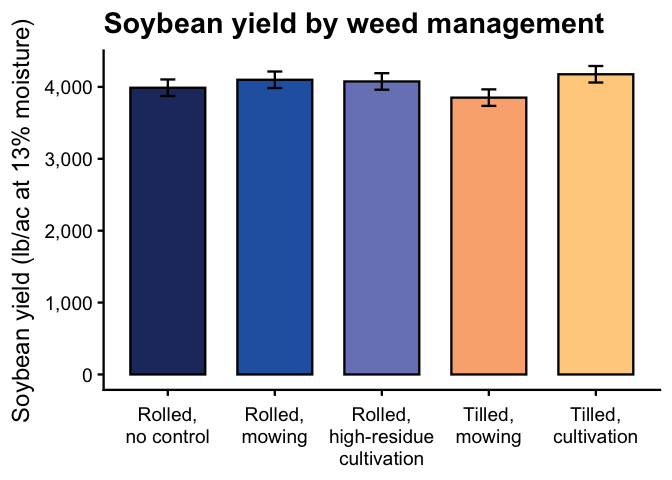<!-- -->

``` r
ggsave(
  filename = file.path(fig_dir, "fig_soybean-yield_total_model_lb_ac.png"),
  plot     = fig_soy_yield_total_model_lb,
  width    = 9,
  height   = 5.5,
  units    = "in",
  dpi      = 300,
  bg       = "white"
)


# 1b) MODEL-PREDICTED MEANS (bu/ac) -------------------------------------
# Fit same model structure, but using existing bu/ac response column

yield_fig_bu <- lmer(
  bean_yield_bu_acre ~ weed_trt * site_year + (1 | site_year:block),
  data = bean_yield_clean,
  REML = TRUE
)

emm_yield_trt_bu <- emmeans(yield_fig_bu, ~ weed_trt)

plot_df_yield_model_bu <- as_tibble(emm_yield_trt_bu) |>
  mutate(
    weed_trt = factor(weed_trt, levels = mow_levels),
    mean     = emmean,
    ymin     = pmax(mean - SE, 0),
    ymax     = mean + SE
  )

if (show_letters) {
  plot_df_yield_model_bu <- left_join(plot_df_yield_model_bu, cld_yield_trt, by = "weed_trt")
}

fig_soy_yield_total_model_bu <- ggplot(
  plot_df_yield_model_bu,
  aes(x = weed_trt, y = mean, fill = weed_trt)
) +
  geom_col(width = 0.7, color = "black") +
  geom_errorbar(aes(ymin = ymin, ymax = ymax), width = 0.14) +
  { if (show_letters) geom_text(aes(y = ymax * 1.08, label = .group),
                                vjust = 0, fontface = "bold", size = 6) } +
  scale_fill_manual(values = fill_cols, guide = "none") +
  scale_x_discrete(labels = label_break_comma_cult) +
  scale_y_continuous(labels = scales::label_comma()) +
  labs(
    x     = NULL,
    y     = "Soybean yield (bu/ac at 13% moisture)",
    title = "Soybean yield by weed management"
  ) +
  theme_classic(base_size = 18) +
  theme(
    axis.text.x  = element_text(lineheight = 0.95, margin = margin(t = 8)),
    axis.title.y = element_text(margin = margin(r = 8)),
    plot.title   = element_text(face = "bold"),
    plot.caption = element_text(size = 9, hjust = 0)
  )

fig_soy_yield_total_model_bu
```

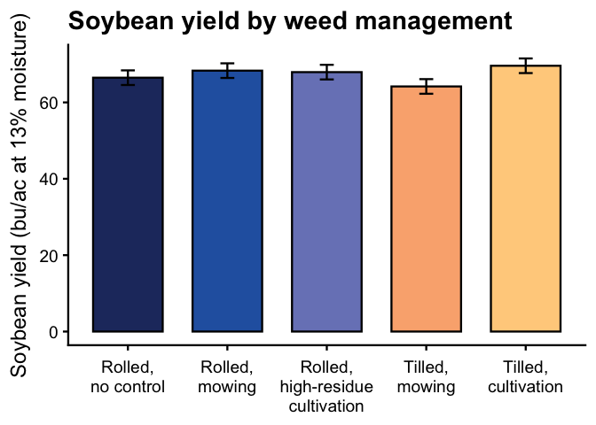<!-- -->

``` r
ggsave(
  filename = file.path(fig_dir, "fig_soybean-yield_total_model_bu_ac.png"),
  plot     = fig_soy_yield_total_model_bu,
  width    = 9,
  height   = 5.5,
  units    = "in",
  dpi      = 300,
  bg       = "white"
)


# 2) RAW MEANS (kg ha^-1) ------------------------------------------------

raw_yield_summary_kg <- bean_yield_clean |>
  dplyr::group_by(weed_trt) |>
  dplyr::summarise(
    n    = sum(!is.na(bean_yield_kg_ha)),
    mean = mean(bean_yield_kg_ha, na.rm = TRUE),
    sd   = sd(bean_yield_kg_ha, na.rm = TRUE),
    se   = dplyr::if_else(n >= 2, sd / sqrt(n), NA_real_),
    .groups = "drop"
  ) |>
  dplyr::mutate(
    weed_trt = factor(weed_trt, levels = mow_levels),
    ymin     = pmax(mean - se, 0),
    ymax     = mean + se
  )

fig_soy_yield_total_raw_kg <- ggplot(
  raw_yield_summary_kg,
  aes(x = weed_trt, y = mean, fill = weed_trt)
) +
  geom_col(width = 0.7, color = "black") +
  geom_errorbar(aes(ymin = ymin, ymax = ymax), width = 0.14) +
  scale_fill_manual(values = fill_cols, guide = "none") +
  scale_x_discrete(labels = label_break_comma_cult) +
  scale_y_continuous(labels = scales::label_comma()) +
  labs(
    x     = NULL,
    y     = expression(Soybean~yield~"(kg"~ha^{-1}*" at 13% moisture)"),
    title = "Soybean yield by weed management"
  ) +
  theme_classic(base_size = 18) +
  theme(
    axis.text.x  = element_text(lineheight = 0.95, margin = margin(t = 8)),
    axis.title.y = element_text(margin = margin(r = 8)),
    plot.title   = element_text(face = "bold"),
    plot.caption = element_text(size = 9, hjust = 0)
  )

fig_soy_yield_total_raw_kg
```

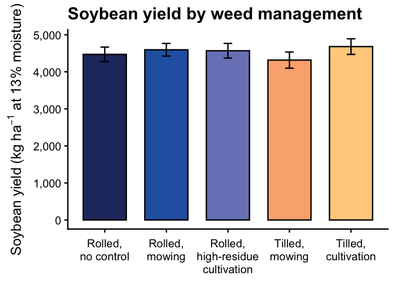<!-- -->

``` r
ggsave(
  filename = file.path(fig_dir, "fig_soybean-yield_total_raw_kg_ha.png"),
  plot     = fig_soy_yield_total_raw_kg,
  width    = 9,
  height   = 5.5,
  units    = "in",
  dpi      = 300,
  bg       = "white"
)


# 2a) RAW MEANS (lb/ac) --------------------------------------------------

raw_yield_summary_lb <- bean_yield_clean |>
  dplyr::group_by(weed_trt) |>
  dplyr::summarise(
    n    = sum(!is.na(bean_yield_adj_lbs_acre)),
    mean = mean(bean_yield_adj_lbs_acre, na.rm = TRUE),
    sd   = sd(bean_yield_adj_lbs_acre, na.rm = TRUE),
    se   = dplyr::if_else(n >= 2, sd / sqrt(n), NA_real_),
    .groups = "drop"
  ) |>
  dplyr::mutate(
    weed_trt = factor(weed_trt, levels = mow_levels),
    ymin     = pmax(mean - se, 0),
    ymax     = mean + se
  )

fig_soy_yield_total_raw_lb <- ggplot(
  raw_yield_summary_lb,
  aes(x = weed_trt, y = mean, fill = weed_trt)
) +
  geom_col(width = 0.7, color = "black") +
  geom_errorbar(aes(ymin = ymin, ymax = ymax), width = 0.14) +
  scale_fill_manual(values = fill_cols, guide = "none") +
  scale_x_discrete(labels = label_break_comma_cult) +
  scale_y_continuous(labels = scales::label_comma()) +
  labs(
    x     = NULL,
    y     = "Soybean yield (lb/ac at 13% moisture)",
    title = "Soybean yield by weed management"
  ) +
  theme_classic(base_size = 18) +
  theme(
    axis.text.x  = element_text(lineheight = 0.95, margin = margin(t = 8)),
    axis.title.y = element_text(margin = margin(r = 8)),
    plot.title   = element_text(face = "bold"),
    plot.caption = element_text(size = 9, hjust = 0)
  )

fig_soy_yield_total_raw_lb
```

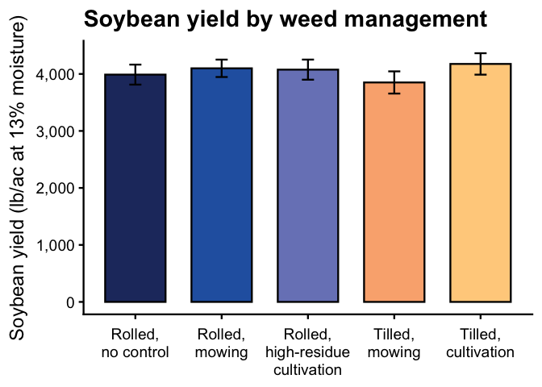<!-- -->

``` r
ggsave(
  filename = file.path(fig_dir, "fig_soybean-yield_total_raw_lb_ac.png"),
  plot     = fig_soy_yield_total_raw_lb,
  width    = 9,
  height   = 5.5,
  units    = "in",
  dpi      = 300,
  bg       = "white"
)


# 2b) RAW MEANS (bu/ac) --------------------------------------------------

raw_yield_summary_bu <- bean_yield_clean |>
  dplyr::group_by(weed_trt) |>
  dplyr::summarise(
    n    = sum(!is.na(bean_yield_bu_acre)),
    mean = mean(bean_yield_bu_acre, na.rm = TRUE),
    sd   = sd(bean_yield_bu_acre, na.rm = TRUE),
    se   = dplyr::if_else(n >= 2, sd / sqrt(n), NA_real_),
    .groups = "drop"
  ) |>
  dplyr::mutate(
    weed_trt = factor(weed_trt, levels = mow_levels),
    ymin     = pmax(mean - se, 0),
    ymax     = mean + se
  )

fig_soy_yield_total_raw_bu <- ggplot(
  raw_yield_summary_bu,
  aes(x = weed_trt, y = mean, fill = weed_trt)
) +
  geom_col(width = 0.7, color = "black") +
  geom_errorbar(aes(ymin = ymin, ymax = ymax), width = 0.14) +
  scale_fill_manual(values = fill_cols, guide = "none") +
  scale_x_discrete(labels = label_break_comma_cult) +
  scale_y_continuous(labels = scales::label_comma()) +
  labs(
    x     = NULL,
    y     = "Soybean yield (bu/ac at 13% moisture)",
    title = "Soybean yield by weed management"
  ) +
  theme_classic(base_size = 18) +
  theme(
    axis.text.x  = element_text(lineheight = 0.95, margin = margin(t = 8)),
    axis.title.y = element_text(margin = margin(r = 8)),
    plot.title   = element_text(face = "bold"),
    plot.caption = element_text(size = 9, hjust = 0)
  )

fig_soy_yield_total_raw_bu
```

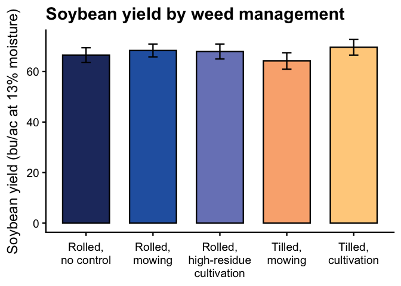<!-- -->

``` r
ggsave(
  filename = file.path(fig_dir, "fig_soybean-yield_total_raw_bu_ac.png"),
  plot     = fig_soy_yield_total_raw_bu,
  width    = 9,
  height   = 5.5,
  units    = "in",
  dpi      = 300,
  bg       = "white"
)
```

## 2024 subset

``` r
### Soybean yield figures (2024 only; pooled over 2024 site-years) -------

# Use the 2024 model already fit earlier (kg/ha response)
yield_fig <- yield_2024.lmer

# Guardrail for CLD letters (only show if global treatment effect is significant)
p_trt_yield_fig <- car::Anova(yield_fig, type = 3)$`Pr(>Chisq)`["weed_trt"]
show_letters <- !is.na(p_trt_yield_fig) && (p_trt_yield_fig < 0.05)


# 1) MODEL-PREDICTED MEANS (kg ha^-1) -----------------------------------

emm_yield_trt <- emmeans(
  yield_fig,
  ~ weed_trt
)

plot_df_yield_model_kg <- as_tibble(emm_yield_trt) |>
  mutate(
    weed_trt = factor(weed_trt, levels = mow_levels),
    mean     = emmean,
    ymin     = pmax(mean - SE, 0),
    ymax     = mean + SE
  )

if (show_letters) {
  cld_yield_trt <- cld(
    emm_yield_trt,
    adjust   = "none",
    Letters  = letters,
    sort     = TRUE,
    reversed = TRUE
  ) |>
    as_tibble() |>
    mutate(
      weed_trt = factor(weed_trt, levels = mow_levels),
      .group   = stringr::str_trim(.group)
    ) |>
    select(weed_trt, .group)

  plot_df_yield_model_kg <- plot_df_yield_model_kg |>
    left_join(cld_yield_trt, by = "weed_trt")
}

fig_soy_yield_total_model_kg <- ggplot(
  plot_df_yield_model_kg,
  aes(x = weed_trt, y = mean, fill = weed_trt)
) +
  geom_col(width = 0.7, color = "black") +
  geom_errorbar(aes(ymin = ymin, ymax = ymax), width = 0.14) +
  { if (show_letters) geom_text(aes(y = ymax * 1.08, label = .group),
                                vjust = 0, fontface = "bold", size = 6) } +
  scale_fill_manual(values = fill_cols, guide = "none") +
  scale_x_discrete(labels = label_break_comma_cult) +
  scale_y_continuous(labels = scales::label_comma()) +
  labs(
    x     = NULL,
    y     = expression(Soybean~yield~"(kg"~ha^{-1}*" at 13% moisture)"),
    title = "Soybean yield by weed management"
  ) +
  theme_classic(base_size = 18) +
  theme(
    axis.text.x  = element_text(lineheight = 0.95, margin = margin(t = 8)),
    axis.title.y = element_text(margin = margin(r = 8)),
    plot.title   = element_text(face = "bold"),
    plot.caption = element_text(size = 9, hjust = 0)
  )

fig_soy_yield_total_model_kg
```

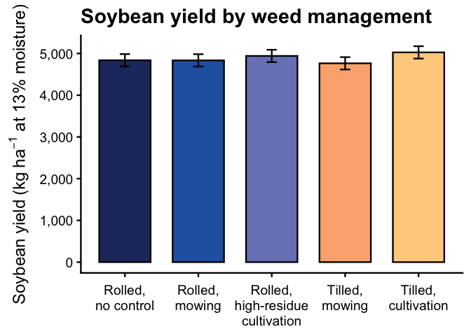<!-- -->

``` r
ggsave(
  filename = file.path(fig_dir, "fig_2024_soybean-yield_total_model_kg_ha.png"),
  plot     = fig_soy_yield_total_model_kg,
  width    = 9,
  height   = 5.5,
  units    = "in",
  dpi      = 300,
  bg       = "white"
)


# 1a) MODEL-PREDICTED MEANS (lb/ac) -------------------------------------
# Fit same model structure, but using existing lb/ac response column

yield_fig_lb <- lmer(
  bean_yield_adj_lbs_acre ~ weed_trt * site_year + (1 | site_year:block),
  data = soy_yield_2024,
  REML = TRUE
)

emm_yield_trt_lb <- emmeans(yield_fig_lb, ~ weed_trt)

plot_df_yield_model_lb <- as_tibble(emm_yield_trt_lb) |>
  mutate(
    weed_trt = factor(weed_trt, levels = mow_levels),
    mean     = emmean,
    ymin     = pmax(mean - SE, 0),
    ymax     = mean + SE
  )

if (show_letters) {
  plot_df_yield_model_lb <- left_join(plot_df_yield_model_lb, cld_yield_trt, by = "weed_trt")
}

fig_soy_yield_total_model_lb <- ggplot(
  plot_df_yield_model_lb,
  aes(x = weed_trt, y = mean, fill = weed_trt)
) +
  geom_col(width = 0.7, color = "black") +
  geom_errorbar(aes(ymin = ymin, ymax = ymax), width = 0.14) +
  { if (show_letters) geom_text(aes(y = ymax * 1.08, label = .group),
                                vjust = 0, fontface = "bold", size = 6) } +
  scale_fill_manual(values = fill_cols, guide = "none") +
  scale_x_discrete(labels = label_break_comma_cult) +
  scale_y_continuous(labels = scales::label_comma()) +
  labs(
    x     = NULL,
    y     = "Soybean yield (lb/ac at 13% moisture)",
    title = "Soybean yield by weed management"
  ) +
  theme_classic(base_size = 18) +
  theme(
    axis.text.x  = element_text(lineheight = 0.95, margin = margin(t = 8)),
    axis.title.y = element_text(margin = margin(r = 8)),
    plot.title   = element_text(face = "bold"),
    plot.caption = element_text(size = 9, hjust = 0)
  )

fig_soy_yield_total_model_lb
```

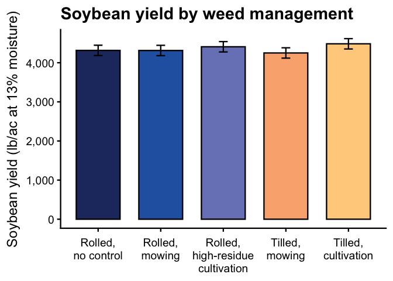<!-- -->

``` r
ggsave(
  filename = file.path(fig_dir, "fig_2024_soybean-yield_total_model_lb_ac.png"),
  plot     = fig_soy_yield_total_model_lb,
  width    = 9,
  height   = 5.5,
  units    = "in",
  dpi      = 300,
  bg       = "white"
)


# 1b) MODEL-PREDICTED MEANS (bu/ac) -------------------------------------
# Fit same model structure, but using existing bu/ac response column

yield_fig_bu <- lmer(
  bean_yield_bu_acre ~ weed_trt * site_year + (1 | site_year:block),
  data = soy_yield_2024,
  REML = TRUE
)

emm_yield_trt_bu <- emmeans(yield_fig_bu, ~ weed_trt)

plot_df_yield_model_bu <- as_tibble(emm_yield_trt_bu) |>
  mutate(
    weed_trt = factor(weed_trt, levels = mow_levels),
    mean     = emmean,
    ymin     = pmax(mean - SE, 0),
    ymax     = mean + SE
  )

if (show_letters) {
  plot_df_yield_model_bu <- left_join(plot_df_yield_model_bu, cld_yield_trt, by = "weed_trt")
}

fig_soy_yield_total_model_bu <- ggplot(
  plot_df_yield_model_bu,
  aes(x = weed_trt, y = mean, fill = weed_trt)
) +
  geom_col(width = 0.7, color = "black") +
  geom_errorbar(aes(ymin = ymin, ymax = ymax), width = 0.14) +
  { if (show_letters) geom_text(aes(y = ymax * 1.08, label = .group),
                                vjust = 0, fontface = "bold", size = 6) } +
  scale_fill_manual(values = fill_cols, guide = "none") +
  scale_x_discrete(labels = label_break_comma_cult) +
  scale_y_continuous(labels = scales::label_comma()) +
  labs(
    x     = NULL,
    y     = "Soybean yield (bu/ac at 13% moisture)",
    title = "Soybean yield by weed management"
  ) +
  theme_classic(base_size = 18) +
  theme(
    axis.text.x  = element_text(lineheight = 0.95, margin = margin(t = 8)),
    axis.title.y = element_text(margin = margin(r = 8)),
    plot.title   = element_text(face = "bold"),
    plot.caption = element_text(size = 9, hjust = 0)
  )

fig_soy_yield_total_model_bu
```

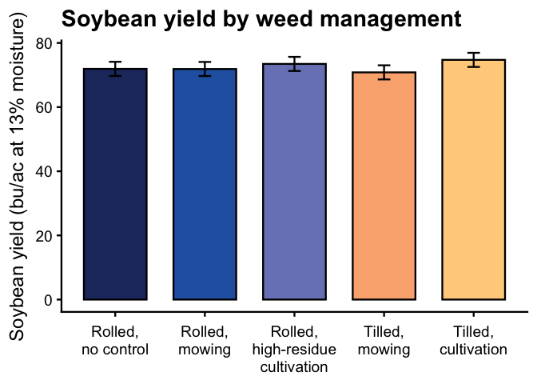<!-- -->

``` r
ggsave(
  filename = file.path(fig_dir, "fig_2024_soybean-yield_total_model_bu_ac.png"),
  plot     = fig_soy_yield_total_model_bu,
  width    = 9,
  height   = 5.5,
  units    = "in",
  dpi      = 300,
  bg       = "white"
)


# 2) RAW MEANS (kg ha^-1) ------------------------------------------------

raw_yield_summary_kg <- soy_yield_2024 |>
  dplyr::group_by(weed_trt) |>
  dplyr::summarise(
    n    = sum(!is.na(bean_yield_kg_ha)),
    mean = mean(bean_yield_kg_ha, na.rm = TRUE),
    sd   = sd(bean_yield_kg_ha, na.rm = TRUE),
    se   = dplyr::if_else(n >= 2, sd / sqrt(n), NA_real_),
    .groups = "drop"
  ) |>
  dplyr::mutate(
    weed_trt = factor(weed_trt, levels = mow_levels),
    ymin     = pmax(mean - se, 0),
    ymax     = mean + se
  )

fig_soy_yield_total_raw_kg <- ggplot(
  raw_yield_summary_kg,
  aes(x = weed_trt, y = mean, fill = weed_trt)
) +
  geom_col(width = 0.7, color = "black") +
  geom_errorbar(aes(ymin = ymin, ymax = ymax), width = 0.14) +
  scale_fill_manual(values = fill_cols, guide = "none") +
  scale_x_discrete(labels = label_break_comma_cult) +
  scale_y_continuous(labels = scales::label_comma()) +
  labs(
    x     = NULL,
    y     = expression(Soybean~yield~"(kg"~ha^{-1}*" at 13% moisture)"),
    title = "Soybean yield by weed management"
  ) +
  theme_classic(base_size = 18) +
  theme(
    axis.text.x  = element_text(lineheight = 0.95, margin = margin(t = 8)),
    axis.title.y = element_text(margin = margin(r = 8)),
    plot.title   = element_text(face = "bold"),
    plot.caption = element_text(size = 9, hjust = 0)
  )

fig_soy_yield_total_raw_kg
```

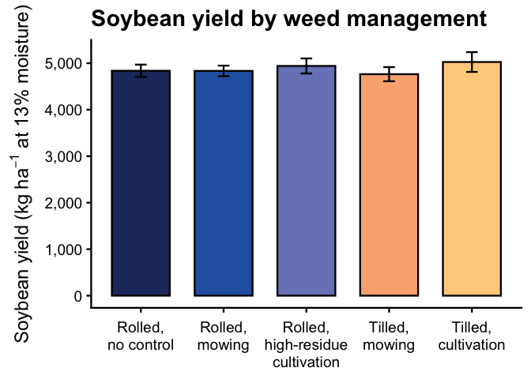<!-- -->

``` r
ggsave(
  filename = file.path(fig_dir, "fig_2024_soybean-yield_total_raw_kg_ha.png"),
  plot     = fig_soy_yield_total_raw_kg,
  width    = 9,
  height   = 5.5,
  units    = "in",
  dpi      = 300,
  bg       = "white"
)


# 2a) RAW MEANS (lb/ac) --------------------------------------------------

raw_yield_summary_lb <- soy_yield_2024 |>
  dplyr::group_by(weed_trt) |>
  dplyr::summarise(
    n    = sum(!is.na(bean_yield_adj_lbs_acre)),
    mean = mean(bean_yield_adj_lbs_acre, na.rm = TRUE),
    sd   = sd(bean_yield_adj_lbs_acre, na.rm = TRUE),
    se   = dplyr::if_else(n >= 2, sd / sqrt(n), NA_real_),
    .groups = "drop"
  ) |>
  dplyr::mutate(
    weed_trt = factor(weed_trt, levels = mow_levels),
    ymin     = pmax(mean - se, 0),
    ymax     = mean + se
  )

fig_soy_yield_total_raw_lb <- ggplot(
  raw_yield_summary_lb,
  aes(x = weed_trt, y = mean, fill = weed_trt)
) +
  geom_col(width = 0.7, color = "black") +
  geom_errorbar(aes(ymin = ymin, ymax = ymax), width = 0.14) +
  scale_fill_manual(values = fill_cols, guide = "none") +
  scale_x_discrete(labels = label_break_comma_cult) +
  scale_y_continuous(labels = scales::label_comma()) +
  labs(
    x     = NULL,
    y     = "Soybean yield (lb/ac at 13% moisture)",
    title = "Soybean yield by weed management"
  ) +
  theme_classic(base_size = 18) +
  theme(
    axis.text.x  = element_text(lineheight = 0.95, margin = margin(t = 8)),
    axis.title.y = element_text(margin = margin(r = 8)),
    plot.title   = element_text(face = "bold"),
    plot.caption = element_text(size = 9, hjust = 0)
  )

fig_soy_yield_total_raw_lb
```

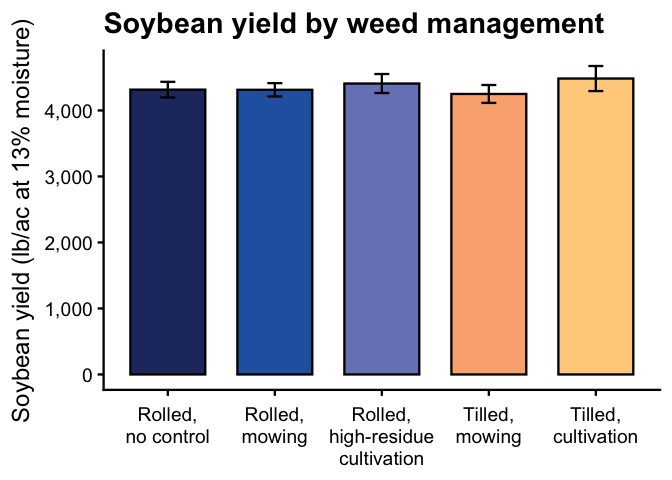<!-- -->

``` r
ggsave(
  filename = file.path(fig_dir, "fig_2024_soybean-yield_total_raw_lb_ac.png"),
  plot     = fig_soy_yield_total_raw_lb,
  width    = 9,
  height   = 5.5,
  units    = "in",
  dpi      = 300,
  bg       = "white"
)


# 2b) RAW MEANS (bu/ac) --------------------------------------------------

raw_yield_summary_bu <- soy_yield_2024 |>
  dplyr::group_by(weed_trt) |>
  dplyr::summarise(
    n    = sum(!is.na(bean_yield_bu_acre)),
    mean = mean(bean_yield_bu_acre, na.rm = TRUE),
    sd   = sd(bean_yield_bu_acre, na.rm = TRUE),
    se   = dplyr::if_else(n >= 2, sd / sqrt(n), NA_real_),
    .groups = "drop"
  ) |>
  dplyr::mutate(
    weed_trt = factor(weed_trt, levels = mow_levels),
    ymin     = pmax(mean - se, 0),
    ymax     = mean + se
  )

fig_soy_yield_total_raw_bu <- ggplot(
  raw_yield_summary_bu,
  aes(x = weed_trt, y = mean, fill = weed_trt)
) +
  geom_col(width = 0.7, color = "black") +
  geom_errorbar(aes(ymin = ymin, ymax = ymax), width = 0.14) +
  scale_fill_manual(values = fill_cols, guide = "none") +
  scale_x_discrete(labels = label_break_comma_cult) +
  scale_y_continuous(labels = scales::label_comma()) +
  labs(
    x     = NULL,
    y     = "Soybean yield (bu/ac at 13% moisture)",
    title = "Soybean yield by weed management"
  ) +
  theme_classic(base_size = 18) +
  theme(
    axis.text.x  = element_text(lineheight = 0.95, margin = margin(t = 8)),
    axis.title.y = element_text(margin = margin(r = 8)),
    plot.title   = element_text(face = "bold"),
    plot.caption = element_text(size = 9, hjust = 0)
  )

fig_soy_yield_total_raw_bu
```

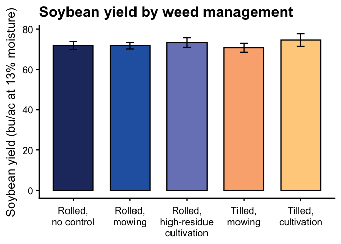<!-- -->

``` r
ggsave(
  filename = file.path(fig_dir, "fig_2024_soybean-yield_total_raw_bu_ac.png"),
  plot     = fig_soy_yield_total_raw_bu,
  width    = 9,
  height   = 5.5,
  units    = "in",
  dpi      = 300,
  bg       = "white"
)
```
