Weed biomass
================

- [Data import & prep](#data-import--prep)
- [Model testing](#model-testing)
  - [Exploratory](#exploratory)
    - [In-row weed biomass (kg ha⁻¹) by site-year ×
      treatment](#in-row-weed-biomass-kg-ha¹-by-site-year--treatment)
    - [Inter-row weed biomass (kg ha⁻¹) by site-year ×
      treatment](#inter-row-weed-biomass-kg-ha¹-by-site-year--treatment)
  - [Selection](#selection)
    - [Total weed biomass](#total-weed-biomass)
    - [In-row weed biomass](#in-row-weed-biomass)
    - [Interrow weed biomass](#interrow-weed-biomass)
- [Figures](#figures)
  - [Total weed biomass](#total-weed-biomass-1)
    - [Pooled](#pooled-3)
    - [2023](#2023-1)
  - [In-row weed biomass](#in-row-weed-biomass-1)
    - [Pooled](#pooled-4)
    - [2023](#2023-2)
  - [Interrow weed biomass](#interrow-weed-biomass-1)
    - [Pooled](#pooled-5)
    - [2023](#2023-3)

\#Setup

\#Packages

``` r
# Packages
library(tidyverse)    # includes dplyr, ggplot2, readr, tibble, etc.
library(janitor)
library(readxl)
library(glmmTMB)
library(DHARMa)
library(emmeans)
library(multcomp)
library(car)
library(kableExtra)
library(here)
library(conflicted)
library(lme4)
library(WrensBookshelf)


# Handle conflicts
conflicts_prefer(dplyr::select)
conflicts_prefer(dplyr::filter)
conflicts_prefer(dplyr::recode)

# Treatment level order (use everywhere)
mow_levels <- c(
  "Rolled, no control",
  "Rolled, mowing",
  "Rolled, high-residue cultivation",
  "Tilled, mowing",
  "Tilled, cultivation"
)

# One consistent CVD-safe color palette for all figures (WrensBookshelf)
fill_cols <- WB_brewer(
  name = "WhatWellBuild",
  n    = length(mow_levels),
  type = "discrete"
) |>
  setNames(mow_levels)

# x-axis label helpers ---------------------------------------------------

# Break on spaces (if you ever want every word on its own line)
label_break_spaces <- function(x) {
  stringr::str_replace_all(x, " ", "\n")
}

# Break after the comma: "Rolled,\nno control", etc.
label_break_comma <- function(x) {
  stringr::str_replace_all(x, ", ", ",\n")
}

# Break after comma AND split "high-residue cultivation"
# -> "Rolled,\nhigh-residue\ncultivation"
label_break_comma_cult <- function(x) {
  x |>
    stringr::str_replace("high-residue cultivation",
                         "high-residue\ncultivation") |>
    stringr::str_replace_all(", ", ",\n")
}

# Helper: tidy emmeans output regardless of CI column names --------------
# (works directly on an emmeans object)

tidy_emm <- function(emm, ref_levels = NULL) {
  emm_df <- as.data.frame(emm)

  lcl_col <- intersect(c("lower.CL", "asymp.LCL"), names(emm_df))[1]
  ucl_col <- intersect(c("upper.CL", "asymp.UCL"), names(emm_df))[1]

  if (is.na(lcl_col) || is.na(ucl_col)) {
    stop("Could not find CI columns in emmeans output.")
  }

  out <- emm_df |>
    dplyr::mutate(
      ci_low  = .data[[lcl_col]],
      ci_high = .data[[ucl_col]]
    )

  if (!is.null(ref_levels) && "weed_trt" %in% names(out)) {
    out <- out |>
      dplyr::mutate(weed_trt = factor(weed_trt, levels = ref_levels))
  }

  out
}
```

# Data import & prep

``` r
# 1) Read + clean master (weed biomass) ---------------------------------

weed_biomass_clean <- read_excel(
  here("data", "raw", "All Treatments", "combined_raw.xlsx")
) |>
  clean_names() |>
  rename(weed_trt = treatment) |>
  mutate(
    year      = factor(year),
    location  = factor(location),
    site_year = factor(interaction(year, location, drop = TRUE)),
    block     = factor(block),
    weed_trt  = recode(
      weed_trt,
      "RNO" = "Rolled, no control",
      "RIM" = "Rolled, mowing",
      "RIC" = "Rolled, high-residue cultivation",
      "TIM" = "Tilled, mowing",
      "TIC" = "Tilled, cultivation"
    ),
    weed_trt = factor(weed_trt, levels = mow_levels)
  ) |>
  # keep only rows with non-missing total weed biomass
  filter(!is.na(weed_biomass)) |>
  # per-area metrics, assuming all biomass vars are g per 0.5 m² quadrat
  mutate(
    weed_biomass_g_m2           = weed_biomass          * 2,   # g/m²
    weed_biomass_kg_ha          = weed_biomass          * 20,  # kg/ha
    inrow_weed_biomass_g_m2     = inrow_weed_biomass    * 2,
    inrow_weed_biomass_kg_ha    = inrow_weed_biomass    * 20,
    interrow_weed_biomass_g_m2  = interrow_weed_biomass * 2,
    interrow_weed_biomass_kg_ha = interrow_weed_biomass * 20
  )

# 2) 2023 Field V subset -----------------------------------------------

weed_biomass_field_v_2023 <- weed_biomass_clean |>
  filter(year == 2023, location == "field v")

# Quick check
kable(
  head(weed_biomass_clean),
  caption = "All site-years, cleaned (weed biomass)"
)
```

| id | location | year | weed_trt | block | plot | bean_emergence | bean_biomass | inrow_weed_biomass | interrow_weed_biomass | weed_biomass | bean_population | bean_yield | seed_weight | site_year | weed_biomass_g_m2 | weed_biomass_kg_ha | inrow_weed_biomass_g_m2 | inrow_weed_biomass_kg_ha | interrow_weed_biomass_g_m2 | interrow_weed_biomass_kg_ha |
|:---|:---|:---|:---|:---|---:|---:|---:|---:|---:|---:|---:|---:|---:|:---|---:|---:|---:|---:|---:|---:|
| CU_B1_P101 | field v | 2023 | Tilled, mowing | 1 | 101 | 46.5 | 223.740 | 19.000 | 44.490 | 63.490 | 34.5 | 417.21 | 17.1200 | 2023.field v | 126.98 | 1269.8 | 38.00 | 380.0 | 88.98 | 889.8 |
| CU_B1_P102 | field v | 2023 | Tilled, cultivation | 1 | 102 | 42.5 | 267.460 | 30.975 | 0.720 | 31.695 | 39.5 | 565.54 | 17.4750 | 2023.field v | 63.39 | 633.9 | 61.95 | 619.5 | 1.44 | 14.4 |
| CU_B1_P103 | field v | 2023 | Rolled, mowing | 1 | 103 | 36.5 | 217.890 | 0.950 | 6.890 | 7.840 | 37.5 | 449.93 | 16.7525 | 2023.field v | 15.68 | 156.8 | 1.90 | 19.0 | 13.78 | 137.8 |
| CU_B1_P104 | field v | 2023 | Rolled, no control | 1 | 104 | 41.0 | 207.675 | 0.660 | 45.735 | 46.395 | 35.0 | 412.59 | 16.1450 | 2023.field v | 92.79 | 927.9 | 1.32 | 13.2 | 91.47 | 914.7 |
| CU_B1_P105 | field v | 2023 | Rolled, high-residue cultivation | 1 | 105 | 41.0 | 230.285 | 0.495 | 22.025 | 22.520 | 39.0 | 473.79 | 17.0475 | 2023.field v | 45.04 | 450.4 | 0.99 | 9.9 | 44.05 | 440.5 |
| CU_B1_P201 | field v | 2023 | Rolled, high-residue cultivation | 2 | 201 | 36.5 | 208.105 | 6.395 | 19.460 | 25.855 | 33.5 | 484.04 | 17.1500 | 2023.field v | 51.71 | 517.1 | 12.79 | 127.9 | 38.92 | 389.2 |

All site-years, cleaned (weed biomass)

``` r
kable(
  head(weed_biomass_field_v_2023),
  caption = "Field V only, 2023 (weed biomass)"
)
```

| id | location | year | weed_trt | block | plot | bean_emergence | bean_biomass | inrow_weed_biomass | interrow_weed_biomass | weed_biomass | bean_population | bean_yield | seed_weight | site_year | weed_biomass_g_m2 | weed_biomass_kg_ha | inrow_weed_biomass_g_m2 | inrow_weed_biomass_kg_ha | interrow_weed_biomass_g_m2 | interrow_weed_biomass_kg_ha |
|:---|:---|:---|:---|:---|---:|---:|---:|---:|---:|---:|---:|---:|---:|:---|---:|---:|---:|---:|---:|---:|
| CU_B1_P101 | field v | 2023 | Tilled, mowing | 1 | 101 | 46.5 | 223.740 | 19.000 | 44.490 | 63.490 | 34.5 | 417.21 | 17.1200 | 2023.field v | 126.98 | 1269.8 | 38.00 | 380.0 | 88.98 | 889.8 |
| CU_B1_P102 | field v | 2023 | Tilled, cultivation | 1 | 102 | 42.5 | 267.460 | 30.975 | 0.720 | 31.695 | 39.5 | 565.54 | 17.4750 | 2023.field v | 63.39 | 633.9 | 61.95 | 619.5 | 1.44 | 14.4 |
| CU_B1_P103 | field v | 2023 | Rolled, mowing | 1 | 103 | 36.5 | 217.890 | 0.950 | 6.890 | 7.840 | 37.5 | 449.93 | 16.7525 | 2023.field v | 15.68 | 156.8 | 1.90 | 19.0 | 13.78 | 137.8 |
| CU_B1_P104 | field v | 2023 | Rolled, no control | 1 | 104 | 41.0 | 207.675 | 0.660 | 45.735 | 46.395 | 35.0 | 412.59 | 16.1450 | 2023.field v | 92.79 | 927.9 | 1.32 | 13.2 | 91.47 | 914.7 |
| CU_B1_P105 | field v | 2023 | Rolled, high-residue cultivation | 1 | 105 | 41.0 | 230.285 | 0.495 | 22.025 | 22.520 | 39.0 | 473.79 | 17.0475 | 2023.field v | 45.04 | 450.4 | 0.99 | 9.9 | 44.05 | 440.5 |
| CU_B1_P201 | field v | 2023 | Rolled, high-residue cultivation | 2 | 201 | 36.5 | 208.105 | 6.395 | 19.460 | 25.855 | 33.5 | 484.04 | 17.1500 | 2023.field v | 51.71 | 517.1 | 12.79 | 127.9 | 38.92 | 389.2 |

Field V only, 2023 (weed biomass)

# Model testing

## Exploratory

\###Total weed biomass (kg ha⁻¹) by site-year × treatment

``` r
# 1) Summary table: total weed biomass by site-year × treatment ---------
weed_biomass_clean |>
  group_by(site_year, weed_trt) |>
  summarise(
    n      = n(),
    mean   = mean(weed_biomass_kg_ha, na.rm = TRUE),
    median = median(weed_biomass_kg_ha, na.rm = TRUE),
    sd     = sd(weed_biomass_kg_ha, na.rm = TRUE),
    .groups = "drop"
  ) |>
  arrange(site_year, weed_trt) |>
  kable(
    digits  = 1,
    caption = "Weed biomass (kg ha⁻¹) by site-year × treatment"
  ) |>
  kable_styling(full_width = FALSE, bootstrap_options = c("striped", "hover"))
```

<table class="table table-striped table-hover" style="color: black; width: auto !important; margin-left: auto; margin-right: auto;">

<caption>

Weed biomass (kg ha⁻¹) by site-year × treatment
</caption>

<thead>

<tr>

<th style="text-align:left;">

site_year
</th>

<th style="text-align:left;">

weed_trt
</th>

<th style="text-align:right;">

n
</th>

<th style="text-align:right;">

mean
</th>

<th style="text-align:right;">

median
</th>

<th style="text-align:right;">

sd
</th>

</tr>

</thead>

<tbody>

<tr>

<td style="text-align:left;">

2024.field O2 east
</td>

<td style="text-align:left;">

Rolled, no control
</td>

<td style="text-align:right;">

4
</td>

<td style="text-align:right;">

124.8
</td>

<td style="text-align:right;">

19.5
</td>

<td style="text-align:right;">

224.3
</td>

</tr>

<tr>

<td style="text-align:left;">

2024.field O2 east
</td>

<td style="text-align:left;">

Rolled, mowing
</td>

<td style="text-align:right;">

4
</td>

<td style="text-align:right;">

24.2
</td>

<td style="text-align:right;">

11.8
</td>

<td style="text-align:right;">

28.9
</td>

</tr>

<tr>

<td style="text-align:left;">

2024.field O2 east
</td>

<td style="text-align:left;">

Rolled, high-residue cultivation
</td>

<td style="text-align:right;">

4
</td>

<td style="text-align:right;">

2.3
</td>

<td style="text-align:right;">

1.6
</td>

<td style="text-align:right;">

2.8
</td>

</tr>

<tr>

<td style="text-align:left;">

2024.field O2 east
</td>

<td style="text-align:left;">

Tilled, mowing
</td>

<td style="text-align:right;">

4
</td>

<td style="text-align:right;">

132.9
</td>

<td style="text-align:right;">

75.0
</td>

<td style="text-align:right;">

167.7
</td>

</tr>

<tr>

<td style="text-align:left;">

2024.field O2 east
</td>

<td style="text-align:left;">

Tilled, cultivation
</td>

<td style="text-align:right;">

4
</td>

<td style="text-align:right;">

93.7
</td>

<td style="text-align:right;">

9.2
</td>

<td style="text-align:right;">

172.5
</td>

</tr>

<tr>

<td style="text-align:left;">

2024.field O2 west
</td>

<td style="text-align:left;">

Rolled, no control
</td>

<td style="text-align:right;">

4
</td>

<td style="text-align:right;">

247.2
</td>

<td style="text-align:right;">

38.1
</td>

<td style="text-align:right;">

444.5
</td>

</tr>

<tr>

<td style="text-align:left;">

2024.field O2 west
</td>

<td style="text-align:left;">

Rolled, mowing
</td>

<td style="text-align:right;">

4
</td>

<td style="text-align:right;">

87.8
</td>

<td style="text-align:right;">

28.6
</td>

<td style="text-align:right;">

138.8
</td>

</tr>

<tr>

<td style="text-align:left;">

2024.field O2 west
</td>

<td style="text-align:left;">

Rolled, high-residue cultivation
</td>

<td style="text-align:right;">

4
</td>

<td style="text-align:right;">

272.2
</td>

<td style="text-align:right;">

172.7
</td>

<td style="text-align:right;">

353.9
</td>

</tr>

<tr>

<td style="text-align:left;">

2024.field O2 west
</td>

<td style="text-align:left;">

Tilled, mowing
</td>

<td style="text-align:right;">

4
</td>

<td style="text-align:right;">

195.0
</td>

<td style="text-align:right;">

230.2
</td>

<td style="text-align:right;">

78.9
</td>

</tr>

<tr>

<td style="text-align:left;">

2024.field O2 west
</td>

<td style="text-align:left;">

Tilled, cultivation
</td>

<td style="text-align:right;">

4
</td>

<td style="text-align:right;">

12.2
</td>

<td style="text-align:right;">

1.3
</td>

<td style="text-align:right;">

22.6
</td>

</tr>

<tr>

<td style="text-align:left;">

2023.field v
</td>

<td style="text-align:left;">

Rolled, no control
</td>

<td style="text-align:right;">

4
</td>

<td style="text-align:right;">

419.5
</td>

<td style="text-align:right;">

351.9
</td>

<td style="text-align:right;">

381.2
</td>

</tr>

<tr>

<td style="text-align:left;">

2023.field v
</td>

<td style="text-align:left;">

Rolled, mowing
</td>

<td style="text-align:right;">

4
</td>

<td style="text-align:right;">

257.8
</td>

<td style="text-align:right;">

246.8
</td>

<td style="text-align:right;">

141.5
</td>

</tr>

<tr>

<td style="text-align:left;">

2023.field v
</td>

<td style="text-align:left;">

Rolled, high-residue cultivation
</td>

<td style="text-align:right;">

4
</td>

<td style="text-align:right;">

463.4
</td>

<td style="text-align:right;">

483.8
</td>

<td style="text-align:right;">

108.4
</td>

</tr>

<tr>

<td style="text-align:left;">

2023.field v
</td>

<td style="text-align:left;">

Tilled, mowing
</td>

<td style="text-align:right;">

4
</td>

<td style="text-align:right;">

1184.3
</td>

<td style="text-align:right;">

1128.8
</td>

<td style="text-align:right;">

309.7
</td>

</tr>

<tr>

<td style="text-align:left;">

2023.field v
</td>

<td style="text-align:left;">

Tilled, cultivation
</td>

<td style="text-align:right;">

4
</td>

<td style="text-align:right;">

853.7
</td>

<td style="text-align:right;">

736.2
</td>

<td style="text-align:right;">

307.1
</td>

</tr>

</tbody>

</table>

``` r
# 2) Faceted boxplot: all site-years -----------------------------------
weed_biomass_clean |>
  ggplot(aes(x = weed_trt, y = weed_biomass_kg_ha, fill = weed_trt)) +
  geom_boxplot(
    outlier.shape = NA,
    width  = 0.55,
    color  = "black"
  ) +
  geom_jitter(
    width  = 0.12,
    height = 0,
    alpha  = 0.4,
    size   = 1.8,
    color  = "grey30"
  ) +
  facet_wrap(~ site_year, nrow = 1) +
  scale_fill_manual(values = fill_cols, guide = "none") +
  scale_x_discrete(labels = label_break_comma_cult) +
  scale_y_continuous(labels = scales::label_comma()) +
  labs(
    x     = NULL,
    y     = expression(Weed~biomass~"(kg"~ha^{-1}*")"),
    title = "Weed biomass by treatment across site-years"
  ) +
  theme_classic(base_size = 14) +
  theme(
    axis.text.x = element_text(size = 10),
    strip.text  = element_text(face = "bold")
  )
```

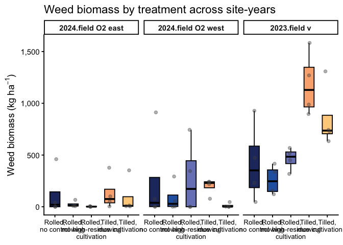<!-- -->

``` r
# 3) Boxplot: 2023 – Field V only --------------------------------------
weed_biomass_field_v_2023 |>
  ggplot(aes(x = weed_trt, y = weed_biomass_kg_ha, fill = weed_trt)) +
  geom_boxplot(
    outlier.shape = NA,
    width  = 0.55,
    color  = "black"
  ) +
  geom_jitter(
    width  = 0.12,
    height = 0,
    alpha  = 0.4,
    size   = 1.8,
    color  = "grey30"
  ) +
  scale_fill_manual(values = fill_cols, guide = "none") +
  scale_x_discrete(labels = label_break_comma_cult) +
  scale_y_continuous(labels = scales::label_comma()) +
  labs(
    x     = NULL,
    y     = expression(Weed~biomass~"(kg"~ha^{-1}*")"),
    title = "Weed biomass by treatment, 2023 – Field V"
  ) +
  theme_classic(base_size = 14) +
  theme(
    axis.text.x = element_text(size = 10)
  )
```

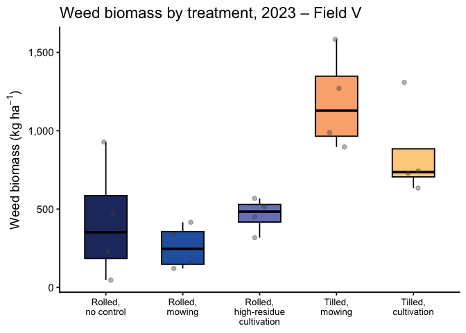<!-- -->

### In-row weed biomass (kg ha⁻¹) by site-year × treatment

``` r
# 1) Summary table: in-row weed biomass by site-year × treatment -------
weed_biomass_clean |>
  group_by(site_year, weed_trt) |>
  summarise(
    n      = n(),
    mean   = mean(inrow_weed_biomass_kg_ha, na.rm = TRUE),
    median = median(inrow_weed_biomass_kg_ha, na.rm = TRUE),
    sd     = sd(inrow_weed_biomass_kg_ha, na.rm = TRUE),
    .groups = "drop"
  ) |>
  arrange(site_year, weed_trt) |>
  kable(
    digits  = 1,
    caption = "In-row weed biomass (kg ha⁻¹) by site-year × treatment"
  ) |>
  kable_styling(full_width = FALSE, bootstrap_options = c("striped", "hover"))
```

<table class="table table-striped table-hover" style="color: black; width: auto !important; margin-left: auto; margin-right: auto;">

<caption>

In-row weed biomass (kg ha⁻¹) by site-year × treatment
</caption>

<thead>

<tr>

<th style="text-align:left;">

site_year
</th>

<th style="text-align:left;">

weed_trt
</th>

<th style="text-align:right;">

n
</th>

<th style="text-align:right;">

mean
</th>

<th style="text-align:right;">

median
</th>

<th style="text-align:right;">

sd
</th>

</tr>

</thead>

<tbody>

<tr>

<td style="text-align:left;">

2024.field O2 east
</td>

<td style="text-align:left;">

Rolled, no control
</td>

<td style="text-align:right;">

4
</td>

<td style="text-align:right;">

0.0
</td>

<td style="text-align:right;">

0.0
</td>

<td style="text-align:right;">

0.0
</td>

</tr>

<tr>

<td style="text-align:left;">

2024.field O2 east
</td>

<td style="text-align:left;">

Rolled, mowing
</td>

<td style="text-align:right;">

4
</td>

<td style="text-align:right;">

0.1
</td>

<td style="text-align:right;">

0.0
</td>

<td style="text-align:right;">

0.2
</td>

</tr>

<tr>

<td style="text-align:left;">

2024.field O2 east
</td>

<td style="text-align:left;">

Rolled, high-residue cultivation
</td>

<td style="text-align:right;">

4
</td>

<td style="text-align:right;">

0.6
</td>

<td style="text-align:right;">

0.0
</td>

<td style="text-align:right;">

1.1
</td>

</tr>

<tr>

<td style="text-align:left;">

2024.field O2 east
</td>

<td style="text-align:left;">

Tilled, mowing
</td>

<td style="text-align:right;">

4
</td>

<td style="text-align:right;">

16.9
</td>

<td style="text-align:right;">

18.3
</td>

<td style="text-align:right;">

10.0
</td>

</tr>

<tr>

<td style="text-align:left;">

2024.field O2 east
</td>

<td style="text-align:left;">

Tilled, cultivation
</td>

<td style="text-align:right;">

4
</td>

<td style="text-align:right;">

63.4
</td>

<td style="text-align:right;">

9.2
</td>

<td style="text-align:right;">

114.5
</td>

</tr>

<tr>

<td style="text-align:left;">

2024.field O2 west
</td>

<td style="text-align:left;">

Rolled, no control
</td>

<td style="text-align:right;">

4
</td>

<td style="text-align:right;">

26.4
</td>

<td style="text-align:right;">

0.0
</td>

<td style="text-align:right;">

52.9
</td>

</tr>

<tr>

<td style="text-align:left;">

2024.field O2 west
</td>

<td style="text-align:left;">

Rolled, mowing
</td>

<td style="text-align:right;">

4
</td>

<td style="text-align:right;">

65.0
</td>

<td style="text-align:right;">

5.5
</td>

<td style="text-align:right;">

122.8
</td>

</tr>

<tr>

<td style="text-align:left;">

2024.field O2 west
</td>

<td style="text-align:left;">

Rolled, high-residue cultivation
</td>

<td style="text-align:right;">

4
</td>

<td style="text-align:right;">

57.7
</td>

<td style="text-align:right;">

7.7
</td>

<td style="text-align:right;">

105.3
</td>

</tr>

<tr>

<td style="text-align:left;">

2024.field O2 west
</td>

<td style="text-align:left;">

Tilled, mowing
</td>

<td style="text-align:right;">

4
</td>

<td style="text-align:right;">

49.0
</td>

<td style="text-align:right;">

51.2
</td>

<td style="text-align:right;">

35.1
</td>

</tr>

<tr>

<td style="text-align:left;">

2024.field O2 west
</td>

<td style="text-align:left;">

Tilled, cultivation
</td>

<td style="text-align:right;">

4
</td>

<td style="text-align:right;">

11.7
</td>

<td style="text-align:right;">

1.1
</td>

<td style="text-align:right;">

21.9
</td>

</tr>

<tr>

<td style="text-align:left;">

2023.field v
</td>

<td style="text-align:left;">

Rolled, no control
</td>

<td style="text-align:right;">

4
</td>

<td style="text-align:right;">

24.2
</td>

<td style="text-align:right;">

25.9
</td>

<td style="text-align:right;">

8.2
</td>

</tr>

<tr>

<td style="text-align:left;">

2023.field v
</td>

<td style="text-align:left;">

Rolled, mowing
</td>

<td style="text-align:right;">

4
</td>

<td style="text-align:right;">

125.9
</td>

<td style="text-align:right;">

110.4
</td>

<td style="text-align:right;">

107.3
</td>

</tr>

<tr>

<td style="text-align:left;">

2023.field v
</td>

<td style="text-align:left;">

Rolled, high-residue cultivation
</td>

<td style="text-align:right;">

4
</td>

<td style="text-align:right;">

170.1
</td>

<td style="text-align:right;">

195.8
</td>

<td style="text-align:right;">

126.5
</td>

</tr>

<tr>

<td style="text-align:left;">

2023.field v
</td>

<td style="text-align:left;">

Tilled, mowing
</td>

<td style="text-align:right;">

4
</td>

<td style="text-align:right;">

662.2
</td>

<td style="text-align:right;">

569.8
</td>

<td style="text-align:right;">

342.3
</td>

</tr>

<tr>

<td style="text-align:left;">

2023.field v
</td>

<td style="text-align:left;">

Tilled, cultivation
</td>

<td style="text-align:right;">

4
</td>

<td style="text-align:right;">

849.9
</td>

<td style="text-align:right;">

735.8
</td>

<td style="text-align:right;">

310.7
</td>

</tr>

</tbody>

</table>

``` r
# 2) Faceted boxplot: all site-years -----------------------------------
weed_biomass_clean |>
  ggplot(aes(x = weed_trt, y = inrow_weed_biomass_kg_ha, fill = weed_trt)) +
  geom_boxplot(
    outlier.shape = NA,
    width  = 0.55,
    color  = "black"
  ) +
  geom_jitter(
    width  = 0.12,
    height = 0,
    alpha  = 0.4,
    size   = 1.8,
    color  = "grey30"
  ) +
  facet_wrap(~ site_year, nrow = 1) +
  scale_fill_manual(values = fill_cols, guide = "none") +
  scale_x_discrete(labels = label_break_comma_cult) +
  scale_y_continuous(labels = scales::label_comma()) +
  labs(
    x     = NULL,
    y     = expression(In-row~weed~biomass~"(kg"~ha^{-1}*")"),
    title = "In-row weed biomass by treatment across site-years"
  ) +
  theme_classic(base_size = 14) +
  theme(
    axis.text.x = element_text(size = 10),
    strip.text  = element_text(face = "bold")
  )
```

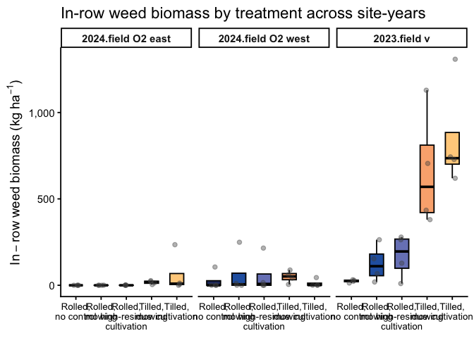<!-- -->

``` r
# 3) Boxplot: 2023 – Field V only --------------------------------------
weed_biomass_field_v_2023 |>
  ggplot(aes(x = weed_trt, y = inrow_weed_biomass_kg_ha, fill = weed_trt)) +
  geom_boxplot(
    outlier.shape = NA,
    width  = 0.55,
    color  = "black"
  ) +
  geom_jitter(
    width  = 0.12,
    height = 0,
    alpha  = 0.4,
    size   = 1.8,
    color  = "grey30"
  ) +
  scale_fill_manual(values = fill_cols, guide = "none") +
  scale_x_discrete(labels = label_break_comma_cult) +
  scale_y_continuous(labels = scales::label_comma()) +
  labs(
    x     = NULL,
    y     = expression(In-row~weed~biomass~"(kg"~ha^{-1}*")"),
    title = "In-row weed biomass by treatment, 2023 – Field V"
  ) +
  theme_classic(base_size = 14) +
  theme(
    axis.text.x = element_text(size = 10)
  )
```

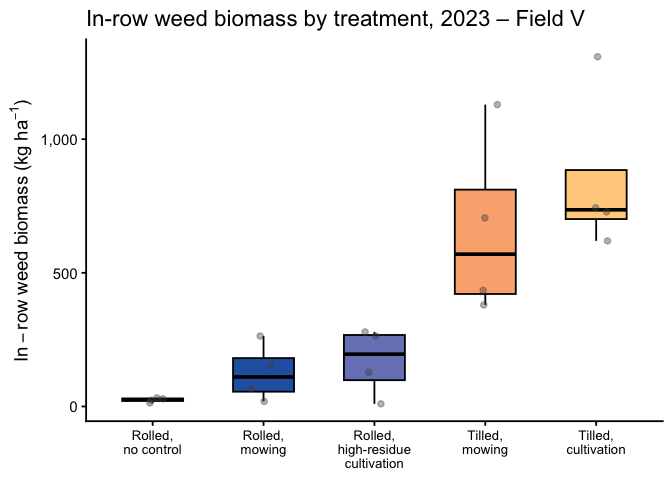<!-- -->

### Inter-row weed biomass (kg ha⁻¹) by site-year × treatment

``` r
# 1) Summary table: interrow weed biomass by site-year × treatment -----
weed_biomass_clean |>
  group_by(site_year, weed_trt) |>
  summarise(
    n      = n(),
    mean   = mean(interrow_weed_biomass_kg_ha, na.rm = TRUE),
    median = median(interrow_weed_biomass_kg_ha, na.rm = TRUE),
    sd     = sd(interrow_weed_biomass_kg_ha, na.rm = TRUE),
    .groups = "drop"
  ) |>
  arrange(site_year, weed_trt) |>
  kable(
    digits  = 1,
    caption = "Interrow weed biomass (kg ha⁻¹) by site-year × treatment"
  ) |>
  kable_styling(full_width = FALSE, bootstrap_options = c("striped", "hover"))
```

<table class="table table-striped table-hover" style="color: black; width: auto !important; margin-left: auto; margin-right: auto;">

<caption>

Interrow weed biomass (kg ha⁻¹) by site-year × treatment
</caption>

<thead>

<tr>

<th style="text-align:left;">

site_year
</th>

<th style="text-align:left;">

weed_trt
</th>

<th style="text-align:right;">

n
</th>

<th style="text-align:right;">

mean
</th>

<th style="text-align:right;">

median
</th>

<th style="text-align:right;">

sd
</th>

</tr>

</thead>

<tbody>

<tr>

<td style="text-align:left;">

2024.field O2 east
</td>

<td style="text-align:left;">

Rolled, no control
</td>

<td style="text-align:right;">

4
</td>

<td style="text-align:right;">

124.8
</td>

<td style="text-align:right;">

19.5
</td>

<td style="text-align:right;">

224.3
</td>

</tr>

<tr>

<td style="text-align:left;">

2024.field O2 east
</td>

<td style="text-align:left;">

Rolled, mowing
</td>

<td style="text-align:right;">

4
</td>

<td style="text-align:right;">

24.1
</td>

<td style="text-align:right;">

11.8
</td>

<td style="text-align:right;">

29.0
</td>

</tr>

<tr>

<td style="text-align:left;">

2024.field O2 east
</td>

<td style="text-align:left;">

Rolled, high-residue cultivation
</td>

<td style="text-align:right;">

4
</td>

<td style="text-align:right;">

1.7
</td>

<td style="text-align:right;">

0.5
</td>

<td style="text-align:right;">

2.8
</td>

</tr>

<tr>

<td style="text-align:left;">

2024.field O2 east
</td>

<td style="text-align:left;">

Tilled, mowing
</td>

<td style="text-align:right;">

4
</td>

<td style="text-align:right;">

116.0
</td>

<td style="text-align:right;">

54.6
</td>

<td style="text-align:right;">

162.0
</td>

</tr>

<tr>

<td style="text-align:left;">

2024.field O2 east
</td>

<td style="text-align:left;">

Tilled, cultivation
</td>

<td style="text-align:right;">

4
</td>

<td style="text-align:right;">

30.4
</td>

<td style="text-align:right;">

2.0
</td>

<td style="text-align:right;">

58.0
</td>

</tr>

<tr>

<td style="text-align:left;">

2024.field O2 west
</td>

<td style="text-align:left;">

Rolled, no control
</td>

<td style="text-align:right;">

4
</td>

<td style="text-align:right;">

220.8
</td>

<td style="text-align:right;">

38.1
</td>

<td style="text-align:right;">

391.8
</td>

</tr>

<tr>

<td style="text-align:left;">

2024.field O2 west
</td>

<td style="text-align:left;">

Rolled, mowing
</td>

<td style="text-align:right;">

4
</td>

<td style="text-align:right;">

22.8
</td>

<td style="text-align:right;">

23.4
</td>

<td style="text-align:right;">

23.9
</td>

</tr>

<tr>

<td style="text-align:left;">

2024.field O2 west
</td>

<td style="text-align:left;">

Rolled, high-residue cultivation
</td>

<td style="text-align:right;">

4
</td>

<td style="text-align:right;">

214.5
</td>

<td style="text-align:right;">

65.0
</td>

<td style="text-align:right;">

347.9
</td>

</tr>

<tr>

<td style="text-align:left;">

2024.field O2 west
</td>

<td style="text-align:left;">

Tilled, mowing
</td>

<td style="text-align:right;">

4
</td>

<td style="text-align:right;">

146.0
</td>

<td style="text-align:right;">

155.3
</td>

<td style="text-align:right;">

57.1
</td>

</tr>

<tr>

<td style="text-align:left;">

2024.field O2 west
</td>

<td style="text-align:left;">

Tilled, cultivation
</td>

<td style="text-align:right;">

4
</td>

<td style="text-align:right;">

0.5
</td>

<td style="text-align:right;">

0.2
</td>

<td style="text-align:right;">

0.7
</td>

</tr>

<tr>

<td style="text-align:left;">

2023.field v
</td>

<td style="text-align:left;">

Rolled, no control
</td>

<td style="text-align:right;">

4
</td>

<td style="text-align:right;">

395.3
</td>

<td style="text-align:right;">

326.0
</td>

<td style="text-align:right;">

388.2
</td>

</tr>

<tr>

<td style="text-align:left;">

2023.field v
</td>

<td style="text-align:left;">

Rolled, mowing
</td>

<td style="text-align:right;">

4
</td>

<td style="text-align:right;">

131.9
</td>

<td style="text-align:right;">

145.1
</td>

<td style="text-align:right;">

55.3
</td>

</tr>

<tr>

<td style="text-align:left;">

2023.field v
</td>

<td style="text-align:left;">

Rolled, high-residue cultivation
</td>

<td style="text-align:right;">

4
</td>

<td style="text-align:right;">

293.3
</td>

<td style="text-align:right;">

339.3
</td>

<td style="text-align:right;">

171.4
</td>

</tr>

<tr>

<td style="text-align:left;">

2023.field v
</td>

<td style="text-align:left;">

Tilled, mowing
</td>

<td style="text-align:right;">

4
</td>

<td style="text-align:right;">

522.1
</td>

<td style="text-align:right;">

458.1
</td>

<td style="text-align:right;">

258.7
</td>

</tr>

<tr>

<td style="text-align:left;">

2023.field v
</td>

<td style="text-align:left;">

Tilled, cultivation
</td>

<td style="text-align:right;">

4
</td>

<td style="text-align:right;">

3.8
</td>

<td style="text-align:right;">

0.5
</td>

<td style="text-align:right;">

7.0
</td>

</tr>

</tbody>

</table>

``` r
# 2) Faceted boxplot: all site-years -----------------------------------
weed_biomass_clean |>
  ggplot(aes(x = weed_trt, y = interrow_weed_biomass_kg_ha, fill = weed_trt)) +
  geom_boxplot(
    outlier.shape = NA,
    width  = 0.55,
    color  = "black"
  ) +
  geom_jitter(
    width  = 0.12,
    height = 0,
    alpha  = 0.4,
    size   = 1.8,
    color  = "grey30"
  ) +
  facet_wrap(~ site_year, nrow = 1) +
  scale_fill_manual(values = fill_cols, guide = "none") +
  scale_x_discrete(labels = label_break_comma_cult) +
  scale_y_continuous(labels = scales::label_comma()) +
  labs(
    x     = NULL,
    y     = expression(Interrow~weed~biomass~"(kg"~ha^{-1}*")"),
    title = "Interrow weed biomass by treatment across site-years"
  ) +
  theme_classic(base_size = 14) +
  theme(
    axis.text.x = element_text(size = 10),
    strip.text  = element_text(face = "bold")
  )
```

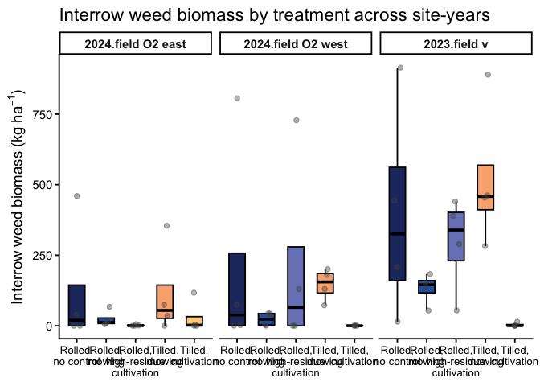<!-- -->

``` r
# 3) Boxplot: 2023 – Field V only --------------------------------------
weed_biomass_field_v_2023 |>
  ggplot(aes(x = weed_trt, y = interrow_weed_biomass_kg_ha, fill = weed_trt)) +
  geom_boxplot(
    outlier.shape = NA,
    width  = 0.55,
    color  = "black"
  ) +
  geom_jitter(
    width  = 0.12,
    height = 0,
    alpha  = 0.4,
    size   = 1.8,
    color  = "grey30"
  ) +
  scale_fill_manual(values = fill_cols, guide = "none") +
  scale_x_discrete(labels = label_break_comma_cult) +
  scale_y_continuous(labels = scales::label_comma()) +
  labs(
    x     = NULL,
    y     = expression(Interrow~weed~biomass~"(kg"~ha^{-1}*")"),
    title = "Interrow weed biomass by treatment, 2023 – Field V"
  ) +
  theme_classic(base_size = 14) +
  theme(
    axis.text.x = element_text(size = 10)
  )
```

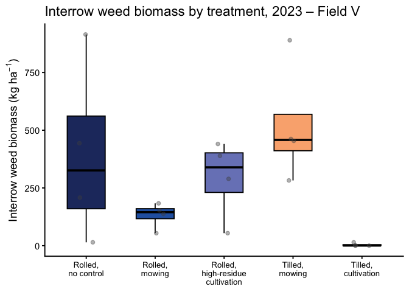<!-- -->

## Selection

### Total weed biomass

#### Pooled

``` r
### Model testing / selection for weed biomass (kg ha⁻¹)

options(contrasts = c("contr.sum", "contr.poly"))

# Base fixed/random structure used for family selection: full interaction
form_all <- weed_biomass_kg_ha ~ weed_trt * site_year + (1 | site_year:block)

## 1) Candidate families / structures (all with interaction) -------------

m_all_tw <- glmmTMB(
  formula = form_all,
  family  = tweedie(link = "log"),
  data    = weed_biomass_clean
)

m_all_nb <- glmmTMB(
  formula = form_all,
  family  = nbinom2(link = "log"),
  data    = weed_biomass_clean
)

m_all_tw_zi <- glmmTMB(
  formula   = form_all,
  family    = tweedie(link = "log"),
  ziformula = ~ 1,
  data      = weed_biomass_clean
)

m_all_tw_disp <- glmmTMB(
  formula     = form_all,
  family      = tweedie(link = "log"),
  ziformula   = ~ 1,
  dispformula = ~ site_year,
  data        = weed_biomass_clean
)

# Safe AIC helper --------------------------------------------------------
safe_aic <- function(mod) {
  out <- try(AIC(mod), silent = TRUE)
  if (inherits(out, "try-error")) return(NA_real_)
  out
}

aic_all <- tibble(
  model = c(
    "ALL: Tweedie",
    "ALL: NB2",
    "ALL: Tweedie + ZI",
    "ALL: Tweedie + ZI + disp(site_year)"
  ),
  AIC = c(
    safe_aic(m_all_tw),
    safe_aic(m_all_nb),
    safe_aic(m_all_tw_zi),
    safe_aic(m_all_tw_disp)
  )
)

kable(
  aic_all,
  digits  = 1,
  caption = "Pooled (all site-years) weed biomass (kg ha⁻¹): candidate distributional families"
) |>
  kable_styling(full_width = FALSE, bootstrap_options = c("striped", "hover"))
```

<table class="table table-striped table-hover" style="color: black; width: auto !important; margin-left: auto; margin-right: auto;">

<caption>

Pooled (all site-years) weed biomass (kg ha⁻¹): candidate distributional
families
</caption>

<thead>

<tr>

<th style="text-align:left;">

model
</th>

<th style="text-align:right;">

AIC
</th>

</tr>

</thead>

<tbody>

<tr>

<td style="text-align:left;">

ALL: Tweedie
</td>

<td style="text-align:right;">

718.1
</td>

</tr>

<tr>

<td style="text-align:left;">

ALL: NB2
</td>

<td style="text-align:right;">

723.5
</td>

</tr>

<tr>

<td style="text-align:left;">

ALL: Tweedie + ZI
</td>

<td style="text-align:right;">

719.2
</td>

</tr>

<tr>

<td style="text-align:left;">

ALL: Tweedie + ZI + disp(site_year)
</td>

<td style="text-align:right;">

707.9
</td>

</tr>

</tbody>

</table>

``` r
## 2) Choose best family (NA-safe, require > 2 AIC units better) --------

best_all   <- m_all_tw
best_all_n <- "ALL: Tweedie"
best_aic   <- safe_aic(m_all_tw)

cands <- list(
  "ALL: NB2"                          = m_all_nb,
  "ALL: Tweedie + ZI"                 = m_all_tw_zi,
  "ALL: Tweedie + ZI + disp(site_year)" = m_all_tw_disp
)

for (nm in names(cands)) {
  this_aic <- safe_aic(cands[[nm]])
  if (is.finite(this_aic) && (this_aic + 2 < best_aic)) {
    best_all   <- cands[[nm]]
    best_all_n <- nm
    best_aic   <- this_aic
  }
}

cat("Selected family/structure for weed biomass (all site-years):", best_all_n, "\n")
```

    ## Selected family/structure for weed biomass (all site-years): ALL: Tweedie + ZI + disp(site_year)

``` r
## 3) Within chosen family: additive vs interaction ----------------------

# Interaction model in chosen family
wbm_int <- best_all

# Additive model: same family/ZI/dispersion, simpler fixed effects
wbm_add <- update(
  best_all,
  . ~ weed_trt + site_year + (1 | site_year:block)
)

# AIC comparison
aic_wbm <- tibble(
  model = c(
    "Additive: weed_trt + site_year",
    "Interaction: weed_trt * site_year"
  ),
  AIC = c(AIC(wbm_add), AIC(wbm_int))
)

# Likelihood-ratio test for interaction term
lrt_wbm   <- anova(wbm_add, wbm_int)
p_int_wbm <- lrt_wbm$`Pr(>Chisq)`[2]

# Apply your rule: choose simpler additive model unless interaction is clearly needed
chosen_model_name_wbm <- if (p_int_wbm < 0.05) {
  "Interaction: weed_trt * site_year"
} else {
  "Additive: weed_trt + site_year"
}

# Add ΔAIC and Selected flag
aic_wbm_out <- aic_wbm |>
  mutate(
    deltaAIC = AIC - min(AIC),
    Selected = if_else(model == chosen_model_name_wbm, "Yes", "")
  )

kable(
  aic_wbm_out,
  digits  = 2,
  caption = "Weed biomass (kg ha⁻¹): additive vs interaction (within chosen family)"
) |>
  kable_styling(full_width = FALSE, bootstrap_options = c("striped", "hover"))
```

<table class="table table-striped table-hover" style="color: black; width: auto !important; margin-left: auto; margin-right: auto;">

<caption>

Weed biomass (kg ha⁻¹): additive vs interaction (within chosen family)
</caption>

<thead>

<tr>

<th style="text-align:left;">

model
</th>

<th style="text-align:right;">

AIC
</th>

<th style="text-align:right;">

deltaAIC
</th>

<th style="text-align:left;">

Selected
</th>

</tr>

</thead>

<tbody>

<tr>

<td style="text-align:left;">

Additive: weed_trt + site_year
</td>

<td style="text-align:right;">

707.16
</td>

<td style="text-align:right;">

0.00
</td>

<td style="text-align:left;">

Yes
</td>

</tr>

<tr>

<td style="text-align:left;">

Interaction: weed_trt \* site_year
</td>

<td style="text-align:right;">

707.90
</td>

<td style="text-align:right;">

0.74
</td>

<td style="text-align:left;">

</td>

</tr>

</tbody>

</table>

``` r
# Final model used downstream
weed_glmm <- if (p_int_wbm < 0.05) wbm_int else wbm_add

cat(
  "\nSelected model for weed biomass (used in all downstream emmeans/plots):\n  ",
  chosen_model_name_wbm,
  sprintf("  [LRT p = %.3f]\n", p_int_wbm)
)
```

    ## 
    ## Selected model for weed biomass (used in all downstream emmeans/plots):
    ##    Additive: weed_trt + site_year   [LRT p = 0.054]

``` r
## 4) Diagnostics + Type-III tests for the chosen model ------------------

set.seed(123)
res_wbm <- DHARMa::simulateResiduals(weed_glmm)
plot(res_wbm)
```

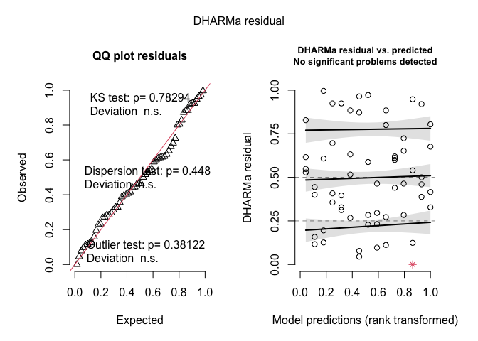<!-- -->

``` r
DHARMa::testDispersion(weed_glmm)
```

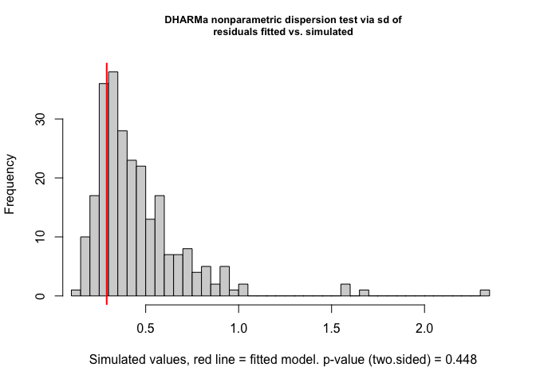<!-- -->

    ## 
    ##  DHARMa nonparametric dispersion test via sd of residuals fitted vs.
    ##  simulated
    ## 
    ## data:  simulationOutput
    ## dispersion = 0.63786, p-value = 0.448
    ## alternative hypothesis: two.sided

``` r
DHARMa::testZeroInflation(weed_glmm)
```

<!-- -->

    ## 
    ##  DHARMa zero-inflation test via comparison to expected zeros with
    ##  simulation under H0 = fitted model
    ## 
    ## data:  simulationOutput
    ## ratioObsSim = 0.89423, p-value = 0.904
    ## alternative hypothesis: two.sided

``` r
car::Anova(weed_glmm, type = 3)
```

    ## Analysis of Deviance Table (Type III Wald chisquare tests)
    ## 
    ## Response: weed_biomass_kg_ha
    ##               Chisq Df Pr(>Chisq)    
    ## (Intercept) 855.354  1  < 2.2e-16 ***
    ## weed_trt     24.923  4  5.213e-05 ***
    ## site_year    36.546  2  1.159e-08 ***
    ## ---
    ## Signif. codes:  0 '***' 0.001 '**' 0.01 '*' 0.05 '.' 0.1 ' ' 1

##### Post-hoc summary table

``` r
### Total weed biomass (kg ha⁻¹) with Fisher's LSD CLDs

# Estimated marginal means for weed_trt on the response scale (kg/ha)
emm_wbm <- emmeans(
  weed_glmm,
  ~ weed_trt,
  type = "response"   # back-transform from log link
)

# Tidy emmeans for reporting (rename columns to match other RMDs)
emm_wbm_df <- as_tibble(emm_wbm) |>
  mutate(
    weed_trt = factor(weed_trt, levels = mow_levels)
  ) |>
  rename(
    emmean = response,     # mean on response scale
    ci_low = asymp.LCL,    # lower CI
    ci_high = asymp.UCL    # upper CI
  )

# Compact letter display (Fisher's LSD, no adjustment; "a" = highest)
cld_wbm <- cld(
  emm_wbm,
  adjust   = "none",
  Letters  = letters,
  sort     = TRUE,
  reversed = TRUE   # so "a" = highest biomass group(s)
) |>
  as_tibble() |>
  mutate(
    weed_trt = factor(weed_trt, levels = mow_levels),
    .group   = str_trim(.group)
  ) |>
  select(weed_trt, .group)

# Join emmeans + CLDs and format for reporting
emm_wbm_df |>
  left_join(cld_wbm, by = "weed_trt") |>
  select(weed_trt, emmean, SE, ci_low, ci_high, .group) |>
  mutate(
    across(c(emmean, SE, ci_low, ci_high), ~ round(.x, 1))
  ) |>
  kable(
    caption   = "Estimated total weed biomass (kg ha⁻¹) with 95% CI and Fisher's LSD group letters",
    col.names = c("Treatment", "Mean", "SE", "Lower CI", "Upper CI", "Group")
  ) |>
  kable_styling(full_width = FALSE, bootstrap_options = c("striped", "hover"))
```

<table class="table table-striped table-hover" style="color: black; width: auto !important; margin-left: auto; margin-right: auto;">

<caption>

Estimated total weed biomass (kg ha⁻¹) with 95% CI and Fisher’s LSD
group letters
</caption>

<thead>

<tr>

<th style="text-align:left;">

Treatment
</th>

<th style="text-align:right;">

Mean
</th>

<th style="text-align:right;">

SE
</th>

<th style="text-align:right;">

Lower CI
</th>

<th style="text-align:right;">

Upper CI
</th>

<th style="text-align:left;">

Group
</th>

</tr>

</thead>

<tbody>

<tr>

<td style="text-align:left;">

Rolled, no control
</td>

<td style="text-align:right;">

164.0
</td>

<td style="text-align:right;">

42.6
</td>

<td style="text-align:right;">

98.6
</td>

<td style="text-align:right;">

272.9
</td>

<td style="text-align:left;">

bc
</td>

</tr>

<tr>

<td style="text-align:left;">

Rolled, mowing
</td>

<td style="text-align:right;">

85.0
</td>

<td style="text-align:right;">

24.3
</td>

<td style="text-align:right;">

48.5
</td>

<td style="text-align:right;">

149.0
</td>

<td style="text-align:left;">

c
</td>

</tr>

<tr>

<td style="text-align:left;">

Rolled, high-residue cultivation
</td>

<td style="text-align:right;">

153.8
</td>

<td style="text-align:right;">

42.3
</td>

<td style="text-align:right;">

89.7
</td>

<td style="text-align:right;">

263.7
</td>

<td style="text-align:left;">

bc
</td>

</tr>

<tr>

<td style="text-align:left;">

Tilled, mowing
</td>

<td style="text-align:right;">

378.3
</td>

<td style="text-align:right;">

98.1
</td>

<td style="text-align:right;">

227.6
</td>

<td style="text-align:right;">

628.8
</td>

<td style="text-align:left;">

a
</td>

</tr>

<tr>

<td style="text-align:left;">

Tilled, cultivation
</td>

<td style="text-align:right;">

261.9
</td>

<td style="text-align:right;">

71.5
</td>

<td style="text-align:right;">

153.5
</td>

<td style="text-align:right;">

447.1
</td>

<td style="text-align:left;">

ab
</td>

</tr>

</tbody>

</table>

##### ANOVA-style summary tables

``` r
## 1) P-value summary (Location, Treatment, Interaction) -----------------

# Type-III tests for the selected GLMM
anova_wbm <- Anova(weed_glmm, type = 3)

anova_wbm_df <- anova_wbm |>
  as.data.frame() |>
  tibble::rownames_to_column("Effect")

# Extract Wald p-values from the selected model
p_site <- anova_wbm_df$`Pr(>Chisq)`[anova_wbm_df$Effect == "site_year"]
p_trt  <- anova_wbm_df$`Pr(>Chisq)`[anova_wbm_df$Effect == "weed_trt"]
p_int  <- anova_wbm_df$`Pr(>Chisq)`[anova_wbm_df$Effect == "weed_trt:site_year"]

# Always include Location and Treatment rows
pvals_wbm <- tibble(
  Effect = c(
    "Location (site_year)",
    "Treatment (weed_trt)"
  ),
  p_raw = c(p_site, p_trt)
)

# Only include the interaction row if the interaction model was selected
if (chosen_model_name_wbm == "Interaction: weed_trt * site_year") {
  pvals_wbm <- bind_rows(
    pvals_wbm,
    tibble(
      Effect = "Location × Treatment",
      p_raw  = p_int
    )
  )
}

pvals_wbm <- pvals_wbm |>
  mutate(
    `P-value` = case_when(
      p_raw < 0.001 ~ "<0.001",
      p_raw < 0.01  ~ "<0.01",
      TRUE          ~ sprintf("%.3f", p_raw)
    )
  ) |>
  select(Effect, `P-value`)

pvals_wbm |>
  kable(
    caption   = "Weed biomass (kg ha⁻¹): P-values for location and treatment (and interaction if included in the selected model)",
    col.names = c("Effect", "P-value")
  ) |>
  kable_styling(full_width = FALSE, bootstrap_options = c("striped", "hover"))
```

<table class="table table-striped table-hover" style="color: black; width: auto !important; margin-left: auto; margin-right: auto;">

<caption>

Weed biomass (kg ha⁻¹): P-values for location and treatment (and
interaction if included in the selected model)
</caption>

<thead>

<tr>

<th style="text-align:left;">

Effect
</th>

<th style="text-align:left;">

P-value
</th>

</tr>

</thead>

<tbody>

<tr>

<td style="text-align:left;">

Location (site_year)
</td>

<td style="text-align:left;">

\<0.001
</td>

</tr>

<tr>

<td style="text-align:left;">

Treatment (weed_trt)
</td>

<td style="text-align:left;">

\<0.001
</td>

</tr>

</tbody>

</table>

``` r
## 1b) Likelihood-ratio test: additive vs interaction -------------------

# LRT table for model structure (additive vs interaction)
lrt_table_wbm <- tibble(
  Test    = "LRT (additive vs interaction)",
  p_raw   = lrt_wbm$`Pr(>Chisq)`[2]
) |>
  mutate(
    `P-value` = case_when(
      p_raw < 0.001 ~ "<0.001",
      p_raw < 0.01  ~ "<0.01",
      TRUE          ~ sprintf("%.3f", p_raw)
    )
  ) |>
  select(Test, `P-value`)

lrt_table_wbm |>
  kable(
    caption   = "Weed biomass (kg ha⁻¹): Likelihood-ratio test comparing additive vs interaction models",
    col.names = c("Test", "P-value")
  ) |>
  kable_styling(full_width = FALSE, bootstrap_options = c("striped", "hover"))
```

<table class="table table-striped table-hover" style="color: black; width: auto !important; margin-left: auto; margin-right: auto;">

<caption>

Weed biomass (kg ha⁻¹): Likelihood-ratio test comparing additive vs
interaction models
</caption>

<thead>

<tr>

<th style="text-align:left;">

Test
</th>

<th style="text-align:left;">

P-value
</th>

</tr>

</thead>

<tbody>

<tr>

<td style="text-align:left;">

LRT (additive vs interaction)
</td>

<td style="text-align:left;">

0.054
</td>

</tr>

</tbody>

</table>

``` r
## 2) Location block: site-year means (model + raw) ----------------------

# Model-based emmeans by site_year on the response scale
emm_loc_wbm <- emmeans(
  weed_glmm,
  ~ site_year,
  type = "response"
)

emm_loc_wbm_df <- as_tibble(emm_loc_wbm) |>
  mutate(
    site_year  = as.factor(site_year),
    model_mean = response   # back-transformed mean (kg/ha)
  ) |>
  select(site_year, model_mean)

# CLDs for site_year (a = highest)
cld_loc_wbm <- cld(
  emm_loc_wbm,
  adjust   = "none",
  Letters  = letters,
  sort     = TRUE,
  reversed = TRUE
) |>
  as_tibble() |>
  mutate(
    site_year = as.factor(site_year),
    loc_CLD   = str_trim(.group)
  ) |>
  select(site_year, loc_CLD)

# Raw means by site_year
raw_loc_wbm <- weed_biomass_clean |>
  group_by(site_year) |>
  summarise(
    raw_mean = mean(weed_biomass_kg_ha, na.rm = TRUE),
    .groups  = "drop"
  ) |>
  mutate(site_year = as.factor(site_year))

loc_summary_wbm <- emm_loc_wbm_df |>
  left_join(cld_loc_wbm, by = "site_year") |>
  left_join(raw_loc_wbm, by = "site_year") |>
  mutate(
    model_mean = round(model_mean, 1),
    raw_mean   = round(raw_mean, 1),
    raw_CLD    = loc_CLD
  ) |>
  arrange(site_year)

loc_summary_wbm |>
  kable(
    caption   = "Weed biomass (kg ha⁻¹): location (site-year) means with CLDs",
    col.names = c("Site-year", "Model mean", "Model CLD", "Raw mean", "Raw CLD")
  ) |>
  kable_styling(full_width = FALSE, bootstrap_options = c("striped", "hover"))
```

<table class="table table-striped table-hover" style="color: black; width: auto !important; margin-left: auto; margin-right: auto;">

<caption>

Weed biomass (kg ha⁻¹): location (site-year) means with CLDs
</caption>

<thead>

<tr>

<th style="text-align:left;">

Site-year
</th>

<th style="text-align:right;">

Model mean
</th>

<th style="text-align:left;">

Model CLD
</th>

<th style="text-align:right;">

Raw mean
</th>

<th style="text-align:left;">

Raw CLD
</th>

</tr>

</thead>

<tbody>

<tr>

<td style="text-align:left;">

2024.field O2 east
</td>

<td style="text-align:right;">

65.7
</td>

<td style="text-align:left;">

b
</td>

<td style="text-align:right;">

75.6
</td>

<td style="text-align:left;">

b
</td>

</tr>

<tr>

<td style="text-align:left;">

2024.field O2 west
</td>

<td style="text-align:right;">

171.8
</td>

<td style="text-align:left;">

b
</td>

<td style="text-align:right;">

162.9
</td>

<td style="text-align:left;">

b
</td>

</tr>

<tr>

<td style="text-align:left;">

2023.field v
</td>

<td style="text-align:right;">

554.4
</td>

<td style="text-align:left;">

a
</td>

<td style="text-align:right;">

635.7
</td>

<td style="text-align:left;">

a
</td>

</tr>

</tbody>

</table>

``` r
## 3) Treatment block: means (model + raw) -------------------------------

# emmeans for treatment on the response scale
emm_wbm <- emmeans(
  weed_glmm,
  ~ weed_trt,
  type = "response"
)

emm_trt_wbm_df <- as_tibble(emm_wbm) |>
  mutate(
    weed_trt   = factor(weed_trt, levels = mow_levels),
    model_mean = response   # kg/ha
  ) |>
  select(weed_trt, model_mean)

# CLDs for treatment (a = highest)
cld_wbm <- cld(
  emm_wbm,
  adjust   = "none",
  Letters  = letters,
  sort     = TRUE,
  reversed = TRUE
) |>
  as_tibble() |>
  mutate(
    weed_trt = factor(weed_trt, levels = mow_levels),
    trt_CLD  = str_trim(.group)
  ) |>
  select(weed_trt, trt_CLD)

# Raw means by treatment
raw_trt_wbm <- weed_biomass_clean |>
  group_by(weed_trt) |>
  summarise(
    raw_mean = mean(weed_biomass_kg_ha, na.rm = TRUE),
    .groups  = "drop"
  ) |>
  mutate(weed_trt = factor(weed_trt, levels = mow_levels))

trt_summary_wbm <- emm_trt_wbm_df |>
  left_join(cld_wbm, by = "weed_trt") |>
  left_join(raw_trt_wbm, by = "weed_trt") |>
  mutate(
    model_mean = round(model_mean, 1),
    raw_mean   = round(raw_mean, 1),
    raw_CLD    = trt_CLD
  ) |>
  arrange(weed_trt)

trt_summary_wbm |>
  kable(
    caption   = "Weed biomass (kg ha⁻¹): treatment means with CLDs",
    col.names = c("Treatment", "Model mean", "Model CLD", "Raw mean", "Raw CLD")
  ) |>
  kable_styling(full_width = FALSE, bootstrap_options = c("striped", "hover"))
```

<table class="table table-striped table-hover" style="color: black; width: auto !important; margin-left: auto; margin-right: auto;">

<caption>

Weed biomass (kg ha⁻¹): treatment means with CLDs
</caption>

<thead>

<tr>

<th style="text-align:left;">

Treatment
</th>

<th style="text-align:right;">

Model mean
</th>

<th style="text-align:left;">

Model CLD
</th>

<th style="text-align:right;">

Raw mean
</th>

<th style="text-align:left;">

Raw CLD
</th>

</tr>

</thead>

<tbody>

<tr>

<td style="text-align:left;">

Rolled, no control
</td>

<td style="text-align:right;">

164.0
</td>

<td style="text-align:left;">

bc
</td>

<td style="text-align:right;">

263.8
</td>

<td style="text-align:left;">

bc
</td>

</tr>

<tr>

<td style="text-align:left;">

Rolled, mowing
</td>

<td style="text-align:right;">

85.0
</td>

<td style="text-align:left;">

c
</td>

<td style="text-align:right;">

123.2
</td>

<td style="text-align:left;">

c
</td>

</tr>

<tr>

<td style="text-align:left;">

Rolled, high-residue cultivation
</td>

<td style="text-align:right;">

153.8
</td>

<td style="text-align:left;">

bc
</td>

<td style="text-align:right;">

246.0
</td>

<td style="text-align:left;">

bc
</td>

</tr>

<tr>

<td style="text-align:left;">

Tilled, mowing
</td>

<td style="text-align:right;">

378.3
</td>

<td style="text-align:left;">

a
</td>

<td style="text-align:right;">

504.1
</td>

<td style="text-align:left;">

a
</td>

</tr>

<tr>

<td style="text-align:left;">

Tilled, cultivation
</td>

<td style="text-align:right;">

261.9
</td>

<td style="text-align:left;">

ab
</td>

<td style="text-align:right;">

319.9
</td>

<td style="text-align:left;">

ab
</td>

</tr>

</tbody>

</table>

``` r
## 4) Interaction block: site-year × treatment means ---------------------

# Model emmeans by treatment within site_year on the response scale
emm_sy_wbm <- emmeans(
  weed_glmm,
  ~ weed_trt | site_year,
  type = "response"
)

emm_sy_wbm_df <- as_tibble(emm_sy_wbm) |>
  mutate(
    weed_trt   = factor(weed_trt, levels = mow_levels),
    site_year  = as.factor(site_year),
    model_mean = response   # kg/ha
  ) |>
  select(site_year, weed_trt, model_mean)

# CLDs within each site_year (a = highest within that site_year)
cld_sy_wbm <- cld(
  emm_sy_wbm,
  adjust   = "none",
  Letters  = letters,
  sort     = TRUE,
  reversed = TRUE
) |>
  as_tibble() |>
  mutate(
    weed_trt  = factor(weed_trt, levels = mow_levels),
    site_year = as.factor(site_year),
    int_CLD   = str_trim(.group)
  ) |>
  select(site_year, weed_trt, int_CLD)

# Raw means by site_year × treatment
raw_sy_wbm <- weed_biomass_clean |>
  group_by(site_year, weed_trt) |>
  summarise(
    raw_mean = mean(weed_biomass_kg_ha, na.rm = TRUE),
    .groups  = "drop"
  ) |>
  mutate(
    site_year = as.factor(site_year),
    weed_trt  = factor(weed_trt, levels = mow_levels)
  )

int_summary_wbm <- emm_sy_wbm_df |>
  left_join(cld_sy_wbm, by = c("site_year", "weed_trt")) |>
  left_join(raw_sy_wbm, by = c("site_year", "weed_trt")) |>
  mutate(
    model_mean = round(model_mean, 1),
    raw_mean   = round(raw_mean, 1),
    raw_CLD    = int_CLD
  ) |>
  arrange(site_year, weed_trt)

int_summary_wbm |>
  kable(
    caption   = "Weed biomass (kg ha⁻¹): site-year × treatment means with CLDs",
    col.names = c(
      "Site-year", "Treatment",
      "Model mean", "Model CLD",
      "Raw mean",   "Raw CLD"
    )
  ) |>
  kable_styling(full_width = FALSE, bootstrap_options = c("striped", "hover"))
```

<table class="table table-striped table-hover" style="color: black; width: auto !important; margin-left: auto; margin-right: auto;">

<caption>

Weed biomass (kg ha⁻¹): site-year × treatment means with CLDs
</caption>

<thead>

<tr>

<th style="text-align:left;">

Site-year
</th>

<th style="text-align:left;">

Treatment
</th>

<th style="text-align:right;">

Model mean
</th>

<th style="text-align:left;">

Model CLD
</th>

<th style="text-align:right;">

Raw mean
</th>

<th style="text-align:left;">

Raw CLD
</th>

</tr>

</thead>

<tbody>

<tr>

<td style="text-align:left;">

2024.field O2 east
</td>

<td style="text-align:left;">

Rolled, no control
</td>

<td style="text-align:right;">

58.5
</td>

<td style="text-align:left;">

bc
</td>

<td style="text-align:right;">

124.8
</td>

<td style="text-align:left;">

bc
</td>

</tr>

<tr>

<td style="text-align:left;">

2024.field O2 east
</td>

<td style="text-align:left;">

Rolled, mowing
</td>

<td style="text-align:right;">

30.3
</td>

<td style="text-align:left;">

c
</td>

<td style="text-align:right;">

24.2
</td>

<td style="text-align:left;">

c
</td>

</tr>

<tr>

<td style="text-align:left;">

2024.field O2 east
</td>

<td style="text-align:left;">

Rolled, high-residue cultivation
</td>

<td style="text-align:right;">

54.8
</td>

<td style="text-align:left;">

bc
</td>

<td style="text-align:right;">

2.3
</td>

<td style="text-align:left;">

bc
</td>

</tr>

<tr>

<td style="text-align:left;">

2024.field O2 east
</td>

<td style="text-align:left;">

Tilled, mowing
</td>

<td style="text-align:right;">

134.9
</td>

<td style="text-align:left;">

a
</td>

<td style="text-align:right;">

132.9
</td>

<td style="text-align:left;">

a
</td>

</tr>

<tr>

<td style="text-align:left;">

2024.field O2 east
</td>

<td style="text-align:left;">

Tilled, cultivation
</td>

<td style="text-align:right;">

93.4
</td>

<td style="text-align:left;">

ab
</td>

<td style="text-align:right;">

93.7
</td>

<td style="text-align:left;">

ab
</td>

</tr>

<tr>

<td style="text-align:left;">

2024.field O2 west
</td>

<td style="text-align:left;">

Rolled, no control
</td>

<td style="text-align:right;">

152.9
</td>

<td style="text-align:left;">

bc
</td>

<td style="text-align:right;">

247.2
</td>

<td style="text-align:left;">

bc
</td>

</tr>

<tr>

<td style="text-align:left;">

2024.field O2 west
</td>

<td style="text-align:left;">

Rolled, mowing
</td>

<td style="text-align:right;">

79.3
</td>

<td style="text-align:left;">

c
</td>

<td style="text-align:right;">

87.8
</td>

<td style="text-align:left;">

c
</td>

</tr>

<tr>

<td style="text-align:left;">

2024.field O2 west
</td>

<td style="text-align:left;">

Rolled, high-residue cultivation
</td>

<td style="text-align:right;">

143.4
</td>

<td style="text-align:left;">

bc
</td>

<td style="text-align:right;">

272.2
</td>

<td style="text-align:left;">

bc
</td>

</tr>

<tr>

<td style="text-align:left;">

2024.field O2 west
</td>

<td style="text-align:left;">

Tilled, mowing
</td>

<td style="text-align:right;">

352.7
</td>

<td style="text-align:left;">

a
</td>

<td style="text-align:right;">

195.0
</td>

<td style="text-align:left;">

a
</td>

</tr>

<tr>

<td style="text-align:left;">

2024.field O2 west
</td>

<td style="text-align:left;">

Tilled, cultivation
</td>

<td style="text-align:right;">

244.2
</td>

<td style="text-align:left;">

ab
</td>

<td style="text-align:right;">

12.2
</td>

<td style="text-align:left;">

ab
</td>

</tr>

<tr>

<td style="text-align:left;">

2023.field v
</td>

<td style="text-align:left;">

Rolled, no control
</td>

<td style="text-align:right;">

493.4
</td>

<td style="text-align:left;">

bc
</td>

<td style="text-align:right;">

419.5
</td>

<td style="text-align:left;">

bc
</td>

</tr>

<tr>

<td style="text-align:left;">

2023.field v
</td>

<td style="text-align:left;">

Rolled, mowing
</td>

<td style="text-align:right;">

255.8
</td>

<td style="text-align:left;">

c
</td>

<td style="text-align:right;">

257.8
</td>

<td style="text-align:left;">

c
</td>

</tr>

<tr>

<td style="text-align:left;">

2023.field v
</td>

<td style="text-align:left;">

Rolled, high-residue cultivation
</td>

<td style="text-align:right;">

462.7
</td>

<td style="text-align:left;">

bc
</td>

<td style="text-align:right;">

463.4
</td>

<td style="text-align:left;">

bc
</td>

</tr>

<tr>

<td style="text-align:left;">

2023.field v
</td>

<td style="text-align:left;">

Tilled, mowing
</td>

<td style="text-align:right;">

1138.0
</td>

<td style="text-align:left;">

a
</td>

<td style="text-align:right;">

1184.3
</td>

<td style="text-align:left;">

a
</td>

</tr>

<tr>

<td style="text-align:left;">

2023.field v
</td>

<td style="text-align:left;">

Tilled, cultivation
</td>

<td style="text-align:right;">

788.0
</td>

<td style="text-align:left;">

ab
</td>

<td style="text-align:right;">

853.7
</td>

<td style="text-align:left;">

ab
</td>

</tr>

</tbody>

</table>

#### 2023 only

``` r
### Model testing / selection for weed biomass (kg ha⁻¹), 2023 Field V only

options(contrasts = c("contr.sum", "contr.poly"))

# Simpler structure: single site-year (no site_year term)
form_v23 <- weed_biomass_kg_ha ~ weed_trt + (1 | block)

# 1) Fit candidate models -----------------------------------------------

m_v23_tw <- weed_biomass_field_v_2023 |>
  (\(d) glmmTMB(
    formula = form_v23,
    family  = tweedie(link = "log"),
    data    = d
  ))()

m_v23_nb <- weed_biomass_field_v_2023 |>
  (\(d) glmmTMB(
    formula = form_v23,
    family  = nbinom2(link = "log"),
    data    = d
  ))()

m_v23_tw_zi <- weed_biomass_field_v_2023 |>
  (\(d) glmmTMB(
    formula   = form_v23,
    family    = tweedie(link = "log"),
    ziformula = ~ 1,
    data      = d
  ))()

# 2) Safe AIC helper (reuse if already defined earlier) -----------------
if (!exists("safe_aic")) {
  safe_aic <- function(mod) {
    out <- try(AIC(mod), silent = TRUE)
    if (inherits(out, "try-error")) return(NA_real_)
    out
  }
}

# 3) AIC table ----------------------------------------------------------

aic_v23 <- tibble::tibble(
  model = c(
    "V23: Tweedie",
    "V23: NB2",
    "V23: Tweedie + ZI"
  ),
  AIC = c(
    safe_aic(m_v23_tw),
    safe_aic(m_v23_nb),
    safe_aic(m_v23_tw_zi)
  )
)

# 4) Select best model with ΔAIC > 2 rule -------------------------------

best_v23      <- m_v23_tw
best_v23_name <- "V23: Tweedie"
best_v23_aic  <- safe_aic(m_v23_tw)

cands_v23 <- list(
  "V23: NB2"          = m_v23_nb,
  "V23: Tweedie + ZI" = m_v23_tw_zi
)

for (nm in names(cands_v23)) {
  this_aic <- safe_aic(cands_v23[[nm]])
  if (is.finite(this_aic) && (this_aic + 2 < best_v23_aic)) {
    best_v23      <- cands_v23[[nm]]
    best_v23_name <- nm
    best_v23_aic  <- this_aic
  }
}

aic_v23_out <- aic_v23 |>
  mutate(
    deltaAIC = AIC - min(AIC, na.rm = TRUE),
    Selected = if_else(model == best_v23_name, "Yes", "")
  )

kable(
  aic_v23_out,
  digits  = 2,
  caption = "Weed biomass (kg ha⁻¹), 2023 Field V: model comparison (Tweedie vs NB2 vs Tweedie + ZI)"
) |>
  kable_styling(full_width = FALSE, bootstrap_options = c("striped", "hover"))
```

<table class="table table-striped table-hover" style="color: black; width: auto !important; margin-left: auto; margin-right: auto;">

<caption>

Weed biomass (kg ha⁻¹), 2023 Field V: model comparison (Tweedie vs NB2
vs Tweedie + ZI)
</caption>

<thead>

<tr>

<th style="text-align:left;">

model
</th>

<th style="text-align:right;">

AIC
</th>

<th style="text-align:right;">

deltaAIC
</th>

<th style="text-align:left;">

Selected
</th>

</tr>

</thead>

<tbody>

<tr>

<td style="text-align:left;">

V23: Tweedie
</td>

<td style="text-align:right;">

289.09
</td>

<td style="text-align:right;">

0.00
</td>

<td style="text-align:left;">

Yes
</td>

</tr>

<tr>

<td style="text-align:left;">

V23: NB2
</td>

<td style="text-align:right;">

292.65
</td>

<td style="text-align:right;">

3.56
</td>

<td style="text-align:left;">

</td>

</tr>

<tr>

<td style="text-align:left;">

V23: Tweedie + ZI
</td>

<td style="text-align:right;">

291.09
</td>

<td style="text-align:right;">

2.00
</td>

<td style="text-align:left;">

</td>

</tr>

</tbody>

</table>

``` r
cat(
  "\nSelected model for 2023 Field V weed biomass (used in downstream emmeans/plots):\n  ",
  best_v23_name,
  sprintf("  [AIC = %.2f]\n", best_v23_aic)
)
```

    ## 
    ## Selected model for 2023 Field V weed biomass (used in downstream emmeans/plots):
    ##    V23: Tweedie   [AIC = 289.09]

``` r
# Save final model to a clear object for downstream use -----------------
weed_glmm_v23 <- best_v23

# 5) Diagnostics for the selected Field V model -------------------------
set.seed(123)
res_v23 <- DHARMa::simulateResiduals(weed_glmm_v23)
plot(res_v23)
```

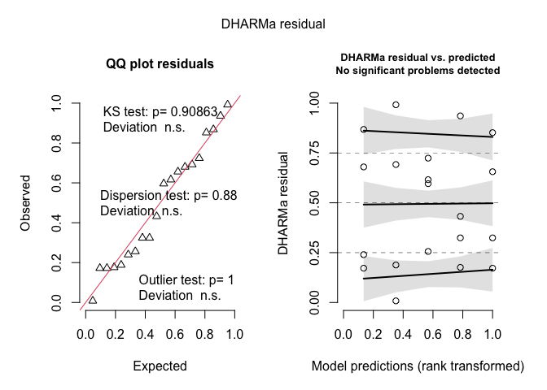<!-- -->

``` r
DHARMa::testDispersion(weed_glmm_v23)
```

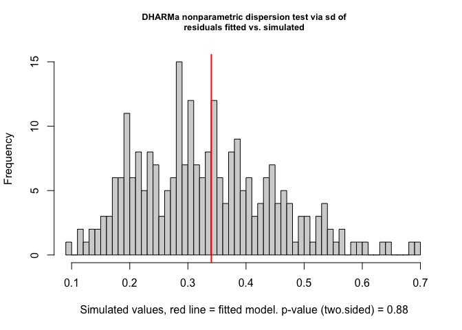<!-- -->

    ## 
    ##  DHARMa nonparametric dispersion test via sd of residuals fitted vs.
    ##  simulated
    ## 
    ## data:  simulationOutput
    ## dispersion = 1.0276, p-value = 0.88
    ## alternative hypothesis: two.sided

``` r
DHARMa::testZeroInflation(weed_glmm_v23)
```

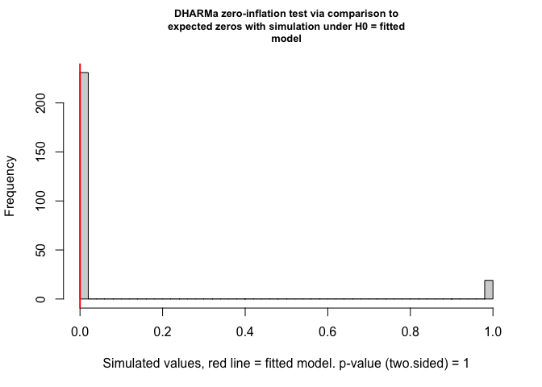<!-- -->

    ## 
    ##  DHARMa zero-inflation test via comparison to expected zeros with
    ##  simulation under H0 = fitted model
    ## 
    ## data:  simulationOutput
    ## ratioObsSim = 0, p-value = 1
    ## alternative hypothesis: two.sided

``` r
car::Anova(weed_glmm_v23, type = 3)
```

    ## Analysis of Deviance Table (Type III Wald chisquare tests)
    ## 
    ## Response: weed_biomass_kg_ha
    ##                Chisq Df Pr(>Chisq)    
    ## (Intercept) 4532.517  1  < 2.2e-16 ***
    ## weed_trt      37.179  4  1.654e-07 ***
    ## ---
    ## Signif. codes:  0 '***' 0.001 '**' 0.01 '*' 0.05 '.' 0.1 ' ' 1

##### Post-hoc summary table

``` r
### Total weed biomass (kg ha⁻¹), 2023 Field V — Fisher's LSD CLDs

# Estimated marginal means for weed_trt on the response scale (kg/ha)
emm_wbm_v23 <- emmeans(
  weed_glmm_v23,
  ~ weed_trt,
  type = "response"   # back-transform from link scale
)

# Tidy emmeans for reporting (rename columns to match other RMDs)
emm_wbm_v23_df <- as_tibble(emm_wbm_v23) |>
  mutate(
    weed_trt = factor(weed_trt, levels = mow_levels)
  ) |>
  rename(
    emmean = response,     # mean on response scale (kg/ha)
    ci_low = asymp.LCL,    # lower CI
    ci_high = asymp.UCL    # upper CI
  )

# Compact letter display (Fisher's LSD, no adjustment; "a" = highest)
cld_wbm_v23 <- cld(
  emm_wbm_v23,
  adjust   = "none",
  Letters  = letters,
  sort     = TRUE,
  reversed = TRUE   # so "a" = highest biomass group(s)
) |>
  as_tibble() |>
  mutate(
    weed_trt = factor(weed_trt, levels = mow_levels),
    .group   = str_trim(.group)
  ) |>
  select(weed_trt, .group)

# Join emmeans + CLDs and format for reporting
emm_wbm_v23_df |>
  left_join(cld_wbm_v23, by = "weed_trt") |>
  select(weed_trt, emmean, SE, ci_low, ci_high, .group) |>
  mutate(
    across(c(emmean, SE, ci_low, ci_high), ~ round(.x, 1))
  ) |>
  kable(
    caption   = "Estimated total weed biomass (kg ha⁻¹) in 2023 Field V with 95% CI and Fisher's LSD group letters",
    col.names = c("Treatment", "Mean", "SE", "Lower CI", "Upper CI", "Group")
  ) |>
  kable_styling(full_width = FALSE, bootstrap_options = c("striped", "hover"))
```

<table class="table table-striped table-hover" style="color: black; width: auto !important; margin-left: auto; margin-right: auto;">

<caption>

Estimated total weed biomass (kg ha⁻¹) in 2023 Field V with 95% CI and
Fisher’s LSD group letters
</caption>

<thead>

<tr>

<th style="text-align:left;">

Treatment
</th>

<th style="text-align:right;">

Mean
</th>

<th style="text-align:right;">

SE
</th>

<th style="text-align:right;">

Lower CI
</th>

<th style="text-align:right;">

Upper CI
</th>

<th style="text-align:left;">

Group
</th>

</tr>

</thead>

<tbody>

<tr>

<td style="text-align:left;">

Rolled, no control
</td>

<td style="text-align:right;">

419.5
</td>

<td style="text-align:right;">

93.9
</td>

<td style="text-align:right;">

270.6
</td>

<td style="text-align:right;">

650.5
</td>

<td style="text-align:left;">

b
</td>

</tr>

<tr>

<td style="text-align:left;">

Rolled, mowing
</td>

<td style="text-align:right;">

257.8
</td>

<td style="text-align:right;">

71.5
</td>

<td style="text-align:right;">

149.6
</td>

<td style="text-align:right;">

444.0
</td>

<td style="text-align:left;">

b
</td>

</tr>

<tr>

<td style="text-align:left;">

Rolled, high-residue cultivation
</td>

<td style="text-align:right;">

463.4
</td>

<td style="text-align:right;">

99.2
</td>

<td style="text-align:right;">

304.5
</td>

<td style="text-align:right;">

705.0
</td>

<td style="text-align:left;">

b
</td>

</tr>

<tr>

<td style="text-align:left;">

Tilled, mowing
</td>

<td style="text-align:right;">

1184.3
</td>

<td style="text-align:right;">

167.6
</td>

<td style="text-align:right;">

897.5
</td>

<td style="text-align:right;">

1562.8
</td>

<td style="text-align:left;">

a
</td>

</tr>

<tr>

<td style="text-align:left;">

Tilled, cultivation
</td>

<td style="text-align:right;">

853.7
</td>

<td style="text-align:right;">

139.6
</td>

<td style="text-align:right;">

619.7
</td>

<td style="text-align:right;">

1176.2
</td>

<td style="text-align:left;">

a
</td>

</tr>

</tbody>

</table>

### In-row weed biomass

#### Pooled

``` r
#### In-row pooled (all site-years): model testing / selection

options(contrasts = c("contr.sum", "contr.poly"))

# Model formula: in-row instead of total (full interaction)
form_all_inrow <- inrow_weed_biomass_kg_ha ~ weed_trt * site_year + (1 | site_year:block)

## 1) Candidate families / structures (all with interaction) ------------

m_all_inrow_tw <- glmmTMB(
  formula = form_all_inrow,
  family  = tweedie(link = "log"),
  data    = weed_biomass_clean
)

m_all_inrow_nb <- glmmTMB(
  formula = form_all_inrow,
  family  = nbinom2(link = "log"),
  data    = weed_biomass_clean
)

m_all_inrow_tw_zi <- glmmTMB(
  formula   = form_all_inrow,
  family    = tweedie(link = "log"),
  ziformula = ~ 1,
  data      = weed_biomass_clean
)

m_all_inrow_tw_disp <- glmmTMB(
  formula     = form_all_inrow,
  family      = tweedie(link = "log"),
  ziformula   = ~ 1,
  dispformula = ~ site_year,
  data        = weed_biomass_clean
)

# NA-safe AIC helper (reuse if already defined) -------------------------
safe_aic <- function(mod) {
  out <- try(AIC(mod), silent = TRUE)
  if (inherits(out, "try-error")) return(NA_real_)
  out
}

aic_all_inrow <- tibble(
  model = c(
    "INROW: Tweedie",
    "INROW: NB2",
    "INROW: Tweedie + ZI",
    "INROW: Tweedie + ZI + disp(site_year)"
  ),
  AIC = c(
    safe_aic(m_all_inrow_tw),
    safe_aic(m_all_inrow_nb),
    safe_aic(m_all_inrow_tw_zi),
    safe_aic(m_all_inrow_tw_disp)
  )
)

kable(
  aic_all_inrow,
  digits  = 2,
  caption = "In-row weed biomass (kg ha⁻¹): candidate distributional families"
) |>
  kable_styling(full_width = FALSE, bootstrap_options = c("striped", "hover"))
```

<table class="table table-striped table-hover" style="color: black; width: auto !important; margin-left: auto; margin-right: auto;">

<caption>

In-row weed biomass (kg ha⁻¹): candidate distributional families
</caption>

<thead>

<tr>

<th style="text-align:left;">

model
</th>

<th style="text-align:right;">

AIC
</th>

</tr>

</thead>

<tbody>

<tr>

<td style="text-align:left;">

INROW: Tweedie
</td>

<td style="text-align:right;">

523.71
</td>

</tr>

<tr>

<td style="text-align:left;">

INROW: NB2
</td>

<td style="text-align:right;">

530.61
</td>

</tr>

<tr>

<td style="text-align:left;">

INROW: Tweedie + ZI
</td>

<td style="text-align:right;">

525.71
</td>

</tr>

<tr>

<td style="text-align:left;">

INROW: Tweedie + ZI + disp(site_year)
</td>

<td style="text-align:right;">

521.17
</td>

</tr>

</tbody>

</table>

``` r
## 2) Choose best family (require > 2 AIC units better) -----------------

best_all_inrow   <- m_all_inrow_tw
best_all_inrow_n <- "INROW: Tweedie"
best_aic_inrow   <- safe_aic(m_all_inrow_tw)

cands_inrow <- list(
  "INROW: NB2"                            = m_all_inrow_nb,
  "INROW: Tweedie + ZI"                   = m_all_inrow_tw_zi,
  "INROW: Tweedie + ZI + disp(site_year)" = m_all_inrow_tw_disp
)

for (nm in names(cands_inrow)) {
  this_aic <- safe_aic(cands_inrow[[nm]])
  if (is.finite(this_aic) && (this_aic + 2 < best_aic_inrow)) {
    best_all_inrow   <- cands_inrow[[nm]]
    best_all_inrow_n <- nm
    best_aic_inrow   <- this_aic
  }
}

cat(
  "Selected family/structure for in-row weed biomass (all site-years):",
  best_all_inrow_n, "\n"
)
```

    ## Selected family/structure for in-row weed biomass (all site-years): INROW: Tweedie + ZI + disp(site_year)

``` r
## 3) Within chosen family: additive vs interaction ---------------------

# Interaction model in chosen family
inrow_int <- best_all_inrow

# Additive model: same family/ZI/dispersion, simpler fixed effects
inrow_add <- update(
  best_all_inrow,
  . ~ weed_trt + site_year + (1 | site_year:block)
)

# AIC comparison
aic_inrow <- tibble(
  model = c(
    "Additive: weed_trt + site_year",
    "Interaction: weed_trt * site_year"
  ),
  AIC = c(AIC(inrow_add), AIC(inrow_int))
)

# Likelihood-ratio test for interaction
lrt_inrow   <- anova(inrow_add, inrow_int)
p_int_inrow <- lrt_inrow$`Pr(>Chisq)`[2]

# Apply your rule: keep additive unless interaction clearly needed
chosen_model_name_inrow <- if (p_int_inrow < 0.05) {
  "Interaction: weed_trt * site_year"
} else {
  "Additive: weed_trt + site_year"
}

aic_inrow_out <- aic_inrow |>
  mutate(
    deltaAIC = AIC - min(AIC),
    Selected = if_else(model == chosen_model_name_inrow, "Yes", "")
  )

kable(
  aic_inrow_out,
  digits  = 2,
  caption = "In-row weed biomass (kg ha⁻¹): additive vs interaction (within chosen family)"
) |>
  kable_styling(full_width = FALSE, bootstrap_options = c("striped", "hover"))
```

<table class="table table-striped table-hover" style="color: black; width: auto !important; margin-left: auto; margin-right: auto;">

<caption>

In-row weed biomass (kg ha⁻¹): additive vs interaction (within chosen
family)
</caption>

<thead>

<tr>

<th style="text-align:left;">

model
</th>

<th style="text-align:right;">

AIC
</th>

<th style="text-align:right;">

deltaAIC
</th>

<th style="text-align:left;">

Selected
</th>

</tr>

</thead>

<tbody>

<tr>

<td style="text-align:left;">

Additive: weed_trt + site_year
</td>

<td style="text-align:right;">

523.53
</td>

<td style="text-align:right;">

2.36
</td>

<td style="text-align:left;">

</td>

</tr>

<tr>

<td style="text-align:left;">

Interaction: weed_trt \* site_year
</td>

<td style="text-align:right;">

521.17
</td>

<td style="text-align:right;">

0.00
</td>

<td style="text-align:left;">

Yes
</td>

</tr>

</tbody>

</table>

``` r
# Final in-row model used downstream
weed_inrow_glmm <- if (p_int_inrow < 0.05) inrow_int else inrow_add

cat(
  "\nSelected model for in-row weed biomass (used in all downstream emmeans/plots):\n  ",
  chosen_model_name_inrow,
  sprintf("  [LRT p = %.3f]\n", p_int_inrow)
)
```

    ## 
    ## Selected model for in-row weed biomass (used in all downstream emmeans/plots):
    ##    Interaction: weed_trt * site_year   [LRT p = 0.019]

``` r
## 4) Diagnostics + Type-III tests for chosen in-row model --------------

set.seed(123)
res_inrow <- DHARMa::simulateResiduals(weed_inrow_glmm)
plot(res_inrow)
```

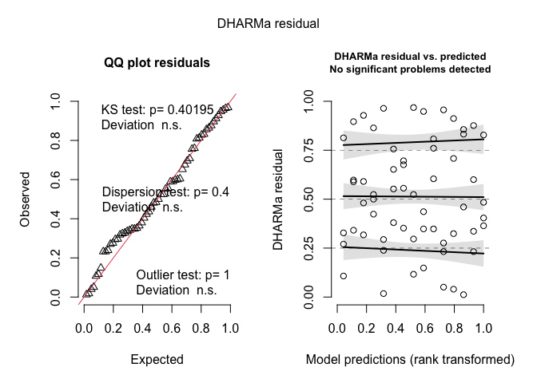<!-- -->

``` r
DHARMa::testDispersion(weed_inrow_glmm)
```

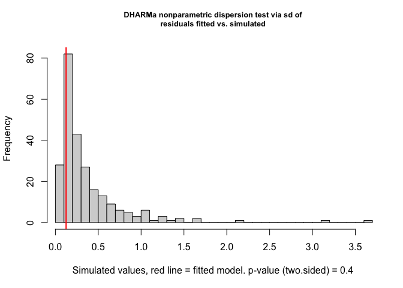<!-- -->

    ## 
    ##  DHARMa nonparametric dispersion test via sd of residuals fitted vs.
    ##  simulated
    ## 
    ## data:  simulationOutput
    ## dispersion = 0.33543, p-value = 0.4
    ## alternative hypothesis: two.sided

``` r
DHARMa::testZeroInflation(weed_inrow_glmm)
```

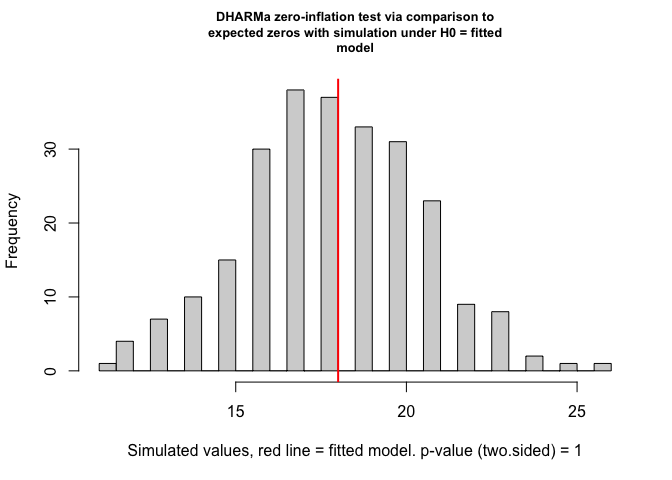<!-- -->

    ## 
    ##  DHARMa zero-inflation test via comparison to expected zeros with
    ##  simulation under H0 = fitted model
    ## 
    ## data:  simulationOutput
    ## ratioObsSim = 0.99602, p-value = 1
    ## alternative hypothesis: two.sided

``` r
car::Anova(weed_inrow_glmm, type = 3)
```

    ## Analysis of Deviance Table (Type III Wald chisquare tests)
    ## 
    ## Response: inrow_weed_biomass_kg_ha
    ##                     Chisq Df Pr(>Chisq)   
    ## (Intercept)         0.000  1   0.999890   
    ## weed_trt           16.312  4   0.002627 **
    ## site_year          11.177  2   0.003741 **
    ## weed_trt:site_year 17.483  8   0.025459 * 
    ## ---
    ## Signif. codes:  0 '***' 0.001 '**' 0.01 '*' 0.05 '.' 0.1 ' ' 1

##### Post-hoc summary table

``` r
### In-row weed biomass (kg ha⁻¹) with Fisher's LSD CLDs (by site-year)

# Because weed_trt × site_year is (potentially) important, we summarise treatment
# effects within each site-year on the response scale (kg ha⁻¹).

# Estimated marginal means for weed_trt within site_year (response scale)
emm_inrow_sy <- emmeans(
  weed_inrow_glmm,
  ~ weed_trt | site_year,
  type = "response"   # back-transform from link scale
)

# Tidy emmeans for reporting (kg ha⁻¹)
emm_inrow_sy_df <- summary(emm_inrow_sy) |>
  as_tibble() |>
  mutate(
    site_year = factor(site_year),
    weed_trt  = factor(weed_trt, levels = mow_levels)
  ) |>
  rename(
    emmean = response,   # mean on response scale
    ci_low = asymp.LCL,  # lower CI
    ci_high = asymp.UCL  # upper CI
  )

# Compact letter display (Fisher's LSD, no adjustment; "a" = highest within each site-year)
cld_inrow_sy <- cld(
  emm_inrow_sy,
  adjust   = "none",
  Letters  = letters,
  sort     = TRUE,
  reversed = TRUE          # so "a" = highest biomass group(s)
) |>
  as_tibble() |>
  mutate(
    site_year = factor(site_year),
    weed_trt  = factor(weed_trt, levels = mow_levels),
    .group    = str_trim(.group)
  ) |>
  select(site_year, weed_trt, .group)

# Join emmeans + CLDs and format for reporting
table_inrow_sy <- emm_inrow_sy_df |>
  left_join(cld_inrow_sy, by = c("site_year", "weed_trt")) |>
  select(site_year, weed_trt, emmean, SE, ci_low, ci_high, .group) |>
  mutate(
    across(c(emmean, SE, ci_low, ci_high), ~ round(.x, 1))
  ) |>
  arrange(site_year, weed_trt)

table_inrow_sy |>
  kable(
    caption   = "Estimated in-row weed biomass (kg ha⁻¹) by treatment within site-year (response scale) with 95% CI and Fisher's LSD group letters",
    col.names = c("Site-year", "Treatment", "Mean", "SE", "Lower CI", "Upper CI", "Group")
  ) |>
  kable_styling(full_width = FALSE, bootstrap_options = c("striped", "hover"))
```

<table class="table table-striped table-hover" style="color: black; width: auto !important; margin-left: auto; margin-right: auto;">

<caption>

Estimated in-row weed biomass (kg ha⁻¹) by treatment within site-year
(response scale) with 95% CI and Fisher’s LSD group letters
</caption>

<thead>

<tr>

<th style="text-align:left;">

Site-year
</th>

<th style="text-align:left;">

Treatment
</th>

<th style="text-align:right;">

Mean
</th>

<th style="text-align:right;">

SE
</th>

<th style="text-align:right;">

Lower CI
</th>

<th style="text-align:right;">

Upper CI
</th>

<th style="text-align:left;">

Group
</th>

</tr>

</thead>

<tbody>

<tr>

<td style="text-align:left;">

2024.field O2 east
</td>

<td style="text-align:left;">

Rolled, no control
</td>

<td style="text-align:right;">

0.0
</td>

<td style="text-align:right;">

0.0
</td>

<td style="text-align:right;">

0.0
</td>

<td style="text-align:right;">

Inf
</td>

<td style="text-align:left;">

ab
</td>

</tr>

<tr>

<td style="text-align:left;">

2024.field O2 east
</td>

<td style="text-align:left;">

Rolled, mowing
</td>

<td style="text-align:right;">

0.1
</td>

<td style="text-align:right;">

0.2
</td>

<td style="text-align:right;">

0.0
</td>

<td style="text-align:right;">

3.7
</td>

<td style="text-align:left;">

b
</td>

</tr>

<tr>

<td style="text-align:left;">

2024.field O2 east
</td>

<td style="text-align:left;">

Rolled, high-residue cultivation
</td>

<td style="text-align:right;">

0.4
</td>

<td style="text-align:right;">

0.6
</td>

<td style="text-align:right;">

0.0
</td>

<td style="text-align:right;">

6.7
</td>

<td style="text-align:left;">

b
</td>

</tr>

<tr>

<td style="text-align:left;">

2024.field O2 east
</td>

<td style="text-align:left;">

Tilled, mowing
</td>

<td style="text-align:right;">

18.3
</td>

<td style="text-align:right;">

13.0
</td>

<td style="text-align:right;">

4.5
</td>

<td style="text-align:right;">

73.6
</td>

<td style="text-align:left;">

a
</td>

</tr>

<tr>

<td style="text-align:left;">

2024.field O2 east
</td>

<td style="text-align:left;">

Tilled, cultivation
</td>

<td style="text-align:right;">

51.4
</td>

<td style="text-align:right;">

34.3
</td>

<td style="text-align:right;">

13.9
</td>

<td style="text-align:right;">

190.4
</td>

<td style="text-align:left;">

a
</td>

</tr>

<tr>

<td style="text-align:left;">

2024.field O2 west
</td>

<td style="text-align:left;">

Rolled, no control
</td>

<td style="text-align:right;">

17.7
</td>

<td style="text-align:right;">

17.7
</td>

<td style="text-align:right;">

2.5
</td>

<td style="text-align:right;">

125.7
</td>

<td style="text-align:left;">

a
</td>

</tr>

<tr>

<td style="text-align:left;">

2024.field O2 west
</td>

<td style="text-align:left;">

Rolled, mowing
</td>

<td style="text-align:right;">

44.6
</td>

<td style="text-align:right;">

38.8
</td>

<td style="text-align:right;">

8.1
</td>

<td style="text-align:right;">

245.6
</td>

<td style="text-align:left;">

a
</td>

</tr>

<tr>

<td style="text-align:left;">

2024.field O2 west
</td>

<td style="text-align:left;">

Rolled, high-residue cultivation
</td>

<td style="text-align:right;">

40.2
</td>

<td style="text-align:right;">

35.1
</td>

<td style="text-align:right;">

7.3
</td>

<td style="text-align:right;">

222.3
</td>

<td style="text-align:left;">

a
</td>

</tr>

<tr>

<td style="text-align:left;">

2024.field O2 west
</td>

<td style="text-align:left;">

Tilled, mowing
</td>

<td style="text-align:right;">

46.8
</td>

<td style="text-align:right;">

35.1
</td>

<td style="text-align:right;">

10.7
</td>

<td style="text-align:right;">

204.0
</td>

<td style="text-align:left;">

a
</td>

</tr>

<tr>

<td style="text-align:left;">

2024.field O2 west
</td>

<td style="text-align:left;">

Tilled, cultivation
</td>

<td style="text-align:right;">

12.6
</td>

<td style="text-align:right;">

12.1
</td>

<td style="text-align:right;">

1.9
</td>

<td style="text-align:right;">

82.9
</td>

<td style="text-align:left;">

a
</td>

</tr>

<tr>

<td style="text-align:left;">

2023.field v
</td>

<td style="text-align:left;">

Rolled, no control
</td>

<td style="text-align:right;">

23.4
</td>

<td style="text-align:right;">

10.3
</td>

<td style="text-align:right;">

9.9
</td>

<td style="text-align:right;">

55.3
</td>

<td style="text-align:left;">

c
</td>

</tr>

<tr>

<td style="text-align:left;">

2023.field v
</td>

<td style="text-align:left;">

Rolled, mowing
</td>

<td style="text-align:right;">

112.7
</td>

<td style="text-align:right;">

41.4
</td>

<td style="text-align:right;">

54.8
</td>

<td style="text-align:right;">

231.4
</td>

<td style="text-align:left;">

b
</td>

</tr>

<tr>

<td style="text-align:left;">

2023.field v
</td>

<td style="text-align:left;">

Rolled, high-residue cultivation
</td>

<td style="text-align:right;">

153.0
</td>

<td style="text-align:right;">

54.4
</td>

<td style="text-align:right;">

76.2
</td>

<td style="text-align:right;">

307.3
</td>

<td style="text-align:left;">

b
</td>

</tr>

<tr>

<td style="text-align:left;">

2023.field v
</td>

<td style="text-align:left;">

Tilled, mowing
</td>

<td style="text-align:right;">

635.1
</td>

<td style="text-align:right;">

197.0
</td>

<td style="text-align:right;">

345.8
</td>

<td style="text-align:right;">

1166.5
</td>

<td style="text-align:left;">

a
</td>

</tr>

<tr>

<td style="text-align:left;">

2023.field v
</td>

<td style="text-align:left;">

Tilled, cultivation
</td>

<td style="text-align:right;">

835.0
</td>

<td style="text-align:right;">

253.3
</td>

<td style="text-align:right;">

460.8
</td>

<td style="text-align:right;">

1513.1
</td>

<td style="text-align:left;">

a
</td>

</tr>

</tbody>

</table>

##### ANOVA-style summary tables

``` r
## 1) P-value summary (Location, Treatment, Interaction) -----------------

# Type-III tests for the selected in-row GLMM
anova_inrow <- Anova(weed_inrow_glmm, type = 3)

anova_inrow_df <- anova_inrow |>
  as.data.frame() |>
  tibble::rownames_to_column("Effect")

# Extract Wald p-values from the selected model
p_site_inrow <- anova_inrow_df$`Pr(>Chisq)`[anova_inrow_df$Effect == "site_year"]
p_trt_inrow  <- anova_inrow_df$`Pr(>Chisq)`[anova_inrow_df$Effect == "weed_trt"]
p_int_inrow  <- anova_inrow_df$`Pr(>Chisq)`[anova_inrow_df$Effect == "weed_trt:site_year"]

# Always include Location and Treatment rows
pvals_inrow <- tibble(
  Effect = c(
    "Location (site_year)",
    "Treatment (weed_trt)"
  ),
  p_raw = c(p_site_inrow, p_trt_inrow)
)

# Only include the interaction row if the interaction model was selected
if (chosen_model_name_inrow == "Interaction: weed_trt * site_year") {
  pvals_inrow <- bind_rows(
    pvals_inrow,
    tibble(
      Effect = "Location × Treatment",
      p_raw  = p_int_inrow
    )
  )
}

pvals_inrow <- pvals_inrow |>
  mutate(
    `P-value` = case_when(
      p_raw < 0.001 ~ "<0.001",
      p_raw < 0.01  ~ "<0.01",
      TRUE          ~ sprintf("%.3f", p_raw)
    )
  ) |>
  select(Effect, `P-value`)

pvals_inrow |>
  kable(
    caption   = "In-row weed biomass (kg ha⁻¹): P-values for location and treatment (and interaction if included in the selected model)",
    col.names = c("Effect", "P-value")
  ) |>
  kable_styling(full_width = FALSE, bootstrap_options = c("striped", "hover"))
```

<table class="table table-striped table-hover" style="color: black; width: auto !important; margin-left: auto; margin-right: auto;">

<caption>

In-row weed biomass (kg ha⁻¹): P-values for location and treatment (and
interaction if included in the selected model)
</caption>

<thead>

<tr>

<th style="text-align:left;">

Effect
</th>

<th style="text-align:left;">

P-value
</th>

</tr>

</thead>

<tbody>

<tr>

<td style="text-align:left;">

Location (site_year)
</td>

<td style="text-align:left;">

\<0.01
</td>

</tr>

<tr>

<td style="text-align:left;">

Treatment (weed_trt)
</td>

<td style="text-align:left;">

\<0.01
</td>

</tr>

<tr>

<td style="text-align:left;">

Location × Treatment
</td>

<td style="text-align:left;">

0.025
</td>

</tr>

</tbody>

</table>

``` r
## 1b) Likelihood-ratio test: additive vs interaction -------------------

lrt_table_inrow <- tibble(
  Test    = "LRT (additive vs interaction)",
  p_raw   = lrt_inrow$`Pr(>Chisq)`[2]
) |>
  mutate(
    `P-value` = case_when(
      p_raw < 0.001 ~ "<0.001",
      p_raw < 0.01  ~ "<0.01",
      TRUE          ~ sprintf("%.3f", p_raw)
    )
  ) |>
  select(Test, `P-value`)

lrt_table_inrow |>
  kable(
    caption   = "In-row weed biomass (kg ha⁻¹): Likelihood-ratio test comparing additive vs interaction models",
    col.names = c("Test", "P-value")
  ) |>
  kable_styling(full_width = FALSE, bootstrap_options = c("striped", "hover"))
```

<table class="table table-striped table-hover" style="color: black; width: auto !important; margin-left: auto; margin-right: auto;">

<caption>

In-row weed biomass (kg ha⁻¹): Likelihood-ratio test comparing additive
vs interaction models
</caption>

<thead>

<tr>

<th style="text-align:left;">

Test
</th>

<th style="text-align:left;">

P-value
</th>

</tr>

</thead>

<tbody>

<tr>

<td style="text-align:left;">

LRT (additive vs interaction)
</td>

<td style="text-align:left;">

0.019
</td>

</tr>

</tbody>

</table>

``` r
## 2) Location block: site-year means (model + raw) ----------------------

# Model-based emmeans by site_year (response scale)
emm_loc_inrow <- emmeans(
  weed_inrow_glmm,
  ~ site_year,
  type = "response"
)

emm_loc_inrow_df <- summary(emm_loc_inrow) |>
  as_tibble() |>
  mutate(
    site_year  = as.factor(site_year),
    model_mean = response
  ) |>
  select(site_year, model_mean)

# CLDs for site_year (a = highest)
cld_loc_inrow <- cld(
  emm_loc_inrow,
  adjust   = "none",
  Letters  = letters,
  sort     = TRUE,
  reversed = TRUE
) |>
  as_tibble() |>
  mutate(
    site_year = as.factor(site_year),
    loc_CLD   = str_trim(.group)
  ) |>
  select(site_year, loc_CLD)

# Raw means by site_year
raw_loc_inrow <- weed_biomass_clean |>
  group_by(site_year) |>
  summarise(
    raw_mean = mean(inrow_weed_biomass_kg_ha, na.rm = TRUE),
    .groups  = "drop"
  ) |>
  mutate(site_year = as.factor(site_year))

loc_summary_inrow <- emm_loc_inrow_df |>
  left_join(cld_loc_inrow, by = "site_year") |>
  left_join(raw_loc_inrow, by = "site_year") |>
  mutate(
    model_mean = round(model_mean, 1),
    raw_mean   = round(raw_mean, 1),
    raw_CLD    = loc_CLD
  ) |>
  arrange(site_year)

loc_summary_inrow |>
  kable(
    caption   = "In-row weed biomass (kg ha⁻¹): location (site-year) means with CLDs",
    col.names = c("Site-year", "Model mean", "Model CLD", "Raw mean", "Raw CLD")
  ) |>
  kable_styling(full_width = FALSE, bootstrap_options = c("striped", "hover"))
```

<table class="table table-striped table-hover" style="color: black; width: auto !important; margin-left: auto; margin-right: auto;">

<caption>

In-row weed biomass (kg ha⁻¹): location (site-year) means with CLDs
</caption>

<thead>

<tr>

<th style="text-align:left;">

Site-year
</th>

<th style="text-align:right;">

Model mean
</th>

<th style="text-align:left;">

Model CLD
</th>

<th style="text-align:right;">

Raw mean
</th>

<th style="text-align:left;">

Raw CLD
</th>

</tr>

</thead>

<tbody>

<tr>

<td style="text-align:left;">

2024.field O2 east
</td>

<td style="text-align:right;">

0.0
</td>

<td style="text-align:left;">

ab
</td>

<td style="text-align:right;">

16.2
</td>

<td style="text-align:left;">

ab
</td>

</tr>

<tr>

<td style="text-align:left;">

2024.field O2 west
</td>

<td style="text-align:right;">

28.5
</td>

<td style="text-align:left;">

b
</td>

<td style="text-align:right;">

42.0
</td>

<td style="text-align:left;">

b
</td>

</tr>

<tr>

<td style="text-align:left;">

2023.field v
</td>

<td style="text-align:right;">

184.5
</td>

<td style="text-align:left;">

a
</td>

<td style="text-align:right;">

366.4
</td>

<td style="text-align:left;">

a
</td>

</tr>

</tbody>

</table>

``` r
## 3) Treatment block: means (model + raw) -------------------------------

# emmeans for treatment (response scale)
emm_inrow <- emmeans(
  weed_inrow_glmm,
  ~ weed_trt,
  type = "response"
)

emm_trt_inrow_df <- summary(emm_inrow) |>
  as_tibble() |>
  mutate(
    weed_trt   = factor(weed_trt, levels = mow_levels),
    model_mean = response
  ) |>
  select(weed_trt, model_mean)

# CLDs for treatment (a = highest)
cld_inrow <- cld(
  emm_inrow,
  adjust   = "none",
  Letters  = letters,
  sort     = TRUE,
  reversed = TRUE
) |>
  as_tibble() |>
  mutate(
    weed_trt = factor(weed_trt, levels = mow_levels),
    trt_CLD  = str_trim(.group)
  ) |>
  select(weed_trt, trt_CLD)

# Raw means by treatment
raw_trt_inrow <- weed_biomass_clean |>
  group_by(weed_trt) |>
  summarise(
    raw_mean = mean(inrow_weed_biomass_kg_ha, na.rm = TRUE),
    .groups  = "drop"
  ) |>
  mutate(weed_trt = factor(weed_trt, levels = mow_levels))

trt_summary_inrow <- emm_trt_inrow_df |>
  left_join(cld_inrow, by = "weed_trt") |>
  left_join(raw_trt_inrow, by = "weed_trt") |>
  mutate(
    model_mean = round(model_mean, 1),
    raw_mean   = round(raw_mean, 1),
    raw_CLD    = trt_CLD
  ) |>
  arrange(weed_trt)

trt_summary_inrow |>
  kable(
    caption   = "In-row weed biomass (kg ha⁻¹): treatment means with CLDs",
    col.names = c("Treatment", "Model mean", "Model CLD", "Raw mean", "Raw CLD")
  ) |>
  kable_styling(full_width = FALSE, bootstrap_options = c("striped", "hover"))
```

<table class="table table-striped table-hover" style="color: black; width: auto !important; margin-left: auto; margin-right: auto;">

<caption>

In-row weed biomass (kg ha⁻¹): treatment means with CLDs
</caption>

<thead>

<tr>

<th style="text-align:left;">

Treatment
</th>

<th style="text-align:right;">

Model mean
</th>

<th style="text-align:left;">

Model CLD
</th>

<th style="text-align:right;">

Raw mean
</th>

<th style="text-align:left;">

Raw CLD
</th>

</tr>

</thead>

<tbody>

<tr>

<td style="text-align:left;">

Rolled, no control
</td>

<td style="text-align:right;">

0.0
</td>

<td style="text-align:left;">

ab
</td>

<td style="text-align:right;">

16.9
</td>

<td style="text-align:left;">

ab
</td>

</tr>

<tr>

<td style="text-align:left;">

Rolled, mowing
</td>

<td style="text-align:right;">

8.8
</td>

<td style="text-align:left;">

b
</td>

<td style="text-align:right;">

63.7
</td>

<td style="text-align:left;">

b
</td>

</tr>

<tr>

<td style="text-align:left;">

Rolled, high-residue cultivation
</td>

<td style="text-align:right;">

13.9
</td>

<td style="text-align:left;">

b
</td>

<td style="text-align:right;">

76.1
</td>

<td style="text-align:left;">

b
</td>

</tr>

<tr>

<td style="text-align:left;">

Tilled, mowing
</td>

<td style="text-align:right;">

81.6
</td>

<td style="text-align:left;">

a
</td>

<td style="text-align:right;">

242.7
</td>

<td style="text-align:left;">

a
</td>

</tr>

<tr>

<td style="text-align:left;">

Tilled, cultivation
</td>

<td style="text-align:right;">

81.5
</td>

<td style="text-align:left;">

a
</td>

<td style="text-align:right;">

308.3
</td>

<td style="text-align:left;">

a
</td>

</tr>

</tbody>

</table>

``` r
## 4) Interaction block: site-year × treatment means ---------------------

# Model emmeans by treatment within site_year (response scale)
emm_sy_inrow <- emmeans(
  weed_inrow_glmm,
  ~ weed_trt | site_year,
  type = "response"
)

emm_sy_inrow_df <- summary(emm_sy_inrow) |>
  as_tibble() |>
  mutate(
    weed_trt   = factor(weed_trt, levels = mow_levels),
    site_year  = as.factor(site_year),
    model_mean = response
  ) |>
  select(site_year, weed_trt, model_mean)

# CLDs within each site_year (a = highest within that site_year)
cld_sy_inrow <- cld(
  emm_sy_inrow,
  adjust   = "none",
  Letters  = letters,
  sort     = TRUE,
  reversed = TRUE
) |>
  as_tibble() |>
  mutate(
    weed_trt  = factor(weed_trt, levels = mow_levels),
    site_year = as.factor(site_year),
    int_CLD   = str_trim(.group)
  ) |>
  select(site_year, weed_trt, int_CLD)

# Raw means by site_year × treatment
raw_sy_inrow <- weed_biomass_clean |>
  group_by(site_year, weed_trt) |>
  summarise(
    raw_mean = mean(inrow_weed_biomass_kg_ha, na.rm = TRUE),
    .groups  = "drop"
  ) |>
  mutate(
    site_year = as.factor(site_year),
    weed_trt  = factor(weed_trt, levels = mow_levels)
  )

int_summary_inrow <- emm_sy_inrow_df |>
  left_join(cld_sy_inrow, by = c("site_year", "weed_trt")) |>
  left_join(raw_sy_inrow, by = c("site_year", "weed_trt")) |>
  mutate(
    model_mean = round(model_mean, 1),
    raw_mean   = round(raw_mean, 1),
    raw_CLD    = int_CLD
  ) |>
  arrange(site_year, weed_trt)

int_summary_inrow |>
  kable(
    caption   = "In-row weed biomass (kg ha⁻¹): site-year × treatment means with CLDs",
    col.names = c(
      "Site-year", "Treatment",
      "Model mean", "Model CLD",
      "Raw mean",   "Raw CLD"
    )
  ) |>
  kable_styling(full_width = FALSE, bootstrap_options = c("striped", "hover"))
```

<table class="table table-striped table-hover" style="color: black; width: auto !important; margin-left: auto; margin-right: auto;">

<caption>

In-row weed biomass (kg ha⁻¹): site-year × treatment means with CLDs
</caption>

<thead>

<tr>

<th style="text-align:left;">

Site-year
</th>

<th style="text-align:left;">

Treatment
</th>

<th style="text-align:right;">

Model mean
</th>

<th style="text-align:left;">

Model CLD
</th>

<th style="text-align:right;">

Raw mean
</th>

<th style="text-align:left;">

Raw CLD
</th>

</tr>

</thead>

<tbody>

<tr>

<td style="text-align:left;">

2024.field O2 east
</td>

<td style="text-align:left;">

Rolled, no control
</td>

<td style="text-align:right;">

0.0
</td>

<td style="text-align:left;">

ab
</td>

<td style="text-align:right;">

0.0
</td>

<td style="text-align:left;">

ab
</td>

</tr>

<tr>

<td style="text-align:left;">

2024.field O2 east
</td>

<td style="text-align:left;">

Rolled, mowing
</td>

<td style="text-align:right;">

0.1
</td>

<td style="text-align:left;">

b
</td>

<td style="text-align:right;">

0.1
</td>

<td style="text-align:left;">

b
</td>

</tr>

<tr>

<td style="text-align:left;">

2024.field O2 east
</td>

<td style="text-align:left;">

Rolled, high-residue cultivation
</td>

<td style="text-align:right;">

0.4
</td>

<td style="text-align:left;">

b
</td>

<td style="text-align:right;">

0.6
</td>

<td style="text-align:left;">

b
</td>

</tr>

<tr>

<td style="text-align:left;">

2024.field O2 east
</td>

<td style="text-align:left;">

Tilled, mowing
</td>

<td style="text-align:right;">

18.3
</td>

<td style="text-align:left;">

a
</td>

<td style="text-align:right;">

16.9
</td>

<td style="text-align:left;">

a
</td>

</tr>

<tr>

<td style="text-align:left;">

2024.field O2 east
</td>

<td style="text-align:left;">

Tilled, cultivation
</td>

<td style="text-align:right;">

51.4
</td>

<td style="text-align:left;">

a
</td>

<td style="text-align:right;">

63.4
</td>

<td style="text-align:left;">

a
</td>

</tr>

<tr>

<td style="text-align:left;">

2024.field O2 west
</td>

<td style="text-align:left;">

Rolled, no control
</td>

<td style="text-align:right;">

17.7
</td>

<td style="text-align:left;">

a
</td>

<td style="text-align:right;">

26.4
</td>

<td style="text-align:left;">

a
</td>

</tr>

<tr>

<td style="text-align:left;">

2024.field O2 west
</td>

<td style="text-align:left;">

Rolled, mowing
</td>

<td style="text-align:right;">

44.6
</td>

<td style="text-align:left;">

a
</td>

<td style="text-align:right;">

65.0
</td>

<td style="text-align:left;">

a
</td>

</tr>

<tr>

<td style="text-align:left;">

2024.field O2 west
</td>

<td style="text-align:left;">

Rolled, high-residue cultivation
</td>

<td style="text-align:right;">

40.2
</td>

<td style="text-align:left;">

a
</td>

<td style="text-align:right;">

57.7
</td>

<td style="text-align:left;">

a
</td>

</tr>

<tr>

<td style="text-align:left;">

2024.field O2 west
</td>

<td style="text-align:left;">

Tilled, mowing
</td>

<td style="text-align:right;">

46.8
</td>

<td style="text-align:left;">

a
</td>

<td style="text-align:right;">

49.0
</td>

<td style="text-align:left;">

a
</td>

</tr>

<tr>

<td style="text-align:left;">

2024.field O2 west
</td>

<td style="text-align:left;">

Tilled, cultivation
</td>

<td style="text-align:right;">

12.6
</td>

<td style="text-align:left;">

a
</td>

<td style="text-align:right;">

11.7
</td>

<td style="text-align:left;">

a
</td>

</tr>

<tr>

<td style="text-align:left;">

2023.field v
</td>

<td style="text-align:left;">

Rolled, no control
</td>

<td style="text-align:right;">

23.4
</td>

<td style="text-align:left;">

c
</td>

<td style="text-align:right;">

24.2
</td>

<td style="text-align:left;">

c
</td>

</tr>

<tr>

<td style="text-align:left;">

2023.field v
</td>

<td style="text-align:left;">

Rolled, mowing
</td>

<td style="text-align:right;">

112.7
</td>

<td style="text-align:left;">

b
</td>

<td style="text-align:right;">

125.9
</td>

<td style="text-align:left;">

b
</td>

</tr>

<tr>

<td style="text-align:left;">

2023.field v
</td>

<td style="text-align:left;">

Rolled, high-residue cultivation
</td>

<td style="text-align:right;">

153.0
</td>

<td style="text-align:left;">

b
</td>

<td style="text-align:right;">

170.1
</td>

<td style="text-align:left;">

b
</td>

</tr>

<tr>

<td style="text-align:left;">

2023.field v
</td>

<td style="text-align:left;">

Tilled, mowing
</td>

<td style="text-align:right;">

635.1
</td>

<td style="text-align:left;">

a
</td>

<td style="text-align:right;">

662.2
</td>

<td style="text-align:left;">

a
</td>

</tr>

<tr>

<td style="text-align:left;">

2023.field v
</td>

<td style="text-align:left;">

Tilled, cultivation
</td>

<td style="text-align:right;">

835.0
</td>

<td style="text-align:left;">

a
</td>

<td style="text-align:right;">

849.9
</td>

<td style="text-align:left;">

a
</td>

</tr>

</tbody>

</table>

#### 2023 only

``` r
#### 2023 Field V — in-row weed biomass: model testing / selection

options(contrasts = c("contr.sum", "contr.poly"))

# Model formula: in-row instead of total (single site-year, so no site_year term)
form_v23_inrow <- inrow_weed_biomass_kg_ha ~ weed_trt + (1 | block)

## 1) Candidate families / structures -----------------------------------

m_v23_inrow_tw <- glmmTMB(
  formula = form_v23_inrow,
  family  = tweedie(link = "log"),
  data    = weed_biomass_field_v_2023
)

m_v23_inrow_nb <- glmmTMB(
  formula = form_v23_inrow,
  family  = nbinom2(link = "log"),
  data    = weed_biomass_field_v_2023
)

m_v23_inrow_tw_zi <- glmmTMB(
  formula   = form_v23_inrow,
  family    = tweedie(link = "log"),
  ziformula = ~ 1,
  data      = weed_biomass_field_v_2023
)

## 2) NA-safe AIC helper -------------------------------------------------

safe_aic <- function(mod) {
  out <- try(AIC(mod), silent = TRUE)
  if (inherits(out, "try-error")) return(NA_real_)
  out
}

aic_v23_inrow <- tibble(
  model = c(
    "V23 INROW: Tweedie",
    "V23 INROW: NB2",
    "V23 INROW: Tweedie + ZI"
  ),
  AIC = c(
    safe_aic(m_v23_inrow_tw),
    safe_aic(m_v23_inrow_nb),
    safe_aic(m_v23_inrow_tw_zi)
  )
)

## 3) Pick best family (require > 2 AIC units better) -------------------

best_v23_inrow      <- m_v23_inrow_tw
best_v23_inrow_name <- "V23 INROW: Tweedie"
best_aic_v23_inrow  <- safe_aic(m_v23_inrow_tw)

# Start from Tweedie and only move if clearly better (> 2 AIC units)
cands_v23_inrow <- list(
  "V23 INROW: NB2"          = m_v23_inrow_nb,
  "V23 INROW: Tweedie + ZI" = m_v23_inrow_tw_zi
)

for (nm in names(cands_v23_inrow)) {
  this_aic <- safe_aic(cands_v23_inrow[[nm]])
  if (is.finite(this_aic) && (this_aic + 2 < best_aic_v23_inrow)) {
    best_v23_inrow      <- cands_v23_inrow[[nm]]
    best_v23_inrow_name <- nm
    best_aic_v23_inrow  <- this_aic
  }
}

aic_v23_inrow_out <- aic_v23_inrow |>
  mutate(
    deltaAIC = AIC - min(AIC, na.rm = TRUE),
    Selected = if_else(model == best_v23_inrow_name, "Yes", "")
  )

kable(
  aic_v23_inrow_out,
  digits  = 2,
  caption = "In-row weed biomass (kg ha⁻¹), 2023 Field V: model comparison (Tweedie vs NB2 vs Tweedie + ZI)"
) |>
  kable_styling(full_width = FALSE, bootstrap_options = c("striped", "hover"))
```

<table class="table table-striped table-hover" style="color: black; width: auto !important; margin-left: auto; margin-right: auto;">

<caption>

In-row weed biomass (kg ha⁻¹), 2023 Field V: model comparison (Tweedie
vs NB2 vs Tweedie + ZI)
</caption>

<thead>

<tr>

<th style="text-align:left;">

model
</th>

<th style="text-align:right;">

AIC
</th>

<th style="text-align:right;">

deltaAIC
</th>

<th style="text-align:left;">

Selected
</th>

</tr>

</thead>

<tbody>

<tr>

<td style="text-align:left;">

V23 INROW: Tweedie
</td>

<td style="text-align:right;">

256.60
</td>

<td style="text-align:right;">

0.00
</td>

<td style="text-align:left;">

Yes
</td>

</tr>

<tr>

<td style="text-align:left;">

V23 INROW: NB2
</td>

<td style="text-align:right;">

256.78
</td>

<td style="text-align:right;">

0.18
</td>

<td style="text-align:left;">

</td>

</tr>

<tr>

<td style="text-align:left;">

V23 INROW: Tweedie + ZI
</td>

<td style="text-align:right;">

258.60
</td>

<td style="text-align:right;">

2.00
</td>

<td style="text-align:left;">

</td>

</tr>

</tbody>

</table>

``` r
cat(
  "\nSelected model for 2023 Field V in-row weed biomass (used in downstream emmeans/plots):\n  ",
  best_v23_inrow_name,
  sprintf("  [AIC = %.2f]\n", best_aic_v23_inrow)
)
```

    ## 
    ## Selected model for 2023 Field V in-row weed biomass (used in downstream emmeans/plots):
    ##    V23 INROW: Tweedie   [AIC = 256.60]

``` r
# Store final model object for later use
weed_inrow_glmm_v23 <- best_v23_inrow

## 4) Diagnostics + Type-III tests --------------------------------------

set.seed(123)
res_v23_inrow <- DHARMa::simulateResiduals(weed_inrow_glmm_v23)
plot(res_v23_inrow)
```

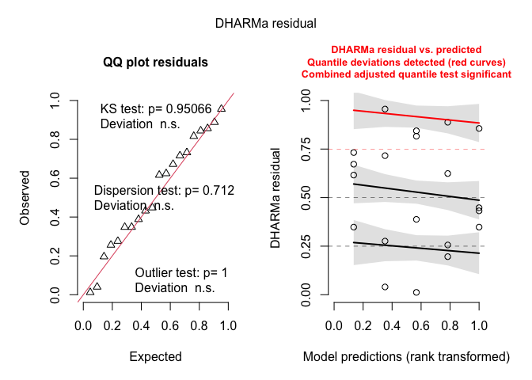<!-- -->

``` r
DHARMa::testDispersion(weed_inrow_glmm_v23)
```

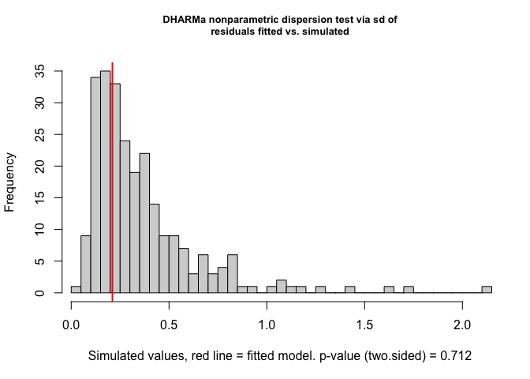<!-- -->

    ## 
    ##  DHARMa nonparametric dispersion test via sd of residuals fitted vs.
    ##  simulated
    ## 
    ## data:  simulationOutput
    ## dispersion = 0.58647, p-value = 0.712
    ## alternative hypothesis: two.sided

``` r
DHARMa::testZeroInflation(weed_inrow_glmm_v23)
```

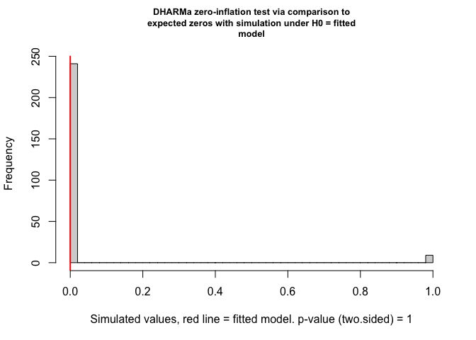<!-- -->

    ## 
    ##  DHARMa zero-inflation test via comparison to expected zeros with
    ##  simulation under H0 = fitted model
    ## 
    ## data:  simulationOutput
    ## ratioObsSim = 0, p-value = 1
    ## alternative hypothesis: two.sided

``` r
car::Anova(weed_inrow_glmm_v23, type = 3)
```

    ## Analysis of Deviance Table (Type III Wald chisquare tests)
    ## 
    ## Response: inrow_weed_biomass_kg_ha
    ##              Chisq Df Pr(>Chisq)    
    ## (Intercept) 678.56  1  < 2.2e-16 ***
    ## weed_trt    103.12  4  < 2.2e-16 ***
    ## ---
    ## Signif. codes:  0 '***' 0.001 '**' 0.01 '*' 0.05 '.' 0.1 ' ' 1

##### Post-hoc summary table

``` r
### In-row weed biomass (kg ha⁻¹), 2023 Field V — Fisher's LSD CLDs

# Estimated marginal means for weed_trt on the response scale (kg/ha)
emm_inrow_v23 <- emmeans(
  weed_inrow_glmm_v23,
  ~ weed_trt,
  type = "response"   # back-transform from link scale
)

# Tidy emmeans for reporting (rename columns to match other RMDs)
emm_inrow_v23_df <- as_tibble(emm_inrow_v23) |>
  mutate(
    weed_trt = factor(weed_trt, levels = mow_levels)
  ) |>
  rename(
    emmean = response,     # mean on response scale (kg/ha)
    ci_low = asymp.LCL,    # lower CI
    ci_high = asymp.UCL    # upper CI
  )

# Compact letter display (Fisher's LSD, no adjustment; "a" = highest)
cld_inrow_v23 <- cld(
  emm_inrow_v23,
  adjust   = "none",
  Letters  = letters,
  sort     = TRUE,
  reversed = TRUE   # so "a" = highest biomass group(s)
) |>
  as_tibble() |>
  mutate(
    weed_trt = factor(weed_trt, levels = mow_levels),
    .group   = str_trim(.group)
  ) |>
  select(weed_trt, .group)

# Join emmeans + CLDs and format for reporting
emm_inrow_v23_df |>
  left_join(cld_inrow_v23, by = "weed_trt") |>
  select(weed_trt, emmean, SE, ci_low, ci_high, .group) |>
  mutate(
    across(c(emmean, SE, ci_low, ci_high), ~ round(.x, 1))
  ) |>
  kable(
    caption   = "Estimated in-row weed biomass (kg ha⁻¹) in 2023 Field V with 95% CI and Fisher's LSD group letters",
    col.names = c("Treatment", "Mean", "SE", "Lower CI", "Upper CI", "Group")
  ) |>
  kable_styling(full_width = FALSE, bootstrap_options = c("striped", "hover"))
```

<table class="table table-striped table-hover" style="color: black; width: auto !important; margin-left: auto; margin-right: auto;">

<caption>

Estimated in-row weed biomass (kg ha⁻¹) in 2023 Field V with 95% CI and
Fisher’s LSD group letters
</caption>

<thead>

<tr>

<th style="text-align:left;">

Treatment
</th>

<th style="text-align:right;">

Mean
</th>

<th style="text-align:right;">

SE
</th>

<th style="text-align:right;">

Lower CI
</th>

<th style="text-align:right;">

Upper CI
</th>

<th style="text-align:left;">

Group
</th>

</tr>

</thead>

<tbody>

<tr>

<td style="text-align:left;">

Rolled, no control
</td>

<td style="text-align:right;">

23.5
</td>

<td style="text-align:right;">

9.7
</td>

<td style="text-align:right;">

10.5
</td>

<td style="text-align:right;">

52.7
</td>

<td style="text-align:left;">

c
</td>

</tr>

<tr>

<td style="text-align:left;">

Rolled, mowing
</td>

<td style="text-align:right;">

115.5
</td>

<td style="text-align:right;">

37.8
</td>

<td style="text-align:right;">

60.9
</td>

<td style="text-align:right;">

219.2
</td>

<td style="text-align:left;">

b
</td>

</tr>

<tr>

<td style="text-align:left;">

Rolled, high-residue cultivation
</td>

<td style="text-align:right;">

157.0
</td>

<td style="text-align:right;">

49.1
</td>

<td style="text-align:right;">

85.0
</td>

<td style="text-align:right;">

289.9
</td>

<td style="text-align:left;">

b
</td>

</tr>

<tr>

<td style="text-align:left;">

Tilled, mowing
</td>

<td style="text-align:right;">

639.5
</td>

<td style="text-align:right;">

163.2
</td>

<td style="text-align:right;">

387.8
</td>

<td style="text-align:right;">

1054.7
</td>

<td style="text-align:left;">

a
</td>

</tr>

<tr>

<td style="text-align:left;">

Tilled, cultivation
</td>

<td style="text-align:right;">

835.8
</td>

<td style="text-align:right;">

206.2
</td>

<td style="text-align:right;">

515.3
</td>

<td style="text-align:right;">

1355.6
</td>

<td style="text-align:left;">

a
</td>

</tr>

</tbody>

</table>

### Interrow weed biomass

#### Pooled

``` r
#### Interrow pooled (all site-years): model testing / selection

options(contrasts = c("contr.sum", "contr.poly"))

# Model formula: interrow instead of total (full interaction)
form_all_interrow <- interrow_weed_biomass_kg_ha ~ weed_trt * site_year + (1 | site_year:block)

## 1) Candidate families / structures (all with interaction) ------------

m_all_interrow_tw <- glmmTMB(
  formula = form_all_interrow,
  family  = tweedie(link = "log"),
  data    = weed_biomass_clean
)

m_all_interrow_nb <- glmmTMB(
  formula = form_all_interrow,
  family  = nbinom2(link = "log"),
  data    = weed_biomass_clean
)

m_all_interrow_tw_zi <- glmmTMB(
  formula   = form_all_interrow,
  family    = tweedie(link = "log"),
  ziformula = ~ 1,
  data      = weed_biomass_clean
)

m_all_interrow_tw_disp <- glmmTMB(
  formula     = form_all_interrow,
  family      = tweedie(link = "log"),
  ziformula   = ~ 1,
  dispformula = ~ site_year,
  data        = weed_biomass_clean
)

# NA-safe AIC helper (reuse if already defined) -------------------------
safe_aic <- function(mod) {
  out <- try(AIC(mod), silent = TRUE)
  if (inherits(out, "try-error")) return(NA_real_)
  out
}

aic_all_interrow <- tibble(
  model = c(
    "INTERROW: Tweedie",
    "INTERROW: NB2",
    "INTERROW: Tweedie + ZI",
    "INTERROW: Tweedie + ZI + disp(site_year)"
  ),
  AIC = c(
    safe_aic(m_all_interrow_tw),
    safe_aic(m_all_interrow_nb),
    safe_aic(m_all_interrow_tw_zi),
    safe_aic(m_all_interrow_tw_disp)
  )
)

kable(
  aic_all_interrow,
  digits  = 2,
  caption = "Interrow weed biomass (kg ha⁻¹): candidate distributional families"
) |>
  kable_styling(full_width = FALSE, bootstrap_options = c("striped", "hover"))
```

<table class="table table-striped table-hover" style="color: black; width: auto !important; margin-left: auto; margin-right: auto;">

<caption>

Interrow weed biomass (kg ha⁻¹): candidate distributional families
</caption>

<thead>

<tr>

<th style="text-align:left;">

model
</th>

<th style="text-align:right;">

AIC
</th>

</tr>

</thead>

<tbody>

<tr>

<td style="text-align:left;">

INTERROW: Tweedie
</td>

<td style="text-align:right;">

611.36
</td>

</tr>

<tr>

<td style="text-align:left;">

INTERROW: NB2
</td>

<td style="text-align:right;">

610.89
</td>

</tr>

<tr>

<td style="text-align:left;">

INTERROW: Tweedie + ZI
</td>

<td style="text-align:right;">

610.16
</td>

</tr>

<tr>

<td style="text-align:left;">

INTERROW: Tweedie + ZI + disp(site_year)
</td>

<td style="text-align:right;">

610.28
</td>

</tr>

</tbody>

</table>

``` r
## 2) Choose best family (require > 2 AIC units better) -----------------

best_all_interrow   <- m_all_interrow_tw
best_all_interrow_n <- "INTERROW: Tweedie"
best_aic_interrow   <- safe_aic(m_all_interrow_tw)

cands_interrow <- list(
  "INTERROW: NB2"                            = m_all_interrow_nb,
  "INTERROW: Tweedie + ZI"                   = m_all_interrow_tw_zi,
  "INTERROW: Tweedie + ZI + disp(site_year)" = m_all_interrow_tw_disp
)

for (nm in names(cands_interrow)) {
  this_aic <- safe_aic(cands_interrow[[nm]])
  if (is.finite(this_aic) && (this_aic + 2 < best_aic_interrow)) {
    best_all_interrow   <- cands_interrow[[nm]]
    best_all_interrow_n <- nm
    best_aic_interrow   <- this_aic
  }
}

cat(
  "Selected family/structure for interrow weed biomass (all site-years):",
  best_all_interrow_n, "\n"
)
```

    ## Selected family/structure for interrow weed biomass (all site-years): INTERROW: Tweedie

``` r
## 3) Within chosen family: additive vs interaction ---------------------

# Interaction model in chosen family
interrow_int <- best_all_interrow

# Additive model: same family/ZI/dispersion, simpler fixed effects
interrow_add <- update(
  best_all_interrow,
  . ~ weed_trt + site_year + (1 | site_year:block)
)

# AIC comparison
aic_interrow <- tibble(
  model = c(
    "Additive: weed_trt + site_year",
    "Interaction: weed_trt * site_year"
  ),
  AIC = c(AIC(interrow_add), AIC(interrow_int))
)

# Likelihood-ratio test for interaction
lrt_interrow   <- anova(interrow_add, interrow_int)
p_int_interrow <- lrt_interrow$`Pr(>Chisq)`[2]

# Apply your rule: keep additive unless interaction clearly needed
chosen_model_name_interrow <- if (p_int_interrow < 0.05) {
  "Interaction: weed_trt * site_year"
} else {
  "Additive: weed_trt + site_year"
}

aic_interrow_out <- aic_interrow |>
  mutate(
    deltaAIC = AIC - min(AIC),
    Selected = if_else(model == chosen_model_name_interrow, "Yes", "")
  )

kable(
  aic_interrow_out,
  digits  = 2,
  caption = "Interrow weed biomass (kg ha⁻¹): additive vs interaction (within chosen family)"
) |>
  kable_styling(full_width = FALSE, bootstrap_options = c("striped", "hover"))
```

<table class="table table-striped table-hover" style="color: black; width: auto !important; margin-left: auto; margin-right: auto;">

<caption>

Interrow weed biomass (kg ha⁻¹): additive vs interaction (within chosen
family)
</caption>

<thead>

<tr>

<th style="text-align:left;">

model
</th>

<th style="text-align:right;">

AIC
</th>

<th style="text-align:right;">

deltaAIC
</th>

<th style="text-align:left;">

Selected
</th>

</tr>

</thead>

<tbody>

<tr>

<td style="text-align:left;">

Additive: weed_trt + site_year
</td>

<td style="text-align:right;">

615.78
</td>

<td style="text-align:right;">

4.42
</td>

<td style="text-align:left;">

</td>

</tr>

<tr>

<td style="text-align:left;">

Interaction: weed_trt \* site_year
</td>

<td style="text-align:right;">

611.36
</td>

<td style="text-align:right;">

0.00
</td>

<td style="text-align:left;">

Yes
</td>

</tr>

</tbody>

</table>

``` r
# Final interrow model used downstream
weed_interrow_glmm <- if (p_int_interrow < 0.05) interrow_int else interrow_add

cat(
  "\nSelected model for interrow weed biomass (used in all downstream emmeans/plots):\n  ",
  chosen_model_name_interrow,
  sprintf("  [LRT p = %.3f]\n", p_int_interrow)
)
```

    ## 
    ## Selected model for interrow weed biomass (used in all downstream emmeans/plots):
    ##    Interaction: weed_trt * site_year   [LRT p = 0.009]

``` r
## 4) Diagnostics + Type-III tests for chosen interrow model ------------

set.seed(123)
res_interrow <- DHARMa::simulateResiduals(weed_interrow_glmm)
plot(res_interrow)
```

<!-- -->

``` r
DHARMa::testDispersion(weed_interrow_glmm)
```

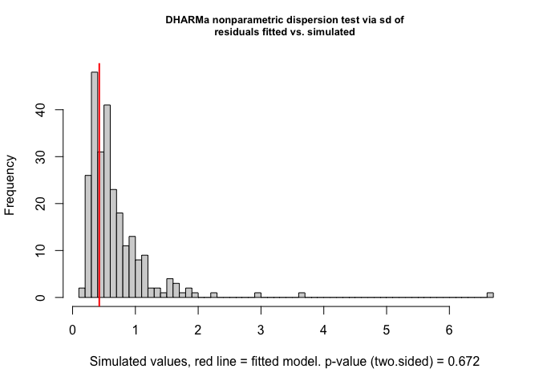<!-- -->

    ## 
    ##  DHARMa nonparametric dispersion test via sd of residuals fitted vs.
    ##  simulated
    ## 
    ## data:  simulationOutput
    ## dispersion = 0.62589, p-value = 0.672
    ## alternative hypothesis: two.sided

``` r
DHARMa::testZeroInflation(weed_interrow_glmm)
```

<!-- -->

    ## 
    ##  DHARMa zero-inflation test via comparison to expected zeros with
    ##  simulation under H0 = fitted model
    ## 
    ## data:  simulationOutput
    ## ratioObsSim = 0.98336, p-value = 1
    ## alternative hypothesis: two.sided

``` r
car::Anova(weed_interrow_glmm, type = 3)
```

    ## Analysis of Deviance Table (Type III Wald chisquare tests)
    ## 
    ## Response: interrow_weed_biomass_kg_ha
    ##                      Chisq Df Pr(>Chisq)    
    ## (Intercept)        238.332  1  < 2.2e-16 ***
    ## weed_trt            45.959  4  2.512e-09 ***
    ## site_year            9.057  2    0.01080 *  
    ## weed_trt:site_year  23.604  8    0.00267 ** 
    ## ---
    ## Signif. codes:  0 '***' 0.001 '**' 0.01 '*' 0.05 '.' 0.1 ' ' 1

##### Post-hoc summary table

``` r
### Interrow weed biomass (kg ha⁻¹) with Fisher's LSD CLDs (by site-year)

# Because weed_trt × site_year is (potentially) important, we summarise treatment
# effects within each site-year on the response scale (kg ha⁻¹).

# Estimated marginal means for weed_trt within site_year (response scale)
emm_interrow_sy <- emmeans(
  weed_interrow_glmm,
  ~ weed_trt | site_year,
  type = "response"   # back-transform from link scale
)

# Tidy emmeans for reporting (kg ha⁻¹)
emm_interrow_sy_df <- summary(emm_interrow_sy) |>
  as_tibble() |>
  mutate(
    site_year = factor(site_year),
    weed_trt  = factor(weed_trt, levels = mow_levels)
  ) |>
  rename(
    emmean = response,   # mean on response scale
    ci_low = asymp.LCL,  # lower CI
    ci_high = asymp.UCL  # upper CI
  )

# Compact letter display (Fisher's LSD, no adjustment; "a" = highest within each site-year)
cld_interrow_sy <- cld(
  emm_interrow_sy,
  adjust   = "none",
  Letters  = letters,
  sort     = TRUE,
  reversed = TRUE          # so "a" = highest biomass group(s)
) |>
  as_tibble() |>
  mutate(
    site_year = factor(site_year),
    weed_trt  = factor(weed_trt, levels = mow_levels),
    .group    = str_trim(.group)
  ) |>
  select(site_year, weed_trt, .group)

# Join emmeans + CLDs and format for reporting
table_interrow_sy <- emm_interrow_sy_df |>
  left_join(cld_interrow_sy, by = c("site_year", "weed_trt")) |>
  select(site_year, weed_trt, emmean, SE, ci_low, ci_high, .group) |>
  mutate(
    across(c(emmean, SE, ci_low, ci_high), ~ round(.x, 1))
  ) |>
  arrange(site_year, weed_trt)

table_interrow_sy |>
  kable(
    caption   = "Estimated interrow weed biomass (kg ha⁻¹) by treatment within site-year (response scale) with 95% CI and Fisher's LSD group letters",
    col.names = c("Site-year", "Treatment", "Mean", "SE", "Lower CI", "Upper CI", "Group")
  ) |>
  kable_styling(full_width = FALSE, bootstrap_options = c("striped", "hover"))
```

<table class="table table-striped table-hover" style="color: black; width: auto !important; margin-left: auto; margin-right: auto;">

<caption>

Estimated interrow weed biomass (kg ha⁻¹) by treatment within site-year
(response scale) with 95% CI and Fisher’s LSD group letters
</caption>

<thead>

<tr>

<th style="text-align:left;">

Site-year
</th>

<th style="text-align:left;">

Treatment
</th>

<th style="text-align:right;">

Mean
</th>

<th style="text-align:right;">

SE
</th>

<th style="text-align:right;">

Lower CI
</th>

<th style="text-align:right;">

Upper CI
</th>

<th style="text-align:left;">

Group
</th>

</tr>

</thead>

<tbody>

<tr>

<td style="text-align:left;">

2024.field O2 east
</td>

<td style="text-align:left;">

Rolled, no control
</td>

<td style="text-align:right;">

105.4
</td>

<td style="text-align:right;">

70.3
</td>

<td style="text-align:right;">

28.5
</td>

<td style="text-align:right;">

389.6
</td>

<td style="text-align:left;">

a
</td>

</tr>

<tr>

<td style="text-align:left;">

2024.field O2 east
</td>

<td style="text-align:left;">

Rolled, mowing
</td>

<td style="text-align:right;">

24.1
</td>

<td style="text-align:right;">

18.4
</td>

<td style="text-align:right;">

5.4
</td>

<td style="text-align:right;">

108.0
</td>

<td style="text-align:left;">

ab
</td>

</tr>

<tr>

<td style="text-align:left;">

2024.field O2 east
</td>

<td style="text-align:left;">

Rolled, high-residue cultivation
</td>

<td style="text-align:right;">

1.7
</td>

<td style="text-align:right;">

2.0
</td>

<td style="text-align:right;">

0.2
</td>

<td style="text-align:right;">

17.6
</td>

<td style="text-align:left;">

b
</td>

</tr>

<tr>

<td style="text-align:left;">

2024.field O2 east
</td>

<td style="text-align:left;">

Tilled, mowing
</td>

<td style="text-align:right;">

120.3
</td>

<td style="text-align:right;">

72.2
</td>

<td style="text-align:right;">

37.1
</td>

<td style="text-align:right;">

389.9
</td>

<td style="text-align:left;">

a
</td>

</tr>

<tr>

<td style="text-align:left;">

2024.field O2 east
</td>

<td style="text-align:left;">

Tilled, cultivation
</td>

<td style="text-align:right;">

25.4
</td>

<td style="text-align:right;">

20.7
</td>

<td style="text-align:right;">

5.2
</td>

<td style="text-align:right;">

125.4
</td>

<td style="text-align:left;">

ab
</td>

</tr>

<tr>

<td style="text-align:left;">

2024.field O2 west
</td>

<td style="text-align:left;">

Rolled, no control
</td>

<td style="text-align:right;">

187.0
</td>

<td style="text-align:right;">

115.2
</td>

<td style="text-align:right;">

55.9
</td>

<td style="text-align:right;">

625.5
</td>

<td style="text-align:left;">

a
</td>

</tr>

<tr>

<td style="text-align:left;">

2024.field O2 west
</td>

<td style="text-align:left;">

Rolled, mowing
</td>

<td style="text-align:right;">

19.8
</td>

<td style="text-align:right;">

16.1
</td>

<td style="text-align:right;">

4.1
</td>

<td style="text-align:right;">

97.3
</td>

<td style="text-align:left;">

b
</td>

</tr>

<tr>

<td style="text-align:left;">

2024.field O2 west
</td>

<td style="text-align:left;">

Rolled, high-residue cultivation
</td>

<td style="text-align:right;">

186.0
</td>

<td style="text-align:right;">

112.5
</td>

<td style="text-align:right;">

56.9
</td>

<td style="text-align:right;">

608.3
</td>

<td style="text-align:left;">

a
</td>

</tr>

<tr>

<td style="text-align:left;">

2024.field O2 west
</td>

<td style="text-align:left;">

Tilled, mowing
</td>

<td style="text-align:right;">

156.9
</td>

<td style="text-align:right;">

89.8
</td>

<td style="text-align:right;">

51.1
</td>

<td style="text-align:right;">

481.6
</td>

<td style="text-align:left;">

a
</td>

</tr>

<tr>

<td style="text-align:left;">

2024.field O2 west
</td>

<td style="text-align:left;">

Tilled, cultivation
</td>

<td style="text-align:right;">

0.4
</td>

<td style="text-align:right;">

0.6
</td>

<td style="text-align:right;">

0.0
</td>

<td style="text-align:right;">

8.2
</td>

<td style="text-align:left;">

c
</td>

</tr>

<tr>

<td style="text-align:left;">

2023.field v
</td>

<td style="text-align:left;">

Rolled, no control
</td>

<td style="text-align:right;">

356.7
</td>

<td style="text-align:right;">

182.9
</td>

<td style="text-align:right;">

130.6
</td>

<td style="text-align:right;">

974.4
</td>

<td style="text-align:left;">

a
</td>

</tr>

<tr>

<td style="text-align:left;">

2023.field v
</td>

<td style="text-align:left;">

Rolled, mowing
</td>

<td style="text-align:right;">

131.7
</td>

<td style="text-align:right;">

76.1
</td>

<td style="text-align:right;">

42.5
</td>

<td style="text-align:right;">

408.5
</td>

<td style="text-align:left;">

a
</td>

</tr>

<tr>

<td style="text-align:left;">

2023.field v
</td>

<td style="text-align:left;">

Rolled, high-residue cultivation
</td>

<td style="text-align:right;">

286.0
</td>

<td style="text-align:right;">

147.0
</td>

<td style="text-align:right;">

104.5
</td>

<td style="text-align:right;">

783.1
</td>

<td style="text-align:left;">

a
</td>

</tr>

<tr>

<td style="text-align:left;">

2023.field v
</td>

<td style="text-align:left;">

Tilled, mowing
</td>

<td style="text-align:right;">

503.2
</td>

<td style="text-align:right;">

237.7
</td>

<td style="text-align:right;">

199.3
</td>

<td style="text-align:right;">

1270.3
</td>

<td style="text-align:left;">

a
</td>

</tr>

<tr>

<td style="text-align:left;">

2023.field v
</td>

<td style="text-align:left;">

Tilled, cultivation
</td>

<td style="text-align:right;">

3.2
</td>

<td style="text-align:right;">

3.5
</td>

<td style="text-align:right;">

0.4
</td>

<td style="text-align:right;">

27.1
</td>

<td style="text-align:left;">

b
</td>

</tr>

</tbody>

</table>

##### ANOVA-style summary tables

``` r
## 1) P-value summary (Location, Treatment, Interaction) -----------------

# Type-III tests for the selected interrow GLMM
anova_interrow <- Anova(weed_interrow_glmm, type = 3)

anova_interrow_df <- anova_interrow |>
  as.data.frame() |>
  tibble::rownames_to_column("Effect")

# Extract Wald p-values from the selected model
p_site_interrow <- anova_interrow_df$`Pr(>Chisq)`[anova_interrow_df$Effect == "site_year"]
p_trt_interrow  <- anova_interrow_df$`Pr(>Chisq)`[anova_interrow_df$Effect == "weed_trt"]
p_int_interrow  <- anova_interrow_df$`Pr(>Chisq)`[anova_interrow_df$Effect == "weed_trt:site_year"]

# Always include Location and Treatment rows
pvals_interrow <- tibble(
  Effect = c(
    "Location (site_year)",
    "Treatment (weed_trt)"
  ),
  p_raw = c(p_site_interrow, p_trt_interrow)
)

# Only include the interaction row if the interaction model was selected
if (chosen_model_name_interrow == "Interaction: weed_trt * site_year") {
  pvals_interrow <- bind_rows(
    pvals_interrow,
    tibble(
      Effect = "Location × Treatment",
      p_raw  = p_int_interrow
    )
  )
}

pvals_interrow <- pvals_interrow |>
  mutate(
    `P-value` = case_when(
      p_raw < 0.001 ~ "<0.001",
      p_raw < 0.01  ~ "<0.01",
      TRUE          ~ sprintf("%.3f", p_raw)
    )
  ) |>
  select(Effect, `P-value`)

pvals_interrow |>
  kable(
    caption   = "Interrow weed biomass (kg ha⁻¹): P-values for location and treatment (and interaction if included in the selected model)",
    col.names = c("Effect", "P-value")
  ) |>
  kable_styling(full_width = FALSE, bootstrap_options = c("striped", "hover"))
```

<table class="table table-striped table-hover" style="color: black; width: auto !important; margin-left: auto; margin-right: auto;">

<caption>

Interrow weed biomass (kg ha⁻¹): P-values for location and treatment
(and interaction if included in the selected model)
</caption>

<thead>

<tr>

<th style="text-align:left;">

Effect
</th>

<th style="text-align:left;">

P-value
</th>

</tr>

</thead>

<tbody>

<tr>

<td style="text-align:left;">

Location (site_year)
</td>

<td style="text-align:left;">

0.011
</td>

</tr>

<tr>

<td style="text-align:left;">

Treatment (weed_trt)
</td>

<td style="text-align:left;">

\<0.001
</td>

</tr>

<tr>

<td style="text-align:left;">

Location × Treatment
</td>

<td style="text-align:left;">

\<0.01
</td>

</tr>

</tbody>

</table>

``` r
## 1b) Likelihood-ratio test: additive vs interaction -------------------

lrt_table_interrow <- tibble(
  Test    = "LRT (additive vs interaction)",
  p_raw   = lrt_interrow$`Pr(>Chisq)`[2]
) |>
  mutate(
    `P-value` = case_when(
      p_raw < 0.001 ~ "<0.001",
      p_raw < 0.01  ~ "<0.01",
      TRUE          ~ sprintf("%.3f", p_raw)
    )
  ) |>
  select(Test, `P-value`)

lrt_table_interrow |>
  kable(
    caption   = "Interrow weed biomass (kg ha⁻¹): Likelihood-ratio test comparing additive vs interaction models",
    col.names = c("Test", "P-value")
  ) |>
  kable_styling(full_width = FALSE, bootstrap_options = c("striped", "hover"))
```

<table class="table table-striped table-hover" style="color: black; width: auto !important; margin-left: auto; margin-right: auto;">

<caption>

Interrow weed biomass (kg ha⁻¹): Likelihood-ratio test comparing
additive vs interaction models
</caption>

<thead>

<tr>

<th style="text-align:left;">

Test
</th>

<th style="text-align:left;">

P-value
</th>

</tr>

</thead>

<tbody>

<tr>

<td style="text-align:left;">

LRT (additive vs interaction)
</td>

<td style="text-align:left;">

\<0.01
</td>

</tr>

</tbody>

</table>

``` r
## 2) Location block: site-year means (model + raw) ----------------------

# Model-based emmeans by site_year (response scale)
emm_loc_interrow <- emmeans(
  weed_interrow_glmm,
  ~ site_year,
  type = "response"
)

emm_loc_interrow_df <- summary(emm_loc_interrow) |>
  as_tibble() |>
  mutate(
    site_year  = as.factor(site_year),
    model_mean = response
  ) |>
  select(site_year, model_mean)

# CLDs for site_year (a = highest)
cld_loc_interrow <- cld(
  emm_loc_interrow,
  adjust   = "none",
  Letters  = letters,
  sort     = TRUE,
  reversed = TRUE
) |>
  as_tibble() |>
  mutate(
    site_year = as.factor(site_year),
    loc_CLD   = str_trim(.group)
  ) |>
  select(site_year, loc_CLD)

# Raw means by site_year
raw_loc_interrow <- weed_biomass_clean |>
  group_by(site_year) |>
  summarise(
    raw_mean = mean(interrow_weed_biomass_kg_ha, na.rm = TRUE),
    .groups  = "drop"
  ) |>
  mutate(site_year = as.factor(site_year))

loc_summary_interrow <- emm_loc_interrow_df |>
  left_join(cld_loc_interrow, by = "site_year") |>
  left_join(raw_loc_interrow, by = "site_year") |>
  mutate(
    model_mean = round(model_mean, 1),
    raw_mean   = round(raw_mean, 1),
    raw_CLD    = loc_CLD
  ) |>
  arrange(site_year)

loc_summary_interrow |>
  kable(
    caption   = "Interrow weed biomass (kg ha⁻¹): location (site-year) means with CLDs",
    col.names = c("Site-year", "Model mean", "Model CLD", "Raw mean", "Raw CLD")
  ) |>
  kable_styling(full_width = FALSE, bootstrap_options = c("striped", "hover"))
```

<table class="table table-striped table-hover" style="color: black; width: auto !important; margin-left: auto; margin-right: auto;">

<caption>

Interrow weed biomass (kg ha⁻¹): location (site-year) means with CLDs
</caption>

<thead>

<tr>

<th style="text-align:left;">

Site-year
</th>

<th style="text-align:right;">

Model mean
</th>

<th style="text-align:left;">

Model CLD
</th>

<th style="text-align:right;">

Raw mean
</th>

<th style="text-align:left;">

Raw CLD
</th>

</tr>

</thead>

<tbody>

<tr>

<td style="text-align:left;">

2024.field O2 east
</td>

<td style="text-align:right;">

26.5
</td>

<td style="text-align:left;">

b
</td>

<td style="text-align:right;">

59.4
</td>

<td style="text-align:left;">

b
</td>

</tr>

<tr>

<td style="text-align:left;">

2024.field O2 west
</td>

<td style="text-align:right;">

34.1
</td>

<td style="text-align:left;">

b
</td>

<td style="text-align:right;">

120.9
</td>

<td style="text-align:left;">

b
</td>

</tr>

<tr>

<td style="text-align:left;">

2023.field v
</td>

<td style="text-align:right;">

116.8
</td>

<td style="text-align:left;">

a
</td>

<td style="text-align:right;">

269.3
</td>

<td style="text-align:left;">

a
</td>

</tr>

</tbody>

</table>

``` r
## 3) Treatment block: means (model + raw) -------------------------------

# emmeans for treatment (response scale)
emm_interrow <- emmeans(
  weed_interrow_glmm,
  ~ weed_trt,
  type = "response"
)

emm_trt_interrow_df <- summary(emm_interrow) |>
  as_tibble() |>
  mutate(
    weed_trt   = factor(weed_trt, levels = mow_levels),
    model_mean = response
  ) |>
  select(weed_trt, model_mean)

# CLDs for treatment (a = highest)
cld_interrow <- cld(
  emm_interrow,
  adjust   = "none",
  Letters  = letters,
  sort     = TRUE,
  reversed = TRUE
) |>
  as_tibble() |>
  mutate(
    weed_trt = factor(weed_trt, levels = mow_levels),
    trt_CLD  = str_trim(.group)
  ) |>
  select(weed_trt, trt_CLD)

# Raw means by treatment
raw_trt_interrow <- weed_biomass_clean |>
  group_by(weed_trt) |>
  summarise(
    raw_mean = mean(interrow_weed_biomass_kg_ha, na.rm = TRUE),
    .groups  = "drop"
  ) |>
  mutate(weed_trt = factor(weed_trt, levels = mow_levels))

trt_summary_interrow <- emm_trt_interrow_df |>
  left_join(cld_interrow, by = "weed_trt") |>
  left_join(raw_trt_interrow, by = "weed_trt") |>
  mutate(
    model_mean = round(model_mean, 1),
    raw_mean   = round(raw_mean, 1),
    raw_CLD    = trt_CLD
  ) |>
  arrange(weed_trt)

trt_summary_interrow |>
  kable(
    caption   = "Interrow weed biomass (kg ha⁻¹): treatment means with CLDs",
    col.names = c("Treatment", "Model mean", "Model CLD", "Raw mean", "Raw CLD")
  ) |>
  kable_styling(full_width = FALSE, bootstrap_options = c("striped", "hover"))
```

<table class="table table-striped table-hover" style="color: black; width: auto !important; margin-left: auto; margin-right: auto;">

<caption>

Interrow weed biomass (kg ha⁻¹): treatment means with CLDs
</caption>

<thead>

<tr>

<th style="text-align:left;">

Treatment
</th>

<th style="text-align:right;">

Model mean
</th>

<th style="text-align:left;">

Model CLD
</th>

<th style="text-align:right;">

Raw mean
</th>

<th style="text-align:left;">

Raw CLD
</th>

</tr>

</thead>

<tbody>

<tr>

<td style="text-align:left;">

Rolled, no control
</td>

<td style="text-align:right;">

191.6
</td>

<td style="text-align:left;">

a
</td>

<td style="text-align:right;">

246.9
</td>

<td style="text-align:left;">

a
</td>

</tr>

<tr>

<td style="text-align:left;">

Rolled, mowing
</td>

<td style="text-align:right;">

39.8
</td>

<td style="text-align:left;">

b
</td>

<td style="text-align:right;">

59.6
</td>

<td style="text-align:left;">

b
</td>

</tr>

<tr>

<td style="text-align:left;">

Rolled, high-residue cultivation
</td>

<td style="text-align:right;">

44.8
</td>

<td style="text-align:left;">

b
</td>

<td style="text-align:right;">

169.9
</td>

<td style="text-align:left;">

b
</td>

</tr>

<tr>

<td style="text-align:left;">

Tilled, mowing
</td>

<td style="text-align:right;">

211.8
</td>

<td style="text-align:left;">

a
</td>

<td style="text-align:right;">

261.4
</td>

<td style="text-align:left;">

a
</td>

</tr>

<tr>

<td style="text-align:left;">

Tilled, cultivation
</td>

<td style="text-align:right;">

3.3
</td>

<td style="text-align:left;">

c
</td>

<td style="text-align:right;">

11.6
</td>

<td style="text-align:left;">

c
</td>

</tr>

</tbody>

</table>

``` r
## 4) Interaction block: site-year × treatment means ---------------------

# Model emmeans by treatment within site_year (response scale)
emm_sy_interrow <- emmeans(
  weed_interrow_glmm,
  ~ weed_trt | site_year,
  type = "response"
)

emm_sy_interrow_df <- summary(emm_sy_interrow) |>
  as_tibble() |>
  mutate(
    weed_trt   = factor(weed_trt, levels = mow_levels),
    site_year  = as.factor(site_year),
    model_mean = response
  ) |>
  select(site_year, weed_trt, model_mean)

# CLDs within each site_year (a = highest within that site_year)
cld_sy_interrow <- cld(
  emm_sy_interrow,
  adjust   = "none",
  Letters  = letters,
  sort     = TRUE,
  reversed = TRUE
) |>
  as_tibble() |>
  mutate(
    weed_trt  = factor(weed_trt, levels = mow_levels),
    site_year = as.factor(site_year),
    int_CLD   = str_trim(.group)
  ) |>
  select(site_year, weed_trt, int_CLD)

# Raw means by site_year × treatment
raw_sy_interrow <- weed_biomass_clean |>
  group_by(site_year, weed_trt) |>
  summarise(
    raw_mean = mean(interrow_weed_biomass_kg_ha, na.rm = TRUE),
    .groups  = "drop"
  ) |>
  mutate(
    site_year = as.factor(site_year),
    weed_trt  = factor(weed_trt, levels = mow_levels)
  )

int_summary_interrow <- emm_sy_interrow_df |>
  left_join(cld_sy_interrow, by = c("site_year", "weed_trt")) |>
  left_join(raw_sy_interrow, by = c("site_year", "weed_trt")) |>
  mutate(
    model_mean = round(model_mean, 1),
    raw_mean   = round(raw_mean, 1),
    raw_CLD    = int_CLD
  ) |>
  arrange(site_year, weed_trt)

int_summary_interrow |>
  kable(
    caption   = "Interrow weed biomass (kg ha⁻¹): site-year × treatment means with CLDs",
    col.names = c(
      "Site-year", "Treatment",
      "Model mean", "Model CLD",
      "Raw mean",   "Raw CLD"
    )
  ) |>
  kable_styling(full_width = FALSE, bootstrap_options = c("striped", "hover"))
```

<table class="table table-striped table-hover" style="color: black; width: auto !important; margin-left: auto; margin-right: auto;">

<caption>

Interrow weed biomass (kg ha⁻¹): site-year × treatment means with CLDs
</caption>

<thead>

<tr>

<th style="text-align:left;">

Site-year
</th>

<th style="text-align:left;">

Treatment
</th>

<th style="text-align:right;">

Model mean
</th>

<th style="text-align:left;">

Model CLD
</th>

<th style="text-align:right;">

Raw mean
</th>

<th style="text-align:left;">

Raw CLD
</th>

</tr>

</thead>

<tbody>

<tr>

<td style="text-align:left;">

2024.field O2 east
</td>

<td style="text-align:left;">

Rolled, no control
</td>

<td style="text-align:right;">

105.4
</td>

<td style="text-align:left;">

a
</td>

<td style="text-align:right;">

124.8
</td>

<td style="text-align:left;">

a
</td>

</tr>

<tr>

<td style="text-align:left;">

2024.field O2 east
</td>

<td style="text-align:left;">

Rolled, mowing
</td>

<td style="text-align:right;">

24.1
</td>

<td style="text-align:left;">

ab
</td>

<td style="text-align:right;">

24.1
</td>

<td style="text-align:left;">

ab
</td>

</tr>

<tr>

<td style="text-align:left;">

2024.field O2 east
</td>

<td style="text-align:left;">

Rolled, high-residue cultivation
</td>

<td style="text-align:right;">

1.7
</td>

<td style="text-align:left;">

b
</td>

<td style="text-align:right;">

1.7
</td>

<td style="text-align:left;">

b
</td>

</tr>

<tr>

<td style="text-align:left;">

2024.field O2 east
</td>

<td style="text-align:left;">

Tilled, mowing
</td>

<td style="text-align:right;">

120.3
</td>

<td style="text-align:left;">

a
</td>

<td style="text-align:right;">

116.0
</td>

<td style="text-align:left;">

a
</td>

</tr>

<tr>

<td style="text-align:left;">

2024.field O2 east
</td>

<td style="text-align:left;">

Tilled, cultivation
</td>

<td style="text-align:right;">

25.4
</td>

<td style="text-align:left;">

ab
</td>

<td style="text-align:right;">

30.4
</td>

<td style="text-align:left;">

ab
</td>

</tr>

<tr>

<td style="text-align:left;">

2024.field O2 west
</td>

<td style="text-align:left;">

Rolled, no control
</td>

<td style="text-align:right;">

187.0
</td>

<td style="text-align:left;">

a
</td>

<td style="text-align:right;">

220.8
</td>

<td style="text-align:left;">

a
</td>

</tr>

<tr>

<td style="text-align:left;">

2024.field O2 west
</td>

<td style="text-align:left;">

Rolled, mowing
</td>

<td style="text-align:right;">

19.8
</td>

<td style="text-align:left;">

b
</td>

<td style="text-align:right;">

22.8
</td>

<td style="text-align:left;">

b
</td>

</tr>

<tr>

<td style="text-align:left;">

2024.field O2 west
</td>

<td style="text-align:left;">

Rolled, high-residue cultivation
</td>

<td style="text-align:right;">

186.0
</td>

<td style="text-align:left;">

a
</td>

<td style="text-align:right;">

214.5
</td>

<td style="text-align:left;">

a
</td>

</tr>

<tr>

<td style="text-align:left;">

2024.field O2 west
</td>

<td style="text-align:left;">

Tilled, mowing
</td>

<td style="text-align:right;">

156.9
</td>

<td style="text-align:left;">

a
</td>

<td style="text-align:right;">

146.0
</td>

<td style="text-align:left;">

a
</td>

</tr>

<tr>

<td style="text-align:left;">

2024.field O2 west
</td>

<td style="text-align:left;">

Tilled, cultivation
</td>

<td style="text-align:right;">

0.4
</td>

<td style="text-align:left;">

c
</td>

<td style="text-align:right;">

0.5
</td>

<td style="text-align:left;">

c
</td>

</tr>

<tr>

<td style="text-align:left;">

2023.field v
</td>

<td style="text-align:left;">

Rolled, no control
</td>

<td style="text-align:right;">

356.7
</td>

<td style="text-align:left;">

a
</td>

<td style="text-align:right;">

395.3
</td>

<td style="text-align:left;">

a
</td>

</tr>

<tr>

<td style="text-align:left;">

2023.field v
</td>

<td style="text-align:left;">

Rolled, mowing
</td>

<td style="text-align:right;">

131.7
</td>

<td style="text-align:left;">

a
</td>

<td style="text-align:right;">

131.9
</td>

<td style="text-align:left;">

a
</td>

</tr>

<tr>

<td style="text-align:left;">

2023.field v
</td>

<td style="text-align:left;">

Rolled, high-residue cultivation
</td>

<td style="text-align:right;">

286.0
</td>

<td style="text-align:left;">

a
</td>

<td style="text-align:right;">

293.3
</td>

<td style="text-align:left;">

a
</td>

</tr>

<tr>

<td style="text-align:left;">

2023.field v
</td>

<td style="text-align:left;">

Tilled, mowing
</td>

<td style="text-align:right;">

503.2
</td>

<td style="text-align:left;">

a
</td>

<td style="text-align:right;">

522.1
</td>

<td style="text-align:left;">

a
</td>

</tr>

<tr>

<td style="text-align:left;">

2023.field v
</td>

<td style="text-align:left;">

Tilled, cultivation
</td>

<td style="text-align:right;">

3.2
</td>

<td style="text-align:left;">

b
</td>

<td style="text-align:right;">

3.8
</td>

<td style="text-align:left;">

b
</td>

</tr>

</tbody>

</table>

#### 2023

``` r
#### 2023 Field V — interrow weed biomass: model testing / selection

options(contrasts = c("contr.sum", "contr.poly"))

# Model formula: interrow instead of total (single site-year, so no site_year term)
form_v23_interrow <- interrow_weed_biomass_kg_ha ~ weed_trt + (1 | block)

## 1) Candidate families / structures -----------------------------------

m_v23_interrow_tw <- glmmTMB(
  formula = form_v23_interrow,
  family  = tweedie(link = "log"),
  data    = weed_biomass_field_v_2023
)

m_v23_interrow_nb <- glmmTMB(
  formula = form_v23_interrow,
  family  = nbinom2(link = "log"),
  data    = weed_biomass_field_v_2023
)

m_v23_interrow_tw_zi <- glmmTMB(
  formula   = form_v23_interrow,
  family    = tweedie(link = "log"),
  ziformula = ~ 1,
  data      = weed_biomass_field_v_2023
)

## 2) NA-safe AIC helper -------------------------------------------------

safe_aic <- function(mod) {
  out <- try(AIC(mod), silent = TRUE)
  if (inherits(out, "try-error")) return(NA_real_)
  out
}

aic_v23_interrow <- tibble(
  model = c(
    "V23 INTERROW: Tweedie",
    "V23 INTERROW: NB2",
    "V23 INTERROW: Tweedie + ZI"
  ),
  AIC = c(
    safe_aic(m_v23_interrow_tw),
    safe_aic(m_v23_interrow_nb),
    safe_aic(m_v23_interrow_tw_zi)
  )
)

## 3) Pick best family (require > 2 AIC units better) -------------------

best_v23_interrow      <- m_v23_interrow_tw
best_v23_interrow_name <- "V23 INTERROW: Tweedie"
best_aic_v23_interrow  <- safe_aic(m_v23_interrow_tw)

# Start from Tweedie and only move if clearly better (> 2 AIC units)
cands_v23_interrow <- list(
  "V23 INTERROW: NB2"          = m_v23_interrow_nb,
  "V23 INTERROW: Tweedie + ZI" = m_v23_interrow_tw_zi
)

for (nm in names(cands_v23_interrow)) {
  this_aic <- safe_aic(cands_v23_interrow[[nm]])
  if (is.finite(this_aic) && (this_aic + 2 < best_aic_v23_interrow)) {
    best_v23_interrow      <- cands_v23_interrow[[nm]]
    best_v23_interrow_name <- nm
    best_aic_v23_interrow  <- this_aic
  }
}

aic_v23_interrow_out <- aic_v23_interrow |>
  mutate(
    deltaAIC = AIC - min(AIC, na.rm = TRUE),
    Selected = if_else(model == best_v23_interrow_name, "Yes", "")
  )

kable(
  aic_v23_interrow_out,
  digits  = 2,
  caption = "Interrow weed biomass (kg ha⁻¹), 2023 Field V: model comparison (Tweedie vs NB2 vs Tweedie + ZI)"
) |>
  kable_styling(full_width = FALSE, bootstrap_options = c("striped", "hover"))
```

<table class="table table-striped table-hover" style="color: black; width: auto !important; margin-left: auto; margin-right: auto;">

<caption>

Interrow weed biomass (kg ha⁻¹), 2023 Field V: model comparison (Tweedie
vs NB2 vs Tweedie + ZI)
</caption>

<thead>

<tr>

<th style="text-align:left;">

model
</th>

<th style="text-align:right;">

AIC
</th>

<th style="text-align:right;">

deltaAIC
</th>

<th style="text-align:left;">

Selected
</th>

</tr>

</thead>

<tbody>

<tr>

<td style="text-align:left;">

V23 INTERROW: Tweedie
</td>

<td style="text-align:right;">

240.72
</td>

<td style="text-align:right;">

0.00
</td>

<td style="text-align:left;">

Yes
</td>

</tr>

<tr>

<td style="text-align:left;">

V23 INTERROW: NB2
</td>

<td style="text-align:right;">

244.56
</td>

<td style="text-align:right;">

3.85
</td>

<td style="text-align:left;">

</td>

</tr>

<tr>

<td style="text-align:left;">

V23 INTERROW: Tweedie + ZI
</td>

<td style="text-align:right;">

242.72
</td>

<td style="text-align:right;">

2.00
</td>

<td style="text-align:left;">

</td>

</tr>

</tbody>

</table>

``` r
cat(
  "\nSelected model for 2023 Field V interrow weed biomass (used in downstream emmeans/plots):\n  ",
  best_v23_interrow_name,
  sprintf("  [AIC = %.2f]\n", best_aic_v23_interrow)
)
```

    ## 
    ## Selected model for 2023 Field V interrow weed biomass (used in downstream emmeans/plots):
    ##    V23 INTERROW: Tweedie   [AIC = 240.72]

``` r
# Store final model object for later use
weed_interrow_glmm_v23 <- best_v23_interrow

## 4) Diagnostics + Type-III tests --------------------------------------

set.seed(123)
res_v23_interrow <- DHARMa::simulateResiduals(weed_interrow_glmm_v23)
plot(res_v23_interrow)
```

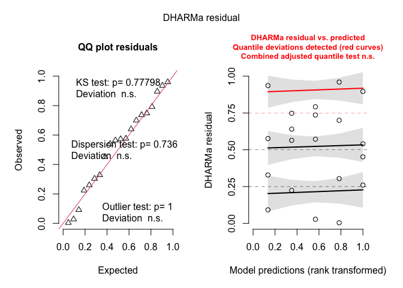<!-- -->

``` r
DHARMa::testDispersion(weed_interrow_glmm_v23)
```

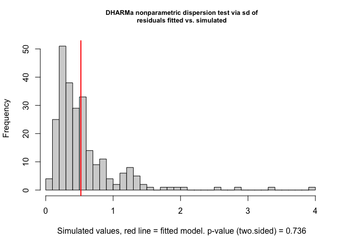<!-- -->

    ## 
    ##  DHARMa nonparametric dispersion test via sd of residuals fitted vs.
    ##  simulated
    ## 
    ## data:  simulationOutput
    ## dispersion = 0.92808, p-value = 0.736
    ## alternative hypothesis: two.sided

``` r
DHARMa::testZeroInflation(weed_interrow_glmm_v23)
```

<!-- -->

    ## 
    ##  DHARMa zero-inflation test via comparison to expected zeros with
    ##  simulation under H0 = fitted model
    ## 
    ## data:  simulationOutput
    ## ratioObsSim = 0.97466, p-value = 1
    ## alternative hypothesis: two.sided

``` r
car::Anova(weed_interrow_glmm_v23, type = 3)
```

    ## Analysis of Deviance Table (Type III Wald chisquare tests)
    ## 
    ## Response: interrow_weed_biomass_kg_ha
    ##               Chisq Df Pr(>Chisq)    
    ## (Intercept) 250.718  1  < 2.2e-16 ***
    ## weed_trt     41.905  4  1.746e-08 ***
    ## ---
    ## Signif. codes:  0 '***' 0.001 '**' 0.01 '*' 0.05 '.' 0.1 ' ' 1

##### Post-hoc summary table

``` r
### Interrow weed biomass (kg ha⁻¹), 2023 Field V — Fisher's LSD CLDs

# Estimated marginal means for weed_trt on the response scale (kg/ha)
emm_interrow_v23 <- emmeans(
  weed_interrow_glmm_v23,
  ~ weed_trt,
  type = "response"   # back-transform from link scale
)

# Tidy emmeans for reporting (rename columns to match other RMDs)
emm_interrow_v23_df <- as_tibble(emm_interrow_v23) |>
  mutate(
    weed_trt = factor(weed_trt, levels = mow_levels)
  ) |>
  rename(
    emmean = response,     # mean on response scale (kg/ha)
    ci_low = asymp.LCL,    # lower CI
    ci_high = asymp.UCL    # upper CI
  )

# Compact letter display (Fisher's LSD, no adjustment; "a" = highest)
cld_interrow_v23 <- cld(
  emm_interrow_v23,
  adjust   = "none",
  Letters  = letters,
  sort     = TRUE,
  reversed = TRUE   # so "a" = highest biomass group(s)
) |>
  as_tibble() |>
  mutate(
    weed_trt = factor(weed_trt, levels = mow_levels),
    .group   = str_trim(.group)
  ) |>
  select(weed_trt, .group)

# Join emmeans + CLDs and format for reporting
emm_interrow_v23_df |>
  left_join(cld_interrow_v23, by = "weed_trt") |>
  select(weed_trt, emmean, SE, ci_low, ci_high, .group) |>
  mutate(
    across(c(emmean, SE, ci_low, ci_high), ~ round(.x, 1))
  ) |>
  kable(
    caption   = "Estimated interrow weed biomass (kg ha⁻¹) in 2023 Field V with 95% CI and Fisher's LSD group letters",
    col.names = c("Treatment", "Mean", "SE", "Lower CI", "Upper CI", "Group")
  ) |>
  kable_styling(full_width = FALSE, bootstrap_options = c("striped", "hover"))
```

<table class="table table-striped table-hover" style="color: black; width: auto !important; margin-left: auto; margin-right: auto;">

<caption>

Estimated interrow weed biomass (kg ha⁻¹) in 2023 Field V with 95% CI
and Fisher’s LSD group letters
</caption>

<thead>

<tr>

<th style="text-align:left;">

Treatment
</th>

<th style="text-align:right;">

Mean
</th>

<th style="text-align:right;">

SE
</th>

<th style="text-align:right;">

Lower CI
</th>

<th style="text-align:right;">

Upper CI
</th>

<th style="text-align:left;">

Group
</th>

</tr>

</thead>

<tbody>

<tr>

<td style="text-align:left;">

Rolled, no control
</td>

<td style="text-align:right;">

336.2
</td>

<td style="text-align:right;">

112.8
</td>

<td style="text-align:right;">

174.2
</td>

<td style="text-align:right;">

648.9
</td>

<td style="text-align:left;">

a
</td>

</tr>

<tr>

<td style="text-align:left;">

Rolled, mowing
</td>

<td style="text-align:right;">

127.5
</td>

<td style="text-align:right;">

49.1
</td>

<td style="text-align:right;">

59.9
</td>

<td style="text-align:right;">

271.4
</td>

<td style="text-align:left;">

b
</td>

</tr>

<tr>

<td style="text-align:left;">

Rolled, high-residue cultivation
</td>

<td style="text-align:right;">

276.0
</td>

<td style="text-align:right;">

93.8
</td>

<td style="text-align:right;">

141.8
</td>

<td style="text-align:right;">

537.4
</td>

<td style="text-align:left;">

ab
</td>

</tr>

<tr>

<td style="text-align:left;">

Tilled, mowing
</td>

<td style="text-align:right;">

484.3
</td>

<td style="text-align:right;">

151.9
</td>

<td style="text-align:right;">

261.9
</td>

<td style="text-align:right;">

895.4
</td>

<td style="text-align:left;">

a
</td>

</tr>

<tr>

<td style="text-align:left;">

Tilled, cultivation
</td>

<td style="text-align:right;">

3.0
</td>

<td style="text-align:right;">

2.6
</td>

<td style="text-align:right;">

0.5
</td>

<td style="text-align:right;">

16.5
</td>

<td style="text-align:left;">

c
</td>

</tr>

</tbody>

</table>

# Figures

## Total weed biomass

### Pooled

#### Model means

``` r
### Figure: Weed biomass by weed management treatment (pooled across site-years)

# Estimated marginal means for treatments on the response scale (kg/ha)
emm_wbm <- emmeans(
  weed_glmm,
  ~ weed_trt,
  type = "response"   # back-transform from link scale
)

# Tidy emmeans for plotting
emm_wbm_df <- as_tibble(emm_wbm) |>
  mutate(
    weed_trt = factor(weed_trt, levels = mow_levels),
    response = response,
    ymin     = pmax(response - SE, 0),
    ymax     = response + SE
  )

# CLDs for treatments (Fisher-style, "a" = highest)
cld_wbm <- cld(
  emm_wbm,
  adjust   = "none",
  Letters  = letters,
  sort     = TRUE,
  reversed = TRUE
) |>
  as_tibble() |>
  mutate(
    weed_trt = factor(weed_trt, levels = mow_levels),
    .group   = str_trim(.group)
  ) |>
  select(weed_trt, .group)

# Merge means and CLDs
plot_df_wbm <- emm_wbm_df |>
  left_join(cld_wbm, by = "weed_trt")

# Plot
ggplot(plot_df_wbm, aes(x = weed_trt, y = response, fill = weed_trt)) +
  geom_col(width = 0.7, color = "black") +
  geom_errorbar(aes(ymin = ymin, ymax = ymax), width = 0.14) +
  geom_text(
    aes(y = ymax * 1.08, label = .group),
    vjust    = 0,
    fontface = "bold",
    size     = 6
  ) +
  scale_fill_manual(values = fill_cols, guide = "none") +
  scale_x_discrete(labels = label_break_comma_cult) +
  scale_y_continuous(labels = scales::label_comma()) +
  labs(
    x       = NULL,
    y       = expression(Weed~biomass~"(kg"~ha^{-1}*")"),
    title   = "Weed biomass by weed management",
    caption = "Bars show model-based means (kg"~ha^{-1}*") ± SE; similar letters indicate no significant difference (Fisher’s LSD test (P > 0.05))."
  ) +
  theme_classic(base_size = 18) +
  theme(
    axis.text.x  = element_text(lineheight = 0.95, margin = margin(t = 8)),
    axis.title.y = element_text(margin = margin(r = 8)),
    plot.title   = element_text(face = "bold"),
    plot.caption = element_text(size = 9, hjust = 0)
  )
```

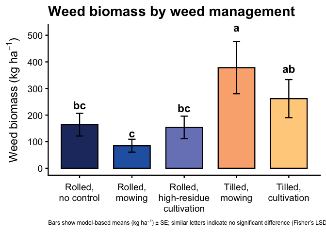<!-- -->

``` r
# Save figure
ggsave(
  filename = here("figs", "analysis", "fig_weed_biomass_mowing_pooled.png"),
  width    = 9,
  height   = 5.5,
  dpi      = 300
)
```

#### Raw means (kg ha⁻¹)

``` r
### Figure: Weed biomass by weed management treatment (raw means ± SE, model CLDs)

# 1) Raw means and SE by treatment --------------------------------------
raw_wbm_summary <- weed_biomass_clean |>
  group_by(weed_trt) |>
  summarise(
    n    = n(),
    mean = mean(weed_biomass_kg_ha, na.rm = TRUE),
    sd   = sd(weed_biomass_kg_ha, na.rm = TRUE),
    se   = sd / sqrt(n),
    .groups = "drop"
  ) |>
  mutate(
    weed_trt = factor(weed_trt, levels = mow_levels),
    ymin     = pmax(mean - se, 0),
    ymax     = mean + se
  )

# 2) Model-based CLDs for treatment main effect -------------------------
emm_wbm <- emmeans(
  weed_glmm,
  ~ weed_trt,
  type = "response"   # back-transform from link scale
)

cld_wbm <- cld(
  emm_wbm,
  adjust   = "none",
  Letters  = letters,
  sort     = TRUE,
  reversed = TRUE   # so "a" = highest biomass group(s)
) |>
  as_tibble() |>
  mutate(
    weed_trt = factor(weed_trt, levels = mow_levels),
    .group   = str_trim(.group)
  ) |>
  select(weed_trt, .group)

# 3) Join raw means + model CLDs ----------------------------------------
plot_df_wbm_raw <- raw_wbm_summary |>
  left_join(cld_wbm, by = "weed_trt")

# 4) Plot ---------------------------------------------------------------
ggplot(plot_df_wbm_raw, aes(x = weed_trt, y = mean, fill = weed_trt)) +
  geom_col(width = 0.7, color = "black") +
  geom_errorbar(aes(ymin = ymin, ymax = ymax), width = 0.14) +
  geom_text(
    aes(y = ymax * 1.08, label = .group),
    vjust    = 0,
    fontface = "bold",
    size     = 6
  ) +
  scale_fill_manual(values = fill_cols, guide = "none") +
  scale_x_discrete(labels = label_break_comma_cult) +
  scale_y_continuous(labels = scales::label_comma()) +
  labs(
    x       = NULL,
    y       = expression(Weed~biomass~"(kg"~ha^{-1}*")"),
    title   = "Weed biomass by weed management",
    caption = "Bars show raw means (kg"~ha^{-1}*") ± SE; similar letters indicate no significant difference (Fisher’s LSD test (P > 0.05))."
  ) +
  theme_classic(base_size = 18) +
  theme(
    axis.text.x  = element_text(lineheight = 0.95, margin = margin(t = 8)),
    axis.title.y = element_text(margin = margin(r = 8)),
    plot.title   = element_text(face = "bold"),
    plot.caption = element_text(size = 9, hjust = 0)
  )
```

<!-- -->

``` r
# 5) Save figure --------------------------------------------------------
ggsave(
  filename = here("figs", "analysis", "fig_weed_biomass_mowing_pooled_raw.png"),
  width    = 9,
  height   = 5.5,
  dpi      = 300
)
```

#### Raw means (lb ha⁻¹)

``` r
### Figure: Weed biomass by weed management treatment (raw means ± SE, model CLDs)
### Units converted from kg ha^-1 to lb ac^-1 for farmer meetings

# kg/ha → lb/ac conversion factor
kg_ha_to_lb_ac <- 0.892179

# 1) Raw means and SE by treatment (in lb ac^-1) -------------------------
raw_wbm_summary <- weed_biomass_clean |>
  group_by(weed_trt) |>
  summarise(
    n    = n(),
    mean = mean(weed_biomass_kg_ha, na.rm = TRUE),
    sd   = sd(weed_biomass_kg_ha, na.rm = TRUE),
    se   = sd / sqrt(n),
    .groups = "drop"
  ) |>
  mutate(
    # convert to lb ac^-1
    mean = mean * kg_ha_to_lb_ac,
    sd   = sd   * kg_ha_to_lb_ac,
    se   = se   * kg_ha_to_lb_ac,
    weed_trt = factor(weed_trt, levels = mow_levels),
    ymin     = pmax(mean - se, 0),
    ymax     = mean + se
  )

# 2) Model-based CLDs for treatment main effect -------------------------
emm_wbm <- emmeans(
  weed_glmm,
  ~ weed_trt,
  type = "response"   # back-transform from link scale (still in kg/ha)
)

cld_wbm <- cld(
  emm_wbm,
  adjust   = "none",
  Letters  = letters,
  sort     = TRUE,
  reversed = TRUE   # so "a" = highest biomass group(s)
) |>
  as_tibble() |>
  mutate(
    weed_trt = factor(weed_trt, levels = mow_levels),
    .group   = str_trim(.group)
  ) |>
  select(weed_trt, .group)

# 3) Join raw means + model CLDs ----------------------------------------
plot_df_wbm_raw <- raw_wbm_summary |>
  left_join(cld_wbm, by = "weed_trt")

# 4) Plot ---------------------------------------------------------------
ggplot(plot_df_wbm_raw, aes(x = weed_trt, y = mean, fill = weed_trt)) +
  geom_col(width = 0.7, color = "black") +
  geom_errorbar(aes(ymin = ymin, ymax = ymax), width = 0.14) +
  geom_text(
    aes(y = ymax * 1.08, label = .group),
    vjust    = 0,
    fontface = "bold",
    size     = 6
  ) +
  scale_fill_manual(values = fill_cols, guide = "none") +
  scale_x_discrete(labels = label_break_comma_cult) +
  scale_y_continuous(labels = scales::label_comma()) +
  labs(
    x       = NULL,
    y       = expression(Weed~biomass~"(lb"~ac^{-1}*")"),
    title   = "Weed biomass by weed management",
    caption = "Bars show raw means (lb"~ac^{-1}*") ± SE; similar letters indicate no significant difference (Fisher’s LSD test, P > 0.05)."
  ) +
  theme_classic(base_size = 18) +
  theme(
    axis.text.x  = element_text(lineheight = 0.95, margin = margin(t = 8)),
    axis.title.y = element_text(margin = margin(r = 8)),
    plot.title   = element_text(face = "bold"),
    plot.caption = element_text(size = 9, hjust = 0)
  )
```

<!-- -->

``` r
# 5) Save figure --------------------------------------------------------
ggsave(
  filename = here("figs", "analysis", "fig_weed_biomass_mowing_pooled_raw_lb_ac.png"),
  width    = 9,
  height   = 5.5,
  dpi      = 300
)
```

### 2023

#### Model means

``` r
### Figure: Weed biomass by weed management treatment (2023)

# Estimated marginal means for treatments on the response scale (kg/ha)
emm_wbm_v23 <- emmeans(
  weed_glmm_v23,
  ~ weed_trt,
  type = "response"   # back-transform from link scale
)

# Tidy emmeans for plotting
emm_wbm_v23_df <- as_tibble(emm_wbm_v23) |>
  mutate(
    weed_trt = factor(weed_trt, levels = mow_levels),
    response = response,
    ymin     = pmax(response - SE, 0),
    ymax     = response + SE
  )

# CLDs for treatments (Fisher-style, "a" = highest)
cld_wbm_v23 <- cld(
  emm_wbm_v23,
  adjust   = "none",
  Letters  = letters,
  sort     = TRUE,
  reversed = TRUE
) |>
  as_tibble() |>
  mutate(
    weed_trt = factor(weed_trt, levels = mow_levels),
    .group   = str_trim(.group)
  ) |>
  select(weed_trt, .group)

# Merge means and CLDs
plot_df_wbm_v23 <- emm_wbm_v23_df |>
  left_join(cld_wbm_v23, by = "weed_trt")

# Plot
ggplot(plot_df_wbm_v23, aes(x = weed_trt, y = response, fill = weed_trt)) +
  geom_col(width = 0.7, color = "black") +
  geom_errorbar(aes(ymin = ymin, ymax = ymax), width = 0.14) +
  geom_text(
    aes(y = ymax * 1.08, label = .group),
    vjust    = 0,
    fontface = "bold",
    size     = 6
  ) +
  scale_fill_manual(values = fill_cols, guide = "none") +
  scale_x_discrete(labels = label_break_comma_cult) +
  scale_y_continuous(labels = scales::label_comma()) +
  labs(
    x       = NULL,
    y       = expression(Weed~biomass~"(kg"~ha^{-1}*")"),
    title   = "Weed biomass by weed management (2023)",
    caption = "Bars show model-based means (kg"~ha^{-1}*") ± SE; similar letters indicate no significant difference (Fisher’s LSD test (P > 0.05))."
  ) +
  theme_classic(base_size = 18) +
  theme(
    axis.text.x  = element_text(lineheight = 0.95, margin = margin(t = 8)),
    axis.title.y = element_text(margin = margin(r = 8)),
    plot.title   = element_text(face = "bold"),
    plot.caption = element_text(size = 9, hjust = 0)
  )
```

<!-- -->

``` r
# Save figure
ggsave(
  filename = here("figs", "analysis", "fig_weed_biomass_mowing_fieldV_2023.png"),
  width    = 9,
  height   = 5.5,
  dpi      = 300
)
```

#### Raw means (kg ha⁻¹)

``` r
### Figure: Weed biomass by weed management treatment (2023 Field V, raw means + SE)

# 1) Model-based CLDs for 2023 Field V on the response scale (kg/ha)
emm_wbm_v23 <- emmeans(
  weed_glmm_v23,
  ~ weed_trt,
  type = "response"   # back-transform from link scale
)

cld_wbm_v23 <- cld(
  emm_wbm_v23,
  adjust   = "none",
  Letters  = letters,
  sort     = TRUE,
  reversed = TRUE
) |>
  as_tibble() |>
  mutate(
    weed_trt = factor(weed_trt, levels = mow_levels),
    .group   = str_trim(.group)
  ) |>
  select(weed_trt, .group)

# 2) Raw means + SE for 2023 Field V (kg/ha)
raw_wbm_v23 <- weed_biomass_field_v_2023 |>
  group_by(weed_trt) |>
  summarise(
    raw_mean = mean(weed_biomass_kg_ha, na.rm = TRUE),
    sd       = sd(weed_biomass_kg_ha, na.rm = TRUE),
    n        = dplyr::n(),
    .groups  = "drop"
  ) |>
  mutate(
    weed_trt = factor(weed_trt, levels = mow_levels),
    SE       = sd / sqrt(n),
    ymin     = pmax(raw_mean - SE, 0),
    ymax     = raw_mean + SE
  )

# 3) Merge raw means + model CLDs
plot_df_wbm_v23 <- raw_wbm_v23 |>
  left_join(cld_wbm_v23, by = "weed_trt")

# 4) Plot (raw means + raw SE, model CLDs)
ggplot(plot_df_wbm_v23, aes(x = weed_trt, y = raw_mean, fill = weed_trt)) +
  geom_col(width = 0.7, color = "black") +
  geom_errorbar(aes(ymin = ymin, ymax = ymax), width = 0.14) +
  geom_text(
    aes(y = ymax * 1.08, label = .group),
    vjust    = 0,
    fontface = "bold",
    size     = 6
  ) +
  scale_fill_manual(values = fill_cols, guide = "none") +
  scale_x_discrete(labels = label_break_comma_cult) +
  scale_y_continuous(labels = scales::label_comma()) +
  labs(
    x       = NULL,
    y       = expression(Weed~biomass~"(kg"~ha^{-1}*")"),
    title   = "Weed biomass by weed management (2023)",
    caption = "Bars show raw means (kg"~ha^{-1}*") ± SE; similar letters indicate no significant difference (Fisher’s LSD test (P > 0.05))."
  ) +
  theme_classic(base_size = 18) +
  theme(
    axis.text.x  = element_text(lineheight = 0.95, margin = margin(t = 8)),
    axis.title.y = element_text(margin = margin(r = 8)),
    plot.title   = element_text(face = "bold"),
    plot.caption = element_text(size = 9, hjust = 0.5)
  )
```

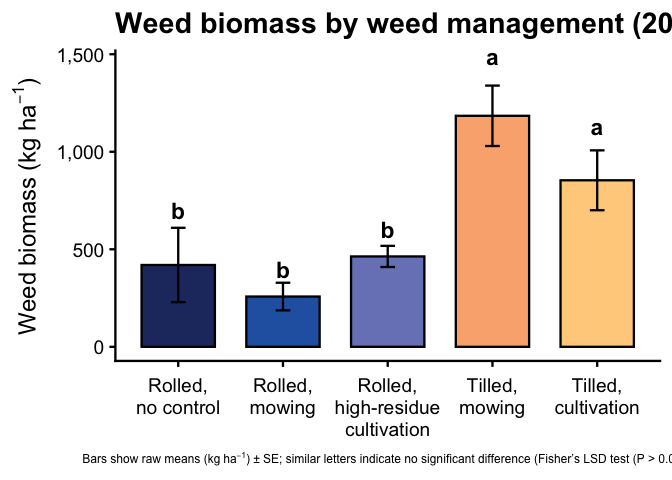<!-- -->

``` r
# 5) Save figure
ggsave(
  filename = here("figs", "analysis", "fig_weed_biomass_mowing_fieldV_2023.png"),
  width    = 9,
  height   = 5.5,
  dpi      = 300
)
```

#### Raw means (lb ac⁻¹)

``` r
### Figure: Weed biomass by weed management treatment (2023 Field V, raw means + SE)
### Units converted from kg ha^-1 to lb ac^-1

# kg/ha → lb/ac conversion factor
kg_ha_to_lb_ac <- 0.892179

# 1) Model-based CLDs for 2023 Field V on the response scale (kg/ha)
emm_wbm_v23 <- emmeans(
  weed_glmm_v23,
  ~ weed_trt,
  type = "response"   # back-transform from link scale
)

cld_wbm_v23 <- cld(
  emm_wbm_v23,
  adjust   = "none",
  Letters  = letters,
  sort     = TRUE,
  reversed = TRUE
) |>
  as_tibble() |>
  mutate(
    weed_trt = factor(weed_trt, levels = mow_levels),
    .group   = str_trim(.group)
  ) |>
  select(weed_trt, .group)

# 2) Raw means + SE for 2023 Field V (convert to lb/ac)
raw_wbm_v23 <- weed_biomass_field_v_2023 |>
  group_by(weed_trt) |>
  summarise(
    raw_mean = mean(weed_biomass_kg_ha, na.rm = TRUE),
    sd       = sd(weed_biomass_kg_ha, na.rm = TRUE),
    n        = dplyr::n(),
    .groups  = "drop"
  ) |>
  mutate(
    # convert to lb ac^-1
    raw_mean = raw_mean * kg_ha_to_lb_ac,
    sd       = sd       * kg_ha_to_lb_ac,
    SE       = sd / sqrt(n),
    weed_trt = factor(weed_trt, levels = mow_levels),
    ymin     = pmax(raw_mean - SE, 0),
    ymax     = raw_mean + SE
  )

# 3) Merge raw means + model CLDs
plot_df_wbm_v23 <- raw_wbm_v23 |>
  left_join(cld_wbm_v23, by = "weed_trt")

# 4) Plot (raw means + raw SE, model CLDs)
ggplot(plot_df_wbm_v23, aes(x = weed_trt, y = raw_mean, fill = weed_trt)) +
  geom_col(width = 0.7, color = "black") +
  geom_errorbar(aes(ymin = ymin, ymax = ymax), width = 0.14) +
  geom_text(
    aes(y = ymax * 1.08, label = .group),
    vjust    = 0,
    fontface = "bold",
    size     = 6
  ) +
  scale_fill_manual(values = fill_cols, guide = "none") +
  scale_x_discrete(labels = label_break_comma_cult) +
  scale_y_continuous(labels = scales::label_comma()) +
  labs(
    x       = NULL,
    y       = expression(Weed~biomass~"(lb"~ac^{-1}*")"),
    title   = "Weed biomass by weed management (2023)",
    caption = "Bars show raw means (lb"~ac^{-1}*") ± SE; similar letters indicate no significant difference (Fisher’s LSD test (P > 0.05))."
  ) +
  theme_classic(base_size = 18) +
  theme(
    axis.text.x  = element_text(lineheight = 0.95, margin = margin(t = 8)),
    axis.title.y = element_text(margin = margin(r = 8)),
    plot.title   = element_text(face = "bold"),
    plot.caption = element_text(size = 9, hjust = 0.5)
  )
```

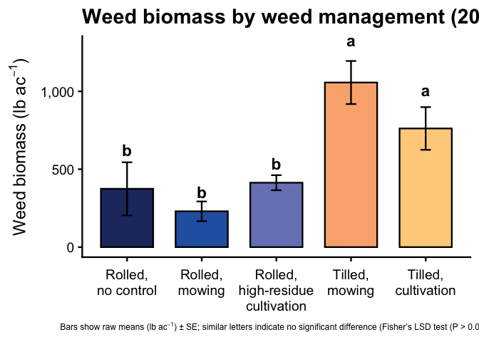<!-- -->

``` r
# 5) Save figure
ggsave(
  filename = here("figs", "analysis", "fig_weed_biomass_mowing_fieldV_2023_lb_ac.png"),
  width    = 9,
  height   = 5.5,
  dpi      = 300
)
```

## In-row weed biomass

### Pooled

#### Model means

``` r
### Figure: In-row weed biomass by weed management and site-year
### (model-based means ± SE, Fisher-style CLDs)

# 1) Model-based emmeans by site_year × treatment (response scale) ------
emm_inrow_sy <- emmeans(
  weed_inrow_glmm,
  ~ weed_trt | site_year,
  type = "response"   # back-transform from link scale to kg/ha
)

emm_inrow_sy_df <- summary(emm_inrow_sy) |>
  as_tibble() |>
  mutate(
    site_year = factor(site_year),
    weed_trt  = factor(weed_trt, levels = mow_levels),
    emmean    = response,    # mean on response scale
    ymin      = pmax(response - SE, 0),
    ymax      = response + SE
  ) |>
  select(site_year, weed_trt, emmean, SE, ymin, ymax)

# 2) CLDs within each site_year (Fisher-style, "a" = highest) ----------
cld_inrow_sy <- cld(
  emm_inrow_sy,
  adjust   = "none",
  Letters  = letters,
  sort     = TRUE,
  reversed = TRUE           # so "a" = highest biomass group(s)
) |>
  as_tibble() |>
  mutate(
    site_year = factor(site_year),
    weed_trt  = factor(weed_trt, levels = mow_levels),
    .group    = str_trim(.group)
  ) |>
  select(site_year, weed_trt, .group)

# 3) Join model means + CLDs --------------------------------------------
plot_df_inrow_sy_mod <- emm_inrow_sy_df |>
  left_join(cld_inrow_sy, by = c("site_year", "weed_trt"))

# 4) Plot ---------------------------------------------------------------
ggplot(plot_df_inrow_sy_mod,
       aes(x = weed_trt, y = emmean, fill = weed_trt)) +
  geom_col(width = 0.7, color = "black") +
  geom_errorbar(aes(ymin = ymin, ymax = ymax), width = 0.14) +
  geom_text(
    aes(y = ymax * 1.08, label = .group),
    vjust    = 0,
    fontface = "bold",
    size     = 5
  ) +
  facet_wrap(~ site_year, nrow = 1, scales = "free_y") +
  scale_fill_manual(values = fill_cols, guide = "none") +
  scale_x_discrete(labels = label_break_comma_cult) +
  scale_y_continuous(labels = scales::label_comma()) +
  labs(
    x       = NULL,
    y       = expression(In-row~weed~biomass~"(kg"~ha^{-1}*")"),
    title   = "In-row weed biomass by weed management and site-year",
    caption = "Bars show model-based means (kg"~ha^{-1}*") ± SE; similar letters indicate no significant difference (Fisher’s LSD test (P > 0.05))."
  ) +
  theme_classic(base_size = 18) +
  theme(
    axis.text.x  = element_text(lineheight = 0.95, margin = margin(t = 8)),
    axis.title.y = element_text(margin = margin(r = 8)),
    strip.text   = element_text(face = "bold"),
    plot.title   = element_text(face = "bold"),
    plot.caption       = element_text(size = 9, hjust = 0.5),  # center caption
    plot.caption.position = "plot"
  )
```

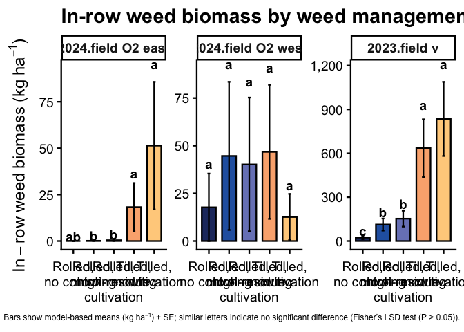<!-- -->

``` r
# 5) Save figure --------------------------------------------------------
ggsave(
  filename = here("figs", "analysis", "fig_inrow_weed_biomass_mowing_by_site_year_model.png"),
  width    = 18,
  height   = 5.5,
  dpi      = 300
)
```

#### Raw means

``` r
### Figure: In-row weed biomass by weed management and site-year
### (raw means ± SE, model-based CLDs)

# 1) Raw means and SE by site_year × treatment ---------------------------
raw_inrow_sy <- weed_biomass_clean |>
  group_by(site_year, weed_trt) |>
  summarise(
    n    = n(),
    mean = mean(inrow_weed_biomass_kg_ha, na.rm = TRUE),
    sd   = sd(inrow_weed_biomass_kg_ha, na.rm = TRUE),
    se   = sd / sqrt(n),
    .groups = "drop"
  ) |>
  mutate(
    site_year = factor(site_year),
    weed_trt  = factor(weed_trt, levels = mow_levels),
    ymin      = pmax(mean - se, 0),
    ymax      = mean + se
  )

# 2) Model-based CLDs within each site-year -----------------------------
emm_inrow_sy <- emmeans(
  weed_inrow_glmm,
  ~ weed_trt | site_year,
  type = "response"   # back-transform from link scale
)

cld_inrow_sy <- cld(
  emm_inrow_sy,
  adjust   = "none",
  Letters  = letters,
  sort     = TRUE,
  reversed = TRUE      # "a" = highest biomass within each site-year
) |>
  as_tibble() |>
  mutate(
    site_year = factor(site_year),
    weed_trt  = factor(weed_trt, levels = mow_levels),
    .group    = str_trim(.group)
  ) |>
  select(site_year, weed_trt, .group)

# 3) Join raw means + model CLDs ----------------------------------------
plot_df_inrow_sy <- raw_inrow_sy |>
  left_join(cld_inrow_sy, by = c("site_year", "weed_trt"))

# 4) Plot ---------------------------------------------------------------
ggplot(plot_df_inrow_sy,
       aes(x = weed_trt, y = mean, fill = weed_trt)) +
  geom_col(width = 0.7, color = "black") +
  geom_errorbar(aes(ymin = ymin, ymax = ymax), width = 0.14) +
  geom_text(
    aes(y = ymax * 1.08, label = .group),
    vjust    = 0,
    fontface = "bold",
    size     = 5
  ) +
  facet_wrap(~ site_year, nrow = 1, scales = "free_y") +
  scale_fill_manual(values = fill_cols, guide = "none") +
  scale_x_discrete(labels = label_break_comma_cult) +
  scale_y_continuous(labels = scales::label_comma()) +
  labs(
    x       = NULL,
    y       = expression(In-row~weed~biomass~"(kg"~ha^{-1}*")"),
    title   = "In-row weed biomass by weed management and site-year",
    caption = "Bars show raw means (kg"~ha^{-1}*") ± SE; similar letters indicate no significant difference (Fisher’s LSD test (P > 0.05))."
  ) +
  theme_classic(base_size = 18) +
  theme(
    axis.text.x  = element_text(lineheight = 0.95, margin = margin(t = 8)),
    axis.title.y = element_text(margin = margin(r = 8)),
    strip.text   = element_text(face = "bold"),
    plot.title   = element_text(face = "bold"),
    plot.caption       = element_text(size = 9, hjust = 0.5),  # center caption
    plot.caption.position = "plot"
  )
```

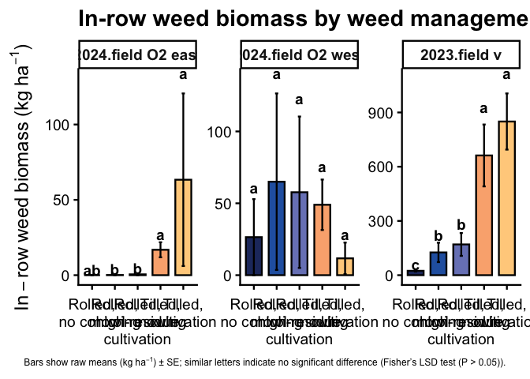<!-- -->

``` r
# 5) Save figure --------------------------------------------------------
ggsave(
  filename = here("figs", "analysis", "fig_inrow_weed_biomass_mowing_by_site_year_raw.png"),
  width    = 18,
  height   = 5.5,
  dpi      = 300
)
```

### 2023

#### Model means

``` r
### Figure: In-row weed biomass by weed management treatment (2023 Field V)

# Estimated marginal means for treatments on the response scale (kg/ha)
emm_inrow_v23 <- emmeans(
  weed_inrow_glmm_v23,
  ~ weed_trt,
  type = "response"   # back-transform from link scale
)

# Tidy emmeans for plotting
emm_inrow_v23_df <- as_tibble(emm_inrow_v23) |>
  mutate(
    weed_trt = factor(weed_trt, levels = mow_levels),
    response = response,
    ymin     = pmax(response - SE, 0),
    ymax     = response + SE
  )

# CLDs for treatments (Fisher-style, "a" = highest)
cld_inrow_v23 <- cld(
  emm_inrow_v23,
  adjust   = "none",
  Letters  = letters,
  sort     = TRUE,
  reversed = TRUE
) |>
  as_tibble() |>
  mutate(
    weed_trt = factor(weed_trt, levels = mow_levels),
    .group   = str_trim(.group)
  ) |>
  select(weed_trt, .group)

# Merge means and CLDs
plot_df_inrow_v23 <- emm_inrow_v23_df |>
  left_join(cld_inrow_v23, by = "weed_trt")

# Plot
ggplot(plot_df_inrow_v23, aes(x = weed_trt, y = response, fill = weed_trt)) +
  geom_col(width = 0.7, color = "black") +
  geom_errorbar(aes(ymin = ymin, ymax = ymax), width = 0.14) +
  geom_text(
    aes(y = ymax * 1.08, label = .group),
    vjust    = 0,
    fontface = "bold",
    size     = 6
  ) +
  scale_fill_manual(values = fill_cols, guide = "none") +
  scale_x_discrete(labels = label_break_comma_cult) +
  scale_y_continuous(labels = scales::label_comma()) +
  labs(
    x       = NULL,
    y       = expression(In-row~weed~biomass~"(kg"~ha^{-1}*")"),
    title   = "In-row weed biomass by weed management (2023)",
    caption = "Bars show model-based means (kg"~ha^{-1}*") ± SE; similar letters indicate no significant difference (Fisher’s LSD test (P > 0.05))."
  ) +
  theme_classic(base_size = 18) +
  theme(
    axis.text.x  = element_text(lineheight = 0.95, margin = margin(t = 8)),
    axis.title.y = element_text(margin = margin(r = 8)),
    plot.title   = element_text(face = "bold"),
    plot.caption = element_text(size = 9, hjust = 0)
  )
```

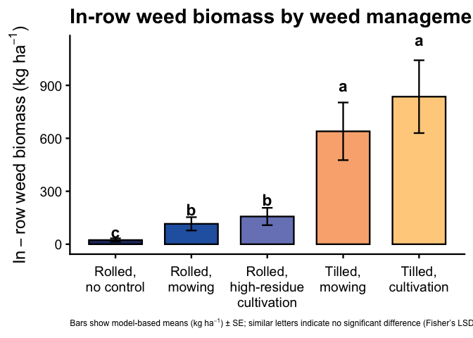<!-- -->

``` r
# Save figure
ggsave(
  filename = here("figs", "analysis", "fig_inrow_weed_biomass_mowing_fieldV_2023.png"),
  width    = 9,
  height   = 5.5,
  dpi      = 300
)
```

#### Raw means (kg ha⁻¹)

``` r
### Figure: In-row weed biomass by weed management treatment (2023 Field V; raw means with model CLDs)

# 1) Model-based emmeans on the response scale (kg/ha)
emm_inrow_v23 <- emmeans(
  weed_inrow_glmm_v23,
  ~ weed_trt,
  type = "response"   # back-transform from link scale
)

emm_inrow_v23_df <- as_tibble(emm_inrow_v23) |>
  mutate(
    weed_trt   = factor(weed_trt, levels = mow_levels),
    model_mean = response,
    ymin       = pmax(model_mean - SE, 0),
    ymax       = model_mean + SE
  )

# 2) CLDs for treatments (Fisher-style, "a" = highest)
cld_inrow_v23 <- cld(
  emm_inrow_v23,
  adjust   = "none",
  Letters  = letters,
  sort     = TRUE,
  reversed = TRUE
) |>
  as_tibble() |>
  mutate(
    weed_trt = factor(weed_trt, levels = mow_levels),
    .group   = str_trim(.group)
  ) |>
  select(weed_trt, .group)

# 3) Raw means for in-row weed biomass (2023 Field V)
raw_inrow_v23 <- weed_biomass_field_v_2023 |>
  group_by(weed_trt) |>
  summarise(
    raw_mean = mean(inrow_weed_biomass_kg_ha, na.rm = TRUE),
    .groups  = "drop"
  ) |>
  mutate(
    weed_trt = factor(weed_trt, levels = mow_levels)
  )

# 4) Merge raw means, model SE, and CLDs
plot_df_inrow_v23 <- emm_inrow_v23_df |>
  select(weed_trt, model_mean, ymin, ymax) |>
  left_join(raw_inrow_v23, by = "weed_trt") |>
  left_join(cld_inrow_v23, by = "weed_trt")

# 5) Plot: bars = raw means, error bars = model-based SE, letters = model CLDs
ggplot(plot_df_inrow_v23, aes(x = weed_trt, y = raw_mean, fill = weed_trt)) +
  geom_col(width = 0.7, color = "black") +
  geom_errorbar(aes(ymin = ymin, ymax = ymax), width = 0.14) +
  geom_text(
    aes(y = ymax * 1.08, label = .group),
    vjust    = 0,
    fontface = "bold",
    size     = 6
  ) +
  scale_fill_manual(values = fill_cols, guide = "none") +
  scale_x_discrete(labels = label_break_comma_cult) +
  scale_y_continuous(labels = scales::label_comma()) +
  labs(
    x       = NULL,
    y       = expression(In-row~weed~biomass~"(kg"~ha^{-1}*")"),
    title   = "In-row weed biomass by weed management (2023)",
    caption = "Bars show raw means (kg"~ha^{-1}*") ± SE; similar letters indicate no significant difference (Fisher’s LSD test (P > 0.05))."
  ) +
  theme_classic(base_size = 18) +
  theme(
    axis.text.x        = element_text(lineheight = 0.95, margin = margin(t = 8)),
    axis.title.y       = element_text(margin = margin(r = 8)),
    plot.title         = element_text(face = "bold"),
    plot.caption       = element_text(size = 9, hjust = 0.5),
    plot.caption.position = "plot"
  )
```

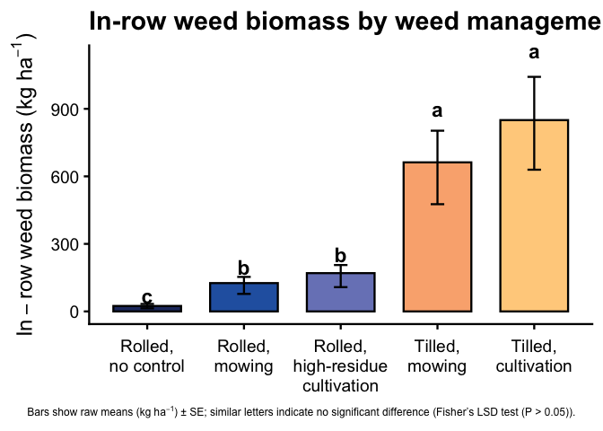<!-- -->

``` r
# Save figure
ggsave(
  filename = here("figs", "analysis", "fig_inrow_weed_biomass_mowing_fieldV_2023_raw.png"),
  width    = 9,
  height   = 5.5,
  dpi      = 300
)
```

#### Raw means (lb ac⁻¹)

``` r
### Figure: In-row weed biomass by weed management treatment (2023 Field V; raw means with model CLDs)
### Units converted from kg ha^-1 to lb ac^-1

# kg/ha → lb/ac conversion factor
kg_ha_to_lb_ac <- 0.892179

# 1) Model-based emmeans on the response scale (kg/ha)
emm_inrow_v23 <- emmeans(
  weed_inrow_glmm_v23,
  ~ weed_trt,
  type = "response"   # back-transform from link scale
)

emm_inrow_v23_df <- as_tibble(emm_inrow_v23) |>
  mutate(
    weed_trt   = factor(weed_trt, levels = mow_levels),
    # convert model mean and SE to lb/ac
    model_mean = response * kg_ha_to_lb_ac,
    SE         = SE       * kg_ha_to_lb_ac,
    ymin       = pmax(model_mean - SE, 0),
    ymax       = model_mean + SE
  )

# 2) CLDs for treatments (Fisher-style, "a" = highest)
cld_inrow_v23 <- cld(
  emm_inrow_v23,
  adjust   = "none",
  Letters  = letters,
  sort     = TRUE,
  reversed = TRUE
) |>
  as_tibble() |>
  mutate(
    weed_trt = factor(weed_trt, levels = mow_levels),
    .group   = str_trim(.group)
  ) |>
  select(weed_trt, .group)

# 3) Raw means for in-row weed biomass (2023 Field V), converted to lb/ac
raw_inrow_v23 <- weed_biomass_field_v_2023 |>
  group_by(weed_trt) |>
  summarise(
    raw_mean = mean(inrow_weed_biomass_kg_ha, na.rm = TRUE),
    .groups  = "drop"
  ) |>
  mutate(
    weed_trt = factor(weed_trt, levels = mow_levels),
    raw_mean = raw_mean * kg_ha_to_lb_ac
  )

# 4) Merge raw means, model SE, and CLDs
plot_df_inrow_v23 <- emm_inrow_v23_df |>
  select(weed_trt, model_mean, ymin, ymax) |>
  left_join(raw_inrow_v23, by = "weed_trt") |>
  left_join(cld_inrow_v23, by = "weed_trt")

# 5) Plot: bars = raw means (lb/ac), error bars = model-based SE (lb/ac), letters = model CLDs
ggplot(plot_df_inrow_v23, aes(x = weed_trt, y = raw_mean, fill = weed_trt)) +
  geom_col(width = 0.7, color = "black") +
  geom_errorbar(aes(ymin = ymin, ymax = ymax), width = 0.14) +
  geom_text(
    aes(y = ymax * 1.08, label = .group),
    vjust    = 0,
    fontface = "bold",
    size     = 6
  ) +
  scale_fill_manual(values = fill_cols, guide = "none") +
  scale_x_discrete(labels = label_break_comma_cult) +
  scale_y_continuous(labels = scales::label_comma()) +
  labs(
    x       = NULL,
    y       = expression(In-row~weed~biomass~"(lb"~ac^{-1}*")"),
    title   = "In-row weed biomass by weed management (2023)",
    caption = "Bars show raw means (lb"~ac^{-1}*") ± SE; similar letters indicate no significant difference (Fisher’s LSD test (P > 0.05))."
  ) +
  theme_classic(base_size = 18) +
  theme(
    axis.text.x          = element_text(lineheight = 0.95, margin = margin(t = 8)),
    axis.title.y         = element_text(margin = margin(r = 8)),
    plot.title           = element_text(face = "bold"),
    plot.caption         = element_text(size = 9, hjust = 0.5),
    plot.caption.position = "plot"
  )
```

<!-- -->

``` r
# Save figure
ggsave(
  filename = here("figs", "analysis", "fig_inrow_weed_biomass_mowing_fieldV_2023_raw_lb_ac.png"),
  width    = 9,
  height   = 5.5,
  dpi      = 300
)
```

## Interrow weed biomass

### Pooled

#### Model means

``` r
### Figure: Interrow weed biomass by weed management and site-year
### (model-based means ± SE, Fisher-style CLDs)

# 1) Model-based emmeans by site_year × treatment (response scale) ------
emm_interrow_sy <- emmeans(
  weed_interrow_glmm,
  ~ weed_trt | site_year,
  type = "response"   # back-transform from link scale to kg/ha
)

emm_interrow_sy_df <- summary(emm_interrow_sy) |>
  as_tibble() |>
  mutate(
    site_year = factor(site_year),
    weed_trt  = factor(weed_trt, levels = mow_levels),
    emmean    = response,          # mean on response scale
    ymin      = pmax(response - SE, 0),
    ymax      = response + SE
  ) |>
  select(site_year, weed_trt, emmean, SE, ymin, ymax)

# 2) CLDs within each site_year (Fisher-style, "a" = highest) ----------
cld_interrow_sy <- cld(
  emm_interrow_sy,
  adjust   = "none",
  Letters  = letters,
  sort     = TRUE,
  reversed = TRUE                 # so "a" = highest biomass group(s)
) |>
  as_tibble() |>
  mutate(
    site_year = factor(site_year),
    weed_trt  = factor(weed_trt, levels = mow_levels),
    .group    = str_trim(.group)
  ) |>
  select(site_year, weed_trt, .group)

# 3) Join model means + CLDs --------------------------------------------
plot_df_interrow_sy_mod <- emm_interrow_sy_df |>
  left_join(cld_interrow_sy, by = c("site_year", "weed_trt"))

# 4) Plot ---------------------------------------------------------------
ggplot(plot_df_interrow_sy_mod,
       aes(x = weed_trt, y = emmean, fill = weed_trt)) +
  geom_col(width = 0.7, color = "black") +
  geom_errorbar(aes(ymin = ymin, ymax = ymax), width = 0.14) +
  geom_text(
    aes(y = ymax * 1.08, label = .group),
    vjust    = 0,
    fontface = "bold",
    size     = 5
  ) +
  facet_wrap(~ site_year, nrow = 1, scales = "free_y") +
  scale_fill_manual(values = fill_cols, guide = "none") +
  scale_x_discrete(labels = label_break_comma_cult) +
  scale_y_continuous(labels = scales::label_comma()) +
  labs(
    x       = NULL,
    y       = expression(Interrow~weed~biomass~"(kg"~ha^{-1}*")"),
    title   = "Interrow weed biomass by weed management and site-year",
    caption = "Bars show model-based means (kg"~ha^{-1}*") ± SE; similar letters indicate no significant difference (Fisher’s LSD test (P > 0.05))."
  ) +
  theme_classic(base_size = 18) +
  theme(
    axis.text.x  = element_text(lineheight = 0.95, margin = margin(t = 8)),
    axis.title.y = element_text(margin = margin(r = 8)),
    strip.text   = element_text(face = "bold"),
    plot.title   = element_text(face = "bold"),
    plot.caption       = element_text(size = 9, hjust = 0.5),  # center caption
    plot.caption.position = "plot"
  )
```

<!-- -->

``` r
# 5) Save figure --------------------------------------------------------
ggsave(
  filename = here("figs", "analysis", "fig_interrow_weed_biomass_mowing_by_site_year_model.png"),
  width    = 18,
  height   = 5.5,
  dpi      = 300
)
```

#### Raw means (kg ha⁻¹)

``` r
### Figure: Interrow weed biomass by weed management and site-year
### (raw means ± SE, model-based Fisher-style CLDs)

# 1) Raw summary by site_year × treatment -------------------------------
raw_interrow_summary <- weed_biomass_clean |>
  group_by(site_year, weed_trt) |>
  summarise(
    n    = n(),
    mean = mean(interrow_weed_biomass_kg_ha, na.rm = TRUE),
    sd   = sd(interrow_weed_biomass_kg_ha, na.rm = TRUE),
    se   = sd / sqrt(n),
    .groups = "drop"
  ) |>
  mutate(
    site_year = factor(site_year),
    weed_trt  = factor(weed_trt, levels = mow_levels),
    ymin      = pmax(mean - se, 0),
    ymax      = mean + se
  )

# 2) Model-based CLDs within each site_year (for letters) ---------------
emm_interrow_sy <- emmeans(
  weed_interrow_glmm,
  ~ weed_trt | site_year,
  type = "response"   # for CLDs on the response scale
)

cld_interrow_sy <- cld(
  emm_interrow_sy,
  adjust   = "none",
  Letters  = letters,
  sort     = TRUE,
  reversed = TRUE      # "a" = highest within each site-year
) |>
  as_tibble() |>
  mutate(
    site_year = factor(site_year),
    weed_trt  = factor(weed_trt, levels = mow_levels),
    .group    = str_trim(.group)
  ) |>
  select(site_year, weed_trt, .group)

# 3) Join raw means + CLDs ----------------------------------------------
plot_df_interrow_raw <- raw_interrow_summary |>
  left_join(cld_interrow_sy, by = c("site_year", "weed_trt"))

# 4) Plot ---------------------------------------------------------------
ggplot(plot_df_interrow_raw,
       aes(x = weed_trt, y = mean, fill = weed_trt)) +
  geom_col(width = 0.7, color = "black") +
  geom_errorbar(aes(ymin = ymin, ymax = ymax), width = 0.14) +
  geom_text(
    aes(y = ymax * 1.08, label = .group),
    vjust    = 0,
    fontface = "bold",
    size     = 5
  ) +
  facet_wrap(~ site_year, nrow = 1, scales = "free_y") +
  scale_fill_manual(values = fill_cols, guide = "none") +
  scale_x_discrete(labels = label_break_comma_cult) +
  scale_y_continuous(labels = scales::label_comma()) +
  labs(
    x       = NULL,
    y       = expression(Interrow~weed~biomass~"(kg"~ha^{-1}*")"),
    title   = "Interrow weed biomass by weed management and site-year",
    caption = "Bars show raw means (kg"~ha^{-1}*") ± SE; similar letters indicate no significant difference (Fisher’s LSD test (P > 0.05))."
  ) +
  theme_classic(base_size = 18) +
  theme(
    axis.text.x        = element_text(lineheight = 0.95, margin = margin(t = 8)),
    axis.title.y       = element_text(margin = margin(r = 8)),
    strip.text         = element_text(face = "bold"),
    plot.title         = element_text(face = "bold"),
    plot.caption       = element_text(size = 9, hjust = 0.5),  # center caption
    plot.caption.position = "plot"
  )
```

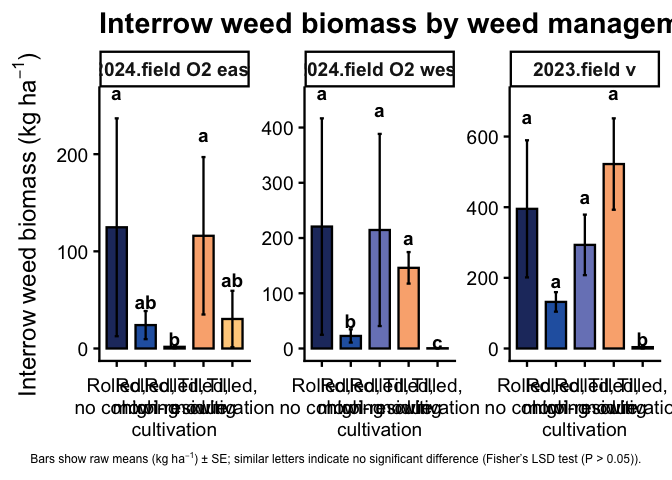<!-- -->

``` r
# 5) Save figure --------------------------------------------------------
ggsave(
  filename = here("figs", "analysis", "fig_interrow_weed_biomass_mowing_by_site_year_raw.png"),
  width    = 18,
  height   = 5.5,
  dpi      = 300
)
```

### 2023

#### Model means

``` r
### Figure: Interrow weed biomass by weed management treatment (2023 Field V)

# Estimated marginal means for treatments on the response scale (kg/ha)
emm_inter_v23 <- emmeans(
  weed_interrow_glmm_v23,
  ~ weed_trt,
  type = "response"   # back-transform from link scale
)

# Tidy emmeans for plotting
emm_inter_v23_df <- as_tibble(emm_inter_v23) |>
  mutate(
    weed_trt = factor(weed_trt, levels = mow_levels),
    response = response,
    ymin     = pmax(response - SE, 0),
    ymax     = response + SE
  )

# CLDs for treatments (Fisher-style, "a" = highest)
cld_inter_v23 <- cld(
  emm_inter_v23,
  adjust   = "none",
  Letters  = letters,
  sort     = TRUE,
  reversed = TRUE
) |>
  as_tibble() |>
  mutate(
    weed_trt = factor(weed_trt, levels = mow_levels),
    .group   = str_trim(.group)
  ) |>
  select(weed_trt, .group)

# Merge means and CLDs
plot_df_inter_v23 <- emm_inter_v23_df |>
  left_join(cld_inter_v23, by = "weed_trt")

# Plot
ggplot(plot_df_inter_v23, aes(x = weed_trt, y = response, fill = weed_trt)) +
  geom_col(width = 0.7, color = "black") +
  geom_errorbar(aes(ymin = ymin, ymax = ymax), width = 0.14) +
  geom_text(
    aes(y = ymax * 1.08, label = .group),
    vjust    = 0,
    fontface = "bold",
    size     = 6
  ) +
  scale_fill_manual(values = fill_cols, guide = "none") +
  scale_x_discrete(labels = label_break_comma_cult) +
  scale_y_continuous(labels = scales::label_comma()) +
  labs(
    x       = NULL,
    y       = expression(Interrow~weed~biomass~"(kg"~ha^{-1}*")"),
    title   = "Interrow weed biomass by weed management (2023)",
    caption = "Bars show model-based means (kg"~ha^{-1}*") ± SE; similar letters indicate no significant difference (Fisher’s LSD test (P > 0.05))."
  ) +
  theme_classic(base_size = 18) +
  theme(
    axis.text.x  = element_text(lineheight = 0.95, margin = margin(t = 8)),
    axis.title.y = element_text(margin = margin(r = 8)),
    plot.title   = element_text(face = "bold"),
    plot.caption = element_text(size = 9, hjust = 0)
  )
```

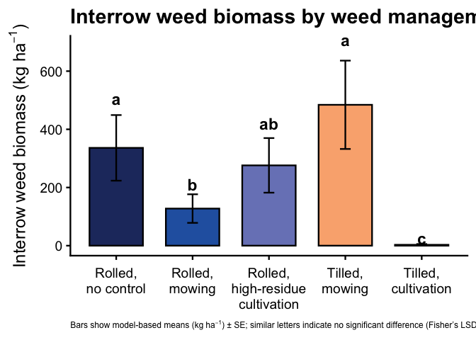<!-- -->

``` r
# Save figure
ggsave(
  filename = here("figs", "analysis", "fig_interrow_weed_biomass_mowing_fieldV_2023.png"),
  width    = 9,
  height   = 5.5,
  dpi      = 300
)
```

#### Raw means (kg ha⁻¹)

##### Exploratory

``` r
### Figure: Interrow weed biomass by weed management treatment (2023 Field V; raw means with model CLDs)

# 1) Model-based emmeans on the response scale (kg/ha)
emm_inter_v23 <- emmeans(
  weed_interrow_glmm_v23,
  ~ weed_trt,
  type = "response"   # back-transform from link scale
)

emm_inter_v23_df <- as_tibble(emm_inter_v23) |>
  mutate(
    weed_trt   = factor(weed_trt, levels = mow_levels),
    model_mean = response,
    ymin       = pmax(model_mean - SE, 0),
    ymax       = model_mean + SE
  )

# 2) CLDs for treatments (Fisher-style, "a" = highest)
cld_inter_v23 <- cld(
  emm_inter_v23,
  adjust   = "none",
  Letters  = letters,
  sort     = TRUE,
  reversed = TRUE
) |>
  as_tibble() |>
  mutate(
    weed_trt = factor(weed_trt, levels = mow_levels),
    .group   = str_trim(.group)
  ) |>
  select(weed_trt, .group)

# 3) Raw means for interrow weed biomass (2023 Field V)
raw_inter_v23 <- weed_biomass_field_v_2023 |>
  group_by(weed_trt) |>
  summarise(
    raw_mean = mean(interrow_weed_biomass_kg_ha, na.rm = TRUE),
    .groups  = "drop"
  ) |>
  mutate(
    weed_trt = factor(weed_trt, levels = mow_levels)
  )

# 4) Merge raw means, model SE, and CLDs
plot_df_inter_v23 <- emm_inter_v23_df |>
  select(weed_trt, model_mean, ymin, ymax) |>
  left_join(raw_inter_v23,  by = "weed_trt") |>
  left_join(cld_inter_v23,  by = "weed_trt")

# 5) Plot: bars = raw means, error bars = model-based SE, letters = model CLDs
ggplot(plot_df_inter_v23, aes(x = weed_trt, y = raw_mean, fill = weed_trt)) +
  geom_col(width = 0.7, color = "black") +
  geom_errorbar(aes(ymin = ymin, ymax = ymax), width = 0.14) +
  geom_text(
    aes(y = ymax * 1.08, label = .group),
    vjust    = 0,
    fontface = "bold",
    size     = 6
  ) +
  scale_fill_manual(values = fill_cols, guide = "none") +
  scale_x_discrete(labels = label_break_comma_cult) +
  scale_y_continuous(labels = scales::label_comma()) +
  labs(
    x       = NULL,
    y       = expression(Interrow~weed~biomass~"(kg"~ha^{-1}*")"),
    title   = "Interrow weed biomass by weed management (2023)",
    caption = "Bars show raw means (kg"~ha^{-1}*") ± SE; similar letters indicate no significant difference (Fisher’s LSD test (P > 0.05))."
  ) +
  theme_classic(base_size = 18) +
  theme(
    axis.text.x  = element_text(lineheight = 0.95, margin = margin(t = 8)),
    axis.title.y = element_text(margin = margin(r = 8)),
    plot.title   = element_text(face = "bold"),
    plot.caption = element_text(size = 9, hjust = 0.5)
  )
```

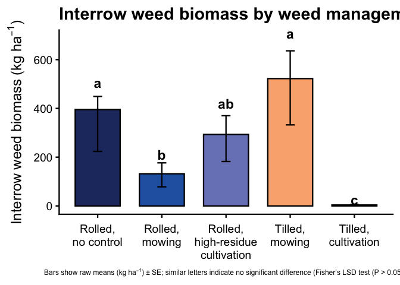<!-- -->

``` r
# Save figure
ggsave(
  filename = here("figs", "analysis", "fig_interrow_weed_biomass_mowing_fieldV_2023_raw.png"),
  width    = 9,
  height   = 5.5,
  dpi      = 300
)
```

#### Final Raw means (lb ac⁻¹)

``` r
### Figure: Interrow weed biomass by weed management treatment (2023 Field V; raw means with model CLDs)
### Units converted from kg ha^-1 to lb ac^-1

# kg/ha → lb/ac conversion factor
kg_ha_to_lb_ac <- 0.892179

# 1) Model-based emmeans on the response scale (kg/ha)
emm_inter_v23 <- emmeans(
  weed_interrow_glmm_v23,
  ~ weed_trt,
  type = "response"   # back-transform from link scale
)

emm_inter_v23_df <- as_tibble(emm_inter_v23) |>
  mutate(
    weed_trt   = factor(weed_trt, levels = mow_levels),
    # convert model mean and SE to lb/ac
    model_mean = response * kg_ha_to_lb_ac,
    SE         = SE       * kg_ha_to_lb_ac,
    ymin       = pmax(model_mean - SE, 0),
    ymax       = model_mean + SE
  )

# 2) CLDs for treatments (Fisher-style, "a" = highest)
cld_inter_v23 <- cld(
  emm_inter_v23,
  adjust   = "none",
  Letters  = letters,
  sort     = TRUE,
  reversed = TRUE
) |>
  as_tibble() |>
  mutate(
    weed_trt = factor(weed_trt, levels = mow_levels),
    .group   = str_trim(.group)
  ) |>
  select(weed_trt, .group)

# 3) Raw means for interrow weed biomass (2023 Field V), converted to lb/ac
raw_inter_v23 <- weed_biomass_field_v_2023 |>
  group_by(weed_trt) |>
  summarise(
    raw_mean = mean(interrow_weed_biomass_kg_ha, na.rm = TRUE),
    .groups  = "drop"
  ) |>
  mutate(
    weed_trt = factor(weed_trt, levels = mow_levels),
    raw_mean = raw_mean * kg_ha_to_lb_ac
  )

# 4) Merge raw means, model SE, and CLDs
plot_df_inter_v23 <- emm_inter_v23_df |>
  select(weed_trt, model_mean, ymin, ymax) |>
  left_join(raw_inter_v23,  by = "weed_trt") |>
  left_join(cld_inter_v23,  by = "weed_trt")

# 5) Plot: bars = raw means (lb/ac), error bars = model-based SE (lb/ac), letters = model CLDs
ggplot(plot_df_inter_v23, aes(x = weed_trt, y = raw_mean, fill = weed_trt)) +
  geom_col(width = 0.7, color = "black") +
  geom_errorbar(aes(ymin = ymin, ymax = ymax), width = 0.14) +
  geom_text(
    aes(y = ymax * 1.08, label = .group),
    vjust    = 0,
    fontface = "bold",
    size     = 6
  ) +
  scale_fill_manual(values = fill_cols, guide = "none") +
  scale_x_discrete(labels = label_break_comma_cult) +
  scale_y_continuous(labels = scales::label_comma()) +
  labs(
    x       = NULL,
    y       = expression(Interrow~weed~biomass~"(lb"~ac^{-1}*")"),
    title   = "Interrow weed biomass by weed management (2023)"
  ) +
  theme_classic(base_size = 18) +
  theme(
    axis.text.x  = element_text(lineheight = 0.95, margin = margin(t = 8)),
    axis.title.y = element_text(margin = margin(r = 8)),
    plot.title   = element_text(face = "bold"),
    plot.caption = element_text(size = 9, hjust = 0.5)
  )
```

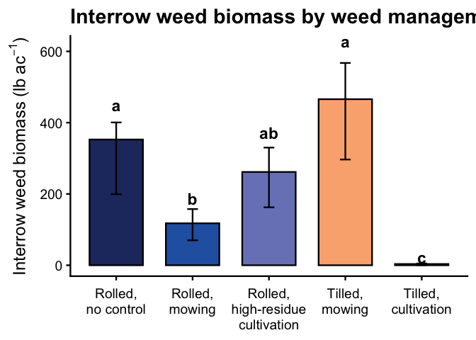<!-- -->

``` r
# Save figure
ggsave(
  filename = here("figs", "analysis", "fig_interrow_weed_biomass_mowing_fieldV_2023_raw_lb_ac.png"),
  width    = 7.5,
  height   = 5.5,
  dpi      = 300
)
```
