Weed biomass
================

- [Data import & prep](#data-import--prep)
- [Model testing](#model-testing)
  - [Exploratory data visualisation](#exploratory-data-visualisation)
    - [Total weed biomass (kg ha⁻¹) by site-year ×
      treatment](#total-weed-biomass-kg-ha¹-by-site-year--treatment)
    - [In-row weed biomass (kg ha⁻¹) by site-year ×
      treatment](#in-row-weed-biomass-kg-ha¹-by-site-year--treatment)
    - [Inter-row weed biomass (kg ha⁻¹) by site-year ×
      treatment](#inter-row-weed-biomass-kg-ha¹-by-site-year--treatment)
  - [Selection](#selection)
    - [Total weed biomass](#total-weed-biomass)
    - [In-row weed biomass](#in-row-weed-biomass)
    - [Inter-row weed biomass](#inter-row-weed-biomass)
- [Figures](#figures)
  - [Total weed biomass](#total-weed-biomass-1)
    - [Model-prediected means (kg ha⁻¹)](#model-prediected-means-kg-ha¹)
    - [Model-prediected means (lb ac⁻¹)](#model-prediected-means-lb-ac¹)
    - [Raw means (kg ha⁻¹)](#raw-means-kg-ha¹)
    - [Raw means (lb ha⁻¹)](#raw-means-lb-ha¹)
  - [In-row weed biomass](#in-row-weed-biomass-1)
    - [Model-prediected means (kg
      ha⁻¹)](#model-prediected-means-kg-ha¹-1)
    - [Model-prediected means (lb
      ac⁻¹)](#model-prediected-means-lb-ac¹-1)
    - [Raw means (kg ha⁻¹)](#raw-means-kg-ha¹-1)
    - [Raw means (lb ha⁻¹)](#raw-means-lb-ha¹-1)
  - [Interrow weed biomass](#interrow-weed-biomass)
    - [Model-prediected means (kg
      ha⁻¹)](#model-prediected-means-kg-ha¹-2)
    - [Model-prediected means (lb
      ac⁻¹)](#model-prediected-means-lb-ac¹-2)
    - [Raw means (kg ha⁻¹)](#raw-means-kg-ha¹-2)
    - [Raw means (lb ha⁻¹)](#raw-means-lb-ha¹-2)

\#Setup

\#Packages

``` r
# Packages
library(tidyverse)    # includes dplyr, ggplot2, readr, tibble, etc.
library(janitor)
library(readxl)
library(glmmTMB)
library(DHARMa)
library(emmeans)
library(multcomp)
library(car)
library(kableExtra)
library(here)
library(conflicted)
library(lme4)
library(WrensBookshelf)


# Handle conflicts
conflicts_prefer(dplyr::select)
conflicts_prefer(dplyr::filter)
conflicts_prefer(dplyr::recode)

# Treatment level order (use everywhere)
mow_levels <- c(
  "Rolled, no control",
  "Rolled, mowing",
  "Rolled, high-residue cultivation",
  "Tilled, mowing",
  "Tilled, cultivation"
)

# One consistent CVD-safe color palette for all figures (WrensBookshelf)
fill_cols <- WB_brewer(
  name = "WhatWellBuild",
  n    = length(mow_levels),
  type = "discrete"
) |>
  setNames(mow_levels)

# x-axis label helpers ---------------------------------------------------

# Break on spaces (if you ever want every word on its own line)
label_break_spaces <- function(x) {
  stringr::str_replace_all(x, " ", "\n")
}

# Break after the comma: "Rolled,\nno control", etc.
label_break_comma <- function(x) {
  stringr::str_replace_all(x, ", ", ",\n")
}

# Break after comma AND split "high-residue cultivation"
# -> "Rolled,\nhigh-residue\ncultivation"
label_break_comma_cult <- function(x) {
  x |>
    stringr::str_replace("high-residue cultivation",
                         "high-residue\ncultivation") |>
    stringr::str_replace_all(", ", ",\n")
}

# Helper: tidy emmeans output regardless of CI column names --------------
# (works directly on an emmeans object)

tidy_emm <- function(emm, ref_levels = NULL) {
  emm_df <- as.data.frame(emm)

  lcl_col <- intersect(c("lower.CL", "asymp.LCL"), names(emm_df))[1]
  ucl_col <- intersect(c("upper.CL", "asymp.UCL"), names(emm_df))[1]

  if (is.na(lcl_col) || is.na(ucl_col)) {
    stop("Could not find CI columns in emmeans output.")
  }

  out <- emm_df |>
    dplyr::mutate(
      ci_low  = .data[[lcl_col]],
      ci_high = .data[[ucl_col]]
    )

  if (!is.null(ref_levels) && "weed_trt" %in% names(out)) {
    out <- out |>
      dplyr::mutate(weed_trt = factor(weed_trt, levels = ref_levels))
  }

  out
}
```

# Data import & prep

``` r
# 1) Read + clean master (weed biomass) ---------------------------------

weed_biomass_clean <- read_excel(
  here("data", "raw", "All Treatments", "combined_raw.xlsx")
) |>
  clean_names() |>
  rename(weed_trt = treatment) |>
  mutate(
    year      = factor(year),
    location  = factor(location),
    site_year = factor(interaction(year, location, drop = TRUE)),
    block     = factor(block),
    weed_trt  = recode(
      weed_trt,
      "RNO" = "Rolled, no control",
      "RIM" = "Rolled, mowing",
      "RIC" = "Rolled, high-residue cultivation",
      "TIM" = "Tilled, mowing",
      "TIC" = "Tilled, cultivation"
    ),
    weed_trt = factor(weed_trt, levels = mow_levels)
  ) |>
  # keep only rows with non-missing total weed biomass
  filter(!is.na(weed_biomass)) |>
  # per-area metrics, assuming all biomass vars are g per 0.5 m² quadrat
  mutate(
    weed_biomass_g_m2           = weed_biomass          * 2,   # g/m²
    weed_biomass_kg_ha          = weed_biomass          * 20,  # kg/ha
    inrow_weed_biomass_g_m2     = inrow_weed_biomass    * 2,
    inrow_weed_biomass_kg_ha    = inrow_weed_biomass    * 20,
    interrow_weed_biomass_g_m2  = interrow_weed_biomass * 2,
    interrow_weed_biomass_kg_ha = interrow_weed_biomass * 20
  )

# 2) 2023 Field V subset -----------------------------------------------

weed_biomass_field_v_2023 <- weed_biomass_clean |>
  filter(year == 2023, location == "field v")

# Quick check
kable(
  head(weed_biomass_clean),
  caption = "All site-years, cleaned (weed biomass)"
)
```

| id | location | year | weed_trt | block | plot | bean_emergence | bean_biomass | inrow_weed_biomass | interrow_weed_biomass | weed_biomass | bean_population | bean_yield | seed_weight | site_year | weed_biomass_g_m2 | weed_biomass_kg_ha | inrow_weed_biomass_g_m2 | inrow_weed_biomass_kg_ha | interrow_weed_biomass_g_m2 | interrow_weed_biomass_kg_ha |
|:---|:---|:---|:---|:---|---:|---:|---:|---:|---:|---:|---:|---:|---:|:---|---:|---:|---:|---:|---:|---:|
| CU_B1_P101 | field v | 2023 | Tilled, mowing | 1 | 101 | 46.5 | 223.740 | 19.000 | 44.490 | 63.490 | 34.5 | 417.21 | 17.1200 | 2023.field v | 126.98 | 1269.8 | 38.00 | 380.0 | 88.98 | 889.8 |
| CU_B1_P102 | field v | 2023 | Tilled, cultivation | 1 | 102 | 42.5 | 267.460 | 30.975 | 0.720 | 31.695 | 39.5 | 565.54 | 17.4750 | 2023.field v | 63.39 | 633.9 | 61.95 | 619.5 | 1.44 | 14.4 |
| CU_B1_P103 | field v | 2023 | Rolled, mowing | 1 | 103 | 36.5 | 217.890 | 0.950 | 6.890 | 7.840 | 37.5 | 449.93 | 16.7525 | 2023.field v | 15.68 | 156.8 | 1.90 | 19.0 | 13.78 | 137.8 |
| CU_B1_P104 | field v | 2023 | Rolled, no control | 1 | 104 | 41.0 | 207.675 | 0.660 | 45.735 | 46.395 | 35.0 | 412.59 | 16.1450 | 2023.field v | 92.79 | 927.9 | 1.32 | 13.2 | 91.47 | 914.7 |
| CU_B1_P105 | field v | 2023 | Rolled, high-residue cultivation | 1 | 105 | 41.0 | 230.285 | 0.495 | 22.025 | 22.520 | 39.0 | 473.79 | 17.0475 | 2023.field v | 45.04 | 450.4 | 0.99 | 9.9 | 44.05 | 440.5 |
| CU_B1_P201 | field v | 2023 | Rolled, high-residue cultivation | 2 | 201 | 36.5 | 208.105 | 6.395 | 19.460 | 25.855 | 33.5 | 484.04 | 17.1500 | 2023.field v | 51.71 | 517.1 | 12.79 | 127.9 | 38.92 | 389.2 |

All site-years, cleaned (weed biomass)

``` r
kable(
  head(weed_biomass_field_v_2023),
  caption = "Field V only, 2023 (weed biomass)"
)
```

| id | location | year | weed_trt | block | plot | bean_emergence | bean_biomass | inrow_weed_biomass | interrow_weed_biomass | weed_biomass | bean_population | bean_yield | seed_weight | site_year | weed_biomass_g_m2 | weed_biomass_kg_ha | inrow_weed_biomass_g_m2 | inrow_weed_biomass_kg_ha | interrow_weed_biomass_g_m2 | interrow_weed_biomass_kg_ha |
|:---|:---|:---|:---|:---|---:|---:|---:|---:|---:|---:|---:|---:|---:|:---|---:|---:|---:|---:|---:|---:|
| CU_B1_P101 | field v | 2023 | Tilled, mowing | 1 | 101 | 46.5 | 223.740 | 19.000 | 44.490 | 63.490 | 34.5 | 417.21 | 17.1200 | 2023.field v | 126.98 | 1269.8 | 38.00 | 380.0 | 88.98 | 889.8 |
| CU_B1_P102 | field v | 2023 | Tilled, cultivation | 1 | 102 | 42.5 | 267.460 | 30.975 | 0.720 | 31.695 | 39.5 | 565.54 | 17.4750 | 2023.field v | 63.39 | 633.9 | 61.95 | 619.5 | 1.44 | 14.4 |
| CU_B1_P103 | field v | 2023 | Rolled, mowing | 1 | 103 | 36.5 | 217.890 | 0.950 | 6.890 | 7.840 | 37.5 | 449.93 | 16.7525 | 2023.field v | 15.68 | 156.8 | 1.90 | 19.0 | 13.78 | 137.8 |
| CU_B1_P104 | field v | 2023 | Rolled, no control | 1 | 104 | 41.0 | 207.675 | 0.660 | 45.735 | 46.395 | 35.0 | 412.59 | 16.1450 | 2023.field v | 92.79 | 927.9 | 1.32 | 13.2 | 91.47 | 914.7 |
| CU_B1_P105 | field v | 2023 | Rolled, high-residue cultivation | 1 | 105 | 41.0 | 230.285 | 0.495 | 22.025 | 22.520 | 39.0 | 473.79 | 17.0475 | 2023.field v | 45.04 | 450.4 | 0.99 | 9.9 | 44.05 | 440.5 |
| CU_B1_P201 | field v | 2023 | Rolled, high-residue cultivation | 2 | 201 | 36.5 | 208.105 | 6.395 | 19.460 | 25.855 | 33.5 | 484.04 | 17.1500 | 2023.field v | 51.71 | 517.1 | 12.79 | 127.9 | 38.92 | 389.2 |

Field V only, 2023 (weed biomass)

# Model testing

## Exploratory data visualisation

### Total weed biomass (kg ha⁻¹) by site-year × treatment

``` r
## Exploratory data visualisation
### Total weed biomass (kg ha^-1) by site-year × treatment

# 1) Summary table: total weed biomass by site-year × treatment ---------
weed_biomass_clean |>
  group_by(site_year, weed_trt) |>
  summarise(
    n      = n(),
    mean   = mean(weed_biomass_kg_ha,   na.rm = TRUE),
    median = median(weed_biomass_kg_ha, na.rm = TRUE),
    sd     = sd(weed_biomass_kg_ha,     na.rm = TRUE),
    .groups = "drop"
  ) |>
  arrange(site_year, weed_trt) |>
  kable(
    digits  = 1,
    caption = "Weed biomass (kg ha^-1) by site-year × treatment"
  ) |>
  kable_styling(full_width = FALSE, bootstrap_options = c("striped", "hover"))
```

<table class="table table-striped table-hover" style="color: black; width: auto !important; margin-left: auto; margin-right: auto;">

<caption>

Weed biomass (kg ha^-1) by site-year × treatment
</caption>

<thead>

<tr>

<th style="text-align:left;">

site_year
</th>

<th style="text-align:left;">

weed_trt
</th>

<th style="text-align:right;">

n
</th>

<th style="text-align:right;">

mean
</th>

<th style="text-align:right;">

median
</th>

<th style="text-align:right;">

sd
</th>

</tr>

</thead>

<tbody>

<tr>

<td style="text-align:left;">

2024.field O2 east
</td>

<td style="text-align:left;">

Rolled, no control
</td>

<td style="text-align:right;">

4
</td>

<td style="text-align:right;">

124.8
</td>

<td style="text-align:right;">

19.5
</td>

<td style="text-align:right;">

224.3
</td>

</tr>

<tr>

<td style="text-align:left;">

2024.field O2 east
</td>

<td style="text-align:left;">

Rolled, mowing
</td>

<td style="text-align:right;">

4
</td>

<td style="text-align:right;">

24.2
</td>

<td style="text-align:right;">

11.8
</td>

<td style="text-align:right;">

28.9
</td>

</tr>

<tr>

<td style="text-align:left;">

2024.field O2 east
</td>

<td style="text-align:left;">

Rolled, high-residue cultivation
</td>

<td style="text-align:right;">

4
</td>

<td style="text-align:right;">

2.3
</td>

<td style="text-align:right;">

1.6
</td>

<td style="text-align:right;">

2.8
</td>

</tr>

<tr>

<td style="text-align:left;">

2024.field O2 east
</td>

<td style="text-align:left;">

Tilled, mowing
</td>

<td style="text-align:right;">

4
</td>

<td style="text-align:right;">

132.9
</td>

<td style="text-align:right;">

75.0
</td>

<td style="text-align:right;">

167.7
</td>

</tr>

<tr>

<td style="text-align:left;">

2024.field O2 east
</td>

<td style="text-align:left;">

Tilled, cultivation
</td>

<td style="text-align:right;">

4
</td>

<td style="text-align:right;">

93.7
</td>

<td style="text-align:right;">

9.2
</td>

<td style="text-align:right;">

172.5
</td>

</tr>

<tr>

<td style="text-align:left;">

2024.field O2 west
</td>

<td style="text-align:left;">

Rolled, no control
</td>

<td style="text-align:right;">

4
</td>

<td style="text-align:right;">

247.2
</td>

<td style="text-align:right;">

38.1
</td>

<td style="text-align:right;">

444.5
</td>

</tr>

<tr>

<td style="text-align:left;">

2024.field O2 west
</td>

<td style="text-align:left;">

Rolled, mowing
</td>

<td style="text-align:right;">

4
</td>

<td style="text-align:right;">

87.8
</td>

<td style="text-align:right;">

28.6
</td>

<td style="text-align:right;">

138.8
</td>

</tr>

<tr>

<td style="text-align:left;">

2024.field O2 west
</td>

<td style="text-align:left;">

Rolled, high-residue cultivation
</td>

<td style="text-align:right;">

4
</td>

<td style="text-align:right;">

272.2
</td>

<td style="text-align:right;">

172.7
</td>

<td style="text-align:right;">

353.9
</td>

</tr>

<tr>

<td style="text-align:left;">

2024.field O2 west
</td>

<td style="text-align:left;">

Tilled, mowing
</td>

<td style="text-align:right;">

4
</td>

<td style="text-align:right;">

195.0
</td>

<td style="text-align:right;">

230.2
</td>

<td style="text-align:right;">

78.9
</td>

</tr>

<tr>

<td style="text-align:left;">

2024.field O2 west
</td>

<td style="text-align:left;">

Tilled, cultivation
</td>

<td style="text-align:right;">

4
</td>

<td style="text-align:right;">

12.2
</td>

<td style="text-align:right;">

1.3
</td>

<td style="text-align:right;">

22.6
</td>

</tr>

<tr>

<td style="text-align:left;">

2023.field v
</td>

<td style="text-align:left;">

Rolled, no control
</td>

<td style="text-align:right;">

4
</td>

<td style="text-align:right;">

419.5
</td>

<td style="text-align:right;">

351.9
</td>

<td style="text-align:right;">

381.2
</td>

</tr>

<tr>

<td style="text-align:left;">

2023.field v
</td>

<td style="text-align:left;">

Rolled, mowing
</td>

<td style="text-align:right;">

4
</td>

<td style="text-align:right;">

257.8
</td>

<td style="text-align:right;">

246.8
</td>

<td style="text-align:right;">

141.5
</td>

</tr>

<tr>

<td style="text-align:left;">

2023.field v
</td>

<td style="text-align:left;">

Rolled, high-residue cultivation
</td>

<td style="text-align:right;">

4
</td>

<td style="text-align:right;">

463.4
</td>

<td style="text-align:right;">

483.8
</td>

<td style="text-align:right;">

108.4
</td>

</tr>

<tr>

<td style="text-align:left;">

2023.field v
</td>

<td style="text-align:left;">

Tilled, mowing
</td>

<td style="text-align:right;">

4
</td>

<td style="text-align:right;">

1184.3
</td>

<td style="text-align:right;">

1128.8
</td>

<td style="text-align:right;">

309.7
</td>

</tr>

<tr>

<td style="text-align:left;">

2023.field v
</td>

<td style="text-align:left;">

Tilled, cultivation
</td>

<td style="text-align:right;">

4
</td>

<td style="text-align:right;">

853.7
</td>

<td style="text-align:right;">

736.2
</td>

<td style="text-align:right;">

307.1
</td>

</tr>

</tbody>

</table>

``` r
# Nice facet labels for site_year ---------------------------------------
site_year_labs <- c(
  "2024.field O2 east" = "2024 \u2013 Field O2 East",
  "2024.field O2 west" = "2024 \u2013 Field O2 West",
  "2023.field v"       = "2023 \u2013 Field V"
)

# 2) Faceted boxplot: all site-years -----------------------------------
wbm_box_total <- weed_biomass_clean |>
  ggplot(aes(x = weed_trt, y = weed_biomass_kg_ha, fill = weed_trt)) +
  geom_boxplot(
    outlier.shape = NA,
    width  = 0.55,
    color  = "black"
  ) +
  geom_jitter(
    width  = 0.12,
    height = 0,
    alpha  = 0.4,
    size   = 1.8,
    color  = "grey30"
  ) +
  facet_wrap(
    ~ site_year,
    nrow     = 1,
    labeller = labeller(site_year = site_year_labs)
  ) +
  scale_fill_manual(values = fill_cols, guide = "none") +
  scale_x_discrete(labels = label_break_comma_cult) +
  scale_y_continuous(labels = scales::label_comma()) +
  labs(
    x     = NULL,
    y     = expression(Weed~biomass~"(kg"~ha^{-1}*")"),
    title = "Weed biomass by treatment across site-years"
  ) +
  theme_classic(base_size = 14) +
  theme(
    axis.text.x = element_text(size = 10),
    strip.text  = element_text(face = "bold")
  )

# Print to document
wbm_box_total
```

<!-- -->

``` r
# 3) Save figure --------------------------------------------------------
fig_dir_total <- here("analysis", "figs", "weed-biomass", "total")
dir.create(fig_dir_total, showWarnings = FALSE, recursive = TRUE)

ggsave(
  filename = file.path(fig_dir_total,
                       "fig_weed_biomass_total_box_by-site-year_kg_ha.png"),
  plot     = wbm_box_total,
  width    = 12,
  height   = 5.5,
  dpi      = 300
)
```

### In-row weed biomass (kg ha⁻¹) by site-year × treatment

``` r
## In-row weed biomass (kg ha^-1) by site-year × treatment --------------

# 1) Summary table: in-row weed biomass by site-year × treatment -------
weed_biomass_clean |>
  group_by(site_year, weed_trt) |>
  summarise(
    n      = n(),
    mean   = mean(inrow_weed_biomass_kg_ha,   na.rm = TRUE),
    median = median(inrow_weed_biomass_kg_ha, na.rm = TRUE),
    sd     = sd(inrow_weed_biomass_kg_ha,     na.rm = TRUE),
    .groups = "drop"
  ) |>
  arrange(site_year, weed_trt) |>
  kable(
    digits  = 1,
    caption = "In-row weed biomass (kg ha^-1) by site-year × treatment"
  ) |>
  kable_styling(full_width = FALSE, bootstrap_options = c("striped", "hover"))
```

<table class="table table-striped table-hover" style="color: black; width: auto !important; margin-left: auto; margin-right: auto;">

<caption>

In-row weed biomass (kg ha^-1) by site-year × treatment
</caption>

<thead>

<tr>

<th style="text-align:left;">

site_year
</th>

<th style="text-align:left;">

weed_trt
</th>

<th style="text-align:right;">

n
</th>

<th style="text-align:right;">

mean
</th>

<th style="text-align:right;">

median
</th>

<th style="text-align:right;">

sd
</th>

</tr>

</thead>

<tbody>

<tr>

<td style="text-align:left;">

2024.field O2 east
</td>

<td style="text-align:left;">

Rolled, no control
</td>

<td style="text-align:right;">

4
</td>

<td style="text-align:right;">

0.0
</td>

<td style="text-align:right;">

0.0
</td>

<td style="text-align:right;">

0.0
</td>

</tr>

<tr>

<td style="text-align:left;">

2024.field O2 east
</td>

<td style="text-align:left;">

Rolled, mowing
</td>

<td style="text-align:right;">

4
</td>

<td style="text-align:right;">

0.1
</td>

<td style="text-align:right;">

0.0
</td>

<td style="text-align:right;">

0.2
</td>

</tr>

<tr>

<td style="text-align:left;">

2024.field O2 east
</td>

<td style="text-align:left;">

Rolled, high-residue cultivation
</td>

<td style="text-align:right;">

4
</td>

<td style="text-align:right;">

0.6
</td>

<td style="text-align:right;">

0.0
</td>

<td style="text-align:right;">

1.1
</td>

</tr>

<tr>

<td style="text-align:left;">

2024.field O2 east
</td>

<td style="text-align:left;">

Tilled, mowing
</td>

<td style="text-align:right;">

4
</td>

<td style="text-align:right;">

16.9
</td>

<td style="text-align:right;">

18.3
</td>

<td style="text-align:right;">

10.0
</td>

</tr>

<tr>

<td style="text-align:left;">

2024.field O2 east
</td>

<td style="text-align:left;">

Tilled, cultivation
</td>

<td style="text-align:right;">

4
</td>

<td style="text-align:right;">

63.4
</td>

<td style="text-align:right;">

9.2
</td>

<td style="text-align:right;">

114.5
</td>

</tr>

<tr>

<td style="text-align:left;">

2024.field O2 west
</td>

<td style="text-align:left;">

Rolled, no control
</td>

<td style="text-align:right;">

4
</td>

<td style="text-align:right;">

26.4
</td>

<td style="text-align:right;">

0.0
</td>

<td style="text-align:right;">

52.9
</td>

</tr>

<tr>

<td style="text-align:left;">

2024.field O2 west
</td>

<td style="text-align:left;">

Rolled, mowing
</td>

<td style="text-align:right;">

4
</td>

<td style="text-align:right;">

65.0
</td>

<td style="text-align:right;">

5.5
</td>

<td style="text-align:right;">

122.8
</td>

</tr>

<tr>

<td style="text-align:left;">

2024.field O2 west
</td>

<td style="text-align:left;">

Rolled, high-residue cultivation
</td>

<td style="text-align:right;">

4
</td>

<td style="text-align:right;">

57.7
</td>

<td style="text-align:right;">

7.7
</td>

<td style="text-align:right;">

105.3
</td>

</tr>

<tr>

<td style="text-align:left;">

2024.field O2 west
</td>

<td style="text-align:left;">

Tilled, mowing
</td>

<td style="text-align:right;">

4
</td>

<td style="text-align:right;">

49.0
</td>

<td style="text-align:right;">

51.2
</td>

<td style="text-align:right;">

35.1
</td>

</tr>

<tr>

<td style="text-align:left;">

2024.field O2 west
</td>

<td style="text-align:left;">

Tilled, cultivation
</td>

<td style="text-align:right;">

4
</td>

<td style="text-align:right;">

11.7
</td>

<td style="text-align:right;">

1.1
</td>

<td style="text-align:right;">

21.9
</td>

</tr>

<tr>

<td style="text-align:left;">

2023.field v
</td>

<td style="text-align:left;">

Rolled, no control
</td>

<td style="text-align:right;">

4
</td>

<td style="text-align:right;">

24.2
</td>

<td style="text-align:right;">

25.9
</td>

<td style="text-align:right;">

8.2
</td>

</tr>

<tr>

<td style="text-align:left;">

2023.field v
</td>

<td style="text-align:left;">

Rolled, mowing
</td>

<td style="text-align:right;">

4
</td>

<td style="text-align:right;">

125.9
</td>

<td style="text-align:right;">

110.4
</td>

<td style="text-align:right;">

107.3
</td>

</tr>

<tr>

<td style="text-align:left;">

2023.field v
</td>

<td style="text-align:left;">

Rolled, high-residue cultivation
</td>

<td style="text-align:right;">

4
</td>

<td style="text-align:right;">

170.1
</td>

<td style="text-align:right;">

195.8
</td>

<td style="text-align:right;">

126.5
</td>

</tr>

<tr>

<td style="text-align:left;">

2023.field v
</td>

<td style="text-align:left;">

Tilled, mowing
</td>

<td style="text-align:right;">

4
</td>

<td style="text-align:right;">

662.2
</td>

<td style="text-align:right;">

569.8
</td>

<td style="text-align:right;">

342.3
</td>

</tr>

<tr>

<td style="text-align:left;">

2023.field v
</td>

<td style="text-align:left;">

Tilled, cultivation
</td>

<td style="text-align:right;">

4
</td>

<td style="text-align:right;">

849.9
</td>

<td style="text-align:right;">

735.8
</td>

<td style="text-align:right;">

310.7
</td>

</tr>

</tbody>

</table>

``` r
# (Assumes site_year_labs already defined as in the total biomass chunk)
# site_year_labs <- c(
#   "2024.field O2 east" = "2024 \u2013 Field O2 East",
#   "2024.field O2 west" = "2024 \u2013 Field O2 West",
#   "2023.field v"       = "2023 \u2013 Field V"
# )

# 2) Faceted boxplot: all site-years -----------------------------------

inrow_box_total <- weed_biomass_clean |>
  ggplot(aes(x = weed_trt, y = inrow_weed_biomass_kg_ha, fill = weed_trt)) +
  geom_boxplot(
    outlier.shape = NA,
    width  = 0.55,
    color  = "black"
  ) +
  geom_jitter(
    width  = 0.12,
    height = 0,
    alpha  = 0.4,
    size   = 1.8,
    color  = "grey30"
  ) +
  facet_wrap(
    ~ site_year,
    nrow     = 1,
    labeller = labeller(site_year = site_year_labs)
  ) +
  scale_fill_manual(values = fill_cols, guide = "none") +
  scale_x_discrete(labels = label_break_comma_cult) +
  scale_y_continuous(labels = scales::label_comma()) +
  labs(
    x     = NULL,
    y     = expression(In-row~weed~biomass~"(kg"~ha^{-1}*")"),
    title = "In-row weed biomass by treatment across site-years"
  ) +
  theme_classic(base_size = 14) +
  theme(
    axis.text.x = element_text(size = 10),
    strip.text  = element_text(face = "bold")
  )

# Print to document
inrow_box_total
```

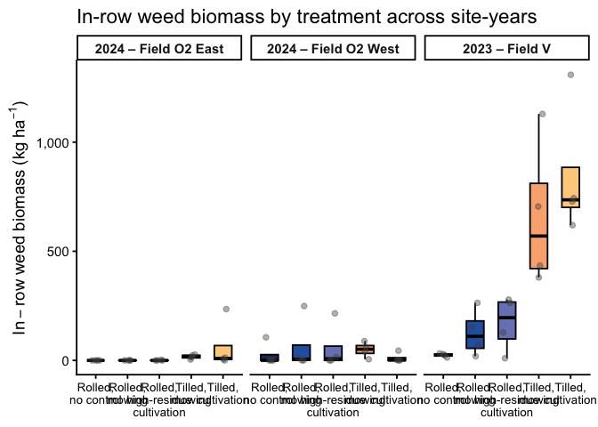<!-- -->

``` r
# 3) Save figure --------------------------------------------------------
fig_dir_total <- here("analysis", "figs", "weed-biomass", "in-row")
dir.create(fig_dir_total, showWarnings = FALSE, recursive = TRUE)

ggsave(
  filename = file.path(fig_dir_total,
                       "fig_weed_biomass_inrow_box_by-site-year_kg_ha.png"),
  plot     = wbm_box_total,
  width    = 12,
  height   = 5.5,
  dpi      = 300
)
```

### Inter-row weed biomass (kg ha⁻¹) by site-year × treatment

``` r
## Inter-row weed biomass (kg ha^-1) by site-year × treatment -----------

# 1) Summary table: inter-row weed biomass by site-year × treatment ----
weed_biomass_clean |>
  group_by(site_year, weed_trt) |>
  summarise(
    n      = n(),
    mean   = mean(interrow_weed_biomass_kg_ha,   na.rm = TRUE),
    median = median(interrow_weed_biomass_kg_ha, na.rm = TRUE),
    sd     = sd(interrow_weed_biomass_kg_ha,     na.rm = TRUE),
    .groups = "drop"
  ) |>
  arrange(site_year, weed_trt) |>
  kable(
    digits  = 1,
    caption = "Inter-row weed biomass (kg ha^-1) by site-year × treatment"
  ) |>
  kable_styling(full_width = FALSE, bootstrap_options = c("striped", "hover"))
```

<table class="table table-striped table-hover" style="color: black; width: auto !important; margin-left: auto; margin-right: auto;">

<caption>

Inter-row weed biomass (kg ha^-1) by site-year × treatment
</caption>

<thead>

<tr>

<th style="text-align:left;">

site_year
</th>

<th style="text-align:left;">

weed_trt
</th>

<th style="text-align:right;">

n
</th>

<th style="text-align:right;">

mean
</th>

<th style="text-align:right;">

median
</th>

<th style="text-align:right;">

sd
</th>

</tr>

</thead>

<tbody>

<tr>

<td style="text-align:left;">

2024.field O2 east
</td>

<td style="text-align:left;">

Rolled, no control
</td>

<td style="text-align:right;">

4
</td>

<td style="text-align:right;">

124.8
</td>

<td style="text-align:right;">

19.5
</td>

<td style="text-align:right;">

224.3
</td>

</tr>

<tr>

<td style="text-align:left;">

2024.field O2 east
</td>

<td style="text-align:left;">

Rolled, mowing
</td>

<td style="text-align:right;">

4
</td>

<td style="text-align:right;">

24.1
</td>

<td style="text-align:right;">

11.8
</td>

<td style="text-align:right;">

29.0
</td>

</tr>

<tr>

<td style="text-align:left;">

2024.field O2 east
</td>

<td style="text-align:left;">

Rolled, high-residue cultivation
</td>

<td style="text-align:right;">

4
</td>

<td style="text-align:right;">

1.7
</td>

<td style="text-align:right;">

0.5
</td>

<td style="text-align:right;">

2.8
</td>

</tr>

<tr>

<td style="text-align:left;">

2024.field O2 east
</td>

<td style="text-align:left;">

Tilled, mowing
</td>

<td style="text-align:right;">

4
</td>

<td style="text-align:right;">

116.0
</td>

<td style="text-align:right;">

54.6
</td>

<td style="text-align:right;">

162.0
</td>

</tr>

<tr>

<td style="text-align:left;">

2024.field O2 east
</td>

<td style="text-align:left;">

Tilled, cultivation
</td>

<td style="text-align:right;">

4
</td>

<td style="text-align:right;">

30.4
</td>

<td style="text-align:right;">

2.0
</td>

<td style="text-align:right;">

58.0
</td>

</tr>

<tr>

<td style="text-align:left;">

2024.field O2 west
</td>

<td style="text-align:left;">

Rolled, no control
</td>

<td style="text-align:right;">

4
</td>

<td style="text-align:right;">

220.8
</td>

<td style="text-align:right;">

38.1
</td>

<td style="text-align:right;">

391.8
</td>

</tr>

<tr>

<td style="text-align:left;">

2024.field O2 west
</td>

<td style="text-align:left;">

Rolled, mowing
</td>

<td style="text-align:right;">

4
</td>

<td style="text-align:right;">

22.8
</td>

<td style="text-align:right;">

23.4
</td>

<td style="text-align:right;">

23.9
</td>

</tr>

<tr>

<td style="text-align:left;">

2024.field O2 west
</td>

<td style="text-align:left;">

Rolled, high-residue cultivation
</td>

<td style="text-align:right;">

4
</td>

<td style="text-align:right;">

214.5
</td>

<td style="text-align:right;">

65.0
</td>

<td style="text-align:right;">

347.9
</td>

</tr>

<tr>

<td style="text-align:left;">

2024.field O2 west
</td>

<td style="text-align:left;">

Tilled, mowing
</td>

<td style="text-align:right;">

4
</td>

<td style="text-align:right;">

146.0
</td>

<td style="text-align:right;">

155.3
</td>

<td style="text-align:right;">

57.1
</td>

</tr>

<tr>

<td style="text-align:left;">

2024.field O2 west
</td>

<td style="text-align:left;">

Tilled, cultivation
</td>

<td style="text-align:right;">

4
</td>

<td style="text-align:right;">

0.5
</td>

<td style="text-align:right;">

0.2
</td>

<td style="text-align:right;">

0.7
</td>

</tr>

<tr>

<td style="text-align:left;">

2023.field v
</td>

<td style="text-align:left;">

Rolled, no control
</td>

<td style="text-align:right;">

4
</td>

<td style="text-align:right;">

395.3
</td>

<td style="text-align:right;">

326.0
</td>

<td style="text-align:right;">

388.2
</td>

</tr>

<tr>

<td style="text-align:left;">

2023.field v
</td>

<td style="text-align:left;">

Rolled, mowing
</td>

<td style="text-align:right;">

4
</td>

<td style="text-align:right;">

131.9
</td>

<td style="text-align:right;">

145.1
</td>

<td style="text-align:right;">

55.3
</td>

</tr>

<tr>

<td style="text-align:left;">

2023.field v
</td>

<td style="text-align:left;">

Rolled, high-residue cultivation
</td>

<td style="text-align:right;">

4
</td>

<td style="text-align:right;">

293.3
</td>

<td style="text-align:right;">

339.3
</td>

<td style="text-align:right;">

171.4
</td>

</tr>

<tr>

<td style="text-align:left;">

2023.field v
</td>

<td style="text-align:left;">

Tilled, mowing
</td>

<td style="text-align:right;">

4
</td>

<td style="text-align:right;">

522.1
</td>

<td style="text-align:right;">

458.1
</td>

<td style="text-align:right;">

258.7
</td>

</tr>

<tr>

<td style="text-align:left;">

2023.field v
</td>

<td style="text-align:left;">

Tilled, cultivation
</td>

<td style="text-align:right;">

4
</td>

<td style="text-align:right;">

3.8
</td>

<td style="text-align:right;">

0.5
</td>

<td style="text-align:right;">

7.0
</td>

</tr>

</tbody>

</table>

``` r
# Assumes site_year_labs already defined earlier, e.g.:
# site_year_labs <- c(
#   "2024.field O2 east" = "2024 \u2013 Field O2 East",
#   "2024.field O2 west" = "2024 \u2013 Field O2 West",
#   "2023.field v"       = "2023 \u2013 Field V"
# )

# 2) Faceted boxplot: all site-years -----------------------------------

interrow_box_total <- weed_biomass_clean |>
  ggplot(aes(x = weed_trt, y = interrow_weed_biomass_kg_ha, fill = weed_trt)) +
  geom_boxplot(
    outlier.shape = NA,
    width  = 0.55,
    color  = "black"
  ) +
  geom_jitter(
    width  = 0.12,
    height = 0,
    alpha  = 0.4,
    size   = 1.8,
    color  = "grey30"
  ) +
  facet_wrap(
    ~ site_year,
    nrow     = 1,
    labeller = labeller(site_year = site_year_labs)
  ) +
  scale_fill_manual(values = fill_cols, guide = "none") +
  scale_x_discrete(labels = label_break_comma_cult) +
  scale_y_continuous(labels = scales::label_comma()) +
  labs(
    x     = NULL,
    y     = expression(Inter-row~weed~biomass~"(kg"~ha^{-1}*")"),
    title = "Inter-row weed biomass by treatment across site-years"
  ) +
  theme_classic(base_size = 14) +
  theme(
    axis.text.x = element_text(size = 10),
    strip.text  = element_text(face = "bold")
  )

# Print to document
interrow_box_total
```

<!-- -->

``` r
# 3) Save figure --------------------------------------------------------
fig_dir_total <- here("analysis", "figs", "weed-biomass", "inter-row")
dir.create(fig_dir_total, showWarnings = FALSE, recursive = TRUE)

ggsave(
  filename = file.path(fig_dir_total,
                       "fig_weed_biomass_interrow_box_by-site-year_kg_ha.png"),
  plot     = wbm_box_total,
  width    = 12,
  height   = 5.5,
  dpi      = 300
)
```

## Selection

``` r
# Model selection rule for weed biomass responses:
# - Fit a full GLMM with weed_trt × site_year.
# - Compare to an additive model (weed_trt + site_year) using LRT + ΔAIC:
#     * LRT p < 0.01 or ΔAIC ≥ 4 → keep the interaction model.
#     * LRT p > 0.20 and |ΔAIC| < 2 → treat the interaction as negligible and use the additive model.
#     * Intermediate cases (0.01 ≤ p ≤ 0.20 and |ΔAIC| < 2) = ambiguous evidence:
#         use the additive model for parsimony, but visualize site-year patterns
#         and note the marginal interaction in the text/figure captions.
```

### Total weed biomass

``` r
### Model testing / selection for weed biomass (kg ha⁻¹)

options(contrasts = c("contr.sum", "contr.poly"))

# Base fixed/random structure used for family selection: full interaction
form_all <- weed_biomass_kg_ha ~ weed_trt * site_year + (1 | site_year:block)

## 1) Candidate families / structures (all with interaction) -------------

m_all_tw <- glmmTMB(
  formula = form_all,
  family  = tweedie(link = "log"),
  data    = weed_biomass_clean
)

m_all_nb <- glmmTMB(
  formula = form_all,
  family  = nbinom2(link = "log"),
  data    = weed_biomass_clean
)

m_all_tw_zi <- glmmTMB(
  formula   = form_all,
  family    = tweedie(link = "log"),
  ziformula = ~ 1,
  data      = weed_biomass_clean
)

m_all_tw_disp <- glmmTMB(
  formula     = form_all,
  family      = tweedie(link = "log"),
  ziformula   = ~ 1,
  dispformula = ~ site_year,
  data        = weed_biomass_clean
)

# Safe AIC helper --------------------------------------------------------
safe_aic <- function(mod) {
  out <- try(AIC(mod), silent = TRUE)
  if (inherits(out, "try-error")) return(NA_real_)
  out
}

aic_all <- tibble(
  model = c(
    "ALL: Tweedie",
    "ALL: NB2",
    "ALL: Tweedie + ZI",
    "ALL: Tweedie + ZI + disp(site_year)"
  ),
  AIC = c(
    safe_aic(m_all_tw),
    safe_aic(m_all_nb),
    safe_aic(m_all_tw_zi),
    safe_aic(m_all_tw_disp)
  )
)

kable(
  aic_all,
  digits  = 1,
  caption = "Pooled (all site-years) weed biomass (kg ha⁻¹): candidate distributional families"
) |>
  kable_styling(full_width = FALSE, bootstrap_options = c("striped", "hover"))
```

<table class="table table-striped table-hover" style="color: black; width: auto !important; margin-left: auto; margin-right: auto;">

<caption>

Pooled (all site-years) weed biomass (kg ha⁻¹): candidate distributional
families
</caption>

<thead>

<tr>

<th style="text-align:left;">

model
</th>

<th style="text-align:right;">

AIC
</th>

</tr>

</thead>

<tbody>

<tr>

<td style="text-align:left;">

ALL: Tweedie
</td>

<td style="text-align:right;">

718.1
</td>

</tr>

<tr>

<td style="text-align:left;">

ALL: NB2
</td>

<td style="text-align:right;">

723.5
</td>

</tr>

<tr>

<td style="text-align:left;">

ALL: Tweedie + ZI
</td>

<td style="text-align:right;">

719.2
</td>

</tr>

<tr>

<td style="text-align:left;">

ALL: Tweedie + ZI + disp(site_year)
</td>

<td style="text-align:right;">

707.9
</td>

</tr>

</tbody>

</table>

``` r
## 2) Choose best family (NA-safe, require > 2 AIC units better) --------

best_all   <- m_all_tw
best_all_n <- "ALL: Tweedie"
best_aic   <- safe_aic(m_all_tw)

cands <- list(
  "ALL: NB2"                          = m_all_nb,
  "ALL: Tweedie + ZI"                 = m_all_tw_zi,
  "ALL: Tweedie + ZI + disp(site_year)" = m_all_tw_disp
)

for (nm in names(cands)) {
  this_aic <- safe_aic(cands[[nm]])
  if (is.finite(this_aic) && (this_aic + 2 < best_aic)) {
    best_all   <- cands[[nm]]
    best_all_n <- nm
    best_aic   <- this_aic
  }
}

cat("Selected family/structure for weed biomass (all site-years):", best_all_n, "\n")
```

    ## Selected family/structure for weed biomass (all site-years): ALL: Tweedie + ZI + disp(site_year)

``` r
## 3) Within chosen family: additive vs interaction ----------------------

# Interaction model in chosen family (already fit above)
wbm_int <- best_all

# Additive model: same family/ZI/dispersion, simpler fixed effects
wbm_add <- update(
  best_all,
  . ~ weed_trt + site_year + (1 | site_year:block)
)

# Compare additive vs interaction
lrt_wbm <- anova(wbm_add, wbm_int)   # LRT for interaction
p_int_wbm <- lrt_wbm$`Pr(>Chisq)`[2]

AIC_add <- AIC(wbm_add)
AIC_int <- AIC(wbm_int)
deltaAIC <- AIC_add - AIC_int        # > 0 means interaction has lower AIC

# Helper thresholds (you can tweak these globally if you like)
p_strong    <- 0.01   # strong evidence for interaction
p_none      <- 0.20   # essentially no evidence for interaction
dAIC_strong <- 4      # standard "substantial" AIC improvement

# Classify evidence for interaction
interaction_class <- dplyr::case_when(
  p_int_wbm < p_strong | deltaAIC >= dAIC_strong ~ "interaction",
  p_int_wbm > p_none  & abs(deltaAIC) < 2        ~ "additive",
  TRUE                                           ~ "gray_zone"
)

# Choose primary model (for now: default to additive in gray zone)
primary_model_name_wbm <- dplyr::case_when(
  interaction_class == "interaction" ~ "Interaction: weed_trt * site_year",
  TRUE                               ~ "Additive: weed_trt + site_year"
)

weed_glmm <- if (primary_model_name_wbm == "Interaction: weed_trt * site_year") {
  wbm_int
} else {
  wbm_add
}

# AIC table for reporting
aic_wbm_out <- tibble::tibble(
  model = c(
    "Additive: weed_trt + site_year",
    "Interaction: weed_trt * site_year"
  ),
  AIC = c(AIC_add, AIC_int)
) |>
  dplyr::mutate(
    deltaAIC = AIC - min(AIC),
    Selected = dplyr::if_else(model == primary_model_name_wbm, "Yes", ""),
    Evidence_for_interaction = interaction_class
  )

kable(
  aic_wbm_out,
  digits  = 2,
  caption = "Weed biomass (kg ha⁻¹): additive vs interaction (within chosen family)"
) |>
  kable_styling(full_width = FALSE, bootstrap_options = c("striped", "hover"))
```

<table class="table table-striped table-hover" style="color: black; width: auto !important; margin-left: auto; margin-right: auto;">

<caption>

Weed biomass (kg ha⁻¹): additive vs interaction (within chosen family)
</caption>

<thead>

<tr>

<th style="text-align:left;">

model
</th>

<th style="text-align:right;">

AIC
</th>

<th style="text-align:right;">

deltaAIC
</th>

<th style="text-align:left;">

Selected
</th>

<th style="text-align:left;">

Evidence_for_interaction
</th>

</tr>

</thead>

<tbody>

<tr>

<td style="text-align:left;">

Additive: weed_trt + site_year
</td>

<td style="text-align:right;">

707.16
</td>

<td style="text-align:right;">

0.00
</td>

<td style="text-align:left;">

Yes
</td>

<td style="text-align:left;">

gray_zone
</td>

</tr>

<tr>

<td style="text-align:left;">

Interaction: weed_trt \* site_year
</td>

<td style="text-align:right;">

707.90
</td>

<td style="text-align:right;">

0.74
</td>

<td style="text-align:left;">

</td>

<td style="text-align:left;">

gray_zone
</td>

</tr>

</tbody>

</table>

``` r
cat(
  "\nSelected primary model for weed biomass (used in emmeans/plots):\n  ",
  primary_model_name_wbm,
  sprintf(
    "  [LRT p = %.3f; ΔAIC (add - int) = %.2f; class = %s]\n",
    p_int_wbm, deltaAIC, interaction_class
  )
)
```

    ## 
    ## Selected primary model for weed biomass (used in emmeans/plots):
    ##    Additive: weed_trt + site_year   [LRT p = 0.054; ΔAIC (add - int) = -0.74; class = gray_zone]

``` r
## 4) Diagnostics + Type-III tests for the chosen model ------------------

set.seed(123)
res_wbm <- DHARMa::simulateResiduals(weed_glmm)
plot(res_wbm)
```

<!-- -->

``` r
DHARMa::testDispersion(weed_glmm)
```

<!-- -->

    ## 
    ##  DHARMa nonparametric dispersion test via sd of residuals fitted vs.
    ##  simulated
    ## 
    ## data:  simulationOutput
    ## dispersion = 0.63786, p-value = 0.448
    ## alternative hypothesis: two.sided

``` r
DHARMa::testZeroInflation(weed_glmm)
```

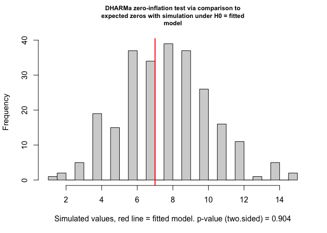<!-- -->

    ## 
    ##  DHARMa zero-inflation test via comparison to expected zeros with
    ##  simulation under H0 = fitted model
    ## 
    ## data:  simulationOutput
    ## ratioObsSim = 0.89423, p-value = 0.904
    ## alternative hypothesis: two.sided

``` r
car::Anova(weed_glmm, type = 3)
```

    ## Analysis of Deviance Table (Type III Wald chisquare tests)
    ## 
    ## Response: weed_biomass_kg_ha
    ##               Chisq Df Pr(>Chisq)    
    ## (Intercept) 855.354  1  < 2.2e-16 ***
    ## weed_trt     24.923  4  5.213e-05 ***
    ## site_year    36.546  2  1.159e-08 ***
    ## ---
    ## Signif. codes:  0 '***' 0.001 '**' 0.01 '*' 0.05 '.' 0.1 ' ' 1

#### Post-hoc summary table

``` r
##### Post-hoc summary table

### Total weed biomass (kg ha^-1) with Fisher's LSD CLDs

# Estimated marginal means for weed_trt on the response scale (kg ha^-1)
emm_wbm <- emmeans(
  weed_glmm,
  ~ weed_trt,
  type = "response"   # back-transform from log link
)

# Tidy emmeans for reporting (rename columns to match other RMDs)
emm_wbm_df <- as_tibble(emm_wbm) |>
  mutate(
    weed_trt = factor(weed_trt, levels = mow_levels)
  ) |>
  rename(
    emmean  = response,   # mean on response scale
    ci_low  = asymp.LCL,  # lower CI
    ci_high = asymp.UCL   # upper CI
  )

# Compact letter display (Fisher's LSD, no adjustment; "a" = highest)
cld_wbm <- cld(
  emm_wbm,
  adjust   = "none",
  Letters  = letters,
  sort     = TRUE,
  reversed = TRUE   # so "a" = highest biomass group(s)
) |>
  as_tibble() |>
  mutate(
    weed_trt = factor(weed_trt, levels = mow_levels),
    .group   = str_trim(.group)
  ) |>
  select(weed_trt, .group)

# Join emmeans + CLDs and format for reporting
emm_wbm_df |>
  left_join(cld_wbm, by = "weed_trt") |>
  select(weed_trt, emmean, SE, ci_low, ci_high, .group) |>
  mutate(
    across(c(emmean, SE, ci_low, ci_high), ~ round(.x, 1))
  ) |>
  kable(
    caption   = "Estimated total weed biomass (kg ha^-1) with 95% CI and Fisher's LSD group letters",
    col.names = c("Treatment", "Mean", "SE", "Lower CI", "Upper CI", "Group")
  ) |>
  kable_styling(full_width = FALSE, bootstrap_options = c("striped", "hover"))
```

<table class="table table-striped table-hover" style="color: black; width: auto !important; margin-left: auto; margin-right: auto;">

<caption>

Estimated total weed biomass (kg ha^-1) with 95% CI and Fisher’s LSD
group letters
</caption>

<thead>

<tr>

<th style="text-align:left;">

Treatment
</th>

<th style="text-align:right;">

Mean
</th>

<th style="text-align:right;">

SE
</th>

<th style="text-align:right;">

Lower CI
</th>

<th style="text-align:right;">

Upper CI
</th>

<th style="text-align:left;">

Group
</th>

</tr>

</thead>

<tbody>

<tr>

<td style="text-align:left;">

Rolled, no control
</td>

<td style="text-align:right;">

164.0
</td>

<td style="text-align:right;">

42.6
</td>

<td style="text-align:right;">

98.6
</td>

<td style="text-align:right;">

272.9
</td>

<td style="text-align:left;">

bc
</td>

</tr>

<tr>

<td style="text-align:left;">

Rolled, mowing
</td>

<td style="text-align:right;">

85.0
</td>

<td style="text-align:right;">

24.3
</td>

<td style="text-align:right;">

48.5
</td>

<td style="text-align:right;">

149.0
</td>

<td style="text-align:left;">

c
</td>

</tr>

<tr>

<td style="text-align:left;">

Rolled, high-residue cultivation
</td>

<td style="text-align:right;">

153.8
</td>

<td style="text-align:right;">

42.3
</td>

<td style="text-align:right;">

89.7
</td>

<td style="text-align:right;">

263.7
</td>

<td style="text-align:left;">

bc
</td>

</tr>

<tr>

<td style="text-align:left;">

Tilled, mowing
</td>

<td style="text-align:right;">

378.3
</td>

<td style="text-align:right;">

98.1
</td>

<td style="text-align:right;">

227.6
</td>

<td style="text-align:right;">

628.8
</td>

<td style="text-align:left;">

a
</td>

</tr>

<tr>

<td style="text-align:left;">

Tilled, cultivation
</td>

<td style="text-align:right;">

261.9
</td>

<td style="text-align:right;">

71.5
</td>

<td style="text-align:right;">

153.5
</td>

<td style="text-align:right;">

447.1
</td>

<td style="text-align:left;">

ab
</td>

</tr>

</tbody>

</table>

``` r
emm_wbm_out <- emm_wbm_df |>
  left_join(cld_wbm, by = "weed_trt") |>
  select(weed_trt, emmean, SE, ci_low, ci_high, .group) |>
  mutate(
    across(c(emmean, SE, ci_low, ci_high), ~ round(.x, 1))
  )
```

#### Global response summary table

``` r
## 0) Directory for all weed-biomass tables ------------------------------

tab_dir_wbm <- here("analysis", "tables", "weed-biomass", "total")
dir.create(tab_dir_wbm, showWarnings = FALSE, recursive = TRUE)


# 1) P-value summary (Location, Treatment, Interaction) ------------------

anova_wbm <- Anova(weed_glmm, type = 3)

anova_wbm_df <- anova_wbm |>
  as.data.frame() |>
  tibble::rownames_to_column("Effect")

p_site <- anova_wbm_df$`Pr(>Chisq)`[anova_wbm_df$Effect == "site_year"]
p_trt  <- anova_wbm_df$`Pr(>Chisq)`[anova_wbm_df$Effect == "weed_trt"]
p_int  <- anova_wbm_df$`Pr(>Chisq)`[anova_wbm_df$Effect == "weed_trt:site_year"]

pvals_wbm <- tibble(
  Effect = c(
    "Location (site_year)",
    "Treatment (weed_trt)"
  ),
  p_raw = c(p_site, p_trt)
)

# Only include the interaction row if the *selected* primary model uses the interaction
if (primary_model_name_wbm == "Interaction: weed_trt * site_year") {
  pvals_wbm <- bind_rows(
    pvals_wbm,
    tibble(
      Effect = "Location × Treatment",
      p_raw  = p_int
    )
  )
}

pvals_wbm <- pvals_wbm |>
  mutate(
    `P-value` = case_when(
      p_raw < 0.001 ~ "<0.001",
      p_raw < 0.01  ~ "<0.01",
      TRUE          ~ sprintf("%.3f", p_raw)
    )
  ) |>
  select(Effect, `P-value`)

# Save ANOVA p-value summary
readr::write_csv(
  pvals_wbm,
  file.path(tab_dir_wbm, "tab_total-wbm_Anova_pvals.csv")
)


## 1b) Likelihood-ratio test: additive vs interaction --------------------

lrt_table_wbm <- tibble(
  Test  = "LRT (additive vs interaction)",
  p_raw = lrt_wbm$`Pr(>Chisq)`[2]
) |>
  mutate(
    `P-value` = case_when(
      p_raw < 0.001 ~ "<0.001",
      p_raw < 0.01  ~ "<0.01",
      TRUE          ~ sprintf("%.3f", p_raw)
    )
  ) |>
  select(Test, `P-value`)

# Save LRT summary
readr::write_csv(
  lrt_table_wbm,
  file.path(tab_dir_wbm, "tab_total-wbm_LRT_add-vs-int.csv")
)

lrt_table_wbm |>
  kable(
    caption   = "Weed biomass (kg ha^-1): Likelihood-ratio test comparing additive vs interaction models",
    col.names = c("Test", "P-value")
  ) |>
  kable_styling(full_width = FALSE, bootstrap_options = c("striped", "hover"))
```

<table class="table table-striped table-hover" style="color: black; width: auto !important; margin-left: auto; margin-right: auto;">

<caption>

Weed biomass (kg ha^-1): Likelihood-ratio test comparing additive vs
interaction models
</caption>

<thead>

<tr>

<th style="text-align:left;">

Test
</th>

<th style="text-align:left;">

P-value
</th>

</tr>

</thead>

<tbody>

<tr>

<td style="text-align:left;">

LRT (additive vs interaction)
</td>

<td style="text-align:left;">

0.054
</td>

</tr>

</tbody>

</table>

``` r
## 2) Location block: site-year means (model + raw) ----------------------

emm_loc_wbm <- emmeans(
  weed_glmm,
  ~ site_year,
  type = "response"
)

emm_loc_wbm_df <- as_tibble(emm_loc_wbm) |>
  mutate(
    site_year  = as.factor(site_year),
    model_mean = response   # kg ha^-1
  ) |>
  select(site_year, model_mean)

cld_loc_wbm <- cld(
  emm_loc_wbm,
  adjust   = "none",
  Letters  = letters,
  sort     = TRUE,
  reversed = TRUE
) |>
  as_tibble() |>
  mutate(
    site_year = as.factor(site_year),
    loc_CLD   = str_trim(.group)
  ) |>
  select(site_year, loc_CLD)

raw_loc_wbm <- weed_biomass_clean |>
  group_by(site_year) |>
  summarise(
    raw_mean = mean(weed_biomass_kg_ha, na.rm = TRUE),
    .groups  = "drop"
  ) |>
  mutate(site_year = as.factor(site_year))

loc_summary_wbm <- emm_loc_wbm_df |>
  left_join(cld_loc_wbm, by = "site_year") |>
  left_join(raw_loc_wbm, by = "site_year") |>
  mutate(
    model_mean = round(model_mean, 1),
    raw_mean   = round(raw_mean, 1),
    raw_CLD    = loc_CLD
  ) |>
  arrange(site_year)

# Save location summary
readr::write_csv(
  loc_summary_wbm,
  file.path(tab_dir_wbm, "tab_total-wbm_location_means_CLD.csv")
)

loc_summary_wbm |>
  kable(
    caption   = "Weed biomass (kg ha^-1): location (site-year) means with CLDs",
    col.names = c("Site-year", "Model mean", "Model CLD", "Raw mean", "Raw CLD")
  ) |>
  kable_styling(full_width = FALSE, bootstrap_options = c("striped", "hover"))
```

<table class="table table-striped table-hover" style="color: black; width: auto !important; margin-left: auto; margin-right: auto;">

<caption>

Weed biomass (kg ha^-1): location (site-year) means with CLDs
</caption>

<thead>

<tr>

<th style="text-align:left;">

Site-year
</th>

<th style="text-align:right;">

Model mean
</th>

<th style="text-align:left;">

Model CLD
</th>

<th style="text-align:right;">

Raw mean
</th>

<th style="text-align:left;">

Raw CLD
</th>

</tr>

</thead>

<tbody>

<tr>

<td style="text-align:left;">

2024.field O2 east
</td>

<td style="text-align:right;">

65.7
</td>

<td style="text-align:left;">

b
</td>

<td style="text-align:right;">

75.6
</td>

<td style="text-align:left;">

b
</td>

</tr>

<tr>

<td style="text-align:left;">

2024.field O2 west
</td>

<td style="text-align:right;">

171.8
</td>

<td style="text-align:left;">

b
</td>

<td style="text-align:right;">

162.9
</td>

<td style="text-align:left;">

b
</td>

</tr>

<tr>

<td style="text-align:left;">

2023.field v
</td>

<td style="text-align:right;">

554.4
</td>

<td style="text-align:left;">

a
</td>

<td style="text-align:right;">

635.7
</td>

<td style="text-align:left;">

a
</td>

</tr>

</tbody>

</table>

``` r
## 3) Treatment block: means (model + raw) -------------------------------

emm_wbm <- emmeans(
  weed_glmm,
  ~ weed_trt,
  type = "response"
)

emm_trt_wbm_df <- as_tibble(emm_wbm) |>
  mutate(
    weed_trt   = factor(weed_trt, levels = mow_levels),
    model_mean = response   # kg ha^-1
  ) |>
  select(weed_trt, model_mean)

cld_wbm <- cld(
  emm_wbm,
  adjust   = "none",
  Letters  = letters,
  sort     = TRUE,
  reversed = TRUE
) |>
  as_tibble() |>
  mutate(
    weed_trt = factor(weed_trt, levels = mow_levels),
    trt_CLD  = str_trim(.group)
  ) |>
  select(weed_trt, trt_CLD)

raw_trt_wbm <- weed_biomass_clean |>
  group_by(weed_trt) |>
  summarise(
    raw_mean = mean(weed_biomass_kg_ha, na.rm = TRUE),
    .groups  = "drop"
  ) |>
  mutate(weed_trt = factor(weed_trt, levels = mow_levels))

trt_summary_wbm <- emm_trt_wbm_df |>
  left_join(cld_wbm,     by = "weed_trt") |>
  left_join(raw_trt_wbm, by = "weed_trt") |>
  mutate(
    model_mean = round(model_mean, 1),
    raw_mean   = round(raw_mean, 1),
    raw_CLD    = trt_CLD
  ) |>
  arrange(weed_trt)

# Save treatment summary
readr::write_csv(
  trt_summary_wbm,
  file.path(tab_dir_wbm, "tab_total-wbm_treatment_means_CLD.csv")
)

trt_summary_wbm |>
  kable(
    caption   = "Weed biomass (kg ha^-1): treatment means with CLDs",
    col.names = c("Treatment", "Model mean", "Model CLD", "Raw mean", "Raw CLD")
  ) |>
  kable_styling(full_width = FALSE, bootstrap_options = c("striped", "hover"))
```

<table class="table table-striped table-hover" style="color: black; width: auto !important; margin-left: auto; margin-right: auto;">

<caption>

Weed biomass (kg ha^-1): treatment means with CLDs
</caption>

<thead>

<tr>

<th style="text-align:left;">

Treatment
</th>

<th style="text-align:right;">

Model mean
</th>

<th style="text-align:left;">

Model CLD
</th>

<th style="text-align:right;">

Raw mean
</th>

<th style="text-align:left;">

Raw CLD
</th>

</tr>

</thead>

<tbody>

<tr>

<td style="text-align:left;">

Rolled, no control
</td>

<td style="text-align:right;">

164.0
</td>

<td style="text-align:left;">

bc
</td>

<td style="text-align:right;">

263.8
</td>

<td style="text-align:left;">

bc
</td>

</tr>

<tr>

<td style="text-align:left;">

Rolled, mowing
</td>

<td style="text-align:right;">

85.0
</td>

<td style="text-align:left;">

c
</td>

<td style="text-align:right;">

123.2
</td>

<td style="text-align:left;">

c
</td>

</tr>

<tr>

<td style="text-align:left;">

Rolled, high-residue cultivation
</td>

<td style="text-align:right;">

153.8
</td>

<td style="text-align:left;">

bc
</td>

<td style="text-align:right;">

246.0
</td>

<td style="text-align:left;">

bc
</td>

</tr>

<tr>

<td style="text-align:left;">

Tilled, mowing
</td>

<td style="text-align:right;">

378.3
</td>

<td style="text-align:left;">

a
</td>

<td style="text-align:right;">

504.1
</td>

<td style="text-align:left;">

a
</td>

</tr>

<tr>

<td style="text-align:left;">

Tilled, cultivation
</td>

<td style="text-align:right;">

261.9
</td>

<td style="text-align:left;">

ab
</td>

<td style="text-align:right;">

319.9
</td>

<td style="text-align:left;">

ab
</td>

</tr>

</tbody>

</table>

``` r
## 4) Interaction block: site-year × treatment means ---------------------

emm_sy_wbm <- emmeans(
  weed_glmm,
  ~ weed_trt | site_year,
  type = "response"
)

emm_sy_wbm_df <- as_tibble(emm_sy_wbm) |>
  mutate(
    weed_trt   = factor(weed_trt, levels = mow_levels),
    site_year  = as.factor(site_year),
    model_mean = response   # kg ha^-1
  ) |>
  select(site_year, weed_trt, model_mean)

cld_sy_wbm <- cld(
  emm_sy_wbm,
  adjust   = "none",
  Letters  = letters,
  sort     = TRUE,
  reversed = TRUE
) |>
  as_tibble() |>
  mutate(
    weed_trt  = factor(weed_trt, levels = mow_levels),
    site_year = as.factor(site_year),
    int_CLD   = str_trim(.group)
  ) |>
  select(site_year, weed_trt, int_CLD)

raw_sy_wbm <- weed_biomass_clean |>
  group_by(site_year, weed_trt) |>
  summarise(
    raw_mean = mean(weed_biomass_kg_ha, na.rm = TRUE),
    .groups  = "drop"
  ) |>
  mutate(
    site_year = as.factor(site_year),
    weed_trt  = factor(weed_trt, levels = mow_levels)
  )

int_summary_wbm <- emm_sy_wbm_df |>
  left_join(cld_sy_wbm, by = c("site_year", "weed_trt")) |>
  left_join(raw_sy_wbm, by = c("site_year", "weed_trt")) |>
  mutate(
    model_mean = round(model_mean, 1),
    raw_mean   = round(raw_mean, 1),
    raw_CLD    = int_CLD
  ) |>
  arrange(site_year, weed_trt)

# Save interaction summary
readr::write_csv(
  int_summary_wbm,
  file.path(tab_dir_wbm, "tab_total-wbm_site-year_treatment_means_CLD.csv")
)

int_summary_wbm |>
  kable(
    caption   = "Weed biomass (kg ha^-1): site-year × treatment means with CLDs",
    col.names = c(
      "Site-year", "Treatment",
      "Model mean", "Model CLD",
      "Raw mean",   "Raw CLD"
    )
  ) |>
  kable_styling(full_width = FALSE, bootstrap_options = c("striped", "hover"))
```

<table class="table table-striped table-hover" style="color: black; width: auto !important; margin-left: auto; margin-right: auto;">

<caption>

Weed biomass (kg ha^-1): site-year × treatment means with CLDs
</caption>

<thead>

<tr>

<th style="text-align:left;">

Site-year
</th>

<th style="text-align:left;">

Treatment
</th>

<th style="text-align:right;">

Model mean
</th>

<th style="text-align:left;">

Model CLD
</th>

<th style="text-align:right;">

Raw mean
</th>

<th style="text-align:left;">

Raw CLD
</th>

</tr>

</thead>

<tbody>

<tr>

<td style="text-align:left;">

2024.field O2 east
</td>

<td style="text-align:left;">

Rolled, no control
</td>

<td style="text-align:right;">

58.5
</td>

<td style="text-align:left;">

bc
</td>

<td style="text-align:right;">

124.8
</td>

<td style="text-align:left;">

bc
</td>

</tr>

<tr>

<td style="text-align:left;">

2024.field O2 east
</td>

<td style="text-align:left;">

Rolled, mowing
</td>

<td style="text-align:right;">

30.3
</td>

<td style="text-align:left;">

c
</td>

<td style="text-align:right;">

24.2
</td>

<td style="text-align:left;">

c
</td>

</tr>

<tr>

<td style="text-align:left;">

2024.field O2 east
</td>

<td style="text-align:left;">

Rolled, high-residue cultivation
</td>

<td style="text-align:right;">

54.8
</td>

<td style="text-align:left;">

bc
</td>

<td style="text-align:right;">

2.3
</td>

<td style="text-align:left;">

bc
</td>

</tr>

<tr>

<td style="text-align:left;">

2024.field O2 east
</td>

<td style="text-align:left;">

Tilled, mowing
</td>

<td style="text-align:right;">

134.9
</td>

<td style="text-align:left;">

a
</td>

<td style="text-align:right;">

132.9
</td>

<td style="text-align:left;">

a
</td>

</tr>

<tr>

<td style="text-align:left;">

2024.field O2 east
</td>

<td style="text-align:left;">

Tilled, cultivation
</td>

<td style="text-align:right;">

93.4
</td>

<td style="text-align:left;">

ab
</td>

<td style="text-align:right;">

93.7
</td>

<td style="text-align:left;">

ab
</td>

</tr>

<tr>

<td style="text-align:left;">

2024.field O2 west
</td>

<td style="text-align:left;">

Rolled, no control
</td>

<td style="text-align:right;">

152.9
</td>

<td style="text-align:left;">

bc
</td>

<td style="text-align:right;">

247.2
</td>

<td style="text-align:left;">

bc
</td>

</tr>

<tr>

<td style="text-align:left;">

2024.field O2 west
</td>

<td style="text-align:left;">

Rolled, mowing
</td>

<td style="text-align:right;">

79.3
</td>

<td style="text-align:left;">

c
</td>

<td style="text-align:right;">

87.8
</td>

<td style="text-align:left;">

c
</td>

</tr>

<tr>

<td style="text-align:left;">

2024.field O2 west
</td>

<td style="text-align:left;">

Rolled, high-residue cultivation
</td>

<td style="text-align:right;">

143.4
</td>

<td style="text-align:left;">

bc
</td>

<td style="text-align:right;">

272.2
</td>

<td style="text-align:left;">

bc
</td>

</tr>

<tr>

<td style="text-align:left;">

2024.field O2 west
</td>

<td style="text-align:left;">

Tilled, mowing
</td>

<td style="text-align:right;">

352.7
</td>

<td style="text-align:left;">

a
</td>

<td style="text-align:right;">

195.0
</td>

<td style="text-align:left;">

a
</td>

</tr>

<tr>

<td style="text-align:left;">

2024.field O2 west
</td>

<td style="text-align:left;">

Tilled, cultivation
</td>

<td style="text-align:right;">

244.2
</td>

<td style="text-align:left;">

ab
</td>

<td style="text-align:right;">

12.2
</td>

<td style="text-align:left;">

ab
</td>

</tr>

<tr>

<td style="text-align:left;">

2023.field v
</td>

<td style="text-align:left;">

Rolled, no control
</td>

<td style="text-align:right;">

493.4
</td>

<td style="text-align:left;">

bc
</td>

<td style="text-align:right;">

419.5
</td>

<td style="text-align:left;">

bc
</td>

</tr>

<tr>

<td style="text-align:left;">

2023.field v
</td>

<td style="text-align:left;">

Rolled, mowing
</td>

<td style="text-align:right;">

255.8
</td>

<td style="text-align:left;">

c
</td>

<td style="text-align:right;">

257.8
</td>

<td style="text-align:left;">

c
</td>

</tr>

<tr>

<td style="text-align:left;">

2023.field v
</td>

<td style="text-align:left;">

Rolled, high-residue cultivation
</td>

<td style="text-align:right;">

462.7
</td>

<td style="text-align:left;">

bc
</td>

<td style="text-align:right;">

463.4
</td>

<td style="text-align:left;">

bc
</td>

</tr>

<tr>

<td style="text-align:left;">

2023.field v
</td>

<td style="text-align:left;">

Tilled, mowing
</td>

<td style="text-align:right;">

1138.0
</td>

<td style="text-align:left;">

a
</td>

<td style="text-align:right;">

1184.3
</td>

<td style="text-align:left;">

a
</td>

</tr>

<tr>

<td style="text-align:left;">

2023.field v
</td>

<td style="text-align:left;">

Tilled, cultivation
</td>

<td style="text-align:right;">

788.0
</td>

<td style="text-align:left;">

ab
</td>

<td style="text-align:right;">

853.7
</td>

<td style="text-align:left;">

ab
</td>

</tr>

</tbody>

</table>

``` r
## 5) Model-info row for global response summary -------------------------

model_info_wbm <- tibble::tibble(
  response_label    = "Weed biomass (kg ha^-1), model-predicted means*",
  family_structure  = best_all_n,
  fixed_effects     = primary_model_name_wbm,
  random_effects    = "(1 | site_year:block)",
  AIC_additive      = round(AIC_add, 2),
  AIC_interaction   = round(AIC_int, 2),
  deltaAIC_add_int  = round(deltaAIC, 2),
  LRT_p_int_raw     = p_int_wbm,
  LRT_p_int_label   = dplyr::case_when(
    p_int_wbm < 0.001 ~ "<0.001",
    p_int_wbm < 0.01  ~ "<0.01",
    TRUE              ~ sprintf("%.3f", p_int_wbm)
  ),
  interaction_class = interaction_class
)

readr::write_csv(
  model_info_wbm,
  file.path(tab_dir_wbm, "tab_total-wbm_model-info.csv")
)
```

### In-row weed biomass

``` r
#### In-row pooled (all site-years): model testing / selection ----------

options(contrasts = c("contr.sum", "contr.poly"))

# Model formula: in-row instead of total (full interaction)
form_all_inrow <- inrow_weed_biomass_kg_ha ~ weed_trt * site_year + (1 | site_year:block)

## 1) Candidate families / structures (all with interaction) ------------

m_all_inrow_tw <- glmmTMB(
  formula = form_all_inrow,
  family  = tweedie(link = "log"),
  data    = weed_biomass_clean
)

m_all_inrow_nb <- glmmTMB(
  formula = form_all_inrow,
  family  = nbinom2(link = "log"),
  data    = weed_biomass_clean
)

m_all_inrow_tw_zi <- glmmTMB(
  formula   = form_all_inrow,
  family    = tweedie(link = "log"),
  ziformula = ~ 1,
  data      = weed_biomass_clean
)

m_all_inrow_tw_disp <- glmmTMB(
  formula     = form_all_inrow,
  family      = tweedie(link = "log"),
  ziformula   = ~ 1,
  dispformula = ~ site_year,
  data        = weed_biomass_clean
)

# NA-safe AIC helper (if already defined earlier, you can omit this) ----
safe_aic <- function(mod) {
  out <- try(AIC(mod), silent = TRUE)
  if (inherits(out, "try-error")) return(NA_real_)
  out
}

aic_all_inrow <- tibble(
  model = c(
    "INROW: Tweedie",
    "INROW: NB2",
    "INROW: Tweedie + ZI",
    "INROW: Tweedie + ZI + disp(site_year)"
  ),
  AIC = c(
    safe_aic(m_all_inrow_tw),
    safe_aic(m_all_inrow_nb),
    safe_aic(m_all_inrow_tw_zi),
    safe_aic(m_all_inrow_tw_disp)
  )
)

kable(
  aic_all_inrow,
  digits  = 2,
  caption = "In-row weed biomass (kg ha^-1): candidate distributional families"
) |>
  kable_styling(full_width = FALSE, bootstrap_options = c("striped", "hover"))
```

<table class="table table-striped table-hover" style="color: black; width: auto !important; margin-left: auto; margin-right: auto;">

<caption>

In-row weed biomass (kg ha^-1): candidate distributional families
</caption>

<thead>

<tr>

<th style="text-align:left;">

model
</th>

<th style="text-align:right;">

AIC
</th>

</tr>

</thead>

<tbody>

<tr>

<td style="text-align:left;">

INROW: Tweedie
</td>

<td style="text-align:right;">

523.71
</td>

</tr>

<tr>

<td style="text-align:left;">

INROW: NB2
</td>

<td style="text-align:right;">

530.61
</td>

</tr>

<tr>

<td style="text-align:left;">

INROW: Tweedie + ZI
</td>

<td style="text-align:right;">

525.71
</td>

</tr>

<tr>

<td style="text-align:left;">

INROW: Tweedie + ZI + disp(site_year)
</td>

<td style="text-align:right;">

521.17
</td>

</tr>

</tbody>

</table>

``` r
## 2) Choose best family (require > 2 AIC units better) -----------------

best_all_inrow   <- m_all_inrow_tw
best_all_inrow_n <- "INROW: Tweedie"
best_aic_inrow   <- safe_aic(m_all_inrow_tw)

cands_inrow <- list(
  "INROW: NB2"                            = m_all_inrow_nb,
  "INROW: Tweedie + ZI"                   = m_all_inrow_tw_zi,
  "INROW: Tweedie + ZI + disp(site_year)" = m_all_inrow_tw_disp
)

for (nm in names(cands_inrow)) {
  this_aic <- safe_aic(cands_inrow[[nm]])
  if (is.finite(this_aic) && (this_aic + 2 < best_aic_inrow)) {
    best_all_inrow   <- cands_inrow[[nm]]
    best_all_inrow_n <- nm
    best_aic_inrow   <- this_aic
  }
}

cat(
  "Selected family/structure for in-row weed biomass (all site-years):",
  best_all_inrow_n, "\n"
)
```

    ## Selected family/structure for in-row weed biomass (all site-years): INROW: Tweedie + ZI + disp(site_year)

``` r
## 3) Within chosen family: additive vs interaction ---------------------

# Interaction model in chosen family
inrow_int <- best_all_inrow

# Additive model: same family/ZI/dispersion, simpler fixed effects
inrow_add <- update(
  best_all_inrow,
  . ~ weed_trt + site_year + (1 | site_year:block)
)

# Compare additive vs interaction
lrt_inrow   <- anova(inrow_add, inrow_int)
p_int_inrow <- lrt_inrow$`Pr(>Chisq)`[2]

AIC_add_inrow <- AIC(inrow_add)
AIC_int_inrow <- AIC(inrow_int)
deltaAIC_inrow <- AIC_add_inrow - AIC_int_inrow  # > 0 => interaction has lower AIC

# Same decision rule as total biomass -----------------------------------

p_strong_inrow    <- 0.01  # strong evidence
p_none_inrow      <- 0.20  # essentially none
dAIC_strong_inrow <- 4     # substantial AIC drop

interaction_class_inrow <- dplyr::case_when(
  p_int_inrow < p_strong_inrow | deltaAIC_inrow >= dAIC_strong_inrow ~ "interaction",
  p_int_inrow > p_none_inrow  & abs(deltaAIC_inrow) < 2              ~ "additive",
  TRUE                                                               ~ "gray_zone"
)

primary_model_name_inrow <- dplyr::case_when(
  interaction_class_inrow == "interaction" ~ "Interaction: weed_trt * site_year",
  TRUE                                     ~ "Additive: weed_trt + site_year"
)

weed_inrow_glmm <- if (primary_model_name_inrow == "Interaction: weed_trt * site_year") {
  inrow_int
} else {
  inrow_add
}

# AIC table for reporting
aic_inrow_out <- tibble(
  model = c(
    "Additive: weed_trt + site_year",
    "Interaction: weed_trt * site_year"
  ),
  AIC = c(AIC_add_inrow, AIC_int_inrow)
) |>
  mutate(
    deltaAIC                = AIC - min(AIC),
    Selected                = if_else(model == primary_model_name_inrow, "Yes", ""),
    Evidence_for_interaction = interaction_class_inrow
  )

kable(
  aic_inrow_out,
  digits  = 2,
  caption = "In-row weed biomass (kg ha^-1): additive vs interaction (within chosen family)"
) |>
  kable_styling(full_width = FALSE, bootstrap_options = c("striped", "hover"))
```

<table class="table table-striped table-hover" style="color: black; width: auto !important; margin-left: auto; margin-right: auto;">

<caption>

In-row weed biomass (kg ha^-1): additive vs interaction (within chosen
family)
</caption>

<thead>

<tr>

<th style="text-align:left;">

model
</th>

<th style="text-align:right;">

AIC
</th>

<th style="text-align:right;">

deltaAIC
</th>

<th style="text-align:left;">

Selected
</th>

<th style="text-align:left;">

Evidence_for_interaction
</th>

</tr>

</thead>

<tbody>

<tr>

<td style="text-align:left;">

Additive: weed_trt + site_year
</td>

<td style="text-align:right;">

523.53
</td>

<td style="text-align:right;">

2.36
</td>

<td style="text-align:left;">

Yes
</td>

<td style="text-align:left;">

gray_zone
</td>

</tr>

<tr>

<td style="text-align:left;">

Interaction: weed_trt \* site_year
</td>

<td style="text-align:right;">

521.17
</td>

<td style="text-align:right;">

0.00
</td>

<td style="text-align:left;">

</td>

<td style="text-align:left;">

gray_zone
</td>

</tr>

</tbody>

</table>

``` r
cat(
  "\nSelected primary model for in-row weed biomass (used in emmeans/plots):\n  ",
  primary_model_name_inrow,
  sprintf(
    "  [LRT p = %.3f; ΔAIC (add - int) = %.2f; class = %s]\n",
    p_int_inrow, deltaAIC_inrow, interaction_class_inrow
  )
)
```

    ## 
    ## Selected primary model for in-row weed biomass (used in emmeans/plots):
    ##    Additive: weed_trt + site_year   [LRT p = 0.019; ΔAIC (add - int) = 2.36; class = gray_zone]

``` r
## 4) Diagnostics + Type-III tests for chosen in-row model --------------

set.seed(123)
res_inrow <- DHARMa::simulateResiduals(weed_inrow_glmm)
plot(res_inrow)
```

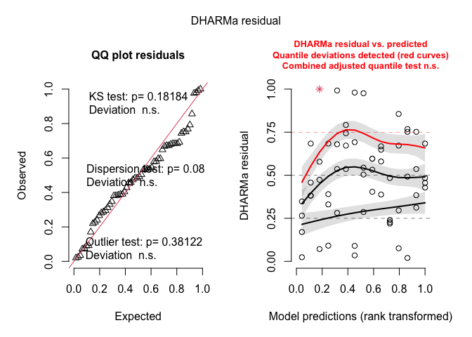<!-- -->

``` r
DHARMa::testDispersion(weed_inrow_glmm)
```

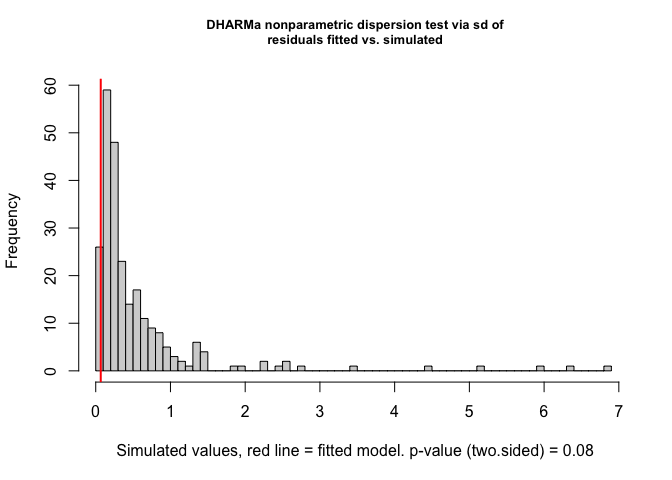<!-- -->

    ## 
    ##  DHARMa nonparametric dispersion test via sd of residuals fitted vs.
    ##  simulated
    ## 
    ## data:  simulationOutput
    ## dispersion = 0.11726, p-value = 0.08
    ## alternative hypothesis: two.sided

``` r
DHARMa::testZeroInflation(weed_inrow_glmm)
```

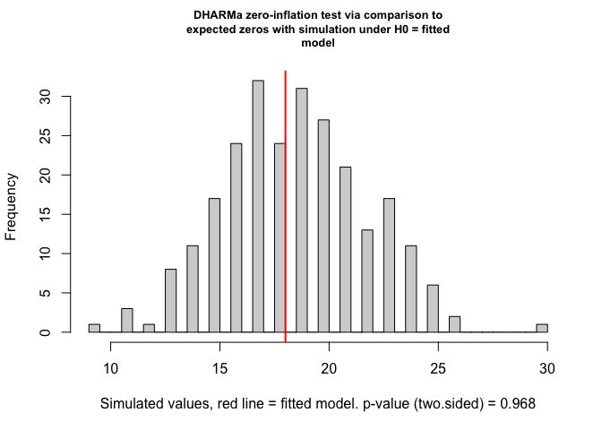<!-- -->

    ## 
    ##  DHARMa zero-inflation test via comparison to expected zeros with
    ##  simulation under H0 = fitted model
    ## 
    ## data:  simulationOutput
    ## ratioObsSim = 0.9636, p-value = 0.968
    ## alternative hypothesis: two.sided

``` r
car::Anova(weed_inrow_glmm, type = 3)
```

    ## Analysis of Deviance Table (Type III Wald chisquare tests)
    ## 
    ## Response: inrow_weed_biomass_kg_ha
    ##               Chisq Df Pr(>Chisq)    
    ## (Intercept)  91.564  1  < 2.2e-16 ***
    ## weed_trt    107.412  4  < 2.2e-16 ***
    ## site_year    25.185  2  3.398e-06 ***
    ## ---
    ## Signif. codes:  0 '***' 0.001 '**' 0.01 '*' 0.05 '.' 0.1 ' ' 1

#### Post-hoc summary table

``` r
#### Post-hoc summary table

### In-row weed biomass (kg ha^-1) with Fisher's LSD CLDs

# Estimated marginal means for weed_trt on the response scale (kg ha^-1)
emm_inrow <- emmeans(
  weed_inrow_glmm,
  ~ weed_trt,
  type = "response"   # back-transform from log link
)

# Tidy emmeans for reporting (rename columns to match other RMDs)
emm_inrow_df <- as_tibble(emm_inrow) |>
  mutate(
    weed_trt = factor(weed_trt, levels = mow_levels)
  ) |>
  rename(
    emmean  = response,   # mean on response scale
    ci_low  = asymp.LCL,  # lower CI
    ci_high = asymp.UCL   # upper CI
  )

# Compact letter display (Fisher's LSD, no adjustment; "a" = highest)
cld_inrow <- cld(
  emm_inrow,
  adjust   = "none",
  Letters  = letters,
  sort     = TRUE,
  reversed = TRUE   # so "a" = highest biomass group(s)
) |>
  as_tibble() |>
  mutate(
    weed_trt = factor(weed_trt, levels = mow_levels),
    .group   = str_trim(.group)
  ) |>
  select(weed_trt, .group)

# Join emmeans + CLDs and format for reporting
emm_inrow_df |>
  left_join(cld_inrow, by = "weed_trt") |>
  select(weed_trt, emmean, SE, ci_low, ci_high, .group) |>
  mutate(
    across(c(emmean, SE, ci_low, ci_high), ~ round(.x, 1))
  ) |>
  kable(
    caption   = "Estimated in-row weed biomass (kg ha^-1) with 95% CI and Fisher's LSD group letters",
    col.names = c("Treatment", "Mean", "SE", "Lower CI", "Upper CI", "Group")
  ) |>
  kable_styling(full_width = FALSE, bootstrap_options = c("striped", "hover"))
```

<table class="table table-striped table-hover" style="color: black; width: auto !important; margin-left: auto; margin-right: auto;">

<caption>

Estimated in-row weed biomass (kg ha^-1) with 95% CI and Fisher’s LSD
group letters
</caption>

<thead>

<tr>

<th style="text-align:left;">

Treatment
</th>

<th style="text-align:right;">

Mean
</th>

<th style="text-align:right;">

SE
</th>

<th style="text-align:right;">

Lower CI
</th>

<th style="text-align:right;">

Upper CI
</th>

<th style="text-align:left;">

Group
</th>

</tr>

</thead>

<tbody>

<tr>

<td style="text-align:left;">

Rolled, no control
</td>

<td style="text-align:right;">

3.8
</td>

<td style="text-align:right;">

1.8
</td>

<td style="text-align:right;">

1.5
</td>

<td style="text-align:right;">

9.7
</td>

<td style="text-align:left;">

c
</td>

</tr>

<tr>

<td style="text-align:left;">

Rolled, mowing
</td>

<td style="text-align:right;">

16.6
</td>

<td style="text-align:right;">

7.0
</td>

<td style="text-align:right;">

7.2
</td>

<td style="text-align:right;">

38.0
</td>

<td style="text-align:left;">

b
</td>

</tr>

<tr>

<td style="text-align:left;">

Rolled, high-residue cultivation
</td>

<td style="text-align:right;">

21.6
</td>

<td style="text-align:right;">

9.0
</td>

<td style="text-align:right;">

9.5
</td>

<td style="text-align:right;">

48.9
</td>

<td style="text-align:left;">

b
</td>

</tr>

<tr>

<td style="text-align:left;">

Tilled, mowing
</td>

<td style="text-align:right;">

91.7
</td>

<td style="text-align:right;">

33.9
</td>

<td style="text-align:right;">

44.5
</td>

<td style="text-align:right;">

189.1
</td>

<td style="text-align:left;">

a
</td>

</tr>

<tr>

<td style="text-align:left;">

Tilled, cultivation
</td>

<td style="text-align:right;">

121.7
</td>

<td style="text-align:right;">

46.2
</td>

<td style="text-align:right;">

57.9
</td>

<td style="text-align:right;">

256.0
</td>

<td style="text-align:left;">

a
</td>

</tr>

</tbody>

</table>

``` r
emm_inrow_out <- emm_inrow_df |>
  left_join(cld_inrow, by = "weed_trt") |>
  select(weed_trt, emmean, SE, ci_low, ci_high, .group) |>
  mutate(
    across(c(emmean, SE, ci_low, ci_high), ~ round(.x, 1))
  )
```

#### Global response summary table

``` r
## 0) Directory for all *in-row* weed-biomass tables ----------------------

tab_dir_inrow <- here("analysis", "tables", "weed-biomass", "in-row")
dir.create(tab_dir_inrow, showWarnings = FALSE, recursive = TRUE)


# 1) P-value summary (Location, Treatment, Interaction) ------------------

anova_inrow <- Anova(weed_inrow_glmm, type = 3)

anova_inrow_df <- anova_inrow |>
  as.data.frame() |>
  tibble::rownames_to_column("Effect")

p_site_inrow <- anova_inrow_df$`Pr(>Chisq)`[anova_inrow_df$Effect == "site_year"]
p_trt_inrow  <- anova_inrow_df$`Pr(>Chisq)`[anova_inrow_df$Effect == "weed_trt"]
p_int_inrow3 <- anova_inrow_df$`Pr(>Chisq)`[anova_inrow_df$Effect == "weed_trt:site_year"]

pvals_inrow <- tibble(
  Effect = c(
    "Location (site_year)",
    "Treatment (weed_trt)"
  ),
  p_raw = c(p_site_inrow, p_trt_inrow)
)

# Only include the interaction row if the *selected* primary model uses the interaction
if (primary_model_name_inrow == "Interaction: weed_trt * site_year") {
  pvals_inrow <- bind_rows(
    pvals_inrow,
    tibble(
      Effect = "Location × Treatment",
      p_raw  = p_int_inrow3
    )
  )
}

pvals_inrow <- pvals_inrow |>
  mutate(
    `P-value` = case_when(
      p_raw < 0.001 ~ "<0.001",
      p_raw < 0.01  ~ "<0.01",
      TRUE          ~ sprintf("%.3f", p_raw)
    )
  ) |>
  select(Effect, `P-value`)

# Save ANOVA p-value summary
readr::write_csv(
  pvals_inrow,
  file.path(tab_dir_inrow, "tab_inrow-wbm_Anova_pvals.csv")
)


## 1b) Likelihood-ratio test: additive vs interaction --------------------

lrt_table_inrow <- tibble(
  Test  = "LRT (additive vs interaction)",
  p_raw = p_int_inrow   # from your in-row model selection chunk
) |>
  mutate(
    `P-value` = case_when(
      p_raw < 0.001 ~ "<0.001",
      p_raw < 0.01  ~ "<0.01",
      TRUE          ~ sprintf("%.3f", p_raw)
    )
  ) |>
  select(Test, `P-value`)

# Save LRT summary
readr::write_csv(
  lrt_table_inrow,
  file.path(tab_dir_inrow, "tab_inrow-wbm_LRT_add-vs-int.csv")
)

lrt_table_inrow |>
  kable(
    caption   = "In-row weed biomass (kg ha^-1): Likelihood-ratio test comparing additive vs interaction models",
    col.names = c("Test", "P-value")
  ) |>
  kable_styling(full_width = FALSE, bootstrap_options = c("striped", "hover"))
```

<table class="table table-striped table-hover" style="color: black; width: auto !important; margin-left: auto; margin-right: auto;">

<caption>

In-row weed biomass (kg ha^-1): Likelihood-ratio test comparing additive
vs interaction models
</caption>

<thead>

<tr>

<th style="text-align:left;">

Test
</th>

<th style="text-align:left;">

P-value
</th>

</tr>

</thead>

<tbody>

<tr>

<td style="text-align:left;">

LRT (additive vs interaction)
</td>

<td style="text-align:left;">

0.019
</td>

</tr>

</tbody>

</table>

``` r
## 2) Location block: site-year means (model + raw) ----------------------

emm_loc_inrow <- emmeans(
  weed_inrow_glmm,
  ~ site_year,
  type = "response"
)

emm_loc_inrow_df <- as_tibble(emm_loc_inrow) |>
  mutate(
    site_year  = as.factor(site_year),
    model_mean = response   # kg ha^-1
  ) |>
  select(site_year, model_mean)

cld_loc_inrow <- cld(
  emm_loc_inrow,
  adjust   = "none",
  Letters  = letters,
  sort     = TRUE,
  reversed = TRUE
) |>
  as_tibble() |>
  mutate(
    site_year = as.factor(site_year),
    loc_CLD   = str_trim(.group)
  ) |>
  select(site_year, loc_CLD)

raw_loc_inrow <- weed_biomass_clean |>
  group_by(site_year) |>
  summarise(
    raw_mean = mean(inrow_weed_biomass_kg_ha, na.rm = TRUE),
    .groups  = "drop"
  ) |>
  mutate(site_year = as.factor(site_year))

loc_summary_inrow <- emm_loc_inrow_df |>
  left_join(cld_loc_inrow, by = "site_year") |>
  left_join(raw_loc_inrow, by = "site_year") |>
  mutate(
    model_mean = round(model_mean, 1),
    raw_mean   = round(raw_mean, 1),
    raw_CLD    = loc_CLD
  ) |>
  arrange(site_year)

# Save location summary
readr::write_csv(
  loc_summary_inrow,
  file.path(tab_dir_inrow, "tab_inrow-wbm_location_means_CLD.csv")
)

loc_summary_inrow |>
  kable(
    caption   = "In-row weed biomass (kg ha^-1): location (site-year) means with CLDs",
    col.names = c("Site-year", "Model mean", "Model CLD", "Raw mean", "Raw CLD")
  ) |>
  kable_styling(full_width = FALSE, bootstrap_options = c("striped", "hover"))
```

<table class="table table-striped table-hover" style="color: black; width: auto !important; margin-left: auto; margin-right: auto;">

<caption>

In-row weed biomass (kg ha^-1): location (site-year) means with CLDs
</caption>

<thead>

<tr>

<th style="text-align:left;">

Site-year
</th>

<th style="text-align:right;">

Model mean
</th>

<th style="text-align:left;">

Model CLD
</th>

<th style="text-align:right;">

Raw mean
</th>

<th style="text-align:left;">

Raw CLD
</th>

</tr>

</thead>

<tbody>

<tr>

<td style="text-align:left;">

2024.field O2 east
</td>

<td style="text-align:right;">

4.7
</td>

<td style="text-align:left;">

b
</td>

<td style="text-align:right;">

16.2
</td>

<td style="text-align:left;">

b
</td>

</tr>

<tr>

<td style="text-align:left;">

2024.field O2 west
</td>

<td style="text-align:right;">

23.3
</td>

<td style="text-align:left;">

b
</td>

<td style="text-align:right;">

42.0
</td>

<td style="text-align:left;">

b
</td>

</tr>

<tr>

<td style="text-align:left;">

2023.field v
</td>

<td style="text-align:right;">

185.8
</td>

<td style="text-align:left;">

a
</td>

<td style="text-align:right;">

366.4
</td>

<td style="text-align:left;">

a
</td>

</tr>

</tbody>

</table>

``` r
## 3) Treatment block: means (model + raw) -------------------------------

emm_inrow <- emmeans(
  weed_inrow_glmm,
  ~ weed_trt,
  type = "response"
)

emm_trt_inrow_df <- as_tibble(emm_inrow) |>
  mutate(
    weed_trt   = factor(weed_trt, levels = mow_levels),
    model_mean = response   # kg ha^-1
  ) |>
  select(weed_trt, model_mean)

cld_inrow_trt <- cld(
  emm_inrow,
  adjust   = "none",
  Letters  = letters,
  sort     = TRUE,
  reversed = TRUE
) |>
  as_tibble() |>
  mutate(
    weed_trt = factor(weed_trt, levels = mow_levels),
    trt_CLD  = str_trim(.group)
  ) |>
  select(weed_trt, trt_CLD)

raw_trt_inrow <- weed_biomass_clean |>
  group_by(weed_trt) |>
  summarise(
    raw_mean = mean(inrow_weed_biomass_kg_ha, na.rm = TRUE),
    .groups  = "drop"
  ) |>
  mutate(weed_trt = factor(weed_trt, levels = mow_levels))

trt_summary_inrow <- emm_trt_inrow_df |>
  left_join(cld_inrow_trt, by = "weed_trt") |>
  left_join(raw_trt_inrow, by = "weed_trt") |>
  mutate(
    model_mean = round(model_mean, 1),
    raw_mean   = round(raw_mean, 1),
    raw_CLD    = trt_CLD
  ) |>
  arrange(weed_trt)

# Save treatment summary
readr::write_csv(
  trt_summary_inrow,
  file.path(tab_dir_inrow, "tab_inrow-wbm_treatment_means_CLD.csv")
)

trt_summary_inrow |>
  kable(
    caption   = "In-row weed biomass (kg ha^-1): treatment means with CLDs",
    col.names = c("Treatment", "Model mean", "Model CLD", "Raw mean", "Raw CLD")
  ) |>
  kable_styling(full_width = FALSE, bootstrap_options = c("striped", "hover"))
```

<table class="table table-striped table-hover" style="color: black; width: auto !important; margin-left: auto; margin-right: auto;">

<caption>

In-row weed biomass (kg ha^-1): treatment means with CLDs
</caption>

<thead>

<tr>

<th style="text-align:left;">

Treatment
</th>

<th style="text-align:right;">

Model mean
</th>

<th style="text-align:left;">

Model CLD
</th>

<th style="text-align:right;">

Raw mean
</th>

<th style="text-align:left;">

Raw CLD
</th>

</tr>

</thead>

<tbody>

<tr>

<td style="text-align:left;">

Rolled, no control
</td>

<td style="text-align:right;">

3.8
</td>

<td style="text-align:left;">

c
</td>

<td style="text-align:right;">

16.9
</td>

<td style="text-align:left;">

c
</td>

</tr>

<tr>

<td style="text-align:left;">

Rolled, mowing
</td>

<td style="text-align:right;">

16.6
</td>

<td style="text-align:left;">

b
</td>

<td style="text-align:right;">

63.7
</td>

<td style="text-align:left;">

b
</td>

</tr>

<tr>

<td style="text-align:left;">

Rolled, high-residue cultivation
</td>

<td style="text-align:right;">

21.6
</td>

<td style="text-align:left;">

b
</td>

<td style="text-align:right;">

76.1
</td>

<td style="text-align:left;">

b
</td>

</tr>

<tr>

<td style="text-align:left;">

Tilled, mowing
</td>

<td style="text-align:right;">

91.7
</td>

<td style="text-align:left;">

a
</td>

<td style="text-align:right;">

242.7
</td>

<td style="text-align:left;">

a
</td>

</tr>

<tr>

<td style="text-align:left;">

Tilled, cultivation
</td>

<td style="text-align:right;">

121.7
</td>

<td style="text-align:left;">

a
</td>

<td style="text-align:right;">

308.3
</td>

<td style="text-align:left;">

a
</td>

</tr>

</tbody>

</table>

``` r
## 4) Interaction block: site-year × treatment means ---------------------

emm_sy_inrow <- emmeans(
  weed_inrow_glmm,
  ~ weed_trt | site_year,
  type = "response"
)

emm_sy_inrow_df <- as_tibble(emm_sy_inrow) |>
  mutate(
    weed_trt   = factor(weed_trt, levels = mow_levels),
    site_year  = as.factor(site_year),
    model_mean = response   # kg ha^-1
  ) |>
  select(site_year, weed_trt, model_mean)

cld_sy_inrow <- cld(
  emm_sy_inrow,
  adjust   = "none",
  Letters  = letters,
  sort     = TRUE,
  reversed = TRUE
) |>
  as_tibble() |>
  mutate(
    weed_trt  = factor(weed_trt, levels = mow_levels),
    site_year = as.factor(site_year),
    int_CLD   = str_trim(.group)
  ) |>
  select(site_year, weed_trt, int_CLD)

raw_sy_inrow <- weed_biomass_clean |>
  group_by(site_year, weed_trt) |>
  summarise(
    raw_mean = mean(inrow_weed_biomass_kg_ha, na.rm = TRUE),
    .groups  = "drop"
  ) |>
  mutate(
    site_year = as.factor(site_year),
    weed_trt  = factor(weed_trt, levels = mow_levels)
  )

int_summary_inrow <- emm_sy_inrow_df |>
  left_join(cld_sy_inrow, by = c("site_year", "weed_trt")) |>
  left_join(raw_sy_inrow, by = c("site_year", "weed_trt")) |>
  mutate(
    model_mean = round(model_mean, 1),
    raw_mean   = round(raw_mean, 1),
    raw_CLD    = int_CLD
  ) |>
  arrange(site_year, weed_trt)

# Save interaction summary
readr::write_csv(
  int_summary_inrow,
  file.path(tab_dir_inrow, "tab_inrow-wbm_site-year_treatment_means_CLD.csv")
)

int_summary_inrow |>
  kable(
    caption   = "In-row weed biomass (kg ha^-1): site-year × treatment means with CLDs",
    col.names = c(
      "Site-year", "Treatment",
      "Model mean", "Model CLD",
      "Raw mean",   "Raw CLD"
    )
  ) |>
  kable_styling(full_width = FALSE, bootstrap_options = c("striped", "hover"))
```

<table class="table table-striped table-hover" style="color: black; width: auto !important; margin-left: auto; margin-right: auto;">

<caption>

In-row weed biomass (kg ha^-1): site-year × treatment means with CLDs
</caption>

<thead>

<tr>

<th style="text-align:left;">

Site-year
</th>

<th style="text-align:left;">

Treatment
</th>

<th style="text-align:right;">

Model mean
</th>

<th style="text-align:left;">

Model CLD
</th>

<th style="text-align:right;">

Raw mean
</th>

<th style="text-align:left;">

Raw CLD
</th>

</tr>

</thead>

<tbody>

<tr>

<td style="text-align:left;">

2024.field O2 east
</td>

<td style="text-align:left;">

Rolled, no control
</td>

<td style="text-align:right;">

0.7
</td>

<td style="text-align:left;">

c
</td>

<td style="text-align:right;">

0.0
</td>

<td style="text-align:left;">

c
</td>

</tr>

<tr>

<td style="text-align:left;">

2024.field O2 east
</td>

<td style="text-align:left;">

Rolled, mowing
</td>

<td style="text-align:right;">

2.9
</td>

<td style="text-align:left;">

b
</td>

<td style="text-align:right;">

0.1
</td>

<td style="text-align:left;">

b
</td>

</tr>

<tr>

<td style="text-align:left;">

2024.field O2 east
</td>

<td style="text-align:left;">

Rolled, high-residue cultivation
</td>

<td style="text-align:right;">

3.7
</td>

<td style="text-align:left;">

b
</td>

<td style="text-align:right;">

0.6
</td>

<td style="text-align:left;">

b
</td>

</tr>

<tr>

<td style="text-align:left;">

2024.field O2 east
</td>

<td style="text-align:left;">

Tilled, mowing
</td>

<td style="text-align:right;">

15.9
</td>

<td style="text-align:left;">

a
</td>

<td style="text-align:right;">

16.9
</td>

<td style="text-align:left;">

a
</td>

</tr>

<tr>

<td style="text-align:left;">

2024.field O2 east
</td>

<td style="text-align:left;">

Tilled, cultivation
</td>

<td style="text-align:right;">

21.0
</td>

<td style="text-align:left;">

a
</td>

<td style="text-align:right;">

63.4
</td>

<td style="text-align:left;">

a
</td>

</tr>

<tr>

<td style="text-align:left;">

2024.field O2 west
</td>

<td style="text-align:left;">

Rolled, no control
</td>

<td style="text-align:right;">

3.3
</td>

<td style="text-align:left;">

c
</td>

<td style="text-align:right;">

26.4
</td>

<td style="text-align:left;">

c
</td>

</tr>

<tr>

<td style="text-align:left;">

2024.field O2 west
</td>

<td style="text-align:left;">

Rolled, mowing
</td>

<td style="text-align:right;">

14.1
</td>

<td style="text-align:left;">

b
</td>

<td style="text-align:right;">

65.0
</td>

<td style="text-align:left;">

b
</td>

</tr>

<tr>

<td style="text-align:left;">

2024.field O2 west
</td>

<td style="text-align:left;">

Rolled, high-residue cultivation
</td>

<td style="text-align:right;">

18.4
</td>

<td style="text-align:left;">

b
</td>

<td style="text-align:right;">

57.7
</td>

<td style="text-align:left;">

b
</td>

</tr>

<tr>

<td style="text-align:left;">

2024.field O2 west
</td>

<td style="text-align:left;">

Tilled, mowing
</td>

<td style="text-align:right;">

78.2
</td>

<td style="text-align:left;">

a
</td>

<td style="text-align:right;">

49.0
</td>

<td style="text-align:left;">

a
</td>

</tr>

<tr>

<td style="text-align:left;">

2024.field O2 west
</td>

<td style="text-align:left;">

Tilled, cultivation
</td>

<td style="text-align:right;">

103.8
</td>

<td style="text-align:left;">

a
</td>

<td style="text-align:right;">

11.7
</td>

<td style="text-align:left;">

a
</td>

</tr>

<tr>

<td style="text-align:left;">

2023.field v
</td>

<td style="text-align:left;">

Rolled, no control
</td>

<td style="text-align:right;">

26.1
</td>

<td style="text-align:left;">

c
</td>

<td style="text-align:right;">

24.2
</td>

<td style="text-align:left;">

c
</td>

</tr>

<tr>

<td style="text-align:left;">

2023.field v
</td>

<td style="text-align:left;">

Rolled, mowing
</td>

<td style="text-align:right;">

112.5
</td>

<td style="text-align:left;">

b
</td>

<td style="text-align:right;">

125.9
</td>

<td style="text-align:left;">

b
</td>

</tr>

<tr>

<td style="text-align:left;">

2023.field v
</td>

<td style="text-align:left;">

Rolled, high-residue cultivation
</td>

<td style="text-align:right;">

146.4
</td>

<td style="text-align:left;">

b
</td>

<td style="text-align:right;">

170.1
</td>

<td style="text-align:left;">

b
</td>

</tr>

<tr>

<td style="text-align:left;">

2023.field v
</td>

<td style="text-align:left;">

Tilled, mowing
</td>

<td style="text-align:right;">

622.7
</td>

<td style="text-align:left;">

a
</td>

<td style="text-align:right;">

662.2
</td>

<td style="text-align:left;">

a
</td>

</tr>

<tr>

<td style="text-align:left;">

2023.field v
</td>

<td style="text-align:left;">

Tilled, cultivation
</td>

<td style="text-align:right;">

826.5
</td>

<td style="text-align:left;">

a
</td>

<td style="text-align:right;">

849.9
</td>

<td style="text-align:left;">

a
</td>

</tr>

</tbody>

</table>

``` r
## 5) Model-info row for global response summary -------------------------

model_info_inrow <- tibble::tibble(
  response_label    = "In-row weed biomass (kg ha^-1), model-predicted means*",
  family_structure  = best_all_inrow_n,
  fixed_effects     = primary_model_name_inrow,
  random_effects    = "(1 | site_year:block)",
  AIC_additive      = round(AIC_add_inrow, 2),
  AIC_interaction   = round(AIC_int_inrow, 2),
  deltaAIC_add_int  = round(deltaAIC_inrow, 2),
  LRT_p_int_raw     = p_int_inrow,
  LRT_p_int_label   = dplyr::case_when(
    p_int_inrow < 0.001 ~ "<0.001",
    p_int_inrow < 0.01  ~ "<0.01",
    TRUE                ~ sprintf("%.3f", p_int_inrow)
  ),
  interaction_class = interaction_class_inrow
)

readr::write_csv(
  model_info_inrow,
  file.path(tab_dir_inrow, "tab_inrow-wbm_model-info.csv")
)
```

### Inter-row weed biomass

``` r
#### Inter-row pooled (all site-years): model testing / selection ----------

options(contrasts = c("contr.sum", "contr.poly"))

# Model formula: inter-row instead of total (full interaction)
form_all_interrow <- interrow_weed_biomass_kg_ha ~ weed_trt * site_year + (1 | site_year:block)

## 1) Candidate families / structures (all with interaction) -------------

m_all_interrow_tw <- glmmTMB(
  formula = form_all_interrow,
  family  = tweedie(link = "log"),
  data    = weed_biomass_clean
)

m_all_interrow_nb <- glmmTMB(
  formula = form_all_interrow,
  family  = nbinom2(link = "log"),
  data    = weed_biomass_clean
)

m_all_interrow_tw_zi <- glmmTMB(
  formula   = form_all_interrow,
  family    = tweedie(link = "log"),
  ziformula = ~ 1,
  data      = weed_biomass_clean
)

m_all_interrow_tw_disp <- glmmTMB(
  formula     = form_all_interrow,
  family      = tweedie(link = "log"),
  ziformula   = ~ 1,
  dispformula = ~ site_year,
  data        = weed_biomass_clean
)

# NA-safe AIC helper (omit if already defined earlier) -------------------
safe_aic <- function(mod) {
  out <- try(AIC(mod), silent = TRUE)
  if (inherits(out, "try-error")) return(NA_real_)
  out
}

aic_all_interrow <- tibble(
  model = c(
    "INTERROW: Tweedie",
    "INTERROW: NB2",
    "INTERROW: Tweedie + ZI",
    "INTERROW: Tweedie + ZI + disp(site_year)"
  ),
  AIC = c(
    safe_aic(m_all_interrow_tw),
    safe_aic(m_all_interrow_nb),
    safe_aic(m_all_interrow_tw_zi),
    safe_aic(m_all_interrow_tw_disp)
  )
)

kable(
  aic_all_interrow,
  digits  = 2,
  caption = "Inter-row weed biomass (kg ha^-1): candidate distributional families"
) |>
  kable_styling(full_width = FALSE, bootstrap_options = c("striped", "hover"))
```

<table class="table table-striped table-hover" style="color: black; width: auto !important; margin-left: auto; margin-right: auto;">

<caption>

Inter-row weed biomass (kg ha^-1): candidate distributional families
</caption>

<thead>

<tr>

<th style="text-align:left;">

model
</th>

<th style="text-align:right;">

AIC
</th>

</tr>

</thead>

<tbody>

<tr>

<td style="text-align:left;">

INTERROW: Tweedie
</td>

<td style="text-align:right;">

611.36
</td>

</tr>

<tr>

<td style="text-align:left;">

INTERROW: NB2
</td>

<td style="text-align:right;">

610.89
</td>

</tr>

<tr>

<td style="text-align:left;">

INTERROW: Tweedie + ZI
</td>

<td style="text-align:right;">

610.16
</td>

</tr>

<tr>

<td style="text-align:left;">

INTERROW: Tweedie + ZI + disp(site_year)
</td>

<td style="text-align:right;">

610.28
</td>

</tr>

</tbody>

</table>

``` r
## 2) Choose best family (require > 2 AIC units better) ------------------

best_all_interrow   <- m_all_interrow_tw
best_all_interrow_n <- "INTERROW: Tweedie"
best_aic_interrow   <- safe_aic(m_all_interrow_tw)

cands_interrow <- list(
  "INTERROW: NB2"                            = m_all_interrow_nb,
  "INTERROW: Tweedie + ZI"                   = m_all_interrow_tw_zi,
  "INTERROW: Tweedie + ZI + disp(site_year)" = m_all_interrow_tw_disp
)

for (nm in names(cands_interrow)) {
  this_aic <- safe_aic(cands_interrow[[nm]])
  if (is.finite(this_aic) && (this_aic + 2 < best_aic_interrow)) {
    best_all_interrow   <- cands_interrow[[nm]]
    best_all_interrow_n <- nm
    best_aic_interrow   <- this_aic
  }
}

cat(
  "Selected family/structure for inter-row weed biomass (all site-years):",
  best_all_interrow_n, "\n"
)
```

    ## Selected family/structure for inter-row weed biomass (all site-years): INTERROW: Tweedie

``` r
## 3) Within chosen family: additive vs interaction ----------------------

# Interaction model in chosen family
interrow_int <- best_all_interrow

# Additive model: same family/ZI/dispersion, simpler fixed effects
interrow_add <- update(
  best_all_interrow,
  . ~ weed_trt + site_year + (1 | site_year:block)
)

# Compare additive vs interaction
lrt_interrow    <- anova(interrow_add, interrow_int)
p_int_interrow  <- lrt_interrow$`Pr(>Chisq)`[2]

AIC_add_interrow   <- AIC(interrow_add)
AIC_int_interrow   <- AIC(interrow_int)
deltaAIC_interrow  <- AIC_add_interrow - AIC_int_interrow  # > 0 => interaction has lower AIC

# Same decision rule as total & in-row -----------------------------------

p_strong_interrow    <- 0.01  # strong evidence
p_none_interrow      <- 0.20  # essentially none
dAIC_strong_interrow <- 4     # substantial AIC drop

interaction_class_interrow <- dplyr::case_when(
  p_int_interrow < p_strong_interrow | deltaAIC_interrow >= dAIC_strong_interrow ~ "interaction",
  p_int_interrow > p_none_interrow  & abs(deltaAIC_interrow) < 2                 ~ "additive",
  TRUE                                                                          ~ "gray_zone"
)

primary_model_name_interrow <- dplyr::case_when(
  interaction_class_interrow == "interaction" ~ "Interaction: weed_trt * site_year",
  TRUE                                        ~ "Additive: weed_trt + site_year"
)

weed_interrow_glmm <- if (primary_model_name_interrow == "Interaction: weed_trt * site_year") {
  interrow_int
} else {
  interrow_add
}

# AIC table for reporting
aic_interrow_out <- tibble(
  model = c(
    "Additive: weed_trt + site_year",
    "Interaction: weed_trt * site_year"
  ),
  AIC = c(AIC_add_interrow, AIC_int_interrow)
) |>
  mutate(
    deltaAIC                 = AIC - min(AIC),
    Selected                 = if_else(model == primary_model_name_interrow, "Yes", ""),
    Evidence_for_interaction = interaction_class_interrow
  )

kable(
  aic_interrow_out,
  digits  = 2,
  caption = "Inter-row weed biomass (kg ha^-1): additive vs interaction (within chosen family)"
) |>
  kable_styling(full_width = FALSE, bootstrap_options = c("striped", "hover"))
```

<table class="table table-striped table-hover" style="color: black; width: auto !important; margin-left: auto; margin-right: auto;">

<caption>

Inter-row weed biomass (kg ha^-1): additive vs interaction (within
chosen family)
</caption>

<thead>

<tr>

<th style="text-align:left;">

model
</th>

<th style="text-align:right;">

AIC
</th>

<th style="text-align:right;">

deltaAIC
</th>

<th style="text-align:left;">

Selected
</th>

<th style="text-align:left;">

Evidence_for_interaction
</th>

</tr>

</thead>

<tbody>

<tr>

<td style="text-align:left;">

Additive: weed_trt + site_year
</td>

<td style="text-align:right;">

615.78
</td>

<td style="text-align:right;">

4.42
</td>

<td style="text-align:left;">

</td>

<td style="text-align:left;">

interaction
</td>

</tr>

<tr>

<td style="text-align:left;">

Interaction: weed_trt \* site_year
</td>

<td style="text-align:right;">

611.36
</td>

<td style="text-align:right;">

0.00
</td>

<td style="text-align:left;">

Yes
</td>

<td style="text-align:left;">

interaction
</td>

</tr>

</tbody>

</table>

``` r
cat(
  "\nSelected primary model for inter-row weed biomass (used in emmeans/plots):\n  ",
  primary_model_name_interrow,
  sprintf(
    "  [LRT p = %.3f; ΔAIC (add - int) = %.2f; class = %s]\n",
    p_int_interrow, deltaAIC_interrow, interaction_class_interrow
  )
)
```

    ## 
    ## Selected primary model for inter-row weed biomass (used in emmeans/plots):
    ##    Interaction: weed_trt * site_year   [LRT p = 0.009; ΔAIC (add - int) = 4.42; class = interaction]

``` r
## 4) Diagnostics + Type-III tests for chosen inter-row model -----------

set.seed(123)
res_interrow <- DHARMa::simulateResiduals(weed_interrow_glmm)
plot(res_interrow)
```

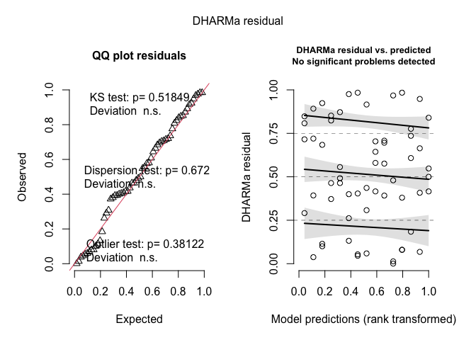<!-- -->

``` r
DHARMa::testDispersion(weed_interrow_glmm)
```

<!-- -->

    ## 
    ##  DHARMa nonparametric dispersion test via sd of residuals fitted vs.
    ##  simulated
    ## 
    ## data:  simulationOutput
    ## dispersion = 0.62589, p-value = 0.672
    ## alternative hypothesis: two.sided

``` r
DHARMa::testZeroInflation(weed_interrow_glmm)
```

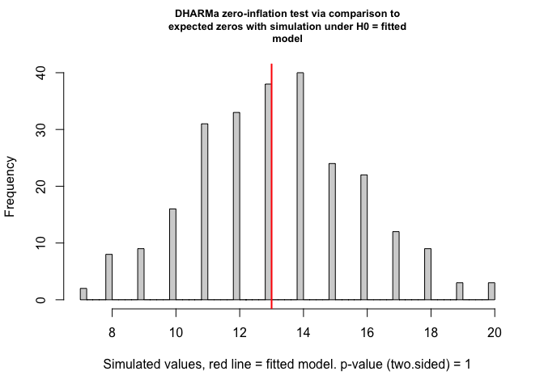<!-- -->

    ## 
    ##  DHARMa zero-inflation test via comparison to expected zeros with
    ##  simulation under H0 = fitted model
    ## 
    ## data:  simulationOutput
    ## ratioObsSim = 0.98336, p-value = 1
    ## alternative hypothesis: two.sided

``` r
car::Anova(weed_interrow_glmm, type = 3)
```

    ## Analysis of Deviance Table (Type III Wald chisquare tests)
    ## 
    ## Response: interrow_weed_biomass_kg_ha
    ##                      Chisq Df Pr(>Chisq)    
    ## (Intercept)        238.332  1  < 2.2e-16 ***
    ## weed_trt            45.959  4  2.512e-09 ***
    ## site_year            9.057  2    0.01080 *  
    ## weed_trt:site_year  23.604  8    0.00267 ** 
    ## ---
    ## Signif. codes:  0 '***' 0.001 '**' 0.01 '*' 0.05 '.' 0.1 ' ' 1

##### Post-hoc summary table

``` r
#### Post-hoc summary table

### Inter-row weed biomass (kg ha^-1) with Fisher's LSD CLDs

# Estimated marginal means for weed_trt on the response scale (kg ha^-1)
emm_interrow <- emmeans(
  weed_interrow_glmm,
  ~ weed_trt,
  type = "response"   # back-transform from log link
)

# Tidy emmeans for reporting (rename columns to match other RMDs)
emm_interrow_df <- as_tibble(emm_interrow) |>
  mutate(
    weed_trt = factor(weed_trt, levels = mow_levels)
  ) |>
  rename(
    emmean  = response,   # mean on response scale
    ci_low  = asymp.LCL,  # lower CI
    ci_high = asymp.UCL   # upper CI
  )

# Compact letter display (Fisher's LSD, no adjustment; "a" = highest)
cld_interrow <- cld(
  emm_interrow,
  adjust   = "none",
  Letters  = letters,
  sort     = TRUE,
  reversed = TRUE   # so "a" = highest biomass group(s)
) |>
  as_tibble() |>
  mutate(
    weed_trt = factor(weed_trt, levels = mow_levels),
    .group   = str_trim(.group)
  ) |>
  select(weed_trt, .group)

# Join emmeans + CLDs and format for reporting
emm_interrow_df |>
  left_join(cld_interrow, by = "weed_trt") |>
  select(weed_trt, emmean, SE, ci_low, ci_high, .group) |>
  mutate(
    across(c(emmean, SE, ci_low, ci_high), ~ round(.x, 1))
  ) |>
  kable(
    caption   = "Estimated inter-row weed biomass (kg ha^-1) with 95% CI and Fisher's LSD group letters",
    col.names = c("Treatment", "Mean", "SE", "Lower CI", "Upper CI", "Group")
  ) |>
  kable_styling(full_width = FALSE, bootstrap_options = c("striped", "hover"))
```

<table class="table table-striped table-hover" style="color: black; width: auto !important; margin-left: auto; margin-right: auto;">

<caption>

Estimated inter-row weed biomass (kg ha^-1) with 95% CI and Fisher’s LSD
group letters
</caption>

<thead>

<tr>

<th style="text-align:left;">

Treatment
</th>

<th style="text-align:right;">

Mean
</th>

<th style="text-align:right;">

SE
</th>

<th style="text-align:right;">

Lower CI
</th>

<th style="text-align:right;">

Upper CI
</th>

<th style="text-align:left;">

Group
</th>

</tr>

</thead>

<tbody>

<tr>

<td style="text-align:left;">

Rolled, no control
</td>

<td style="text-align:right;">

191.6
</td>

<td style="text-align:right;">

73.1
</td>

<td style="text-align:right;">

90.7
</td>

<td style="text-align:right;">

404.6
</td>

<td style="text-align:left;">

a
</td>

</tr>

<tr>

<td style="text-align:left;">

Rolled, mowing
</td>

<td style="text-align:right;">

39.8
</td>

<td style="text-align:right;">

16.7
</td>

<td style="text-align:right;">

17.5
</td>

<td style="text-align:right;">

90.5
</td>

<td style="text-align:left;">

b
</td>

</tr>

<tr>

<td style="text-align:left;">

Rolled, high-residue cultivation
</td>

<td style="text-align:right;">

44.8
</td>

<td style="text-align:right;">

21.6
</td>

<td style="text-align:right;">

17.4
</td>

<td style="text-align:right;">

115.1
</td>

<td style="text-align:left;">

b
</td>

</tr>

<tr>

<td style="text-align:left;">

Tilled, mowing
</td>

<td style="text-align:right;">

211.8
</td>

<td style="text-align:right;">

67.3
</td>

<td style="text-align:right;">

113.6
</td>

<td style="text-align:right;">

394.9
</td>

<td style="text-align:left;">

a
</td>

</tr>

<tr>

<td style="text-align:left;">

Tilled, cultivation
</td>

<td style="text-align:right;">

3.3
</td>

<td style="text-align:right;">

2.3
</td>

<td style="text-align:right;">

0.8
</td>

<td style="text-align:right;">

12.6
</td>

<td style="text-align:left;">

c
</td>

</tr>

</tbody>

</table>

``` r
emm_interrow_out <- emm_interrow_df |>
  left_join(cld_interrow, by = "weed_trt") |>
  select(weed_trt, emmean, SE, ci_low, ci_high, .group) |>
  mutate(
    across(c(emmean, SE, ci_low, ci_high), ~ round(.x, 1))
  )
```

#### Global response summary tabl

``` r
## 0) Directory for all *inter-row* weed-biomass tables -------------------

tab_dir_interrow <- here("analysis", "tables", "weed-biomass", "inter-row")
dir.create(tab_dir_interrow, showWarnings = FALSE, recursive = TRUE)


# 1) P-value summary (Location, Treatment, Interaction) ------------------

anova_interrow <- Anova(weed_interrow_glmm, type = 3)

anova_interrow_df <- anova_interrow |>
  as.data.frame() |>
  tibble::rownames_to_column("Effect")

p_site_interrow <- anova_interrow_df$`Pr(>Chisq)`[anova_interrow_df$Effect == "site_year"]
p_trt_interrow  <- anova_interrow_df$`Pr(>Chisq)`[anova_interrow_df$Effect == "weed_trt"]
p_int_interrow3 <- anova_interrow_df$`Pr(>Chisq)`[anova_interrow_df$Effect == "weed_trt:site_year"]

pvals_interrow <- tibble(
  Effect = c(
    "Location (site_year)",
    "Treatment (weed_trt)"
  ),
  p_raw = c(p_site_interrow, p_trt_interrow)
)

# Only include the interaction row if the *selected* primary model uses the interaction
if (primary_model_name_interrow == "Interaction: weed_trt * site_year") {
  pvals_interrow <- bind_rows(
    pvals_interrow,
    tibble(
      Effect = "Location × Treatment",
      p_raw  = p_int_interrow3
    )
  )
}

pvals_interrow <- pvals_interrow |>
  mutate(
    `P-value` = case_when(
      p_raw < 0.001 ~ "<0.001",
      p_raw < 0.01  ~ "<0.01",
      TRUE          ~ sprintf("%.3f", p_raw)
    )
  ) |>
  select(Effect, `P-value`)

# Save ANOVA p-value summary
readr::write_csv(
  pvals_interrow,
  file.path(tab_dir_interrow, "tab_interrow-wbm_Anova_pvals.csv")
)


## 1b) Likelihood-ratio test: additive vs interaction --------------------

lrt_table_interrow <- tibble(
  Test  = "LRT (additive vs interaction)",
  p_raw = p_int_interrow   # from your inter-row model selection chunk
) |>
  mutate(
    `P-value` = case_when(
      p_raw < 0.001 ~ "<0.001",
      p_raw < 0.01  ~ "<0.01",
      TRUE          ~ sprintf("%.3f", p_raw)
    )
  ) |>
  select(Test, `P-value`)

# Save LRT summary
readr::write_csv(
  lrt_table_interrow,
  file.path(tab_dir_interrow, "tab_interrow-wbm_LRT_add-vs-int.csv")
)

lrt_table_interrow |>
  kable(
    caption   = "Inter-row weed biomass (kg ha^-1): Likelihood-ratio test comparing additive vs interaction models",
    col.names = c("Test", "P-value")
  ) |>
  kable_styling(full_width = FALSE, bootstrap_options = c("striped", "hover"))
```

<table class="table table-striped table-hover" style="color: black; width: auto !important; margin-left: auto; margin-right: auto;">

<caption>

Inter-row weed biomass (kg ha^-1): Likelihood-ratio test comparing
additive vs interaction models
</caption>

<thead>

<tr>

<th style="text-align:left;">

Test
</th>

<th style="text-align:left;">

P-value
</th>

</tr>

</thead>

<tbody>

<tr>

<td style="text-align:left;">

LRT (additive vs interaction)
</td>

<td style="text-align:left;">

\<0.01
</td>

</tr>

</tbody>

</table>

``` r
## 2) Location block: site-year means (model + raw) ----------------------

emm_loc_interrow <- emmeans(
  weed_interrow_glmm,
  ~ site_year,
  type = "response"
)

emm_loc_interrow_df <- as_tibble(emm_loc_interrow) |>
  mutate(
    site_year  = as.factor(site_year),
    model_mean = response   # kg ha^-1
  ) |>
  select(site_year, model_mean)

cld_loc_interrow <- cld(
  emm_loc_interrow,
  adjust   = "none",
  Letters  = letters,
  sort     = TRUE,
  reversed = TRUE
) |>
  as_tibble() |>
  mutate(
    site_year = as.factor(site_year),
    loc_CLD   = str_trim(.group)
  ) |>
  select(site_year, loc_CLD)

raw_loc_interrow <- weed_biomass_clean |>
  group_by(site_year) |>
  summarise(
    raw_mean = mean(interrow_weed_biomass_kg_ha, na.rm = TRUE),
    .groups  = "drop"
  ) |>
  mutate(site_year = as.factor(site_year))

loc_summary_interrow <- emm_loc_interrow_df |>
  left_join(cld_loc_interrow, by = "site_year") |>
  left_join(raw_loc_interrow, by = "site_year") |>
  mutate(
    model_mean = round(model_mean, 1),
    raw_mean   = round(raw_mean, 1),
    raw_CLD    = loc_CLD
  ) |>
  arrange(site_year)

# Save location summary
readr::write_csv(
  loc_summary_interrow,
  file.path(tab_dir_interrow, "tab_interrow-wbm_location_means_CLD.csv")
)

loc_summary_interrow |>
  kable(
    caption   = "Inter-row weed biomass (kg ha^-1): location (site-year) means with CLDs",
    col.names = c("Site-year", "Model mean", "Model CLD", "Raw mean", "Raw CLD")
  ) |>
  kable_styling(full_width = FALSE, bootstrap_options = c("striped", "hover"))
```

<table class="table table-striped table-hover" style="color: black; width: auto !important; margin-left: auto; margin-right: auto;">

<caption>

Inter-row weed biomass (kg ha^-1): location (site-year) means with CLDs
</caption>

<thead>

<tr>

<th style="text-align:left;">

Site-year
</th>

<th style="text-align:right;">

Model mean
</th>

<th style="text-align:left;">

Model CLD
</th>

<th style="text-align:right;">

Raw mean
</th>

<th style="text-align:left;">

Raw CLD
</th>

</tr>

</thead>

<tbody>

<tr>

<td style="text-align:left;">

2024.field O2 east
</td>

<td style="text-align:right;">

26.5
</td>

<td style="text-align:left;">

b
</td>

<td style="text-align:right;">

59.4
</td>

<td style="text-align:left;">

b
</td>

</tr>

<tr>

<td style="text-align:left;">

2024.field O2 west
</td>

<td style="text-align:right;">

34.1
</td>

<td style="text-align:left;">

b
</td>

<td style="text-align:right;">

120.9
</td>

<td style="text-align:left;">

b
</td>

</tr>

<tr>

<td style="text-align:left;">

2023.field v
</td>

<td style="text-align:right;">

116.8
</td>

<td style="text-align:left;">

a
</td>

<td style="text-align:right;">

269.3
</td>

<td style="text-align:left;">

a
</td>

</tr>

</tbody>

</table>

``` r
## 3) Treatment block: means (model + raw) -------------------------------

emm_interrow <- emmeans(
  weed_interrow_glmm,
  ~ weed_trt,
  type = "response"
)

emm_trt_interrow_df <- as_tibble(emm_interrow) |>
  mutate(
    weed_trt   = factor(weed_trt, levels = mow_levels),
    model_mean = response   # kg ha^-1
  ) |>
  select(weed_trt, model_mean)

cld_interrow_trt <- cld(
  emm_interrow,
  adjust   = "none",
  Letters  = letters,
  sort     = TRUE,
  reversed = TRUE
) |>
  as_tibble() |>
  mutate(
    weed_trt = factor(weed_trt, levels = mow_levels),
    trt_CLD  = str_trim(.group)
  ) |>
  select(weed_trt, trt_CLD)

raw_trt_interrow <- weed_biomass_clean |>
  group_by(weed_trt) |>
  summarise(
    raw_mean = mean(interrow_weed_biomass_kg_ha, na.rm = TRUE),
    .groups  = "drop"
  ) |>
  mutate(weed_trt = factor(weed_trt, levels = mow_levels))

trt_summary_interrow <- emm_trt_interrow_df |>
  left_join(cld_interrow_trt, by = "weed_trt") |>
  left_join(raw_trt_interrow, by = "weed_trt") |>
  mutate(
    model_mean = round(model_mean, 1),
    raw_mean   = round(raw_mean, 1),
    raw_CLD    = trt_CLD
  ) |>
  arrange(weed_trt)

# Save treatment summary
readr::write_csv(
  trt_summary_interrow,
  file.path(tab_dir_interrow, "tab_interrow-wbm_treatment_means_CLD.csv")
)

trt_summary_interrow |>
  kable(
    caption   = "Inter-row weed biomass (kg ha^-1): treatment means with CLDs",
    col.names = c("Treatment", "Model mean", "Model CLD", "Raw mean", "Raw CLD")
  ) |>
  kable_styling(full_width = FALSE, bootstrap_options = c("striped", "hover"))
```

<table class="table table-striped table-hover" style="color: black; width: auto !important; margin-left: auto; margin-right: auto;">

<caption>

Inter-row weed biomass (kg ha^-1): treatment means with CLDs
</caption>

<thead>

<tr>

<th style="text-align:left;">

Treatment
</th>

<th style="text-align:right;">

Model mean
</th>

<th style="text-align:left;">

Model CLD
</th>

<th style="text-align:right;">

Raw mean
</th>

<th style="text-align:left;">

Raw CLD
</th>

</tr>

</thead>

<tbody>

<tr>

<td style="text-align:left;">

Rolled, no control
</td>

<td style="text-align:right;">

191.6
</td>

<td style="text-align:left;">

a
</td>

<td style="text-align:right;">

246.9
</td>

<td style="text-align:left;">

a
</td>

</tr>

<tr>

<td style="text-align:left;">

Rolled, mowing
</td>

<td style="text-align:right;">

39.8
</td>

<td style="text-align:left;">

b
</td>

<td style="text-align:right;">

59.6
</td>

<td style="text-align:left;">

b
</td>

</tr>

<tr>

<td style="text-align:left;">

Rolled, high-residue cultivation
</td>

<td style="text-align:right;">

44.8
</td>

<td style="text-align:left;">

b
</td>

<td style="text-align:right;">

169.9
</td>

<td style="text-align:left;">

b
</td>

</tr>

<tr>

<td style="text-align:left;">

Tilled, mowing
</td>

<td style="text-align:right;">

211.8
</td>

<td style="text-align:left;">

a
</td>

<td style="text-align:right;">

261.4
</td>

<td style="text-align:left;">

a
</td>

</tr>

<tr>

<td style="text-align:left;">

Tilled, cultivation
</td>

<td style="text-align:right;">

3.3
</td>

<td style="text-align:left;">

c
</td>

<td style="text-align:right;">

11.6
</td>

<td style="text-align:left;">

c
</td>

</tr>

</tbody>

</table>

``` r
## 4) Interaction block: site-year × treatment means ---------------------

emm_sy_interrow <- emmeans(
  weed_interrow_glmm,
  ~ weed_trt | site_year,
  type = "response"
)

emm_sy_interrow_df <- as_tibble(emm_sy_interrow) |>
  mutate(
    weed_trt   = factor(weed_trt, levels = mow_levels),
    site_year  = as.factor(site_year),
    model_mean = response   # kg ha^-1
  ) |>
  select(site_year, weed_trt, model_mean)

cld_sy_interrow <- cld(
  emm_sy_interrow,
  adjust   = "none",
  Letters  = letters,
  sort     = TRUE,
  reversed = TRUE
) |>
  as_tibble() |>
  mutate(
    weed_trt  = factor(weed_trt, levels = mow_levels),
    site_year = as.factor(site_year),
    int_CLD   = str_trim(.group)
  ) |>
  select(site_year, weed_trt, int_CLD)

raw_sy_interrow <- weed_biomass_clean |>
  group_by(site_year, weed_trt) |>
  summarise(
    raw_mean = mean(interrow_weed_biomass_kg_ha, na.rm = TRUE),
    .groups  = "drop"
  ) |>
  mutate(
    site_year = as.factor(site_year),
    weed_trt  = factor(weed_trt, levels = mow_levels)
  )

int_summary_interrow <- emm_sy_interrow_df |>
  left_join(cld_sy_interrow, by = c("site_year", "weed_trt")) |>
  left_join(raw_sy_interrow, by = c("site_year", "weed_trt")) |>
  mutate(
    model_mean = round(model_mean, 1),
    raw_mean   = round(raw_mean, 1),
    raw_CLD    = int_CLD
  ) |>
  arrange(site_year, weed_trt)

# Save interaction summary
readr::write_csv(
  int_summary_interrow,
  file.path(tab_dir_interrow, "tab_interrow-wbm_site-year_treatment_means_CLD.csv")
)

int_summary_interrow |>
  kable(
    caption   = "Inter-row weed biomass (kg ha^-1): site-year × treatment means with CLDs",
    col.names = c(
      "Site-year", "Treatment",
      "Model mean", "Model CLD",
      "Raw mean",   "Raw CLD"
    )
  ) |>
  kable_styling(full_width = FALSE, bootstrap_options = c("striped", "hover"))
```

<table class="table table-striped table-hover" style="color: black; width: auto !important; margin-left: auto; margin-right: auto;">

<caption>

Inter-row weed biomass (kg ha^-1): site-year × treatment means with CLDs
</caption>

<thead>

<tr>

<th style="text-align:left;">

Site-year
</th>

<th style="text-align:left;">

Treatment
</th>

<th style="text-align:right;">

Model mean
</th>

<th style="text-align:left;">

Model CLD
</th>

<th style="text-align:right;">

Raw mean
</th>

<th style="text-align:left;">

Raw CLD
</th>

</tr>

</thead>

<tbody>

<tr>

<td style="text-align:left;">

2024.field O2 east
</td>

<td style="text-align:left;">

Rolled, no control
</td>

<td style="text-align:right;">

105.4
</td>

<td style="text-align:left;">

a
</td>

<td style="text-align:right;">

124.8
</td>

<td style="text-align:left;">

a
</td>

</tr>

<tr>

<td style="text-align:left;">

2024.field O2 east
</td>

<td style="text-align:left;">

Rolled, mowing
</td>

<td style="text-align:right;">

24.1
</td>

<td style="text-align:left;">

ab
</td>

<td style="text-align:right;">

24.1
</td>

<td style="text-align:left;">

ab
</td>

</tr>

<tr>

<td style="text-align:left;">

2024.field O2 east
</td>

<td style="text-align:left;">

Rolled, high-residue cultivation
</td>

<td style="text-align:right;">

1.7
</td>

<td style="text-align:left;">

b
</td>

<td style="text-align:right;">

1.7
</td>

<td style="text-align:left;">

b
</td>

</tr>

<tr>

<td style="text-align:left;">

2024.field O2 east
</td>

<td style="text-align:left;">

Tilled, mowing
</td>

<td style="text-align:right;">

120.3
</td>

<td style="text-align:left;">

a
</td>

<td style="text-align:right;">

116.0
</td>

<td style="text-align:left;">

a
</td>

</tr>

<tr>

<td style="text-align:left;">

2024.field O2 east
</td>

<td style="text-align:left;">

Tilled, cultivation
</td>

<td style="text-align:right;">

25.4
</td>

<td style="text-align:left;">

ab
</td>

<td style="text-align:right;">

30.4
</td>

<td style="text-align:left;">

ab
</td>

</tr>

<tr>

<td style="text-align:left;">

2024.field O2 west
</td>

<td style="text-align:left;">

Rolled, no control
</td>

<td style="text-align:right;">

187.0
</td>

<td style="text-align:left;">

a
</td>

<td style="text-align:right;">

220.8
</td>

<td style="text-align:left;">

a
</td>

</tr>

<tr>

<td style="text-align:left;">

2024.field O2 west
</td>

<td style="text-align:left;">

Rolled, mowing
</td>

<td style="text-align:right;">

19.8
</td>

<td style="text-align:left;">

b
</td>

<td style="text-align:right;">

22.8
</td>

<td style="text-align:left;">

b
</td>

</tr>

<tr>

<td style="text-align:left;">

2024.field O2 west
</td>

<td style="text-align:left;">

Rolled, high-residue cultivation
</td>

<td style="text-align:right;">

186.0
</td>

<td style="text-align:left;">

a
</td>

<td style="text-align:right;">

214.5
</td>

<td style="text-align:left;">

a
</td>

</tr>

<tr>

<td style="text-align:left;">

2024.field O2 west
</td>

<td style="text-align:left;">

Tilled, mowing
</td>

<td style="text-align:right;">

156.9
</td>

<td style="text-align:left;">

a
</td>

<td style="text-align:right;">

146.0
</td>

<td style="text-align:left;">

a
</td>

</tr>

<tr>

<td style="text-align:left;">

2024.field O2 west
</td>

<td style="text-align:left;">

Tilled, cultivation
</td>

<td style="text-align:right;">

0.4
</td>

<td style="text-align:left;">

c
</td>

<td style="text-align:right;">

0.5
</td>

<td style="text-align:left;">

c
</td>

</tr>

<tr>

<td style="text-align:left;">

2023.field v
</td>

<td style="text-align:left;">

Rolled, no control
</td>

<td style="text-align:right;">

356.7
</td>

<td style="text-align:left;">

a
</td>

<td style="text-align:right;">

395.3
</td>

<td style="text-align:left;">

a
</td>

</tr>

<tr>

<td style="text-align:left;">

2023.field v
</td>

<td style="text-align:left;">

Rolled, mowing
</td>

<td style="text-align:right;">

131.7
</td>

<td style="text-align:left;">

a
</td>

<td style="text-align:right;">

131.9
</td>

<td style="text-align:left;">

a
</td>

</tr>

<tr>

<td style="text-align:left;">

2023.field v
</td>

<td style="text-align:left;">

Rolled, high-residue cultivation
</td>

<td style="text-align:right;">

286.0
</td>

<td style="text-align:left;">

a
</td>

<td style="text-align:right;">

293.3
</td>

<td style="text-align:left;">

a
</td>

</tr>

<tr>

<td style="text-align:left;">

2023.field v
</td>

<td style="text-align:left;">

Tilled, mowing
</td>

<td style="text-align:right;">

503.2
</td>

<td style="text-align:left;">

a
</td>

<td style="text-align:right;">

522.1
</td>

<td style="text-align:left;">

a
</td>

</tr>

<tr>

<td style="text-align:left;">

2023.field v
</td>

<td style="text-align:left;">

Tilled, cultivation
</td>

<td style="text-align:right;">

3.2
</td>

<td style="text-align:left;">

b
</td>

<td style="text-align:right;">

3.8
</td>

<td style="text-align:left;">

b
</td>

</tr>

</tbody>

</table>

``` r
## 5) Model-info row for global response summary -------------------------

model_info_interrow <- tibble::tibble(
  response_label    = "Inter-row weed biomass (kg ha^-1), model-predicted means*",
  family_structure  = best_all_interrow_n,
  fixed_effects     = primary_model_name_interrow,
  random_effects    = "(1 | site_year:block)",
  AIC_additive      = round(AIC_add_interrow, 2),
  AIC_interaction   = round(AIC_int_interrow, 2),
  deltaAIC_add_int  = round(deltaAIC_interrow, 2),
  LRT_p_int_raw     = p_int_interrow,
  LRT_p_int_label   = dplyr::case_when(
    p_int_interrow < 0.001 ~ "<0.001",
    p_int_interrow < 0.01  ~ "<0.01",
    TRUE                   ~ sprintf("%.3f", p_int_interrow)
  ),
  interaction_class = interaction_class_interrow
)

readr::write_csv(
  model_info_interrow,
  file.path(tab_dir_interrow, "tab_interrow-wbm_model-info.csv")
)
```

# Figures

## Total weed biomass

### Model-prediected means (kg ha⁻¹)

``` r
## 0) Directory for total weed-biomass figures ---------------------------
fig_dir_total <- here("analysis", "figs", "weed-biomass", "total")
dir.create(fig_dir_total, showWarnings = FALSE, recursive = TRUE)

## Figure: Weed biomass by weed management treatment 
## (model-predicted means ± SE, model CLDs)

# 1) Model-based emmeans by treatment -----------------------------------
emm_wbm <- emmeans(
  weed_glmm,
  ~ weed_trt,
  type = "response"   # back-transform from link scale (kg ha^-1)
)

# Tidy emmeans and prepare SE-based error bars
emm_wbm_df <- as_tibble(emm_wbm) |>
  mutate(
    weed_trt = factor(weed_trt, levels = mow_levels),
    mean     = response,
    ymin     = pmax(mean - SE, 0),
    ymax     = mean + SE
  )

# 2) Model-based CLDs for treatment main effect -------------------------
cld_wbm <- cld(
  emm_wbm,
  adjust   = "none",
  Letters  = letters,
  sort     = TRUE,
  reversed = TRUE   # so "a" = highest biomass group(s)
) |>
  as_tibble() |>
  mutate(
    weed_trt = factor(weed_trt, levels = mow_levels),
    .group   = str_trim(.group)
  ) |>
  select(weed_trt, .group)

# 3) Join model-predicted means + CLDs ----------------------------------
plot_df_wbm_model <- emm_wbm_df |>
  left_join(cld_wbm, by = "weed_trt")

# 4) Plot ---------------------------------------------------------------
fig_wbm_total_model <- ggplot(
  plot_df_wbm_model,
  aes(x = weed_trt, y = mean, fill = weed_trt)
) +
  geom_col(width = 0.7, color = "black") +
  geom_errorbar(aes(ymin = ymin, ymax = ymax), width = 0.14) +
  geom_text(
    aes(y = ymax * 1.08, label = .group),
    vjust    = 0,
    fontface = "bold",
    size     = 6
  ) +
  scale_fill_manual(values = fill_cols, guide = "none") +
  scale_x_discrete(labels = label_break_comma_cult) +
  scale_y_continuous(labels = scales::label_comma()) +
  labs(
    x       = NULL,
    y       = expression(Weed~biomass~"(kg"~ha^{-1}*")"),
    title   = "Weed biomass by weed management",
    caption = "Bars show GLMM-predicted marginal means (kg"~ha^{-1}*") ± SE; letters denote Fisher’s LSD groups (α = 0.05)."
  ) +
  theme_classic(base_size = 18) +
  theme(
    axis.text.x  = element_text(lineheight = 0.95, margin = margin(t = 8)),
    axis.title.y = element_text(margin = margin(r = 8)),
    plot.title   = element_text(face = "bold"),
    plot.caption = element_text(size = 9, hjust = 0)
  )

fig_wbm_total_model  # print in the Rmd
```

<!-- -->

``` r
# 5) Save figure --------------------------------------------------------
ggsave(
  filename = file.path(fig_dir_total, "fig_weed_biomass_total_model_kg_ha.png"),
  plot     = fig_wbm_total_model,
  width    = 9,
  height   = 5.5,
  dpi      = 300
)
```

### Model-prediected means (lb ac⁻¹)

``` r
### Model-predicted means (lb ac^-1)
## 0) Directory for total weed-biomass figures ---------------------------
fig_dir_total <- here("analysis", "figs", "weed-biomass", "total")
dir.create(fig_dir_total, showWarnings = FALSE, recursive = TRUE)

# kg/ha → lb/ac conversion factor
kg_ha_to_lb_ac <- 0.892179

## Figure: Weed biomass by weed management treatment 
## (model-predicted means ± SE, model CLDs; lb ac^-1)

# 1) Model-based emmeans by treatment (still on kg ha^-1 scale) ---------
emm_wbm <- emmeans(
  weed_glmm,
  ~ weed_trt,
  type = "response"   # back-transform from link scale (kg ha^-1)
)

# 2) Tidy emmeans and convert to lb ac^-1 -------------------------------
emm_wbm_df <- as_tibble(emm_wbm) |>
  mutate(
    weed_trt = factor(weed_trt, levels = mow_levels),
    mean_kg  = response,
    se_kg    = SE,
    # convert to lb ac^-1
    mean     = mean_kg * kg_ha_to_lb_ac,
    SE       = se_kg   * kg_ha_to_lb_ac,
    ymin     = pmax(mean - SE, 0),
    ymax     = mean + SE
  )

# 3) Model-based CLDs for treatment main effect -------------------------
cld_wbm <- cld(
  emm_wbm,
  adjust   = "none",
  Letters  = letters,
  sort     = TRUE,
  reversed = TRUE   # so "a" = highest biomass group(s)
) |>
  as_tibble() |>
  mutate(
    weed_trt = factor(weed_trt, levels = mow_levels),
    .group   = str_trim(.group)
  ) |>
  select(weed_trt, .group)

# 4) Join model-predicted means (lb ac^-1) + CLDs -----------------------
plot_df_wbm_model_lb <- emm_wbm_df |>
  left_join(cld_wbm, by = "weed_trt")

# 5) Plot ---------------------------------------------------------------
fig_wbm_total_model_lb <- ggplot(
  plot_df_wbm_model_lb,
  aes(x = weed_trt, y = mean, fill = weed_trt)
) +
  geom_col(width = 0.7, color = "black") +
  geom_errorbar(aes(ymin = ymin, ymax = ymax), width = 0.14) +
  geom_text(
    aes(y = ymax * 1.08, label = .group),
    vjust    = 0,
    fontface = "bold",
    size     = 6
  ) +
  scale_fill_manual(values = fill_cols, guide = "none") +
  scale_x_discrete(labels = label_break_comma_cult) +
  scale_y_continuous(labels = scales::label_comma()) +
  labs(
    x       = NULL,
    y       = expression(Weed~biomass~"(lb"~ac^{-1}*")"),
    title   = "Weed biomass by weed management",
    caption = "Bars show GLMM-predicted marginal means (lb"~ac^{-1}*") ± SE; letters denote Fisher’s LSD groups (α = 0.05)."
  ) +
  theme_classic(base_size = 18) +
  theme(
    axis.text.x  = element_text(lineheight = 0.95, margin = margin(t = 8)),
    axis.title.y = element_text(margin = margin(r = 8)),
    plot.title   = element_text(face = "bold"),
    plot.caption = element_text(size = 9, hjust = 0)
  )

fig_wbm_total_model_lb  # print in the Rmd
```

<!-- -->

``` r
# 6) Save figure --------------------------------------------------------
ggsave(
  filename = file.path(fig_dir_total, "fig_weed_biomass_total_model_lb_ac.png"),
  plot     = fig_wbm_total_model_lb,
  width    = 9,
  height   = 5.5,
  dpi      = 300
)
```

### Raw means (kg ha⁻¹)

``` r
## 0) Directory for total weed-biomass figures ---------------------------
fig_dir_total <- here("analysis", "figs", "weed-biomass", "total")
dir.create(fig_dir_total, showWarnings = FALSE, recursive = TRUE)

## Figure: Weed biomass by weed management treatment (raw means ± SE, model CLDs)

# 1) Raw means and SE by treatment --------------------------------------
raw_wbm_summary <- weed_biomass_clean |>
  group_by(weed_trt) |>
  summarise(
    n    = n(),
    mean = mean(weed_biomass_kg_ha, na.rm = TRUE),
    sd   = sd(weed_biomass_kg_ha, na.rm = TRUE),
    se   = sd / sqrt(n),
    .groups = "drop"
  ) |>
  mutate(
    weed_trt = factor(weed_trt, levels = mow_levels),
    ymin     = pmax(mean - se, 0),
    ymax     = mean + se
  )

# 2) Model-based CLDs for treatment main effect -------------------------
emm_wbm <- emmeans(
  weed_glmm,
  ~ weed_trt,
  type = "response"   # back-transform from link scale
)

cld_wbm <- cld(
  emm_wbm,
  adjust   = "none",
  Letters  = letters,
  sort     = TRUE,
  reversed = TRUE   # so "a" = highest biomass group(s)
) |>
  as_tibble() |>
  mutate(
    weed_trt = factor(weed_trt, levels = mow_levels),
    .group   = str_trim(.group)
  ) |>
  select(weed_trt, .group)

# 3) Join raw means + model CLDs ----------------------------------------
plot_df_wbm_raw <- raw_wbm_summary |>
  left_join(cld_wbm, by = "weed_trt")

# 4) Plot ---------------------------------------------------------------
fig_wbm_total_raw <- ggplot(plot_df_wbm_raw, aes(x = weed_trt, y = mean, fill = weed_trt)) +
  geom_col(width = 0.7, color = "black") +
  geom_errorbar(aes(ymin = ymin, ymax = ymax), width = 0.14) +
  geom_text(
    aes(y = ymax * 1.08, label = .group),
    vjust    = 0,
    fontface = "bold",
    size     = 6
  ) +
  scale_fill_manual(values = fill_cols, guide = "none") +
  scale_x_discrete(labels = label_break_comma_cult) +
  scale_y_continuous(labels = scales::label_comma()) +
  labs(
    x       = NULL,
    y       = expression(Weed~biomass~"(kg"~ha^{-1}*")"),
    title   = "Weed biomass by weed management",
    caption = "Bars show raw means (kg ha⁻¹) ± SE; similar letters indicate no significant difference (Fisher’s LSD test, α = 0.05)."
  ) +
  theme_classic(base_size = 18) +
  theme(
    axis.text.x  = element_text(lineheight = 0.95, margin = margin(t = 8)),
    axis.title.y = element_text(margin = margin(r = 8)),
    plot.title   = element_text(face = "bold"),
    plot.caption = element_text(size = 9, hjust = 0)
  )

fig_wbm_total_raw  # print in the Rmd
```

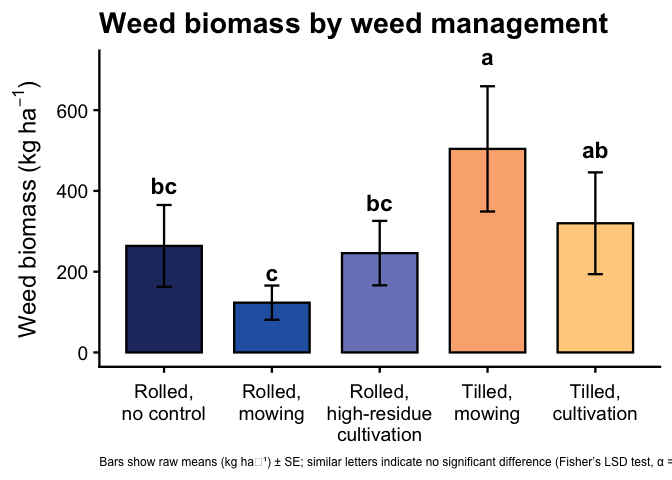<!-- -->

``` r
# 5) Save figure --------------------------------------------------------
ggsave(
  filename = file.path(fig_dir_total, "fig_weed_biomass_total_raw_kg_ha.png"),
  plot     = fig_wbm_total_raw,
  width    = 9,
  height   = 5.5,
  dpi      = 300
)
```

### Raw means (lb ha⁻¹)

``` r
### Figure: Weed biomass by weed management treatment (raw means ± SE, model CLDs)
### Units converted from kg ha^-1 to lb ac^-1 for farmer meetings

# kg/ha → lb/ac conversion factor
kg_ha_to_lb_ac <- 0.892179

# 1) Raw means and SE by treatment (in lb ac^-1) -------------------------
raw_wbm_summary_lb <- weed_biomass_clean |>
  group_by(weed_trt) |>
  summarise(
    n    = n(),
    mean = mean(weed_biomass_kg_ha, na.rm = TRUE),
    sd   = sd(weed_biomass_kg_ha, na.rm = TRUE),
    se   = sd / sqrt(n),
    .groups = "drop"
  ) |>
  mutate(
    # convert to lb ac^-1
    mean = mean * kg_ha_to_lb_ac,
    sd   = sd   * kg_ha_to_lb_ac,
    se   = se   * kg_ha_to_lb_ac,
    weed_trt = factor(weed_trt, levels = mow_levels),
    ymin     = pmax(mean - se, 0),
    ymax     = mean + se
  )

# 2) Model-based CLDs for treatment main effect -------------------------
emm_wbm <- emmeans(
  weed_glmm,
  ~ weed_trt,
  type = "response"   # back-transform from link scale (still in kg/ha)
)

cld_wbm <- cld(
  emm_wbm,
  adjust   = "none",
  Letters  = letters,
  sort     = TRUE,
  reversed = TRUE   # so "a" = highest biomass group(s)
) |>
  as_tibble() |>
  mutate(
    weed_trt = factor(weed_trt, levels = mow_levels),
    .group   = str_trim(.group)
  ) |>
  select(weed_trt, .group)

# 3) Join raw means + model CLDs ----------------------------------------
plot_df_wbm_raw_lb <- raw_wbm_summary_lb |>
  left_join(cld_wbm, by = "weed_trt")

# 4) Plot ---------------------------------------------------------------
fig_wbm_total_raw_lb <- ggplot(plot_df_wbm_raw_lb, aes(x = weed_trt, y = mean, fill = weed_trt)) +
  geom_col(width = 0.7, color = "black") +
  geom_errorbar(aes(ymin = ymin, ymax = ymax), width = 0.14) +
  geom_text(
    aes(y = ymax * 1.08, label = .group),
    vjust    = 0,
    fontface = "bold",
    size     = 6
  ) +
  scale_fill_manual(values = fill_cols, guide = "none") +
  scale_x_discrete(labels = label_break_comma_cult) +
  scale_y_continuous(labels = scales::label_comma()) +
  labs(
    x       = NULL,
    y       = expression(Weed~biomass~"(lb"~ac^{-1}*")"),
    title   = "Weed biomass by weed management",
    caption = "Bars show raw means (lb ac⁻¹) ± SE; similar letters indicate no significant difference (Fisher’s LSD test, α = 0.05)."
  ) +
  theme_classic(base_size = 18) +
  theme(
    axis.text.x  = element_text(lineheight = 0.95, margin = margin(t = 8)),
    axis.title.y = element_text(margin = margin(r = 8)),
    plot.title   = element_text(face = "bold"),
    plot.caption = element_text(size = 9, hjust = 0)
  )

fig_wbm_total_raw_lb  # print in the Rmd
```

<!-- -->

``` r
# 5) Save figure --------------------------------------------------------
ggsave(
  filename = file.path(fig_dir_total, "fig_weed_biomass_total_raw_lb_ac.png"),
  plot     = fig_wbm_total_raw_lb,
  width    = 9,
  height   = 5.5,
  dpi      = 300
)
```

## In-row weed biomass

### Model-prediected means (kg ha⁻¹)

``` r
#### In-row weed biomass (kg ha^-1): model-predicted means ± SE with model CLDs

## 0) Directory for in-row weed-biomass figures --------------------------
fig_dir_inrow <- here("analysis", "figs", "weed-biomass", "in-row")
dir.create(fig_dir_inrow, showWarnings = FALSE, recursive = TRUE)

## Figure: In-row weed biomass by weed management treatment 
## (GLMM-predicted marginal means ± SE, model CLDs)

# 1) Model-based emmeans by treatment -----------------------------------
emm_inrow <- emmeans(
  weed_inrow_glmm,
  ~ weed_trt,
  type = "response"   # back-transform from link scale (kg ha^-1)
)

# Tidy emmeans and prepare SE-based error bars
emm_inrow_df <- as_tibble(emm_inrow) |>
  mutate(
    weed_trt = factor(weed_trt, levels = mow_levels),
    mean     = response,
    ymin     = pmax(mean - SE, 0),
    ymax     = mean + SE
  )

# 2) Model-based CLDs for treatment main effect -------------------------
cld_inrow <- cld(
  emm_inrow,
  adjust   = "none",
  Letters  = letters,
  sort     = TRUE,
  reversed = TRUE   # so "a" = highest biomass group(s)
) |>
  as_tibble() |>
  mutate(
    weed_trt = factor(weed_trt, levels = mow_levels),
    .group   = str_trim(.group)
  ) |>
  select(weed_trt, .group)

# 3) Join model-predicted means + CLDs ----------------------------------
plot_df_inrow_model <- emm_inrow_df |>
  left_join(cld_inrow, by = "weed_trt")

# 4) Plot ---------------------------------------------------------------
fig_inrow_model <- ggplot(
  plot_df_inrow_model,
  aes(x = weed_trt, y = mean, fill = weed_trt)
) +
  geom_col(width = 0.7, color = "black") +
  geom_errorbar(aes(ymin = ymin, ymax = ymax), width = 0.14) +
  geom_text(
    aes(y = ymax * 1.08, label = .group),
    vjust    = 0,
    fontface = "bold",
    size     = 6
  ) +
  scale_fill_manual(values = fill_cols, guide = "none") +
  scale_x_discrete(labels = label_break_comma_cult) +
  scale_y_continuous(labels = scales::label_comma()) +
  labs(
    x       = NULL,
    y       = expression(In-row~weed~biomass~"(kg"~ha^{-1}*")"),
    title   = "In-row weed biomass by weed management",
    caption = "Bars show GLMM-predicted marginal means (kg"~ha^{-1}*") ± SE; letters denote Fisher’s LSD groups (α = 0.05)."
  ) +
  theme_classic(base_size = 18) +
  theme(
    axis.text.x  = element_text(lineheight = 0.95, margin = margin(t = 8)),
    axis.title.y = element_text(margin = margin(r = 8)),
    plot.title   = element_text(face = "bold"),
    plot.caption = element_text(size = 9, hjust = 0)
  )

fig_inrow_model  # print in the Rmd
```

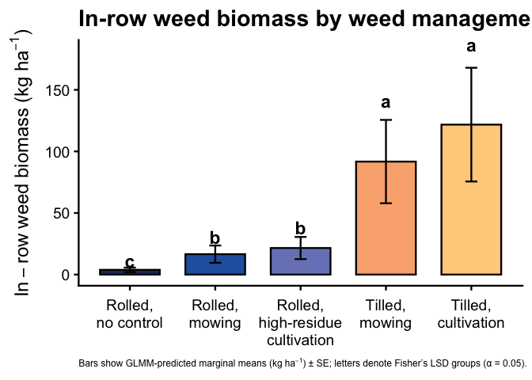<!-- -->

``` r
# 5) Save figure --------------------------------------------------------
ggsave(
  filename = file.path(fig_dir_inrow, "fig_inrow-weed_biomass_model_kg_ha.png"),
  plot     = fig_inrow_model,
  width    = 9,
  height   = 5.5,
  dpi      = 300
)
```

### Model-prediected means (lb ac⁻¹)

``` r
### Figure: In-row weed biomass by weed management 
### (GLMM-predicted marginal means ± SE, model CLDs, lb ac^-1)

# kg/ha → lb/ac conversion factor
kg_ha_to_lb_ac <- 0.892179

# 1) Model-based emmeans by treatment (still fit in kg ha^-1) -----------
emm_inrow <- emmeans(
  weed_inrow_glmm,
  ~ weed_trt,
  type = "response"   # back-transform from link scale (kg ha^-1)
)

# Tidy emmeans and convert to lb ac^-1
emm_inrow_lb_df <- as_tibble(emm_inrow) |>
  mutate(
    weed_trt   = factor(weed_trt, levels = mow_levels),
    mean_lb    = response * kg_ha_to_lb_ac,
    SE_lb      = SE       * kg_ha_to_lb_ac,
    ymin       = pmax(mean_lb - SE_lb, 0),
    ymax       = mean_lb + SE_lb
  )

# 2) Model-based CLDs for treatment main effect -------------------------
cld_inrow <- cld(
  emm_inrow,
  adjust   = "none",
  Letters  = letters,
  sort     = TRUE,
  reversed = TRUE   # so "a" = highest biomass group(s)
) |>
  as_tibble() |>
  mutate(
    weed_trt = factor(weed_trt, levels = mow_levels),
    .group   = str_trim(.group)
  ) |>
  select(weed_trt, .group)

# 3) Join model-predicted means (lb/ac) + CLDs --------------------------
plot_df_inrow_model_lb <- emm_inrow_lb_df |>
  left_join(cld_inrow, by = "weed_trt")

# 4) Plot ---------------------------------------------------------------
fig_inrow_model_lb <- ggplot(
  plot_df_inrow_model_lb,
  aes(x = weed_trt, y = mean_lb, fill = weed_trt)
) +
  geom_col(width = 0.7, color = "black") +
  geom_errorbar(aes(ymin = ymin, ymax = ymax), width = 0.14) +
  geom_text(
    aes(y = ymax * 1.08, label = .group),
    vjust    = 0,
    fontface = "bold",
    size     = 6
  ) +
  scale_fill_manual(values = fill_cols, guide = "none") +
  scale_x_discrete(labels = label_break_comma_cult) +
  scale_y_continuous(labels = scales::label_comma()) +
  labs(
    x       = NULL,
    y       = expression(In-row~weed~biomass~"(lb"~ac^{-1}*")"),
    title   = "In-row weed biomass by weed management",
    caption = "Bars show GLMM-predicted marginal means (lb"~ac^{-1}*") ± SE; letters denote Fisher’s LSD groups (α = 0.05)."
  ) +
  theme_classic(base_size = 18) +
  theme(
    axis.text.x  = element_text(lineheight = 0.95, margin = margin(t = 8)),
    axis.title.y = element_text(margin = margin(r = 8)),
    plot.title   = element_text(face = "bold"),
    plot.caption = element_text(size = 9, hjust = 0)
  )

fig_inrow_model_lb  # print in the Rmd
```

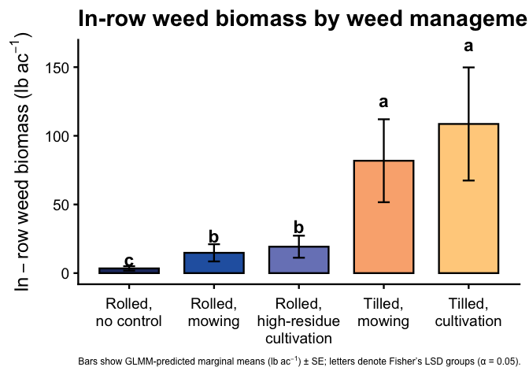<!-- -->

``` r
# 5) Save figure --------------------------------------------------------
ggsave(
  filename = file.path(fig_dir_inrow, "fig_inrow-weed_biomass_model_lb_ac.png"),
  plot     = fig_inrow_model_lb,
  width    = 9,
  height   = 5.5,
  dpi      = 300
)
```

### Raw means (kg ha⁻¹)

``` r
#### In-row weed biomass (kg ha^-1): raw means ± SE with model CLDs

## 0) Directory for in-row weed-biomass figures --------------------------
fig_dir_inrow <- here("analysis", "figs", "weed-biomass", "in-row")
dir.create(fig_dir_inrow, showWarnings = FALSE, recursive = TRUE)

## Figure: In-row weed biomass by weed management treatment (raw means ± SE, model CLDs)

# 1) Raw means and SE by treatment --------------------------------------
raw_inrow_summary <- weed_biomass_clean |>
  group_by(weed_trt) |>
  summarise(
    n    = n(),
    mean = mean(inrow_weed_biomass_kg_ha, na.rm = TRUE),
    sd   = sd(inrow_weed_biomass_kg_ha, na.rm = TRUE),
    se   = sd / sqrt(n),
    .groups = "drop"
  ) |>
  mutate(
    weed_trt = factor(weed_trt, levels = mow_levels),
    ymin     = pmax(mean - se, 0),
    ymax     = mean + se
  )

# 2) Model-based CLDs for treatment main effect -------------------------
emm_inrow <- emmeans(
  weed_inrow_glmm,
  ~ weed_trt,
  type = "response"   # back-transform from link scale
)

cld_inrow <- cld(
  emm_inrow,
  adjust   = "none",
  Letters  = letters,
  sort     = TRUE,
  reversed = TRUE   # so "a" = highest biomass group(s)
) |>
  as_tibble() |>
  mutate(
    weed_trt = factor(weed_trt, levels = mow_levels),
    .group   = str_trim(.group)
  ) |>
  select(weed_trt, .group)

# 3) Join raw means + model CLDs ----------------------------------------
plot_df_inrow_raw <- raw_inrow_summary |>
  left_join(cld_inrow, by = "weed_trt")

# 4) Plot ---------------------------------------------------------------
fig_inrow_raw <- ggplot(plot_df_inrow_raw, aes(x = weed_trt, y = mean, fill = weed_trt)) +
  geom_col(width = 0.7, color = "black") +
  geom_errorbar(aes(ymin = ymin, ymax = ymax), width = 0.14) +
  geom_text(
    aes(y = ymax * 1.08, label = .group),
    vjust    = 0,
    fontface = "bold",
    size     = 6
  ) +
  scale_fill_manual(values = fill_cols, guide = "none") +
  scale_x_discrete(labels = label_break_comma_cult) +
  scale_y_continuous(labels = scales::label_comma()) +
  labs(
    x       = NULL,
    y       = expression(In-row~weed~biomass~"(kg"~ha^{-1}*")"),
    title   = "In-row weed biomass by weed management",
     caption = "Bars show raw means (kg ha⁻¹) ± SE; similar letters indicate no significant difference (Fisher’s LSD test, α = 0.05)."
  ) +
  theme_classic(base_size = 18) +
  theme(
    axis.text.x  = element_text(lineheight = 0.95, margin = margin(t = 8)),
    axis.title.y = element_text(margin = margin(r = 8)),
    plot.title   = element_text(face = "bold"),
    plot.caption = element_text(size = 9, hjust = 0)
  )

fig_inrow_raw  # print in the Rmd
```

<!-- -->

``` r
# 5) Save figure --------------------------------------------------------
ggsave(
  filename = file.path(fig_dir_inrow, "fig_inrow-weed_biomass_raw_kg_ha.png"),
  plot     = fig_inrow_raw,
  width    = 9,
  height   = 5.5,
  dpi      = 300
)
```

### Raw means (lb ha⁻¹)

``` r
### Figure: In-row weed biomass by weed management (raw means ± SE, model CLDs)
### Units converted from kg ha^-1 to lb ac^-1 for farmer meetings

# kg/ha → lb/ac conversion factor
kg_ha_to_lb_ac <- 0.892179

# 1) Raw means and SE by treatment (in lb ac^-1) -------------------------
raw_inrow_summary_lb <- weed_biomass_clean |>
  group_by(weed_trt) |>
  summarise(
    n    = n(),
    mean = mean(inrow_weed_biomass_kg_ha, na.rm = TRUE),
    sd   = sd(inrow_weed_biomass_kg_ha, na.rm = TRUE),
    se   = sd / sqrt(n),
    .groups = "drop"
  ) |>
  mutate(
    # convert to lb ac^-1
    mean = mean * kg_ha_to_lb_ac,
    sd   = sd   * kg_ha_to_lb_ac,
    se   = se   * kg_ha_to_lb_ac,
    weed_trt = factor(weed_trt, levels = mow_levels),
    ymin     = pmax(mean - se, 0),
    ymax     = mean + se
  )

# 2) Model-based CLDs for treatment main effect (still on kg/ha scale) ---
emm_inrow <- emmeans(
  weed_inrow_glmm,
  ~ weed_trt,
  type = "response"   # back-transform from link scale
)

cld_inrow <- cld(
  emm_inrow,
  adjust   = "none",
  Letters  = letters,
  sort     = TRUE,
  reversed = TRUE   # so "a" = highest biomass group(s)
) |>
  as_tibble() |>
  mutate(
    weed_trt = factor(weed_trt, levels = mow_levels),
    .group   = str_trim(.group)
  ) |>
  select(weed_trt, .group)

# 3) Join raw means + model CLDs ----------------------------------------
plot_df_inrow_raw_lb <- raw_inrow_summary_lb |>
  left_join(cld_inrow, by = "weed_trt")

# 4) Plot ---------------------------------------------------------------
fig_inrow_raw_lb <- ggplot(plot_df_inrow_raw_lb, aes(x = weed_trt, y = mean, fill = weed_trt)) +
  geom_col(width = 0.7, color = "black") +
  geom_errorbar(aes(ymin = ymin, ymax = ymax), width = 0.14) +
  geom_text(
    aes(y = ymax * 1.08, label = .group),
    vjust    = 0,
    fontface = "bold",
    size     = 6
  ) +
  scale_fill_manual(values = fill_cols, guide = "none") +
  scale_x_discrete(labels = label_break_comma_cult) +
  scale_y_continuous(labels = scales::label_comma()) +
  labs(
    x       = NULL,
    y       = expression(In-row~weed~biomass~"(lb"~ac^{-1}*")"),
    title   = "In-row weed biomass by weed management",
    caption = "Bars show raw means (lb ac^-1) ± SE; similar letters indicate no significant difference (Fisher’s LSD test, P > 0.05)."
  ) +
  theme_classic(base_size = 18) +
  theme(
    axis.text.x  = element_text(lineheight = 0.95, margin = margin(t = 8)),
    axis.title.y = element_text(margin = margin(r = 8)),
    plot.title   = element_text(face = "bold"),
    plot.caption = element_text(size = 9, hjust = 0)
  )

fig_inrow_raw_lb  # print in the Rmd
```

<!-- -->

``` r
# 5) Save figure --------------------------------------------------------
ggsave(
  filename = file.path(fig_dir_inrow, "fig_inrow-weed_biomass_raw_lb_ac.png"),
  plot     = fig_inrow_raw_lb,
  width    = 9,
  height   = 5.5,
  dpi      = 300
)
```

## Interrow weed biomass

### Model-prediected means (kg ha⁻¹)

``` r
## 0) Directory for inter-row weed-biomass figures -----------------------
fig_dir_interrow <- here("analysis", "figs", "weed-biomass", "inter-row")
dir.create(fig_dir_interrow, showWarnings = FALSE, recursive = TRUE)

## Optional: nice facet labels for site_year (reuse if already defined) --
site_year_labs <- c(
  "2024.field O2 east" = "2024 \u2013 Field O2 East",
  "2024.field O2 west" = "2024 \u2013 Field O2 West",
  "2023.field v"       = "2023 \u2013 Field V"
)

## Figure: Inter-row weed biomass by weed management 
## (GLMM-predicted means ± SE, site-year CLDs)

# 1) Model-based emmeans by site-year × treatment -----------------------
emm_interrow_sy <- emmeans(
  weed_interrow_glmm,
  ~ weed_trt | site_year,
  type = "response"   # back-transform from link scale (kg ha^-1)
)

emm_interrow_sy_df <- as_tibble(emm_interrow_sy) |>
  mutate(
    site_year = as.factor(site_year),
    weed_trt  = factor(weed_trt, levels = mow_levels),
    mean      = response,
    ymin      = pmax(mean - SE, 0),
    ymax      = mean + SE
  )

# 2) Model-based CLDs for treatment *within each site-year* --------------
cld_interrow_sy <- cld(
  emm_interrow_sy,
  adjust   = "none",
  Letters  = letters,
  sort     = TRUE,
  reversed = TRUE      # so "a" = highest biomass group(s) within each site-year
) |>
  as_tibble() |>
  mutate(
    site_year = as.factor(site_year),
    weed_trt  = factor(weed_trt, levels = mow_levels),
    .group    = str_trim(.group)
  ) |>
  select(site_year, weed_trt, .group)

# 3) Join model means + site-year CLDs ----------------------------------
plot_df_interrow_sy_model <- emm_interrow_sy_df |>
  left_join(cld_interrow_sy, by = c("site_year", "weed_trt"))

# 4) Plot ---------------------------------------------------------------
fig_interrow_model_kg_sy <- ggplot(
  plot_df_interrow_sy_model,
  aes(x = weed_trt, y = mean, fill = weed_trt)
) +
  geom_col(width = 0.7, color = "black") +
  geom_errorbar(aes(ymin = ymin, ymax = ymax), width = 0.14) +
  geom_text(
    aes(y = ymax * 1.08, label = .group),
    vjust    = 0,
    fontface = "bold",
    size     = 4
  ) +
  facet_wrap(
    ~ site_year,
    nrow     = 1,
    labeller = labeller(site_year = site_year_labs)
  ) +
  scale_fill_manual(values = fill_cols, guide = "none") +
  scale_x_discrete(labels = label_break_comma_cult) +
  scale_y_continuous(labels = scales::label_comma()) +
  labs(
    x     = NULL,
    y     = expression(Inter-row~weed~biomass~"(kg"~ha^{-1}*")"),
    title = "Inter-row weed biomass by weed management across site-years",
    caption = "Bars show GLMM-predicted marginal means (kg"~ha^{-1}*") ± SE; letters denote Fisher’s LSD groups within each site-year (α = 0.05)."
  ) +
  theme_classic(base_size = 16) +
  theme(
    axis.text.x  = element_text(lineheight = 0.95, margin = margin(t = 8)),
    axis.title.y = element_text(margin = margin(r = 8)),
    strip.text   = element_text(face = "bold"),
    plot.title   = element_text(face = "bold"),
    plot.caption = element_text(size = 9, hjust = 0)
  )

fig_interrow_model_kg_sy  # print in the Rmd
```

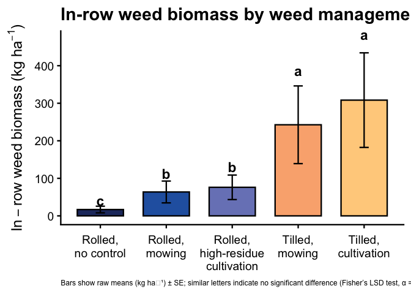<!-- -->

``` r
# 5) Save figure --------------------------------------------------------
ggsave(
  filename = file.path(fig_dir_interrow, "fig_interrow-weed_biomass_model_by-site-year_kg_ha.png"),
  plot     = fig_interrow_model_kg_sy,
  width    = 12,
  height   = 5.5,
  dpi      = 300
)
```

### Model-prediected means (lb ac⁻¹)

``` r
## 0) Directory for inter-row weed-biomass figures -----------------------
fig_dir_interrow <- here("analysis", "figs", "weed-biomass", "inter-row")
dir.create(fig_dir_interrow, showWarnings = FALSE, recursive = TRUE)

## Optional: nice facet labels for site_year (reuse if already defined) --
site_year_labs <- c(
  "2024.field O2 east" = "2024 \u2013 Field O2 East",
  "2024.field O2 west" = "2024 \u2013 Field O2 West",
  "2023.field v"       = "2023 \u2013 Field V"
)

## kg/ha -> lb/ac conversion factor --------------------------------------
kg_ha_to_lb_ac <- 0.892179

## Figure: Inter-row weed biomass by weed management 
## (GLMM-predicted means ± SE, site-year CLDs; lb ac^-1)

# 1) Model-based emmeans by site-year × treatment -----------------------
emm_interrow_sy <- emmeans(
  weed_interrow_glmm,
  ~ weed_trt | site_year,
  type = "response"   # back-transform from link scale (kg ha^-1)
)

emm_interrow_sy_lb <- as_tibble(emm_interrow_sy) |>
  mutate(
    site_year = as.factor(site_year),
    weed_trt  = factor(weed_trt, levels = mow_levels),
    mean      = response * kg_ha_to_lb_ac,
    SE_lb     = SE       * kg_ha_to_lb_ac,
    ymin      = pmax(mean - SE_lb, 0),
    ymax      = mean + SE_lb
  )

# 2) Model-based CLDs for treatment *within each site-year* --------------
cld_interrow_sy <- cld(
  emm_interrow_sy,
  adjust   = "none",
  Letters  = letters,
  sort     = TRUE,
  reversed = TRUE      # "a" = highest biomass group(s) within each site-year
) |>
  as_tibble() |>
  mutate(
    site_year = as.factor(site_year),
    weed_trt  = factor(weed_trt, levels = mow_levels),
    .group    = str_trim(.group)
  ) |>
  select(site_year, weed_trt, .group)

# 3) Join model means (lb/ac) + site-year CLDs --------------------------
plot_df_interrow_sy_lb <- emm_interrow_sy_lb |>
  left_join(cld_interrow_sy, by = c("site_year", "weed_trt"))

# 4) Plot ---------------------------------------------------------------
fig_interrow_model_lb_sy <- ggplot(
  plot_df_interrow_sy_lb,
  aes(x = weed_trt, y = mean, fill = weed_trt)
) +
  geom_col(width = 0.7, color = "black") +
  geom_errorbar(aes(ymin = ymin, ymax = ymax), width = 0.14) +
  geom_text(
    aes(y = ymax * 1.08, label = .group),
    vjust    = 0,
    fontface = "bold",
    size     = 4
  ) +
  facet_wrap(
    ~ site_year,
    nrow     = 1,
    labeller = labeller(site_year = site_year_labs)
  ) +
  scale_fill_manual(values = fill_cols, guide = "none") +
  scale_x_discrete(labels = label_break_comma_cult) +
  scale_y_continuous(labels = scales::label_comma()) +
  labs(
    x       = NULL,
    y       = expression(Inter-row~weed~biomass~"(lb"~ac^{-1}*")"),
    title   = "Inter-row weed biomass by weed management across site-years",
    caption = "Bars show GLMM-predicted marginal means (lb"~ac^{-1}*") ± SE; letters denote Fisher’s LSD groups within each site-year (α = 0.05)."
  ) +
  theme_classic(base_size = 16) +
  theme(
    axis.text.x  = element_text(lineheight = 0.95, margin = margin(t = 8)),
    axis.title.y = element_text(margin = margin(r = 8)),
    strip.text   = element_text(face = "bold"),
    plot.title   = element_text(face = "bold"),
    plot.caption = element_text(size = 9, hjust = 0)
  )

fig_interrow_model_lb_sy  # print in the Rmd
```

<!-- -->

``` r
# 5) Save figure --------------------------------------------------------
ggsave(
  filename = file.path(fig_dir_interrow,
                       "fig_interrow-weed_biomass_model_by-site-year_lb_ac.png"),
  plot     = fig_interrow_model_lb_sy,
  width    = 12,
  height   = 5.5,
  dpi      = 300
)
```

### Raw means (kg ha⁻¹)

``` r
## 0) Directory for inter-row weed-biomass figures -----------------------
fig_dir_interrow <- here("analysis", "figs", "weed-biomass", "inter-row")
dir.create(fig_dir_interrow, showWarnings = FALSE, recursive = TRUE)

## Optional: nice facet labels for site_year (reuse if already defined) --
site_year_labs <- c(
  "2024.field O2 east" = "2024 \u2013 Field O2 East",
  "2024.field O2 west" = "2024 \u2013 Field O2 West",
  "2023.field v"       = "2023 \u2013 Field V"
)

## Figure: Inter-row weed biomass by weed management (raw means ± SE, site-year CLDs)

# 1) Raw means and SE by site-year × treatment ---------------------------
raw_interrow_summary <- weed_biomass_clean |>
  group_by(site_year, weed_trt) |>
  summarise(
    n    = n(),
    mean = mean(interrow_weed_biomass_kg_ha, na.rm = TRUE),
    sd   = sd(interrow_weed_biomass_kg_ha, na.rm = TRUE),
    se   = sd / sqrt(n),
    .groups = "drop"
  ) |>
  mutate(
    site_year = as.factor(site_year),
    weed_trt  = factor(weed_trt, levels = mow_levels),
    ymin      = pmax(mean - se, 0),
    ymax      = mean + se
  )

# 2) Model-based CLDs for treatment *within each site-year* --------------
emm_interrow_sy <- emmeans(
  weed_interrow_glmm,
  ~ weed_trt | site_year,
  type = "response"   # back-transform from link scale
)

cld_interrow_sy <- cld(
  emm_interrow_sy,
  adjust   = "none",
  Letters  = letters,
  sort     = TRUE,
  reversed = TRUE      # so "a" = highest biomass group(s) within each site-year
) |>
  as_tibble() |>
  mutate(
    site_year = as.factor(site_year),
    weed_trt  = factor(weed_trt, levels = mow_levels),
    .group    = str_trim(.group)
  ) |>
  select(site_year, weed_trt, .group)

# 3) Join raw means + site-year CLDs ------------------------------------
plot_df_interrow_sy <- raw_interrow_summary |>
  left_join(cld_interrow_sy, by = c("site_year", "weed_trt"))

# 4) Plot ---------------------------------------------------------------
fig_interrow_raw_kg_sy <- ggplot(
  plot_df_interrow_sy,
  aes(x = weed_trt, y = mean, fill = weed_trt)
) +
  geom_col(width = 0.7, color = "black") +
  geom_errorbar(aes(ymin = ymin, ymax = ymax), width = 0.14) +
  geom_text(
    aes(y = ymax * 1.08, label = .group),
    vjust    = 0,
    fontface = "bold",
    size     = 4
  ) +
  facet_wrap(
    ~ site_year,
    nrow     = 1,
    labeller = labeller(site_year = site_year_labs)
  ) +
  scale_fill_manual(values = fill_cols, guide = "none") +
  scale_x_discrete(labels = label_break_comma_cult) +
  scale_y_continuous(labels = scales::label_comma()) +
  labs(
    x     = NULL,
    y     = expression(Inter-row~weed~biomass~"(kg"~ha^{-1}*")"),
    title = "Inter-row weed biomass by weed management across site-years",
     caption = "Bars show raw means (kg ha⁻¹) ± SE; letters denote model-based CLDs within each site-year (Fisher’s LSD, α = 0.05)."
  ) +
  theme_classic(base_size = 16) +
  theme(
    axis.text.x  = element_text(lineheight = 0.95, margin = margin(t = 8)),
    axis.title.y = element_text(margin = margin(r = 8)),
    strip.text   = element_text(face = "bold"),
    plot.title   = element_text(face = "bold"),
    plot.caption = element_text(size = 9, hjust = 0)
  )

fig_interrow_raw_kg_sy  # print in the Rmd
```

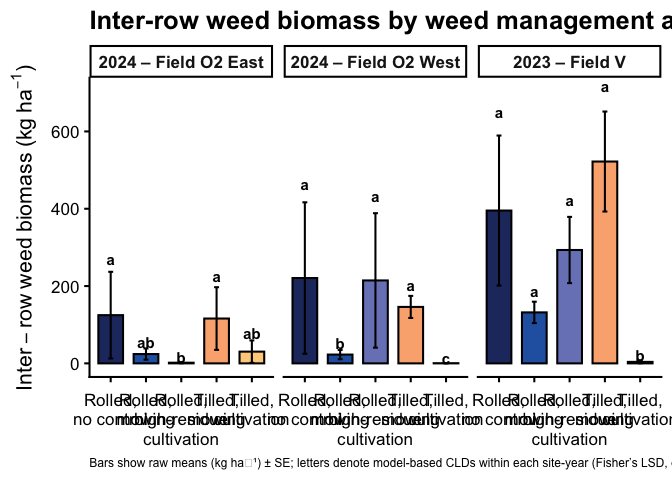<!-- -->

``` r
# 5) Save figure --------------------------------------------------------
ggsave(
  filename = file.path(fig_dir_interrow, "fig_interrow-weed_biomass_raw_by-site-year_kg_ha.png"),
  plot     = fig_interrow_raw_kg_sy,
  width    = 12,
  height   = 5.5,
  dpi      = 300
)
```

### Raw means (lb ha⁻¹)

``` r
## 0) Directory for inter-row weed-biomass figures -----------------------
fig_dir_interrow <- here("analysis", "figs", "weed-biomass", "inter-row")
dir.create(fig_dir_interrow, showWarnings = FALSE, recursive = TRUE)

## Optional: nice facet labels for site_year (reuse if already defined) --
site_year_labs <- c(
  "2024.field O2 east" = "2024 \u2013 Field O2 East",
  "2024.field O2 west" = "2024 \u2013 Field O2 West",
  "2023.field v"       = "2023 \u2013 Field V"
)

## kg/ha -> lb/ac conversion factor --------------------------------------
kg_ha_to_lb_ac <- 0.892179

## Figure: Inter-row weed biomass by weed management (raw means ± SE, site-year CLDs)

# 1) Raw means and SE by site-year × treatment (now in lb ac^-1) --------
raw_interrow_summary <- weed_biomass_clean |>
  group_by(site_year, weed_trt) |>
  summarise(
    n    = n(),
    mean = mean(interrow_weed_biomass_kg_ha, na.rm = TRUE),
    sd   = sd(interrow_weed_biomass_kg_ha, na.rm = TRUE),
    se   = sd / sqrt(n),
    .groups = "drop"
  ) |>
  mutate(
    # convert to lb ac^-1
    mean = mean * kg_ha_to_lb_ac,
    sd   = sd   * kg_ha_to_lb_ac,
    se   = se   * kg_ha_to_lb_ac,
    site_year = as.factor(site_year),
    weed_trt  = factor(weed_trt, levels = mow_levels),
    ymin      = pmax(mean - se, 0),
    ymax      = mean + se
  )

# 2) Model-based CLDs for treatment *within each site-year* --------------
emm_interrow_sy <- emmeans(
  weed_interrow_glmm,
  ~ weed_trt | site_year,
  type = "response"   # back-transform from link scale (still kg/ha internally)
)

cld_interrow_sy <- cld(
  emm_interrow_sy,
  adjust   = "none",
  Letters  = letters,
  sort     = TRUE,
  reversed = TRUE      # so "a" = highest biomass group(s) within each site-year
) |>
  as_tibble() |>
  mutate(
    site_year = as.factor(site_year),
    weed_trt  = factor(weed_trt, levels = mow_levels),
    .group    = str_trim(.group)
  ) |>
  select(site_year, weed_trt, .group)

# 3) Join raw means + site-year CLDs ------------------------------------
plot_df_interrow_sy <- raw_interrow_summary |>
  left_join(cld_interrow_sy, by = c("site_year", "weed_trt"))

# 4) Plot ---------------------------------------------------------------
fig_interrow_raw_lb_sy <- ggplot(
  plot_df_interrow_sy,
  aes(x = weed_trt, y = mean, fill = weed_trt)
) +
  geom_col(width = 0.7, color = "black") +
  geom_errorbar(aes(ymin = ymin, ymax = ymax), width = 0.14) +
  geom_text(
    aes(y = ymax * 1.08, label = .group),
    vjust    = 0,
    fontface = "bold",
    size     = 4
  ) +
  facet_wrap(
    ~ site_year,
    nrow     = 1,
    labeller = labeller(site_year = site_year_labs)
  ) +
  scale_fill_manual(values = fill_cols, guide = "none") +
  scale_x_discrete(labels = label_break_comma_cult) +
  scale_y_continuous(labels = scales::label_comma()) +
  labs(
    x     = NULL,
    y     = expression(Inter-row~weed~biomass~"(lb"~ac^{-1}*")"),
    title = "Inter-row weed biomass by weed management across site-years",
     caption = "Bars show raw means (lb ac^-1) ± SE; letters denote model-based CLDs within each site-year (Fisher’s LSD, P > 0.05)."
  ) +
  theme_classic(base_size = 16) +
  theme(
    axis.text.x  = element_text(lineheight = 0.95, margin = margin(t = 8)),
    axis.title.y = element_text(margin = margin(r = 8)),
    strip.text   = element_text(face = "bold"),
    plot.title   = element_text(face = "bold"),
    plot.caption = element_text(size = 9, hjust = 0)
  )

fig_interrow_raw_lb_sy  # print in the Rmd
```

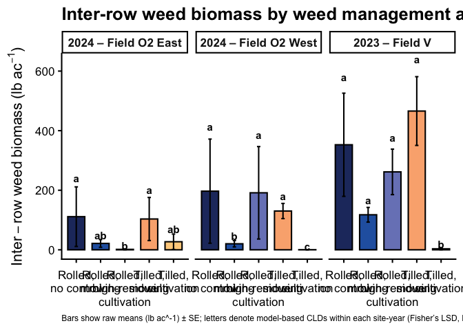<!-- -->

``` r
# 5) Save figure --------------------------------------------------------
ggsave(
  filename = file.path(fig_dir_interrow, "fig_interrow-weed_biomass_raw_by-site-year_lb_ac.png"),
  plot     = fig_interrow_raw_lb_sy,
  width    = 12,
  height   = 5.5,
  dpi      = 300
)
```
