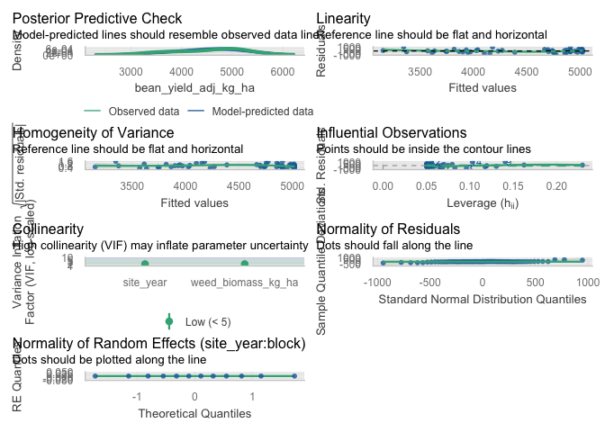
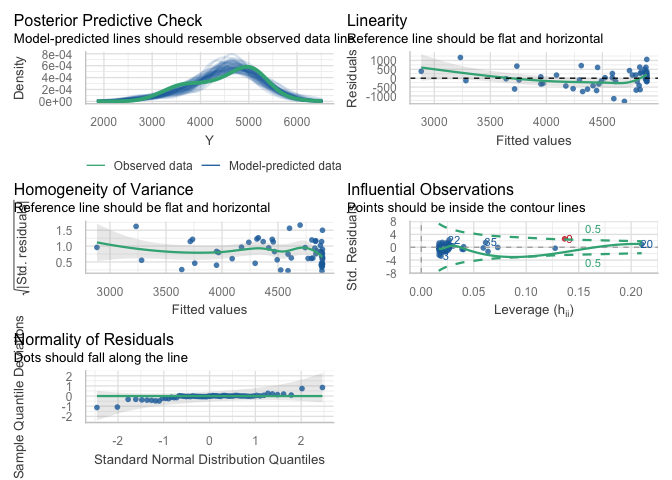
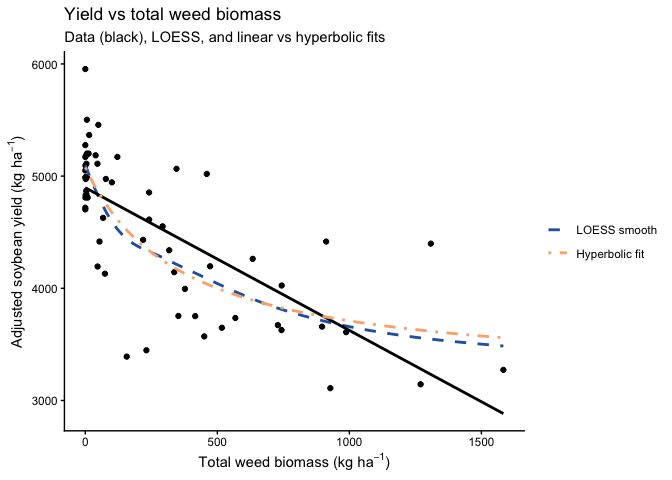
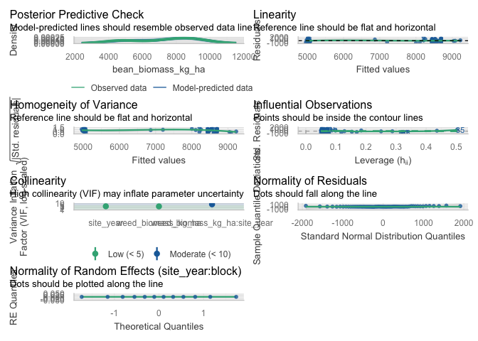
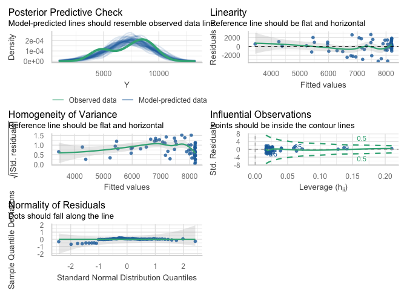
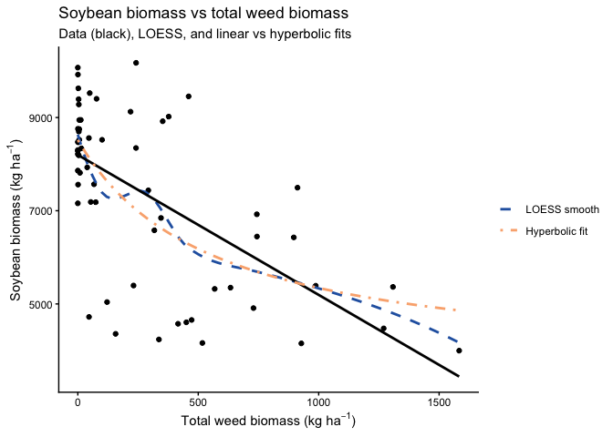

Weed soy relationships
================

- [Data import & prep](#data-import--prep)
- [Model testing](#model-testing)
  - [Total weed biomass vs adjusted soybean
    yield](#total-weed-biomass-vs-adjusted-soybean-yield)
    - [Dataset](#dataset)
    - [Mixed model selection (site-year
      effects)](#mixed-model-selection-site-year-effects)
    - [Slope summary via emtrends](#slope-summary-via-emtrends)
    - [Linear vs rectangular hyperbolic
      response](#linear-vs-rectangular-hyperbolic-response)
    - [Diagnostics](#diagnostics)
    - [Visualisation](#visualisation)
    - [Mixed model selection (site-year
      effects)](#mixed-model-selection-site-year-effects-1)
    - [Slope summary via emtrends](#slope-summary-via-emtrends-1)

\#Setup

\#Packages

``` r
## Packages -----------------------------------------------------------------

library(tidyverse)    # dplyr, ggplot2, readr, tibble, etc.
library(janitor)
library(readxl)
library(here)

# Mixed models / GLMMs
library(lme4)
library(glmmTMB)
library(DHARMa)
library(emmeans)
library(multcomp)
library(car)

# Tables / reporting
library(kableExtra)
library(broom)        # tidy() / glance() for lm
library(broom.mixed)  # tidy() / glance() for lmer / glmmTMB

# Diagnostics
library(performance)  # check_model(), etc.

# Nonlinear fits
library(minpack.lm)   # nlsLM(), if needed

# Palettes
library(WrensBookshelf)

# Conflict handling ---------------------------------------------------------

library(conflicted)
conflicts_prefer(dplyr::select)
conflicts_prefer(dplyr::filter)
conflicts_prefer(dplyr::recode)

## Treatment level order (used everywhere) ----------------------------------

mow_levels <- c(
  "Rolled, no control",
  "Rolled, mowing",
  "Rolled, high-residue cultivation",
  "Tilled, mowing",
  "Tilled, cultivation"
)

## Color palette for treatments (CVD-safe) ----------------------------------

fill_cols <- WB_brewer(
  name = "WhatWellBuild",
  n    = length(mow_levels),
  type = "discrete"
) |>
  setNames(mow_levels)

## Axis label helpers -------------------------------------------------------

# Break on spaces (every word on its own line)
label_break_spaces <- function(x) {
  stringr::str_replace_all(x, " ", "\n")
}

# Break after the comma: "Rolled,\nno control"
label_break_comma <- function(x) {
  stringr::str_replace_all(x, ", ", ",\n")
}

# Break after comma and split "high-residue cultivation"
# -> "Rolled,\nhigh-residue\ncultivation"
label_break_comma_cult <- function(x) {
  x |>
    stringr::str_replace("high-residue cultivation",
                         "high-residue\ncultivation") |>
    stringr::str_replace_all(", ", ",\n")
}

## Helper: tidy emmeans output regardless of CI column names ---------------

tidy_emm <- function(emm, ref_levels = NULL) {
  emm_df <- as.data.frame(emm)

  lcl_col <- intersect(c("lower.CL", "asymp.LCL"), names(emm_df))[1]
  ucl_col <- intersect(c("upper.CL", "asymp.UCL"), names(emm_df))[1]

  if (is.na(lcl_col) || is.na(ucl_col)) {
    stop("Could not find CI columns in emmeans output.")
  }

  out <- emm_df |>
    dplyr::mutate(
      ci_low  = .data[[lcl_col]],
      ci_high = .data[[ucl_col]]
    )

  if (!is.null(ref_levels) && "weed_trt" %in% names(out)) {
    out <- out |>
      dplyr::mutate(weed_trt = factor(weed_trt, levels = ref_levels))
  }

  out
}
```

# Data import & prep

``` r
## Data import & prep ---------------------------------------------------------

# convenient conversion factor (kg/ha -> lb/ac)
kg_ha_to_lb_ac <- 0.892179   # 1 kg/ha ≈ 0.892179 lb/ac

# 1) Read + clean master (weed + soybean) -------------------------------------

weed_biomass_clean <- read_excel(
  here("data", "raw", "All Treatments", "combined_raw.xlsx")
) |>
  clean_names() |>
  rename(weed_trt = treatment) |>
  mutate(
    year      = factor(year),
    location  = factor(location),
    site_year = factor(interaction(year, location, drop = TRUE)),
    block     = factor(block),
    weed_trt  = recode(
      weed_trt,
      "RNO" = "Rolled, no control",
      "RIM" = "Rolled, mowing",
      "RIC" = "Rolled, high-residue cultivation",
      "TIM" = "Tilled, mowing",
      "TIC" = "Tilled, cultivation"
    ),
    weed_trt = factor(weed_trt, levels = mow_levels)
  ) |>
  # keep only rows with non-missing total weed biomass
  filter(!is.na(weed_biomass)) |>
  # per-area metrics (biomass in g per 0.5 m² quadrat)
  mutate(
    ## ---- WEEDS: total / in-row / interrow ----------------------------------
    weed_biomass_g_m2           = weed_biomass          * 2,   # g/m²
    weed_biomass_kg_ha          = weed_biomass          * 20,  # kg/ha
    weed_biomass_lb_ac          = weed_biomass_kg_ha    * kg_ha_to_lb_ac,

    inrow_weed_biomass_g_m2     = inrow_weed_biomass    * 2,
    inrow_weed_biomass_kg_ha    = inrow_weed_biomass    * 20,
    inrow_weed_biomass_lb_ac    = inrow_weed_biomass_kg_ha * kg_ha_to_lb_ac,

    interrow_weed_biomass_g_m2  = interrow_weed_biomass * 2,
    interrow_weed_biomass_kg_ha = interrow_weed_biomass * 20,
    interrow_weed_biomass_lb_ac = interrow_weed_biomass_kg_ha * kg_ha_to_lb_ac,

    ## ---- SOYBEAN: biomass --------------------------------------------------
    # bean_biomass assumed g per 0.5 m² quadrat (same as weeds)
    bean_biomass_g_m2    = bean_biomass * 2,           # g/m²
    bean_biomass_kg_ha   = bean_biomass * 20,          # kg/ha
    bean_biomass_lb_ac   = bean_biomass_kg_ha * kg_ha_to_lb_ac,

    ## ---- SOYBEAN: adjusted yield (same formulas as before) -----------------
    bean_yield_adj_bu_acre = (((bean_yield / 454) / (16.4 / 43560)) / 60) *
      ((100 - 0.00001) / (100 - 13)),
    bean_yield_adj_lbs_acre = ((bean_yield / 454) / (16.4 / 43560)) *
      ((100 - 0.00001) / (100 - 13)),
    bean_yield_adj_kg_ha = ((bean_yield / 454) / (16.4 / 43560)) * 1.12085 *
      ((100 - 0.00001) / (100 - 13)),

    ## ---- SOYBEAN: population metrics --------------------------------------
    # bean_population assumed plants per 1 m of row
    bean_population_two_meter = bean_population * 2,
    bean_population_hectare   = (bean_population / 0.762) * 10000,
    bean_population_acre      = bean_population_hectare / 2.471
  )

# 2) 2023 Field V subset ------------------------------------------------------

weed_biomass_field_v_2023 <- weed_biomass_clean |>
  filter(
    year == "2023",          # year is a factor; compare to character label
    location == "field v"
  )

# Quick check tables ----------------------------------------------------------

kable(
  head(weed_biomass_clean),
  caption = "All site-years, cleaned (weed + soybean metrics)"
)
```

| id | location | year | weed_trt | block | plot | bean_emergence | bean_biomass | inrow_weed_biomass | interrow_weed_biomass | weed_biomass | bean_population | bean_yield | seed_weight | site_year | weed_biomass_g_m2 | weed_biomass_kg_ha | weed_biomass_lb_ac | inrow_weed_biomass_g_m2 | inrow_weed_biomass_kg_ha | inrow_weed_biomass_lb_ac | interrow_weed_biomass_g_m2 | interrow_weed_biomass_kg_ha | interrow_weed_biomass_lb_ac | bean_biomass_g_m2 | bean_biomass_kg_ha | bean_biomass_lb_ac | bean_yield_adj_bu_acre | bean_yield_adj_lbs_acre | bean_yield_adj_kg_ha | bean_population_two_meter | bean_population_hectare | bean_population_acre |
|:---|:---|:---|:---|:---|---:|---:|---:|---:|---:|---:|---:|---:|---:|:---|---:|---:|---:|---:|---:|---:|---:|---:|---:|---:|---:|---:|---:|---:|---:|---:|---:|---:|
| CU_B1_P101 | field v | 2023 | Tilled, mowing | 1 | 101 | 46.5 | 223.740 | 19.000 | 44.490 | 63.490 | 34.5 | 417.21 | 17.1200 | 2023.field v | 126.98 | 1269.8 | 1132.8889 | 38.00 | 380.0 | 339.028020 | 88.98 | 889.8 | 793.86087 | 447.48 | 4474.8 | 3992.323 | 46.75977 | 2805.586 | 3144.641 | 69 | 452755.9 | 183227.8 |
| CU_B1_P102 | field v | 2023 | Tilled, cultivation | 1 | 102 | 42.5 | 267.460 | 30.975 | 0.720 | 31.695 | 39.5 | 565.54 | 17.4750 | 2023.field v | 63.39 | 633.9 | 565.5523 | 61.95 | 619.5 | 552.704891 | 1.44 | 14.4 | 12.84738 | 534.92 | 5349.2 | 4772.444 | 63.38419 | 3803.051 | 4262.650 | 79 | 518372.7 | 209782.6 |
| CU_B1_P103 | field v | 2023 | Rolled, mowing | 1 | 103 | 36.5 | 217.890 | 0.950 | 6.890 | 7.840 | 37.5 | 449.93 | 16.7525 | 2023.field v | 15.68 | 156.8 | 139.8937 | 1.90 | 19.0 | 16.951401 | 13.78 | 137.8 | 122.94227 | 435.78 | 4357.8 | 3887.938 | 50.42694 | 3025.616 | 3391.262 | 75 | 492126.0 | 199160.7 |
| CU_B1_P104 | field v | 2023 | Rolled, no control | 1 | 104 | 41.0 | 207.675 | 0.660 | 45.735 | 46.395 | 35.0 | 412.59 | 16.1450 | 2023.field v | 92.79 | 927.9 | 827.8529 | 1.32 | 13.2 | 11.776763 | 91.47 | 914.7 | 816.07613 | 415.35 | 4153.5 | 3705.665 | 46.24197 | 2774.518 | 3109.819 | 70 | 459317.6 | 185883.3 |
| CU_B1_P105 | field v | 2023 | Rolled, high-residue cultivation | 1 | 105 | 41.0 | 230.285 | 0.495 | 22.025 | 22.520 | 39.0 | 473.79 | 17.0475 | 2023.field v | 45.04 | 450.4 | 401.8374 | 0.99 | 9.9 | 8.832572 | 44.05 | 440.5 | 393.00485 | 460.57 | 4605.7 | 4109.109 | 53.10110 | 3186.066 | 3571.102 | 78 | 511811.0 | 207127.1 |
| CU_B1_P201 | field v | 2023 | Rolled, high-residue cultivation | 2 | 201 | 36.5 | 208.105 | 6.395 | 19.460 | 25.855 | 33.5 | 484.04 | 17.1500 | 2023.field v | 51.71 | 517.1 | 461.3458 | 12.79 | 127.9 | 114.109694 | 38.92 | 389.2 | 347.23607 | 416.21 | 4162.1 | 3713.338 | 54.24989 | 3254.994 | 3648.359 | 67 | 439632.5 | 177916.9 |

All site-years, cleaned (weed + soybean metrics)

``` r
kable(
  head(weed_biomass_field_v_2023),
  caption = "Field V only, 2023 (weed + soybean metrics)"
)
```

| id | location | year | weed_trt | block | plot | bean_emergence | bean_biomass | inrow_weed_biomass | interrow_weed_biomass | weed_biomass | bean_population | bean_yield | seed_weight | site_year | weed_biomass_g_m2 | weed_biomass_kg_ha | weed_biomass_lb_ac | inrow_weed_biomass_g_m2 | inrow_weed_biomass_kg_ha | inrow_weed_biomass_lb_ac | interrow_weed_biomass_g_m2 | interrow_weed_biomass_kg_ha | interrow_weed_biomass_lb_ac | bean_biomass_g_m2 | bean_biomass_kg_ha | bean_biomass_lb_ac | bean_yield_adj_bu_acre | bean_yield_adj_lbs_acre | bean_yield_adj_kg_ha | bean_population_two_meter | bean_population_hectare | bean_population_acre |
|:---|:---|:---|:---|:---|---:|---:|---:|---:|---:|---:|---:|---:|---:|:---|---:|---:|---:|---:|---:|---:|---:|---:|---:|---:|---:|---:|---:|---:|---:|---:|---:|---:|
| CU_B1_P101 | field v | 2023 | Tilled, mowing | 1 | 101 | 46.5 | 223.740 | 19.000 | 44.490 | 63.490 | 34.5 | 417.21 | 17.1200 | 2023.field v | 126.98 | 1269.8 | 1132.8889 | 38.00 | 380.0 | 339.028020 | 88.98 | 889.8 | 793.86087 | 447.48 | 4474.8 | 3992.323 | 46.75977 | 2805.586 | 3144.641 | 69 | 452755.9 | 183227.8 |
| CU_B1_P102 | field v | 2023 | Tilled, cultivation | 1 | 102 | 42.5 | 267.460 | 30.975 | 0.720 | 31.695 | 39.5 | 565.54 | 17.4750 | 2023.field v | 63.39 | 633.9 | 565.5523 | 61.95 | 619.5 | 552.704891 | 1.44 | 14.4 | 12.84738 | 534.92 | 5349.2 | 4772.444 | 63.38419 | 3803.051 | 4262.650 | 79 | 518372.7 | 209782.6 |
| CU_B1_P103 | field v | 2023 | Rolled, mowing | 1 | 103 | 36.5 | 217.890 | 0.950 | 6.890 | 7.840 | 37.5 | 449.93 | 16.7525 | 2023.field v | 15.68 | 156.8 | 139.8937 | 1.90 | 19.0 | 16.951401 | 13.78 | 137.8 | 122.94227 | 435.78 | 4357.8 | 3887.938 | 50.42694 | 3025.616 | 3391.262 | 75 | 492126.0 | 199160.7 |
| CU_B1_P104 | field v | 2023 | Rolled, no control | 1 | 104 | 41.0 | 207.675 | 0.660 | 45.735 | 46.395 | 35.0 | 412.59 | 16.1450 | 2023.field v | 92.79 | 927.9 | 827.8529 | 1.32 | 13.2 | 11.776763 | 91.47 | 914.7 | 816.07613 | 415.35 | 4153.5 | 3705.665 | 46.24197 | 2774.518 | 3109.819 | 70 | 459317.6 | 185883.3 |
| CU_B1_P105 | field v | 2023 | Rolled, high-residue cultivation | 1 | 105 | 41.0 | 230.285 | 0.495 | 22.025 | 22.520 | 39.0 | 473.79 | 17.0475 | 2023.field v | 45.04 | 450.4 | 401.8374 | 0.99 | 9.9 | 8.832572 | 44.05 | 440.5 | 393.00485 | 460.57 | 4605.7 | 4109.109 | 53.10110 | 3186.066 | 3571.102 | 78 | 511811.0 | 207127.1 |
| CU_B1_P201 | field v | 2023 | Rolled, high-residue cultivation | 2 | 201 | 36.5 | 208.105 | 6.395 | 19.460 | 25.855 | 33.5 | 484.04 | 17.1500 | 2023.field v | 51.71 | 517.1 | 461.3458 | 12.79 | 127.9 | 114.109694 | 38.92 | 389.2 | 347.23607 | 416.21 | 4162.1 | 3713.338 | 54.24989 | 3254.994 | 3648.359 | 67 | 439632.5 | 177916.9 |

Field V only, 2023 (weed + soybean metrics)

# Model testing

## Total weed biomass vs adjusted soybean yield

### Dataset

``` r
# ----------------------------------------------------------------------
# Model testing: total weed biomass vs adjusted soybean yield (kg ha^-1)
# ----------------------------------------------------------------------

## Exploratory: regression dataset -------------------------------------

reg_yield <- weed_biomass_clean |>
  filter(
    !is.na(weed_biomass_kg_ha),
    !is.na(bean_yield_adj_kg_ha),
    !is.na(site_year),
    !is.na(block)
  )

# Quick structure check (optional)
str(reg_yield[, c("site_year", "block",
                  "weed_biomass_kg_ha", "bean_yield_adj_kg_ha")])
```

    ## tibble [60 × 4] (S3: tbl_df/tbl/data.frame)
    ##  $ site_year           : Factor w/ 3 levels "2024.field O2 east",..: 3 3 3 3 3 3 3 3 3 3 ...
    ##  $ block               : Factor w/ 4 levels "1","2","3","4": 1 1 1 1 1 2 2 2 2 2 ...
    ##  $ weed_biomass_kg_ha  : num [1:60] 1270 634 157 928 450 ...
    ##  $ bean_yield_adj_kg_ha: num [1:60] 3145 4263 3391 3110 3571 ...

### Mixed model selection (site-year effects)

``` r
## Mixed model selection: additive vs interaction ----------------------

options(contrasts = c("contr.sum", "contr.poly"))

# 1) Candidate mixed models --------------------------------------------

# Additive: common slope across site-year (site_year as fixed effect)
yield_add <- lmer(
  bean_yield_adj_kg_ha ~ weed_biomass_kg_ha + site_year +
    (1 | site_year:block),
  data = reg_yield
)

# Interaction: slope allowed to differ by site-year
yield_int <- lmer(
  bean_yield_adj_kg_ha ~ weed_biomass_kg_ha * site_year +
    (1 | site_year:block),
  data = reg_yield
)

# 2) Likelihood ratio test ---------------------------------------------

lrt_yield   <- anova(yield_add, yield_int)
p_int_yield <- lrt_yield$`Pr(>Chisq)`[2]

# 3) AIC table with LRT p-value only for interaction model -------------

aic_yield <- tibble(
  model = c(
    "Additive: weed_biomass_kg_ha + site_year",
    "Interaction: weed_biomass_kg_ha * site_year"
  ),
  AIC = c(AIC(yield_add), AIC(yield_int))
) |>
  mutate(
    deltaAIC = AIC - min(AIC),
    `LRT p (interaction vs additive)` = c(NA_real_, p_int_yield)
  )

# Selection rule: prefer simpler model unless interaction is clearly better
keep_interaction <- (p_int_yield < 0.05) &&
  (aic_yield$deltaAIC[aic_yield$model ==
                        "Interaction: weed_biomass_kg_ha * site_year"] < 2)

yield_mod_best <- if (keep_interaction) yield_int else yield_add

chosen_model_name_yield <- if (keep_interaction) {
  "Interaction: weed_biomass_kg_ha * site_year"
} else {
  "Additive: weed_biomass_kg_ha + site_year"
}

aic_yield_out <- aic_yield |>
  mutate(
    Selected = if_else(model == chosen_model_name_yield, "Yes", "")
  )

aic_yield_out |>
  kable(
    digits  = 2,
    caption = "Adjusted soybean yield vs total weed biomass: model comparison (additive vs interaction). LRT p-value compares the interaction model vs the additive model."
  ) |>
  kable_styling(full_width = FALSE, bootstrap_options = c("striped", "hover"))
```

<table class="table table-striped table-hover" style="color: black; width: auto !important; margin-left: auto; margin-right: auto;">

<caption>

Adjusted soybean yield vs total weed biomass: model comparison (additive
vs interaction). LRT p-value compares the interaction model vs the
additive model.
</caption>

<thead>

<tr>

<th style="text-align:left;">

model
</th>

<th style="text-align:right;">

AIC
</th>

<th style="text-align:right;">

deltaAIC
</th>

<th style="text-align:right;">

LRT p (interaction vs additive)
</th>

<th style="text-align:left;">

Selected
</th>

</tr>

</thead>

<tbody>

<tr>

<td style="text-align:left;">

Additive: weed_biomass_kg_ha + site_year
</td>

<td style="text-align:right;">

871.25
</td>

<td style="text-align:right;">

0.00
</td>

<td style="text-align:right;">

NA
</td>

<td style="text-align:left;">

Yes
</td>

</tr>

<tr>

<td style="text-align:left;">

Interaction: weed_biomass_kg_ha \* site_year
</td>

<td style="text-align:right;">

871.66
</td>

<td style="text-align:right;">

0.41
</td>

<td style="text-align:right;">

0.08
</td>

<td style="text-align:left;">

</td>

</tr>

</tbody>

</table>

``` r
cat(
  "\nSelected model for adjusted soybean yield vs total weed biomass:\n  ",
  chosen_model_name_yield,
  sprintf("  [LRT p (interaction) = %.3f]\n", p_int_yield)
)
```

    ## 
    ## Selected model for adjusted soybean yield vs total weed biomass:
    ##    Additive: weed_biomass_kg_ha + site_year   [LRT p (interaction) = 0.082]

### Slope summary via emtrends

``` r
## Slope summary: emtrends for yield vs total weed biomass --------------

# helper: find the trend column name from emtrends output
get_trend_col <- function(df, var = "weed_biomass_kg_ha") {
  nm <- grep(paste0("^", var, "\\.trend$"), names(df), value = TRUE)
  if (length(nm) != 1) {
    stop("Could not uniquely identify trend column for ", var)
  }
  nm
}

# helper: find t or z statistic column
get_stat_col <- function(df) {
  nm <- intersect(c("t.ratio", "z.ratio"), names(df))
  if (length(nm) == 0) {
    return(NA_character_)
  }
  nm[1]
}

if (chosen_model_name_yield == "Additive: weed_biomass_kg_ha + site_year") {
  
  # One common slope across site-years
  emm_slope <- emtrends(yield_mod_best, ~ 1, var = "weed_biomass_kg_ha")
  emm_slope_df <- summary(emm_slope, infer = c(TRUE, TRUE)) |>
    as_tibble()
  
  trend_col <- get_trend_col(emm_slope_df, "weed_biomass_kg_ha")
  stat_col  <- get_stat_col(emm_slope_df)
  
  has_df <- "df" %in% names(emm_slope_df)
  has_p  <- "p.value" %in% names(emm_slope_df)
  
  slope_tbl <- emm_slope_df |>
    transmute(
      Scope              = "Pooled across site-years",
      slope_kg_per_kg    = .data[[trend_col]],
      slope_kg_per_100kg = .data[[trend_col]] * 100,
      SE,
      df         = if (has_df) df else NA_real_,
      lower_95CL = lower.CL,
      upper_95CL = upper.CL,
      stat       = if (!is.na(stat_col)) .data[[stat_col]] else NA_real_,
      p_value    = if (has_p) .data[["p.value"]] else NA_real_
    )
  
} else {
  
  # Slopes vary by site-year
  emm_slope <- emtrends(yield_mod_best, ~ site_year, var = "weed_biomass_kg_ha")
  emm_slope_df <- summary(emm_slope, infer = c(TRUE, TRUE)) |>
    as_tibble()
  
  trend_col <- get_trend_col(emm_slope_df, "weed_biomass_kg_ha")
  stat_col  <- get_stat_col(emm_slope_df)
  
  has_df <- "df" %in% names(emm_slope_df)
  has_p  <- "p.value" %in% names(emm_slope_df)
  
  slope_tbl <- emm_slope_df |>
    transmute(
      Scope              = as.character(site_year),
      slope_kg_per_kg    = .data[[trend_col]],
      slope_kg_per_100kg = .data[[trend_col]] * 100,
      SE,
      df         = if (has_df) df else NA_real_,
      lower_95CL = lower.CL,
      upper_95CL = upper.CL,
      stat       = if (!is.na(stat_col)) .data[[stat_col]] else NA_real_,
      p_value    = if (has_p) .data[["p.value"]] else NA_real_
    )
}

slope_tbl |>
  mutate(
    across(
      c(slope_kg_per_kg, slope_kg_per_100kg, SE, lower_95CL, upper_95CL),
      ~ round(.x, 3)
    )
  ) |>
  kable(
    caption = "Slopes of adjusted soybean yield vs total weed biomass (kg ha^-1): mixed-model emtrends",
    col.names = c(
      "Scope (site-year / pooled)",
      "Slope (kg yield per kg weed)",
      "Slope (kg yield per 100 kg weed)",
      "SE", "df",
      "Lower 95% CL", "Upper 95% CL",
      "Test statistic", "p-value"
    )
  ) |>
  kable_styling(full_width = FALSE, bootstrap_options = c("striped", "hover"))
```

<table class="table table-striped table-hover" style="color: black; width: auto !important; margin-left: auto; margin-right: auto;">

<caption>

Slopes of adjusted soybean yield vs total weed biomass (kg ha^-1):
mixed-model emtrends
</caption>

<thead>

<tr>

<th style="text-align:left;">

Scope (site-year / pooled)
</th>

<th style="text-align:right;">

Slope (kg yield per kg weed)
</th>

<th style="text-align:right;">

Slope (kg yield per 100 kg weed)
</th>

<th style="text-align:right;">

SE
</th>

<th style="text-align:right;">

df
</th>

<th style="text-align:right;">

Lower 95% CL
</th>

<th style="text-align:right;">

Upper 95% CL
</th>

<th style="text-align:right;">

Test statistic
</th>

<th style="text-align:right;">

p-value
</th>

</tr>

</thead>

<tbody>

<tr>

<td style="text-align:left;">

Pooled across site-years
</td>

<td style="text-align:right;">

-0.701
</td>

<td style="text-align:right;">

-70.085
</td>

<td style="text-align:right;">

0.188
</td>

<td style="text-align:right;">

54.89564
</td>

<td style="text-align:right;">

-1.078
</td>

<td style="text-align:right;">

-0.324
</td>

<td style="text-align:right;">

-3.72857
</td>

<td style="text-align:right;">

0.0004574
</td>

</tr>

</tbody>

</table>

### Linear vs rectangular hyperbolic response

``` r
## Linear vs rectangular hyperbolic response of yield to weed biomass ----

# Use the same plot-level data (no random effects here, just a marginal comparison)
dat_yield <- reg_yield |>
  select(weed_biomass_kg_ha, bean_yield_adj_kg_ha) |>
  rename(
    B = weed_biomass_kg_ha,
    Y = bean_yield_adj_kg_ha
  )

# Quick sanity check (optional)
names(dat_yield)    # should be "B" and "Y"
```

    ## [1] "B" "Y"

``` r
# 1) Linear model -------------------------------------------------------

lin_mod <- lm(Y ~ B, data = dat_yield)

# 2) Rectangular hyperbolic model:
#    Y = Y0 - (Lmax * B) / (K + B)
#    Y0   = weed-free yield
#    Lmax = maximum yield loss
#    K    = biomass at half of Lmax

start_vals <- list(
  Y0   = max(dat_yield$Y, na.rm = TRUE),  # near weed-free yield
  Lmax = max(dat_yield$Y, na.rm = TRUE) - min(dat_yield$Y, na.rm = TRUE),
  K    = median(dat_yield$B[dat_yield$B > 0], na.rm = TRUE)
)

hyper_mod <- nls(
  Y ~ Y0 - (Lmax * B) / (K + B),
  data  = dat_yield,
  start = start_vals
)

summary(hyper_mod)
```

    ## 
    ## Formula: Y ~ Y0 - (Lmax * B)/(K + B)
    ## 
    ## Parameters:
    ##      Estimate Std. Error t value Pr(>|t|)    
    ## Y0     5077.9       91.8  55.313  < 2e-16 ***
    ## Lmax   1871.3      392.3   4.770 1.32e-05 ***
    ## K       367.9      213.0   1.727   0.0895 .  
    ## ---
    ## Signif. codes:  0 '***' 0.001 '**' 0.01 '*' 0.05 '.' 0.1 ' ' 1
    ## 
    ## Residual standard error: 436 on 57 degrees of freedom
    ## 
    ## Number of iterations to convergence: 6 
    ## Achieved convergence tolerance: 2.666e-06

``` r
# 3) AIC and R2 comparison -----------------------------------------------

# AIC
aic_lin   <- AIC(lin_mod)
aic_hyper <- AIC(hyper_mod)

# R2 for linear model
gl_lin <- broom::glance(lin_mod)
R2_lin     <- gl_lin$r.squared
R2_lin_adj <- gl_lin$adj.r.squared

# R2 for nls (hyperbolic)
get_r2_nls <- function(mod) {
  y_hat <- fitted(mod)
  res   <- resid(mod)
  y     <- y_hat + res  # reconstruct observed response
  
  rss <- sum(res^2)
  tss <- sum((y - mean(y))^2)
  1 - rss / tss
}

R2_hyper <- get_r2_nls(hyper_mod)

# Residual df (more meaningful than n)
df_lin   <- df.residual(lin_mod)
df_hyper <- df.residual(hyper_mod)

mod_comp <- tibble(
  model = c("Linear", "Hyperbolic"),
  df    = c(df_lin, df_hyper),
  AIC   = c(aic_lin, aic_hyper),
  R2    = c(R2_lin, R2_hyper)
)

mod_comp |>
  kable(
    digits  = 3,
    caption = "Model comparison for adjusted soybean yield vs total weed biomass: linear vs rectangular hyperbolic"
  ) |>
  kable_styling(full_width = FALSE, bootstrap_options = c("striped", "hover"))
```

<table class="table table-striped table-hover" style="color: black; width: auto !important; margin-left: auto; margin-right: auto;">

<caption>

Model comparison for adjusted soybean yield vs total weed biomass:
linear vs rectangular hyperbolic
</caption>

<thead>

<tr>

<th style="text-align:left;">

model
</th>

<th style="text-align:right;">

df
</th>

<th style="text-align:right;">

AIC
</th>

<th style="text-align:right;">

R2
</th>

</tr>

</thead>

<tbody>

<tr>

<td style="text-align:left;">

Linear
</td>

<td style="text-align:right;">

58
</td>

<td style="text-align:right;">

914.651
</td>

<td style="text-align:right;">

0.513
</td>

</tr>

<tr>

<td style="text-align:left;">

Hyperbolic
</td>

<td style="text-align:right;">

57
</td>

<td style="text-align:right;">

904.510
</td>

<td style="text-align:right;">

0.602
</td>

</tr>

</tbody>

</table>

### Diagnostics

``` r
## Diagnostics & visualization ------------------------------------------

library(performance)

# Mixed model diagnostics (chosen model)
check_model(yield_mod_best)
```

<!-- -->

``` r
# Simple linear model diagnostics
check_model(lin_mod)
```

<!-- -->

``` r
# Optional specific checks for the linear model
check_heteroscedasticity(lin_mod)
```

    ## OK: Error variance appears to be homoscedastic (p = 0.196).

``` r
check_normality(lin_mod)
```

    ## OK: residuals appear as normally distributed (p = 0.660).

``` r
check_outliers(lin_mod)
```

    ## OK: No outliers detected.
    ## - Based on the following method and threshold: cook (0.701).
    ## - For variable: (Whole model)

### Visualisation

``` r
# Reuse treatment palette for line/point colors
line_cols <- unname(fill_cols)[1:4]
```

``` r
ggplot(dat_yield, aes(x = B, y = Y)) +
  # points: always black
  geom_point(
    color = "black",
    alpha = 1
  ) +
  # LOESS: uses palette color and appears in legend
  geom_smooth(
    aes(color = "LOESS"),
    method = "loess",
    se = FALSE,
    linewidth = 1,
    linetype = "dashed"
  ) +
  # Linear: always black, not tied to color scale
  stat_function(
    fun = function(x) coef(lin_mod)[1] + coef(lin_mod)[2] * x,
    linewidth = 1,
    color = "black"
  ) +
  # Hyperbolic: uses palette color and appears in legend
  stat_function(
    aes(color = "Hyperbolic"),
    fun = function(x) {
      pars <- coef(hyper_mod)
      pars["Y0"] - (pars["Lmax"] * x) / (pars["K"] + x)
    },
    linewidth = 1,
    linetype = "dotdash"
  ) +
  scale_color_manual(
    name   = NULL,
    breaks = c("LOESS", "Hyperbolic"),
    labels = c(
      "LOESS smooth",
      "Hyperbolic fit"
    ),
    values = c(
      "LOESS"      = line_cols[2],
      "Hyperbolic" = line_cols[4]
    )
  ) +
  guides(
    color = guide_legend(
      override.aes = list(
        linetype = c("dashed", "dotdash"),
        shape    = c(NA, NA),
        alpha    = c(1, 1)
      )
    )
  ) +
  labs(
    x = bquote("Total weed biomass (kg ha"^-1*")"),
    y = bquote("Adjusted soybean yield (kg ha"^-1*")"),
    title = "Yield vs total weed biomass",
    subtitle = "Data (black), LOESS, and linear vs hyperbolic fits"
  ) +
  theme_classic() +
  theme(
    legend.position = "right"
  )
```

<!-- --> \## Total weed
biomass vs soybean biomass \### Dataset

``` r
# ----------------------------------------------------------------------
# Model testing: total weed biomass vs soybean biomass (kg ha^-1)
# ----------------------------------------------------------------------

## Exploratory: regression dataset -------------------------------------

reg_biomass <- weed_biomass_clean |>
  filter(
    !is.na(weed_biomass_kg_ha),
    !is.na(bean_biomass_kg_ha),
    !is.na(site_year),
    !is.na(block)
  )

# Quick structure check (optional)
str(reg_biomass[, c("site_year", "block",
                    "weed_biomass_kg_ha", "bean_biomass_kg_ha")])
```

    ## tibble [60 × 4] (S3: tbl_df/tbl/data.frame)
    ##  $ site_year         : Factor w/ 3 levels "2024.field O2 east",..: 3 3 3 3 3 3 3 3 3 3 ...
    ##  $ block             : Factor w/ 4 levels "1","2","3","4": 1 1 1 1 1 2 2 2 2 2 ...
    ##  $ weed_biomass_kg_ha: num [1:60] 1270 634 157 928 450 ...
    ##  $ bean_biomass_kg_ha: num [1:60] 4475 5349 4358 4154 4606 ...

### Mixed model selection (site-year effects)

``` r
### Mixed model selection (site-year effects): soybean biomass ---------
## Mixed model selection: additive vs interaction ----------------------

options(contrasts = c("contr.sum", "contr.poly"))

# 1) Candidate mixed models --------------------------------------------

# Additive: common slope across site-year (site_year as fixed effect)
biomass_add <- lmer(
  bean_biomass_kg_ha ~ weed_biomass_kg_ha + site_year +
    (1 | site_year:block),
  data = reg_biomass
)

# Interaction: slope allowed to differ by site-year
biomass_int <- lmer(
  bean_biomass_kg_ha ~ weed_biomass_kg_ha * site_year +
    (1 | site_year:block),
  data = reg_biomass
)

# 2) Likelihood ratio test ---------------------------------------------

lrt_biomass   <- anova(biomass_add, biomass_int)
p_int_biomass <- lrt_biomass$`Pr(>Chisq)`[2]

# 3) AIC table with LRT p-value only for interaction model -------------

aic_biomass <- tibble(
  model = c(
    "Additive: weed_biomass_kg_ha + site_year",
    "Interaction: weed_biomass_kg_ha * site_year"
  ),
  AIC = c(AIC(biomass_add), AIC(biomass_int))
) |>
  mutate(
    deltaAIC = AIC - min(AIC),
    `LRT p (interaction vs additive)` = c(NA_real_, p_int_biomass)
  )

# Selection rule: prefer simpler model unless interaction is clearly better
keep_interaction_biomass <- (p_int_biomass < 0.05) &&
  (aic_biomass$deltaAIC[aic_biomass$model ==
                          "Interaction: weed_biomass_kg_ha * site_year"] < 2)

biomass_mod_best <- if (keep_interaction_biomass) biomass_int else biomass_add

chosen_model_name_biomass <- if (keep_interaction_biomass) {
  "Interaction: weed_biomass_kg_ha * site_year"
} else {
  "Additive: weed_biomass_kg_ha + site_year"
}

aic_biomass_out <- aic_biomass |>
  mutate(
    Selected = if_else(model == chosen_model_name_biomass, "Yes", "")
  )

aic_biomass_out |>
  kable(
    digits  = 2,
    caption = "Soybean biomass vs total weed biomass: model comparison (additive vs interaction). LRT p-value compares the interaction model vs the additive model."
  ) |>
  kable_styling(full_width = FALSE, bootstrap_options = c("striped", "hover"))
```

<table class="table table-striped table-hover" style="color: black; width: auto !important; margin-left: auto; margin-right: auto;">

<caption>

Soybean biomass vs total weed biomass: model comparison (additive vs
interaction). LRT p-value compares the interaction model vs the additive
model.
</caption>

<thead>

<tr>

<th style="text-align:left;">

model
</th>

<th style="text-align:right;">

AIC
</th>

<th style="text-align:right;">

deltaAIC
</th>

<th style="text-align:right;">

LRT p (interaction vs additive)
</th>

<th style="text-align:left;">

Selected
</th>

</tr>

</thead>

<tbody>

<tr>

<td style="text-align:left;">

Additive: weed_biomass_kg_ha + site_year
</td>

<td style="text-align:right;">

957.14
</td>

<td style="text-align:right;">

5.1
</td>

<td style="text-align:right;">

NA
</td>

<td style="text-align:left;">

</td>

</tr>

<tr>

<td style="text-align:left;">

Interaction: weed_biomass_kg_ha \* site_year
</td>

<td style="text-align:right;">

952.04
</td>

<td style="text-align:right;">

0.0
</td>

<td style="text-align:right;">

0.02
</td>

<td style="text-align:left;">

Yes
</td>

</tr>

</tbody>

</table>

``` r
cat(
  "\nSelected model for soybean biomass vs total weed biomass:\n  ",
  chosen_model_name_biomass,
  sprintf("  [LRT p (interaction) = %.3f]\n", p_int_biomass)
)
```

    ## 
    ## Selected model for soybean biomass vs total weed biomass:
    ##    Interaction: weed_biomass_kg_ha * site_year   [LRT p (interaction) = 0.021]

### Slope summary via emtrends

``` r
### Slope summary: soybean biomass vs total weed biomass ---------------

if (chosen_model_name_biomass == "Additive: weed_biomass_kg_ha + site_year") {
  
  # One common slope across site-years
  emm_slope_biomass <- emtrends(
    biomass_mod_best, ~ 1,
    var = "weed_biomass_kg_ha"
  )
  
  emm_slope_biomass_df <- summary(emm_slope_biomass, infer = c(TRUE, TRUE)) |>
    as_tibble()
  
  trend_col_biomass <- get_trend_col(emm_slope_biomass_df, "weed_biomass_kg_ha")
  stat_col_biomass  <- get_stat_col(emm_slope_biomass_df)
  
  has_df_biomass <- "df" %in% names(emm_slope_biomass_df)
  has_p_biomass  <- "p.value" %in% names(emm_slope_biomass_df)
  
  slope_tbl_biomass <- emm_slope_biomass_df |>
    transmute(
      Scope                  = "Pooled across site-years",
      slope_kgbean_per_kgweed    = .data[[trend_col_biomass]],
      slope_kgbean_per_100kgweed = .data[[trend_col_biomass]] * 100,
      SE,
      df         = if (has_df_biomass) df else NA_real_,
      lower_95CL = lower.CL,
      upper_95CL = upper.CL,
      stat       = if (!is.na(stat_col_biomass)) .data[[stat_col_biomass]] else NA_real_,
      p_value    = if (has_p_biomass) .data[["p.value"]] else NA_real_
    )
  
} else {
  
  # Slopes vary by site-year
  emm_slope_biomass <- emtrends(
    biomass_mod_best, ~ site_year,
    var = "weed_biomass_kg_ha"
  )
  
  emm_slope_biomass_df <- summary(emm_slope_biomass, infer = c(TRUE, TRUE)) |>
    as_tibble()
  
  trend_col_biomass <- get_trend_col(emm_slope_biomass_df, "weed_biomass_kg_ha")
  stat_col_biomass  <- get_stat_col(emm_slope_biomass_df)
  
  has_df_biomass <- "df" %in% names(emm_slope_biomass_df)
  has_p_biomass  <- "p.value" %in% names(emm_slope_biomass_df)
  
  slope_tbl_biomass <- emm_slope_biomass_df |>
    transmute(
      Scope                  = as.character(site_year),
      slope_kgbean_per_kgweed    = .data[[trend_col_biomass]],
      slope_kgbean_per_100kgweed = .data[[trend_col_biomass]] * 100,
      SE,
      df         = if (has_df_biomass) df else NA_real_,
      lower_95CL = lower.CL,
      upper_95CL = upper.CL,
      stat       = if (!is.na(stat_col_biomass)) .data[[stat_col_biomass]] else NA_real_,
      p_value    = if (has_p_biomass) .data[["p.value"]] else NA_real_
    )
}

slope_tbl_biomass |>
  mutate(
    across(
      c(slope_kgbean_per_kgweed,
        slope_kgbean_per_100kgweed,
        SE, lower_95CL, upper_95CL),
      ~ round(.x, 3)
    )
  ) |>
  kable(
    caption = "Slopes of soybean biomass vs total weed biomass (kg ha^-1): mixed-model emtrends",
    col.names = c(
      "Scope (site-year / pooled)",
      "Slope (kg bean per kg weed)",
      "Slope (kg bean per 100 kg weed)",
      "SE", "df",
      "Lower 95% CL", "Upper 95% CL",
      "Test statistic", "p-value"
    )
  ) |>
  kable_styling(full_width = FALSE, bootstrap_options = c("striped", "hover"))
```

<table class="table table-striped table-hover" style="color: black; width: auto !important; margin-left: auto; margin-right: auto;">

<caption>

Slopes of soybean biomass vs total weed biomass (kg ha^-1): mixed-model
emtrends
</caption>

<thead>

<tr>

<th style="text-align:left;">

Scope (site-year / pooled)
</th>

<th style="text-align:right;">

Slope (kg bean per kg weed)
</th>

<th style="text-align:right;">

Slope (kg bean per 100 kg weed)
</th>

<th style="text-align:right;">

SE
</th>

<th style="text-align:right;">

df
</th>

<th style="text-align:right;">

Lower 95% CL
</th>

<th style="text-align:right;">

Upper 95% CL
</th>

<th style="text-align:right;">

Test statistic
</th>

<th style="text-align:right;">

p-value
</th>

</tr>

</thead>

<tbody>

<tr>

<td style="text-align:left;">

2024.field O2 east
</td>

<td style="text-align:right;">

1.716
</td>

<td style="text-align:right;">

171.572
</td>

<td style="text-align:right;">

1.416
</td>

<td style="text-align:right;">

53.91982
</td>

<td style="text-align:right;">

-1.124
</td>

<td style="text-align:right;">

4.555
</td>

<td style="text-align:right;">

1.2113664
</td>

<td style="text-align:right;">

0.2310374
</td>

</tr>

<tr>

<td style="text-align:left;">

2024.field O2 west
</td>

<td style="text-align:right;">

-2.007
</td>

<td style="text-align:right;">

-200.741
</td>

<td style="text-align:right;">

0.797
</td>

<td style="text-align:right;">

50.13536
</td>

<td style="text-align:right;">

-3.609
</td>

<td style="text-align:right;">

-0.406
</td>

<td style="text-align:right;">

-2.5173513
</td>

<td style="text-align:right;">

0.0150656
</td>

</tr>

<tr>

<td style="text-align:left;">

2023.field v
</td>

<td style="text-align:right;">

-0.077
</td>

<td style="text-align:right;">

-7.696
</td>

<td style="text-align:right;">

0.464
</td>

<td style="text-align:right;">

49.04933
</td>

<td style="text-align:right;">

-1.010
</td>

<td style="text-align:right;">

0.856
</td>

<td style="text-align:right;">

-0.1657433
</td>

<td style="text-align:right;">

0.8690403
</td>

</tr>

</tbody>

</table>

``` r
## Linear vs rectangular hyperbolic response of soybean biomass to weed biomass ----

# Use the same plot-level data (no random effects here, just a marginal comparison)
dat_biomass <- reg_biomass |>
  select(weed_biomass_kg_ha, bean_biomass_kg_ha) |>
  rename(
    B = weed_biomass_kg_ha,
    Y = bean_biomass_kg_ha
  )

# Quick sanity check (optional)
names(dat_biomass)    # should be "B" and "Y"
```

    ## [1] "B" "Y"

``` r
# 1) Linear model -------------------------------------------------------

lin_mod_biomass <- lm(Y ~ B, data = dat_biomass)

# 2) Rectangular hyperbolic model:
#    Y = Y0 - (Lmax * B) / (K + B)
#    Y0   = weed-free soybean biomass
#    Lmax = maximum biomass loss
#    K    = biomass at half of Lmax

start_vals_biomass <- list(
  Y0   = max(dat_biomass$Y, na.rm = TRUE),  # near weed-free biomass
  Lmax = max(dat_biomass$Y, na.rm = TRUE) - min(dat_biomass$Y, na.rm = TRUE),
  K    = median(dat_biomass$B[dat_biomass$B > 0], na.rm = TRUE)
)

hyper_mod_biomass <- nls(
  Y ~ Y0 - (Lmax * B) / (K + B),
  data  = dat_biomass,
  start = start_vals_biomass
)

summary(hyper_mod_biomass)
```

    ## 
    ## Formula: Y ~ Y0 - (Lmax * B)/(K + B)
    ## 
    ## Parameters:
    ##      Estimate Std. Error t value Pr(>|t|)    
    ## Y0     8518.8      292.3  29.146   <2e-16 ***
    ## Lmax   4946.8     1860.8   2.658   0.0102 *  
    ## K       557.5      487.3   1.144   0.2573    
    ## ---
    ## Signif. codes:  0 '***' 0.001 '**' 0.01 '*' 0.05 '.' 0.1 ' ' 1
    ## 
    ## Residual standard error: 1431 on 57 degrees of freedom
    ## 
    ## Number of iterations to convergence: 9 
    ## Achieved convergence tolerance: 5.394e-06

``` r
# 3) AIC and R2 comparison -----------------------------------------------

# AIC
aic_lin_biomass   <- AIC(lin_mod_biomass)
aic_hyper_biomass <- AIC(hyper_mod_biomass)

# R2 for linear model
gl_lin_biomass <- broom::glance(lin_mod_biomass)
R2_lin_biomass     <- gl_lin_biomass$r.squared
R2_lin_biomass_adj <- gl_lin_biomass$adj.r.squared

# R2 for nls (hyperbolic)
get_r2_nls <- function(mod) {
  y_hat <- fitted(mod)
  res   <- resid(mod)
  y     <- y_hat + res  # reconstruct observed response
  
  rss <- sum(res^2)
  tss <- sum((y - mean(y))^2)
  1 - rss / tss
}

R2_hyper_biomass <- get_r2_nls(hyper_mod_biomass)

# Residual df (more meaningful than n)
df_lin_biomass   <- df.residual(lin_mod_biomass)
df_hyper_biomass <- df.residual(hyper_mod_biomass)

mod_comp_biomass <- tibble(
  model = c("Linear", "Hyperbolic"),
  df    = c(df_lin_biomass, df_hyper_biomass),
  AIC   = c(aic_lin_biomass, aic_hyper_biomass),
  R2    = c(R2_lin_biomass, R2_hyper_biomass)
)

mod_comp_biomass |>
  kable(
    digits  = 3,
    caption = "Model comparison for soybean biomass vs total weed biomass: linear vs rectangular hyperbolic"
  ) |>
  kable_styling(full_width = FALSE, bootstrap_options = c("striped", "hover"))
```

<table class="table table-striped table-hover" style="color: black; width: auto !important; margin-left: auto; margin-right: auto;">

<caption>

Model comparison for soybean biomass vs total weed biomass: linear vs
rectangular hyperbolic
</caption>

<thead>

<tr>

<th style="text-align:left;">

model
</th>

<th style="text-align:right;">

df
</th>

<th style="text-align:right;">

AIC
</th>

<th style="text-align:right;">

R2
</th>

</tr>

</thead>

<tbody>

<tr>

<td style="text-align:left;">

Linear
</td>

<td style="text-align:right;">

58
</td>

<td style="text-align:right;">

1048.926
</td>

<td style="text-align:right;">

0.385
</td>

</tr>

<tr>

<td style="text-align:left;">

Hyperbolic
</td>

<td style="text-align:right;">

57
</td>

<td style="text-align:right;">

1047.121
</td>

<td style="text-align:right;">

0.423
</td>

</tr>

</tbody>

</table>

``` r
# Mixed model diagnostics (chosen biomass model)
check_model(biomass_mod_best)
```

<!-- -->

``` r
# Simple linear model diagnostics (biomass)
check_model(lin_mod_biomass)
```

<!-- -->

``` r
# Optional specific checks for the biomass linear model
check_heteroscedasticity(lin_mod_biomass)
```

    ## OK: Error variance appears to be homoscedastic (p = 0.911).

``` r
check_normality(lin_mod_biomass)
```

    ## OK: residuals appear as normally distributed (p = 0.061).

``` r
check_outliers(lin_mod_biomass)
```

    ## OK: No outliers detected.
    ## - Based on the following method and threshold: cook (0.701).
    ## - For variable: (Whole model)

``` r
ggplot(dat_biomass, aes(x = B, y = Y)) +
  # points: always black
  geom_point(
    color = "black",
    alpha = 1
  ) +
  # LOESS: uses palette color and appears in legend
  geom_smooth(
    aes(color = "LOESS"),
    method = "loess",
    se = FALSE,
    linewidth = 1,
    linetype = "dashed"
  ) +
  # Linear: always black, not tied to color scale
  stat_function(
    fun = function(x) coef(lin_mod_biomass)[1] + coef(lin_mod_biomass)[2] * x,
    linewidth = 1,
    color = "black"
  ) +
  # Hyperbolic: uses palette color and appears in legend
  stat_function(
    aes(color = "Hyperbolic"),
    fun = function(x) {
      pars <- coef(hyper_mod_biomass)
      pars["Y0"] - (pars["Lmax"] * x) / (pars["K"] + x)
    },
    linewidth = 1,
    linetype = "dotdash"
  ) +
  scale_color_manual(
    name   = NULL,
    breaks = c("LOESS", "Hyperbolic"),
    labels = c(
      "LOESS smooth",
      "Hyperbolic fit"
    ),
    values = c(
      "LOESS"      = line_cols[2],
      "Hyperbolic" = line_cols[4]
    )
  ) +
  guides(
    color = guide_legend(
      override.aes = list(
        linetype = c("dashed", "dotdash"),
        shape    = c(NA, NA),
        alpha    = c(1, 1)
      )
    )
  ) +
  labs(
    x = bquote("Total weed biomass (kg ha"^-1*")"),
    y = bquote("Soybean biomass (kg ha"^-1*")"),
    title = "Soybean biomass vs total weed biomass",
    subtitle = "Data (black), LOESS, and linear vs hyperbolic fits"
  ) +
  theme_classic() +
  theme(
    legend.position = "right"
  )
```

<!-- -->
