Weed soy relationships
================

- [Data import & prep](#data-import--prep)
- [Model testing](#model-testing)
  - [Total weed biomass](#total-weed-biomass)
    - [Yield](#yield)
    - [Seed weight](#seed-weight)
  - [In-row weed biomass](#in-row-weed-biomass)
    - [Yield](#yield-1)
    - [Biomass](#biomass)
    - [Population](#population)
    - [Biomass](#biomass-1)

\#Setup

\#Packages

``` r
## Packages -----------------------------------------------------------------

library(tidyverse)    # dplyr, ggplot2, readr, tibble, etc.
library(janitor)
library(readxl)
library(here)

# Mixed models / GLMMs
library(lme4)
library(glmmTMB)
library(DHARMa)
library(emmeans)
library(multcomp)
library(car)

# Tables / reporting
library(kableExtra)
library(broom)        # tidy() / glance() for lm
library(broom.mixed)  # tidy() / glance() for lmer / glmmTMB

# Diagnostics
library(performance)  # check_model(), etc.

# Nonlinear fits
library(minpack.lm)   # nlsLM(), if needed

# Palettes
library(WrensBookshelf)

# Conflict handling ---------------------------------------------------------

library(conflicted)
conflicts_prefer(dplyr::select)
conflicts_prefer(dplyr::filter)
conflicts_prefer(dplyr::recode)

## Treatment level order (used everywhere) ----------------------------------

mow_levels <- c(
  "Rolled, no control",
  "Rolled, mowing",
  "Rolled, high-residue cultivation",
  "Tilled, mowing",
  "Tilled, cultivation"
)

## Color palette for treatments (CVD-safe) ----------------------------------

fill_cols <- WB_brewer(
  name = "WhatWellBuild",
  n    = length(mow_levels),
  type = "discrete"
) |>
  setNames(mow_levels)

## Axis label helpers -------------------------------------------------------

# Break on spaces (every word on its own line)
label_break_spaces <- function(x) {
  stringr::str_replace_all(x, " ", "\n")
}

# Break after the comma: "Rolled,\nno control"
label_break_comma <- function(x) {
  stringr::str_replace_all(x, ", ", ",\n")
}

# Break after comma and split "high-residue cultivation"
# -> "Rolled,\nhigh-residue\ncultivation"
label_break_comma_cult <- function(x) {
  x |>
    stringr::str_replace("high-residue cultivation",
                         "high-residue\ncultivation") |>
    stringr::str_replace_all(", ", ",\n")
}

## Helper: tidy emmeans output regardless of CI column names ---------------

tidy_emm <- function(emm, ref_levels = NULL) {
  emm_df <- as.data.frame(emm)

  lcl_col <- intersect(c("lower.CL", "asymp.LCL"), names(emm_df))[1]
  ucl_col <- intersect(c("upper.CL", "asymp.UCL"), names(emm_df))[1]

  if (is.na(lcl_col) || is.na(ucl_col)) {
    stop("Could not find CI columns in emmeans output.")
  }

  out <- emm_df |>
    dplyr::mutate(
      ci_low  = .data[[lcl_col]],
      ci_high = .data[[ucl_col]]
    )

  if (!is.null(ref_levels) && "weed_trt" %in% names(out)) {
    out <- out |>
      dplyr::mutate(weed_trt = factor(weed_trt, levels = ref_levels))
  }

  out
}
```

# Data import & prep

``` r
## Data import & prep ---------------------------------------------------------

# convenient conversion factor (kg/ha -> lb/ac)
kg_ha_to_lb_ac <- 0.892179   # 1 kg/ha ≈ 0.892179 lb/ac

# 1) Read + clean master (weed + soybean) -------------------------------------

weed_biomass_clean <- read_excel(
  here("data", "raw", "All Treatments", "combined_raw.xlsx")
) |>
  clean_names() |>
  rename(weed_trt = treatment) |>
  mutate(
    year      = factor(year),
    location  = factor(location),
    site_year = factor(interaction(year, location, drop = TRUE)),
    block     = factor(block),
    weed_trt  = recode(
      weed_trt,
      "RNO" = "Rolled, no control",
      "RIM" = "Rolled, mowing",
      "RIC" = "Rolled, high-residue cultivation",
      "TIM" = "Tilled, mowing",
      "TIC" = "Tilled, cultivation"
    ),
    weed_trt = factor(weed_trt, levels = mow_levels)
  ) |>
  # keep only rows with non-missing total weed biomass
  filter(!is.na(weed_biomass)) |>
  # per-area metrics (biomass in g per 0.5 m² quadrat)
  mutate(
    ## ---- WEEDS: total / in-row / interrow ----------------------------------
    weed_biomass_g_m2           = weed_biomass          * 2,   # g/m²
    weed_biomass_kg_ha          = weed_biomass          * 20,  # kg/ha
    weed_biomass_lb_ac          = weed_biomass_kg_ha    * kg_ha_to_lb_ac,

    inrow_weed_biomass_g_m2     = inrow_weed_biomass    * 2,
    inrow_weed_biomass_kg_ha    = inrow_weed_biomass    * 20,
    inrow_weed_biomass_lb_ac    = inrow_weed_biomass_kg_ha * kg_ha_to_lb_ac,

    interrow_weed_biomass_g_m2  = interrow_weed_biomass * 2,
    interrow_weed_biomass_kg_ha = interrow_weed_biomass * 20,
    interrow_weed_biomass_lb_ac = interrow_weed_biomass_kg_ha * kg_ha_to_lb_ac,

    ## ---- SOYBEAN: biomass --------------------------------------------------
    # bean_biomass assumed g per 0.5 m² quadrat (same as weeds)
    bean_biomass_g_m2    = bean_biomass * 2,           # g/m²
    bean_biomass_kg_ha   = bean_biomass * 20,          # kg/ha
    bean_biomass_lb_ac   = bean_biomass_kg_ha * kg_ha_to_lb_ac,

    ## ---- SOYBEAN: adjusted yield (same formulas as before) -----------------
    bean_yield_adj_bu_acre = (((bean_yield / 454) / (16.4 / 43560)) / 60) *
      ((100 - 0.00001) / (100 - 13)),
    bean_yield_adj_lbs_acre = ((bean_yield / 454) / (16.4 / 43560)) *
      ((100 - 0.00001) / (100 - 13)),
    bean_yield_adj_kg_ha = ((bean_yield / 454) / (16.4 / 43560)) * 1.12085 *
      ((100 - 0.00001) / (100 - 13)),

    ## ---- SOYBEAN: population metrics --------------------------------------
    # bean_population assumed plants per 1 m of row
    bean_population_two_meter = bean_population * 2,
    bean_population_hectare   = (bean_population / 0.762) * 10000,
    bean_population_acre      = bean_population_hectare / 2.471
  )

# 2) 2023 Field V subset ------------------------------------------------------

weed_biomass_field_v_2023 <- weed_biomass_clean |>
  filter(
    year == "2023",          # year is a factor; compare to character label
    location == "field v"
  )

# Quick check tables ----------------------------------------------------------

kable(
  head(weed_biomass_clean),
  caption = "All site-years, cleaned (weed + soybean metrics)"
)
```

| id | location | year | weed_trt | block | plot | bean_emergence | bean_biomass | inrow_weed_biomass | interrow_weed_biomass | weed_biomass | bean_population | bean_yield | seed_weight | site_year | weed_biomass_g_m2 | weed_biomass_kg_ha | weed_biomass_lb_ac | inrow_weed_biomass_g_m2 | inrow_weed_biomass_kg_ha | inrow_weed_biomass_lb_ac | interrow_weed_biomass_g_m2 | interrow_weed_biomass_kg_ha | interrow_weed_biomass_lb_ac | bean_biomass_g_m2 | bean_biomass_kg_ha | bean_biomass_lb_ac | bean_yield_adj_bu_acre | bean_yield_adj_lbs_acre | bean_yield_adj_kg_ha | bean_population_two_meter | bean_population_hectare | bean_population_acre |
|:---|:---|:---|:---|:---|---:|---:|---:|---:|---:|---:|---:|---:|---:|:---|---:|---:|---:|---:|---:|---:|---:|---:|---:|---:|---:|---:|---:|---:|---:|---:|---:|---:|
| CU_B1_P101 | field v | 2023 | Tilled, mowing | 1 | 101 | 46.5 | 223.740 | 19.000 | 44.490 | 63.490 | 34.5 | 417.21 | 17.1200 | 2023.field v | 126.98 | 1269.8 | 1132.8889 | 38.00 | 380.0 | 339.028020 | 88.98 | 889.8 | 793.86087 | 447.48 | 4474.8 | 3992.323 | 46.75977 | 2805.586 | 3144.641 | 69 | 452755.9 | 183227.8 |
| CU_B1_P102 | field v | 2023 | Tilled, cultivation | 1 | 102 | 42.5 | 267.460 | 30.975 | 0.720 | 31.695 | 39.5 | 565.54 | 17.4750 | 2023.field v | 63.39 | 633.9 | 565.5523 | 61.95 | 619.5 | 552.704891 | 1.44 | 14.4 | 12.84738 | 534.92 | 5349.2 | 4772.444 | 63.38419 | 3803.051 | 4262.650 | 79 | 518372.7 | 209782.6 |
| CU_B1_P103 | field v | 2023 | Rolled, mowing | 1 | 103 | 36.5 | 217.890 | 0.950 | 6.890 | 7.840 | 37.5 | 449.93 | 16.7525 | 2023.field v | 15.68 | 156.8 | 139.8937 | 1.90 | 19.0 | 16.951401 | 13.78 | 137.8 | 122.94227 | 435.78 | 4357.8 | 3887.938 | 50.42694 | 3025.616 | 3391.262 | 75 | 492126.0 | 199160.7 |
| CU_B1_P104 | field v | 2023 | Rolled, no control | 1 | 104 | 41.0 | 207.675 | 0.660 | 45.735 | 46.395 | 35.0 | 412.59 | 16.1450 | 2023.field v | 92.79 | 927.9 | 827.8529 | 1.32 | 13.2 | 11.776763 | 91.47 | 914.7 | 816.07613 | 415.35 | 4153.5 | 3705.665 | 46.24197 | 2774.518 | 3109.819 | 70 | 459317.6 | 185883.3 |
| CU_B1_P105 | field v | 2023 | Rolled, high-residue cultivation | 1 | 105 | 41.0 | 230.285 | 0.495 | 22.025 | 22.520 | 39.0 | 473.79 | 17.0475 | 2023.field v | 45.04 | 450.4 | 401.8374 | 0.99 | 9.9 | 8.832572 | 44.05 | 440.5 | 393.00485 | 460.57 | 4605.7 | 4109.109 | 53.10110 | 3186.066 | 3571.102 | 78 | 511811.0 | 207127.1 |
| CU_B1_P201 | field v | 2023 | Rolled, high-residue cultivation | 2 | 201 | 36.5 | 208.105 | 6.395 | 19.460 | 25.855 | 33.5 | 484.04 | 17.1500 | 2023.field v | 51.71 | 517.1 | 461.3458 | 12.79 | 127.9 | 114.109694 | 38.92 | 389.2 | 347.23607 | 416.21 | 4162.1 | 3713.338 | 54.24989 | 3254.994 | 3648.359 | 67 | 439632.5 | 177916.9 |

All site-years, cleaned (weed + soybean metrics)

``` r
kable(
  head(weed_biomass_field_v_2023),
  caption = "Field V only, 2023 (weed + soybean metrics)"
)
```

| id | location | year | weed_trt | block | plot | bean_emergence | bean_biomass | inrow_weed_biomass | interrow_weed_biomass | weed_biomass | bean_population | bean_yield | seed_weight | site_year | weed_biomass_g_m2 | weed_biomass_kg_ha | weed_biomass_lb_ac | inrow_weed_biomass_g_m2 | inrow_weed_biomass_kg_ha | inrow_weed_biomass_lb_ac | interrow_weed_biomass_g_m2 | interrow_weed_biomass_kg_ha | interrow_weed_biomass_lb_ac | bean_biomass_g_m2 | bean_biomass_kg_ha | bean_biomass_lb_ac | bean_yield_adj_bu_acre | bean_yield_adj_lbs_acre | bean_yield_adj_kg_ha | bean_population_two_meter | bean_population_hectare | bean_population_acre |
|:---|:---|:---|:---|:---|---:|---:|---:|---:|---:|---:|---:|---:|---:|:---|---:|---:|---:|---:|---:|---:|---:|---:|---:|---:|---:|---:|---:|---:|---:|---:|---:|---:|
| CU_B1_P101 | field v | 2023 | Tilled, mowing | 1 | 101 | 46.5 | 223.740 | 19.000 | 44.490 | 63.490 | 34.5 | 417.21 | 17.1200 | 2023.field v | 126.98 | 1269.8 | 1132.8889 | 38.00 | 380.0 | 339.028020 | 88.98 | 889.8 | 793.86087 | 447.48 | 4474.8 | 3992.323 | 46.75977 | 2805.586 | 3144.641 | 69 | 452755.9 | 183227.8 |
| CU_B1_P102 | field v | 2023 | Tilled, cultivation | 1 | 102 | 42.5 | 267.460 | 30.975 | 0.720 | 31.695 | 39.5 | 565.54 | 17.4750 | 2023.field v | 63.39 | 633.9 | 565.5523 | 61.95 | 619.5 | 552.704891 | 1.44 | 14.4 | 12.84738 | 534.92 | 5349.2 | 4772.444 | 63.38419 | 3803.051 | 4262.650 | 79 | 518372.7 | 209782.6 |
| CU_B1_P103 | field v | 2023 | Rolled, mowing | 1 | 103 | 36.5 | 217.890 | 0.950 | 6.890 | 7.840 | 37.5 | 449.93 | 16.7525 | 2023.field v | 15.68 | 156.8 | 139.8937 | 1.90 | 19.0 | 16.951401 | 13.78 | 137.8 | 122.94227 | 435.78 | 4357.8 | 3887.938 | 50.42694 | 3025.616 | 3391.262 | 75 | 492126.0 | 199160.7 |
| CU_B1_P104 | field v | 2023 | Rolled, no control | 1 | 104 | 41.0 | 207.675 | 0.660 | 45.735 | 46.395 | 35.0 | 412.59 | 16.1450 | 2023.field v | 92.79 | 927.9 | 827.8529 | 1.32 | 13.2 | 11.776763 | 91.47 | 914.7 | 816.07613 | 415.35 | 4153.5 | 3705.665 | 46.24197 | 2774.518 | 3109.819 | 70 | 459317.6 | 185883.3 |
| CU_B1_P105 | field v | 2023 | Rolled, high-residue cultivation | 1 | 105 | 41.0 | 230.285 | 0.495 | 22.025 | 22.520 | 39.0 | 473.79 | 17.0475 | 2023.field v | 45.04 | 450.4 | 401.8374 | 0.99 | 9.9 | 8.832572 | 44.05 | 440.5 | 393.00485 | 460.57 | 4605.7 | 4109.109 | 53.10110 | 3186.066 | 3571.102 | 78 | 511811.0 | 207127.1 |
| CU_B1_P201 | field v | 2023 | Rolled, high-residue cultivation | 2 | 201 | 36.5 | 208.105 | 6.395 | 19.460 | 25.855 | 33.5 | 484.04 | 17.1500 | 2023.field v | 51.71 | 517.1 | 461.3458 | 12.79 | 127.9 | 114.109694 | 38.92 | 389.2 | 347.23607 | 416.21 | 4162.1 | 3713.338 | 54.24989 | 3254.994 | 3648.359 | 67 | 439632.5 | 177916.9 |

Field V only, 2023 (weed + soybean metrics)

# Model testing

## Total weed biomass

### Yield

#### Dataset

``` r
# ----------------------------------------------------------------------
# Model testing: total weed biomass vs adjusted soybean yield (kg ha^-1)
# ----------------------------------------------------------------------

## Exploratory: regression dataset -------------------------------------

reg_yield <- weed_biomass_clean |>
  filter(
    !is.na(weed_biomass_kg_ha),
    !is.na(bean_yield_adj_kg_ha),
    !is.na(site_year),
    !is.na(block)
  )

# Quick structure check (optional)
str(reg_yield[, c("site_year", "block",
                  "weed_biomass_kg_ha", "bean_yield_adj_kg_ha")])
```

    ## tibble [60 × 4] (S3: tbl_df/tbl/data.frame)
    ##  $ site_year           : Factor w/ 3 levels "2024.field O2 east",..: 3 3 3 3 3 3 3 3 3 3 ...
    ##  $ block               : Factor w/ 4 levels "1","2","3","4": 1 1 1 1 1 2 2 2 2 2 ...
    ##  $ weed_biomass_kg_ha  : num [1:60] 1270 634 157 928 450 ...
    ##  $ bean_yield_adj_kg_ha: num [1:60] 3145 4263 3391 3110 3571 ...

#### Mixed model selection (site-year effects)

``` r
## Mixed model selection: additive vs interaction ----------------------

options(contrasts = c("contr.sum", "contr.poly"))

# 1) Candidate mixed models --------------------------------------------

# Additive: common slope across site-year (site_year as fixed effect)
yield_add <- lmer(
  bean_yield_adj_kg_ha ~ weed_biomass_kg_ha + site_year +
    (1 | site_year:block),
  data = reg_yield
)

# Interaction: slope allowed to differ by site-year
yield_int <- lmer(
  bean_yield_adj_kg_ha ~ weed_biomass_kg_ha * site_year +
    (1 | site_year:block),
  data = reg_yield
)

# 2) Likelihood ratio test ---------------------------------------------

lrt_yield   <- anova(yield_add, yield_int)
p_int_yield <- lrt_yield$`Pr(>Chisq)`[2]

# 3) AIC table with LRT p-value only for interaction model -------------

aic_yield <- tibble(
  model = c(
    "Additive: weed_biomass_kg_ha + site_year",
    "Interaction: weed_biomass_kg_ha * site_year"
  ),
  AIC = c(AIC(yield_add), AIC(yield_int))
) |>
  mutate(
    deltaAIC = AIC - min(AIC),
    `LRT p (interaction vs additive)` = c(NA_real_, p_int_yield)
  )

# Selection rule: prefer simpler model unless interaction is clearly better
keep_interaction <- (p_int_yield < 0.05) &&
  (aic_yield$deltaAIC[aic_yield$model ==
                        "Interaction: weed_biomass_kg_ha * site_year"] < 2)

yield_mod_best <- if (keep_interaction) yield_int else yield_add

chosen_model_name_yield <- if (keep_interaction) {
  "Interaction: weed_biomass_kg_ha * site_year"
} else {
  "Additive: weed_biomass_kg_ha + site_year"
}

aic_yield_out <- aic_yield |>
  mutate(
    Selected = if_else(model == chosen_model_name_yield, "Yes", "")
  )

aic_yield_out |>
  kable(
    digits  = 2,
    caption = "Adjusted soybean yield vs total weed biomass: model comparison (additive vs interaction). LRT p-value compares the interaction model vs the additive model."
  ) |>
  kable_styling(full_width = FALSE, bootstrap_options = c("striped", "hover"))
```

<table class="table table-striped table-hover" style="color: black; width: auto !important; margin-left: auto; margin-right: auto;">

<caption>

Adjusted soybean yield vs total weed biomass: model comparison (additive
vs interaction). LRT p-value compares the interaction model vs the
additive model.
</caption>

<thead>

<tr>

<th style="text-align:left;">

model
</th>

<th style="text-align:right;">

AIC
</th>

<th style="text-align:right;">

deltaAIC
</th>

<th style="text-align:right;">

LRT p (interaction vs additive)
</th>

<th style="text-align:left;">

Selected
</th>

</tr>

</thead>

<tbody>

<tr>

<td style="text-align:left;">

Additive: weed_biomass_kg_ha + site_year
</td>

<td style="text-align:right;">

871.25
</td>

<td style="text-align:right;">

0.00
</td>

<td style="text-align:right;">

NA
</td>

<td style="text-align:left;">

Yes
</td>

</tr>

<tr>

<td style="text-align:left;">

Interaction: weed_biomass_kg_ha \* site_year
</td>

<td style="text-align:right;">

871.66
</td>

<td style="text-align:right;">

0.41
</td>

<td style="text-align:right;">

0.08
</td>

<td style="text-align:left;">

</td>

</tr>

</tbody>

</table>

``` r
cat(
  "\nSelected model for adjusted soybean yield vs total weed biomass:\n  ",
  chosen_model_name_yield,
  sprintf("  [LRT p (interaction) = %.3f]\n", p_int_yield)
)
```

    ## 
    ## Selected model for adjusted soybean yield vs total weed biomass:
    ##    Additive: weed_biomass_kg_ha + site_year   [LRT p (interaction) = 0.082]

#### Slope summary via emtrends

``` r
## Slope summary: emtrends for yield vs total weed biomass --------------

# helper: find the trend column name from emtrends output
get_trend_col <- function(df, var = "weed_biomass_kg_ha") {
  nm <- grep(paste0("^", var, "\\.trend$"), names(df), value = TRUE)
  if (length(nm) != 1) {
    stop("Could not uniquely identify trend column for ", var)
  }
  nm
}

# helper: find t or z statistic column
get_stat_col <- function(df) {
  nm <- intersect(c("t.ratio", "z.ratio"), names(df))
  if (length(nm) == 0) {
    return(NA_character_)
  }
  nm[1]
}

if (chosen_model_name_yield == "Additive: weed_biomass_kg_ha + site_year") {
  
  # One common slope across site-years
  emm_slope <- emtrends(yield_mod_best, ~ 1, var = "weed_biomass_kg_ha")
  emm_slope_df <- summary(emm_slope, infer = c(TRUE, TRUE)) |>
    as_tibble()
  
  trend_col <- get_trend_col(emm_slope_df, "weed_biomass_kg_ha")
  stat_col  <- get_stat_col(emm_slope_df)
  
  has_df <- "df" %in% names(emm_slope_df)
  has_p  <- "p.value" %in% names(emm_slope_df)
  
  slope_tbl <- emm_slope_df |>
    transmute(
      Scope              = "Pooled across site-years",
      slope_kg_per_kg    = .data[[trend_col]],
      slope_kg_per_100kg = .data[[trend_col]] * 100,
      SE,
      df         = if (has_df) df else NA_real_,
      lower_95CL = lower.CL,
      upper_95CL = upper.CL,
      stat       = if (!is.na(stat_col)) .data[[stat_col]] else NA_real_,
      p_value    = if (has_p) .data[["p.value"]] else NA_real_
    )
  
} else {
  
  # Slopes vary by site-year
  emm_slope <- emtrends(yield_mod_best, ~ site_year, var = "weed_biomass_kg_ha")
  emm_slope_df <- summary(emm_slope, infer = c(TRUE, TRUE)) |>
    as_tibble()
  
  trend_col <- get_trend_col(emm_slope_df, "weed_biomass_kg_ha")
  stat_col  <- get_stat_col(emm_slope_df)
  
  has_df <- "df" %in% names(emm_slope_df)
  has_p  <- "p.value" %in% names(emm_slope_df)
  
  slope_tbl <- emm_slope_df |>
    transmute(
      Scope              = as.character(site_year),
      slope_kg_per_kg    = .data[[trend_col]],
      slope_kg_per_100kg = .data[[trend_col]] * 100,
      SE,
      df         = if (has_df) df else NA_real_,
      lower_95CL = lower.CL,
      upper_95CL = upper.CL,
      stat       = if (!is.na(stat_col)) .data[[stat_col]] else NA_real_,
      p_value    = if (has_p) .data[["p.value"]] else NA_real_
    )
}

slope_tbl |>
  mutate(
    across(
      c(slope_kg_per_kg, slope_kg_per_100kg, SE, lower_95CL, upper_95CL),
      ~ round(.x, 3)
    )
  ) |>
  kable(
    caption = "Slopes of adjusted soybean yield vs total weed biomass (kg ha^-1): mixed-model emtrends",
    col.names = c(
      "Scope (site-year / pooled)",
      "Slope (kg yield per kg weed)",
      "Slope (kg yield per 100 kg weed)",
      "SE", "df",
      "Lower 95% CL", "Upper 95% CL",
      "Test statistic", "p-value"
    )
  ) |>
  kable_styling(full_width = FALSE, bootstrap_options = c("striped", "hover"))
```

<table class="table table-striped table-hover" style="color: black; width: auto !important; margin-left: auto; margin-right: auto;">

<caption>

Slopes of adjusted soybean yield vs total weed biomass (kg ha^-1):
mixed-model emtrends
</caption>

<thead>

<tr>

<th style="text-align:left;">

Scope (site-year / pooled)
</th>

<th style="text-align:right;">

Slope (kg yield per kg weed)
</th>

<th style="text-align:right;">

Slope (kg yield per 100 kg weed)
</th>

<th style="text-align:right;">

SE
</th>

<th style="text-align:right;">

df
</th>

<th style="text-align:right;">

Lower 95% CL
</th>

<th style="text-align:right;">

Upper 95% CL
</th>

<th style="text-align:right;">

Test statistic
</th>

<th style="text-align:right;">

p-value
</th>

</tr>

</thead>

<tbody>

<tr>

<td style="text-align:left;">

Pooled across site-years
</td>

<td style="text-align:right;">

-0.701
</td>

<td style="text-align:right;">

-70.085
</td>

<td style="text-align:right;">

0.188
</td>

<td style="text-align:right;">

54.89564
</td>

<td style="text-align:right;">

-1.078
</td>

<td style="text-align:right;">

-0.324
</td>

<td style="text-align:right;">

-3.72857
</td>

<td style="text-align:right;">

0.0004574
</td>

</tr>

</tbody>

</table>

#### Linear vs rectangular hyperbolic response

``` r
## Linear vs rectangular hyperbolic response of yield to weed biomass ----

# Use the same plot-level data (no random effects here, just a marginal comparison)
dat_yield <- reg_yield |>
  select(weed_biomass_kg_ha, bean_yield_adj_kg_ha) |>
  rename(
    B = weed_biomass_kg_ha,
    Y = bean_yield_adj_kg_ha
  )

# Quick sanity check (optional)
names(dat_yield)    # should be "B" and "Y"
```

    ## [1] "B" "Y"

``` r
# 1) Linear model -------------------------------------------------------

lin_mod <- lm(Y ~ B, data = dat_yield)

# 2) Rectangular hyperbolic model:
#    Y = Y0 - (Lmax * B) / (K + B)
#    Y0   = weed-free yield
#    Lmax = maximum yield loss
#    K    = biomass at half of Lmax

start_vals <- list(
  Y0   = max(dat_yield$Y, na.rm = TRUE),  # near weed-free yield
  Lmax = max(dat_yield$Y, na.rm = TRUE) - min(dat_yield$Y, na.rm = TRUE),
  K    = median(dat_yield$B[dat_yield$B > 0], na.rm = TRUE)
)

hyper_mod <- nls(
  Y ~ Y0 - (Lmax * B) / (K + B),
  data  = dat_yield,
  start = start_vals
)

summary(hyper_mod)
```

    ## 
    ## Formula: Y ~ Y0 - (Lmax * B)/(K + B)
    ## 
    ## Parameters:
    ##      Estimate Std. Error t value Pr(>|t|)    
    ## Y0     5077.9       91.8  55.313  < 2e-16 ***
    ## Lmax   1871.3      392.3   4.770 1.32e-05 ***
    ## K       367.9      213.0   1.727   0.0895 .  
    ## ---
    ## Signif. codes:  0 '***' 0.001 '**' 0.01 '*' 0.05 '.' 0.1 ' ' 1
    ## 
    ## Residual standard error: 436 on 57 degrees of freedom
    ## 
    ## Number of iterations to convergence: 6 
    ## Achieved convergence tolerance: 2.666e-06

``` r
# 3) AIC and R2 comparison -----------------------------------------------

# AIC
aic_lin   <- AIC(lin_mod)
aic_hyper <- AIC(hyper_mod)

# R2 for linear model
gl_lin <- broom::glance(lin_mod)
R2_lin     <- gl_lin$r.squared
R2_lin_adj <- gl_lin$adj.r.squared

# R2 for nls (hyperbolic)
get_r2_nls <- function(mod) {
  y_hat <- fitted(mod)
  res   <- resid(mod)
  y     <- y_hat + res  # reconstruct observed response
  
  rss <- sum(res^2)
  tss <- sum((y - mean(y))^2)
  1 - rss / tss
}

R2_hyper <- get_r2_nls(hyper_mod)

# Residual df (more meaningful than n)
df_lin   <- df.residual(lin_mod)
df_hyper <- df.residual(hyper_mod)

mod_comp <- tibble(
  model = c("Linear", "Hyperbolic"),
  df    = c(df_lin, df_hyper),
  AIC   = c(aic_lin, aic_hyper),
  R2    = c(R2_lin, R2_hyper)
)

mod_comp |>
  kable(
    digits  = 3,
    caption = "Model comparison for adjusted soybean yield vs total weed biomass: linear vs rectangular hyperbolic"
  ) |>
  kable_styling(full_width = FALSE, bootstrap_options = c("striped", "hover"))
```

<table class="table table-striped table-hover" style="color: black; width: auto !important; margin-left: auto; margin-right: auto;">

<caption>

Model comparison for adjusted soybean yield vs total weed biomass:
linear vs rectangular hyperbolic
</caption>

<thead>

<tr>

<th style="text-align:left;">

model
</th>

<th style="text-align:right;">

df
</th>

<th style="text-align:right;">

AIC
</th>

<th style="text-align:right;">

R2
</th>

</tr>

</thead>

<tbody>

<tr>

<td style="text-align:left;">

Linear
</td>

<td style="text-align:right;">

58
</td>

<td style="text-align:right;">

914.651
</td>

<td style="text-align:right;">

0.513
</td>

</tr>

<tr>

<td style="text-align:left;">

Hyperbolic
</td>

<td style="text-align:right;">

57
</td>

<td style="text-align:right;">

904.510
</td>

<td style="text-align:right;">

0.602
</td>

</tr>

</tbody>

</table>

#### Diagnostics

``` r
## Diagnostics & visualization ------------------------------------------

library(performance)

# Mixed model diagnostics (chosen model)
check_model(yield_mod_best)
```

<!-- -->

``` r
# Simple linear model diagnostics
check_model(lin_mod)
```

<!-- -->

``` r
# Optional specific checks for the linear model
check_heteroscedasticity(lin_mod)
```

    ## OK: Error variance appears to be homoscedastic (p = 0.196).

``` r
check_normality(lin_mod)
```

    ## OK: residuals appear as normally distributed (p = 0.660).

``` r
check_outliers(lin_mod)
```

    ## OK: No outliers detected.
    ## - Based on the following method and threshold: cook (0.701).
    ## - For variable: (Whole model)

#### Visualisation

``` r
# Reuse treatment palette for line/point colors
line_cols <- unname(fill_cols)[1:4]
```

``` r
ggplot(dat_yield, aes(x = B, y = Y)) +
  # points: always black
  geom_point(
    color = "black",
    alpha = 1
  ) +
  # LOESS: uses palette color and appears in legend
  geom_smooth(
    aes(color = "LOESS"),
    method = "loess",
    se = FALSE,
    linewidth = 1,
    linetype = "dashed"
  ) +
  # Linear: always black, not tied to color scale
  stat_function(
    fun = function(x) coef(lin_mod)[1] + coef(lin_mod)[2] * x,
    linewidth = 1,
    color = "black"
  ) +
  # Hyperbolic: uses palette color and appears in legend
  stat_function(
    aes(color = "Hyperbolic"),
    fun = function(x) {
      pars <- coef(hyper_mod)
      pars["Y0"] - (pars["Lmax"] * x) / (pars["K"] + x)
    },
    linewidth = 1,
    linetype = "dotdash"
  ) +
  scale_color_manual(
    name   = NULL,
    breaks = c("LOESS", "Hyperbolic"),
    labels = c(
      "LOESS smooth",
      "Hyperbolic fit"
    ),
    values = c(
      "LOESS"      = line_cols[2],
      "Hyperbolic" = line_cols[4]
    )
  ) +
  guides(
    color = guide_legend(
      override.aes = list(
        linetype = c("dashed", "dotdash"),
        shape    = c(NA, NA),
        alpha    = c(1, 1)
      )
    )
  ) +
  labs(
    x = bquote("Total weed biomass (kg ha"^-1*")"),
    y = bquote("Adjusted soybean yield (kg ha"^-1*")"),
    title = "Yield vs total weed biomass",
    subtitle = "Data (black), LOESS, and linear vs hyperbolic fits"
  ) +
  theme_classic() +
  theme(
    legend.position = "right"
  )
```

<!-- --> \### Biomass
\#### Dataset

``` r
# ----------------------------------------------------------------------
# Model testing: total weed biomass vs soybean biomass (kg ha^-1)
# ----------------------------------------------------------------------

## Exploratory: regression dataset -------------------------------------

reg_biomass <- weed_biomass_clean |>
  filter(
    !is.na(weed_biomass_kg_ha),
    !is.na(bean_biomass_kg_ha),
    !is.na(site_year),
    !is.na(block)
  )

# Quick structure check (optional)
str(reg_biomass[, c("site_year", "block",
                    "weed_biomass_kg_ha", "bean_biomass_kg_ha")])
```

    ## tibble [60 × 4] (S3: tbl_df/tbl/data.frame)
    ##  $ site_year         : Factor w/ 3 levels "2024.field O2 east",..: 3 3 3 3 3 3 3 3 3 3 ...
    ##  $ block             : Factor w/ 4 levels "1","2","3","4": 1 1 1 1 1 2 2 2 2 2 ...
    ##  $ weed_biomass_kg_ha: num [1:60] 1270 634 157 928 450 ...
    ##  $ bean_biomass_kg_ha: num [1:60] 4475 5349 4358 4154 4606 ...

#### Mixed model selection (site-year effects)

``` r
### Mixed model selection (site-year effects): soybean biomass ---------
## Mixed model selection: additive vs interaction ----------------------

options(contrasts = c("contr.sum", "contr.poly"))

# 1) Candidate mixed models --------------------------------------------

# Additive: common slope across site-year (site_year as fixed effect)
biomass_add <- lmer(
  bean_biomass_kg_ha ~ weed_biomass_kg_ha + site_year +
    (1 | site_year:block),
  data = reg_biomass
)

# Interaction: slope allowed to differ by site-year
biomass_int <- lmer(
  bean_biomass_kg_ha ~ weed_biomass_kg_ha * site_year +
    (1 | site_year:block),
  data = reg_biomass
)

# 2) Likelihood ratio test ---------------------------------------------

lrt_biomass   <- anova(biomass_add, biomass_int)
p_int_biomass <- lrt_biomass$`Pr(>Chisq)`[2]

# 3) AIC table with LRT p-value only for interaction model -------------

aic_biomass <- tibble(
  model = c(
    "Additive: weed_biomass_kg_ha + site_year",
    "Interaction: weed_biomass_kg_ha * site_year"
  ),
  AIC = c(AIC(biomass_add), AIC(biomass_int))
) |>
  mutate(
    deltaAIC = AIC - min(AIC),
    `LRT p (interaction vs additive)` = c(NA_real_, p_int_biomass)
  )

# Selection rule: prefer simpler model unless interaction is clearly better
keep_interaction_biomass <- (p_int_biomass < 0.05) &&
  (aic_biomass$deltaAIC[aic_biomass$model ==
                          "Interaction: weed_biomass_kg_ha * site_year"] < 2)

biomass_mod_best <- if (keep_interaction_biomass) biomass_int else biomass_add

chosen_model_name_biomass <- if (keep_interaction_biomass) {
  "Interaction: weed_biomass_kg_ha * site_year"
} else {
  "Additive: weed_biomass_kg_ha + site_year"
}

aic_biomass_out <- aic_biomass |>
  mutate(
    Selected = if_else(model == chosen_model_name_biomass, "Yes", "")
  )

aic_biomass_out |>
  kable(
    digits  = 2,
    caption = "Soybean biomass vs total weed biomass: model comparison (additive vs interaction). LRT p-value compares the interaction model vs the additive model."
  ) |>
  kable_styling(full_width = FALSE, bootstrap_options = c("striped", "hover"))
```

<table class="table table-striped table-hover" style="color: black; width: auto !important; margin-left: auto; margin-right: auto;">

<caption>

Soybean biomass vs total weed biomass: model comparison (additive vs
interaction). LRT p-value compares the interaction model vs the additive
model.
</caption>

<thead>

<tr>

<th style="text-align:left;">

model
</th>

<th style="text-align:right;">

AIC
</th>

<th style="text-align:right;">

deltaAIC
</th>

<th style="text-align:right;">

LRT p (interaction vs additive)
</th>

<th style="text-align:left;">

Selected
</th>

</tr>

</thead>

<tbody>

<tr>

<td style="text-align:left;">

Additive: weed_biomass_kg_ha + site_year
</td>

<td style="text-align:right;">

957.14
</td>

<td style="text-align:right;">

5.1
</td>

<td style="text-align:right;">

NA
</td>

<td style="text-align:left;">

</td>

</tr>

<tr>

<td style="text-align:left;">

Interaction: weed_biomass_kg_ha \* site_year
</td>

<td style="text-align:right;">

952.04
</td>

<td style="text-align:right;">

0.0
</td>

<td style="text-align:right;">

0.02
</td>

<td style="text-align:left;">

Yes
</td>

</tr>

</tbody>

</table>

``` r
cat(
  "\nSelected model for soybean biomass vs total weed biomass:\n  ",
  chosen_model_name_biomass,
  sprintf("  [LRT p (interaction) = %.3f]\n", p_int_biomass)
)
```

    ## 
    ## Selected model for soybean biomass vs total weed biomass:
    ##    Interaction: weed_biomass_kg_ha * site_year   [LRT p (interaction) = 0.021]

#### Slope summary via emtrends

``` r
### Slope summary: soybean biomass vs total weed biomass ---------------

if (chosen_model_name_biomass == "Additive: weed_biomass_kg_ha + site_year") {
  
  # One common slope across site-years
  emm_slope_biomass <- emtrends(
    biomass_mod_best, ~ 1,
    var = "weed_biomass_kg_ha"
  )
  
  emm_slope_biomass_df <- summary(emm_slope_biomass, infer = c(TRUE, TRUE)) |>
    as_tibble()
  
  trend_col_biomass <- get_trend_col(emm_slope_biomass_df, "weed_biomass_kg_ha")
  stat_col_biomass  <- get_stat_col(emm_slope_biomass_df)
  
  has_df_biomass <- "df" %in% names(emm_slope_biomass_df)
  has_p_biomass  <- "p.value" %in% names(emm_slope_biomass_df)
  
  slope_tbl_biomass <- emm_slope_biomass_df |>
    transmute(
      Scope                  = "Pooled across site-years",
      slope_kgbean_per_kgweed    = .data[[trend_col_biomass]],
      slope_kgbean_per_100kgweed = .data[[trend_col_biomass]] * 100,
      SE,
      df         = if (has_df_biomass) df else NA_real_,
      lower_95CL = lower.CL,
      upper_95CL = upper.CL,
      stat       = if (!is.na(stat_col_biomass)) .data[[stat_col_biomass]] else NA_real_,
      p_value    = if (has_p_biomass) .data[["p.value"]] else NA_real_
    )
  
} else {
  
  # Slopes vary by site-year
  emm_slope_biomass <- emtrends(
    biomass_mod_best, ~ site_year,
    var = "weed_biomass_kg_ha"
  )
  
  emm_slope_biomass_df <- summary(emm_slope_biomass, infer = c(TRUE, TRUE)) |>
    as_tibble()
  
  trend_col_biomass <- get_trend_col(emm_slope_biomass_df, "weed_biomass_kg_ha")
  stat_col_biomass  <- get_stat_col(emm_slope_biomass_df)
  
  has_df_biomass <- "df" %in% names(emm_slope_biomass_df)
  has_p_biomass  <- "p.value" %in% names(emm_slope_biomass_df)
  
  slope_tbl_biomass <- emm_slope_biomass_df |>
    transmute(
      Scope                  = as.character(site_year),
      slope_kgbean_per_kgweed    = .data[[trend_col_biomass]],
      slope_kgbean_per_100kgweed = .data[[trend_col_biomass]] * 100,
      SE,
      df         = if (has_df_biomass) df else NA_real_,
      lower_95CL = lower.CL,
      upper_95CL = upper.CL,
      stat       = if (!is.na(stat_col_biomass)) .data[[stat_col_biomass]] else NA_real_,
      p_value    = if (has_p_biomass) .data[["p.value"]] else NA_real_
    )
}

slope_tbl_biomass |>
  mutate(
    across(
      c(slope_kgbean_per_kgweed,
        slope_kgbean_per_100kgweed,
        SE, lower_95CL, upper_95CL),
      ~ round(.x, 3)
    )
  ) |>
  kable(
    caption = "Slopes of soybean biomass vs total weed biomass (kg ha^-1): mixed-model emtrends",
    col.names = c(
      "Scope (site-year / pooled)",
      "Slope (kg bean per kg weed)",
      "Slope (kg bean per 100 kg weed)",
      "SE", "df",
      "Lower 95% CL", "Upper 95% CL",
      "Test statistic", "p-value"
    )
  ) |>
  kable_styling(full_width = FALSE, bootstrap_options = c("striped", "hover"))
```

<table class="table table-striped table-hover" style="color: black; width: auto !important; margin-left: auto; margin-right: auto;">

<caption>

Slopes of soybean biomass vs total weed biomass (kg ha^-1): mixed-model
emtrends
</caption>

<thead>

<tr>

<th style="text-align:left;">

Scope (site-year / pooled)
</th>

<th style="text-align:right;">

Slope (kg bean per kg weed)
</th>

<th style="text-align:right;">

Slope (kg bean per 100 kg weed)
</th>

<th style="text-align:right;">

SE
</th>

<th style="text-align:right;">

df
</th>

<th style="text-align:right;">

Lower 95% CL
</th>

<th style="text-align:right;">

Upper 95% CL
</th>

<th style="text-align:right;">

Test statistic
</th>

<th style="text-align:right;">

p-value
</th>

</tr>

</thead>

<tbody>

<tr>

<td style="text-align:left;">

2024.field O2 east
</td>

<td style="text-align:right;">

1.716
</td>

<td style="text-align:right;">

171.572
</td>

<td style="text-align:right;">

1.416
</td>

<td style="text-align:right;">

53.91982
</td>

<td style="text-align:right;">

-1.124
</td>

<td style="text-align:right;">

4.555
</td>

<td style="text-align:right;">

1.2113664
</td>

<td style="text-align:right;">

0.2310374
</td>

</tr>

<tr>

<td style="text-align:left;">

2024.field O2 west
</td>

<td style="text-align:right;">

-2.007
</td>

<td style="text-align:right;">

-200.741
</td>

<td style="text-align:right;">

0.797
</td>

<td style="text-align:right;">

50.13536
</td>

<td style="text-align:right;">

-3.609
</td>

<td style="text-align:right;">

-0.406
</td>

<td style="text-align:right;">

-2.5173513
</td>

<td style="text-align:right;">

0.0150656
</td>

</tr>

<tr>

<td style="text-align:left;">

2023.field v
</td>

<td style="text-align:right;">

-0.077
</td>

<td style="text-align:right;">

-7.696
</td>

<td style="text-align:right;">

0.464
</td>

<td style="text-align:right;">

49.04933
</td>

<td style="text-align:right;">

-1.010
</td>

<td style="text-align:right;">

0.856
</td>

<td style="text-align:right;">

-0.1657433
</td>

<td style="text-align:right;">

0.8690403
</td>

</tr>

</tbody>

</table>

#### Linear vs rectangular hyperbolic response

``` r
## Linear vs rectangular hyperbolic response of soybean biomass to weed biomass ----

# Use the same plot-level data (no random effects here, just a marginal comparison)
dat_biomass <- reg_biomass |>
  select(weed_biomass_kg_ha, bean_biomass_kg_ha) |>
  rename(
    B = weed_biomass_kg_ha,
    Y = bean_biomass_kg_ha
  )

# Quick sanity check (optional)
names(dat_biomass)    # should be "B" and "Y"
```

    ## [1] "B" "Y"

``` r
# 1) Linear model -------------------------------------------------------

lin_mod_biomass <- lm(Y ~ B, data = dat_biomass)

# 2) Rectangular hyperbolic model:
#    Y = Y0 - (Lmax * B) / (K + B)
#    Y0   = weed-free soybean biomass
#    Lmax = maximum biomass loss
#    K    = biomass at half of Lmax

start_vals_biomass <- list(
  Y0   = max(dat_biomass$Y, na.rm = TRUE),  # near weed-free biomass
  Lmax = max(dat_biomass$Y, na.rm = TRUE) - min(dat_biomass$Y, na.rm = TRUE),
  K    = median(dat_biomass$B[dat_biomass$B > 0], na.rm = TRUE)
)

hyper_mod_biomass <- nls(
  Y ~ Y0 - (Lmax * B) / (K + B),
  data  = dat_biomass,
  start = start_vals_biomass
)

summary(hyper_mod_biomass)
```

    ## 
    ## Formula: Y ~ Y0 - (Lmax * B)/(K + B)
    ## 
    ## Parameters:
    ##      Estimate Std. Error t value Pr(>|t|)    
    ## Y0     8518.8      292.3  29.146   <2e-16 ***
    ## Lmax   4946.8     1860.8   2.658   0.0102 *  
    ## K       557.5      487.3   1.144   0.2573    
    ## ---
    ## Signif. codes:  0 '***' 0.001 '**' 0.01 '*' 0.05 '.' 0.1 ' ' 1
    ## 
    ## Residual standard error: 1431 on 57 degrees of freedom
    ## 
    ## Number of iterations to convergence: 9 
    ## Achieved convergence tolerance: 5.394e-06

``` r
# 3) AIC and R2 comparison -----------------------------------------------

# AIC
aic_lin_biomass   <- AIC(lin_mod_biomass)
aic_hyper_biomass <- AIC(hyper_mod_biomass)

# R2 for linear model
gl_lin_biomass <- broom::glance(lin_mod_biomass)
R2_lin_biomass     <- gl_lin_biomass$r.squared
R2_lin_biomass_adj <- gl_lin_biomass$adj.r.squared

# R2 for nls (hyperbolic)
get_r2_nls <- function(mod) {
  y_hat <- fitted(mod)
  res   <- resid(mod)
  y     <- y_hat + res  # reconstruct observed response
  
  rss <- sum(res^2)
  tss <- sum((y - mean(y))^2)
  1 - rss / tss
}

R2_hyper_biomass <- get_r2_nls(hyper_mod_biomass)

# Residual df (more meaningful than n)
df_lin_biomass   <- df.residual(lin_mod_biomass)
df_hyper_biomass <- df.residual(hyper_mod_biomass)

mod_comp_biomass <- tibble(
  model = c("Linear", "Hyperbolic"),
  df    = c(df_lin_biomass, df_hyper_biomass),
  AIC   = c(aic_lin_biomass, aic_hyper_biomass),
  R2    = c(R2_lin_biomass, R2_hyper_biomass)
)

mod_comp_biomass |>
  kable(
    digits  = 3,
    caption = "Model comparison for soybean biomass vs total weed biomass: linear vs rectangular hyperbolic"
  ) |>
  kable_styling(full_width = FALSE, bootstrap_options = c("striped", "hover"))
```

<table class="table table-striped table-hover" style="color: black; width: auto !important; margin-left: auto; margin-right: auto;">

<caption>

Model comparison for soybean biomass vs total weed biomass: linear vs
rectangular hyperbolic
</caption>

<thead>

<tr>

<th style="text-align:left;">

model
</th>

<th style="text-align:right;">

df
</th>

<th style="text-align:right;">

AIC
</th>

<th style="text-align:right;">

R2
</th>

</tr>

</thead>

<tbody>

<tr>

<td style="text-align:left;">

Linear
</td>

<td style="text-align:right;">

58
</td>

<td style="text-align:right;">

1048.926
</td>

<td style="text-align:right;">

0.385
</td>

</tr>

<tr>

<td style="text-align:left;">

Hyperbolic
</td>

<td style="text-align:right;">

57
</td>

<td style="text-align:right;">

1047.121
</td>

<td style="text-align:right;">

0.423
</td>

</tr>

</tbody>

</table>

#### Diagnostics

``` r
# Mixed model diagnostics (chosen biomass model)
check_model(biomass_mod_best)
```

<!-- -->

``` r
# Simple linear model diagnostics (biomass)
check_model(lin_mod_biomass)
```

<!-- -->

``` r
# Optional specific checks for the biomass linear model
check_heteroscedasticity(lin_mod_biomass)
```

    ## OK: Error variance appears to be homoscedastic (p = 0.911).

``` r
check_normality(lin_mod_biomass)
```

    ## OK: residuals appear as normally distributed (p = 0.061).

``` r
check_outliers(lin_mod_biomass)
```

    ## OK: No outliers detected.
    ## - Based on the following method and threshold: cook (0.701).
    ## - For variable: (Whole model)

#### Visualisation

``` r
ggplot(dat_biomass, aes(x = B, y = Y)) +
  # points: always black
  geom_point(
    color = "black",
    alpha = 1
  ) +
  # LOESS: uses palette color and appears in legend
  geom_smooth(
    aes(color = "LOESS"),
    method = "loess",
    se = FALSE,
    linewidth = 1,
    linetype = "dashed"
  ) +
  # Linear: always black, not tied to color scale
  stat_function(
    fun = function(x) coef(lin_mod_biomass)[1] + coef(lin_mod_biomass)[2] * x,
    linewidth = 1,
    color = "black"
  ) +
  # Hyperbolic: uses palette color and appears in legend
  stat_function(
    aes(color = "Hyperbolic"),
    fun = function(x) {
      pars <- coef(hyper_mod_biomass)
      pars["Y0"] - (pars["Lmax"] * x) / (pars["K"] + x)
    },
    linewidth = 1,
    linetype = "dotdash"
  ) +
  scale_color_manual(
    name   = NULL,
    breaks = c("LOESS", "Hyperbolic"),
    labels = c(
      "LOESS smooth",
      "Hyperbolic fit"
    ),
    values = c(
      "LOESS"      = line_cols[2],
      "Hyperbolic" = line_cols[4]
    )
  ) +
  guides(
    color = guide_legend(
      override.aes = list(
        linetype = c("dashed", "dotdash"),
        shape    = c(NA, NA),
        alpha    = c(1, 1)
      )
    )
  ) +
  labs(
    x = bquote("Total weed biomass (kg ha"^-1*")"),
    y = bquote("Soybean biomass (kg ha"^-1*")"),
    title = "Soybean biomass vs total weed biomass",
    subtitle = "Data (black), LOESS, and linear vs hyperbolic fits"
  ) +
  theme_classic() +
  theme(
    legend.position = "right"
  )
```

<!-- --> \###
Population \#### Dataset

``` r
# ----------------------------------------------------------------------
# Model testing: total weed biomass vs bean population (plants ha^-1)
# ----------------------------------------------------------------------

## Exploratory: regression dataset -------------------------------------

reg_pop <- weed_biomass_clean |>
  filter(
    !is.na(weed_biomass_kg_ha),
    !is.na(bean_population_hectare),
    !is.na(site_year),
    !is.na(block)
  )

# Quick structure check (optional)
str(reg_pop[, c("site_year", "block",
                "weed_biomass_kg_ha", "bean_population_hectare")])
```

    ## tibble [60 × 4] (S3: tbl_df/tbl/data.frame)
    ##  $ site_year              : Factor w/ 3 levels "2024.field O2 east",..: 3 3 3 3 3 3 3 3 3 3 ...
    ##  $ block                  : Factor w/ 4 levels "1","2","3","4": 1 1 1 1 1 2 2 2 2 2 ...
    ##  $ weed_biomass_kg_ha     : num [1:60] 1270 634 157 928 450 ...
    ##  $ bean_population_hectare: num [1:60] 452756 518373 492126 459318 511811 ...

#### Mixed model selection (site-year effects)

``` r
### Mixed model selection (site-year effects): bean population ----------
## Mixed model selection: additive vs interaction ----------------------

options(contrasts = c("contr.sum", "contr.poly"))

# 1) Candidate mixed models --------------------------------------------

# Additive: common slope across site-year (site_year as fixed effect)
pop_add <- lmer(
  bean_population_hectare ~ weed_biomass_kg_ha + site_year +
    (1 | site_year:block),
  data = reg_pop
)

# Interaction: slope allowed to differ by site-year
pop_int <- lmer(
  bean_population_hectare ~ weed_biomass_kg_ha * site_year +
    (1 | site_year:block),
  data = reg_pop
)

# 2) Likelihood ratio test ---------------------------------------------

lrt_pop   <- anova(pop_add, pop_int)
p_int_pop <- lrt_pop$`Pr(>Chisq)`[2]

# 3) AIC table with LRT p-value only for interaction model -------------

aic_pop <- tibble(
  model = c(
    "Additive: weed_biomass_kg_ha + site_year",
    "Interaction: weed_biomass_kg_ha * site_year"
  ),
  AIC = c(AIC(pop_add), AIC(pop_int))
) |>
  mutate(
    deltaAIC = AIC - min(AIC),
    `LRT p (interaction vs additive)` = c(NA_real_, p_int_pop)
  )

# Selection rule: prefer simpler model unless interaction is clearly better
keep_interaction_pop <- (p_int_pop < 0.05) &&
  (aic_pop$deltaAIC[aic_pop$model ==
                      "Interaction: weed_biomass_kg_ha * site_year"] < 2)

pop_mod_best <- if (keep_interaction_pop) pop_int else pop_add

chosen_model_name_pop <- if (keep_interaction_pop) {
  "Interaction: weed_biomass_kg_ha * site_year"
} else {
  "Additive: weed_biomass_kg_ha + site_year"
}

aic_pop_out <- aic_pop |>
  mutate(
    Selected = if_else(model == chosen_model_name_pop, "Yes", "")
  )

aic_pop_out |>
  kable(
    digits  = 2,
    caption = "Bean population vs total weed biomass: model comparison (additive vs interaction). LRT p-value compares the interaction model vs the additive model."
  ) |>
  kable_styling(full_width = FALSE, bootstrap_options = c("striped", "hover"))
```

<table class="table table-striped table-hover" style="color: black; width: auto !important; margin-left: auto; margin-right: auto;">

<caption>

Bean population vs total weed biomass: model comparison (additive vs
interaction). LRT p-value compares the interaction model vs the additive
model.
</caption>

<thead>

<tr>

<th style="text-align:left;">

model
</th>

<th style="text-align:right;">

AIC
</th>

<th style="text-align:right;">

deltaAIC
</th>

<th style="text-align:right;">

LRT p (interaction vs additive)
</th>

<th style="text-align:left;">

Selected
</th>

</tr>

</thead>

<tbody>

<tr>

<td style="text-align:left;">

Additive: weed_biomass_kg_ha + site_year
</td>

<td style="text-align:right;">

1415.37
</td>

<td style="text-align:right;">

20.51
</td>

<td style="text-align:right;">

NA
</td>

<td style="text-align:left;">

</td>

</tr>

<tr>

<td style="text-align:left;">

Interaction: weed_biomass_kg_ha \* site_year
</td>

<td style="text-align:right;">

1394.86
</td>

<td style="text-align:right;">

0.00
</td>

<td style="text-align:right;">

0.04
</td>

<td style="text-align:left;">

Yes
</td>

</tr>

</tbody>

</table>

``` r
cat(
  "\nSelected model for bean population vs total weed biomass:\n  ",
  chosen_model_name_pop,
  sprintf("  [LRT p (interaction) = %.3f]\n", p_int_pop)
)
```

    ## 
    ## Selected model for bean population vs total weed biomass:
    ##    Interaction: weed_biomass_kg_ha * site_year   [LRT p (interaction) = 0.036]

#### Slope summary via emtrends

``` r
### Slope summary: bean population vs total weed biomass ---------------

if (chosen_model_name_pop == "Additive: weed_biomass_kg_ha + site_year") {
  
  # One common slope across site-years
  emm_slope_pop <- emtrends(
    pop_mod_best, ~ 1,
    var = "weed_biomass_kg_ha"
  )
  
  emm_slope_pop_df <- summary(emm_slope_pop, infer = c(TRUE, TRUE)) |>
    as_tibble()
  
  trend_col_pop <- get_trend_col(emm_slope_pop_df, "weed_biomass_kg_ha")
  stat_col_pop  <- get_stat_col(emm_slope_pop_df)
  
  has_df_pop <- "df" %in% names(emm_slope_pop_df)
  has_p_pop  <- "p.value" %in% names(emm_slope_pop_df)
  
  slope_tbl_pop <- emm_slope_pop_df |>
    transmute(
      Scope                           = "Pooled across site-years",
      slope_plants_per_kgweed         = .data[[trend_col_pop]],
      slope_plants_per_100kgweed      = .data[[trend_col_pop]] * 100,
      SE,
      df         = if (has_df_pop) df else NA_real_,
      lower_95CL = lower.CL,
      upper_95CL = upper.CL,
      stat       = if (!is.na(stat_col_pop)) .data[[stat_col_pop]] else NA_real_,
      p_value    = if (has_p_pop) .data[["p.value"]] else NA_real_
    )
  
} else {
  
  # Slopes vary by site-year
  emm_slope_pop <- emtrends(
    pop_mod_best, ~ site_year,
    var = "weed_biomass_kg_ha"
  )
  
  emm_slope_pop_df <- summary(emm_slope_pop, infer = c(TRUE, TRUE)) |>
    as_tibble()
  
  trend_col_pop <- get_trend_col(emm_slope_pop_df, "weed_biomass_kg_ha")
  stat_col_pop  <- get_stat_col(emm_slope_pop_df)
  
  has_df_pop <- "df" %in% names(emm_slope_pop_df)
  has_p_pop  <- "p.value" %in% names(emm_slope_pop_df)
  
  slope_tbl_pop <- emm_slope_pop_df |>
    transmute(
      Scope                           = as.character(site_year),
      slope_plants_per_kgweed         = .data[[trend_col_pop]],
      slope_plants_per_100kgweed      = .data[[trend_col_pop]] * 100,
      SE,
      df         = if (has_df_pop) df else NA_real_,
      lower_95CL = lower.CL,
      upper_95CL = upper.CL,
      stat       = if (!is.na(stat_col_pop)) .data[[stat_col_pop]] else NA_real_,
      p_value    = if (has_p_pop) .data[["p.value"]] else NA_real_
    )
}

slope_tbl_pop |>
  mutate(
    across(
      c(slope_plants_per_kgweed,
        slope_plants_per_100kgweed,
        SE, lower_95CL, upper_95CL),
      ~ round(.x, 3)
    )
  ) |>
  kable(
    caption = "Slopes of bean population vs total weed biomass (kg ha^-1): mixed-model emtrends",
    col.names = c(
      "Scope (site-year / pooled)",
      "Slope (plants ha^-1 per kg weed ha^-1)",
      "Slope (plants ha^-1 per 100 kg weed ha^-1)",
      "SE", "df",
      "Lower 95% CL", "Upper 95% CL",
      "Test statistic", "p-value"
    )
  ) |>
  kable_styling(full_width = FALSE, bootstrap_options = c("striped", "hover"))
```

<table class="table table-striped table-hover" style="color: black; width: auto !important; margin-left: auto; margin-right: auto;">

<caption>

Slopes of bean population vs total weed biomass (kg ha^-1): mixed-model
emtrends
</caption>

<thead>

<tr>

<th style="text-align:left;">

Scope (site-year / pooled)
</th>

<th style="text-align:right;">

Slope (plants ha^-1 per kg weed ha^-1)
</th>

<th style="text-align:right;">

Slope (plants ha^-1 per 100 kg weed ha^-1)
</th>

<th style="text-align:right;">

SE
</th>

<th style="text-align:right;">

df
</th>

<th style="text-align:right;">

Lower 95% CL
</th>

<th style="text-align:right;">

Upper 95% CL
</th>

<th style="text-align:right;">

Test statistic
</th>

<th style="text-align:right;">

p-value
</th>

</tr>

</thead>

<tbody>

<tr>

<td style="text-align:left;">

2024.field O2 east
</td>

<td style="text-align:right;">

-158.807
</td>

<td style="text-align:right;">

-15880.688
</td>

<td style="text-align:right;">

85.477
</td>

<td style="text-align:right;">

53.91982
</td>

<td style="text-align:right;">

-330.184
</td>

<td style="text-align:right;">

12.570
</td>

<td style="text-align:right;">

-1.8578856
</td>

<td style="text-align:right;">

0.0686488
</td>

</tr>

<tr>

<td style="text-align:left;">

2024.field O2 west
</td>

<td style="text-align:right;">

-5.478
</td>

<td style="text-align:right;">

-547.843
</td>

<td style="text-align:right;">

48.125
</td>

<td style="text-align:right;">

50.13536
</td>

<td style="text-align:right;">

-102.134
</td>

<td style="text-align:right;">

91.177
</td>

<td style="text-align:right;">

-0.1138375
</td>

<td style="text-align:right;">

0.9098212
</td>

</tr>

<tr>

<td style="text-align:left;">

2023.field v
</td>

<td style="text-align:right;">

51.505
</td>

<td style="text-align:right;">

5150.466
</td>

<td style="text-align:right;">

28.023
</td>

<td style="text-align:right;">

49.04933
</td>

<td style="text-align:right;">

-4.809
</td>

<td style="text-align:right;">

107.818
</td>

<td style="text-align:right;">

1.8379116
</td>

<td style="text-align:right;">

0.0721358
</td>

</tr>

</tbody>

</table>

\####Linear vs rectangular hyperbolic response

``` r
## Linear vs rectangular hyperbolic response of bean population to weed biomass ----

# Use the same plot-level data (no random effects here, just a marginal comparison)
dat_pop <- reg_pop |>
  select(weed_biomass_kg_ha, bean_population_hectare) |>
  rename(
    B = weed_biomass_kg_ha,
    Y = bean_population_hectare
  )

# Quick sanity check (optional)
names(dat_pop)    # should be "B" and "Y"
```

    ## [1] "B" "Y"

``` r
# 1) Linear model -------------------------------------------------------

lin_mod_pop <- lm(Y ~ B, data = dat_pop)

# 2) Rectangular hyperbolic model:
#    Y = Y0 - (Lmax * B) / (K + B)
#    Y0   = weed-free bean population (plants ha^-1)
#    Lmax = maximum population loss
#    K    = weed biomass at half of Lmax

start_vals_pop <- list(
  Y0   = max(dat_pop$Y, na.rm = TRUE),  # near weed-free population
  Lmax = max(dat_pop$Y, na.rm = TRUE) - min(dat_pop$Y, na.rm = TRUE),
  K    = median(dat_pop$B[dat_pop$B > 0], na.rm = TRUE)
)

hyper_mod_pop <- nls(
  Y ~ Y0 - (Lmax * B) / (K + B),
  data  = dat_pop,
  start = start_vals_pop
)

summary(hyper_mod_pop)
```

    ## 
    ## Formula: Y ~ Y0 - (Lmax * B)/(K + B)
    ## 
    ## Parameters:
    ##       Estimate Std. Error t value Pr(>|t|)    
    ## Y0   602493.18   14837.18  40.607  < 2e-16 ***
    ## Lmax 104008.60   23628.83   4.402 4.77e-05 ***
    ## K        81.39      84.80   0.960    0.341    
    ## ---
    ## Signif. codes:  0 '***' 0.001 '**' 0.01 '*' 0.05 '.' 0.1 ' ' 1
    ## 
    ## Residual standard error: 61590 on 57 degrees of freedom
    ## 
    ## Number of iterations to convergence: 9 
    ## Achieved convergence tolerance: 6.832e-06

``` r
# 3) AIC and R2 comparison -----------------------------------------------

# AIC
aic_lin_pop   <- AIC(lin_mod_pop)
aic_hyper_pop <- AIC(hyper_mod_pop)

# R2 for linear model
gl_lin_pop <- broom::glance(lin_mod_pop)
R2_lin_pop     <- gl_lin_pop$r.squared
R2_lin_pop_adj <- gl_lin_pop$adj.r.squared

# R2 for nls (hyperbolic)
get_r2_nls <- function(mod) {
  y_hat <- fitted(mod)
  res   <- resid(mod)
  y     <- y_hat + res  # reconstruct observed response
  
  rss <- sum(res^2)
  tss <- sum((y - mean(y))^2)
  1 - rss / tss
}

R2_hyper_pop <- get_r2_nls(hyper_mod_pop)

# Residual df (more meaningful than n)
df_lin_pop   <- df.residual(lin_mod_pop)
df_hyper_pop <- df.residual(hyper_mod_pop)

mod_comp_pop <- tibble(
  model = c("Linear", "Hyperbolic"),
  df    = c(df_lin_pop, df_hyper_pop),
  AIC   = c(aic_lin_pop, aic_hyper_pop),
  R2    = c(R2_lin_pop, R2_hyper_pop)
)

mod_comp_pop |>
  kable(
    digits  = 3,
    caption = "Model comparison for bean population vs total weed biomass: linear vs rectangular hyperbolic"
  ) |>
  kable_styling(full_width = FALSE, bootstrap_options = c("striped", "hover"))
```

<table class="table table-striped table-hover" style="color: black; width: auto !important; margin-left: auto; margin-right: auto;">

<caption>

Model comparison for bean population vs total weed biomass: linear vs
rectangular hyperbolic
</caption>

<thead>

<tr>

<th style="text-align:left;">

model
</th>

<th style="text-align:right;">

df
</th>

<th style="text-align:right;">

AIC
</th>

<th style="text-align:right;">

R2
</th>

</tr>

</thead>

<tbody>

<tr>

<td style="text-align:left;">

Linear
</td>

<td style="text-align:right;">

58
</td>

<td style="text-align:right;">

1507.869
</td>

<td style="text-align:right;">

0.148
</td>

</tr>

<tr>

<td style="text-align:left;">

Hyperbolic
</td>

<td style="text-align:right;">

57
</td>

<td style="text-align:right;">

1498.589
</td>

<td style="text-align:right;">

0.294
</td>

</tr>

</tbody>

</table>

#### Diagnostics

``` r
# --- Bean population vs weed biomass ---------------------------------

# Mixed model diagnostics (chosen population model)
check_model(pop_mod_best)
```

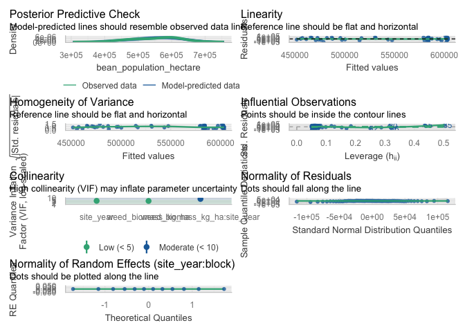<!-- -->

``` r
# Simple linear model diagnostics (population)
check_model(lin_mod_pop)
```

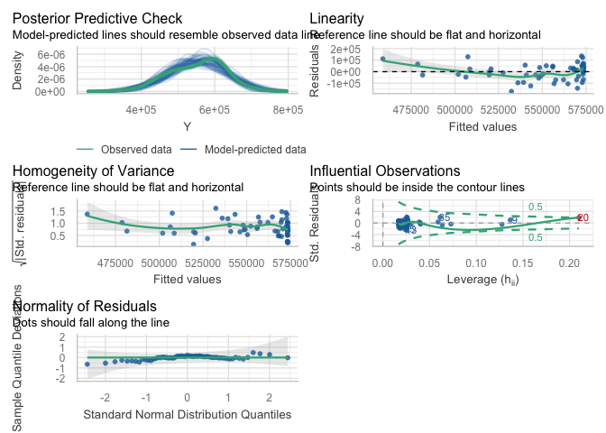<!-- -->

``` r
# Optional specific checks for the population linear model
check_heteroscedasticity(lin_mod_pop)
```

    ## OK: Error variance appears to be homoscedastic (p = 0.379).

``` r
check_normality(lin_mod_pop)
```

    ## OK: residuals appear as normally distributed (p = 0.313).

``` r
check_outliers(lin_mod_pop)
```

    ## OK: No outliers detected.
    ## - Based on the following method and threshold: cook (0.701).
    ## - For variable: (Whole model)

#### Visualisation

``` r
ggplot(dat_pop, aes(x = B, y = Y)) +
  # points: always black
  geom_point(
    color = "black",
    alpha = 1
  ) +
  # LOESS: uses palette color and appears in legend
  geom_smooth(
    aes(color = "LOESS"),
    method = "loess",
    se = FALSE,
    linewidth = 1,
    linetype = "dashed"
  ) +
  # Linear: always black, not tied to color scale
  stat_function(
    fun = function(x) coef(lin_mod_pop)[1] + coef(lin_mod_pop)[2] * x,
    linewidth = 1,
    color = "black"
  ) +
  # Hyperbolic: uses palette color and appears in legend
  stat_function(
    aes(color = "Hyperbolic"),
    fun = function(x) {
      pars <- coef(hyper_mod_pop)
      pars["Y0"] - (pars["Lmax"] * x) / (pars["K"] + x)
    },
    linewidth = 1,
    linetype = "dotdash"
  ) +
  scale_color_manual(
    name   = NULL,
    breaks = c("LOESS", "Hyperbolic"),
    labels = c(
      "LOESS smooth",
      "Hyperbolic fit"
    ),
    values = c(
      "LOESS"      = line_cols[2],
      "Hyperbolic" = line_cols[4]
    )
  ) +
  # <-- new: y-axis as whole numbers, no scientific notation
  scale_y_continuous(
    labels = scales::label_comma(accuracy = 1)
  ) +
  guides(
    color = guide_legend(
      override.aes = list(
        linetype = c("dashed", "dotdash"),
        shape    = c(NA, NA),
        alpha    = c(1, 1)
      )
    )
  ) +
  labs(
    x = bquote("Total weed biomass (kg ha"^-1*")"),
    y = bquote("Bean population (plants ha"^-1*")"),
    title = "Bean population vs total weed biomass",
    subtitle = "Data (black), LOESS, and linear vs hyperbolic fits"
  ) +
  theme_classic() +
  theme(
    legend.position = "right"
  )
```

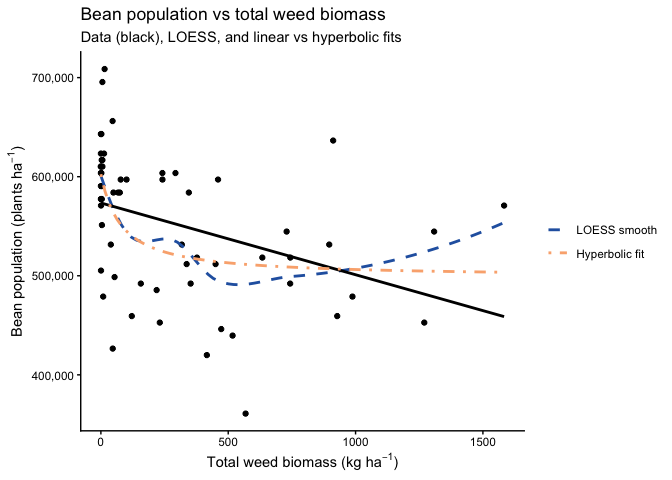<!-- -->

### Seed weight

#### Dataset

``` r
# ----------------------------------------------------------------------
# Model testing: total weed biomass vs 100-seed weight (g)
# ----------------------------------------------------------------------

## Exploratory: regression dataset -------------------------------------

reg_100sw <- weed_biomass_clean |>
  filter(
    !is.na(weed_biomass_kg_ha),
    !is.na(seed_weight),   # <-- replace with your actual 100-seed weight column
    !is.na(site_year),
    !is.na(block)
  )

# Quick structure check (optional)
str(reg_100sw[, c("site_year", "block",
                  "weed_biomass_kg_ha", "seed_weight")])
```

    ## tibble [60 × 4] (S3: tbl_df/tbl/data.frame)
    ##  $ site_year         : Factor w/ 3 levels "2024.field O2 east",..: 3 3 3 3 3 3 3 3 3 3 ...
    ##  $ block             : Factor w/ 4 levels "1","2","3","4": 1 1 1 1 1 2 2 2 2 2 ...
    ##  $ weed_biomass_kg_ha: num [1:60] 1270 634 157 928 450 ...
    ##  $ seed_weight       : num [1:60] 17.1 17.5 16.8 16.1 17 ...

#### Mixed model selection (site-year effects)

``` r
### Mixed model selection (site-year effects): 100-seed weight ----------
## Mixed model selection: additive vs interaction ----------------------

options(contrasts = c("contr.sum", "contr.poly"))

# 1) Candidate mixed models --------------------------------------------

# Additive: common slope across site-year (site_year as fixed effect)
sw100_add <- lmer(
  seed_weight ~ weed_biomass_kg_ha + site_year +
    (1 | site_year:block),
  data = reg_100sw
)

# Interaction: slope allowed to differ by site-year
sw100_int <- lmer(
  seed_weight ~ weed_biomass_kg_ha * site_year +
    (1 | site_year:block),
  data = reg_100sw
)

# 2) Likelihood ratio test ---------------------------------------------

lrt_sw100   <- anova(sw100_add, sw100_int)
p_int_sw100 <- lrt_sw100$`Pr(>Chisq)`[2]

# 3) AIC table with LRT p-value only for interaction model -------------

aic_sw100 <- tibble(
  model = c(
    "Additive: weed_biomass_kg_ha + site_year",
    "Interaction: weed_biomass_kg_ha * site_year"
  ),
  AIC = c(AIC(sw100_add), AIC(sw100_int))
) |>
  mutate(
    deltaAIC = AIC - min(AIC),
    `LRT p (interaction vs additive)` = c(NA_real_, p_int_sw100)
  )

# Selection rule: prefer simpler model unless interaction is clearly better
keep_interaction_sw100 <- (p_int_sw100 < 0.05) &&
  (aic_sw100$deltaAIC[aic_sw100$model ==
                        "Interaction: weed_biomass_kg_ha * site_year"] < 2)

sw100_mod_best <- if (keep_interaction_sw100) sw100_int else sw100_add

chosen_model_name_sw100 <- if (keep_interaction_sw100) {
  "Interaction: weed_biomass_kg_ha * site_year"
} else {
  "Additive: weed_biomass_kg_ha + site_year"
}

aic_sw100_out <- aic_sw100 |>
  mutate(
    Selected = if_else(model == chosen_model_name_sw100, "Yes", "")
  )

aic_sw100_out |>
  kable(
    digits  = 2,
    caption = "100-seed weight vs total weed biomass: model comparison (additive vs interaction). LRT p-value compares the interaction model vs the additive model."
  ) |>
  kable_styling(full_width = FALSE, bootstrap_options = c("striped", "hover"))
```

<table class="table table-striped table-hover" style="color: black; width: auto !important; margin-left: auto; margin-right: auto;">

<caption>

100-seed weight vs total weed biomass: model comparison (additive vs
interaction). LRT p-value compares the interaction model vs the additive
model.
</caption>

<thead>

<tr>

<th style="text-align:left;">

model
</th>

<th style="text-align:right;">

AIC
</th>

<th style="text-align:right;">

deltaAIC
</th>

<th style="text-align:right;">

LRT p (interaction vs additive)
</th>

<th style="text-align:left;">

Selected
</th>

</tr>

</thead>

<tbody>

<tr>

<td style="text-align:left;">

Additive: weed_biomass_kg_ha + site_year
</td>

<td style="text-align:right;">

132.93
</td>

<td style="text-align:right;">

0.00
</td>

<td style="text-align:right;">

NA
</td>

<td style="text-align:left;">

Yes
</td>

</tr>

<tr>

<td style="text-align:left;">

Interaction: weed_biomass_kg_ha \* site_year
</td>

<td style="text-align:right;">

162.16
</td>

<td style="text-align:right;">

29.23
</td>

<td style="text-align:right;">

0.32
</td>

<td style="text-align:left;">

</td>

</tr>

</tbody>

</table>

``` r
cat(
  "\nSelected model for 100-seed weight vs total weed biomass:\n  ",
  chosen_model_name_sw100,
  sprintf("  [LRT p (interaction) = %.3f]\n", p_int_sw100)
)
```

    ## 
    ## Selected model for 100-seed weight vs total weed biomass:
    ##    Additive: weed_biomass_kg_ha + site_year   [LRT p (interaction) = 0.318]

#### Slope summary via emtrends

``` r
### Slope summary: 100-seed weight vs total weed biomass ---------------

if (chosen_model_name_sw100 == "Additive: weed_biomass_kg_ha + site_year") {
  
  # One common slope across site-years
  emm_slope_sw100 <- emtrends(
    sw100_mod_best, ~ 1,
    var = "weed_biomass_kg_ha"
  )
  
  emm_slope_sw100_df <- summary(emm_slope_sw100, infer = c(TRUE, TRUE)) |>
    as_tibble()
  
  trend_col_sw100 <- get_trend_col(emm_slope_sw100_df, "weed_biomass_kg_ha")
  stat_col_sw100  <- get_stat_col(emm_slope_sw100_df)
  
  has_df_sw100 <- "df" %in% names(emm_slope_sw100_df)
  has_p_sw100  <- "p.value" %in% names(emm_slope_sw100_df)
  
  slope_tbl_sw100 <- emm_slope_sw100_df |>
    transmute(
      Scope                              = "Pooled across site-years",
      slope_g_per_kgweed                 = .data[[trend_col_sw100]],
      slope_g_per_100kgweed              = .data[[trend_col_sw100]] * 100,
      SE,
      df         = if (has_df_sw100) df else NA_real_,
      lower_95CL = lower.CL,
      upper_95CL = upper.CL,
      stat       = if (!is.na(stat_col_sw100)) .data[[stat_col_sw100]] else NA_real_,
      p_value    = if (has_p_sw100) .data[["p.value"]] else NA_real_
    )
  
} else {
  
  # Slopes vary by site-year
  emm_slope_sw100 <- emtrends(
    sw100_mod_best, ~ site_year,
    var = "weed_biomass_kg_ha"
  )
  
  emm_slope_sw100_df <- summary(emm_slope_sw100, infer = c(TRUE, TRUE)) |>
    as_tibble()
  
  trend_col_sw100 <- get_trend_col(emm_slope_sw100_df, "weed_biomass_kg_ha")
  stat_col_sw100  <- get_stat_col(emm_slope_sw100_df)
  
  has_df_sw100 <- "df" %in% names(emm_slope_sw100_df)
  has_p_sw100  <- "p.value" %in% names(emm_slope_sw100_df)
  
  slope_tbl_sw100 <- emm_slope_sw100_df |>
    transmute(
      Scope                              = as.character(site_year),
      slope_g_per_kgweed                 = .data[[trend_col_sw100]],
      slope_g_per_100kgweed              = .data[[trend_col_sw100]] * 100,
      SE,
      df         = if (has_df_sw100) df else NA_real_,
      lower_95CL = lower.CL,
      upper_95CL = upper.CL,
      stat       = if (!is.na(stat_col_sw100)) .data[[stat_col_sw100]] else NA_real_,
      p_value    = if (has_p_sw100) .data[["p.value"]] else NA_real_
    )
}

slope_tbl_sw100 |>
  mutate(
    across(
      c(slope_g_per_kgweed,
        slope_g_per_100kgweed,
        SE, lower_95CL, upper_95CL),
      ~ round(.x, 3)
    )
  ) |>
  kable(
    caption = "Slopes of 100-seed weight vs total weed biomass (kg ha^-1): mixed-model emtrends",
    col.names = c(
      "Scope (site-year / pooled)",
      "Slope (g per kg weed ha^-1)",
      "Slope (g per 100 kg weed ha^-1)",
      "SE", "df",
      "Lower 95% CL", "Upper 95% CL",
      "Test statistic", "p-value"
    )
  ) |>
  kable_styling(full_width = FALSE, bootstrap_options = c("striped", "hover"))
```

<table class="table table-striped table-hover" style="color: black; width: auto !important; margin-left: auto; margin-right: auto;">

<caption>

Slopes of 100-seed weight vs total weed biomass (kg ha^-1): mixed-model
emtrends
</caption>

<thead>

<tr>

<th style="text-align:left;">

Scope (site-year / pooled)
</th>

<th style="text-align:right;">

Slope (g per kg weed ha^-1)
</th>

<th style="text-align:right;">

Slope (g per 100 kg weed ha^-1)
</th>

<th style="text-align:right;">

SE
</th>

<th style="text-align:right;">

df
</th>

<th style="text-align:right;">

Lower 95% CL
</th>

<th style="text-align:right;">

Upper 95% CL
</th>

<th style="text-align:right;">

Test statistic
</th>

<th style="text-align:right;">

p-value
</th>

</tr>

</thead>

<tbody>

<tr>

<td style="text-align:left;">

Pooled across site-years
</td>

<td style="text-align:right;">

0
</td>

<td style="text-align:right;">

-0.001
</td>

<td style="text-align:right;">

0
</td>

<td style="text-align:right;">

54.89564
</td>

<td style="text-align:right;">

-0.001
</td>

<td style="text-align:right;">

0.001
</td>

<td style="text-align:right;">

-0.0455428
</td>

<td style="text-align:right;">

0.96384
</td>

</tr>

</tbody>

</table>

#### Linear vs rectangular hyperbolic response

``` r
## Linear vs rectangular hyperbolic response of 100-seed weight to weed biomass ----

# Use the same plot-level data (no random effects here, just a marginal comparison)
dat_sw100 <- reg_100sw |>
  select(weed_biomass_kg_ha, seed_weight) |>
  rename(
    B = weed_biomass_kg_ha,
    Y = seed_weight
  )

# Quick sanity check (optional)
names(dat_sw100)    # should be "B" and "Y"
```

    ## [1] "B" "Y"

``` r
# 1) Linear model -------------------------------------------------------

lin_mod_sw100 <- lm(Y ~ B, data = dat_sw100)

# 2) Rectangular hyperbolic model:
#    Y = Y0 - (Lmax * B) / (K + B)
#    Y0   = weed-free 100-seed weight (g)
#    Lmax = maximum loss in 100-seed weight
#    K    = weed biomass at half of Lmax

start_vals_sw100 <- list(
  Y0   = max(dat_sw100$Y, na.rm = TRUE),  # near weed-free 100-seed weight
  Lmax = max(dat_sw100$Y, na.rm = TRUE) - min(dat_sw100$Y, na.rm = TRUE),
  K    = median(dat_sw100$B[dat_sw100$B > 0], na.rm = TRUE)
)

hyper_mod_sw100 <- nls(
  Y ~ Y0 - (Lmax * B) / (K + B),
  data  = dat_sw100,
  start = start_vals_sw100
)

summary(hyper_mod_sw100)
```

    ## 
    ## Formula: Y ~ Y0 - (Lmax * B)/(K + B)
    ## 
    ## Parameters:
    ##      Estimate Std. Error t value Pr(>|t|)    
    ## Y0    18.3199     0.1519 120.625   <2e-16 ***
    ## Lmax   1.5376     0.7144   2.152   0.0356 *  
    ## K    408.8476   501.8235   0.815   0.4186    
    ## ---
    ## Signif. codes:  0 '***' 0.001 '**' 0.01 '*' 0.05 '.' 0.1 ' ' 1
    ## 
    ## Residual standard error: 0.7272 on 57 degrees of freedom
    ## 
    ## Number of iterations to convergence: 6 
    ## Achieved convergence tolerance: 1.722e-06

``` r
# 3) AIC and R2 comparison -----------------------------------------------

# AIC
aic_lin_sw100   <- AIC(lin_mod_sw100)
aic_hyper_sw100 <- AIC(hyper_mod_sw100)

# R2 for linear model
gl_lin_sw100 <- broom::glance(lin_mod_sw100)
R2_lin_sw100     <- gl_lin_sw100$r.squared
R2_lin_sw100_adj <- gl_lin_sw100$adj.r.squared

# R2 for nls (hyperbolic)
get_r2_nls <- function(mod) {
  y_hat <- fitted(mod)
  res   <- resid(mod)
  y     <- y_hat + res  # reconstruct observed response
  
  rss <- sum(res^2)
  tss <- sum((y - mean(y))^2)
  1 - rss / tss
}

R2_hyper_sw100 <- get_r2_nls(hyper_mod_sw100)

# Residual df (more meaningful than n)
df_lin_sw100   <- df.residual(lin_mod_sw100)
df_hyper_sw100 <- df.residual(hyper_mod_sw100)

mod_comp_sw100 <- tibble(
  model = c("Linear", "Hyperbolic"),
  df    = c(df_lin_sw100, df_hyper_sw100),
  AIC   = c(aic_lin_sw100, aic_hyper_sw100),
  R2    = c(R2_lin_sw100, R2_hyper_sw100)
)

mod_comp_sw100 |>
  kable(
    digits  = 3,
    caption = "Model comparison for 100-seed weight vs total weed biomass: linear vs rectangular hyperbolic"
  ) |>
  kable_styling(full_width = FALSE, bootstrap_options = c("striped", "hover"))
```

<table class="table table-striped table-hover" style="color: black; width: auto !important; margin-left: auto; margin-right: auto;">

<caption>

Model comparison for 100-seed weight vs total weed biomass: linear vs
rectangular hyperbolic
</caption>

<thead>

<tr>

<th style="text-align:left;">

model
</th>

<th style="text-align:right;">

df
</th>

<th style="text-align:right;">

AIC
</th>

<th style="text-align:right;">

R2
</th>

</tr>

</thead>

<tbody>

<tr>

<td style="text-align:left;">

Linear
</td>

<td style="text-align:right;">

58
</td>

<td style="text-align:right;">

138.011
</td>

<td style="text-align:right;">

0.217
</td>

</tr>

<tr>

<td style="text-align:left;">

Hyperbolic
</td>

<td style="text-align:right;">

57
</td>

<td style="text-align:right;">

136.965
</td>

<td style="text-align:right;">

0.255
</td>

</tr>

</tbody>

</table>

#### Diagnostics

``` r
# --- 100-seed weight vs weed biomass ---------------------------------

# Mixed model diagnostics (chosen 100-seed weight model)
check_model(sw100_mod_best)
```

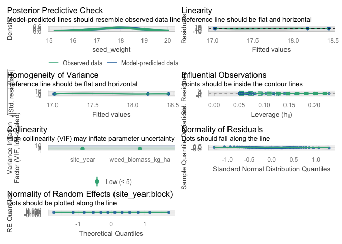<!-- -->

``` r
# Simple linear model diagnostics (100-seed weight)
check_model(lin_mod_sw100)
```

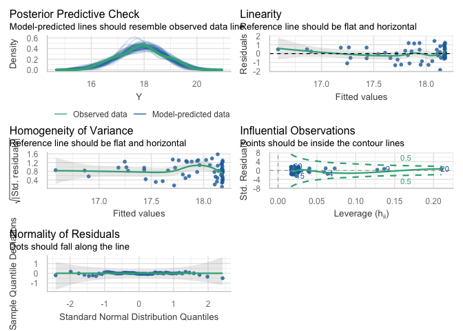<!-- -->

``` r
# Optional specific checks for the 100-seed weight linear model
check_heteroscedasticity(lin_mod_sw100)
```

    ## OK: Error variance appears to be homoscedastic (p = 0.673).

``` r
check_normality(lin_mod_sw100)
```

    ## OK: residuals appear as normally distributed (p = 0.620).

``` r
check_outliers(lin_mod_sw100)
```

    ## OK: No outliers detected.
    ## - Based on the following method and threshold: cook (0.701).
    ## - For variable: (Whole model)

#### Visualisation

``` r
ggplot(dat_sw100, aes(x = B, y = Y)) +
  # points: always black
  geom_point(
    color = "black",
    alpha = 1
  ) +
  # LOESS: uses palette color and appears in legend
  geom_smooth(
    aes(color = "LOESS"),
    method = "loess",
    se = FALSE,
    linewidth = 1,
    linetype = "dashed"
  ) +
  # Linear: always black, not tied to color scale
  stat_function(
    fun = function(x) coef(lin_mod_sw100)[1] + coef(lin_mod_sw100)[2] * x,
    linewidth = 1,
    color = "black"
  ) +
  # Hyperbolic: uses palette color and appears in legend
  stat_function(
    aes(color = "Hyperbolic"),
    fun = function(x) {
      pars <- coef(hyper_mod_sw100)
      pars["Y0"] - (pars["Lmax"] * x) / (pars["K"] + x)
    },
    linewidth = 1,
    linetype = "dotdash"
  ) +
  scale_color_manual(
    name   = NULL,
    breaks = c("LOESS", "Hyperbolic"),
    labels = c(
      "LOESS smooth",
      "Hyperbolic fit"
    ),
    values = c(
      "LOESS"      = line_cols[2],
      "Hyperbolic" = line_cols[4]
    )
  ) +
  guides(
    color = guide_legend(
      override.aes = list(
        linetype = c("dashed", "dotdash"),
        shape    = c(NA, NA),
        alpha    = c(1, 1)
      )
    )
  ) +
  labs(
    x = bquote("Total weed biomass (kg ha"^-1*")"),
    y = "100-seed weight (g)",
    title = "100-seed weight vs total weed biomass",
    subtitle = "Data (black), LOESS, and linear vs hyperbolic fits"
  ) +
  theme_classic() +
  theme(
    legend.position = "right"
  )
```

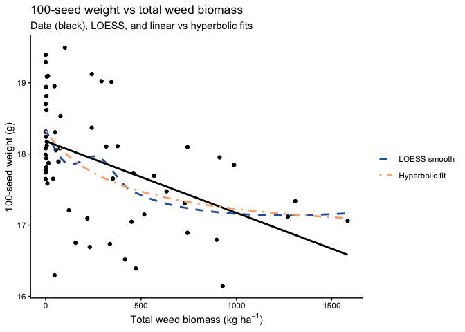<!-- -->

## In-row weed biomass

### Yield

#### Dataset

``` r
# ----------------------------------------------------------------------
# Model testing: in-row weed biomass vs adjusted soybean yield (kg ha^-1)
# ----------------------------------------------------------------------

## Exploratory: regression dataset -------------------------------------

reg_yield_inrow <- weed_biomass_clean |>
  filter(
    !is.na(inrow_weed_biomass_kg_ha),
    !is.na(bean_yield_adj_kg_ha),
    !is.na(site_year),
    !is.na(block)
  )

# Quick structure check (optional)
str(reg_yield_inrow[, c("site_year", "block",
                        "inrow_weed_biomass_kg_ha",
                        "bean_yield_adj_kg_ha")])
```

    ## tibble [60 × 4] (S3: tbl_df/tbl/data.frame)
    ##  $ site_year               : Factor w/ 3 levels "2024.field O2 east",..: 3 3 3 3 3 3 3 3 3 3 ...
    ##  $ block                   : Factor w/ 4 levels "1","2","3","4": 1 1 1 1 1 2 2 2 2 2 ...
    ##  $ inrow_weed_biomass_kg_ha: num [1:60] 380 619.5 19 13.2 9.9 ...
    ##  $ bean_yield_adj_kg_ha    : num [1:60] 3145 4263 3391 3110 3571 ...

#### Mixed model selection (site-year effects)

``` r
## Mixed model selection: in-row weed biomass vs adjusted yield ---------

options(contrasts = c("contr.sum", "contr.poly"))

# 1) Candidate mixed models --------------------------------------------

# Additive: common slope across site-year (site_year as fixed effect)
yield_inrow_add <- lmer(
  bean_yield_adj_kg_ha ~ inrow_weed_biomass_kg_ha + site_year +
    (1 | site_year:block),
  data = reg_yield_inrow
)

# Interaction: slope allowed to differ by site-year
yield_inrow_int <- lmer(
  bean_yield_adj_kg_ha ~ inrow_weed_biomass_kg_ha * site_year +
    (1 | site_year:block),
  data = reg_yield_inrow
)

# 2) Likelihood ratio test ---------------------------------------------

lrt_yield_inrow   <- anova(yield_inrow_add, yield_inrow_int)
p_int_yield_inrow <- lrt_yield_inrow$`Pr(>Chisq)`[2]

# 3) AIC table with LRT p-value only for interaction model -------------

aic_yield_inrow <- tibble(
  model = c(
    "Additive: inrow_weed_biomass_kg_ha + site_year",
    "Interaction: inrow_weed_biomass_kg_ha * site_year"
  ),
  AIC = c(AIC(yield_inrow_add), AIC(yield_inrow_int))
) |>
  mutate(
    deltaAIC = AIC - min(AIC),
    `LRT p (interaction vs additive)` = c(NA_real_, p_int_yield_inrow)
  )

# Selection rule: prefer simpler model unless interaction is clearly better
keep_interaction_inrow <- (p_int_yield_inrow < 0.05) &&
  (aic_yield_inrow$deltaAIC[
    aic_yield_inrow$model ==
      "Interaction: inrow_weed_biomass_kg_ha * site_year"
  ] < 2)

yield_inrow_mod_best <- if (keep_interaction_inrow) yield_inrow_int else yield_inrow_add

chosen_model_name_yield_inrow <- if (keep_interaction_inrow) {
  "Interaction: inrow_weed_biomass_kg_ha * site_year"
} else {
  "Additive: inrow_weed_biomass_kg_ha + site_year"
}

aic_yield_inrow_out <- aic_yield_inrow |>
  mutate(
    Selected = if_else(model == chosen_model_name_yield_inrow, "Yes", "")
  )

aic_yield_inrow_out |>
  kable(
    digits  = 2,
    caption = "Adjusted soybean yield vs in-row weed biomass: model comparison (additive vs interaction). LRT p-value compares the interaction model vs the additive model."
  ) |>
  kable_styling(full_width = FALSE, bootstrap_options = c("striped", "hover"))
```

<table class="table table-striped table-hover" style="color: black; width: auto !important; margin-left: auto; margin-right: auto;">

<caption>

Adjusted soybean yield vs in-row weed biomass: model comparison
(additive vs interaction). LRT p-value compares the interaction model vs
the additive model.
</caption>

<thead>

<tr>

<th style="text-align:left;">

model
</th>

<th style="text-align:right;">

AIC
</th>

<th style="text-align:right;">

deltaAIC
</th>

<th style="text-align:right;">

LRT p (interaction vs additive)
</th>

<th style="text-align:left;">

Selected
</th>

</tr>

</thead>

<tbody>

<tr>

<td style="text-align:left;">

Additive: inrow_weed_biomass_kg_ha + site_year
</td>

<td style="text-align:right;">

883.34
</td>

<td style="text-align:right;">

8.31
</td>

<td style="text-align:right;">

NA
</td>

<td style="text-align:left;">

</td>

</tr>

<tr>

<td style="text-align:left;">

Interaction: inrow_weed_biomass_kg_ha \* site_year
</td>

<td style="text-align:right;">

875.03
</td>

<td style="text-align:right;">

0.00
</td>

<td style="text-align:right;">

0.01
</td>

<td style="text-align:left;">

Yes
</td>

</tr>

</tbody>

</table>

``` r
cat(
  "\nSelected model for adjusted soybean yield vs in-row weed biomass:\n  ",
  chosen_model_name_yield_inrow,
  sprintf("  [LRT p (interaction) = %.3f]\n", p_int_yield_inrow)
)
```

    ## 
    ## Selected model for adjusted soybean yield vs in-row weed biomass:
    ##    Interaction: inrow_weed_biomass_kg_ha * site_year   [LRT p (interaction) = 0.009]

#### Slope summary via emtrends

``` r
## Slope summary: emtrends for yield vs in-row weed biomass ------------

if (chosen_model_name_yield_inrow ==
    "Additive: inrow_weed_biomass_kg_ha + site_year") {
  
  # One common slope across site-years
  emm_slope_inrow <- emtrends(
    yield_inrow_mod_best, ~ 1,
    var = "inrow_weed_biomass_kg_ha"
  )
  
  emm_slope_inrow_df <- summary(emm_slope_inrow, infer = c(TRUE, TRUE)) |>
    as_tibble()
  
  trend_col_inrow <- get_trend_col(
    emm_slope_inrow_df,
    "inrow_weed_biomass_kg_ha"
  )
  stat_col_inrow  <- get_stat_col(emm_slope_inrow_df)
  
  has_df_inrow <- "df" %in% names(emm_slope_inrow_df)
  has_p_inrow  <- "p.value" %in% names(emm_slope_inrow_df)
  
  slope_tbl_inrow <- emm_slope_inrow_df |>
    transmute(
      Scope              = "Pooled across site-years",
      slope_kg_per_kg    = .data[[trend_col_inrow]],
      slope_kg_per_100kg = .data[[trend_col_inrow]] * 100,
      SE,
      df         = if (has_df_inrow) df else NA_real_,
      lower_95CL = lower.CL,
      upper_95CL = upper.CL,
      stat       = if (!is.na(stat_col_inrow)) .data[[stat_col_inrow]] else NA_real_,
      p_value    = if (has_p_inrow) .data[["p.value"]] else NA_real_
    )
  
} else {
  
  # Slopes vary by site-year
  emm_slope_inrow <- emtrends(
    yield_inrow_mod_best, ~ site_year,
    var = "inrow_weed_biomass_kg_ha"
  )
  
  emm_slope_inrow_df <- summary(emm_slope_inrow, infer = c(TRUE, TRUE)) |>
    as_tibble()
  
  trend_col_inrow <- get_trend_col(
    emm_slope_inrow_df,
    "inrow_weed_biomass_kg_ha"
  )
  stat_col_inrow  <- get_stat_col(emm_slope_inrow_df)
  
  has_df_inrow <- "df" %in% names(emm_slope_inrow_df)
  has_p_inrow  <- "p.value" %in% names(emm_slope_inrow_df)
  
  slope_tbl_inrow <- emm_slope_inrow_df |>
    transmute(
      Scope              = as.character(site_year),
      slope_kg_per_kg    = .data[[trend_col_inrow]],
      slope_kg_per_100kg = .data[[trend_col_inrow]] * 100,
      SE,
      df         = if (has_df_inrow) df else NA_real_,
      lower_95CL = lower.CL,
      upper_95CL = upper.CL,
      stat       = if (!is.na(stat_col_inrow)) .data[[stat_col_inrow]] else NA_real_,
      p_value    = if (has_p_inrow) .data[["p.value"]] else NA_real_
    )
}

slope_tbl_inrow |>
  mutate(
    across(
      c(slope_kg_per_kg, slope_kg_per_100kg,
        SE, lower_95CL, upper_95CL),
      ~ round(.x, 3)
    )
  ) |>
  kable(
    caption = "Slopes of adjusted soybean yield vs in-row weed biomass (kg ha^-1): mixed-model emtrends",
    col.names = c(
      "Scope (site-year / pooled)",
      "Slope (kg yield per kg in-row weed)",
      "Slope (kg yield per 100 kg in-row weed)",
      "SE", "df",
      "Lower 95% CL", "Upper 95% CL",
      "Test statistic", "p-value"
    )
  ) |>
  kable_styling(full_width = FALSE, bootstrap_options = c("striped", "hover"))
```

<table class="table table-striped table-hover" style="color: black; width: auto !important; margin-left: auto; margin-right: auto;">

<caption>

Slopes of adjusted soybean yield vs in-row weed biomass (kg ha^-1):
mixed-model emtrends
</caption>

<thead>

<tr>

<th style="text-align:left;">

Scope (site-year / pooled)
</th>

<th style="text-align:right;">

Slope (kg yield per kg in-row weed)
</th>

<th style="text-align:right;">

Slope (kg yield per 100 kg in-row weed)
</th>

<th style="text-align:right;">

SE
</th>

<th style="text-align:right;">

df
</th>

<th style="text-align:right;">

Lower 95% CL
</th>

<th style="text-align:right;">

Upper 95% CL
</th>

<th style="text-align:right;">

Test statistic
</th>

<th style="text-align:right;">

p-value
</th>

</tr>

</thead>

<tbody>

<tr>

<td style="text-align:left;">

2024.field O2 east
</td>

<td style="text-align:right;">

-5.809
</td>

<td style="text-align:right;">

-580.852
</td>

<td style="text-align:right;">

1.944
</td>

<td style="text-align:right;">

53.08057
</td>

<td style="text-align:right;">

-9.708
</td>

<td style="text-align:right;">

-1.909
</td>

<td style="text-align:right;">

-2.9874260
</td>

<td style="text-align:right;">

0.0042522
</td>

</tr>

<tr>

<td style="text-align:left;">

2024.field O2 west
</td>

<td style="text-align:right;">

-0.739
</td>

<td style="text-align:right;">

-73.855
</td>

<td style="text-align:right;">

1.523
</td>

<td style="text-align:right;">

28.93889
</td>

<td style="text-align:right;">

-3.855
</td>

<td style="text-align:right;">

2.378
</td>

<td style="text-align:right;">

-0.4847899
</td>

<td style="text-align:right;">

0.6314749
</td>

</tr>

<tr>

<td style="text-align:left;">

2023.field v
</td>

<td style="text-align:right;">

-0.050
</td>

<td style="text-align:right;">

-5.010
</td>

<td style="text-align:right;">

0.256
</td>

<td style="text-align:right;">

49.85773
</td>

<td style="text-align:right;">

-0.564
</td>

<td style="text-align:right;">

0.464
</td>

<td style="text-align:right;">

-0.1958008
</td>

<td style="text-align:right;">

0.8455620
</td>

</tr>

</tbody>

</table>

#### Linear vs rectangular hyperbolic response

``` r
## Linear vs rectangular hyperbolic response of yield to in-row weed biomass ----

# Use the same plot-level data (no random effects here, just a marginal comparison)
dat_yield_inrow <- reg_yield_inrow |>
  select(inrow_weed_biomass_kg_ha, bean_yield_adj_kg_ha) |>
  rename(
    B = inrow_weed_biomass_kg_ha,
    Y = bean_yield_adj_kg_ha
  )

# Quick sanity check (optional)
names(dat_yield_inrow)    # should be "B" and "Y"
```

    ## [1] "B" "Y"

``` r
# 1) Linear model -------------------------------------------------------

lin_mod_inrow <- lm(Y ~ B, data = dat_yield_inrow)

# 2) Rectangular hyperbolic model:
#    Y = Y0 - (Lmax * B) / (K + B)
#    Y0   = weed-free yield
#    Lmax = maximum yield loss
#    K    = in-row biomass at half of Lmax

start_vals_inrow <- list(
  Y0   = max(dat_yield_inrow$Y, na.rm = TRUE),  # near weed-free yield
  Lmax = max(dat_yield_inrow$Y, na.rm = TRUE) - min(dat_yield_inrow$Y, na.rm = TRUE),
  K    = median(dat_yield_inrow$B[dat_yield_inrow$B > 0], na.rm = TRUE)
)

hyper_mod_inrow <- nls(
  Y ~ Y0 - (Lmax * B) / (K + B),
  data  = dat_yield_inrow,
  start = start_vals_inrow
)

summary(hyper_mod_inrow)
```

    ## 
    ## Formula: Y ~ Y0 - (Lmax * B)/(K + B)
    ## 
    ## Parameters:
    ##      Estimate Std. Error t value Pr(>|t|)    
    ## Y0    5033.31     116.54  43.188  < 2e-16 ***
    ## Lmax  1041.75     176.15   5.914 1.99e-07 ***
    ## K       11.11       8.27   1.343    0.184    
    ## ---
    ## Signif. codes:  0 '***' 0.001 '**' 0.01 '*' 0.05 '.' 0.1 ' ' 1
    ## 
    ## Residual standard error: 537 on 57 degrees of freedom
    ## 
    ## Number of iterations to convergence: 8 
    ## Achieved convergence tolerance: 3.808e-06

``` r
# 3) AIC and R2 comparison -----------------------------------------------

# AIC
aic_lin_inrow   <- AIC(lin_mod_inrow)
aic_hyper_inrow <- AIC(hyper_mod_inrow)

# R2 for linear model
gl_lin_inrow <- broom::glance(lin_mod_inrow)
R2_lin_inrow     <- gl_lin_inrow$r.squared
R2_lin_inrow_adj <- gl_lin_inrow$adj.r.squared

# R2 for nls (hyperbolic)
get_r2_nls <- function(mod) {
  y_hat <- fitted(mod)
  res   <- resid(mod)
  y     <- y_hat + res  # reconstruct observed response
  
  rss <- sum(res^2)
  tss <- sum((y - mean(y))^2)
  1 - rss / tss
}

R2_hyper_inrow <- get_r2_nls(hyper_mod_inrow)

# Residual df (more meaningful than n)
df_lin_inrow   <- df.residual(lin_mod_inrow)
df_hyper_inrow <- df.residual(hyper_mod_inrow)

mod_comp_inrow <- tibble(
  model = c("Linear", "Hyperbolic"),
  df    = c(df_lin_inrow, df_hyper_inrow),
  AIC   = c(aic_lin_inrow, aic_hyper_inrow),
  R2    = c(R2_lin_inrow, R2_hyper_inrow)
)

mod_comp_inrow |>
  kable(
    digits  = 3,
    caption = "Model comparison for adjusted soybean yield vs in-row weed biomass: linear vs rectangular hyperbolic"
  ) |>
  kable_styling(full_width = FALSE, bootstrap_options = c("striped", "hover"))
```

<table class="table table-striped table-hover" style="color: black; width: auto !important; margin-left: auto; margin-right: auto;">

<caption>

Model comparison for adjusted soybean yield vs in-row weed biomass:
linear vs rectangular hyperbolic
</caption>

<thead>

<tr>

<th style="text-align:left;">

model
</th>

<th style="text-align:right;">

df
</th>

<th style="text-align:right;">

AIC
</th>

<th style="text-align:right;">

R2
</th>

</tr>

</thead>

<tbody>

<tr>

<td style="text-align:left;">

Linear
</td>

<td style="text-align:right;">

58
</td>

<td style="text-align:right;">

942.389
</td>

<td style="text-align:right;">

0.226
</td>

</tr>

<tr>

<td style="text-align:left;">

Hyperbolic
</td>

<td style="text-align:right;">

57
</td>

<td style="text-align:right;">

929.512
</td>

<td style="text-align:right;">

0.396
</td>

</tr>

</tbody>

</table>

#### Diagnostics

``` r
## Diagnostics: yield vs in-row weed biomass ---------------------------

library(performance)

# Mixed model diagnostics (chosen in-row model)
check_model(yield_inrow_mod_best)
```

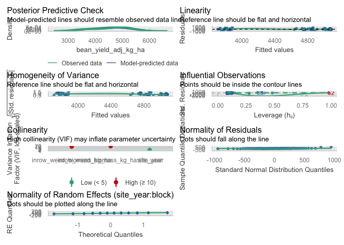<!-- -->

``` r
# Simple linear model diagnostics (in-row)
check_model(lin_mod_inrow)
```

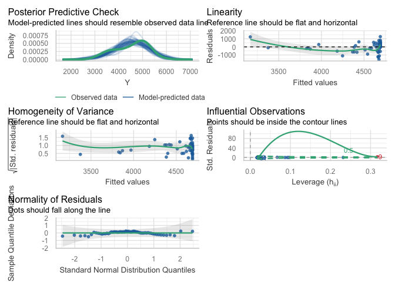<!-- -->

``` r
# Optional specific checks for the linear model
check_heteroscedasticity(lin_mod_inrow)
```

    ## OK: Error variance appears to be homoscedastic (p = 0.651).

``` r
check_normality(lin_mod_inrow)
```

    ## OK: residuals appear as normally distributed (p = 0.170).

``` r
check_outliers(lin_mod_inrow)
```

    ## 1 outlier detected: case 9.
    ## - Based on the following method and threshold: cook (0.701).
    ## - For variable: (Whole model).

#### Visualisation

``` r
ggplot(dat_yield_inrow, aes(x = B, y = Y)) +
  # points: always black
  geom_point(
    color = "black",
    alpha = 1
  ) +
  # LOESS: uses palette color and appears in legend
  geom_smooth(
    aes(color = "LOESS"),
    method = "loess",
    se = FALSE,
    linewidth = 1,
    linetype = "dashed"
  ) +
  # Linear: always black, not tied to color scale
  stat_function(
    fun = function(x) coef(lin_mod_inrow)[1] + coef(lin_mod_inrow)[2] * x,
    linewidth = 1,
    color = "black"
  ) +
  # Hyperbolic: uses palette color and appears in legend
  stat_function(
    aes(color = "Hyperbolic"),
    fun = function(x) {
      pars <- coef(hyper_mod_inrow)
      pars["Y0"] - (pars["Lmax"] * x) / (pars["K"] + x)
    },
    linewidth = 1,
    linetype = "dotdash"
  ) +
  scale_color_manual(
    name   = NULL,
    breaks = c("LOESS", "Hyperbolic"),
    labels = c(
      "LOESS smooth",
      "Hyperbolic fit"
    ),
    values = c(
      "LOESS"      = line_cols[2],
      "Hyperbolic" = line_cols[4]
    )
  ) +
  guides(
    color = guide_legend(
      override.aes = list(
        linetype = c("dashed", "dotdash"),
        shape    = c(NA, NA),
        alpha    = c(1, 1)
      )
    )
  ) +
  labs(
    x = bquote("In-row weed biomass (kg ha"^-1*")"),
    y = bquote("Adjusted soybean yield (kg ha"^-1*")"),
    title = "Yield vs in-row weed biomass",
    subtitle = "Data (black), LOESS, and linear vs hyperbolic fits"
  ) +
  theme_classic() +
  theme(
    legend.position = "right"
  )
```

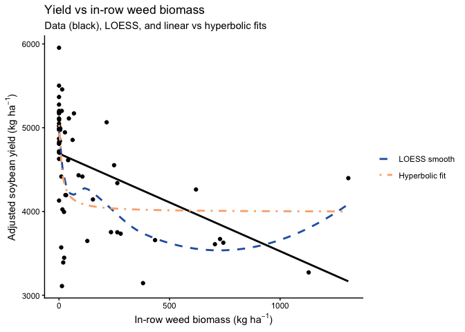<!-- -->

### Biomass

#### Dataset

``` r
# ----------------------------------------------------------------------
# Model testing: in-row weed biomass vs soybean biomass (kg ha^-1)
# ----------------------------------------------------------------------

## Exploratory: regression dataset -------------------------------------

reg_biomass_inrow <- weed_biomass_clean |>
  filter(
    !is.na(inrow_weed_biomass_kg_ha),
    !is.na(bean_biomass_kg_ha),
    !is.na(site_year),
    !is.na(block)
  )

# Quick structure check (optional)
str(reg_biomass_inrow[, c("site_year", "block",
                          "inrow_weed_biomass_kg_ha",
                          "bean_biomass_kg_ha")])
```

    ## tibble [60 × 4] (S3: tbl_df/tbl/data.frame)
    ##  $ site_year               : Factor w/ 3 levels "2024.field O2 east",..: 3 3 3 3 3 3 3 3 3 3 ...
    ##  $ block                   : Factor w/ 4 levels "1","2","3","4": 1 1 1 1 1 2 2 2 2 2 ...
    ##  $ inrow_weed_biomass_kg_ha: num [1:60] 380 619.5 19 13.2 9.9 ...
    ##  $ bean_biomass_kg_ha      : num [1:60] 4475 5349 4358 4154 4606 ...

#### Mixed model selection (site-year effects)

``` r
### Mixed model selection (site-year effects): soybean biomass, in-row ---
## Mixed model selection: additive vs interaction ----------------------

options(contrasts = c("contr.sum", "contr.poly"))

# 1) Candidate mixed models --------------------------------------------

# Additive: common slope across site-year (site_year as fixed effect)
biomass_inrow_add <- lmer(
  bean_biomass_kg_ha ~ inrow_weed_biomass_kg_ha + site_year +
    (1 | site_year:block),
  data = reg_biomass_inrow
)

# Interaction: slope allowed to differ by site-year
biomass_inrow_int <- lmer(
  bean_biomass_kg_ha ~ inrow_weed_biomass_kg_ha * site_year +
    (1 | site_year:block),
  data = reg_biomass_inrow
)

# 2) Likelihood ratio test ---------------------------------------------

lrt_biomass_inrow   <- anova(biomass_inrow_add, biomass_inrow_int)
p_int_biomass_inrow <- lrt_biomass_inrow$`Pr(>Chisq)`[2]

# 3) AIC table with LRT p-value only for interaction model -------------

aic_biomass_inrow <- tibble(
  model = c(
    "Additive: inrow_weed_biomass_kg_ha + site_year",
    "Interaction: inrow_weed_biomass_kg_ha * site_year"
  ),
  AIC = c(AIC(biomass_inrow_add), AIC(biomass_inrow_int))
) |>
  mutate(
    deltaAIC = AIC - min(AIC),
    `LRT p (interaction vs additive)` = c(NA_real_, p_int_biomass_inrow)
  )

# Selection rule: prefer simpler model unless interaction is clearly better
keep_interaction_biomass_inrow <- (p_int_biomass_inrow < 0.05) &&
  (aic_biomass_inrow$deltaAIC[
    aic_biomass_inrow$model ==
      "Interaction: inrow_weed_biomass_kg_ha * site_year"
  ] < 2)

biomass_inrow_mod_best <- if (keep_interaction_biomass_inrow)
  biomass_inrow_int else biomass_inrow_add

chosen_model_name_biomass_inrow <- if (keep_interaction_biomass_inrow) {
  "Interaction: inrow_weed_biomass_kg_ha * site_year"
} else {
  "Additive: inrow_weed_biomass_kg_ha + site_year"
}

aic_biomass_inrow_out <- aic_biomass_inrow |>
  mutate(
    Selected = if_else(model == chosen_model_name_biomass_inrow, "Yes", "")
  )

aic_biomass_inrow_out |>
  kable(
    digits  = 2,
    caption = "Soybean biomass vs in-row weed biomass: model comparison (additive vs interaction). LRT p-value compares the interaction model vs the additive model."
  ) |>
  kable_styling(full_width = FALSE, bootstrap_options = c("striped", "hover"))
```

<table class="table table-striped table-hover" style="color: black; width: auto !important; margin-left: auto; margin-right: auto;">

<caption>

Soybean biomass vs in-row weed biomass: model comparison (additive vs
interaction). LRT p-value compares the interaction model vs the additive
model.
</caption>

<thead>

<tr>

<th style="text-align:left;">

model
</th>

<th style="text-align:right;">

AIC
</th>

<th style="text-align:right;">

deltaAIC
</th>

<th style="text-align:right;">

LRT p (interaction vs additive)
</th>

<th style="text-align:left;">

Selected
</th>

</tr>

</thead>

<tbody>

<tr>

<td style="text-align:left;">

Additive: inrow_weed_biomass_kg_ha + site_year
</td>

<td style="text-align:right;">

957.21
</td>

<td style="text-align:right;">

7
</td>

<td style="text-align:right;">

NA
</td>

<td style="text-align:left;">

Yes
</td>

</tr>

<tr>

<td style="text-align:left;">

Interaction: inrow_weed_biomass_kg_ha \* site_year
</td>

<td style="text-align:right;">

950.21
</td>

<td style="text-align:right;">

0
</td>

<td style="text-align:right;">

0.08
</td>

<td style="text-align:left;">

</td>

</tr>

</tbody>

</table>

``` r
cat(
  "\nSelected model for soybean biomass vs in-row weed biomass:\n  ",
  chosen_model_name_biomass_inrow,
  sprintf("  [LRT p (interaction) = %.3f]\n", p_int_biomass_inrow)
)
```

    ## 
    ## Selected model for soybean biomass vs in-row weed biomass:
    ##    Additive: inrow_weed_biomass_kg_ha + site_year   [LRT p (interaction) = 0.079]

#### Slope summary via emtrends

``` r
### Slope summary: soybean biomass vs in-row weed biomass ---------------

if (chosen_model_name_biomass_inrow ==
    "Additive: inrow_weed_biomass_kg_ha + site_year") {
  
  # One common slope across site-years
  emm_slope_biomass_inrow <- emtrends(
    biomass_inrow_mod_best, ~ 1,
    var = "inrow_weed_biomass_kg_ha"
  )
  
  emm_slope_biomass_inrow_df <- summary(emm_slope_biomass_inrow,
                                        infer = c(TRUE, TRUE)) |>
    as_tibble()
  
  trend_col_biomass_inrow <- get_trend_col(
    emm_slope_biomass_inrow_df,
    "inrow_weed_biomass_kg_ha"
  )
  stat_col_biomass_inrow  <- get_stat_col(emm_slope_biomass_inrow_df)
  
  has_df_biomass_inrow <- "df" %in% names(emm_slope_biomass_inrow_df)
  has_p_biomass_inrow  <- "p.value" %in% names(emm_slope_biomass_inrow_df)
  
  slope_tbl_biomass_inrow <- emm_slope_biomass_inrow_df |>
    transmute(
      Scope                      = "Pooled across site-years",
      slope_kgbean_per_kgweed    = .data[[trend_col_biomass_inrow]],
      slope_kgbean_per_100kgweed = .data[[trend_col_biomass_inrow]] * 100,
      SE,
      df         = if (has_df_biomass_inrow) df else NA_real_,
      lower_95CL = lower.CL,
      upper_95CL = upper.CL,
      stat       = if (!is.na(stat_col_biomass_inrow))
        .data[[stat_col_biomass_inrow]] else NA_real_,
      p_value    = if (has_p_biomass_inrow) .data[["p.value"]] else NA_real_
    )
  
} else {
  
  # Slopes vary by site-year
  emm_slope_biomass_inrow <- emtrends(
    biomass_inrow_mod_best, ~ site_year,
    var = "inrow_weed_biomass_kg_ha"
  )
  
  emm_slope_biomass_inrow_df <- summary(emm_slope_biomass_inrow,
                                        infer = c(TRUE, TRUE)) |>
    as_tibble()
  
  trend_col_biomass_inrow <- get_trend_col(
    emm_slope_biomass_inrow_df,
    "inrow_weed_biomass_kg_ha"
  )
  stat_col_biomass_inrow  <- get_stat_col(emm_slope_biomass_inrow_df)
  
  has_df_biomass_inrow <- "df" %in% names(emm_slope_biomass_inrow_df)
  has_p_biomass_inrow  <- "p.value" %in% names(emm_slope_biomass_inrow_df)
  
  slope_tbl_biomass_inrow <- emm_slope_biomass_inrow_df |>
    transmute(
      Scope                      = as.character(site_year),
      slope_kgbean_per_kgweed    = .data[[trend_col_biomass_inrow]],
      slope_kgbean_per_100kgweed = .data[[trend_col_biomass_inrow]] * 100,
      SE,
      df         = if (has_df_biomass_inrow) df else NA_real_,
      lower_95CL = lower.CL,
      upper_95CL = upper.CL,
      stat       = if (!is.na(stat_col_biomass_inrow))
        .data[[stat_col_biomass_inrow]] else NA_real_,
      p_value    = if (has_p_biomass_inrow) .data[["p.value"]] else NA_real_
    )
}

slope_tbl_biomass_inrow |>
  mutate(
    across(
      c(slope_kgbean_per_kgweed,
        slope_kgbean_per_100kgweed,
        SE, lower_95CL, upper_95CL),
      ~ round(.x, 3)
    )
  ) |>
  kable(
    caption = "Slopes of soybean biomass vs in-row weed biomass (kg ha^-1): mixed-model emtrends",
    col.names = c(
      "Scope (site-year / pooled)",
      "Slope (kg bean per kg in-row weed)",
      "Slope (kg bean per 100 kg in-row weed)",
      "SE", "df",
      "Lower 95% CL", "Upper 95% CL",
      "Test statistic", "p-value"
    )
  ) |>
  kable_styling(full_width = FALSE, bootstrap_options = c("striped", "hover"))
```

<table class="table table-striped table-hover" style="color: black; width: auto !important; margin-left: auto; margin-right: auto;">

<caption>

Slopes of soybean biomass vs in-row weed biomass (kg ha^-1): mixed-model
emtrends
</caption>

<thead>

<tr>

<th style="text-align:left;">

Scope (site-year / pooled)
</th>

<th style="text-align:right;">

Slope (kg bean per kg in-row weed)
</th>

<th style="text-align:right;">

Slope (kg bean per 100 kg in-row weed)
</th>

<th style="text-align:right;">

SE
</th>

<th style="text-align:right;">

df
</th>

<th style="text-align:right;">

Lower 95% CL
</th>

<th style="text-align:right;">

Upper 95% CL
</th>

<th style="text-align:right;">

Test statistic
</th>

<th style="text-align:right;">

p-value
</th>

</tr>

</thead>

<tbody>

<tr>

<td style="text-align:left;">

Pooled across site-years
</td>

<td style="text-align:right;">

0.357
</td>

<td style="text-align:right;">

35.74
</td>

<td style="text-align:right;">

0.518
</td>

<td style="text-align:right;">

53.17397
</td>

<td style="text-align:right;">

-0.681
</td>

<td style="text-align:right;">

1.396
</td>

<td style="text-align:right;">

0.6901408
</td>

<td style="text-align:right;">

0.493107
</td>

</tr>

</tbody>

</table>

#### Linear vs rectangular hyperbolic response

``` r
## Linear vs rectangular hyperbolic response of soybean biomass to in-row weed biomass ----

# Use the same plot-level data (no random effects here, just a marginal comparison)
dat_biomass_inrow <- reg_biomass_inrow |>
  select(inrow_weed_biomass_kg_ha, bean_biomass_kg_ha) |>
  rename(
    B = inrow_weed_biomass_kg_ha,
    Y = bean_biomass_kg_ha
  )

# Quick sanity check (optional)
names(dat_biomass_inrow)    # should be "B" and "Y"
```

    ## [1] "B" "Y"

``` r
# 1) Linear model -------------------------------------------------------

lin_mod_biomass_inrow <- lm(Y ~ B, data = dat_biomass_inrow)

# 2) Rectangular hyperbolic model:
#    Y = Y0 - (Lmax * B) / (K + B)
#    Y0   = weed-free soybean biomass
#    Lmax = maximum biomass loss
#    K    = in-row weed biomass at half of Lmax

start_vals_biomass_inrow <- list(
  Y0   = max(dat_biomass_inrow$Y, na.rm = TRUE),  # near weed-free biomass
  Lmax = max(dat_biomass_inrow$Y, na.rm = TRUE) - min(dat_biomass_inrow$Y, na.rm = TRUE),
  K    = median(dat_biomass_inrow$B[dat_biomass_inrow$B > 0], na.rm = TRUE)
)

hyper_mod_biomass_inrow <- nls(
  Y ~ Y0 - (Lmax * B) / (K + B),
  data  = dat_biomass_inrow,
  start = start_vals_biomass_inrow
)

summary(hyper_mod_biomass_inrow)
```

    ## 
    ## Formula: Y ~ Y0 - (Lmax * B)/(K + B)
    ## 
    ## Parameters:
    ##      Estimate Std. Error t value Pr(>|t|)    
    ## Y0    8448.83     321.44  26.284  < 2e-16 ***
    ## Lmax  2761.51     551.26   5.009  5.6e-06 ***
    ## K       26.75      21.87   1.223    0.226    
    ## ---
    ## Signif. codes:  0 '***' 0.001 '**' 0.01 '*' 0.05 '.' 0.1 ' ' 1
    ## 
    ## Residual standard error: 1540 on 57 degrees of freedom
    ## 
    ## Number of iterations to convergence: 10 
    ## Achieved convergence tolerance: 5.305e-06

``` r
# 3) AIC and R2 comparison -----------------------------------------------

# AIC
aic_lin_biomass_inrow   <- AIC(lin_mod_biomass_inrow)
aic_hyper_biomass_inrow <- AIC(hyper_mod_biomass_inrow)

# R2 for linear model
gl_lin_biomass_inrow <- broom::glance(lin_mod_biomass_inrow)
R2_lin_biomass_inrow     <- gl_lin_biomass_inrow$r.squared
R2_lin_biomass_inrow_adj <- gl_lin_biomass_inrow$adj.r.squared

# R2 for nls (hyperbolic)
get_r2_nls <- function(mod) {
  y_hat <- fitted(mod)
  res   <- resid(mod)
  y     <- y_hat + res  # reconstruct observed response
  
  rss <- sum(res^2)
  tss <- sum((y - mean(y))^2)
  1 - rss / tss
}

R2_hyper_biomass_inrow <- get_r2_nls(hyper_mod_biomass_inrow)

# Residual df (more meaningful than n)
df_lin_biomass_inrow   <- df.residual(lin_mod_biomass_inrow)
df_hyper_biomass_inrow <- df.residual(hyper_mod_biomass_inrow)

mod_comp_biomass_inrow <- tibble(
  model = c("Linear", "Hyperbolic"),
  df    = c(df_lin_biomass_inrow, df_hyper_biomass_inrow),
  AIC   = c(aic_lin_biomass_inrow, aic_hyper_biomass_inrow),
  R2    = c(R2_lin_biomass_inrow, R2_hyper_biomass_inrow)
)

mod_comp_biomass_inrow |>
  kable(
    digits  = 3,
    caption = "Model comparison for soybean biomass vs in-row weed biomass: linear vs rectangular hyperbolic"
  ) |>
  kable_styling(full_width = FALSE, bootstrap_options = c("striped", "hover"))
```

<table class="table table-striped table-hover" style="color: black; width: auto !important; margin-left: auto; margin-right: auto;">

<caption>

Model comparison for soybean biomass vs in-row weed biomass: linear vs
rectangular hyperbolic
</caption>

<thead>

<tr>

<th style="text-align:left;">

model
</th>

<th style="text-align:right;">

df
</th>

<th style="text-align:right;">

AIC
</th>

<th style="text-align:right;">

R2
</th>

</tr>

</thead>

<tbody>

<tr>

<td style="text-align:left;">

Linear
</td>

<td style="text-align:right;">

58
</td>

<td style="text-align:right;">

1062.732
</td>

<td style="text-align:right;">

0.226
</td>

</tr>

<tr>

<td style="text-align:left;">

Hyperbolic
</td>

<td style="text-align:right;">

57
</td>

<td style="text-align:right;">

1055.903
</td>

<td style="text-align:right;">

0.332
</td>

</tr>

</tbody>

</table>

#### Diagnostics

``` r
## Diagnostics: soybean biomass vs in-row weed biomass ------------------

# Mixed model diagnostics (chosen in-row biomass model)
check_model(biomass_inrow_mod_best)
```

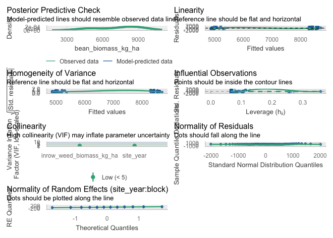<!-- -->

``` r
# Simple linear model diagnostics (biomass ~ in-row biomass)
check_model(lin_mod_biomass_inrow)
```

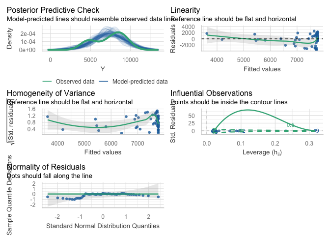<!-- -->

``` r
# Optional specific checks for the biomass linear model
check_heteroscedasticity(lin_mod_biomass_inrow)
```

    ## OK: Error variance appears to be homoscedastic (p = 0.428).

``` r
check_normality(lin_mod_biomass_inrow)
```

    ## Warning: Non-normality of residuals detected (p < .001).

``` r
check_outliers(lin_mod_biomass_inrow)
```

    ## OK: No outliers detected.
    ## - Based on the following method and threshold: cook (0.701).
    ## - For variable: (Whole model)

#### Visualisation

``` r
ggplot(dat_biomass_inrow, aes(x = B, y = Y)) +
  # points: always black
  geom_point(
    color = "black",
    alpha = 1
  ) +
  # LOESS: uses palette color and appears in legend
  geom_smooth(
    aes(color = "LOESS"),
    method = "loess",
    se = FALSE,
    linewidth = 1,
    linetype = "dashed"
  ) +
  # Linear: always black, not tied to color scale
  stat_function(
    fun = function(x) coef(lin_mod_biomass_inrow)[1] +
                      coef(lin_mod_biomass_inrow)[2] * x,
    linewidth = 1,
    color = "black"
  ) +
  # Hyperbolic: uses palette color and appears in legend
  stat_function(
    aes(color = "Hyperbolic"),
    fun = function(x) {
      pars <- coef(hyper_mod_biomass_inrow)
      pars["Y0"] - (pars["Lmax"] * x) / (pars["K"] + x)
    },
    linewidth = 1,
    linetype = "dotdash"
  ) +
  scale_color_manual(
    name   = NULL,
    breaks = c("LOESS", "Hyperbolic"),
    labels = c(
      "LOESS smooth",
      "Hyperbolic fit"
    ),
    values = c(
      "LOESS"      = line_cols[2],
      "Hyperbolic" = line_cols[4]
    )
  ) +
  guides(
    color = guide_legend(
      override.aes = list(
        linetype = c("dashed", "dotdash"),
        shape    = c(NA, NA),
        alpha    = c(1, 1)
      )
    )
  ) +
  labs(
    x = bquote("In-row weed biomass (kg ha"^-1*")"),
    y = bquote("Soybean biomass (kg ha"^-1*")"),
    title = "Soybean biomass vs in-row weed biomass",
    subtitle = "Data (black), LOESS, and linear vs hyperbolic fits"
  ) +
  theme_classic() +
  theme(
    legend.position = "right"
  )
```

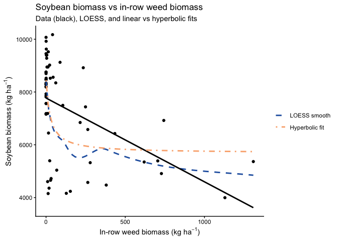<!-- -->

### Population

#### Dataset

``` r
# ----------------------------------------------------------------------
# Model testing: in-row weed biomass vs bean population (plants ha^-1)
# ----------------------------------------------------------------------

## Exploratory: regression dataset -------------------------------------

reg_pop_inrow <- weed_biomass_clean |>
  filter(
    !is.na(inrow_weed_biomass_kg_ha),
    !is.na(bean_population_hectare),
    !is.na(site_year),
    !is.na(block)
  )

# Quick structure check (optional)
str(reg_pop_inrow[, c("site_year", "block",
                      "inrow_weed_biomass_kg_ha",
                      "bean_population_hectare")])
```

    ## tibble [60 × 4] (S3: tbl_df/tbl/data.frame)
    ##  $ site_year               : Factor w/ 3 levels "2024.field O2 east",..: 3 3 3 3 3 3 3 3 3 3 ...
    ##  $ block                   : Factor w/ 4 levels "1","2","3","4": 1 1 1 1 1 2 2 2 2 2 ...
    ##  $ inrow_weed_biomass_kg_ha: num [1:60] 380 619.5 19 13.2 9.9 ...
    ##  $ bean_population_hectare : num [1:60] 452756 518373 492126 459318 511811 ...

#### Mixed model selection (site-year effects)

``` r
### Mixed model selection (site-year effects): bean population, in-row ----
## Mixed model selection: additive vs interaction ----------------------

options(contrasts = c("contr.sum", "contr.poly"))

# 1) Candidate mixed models --------------------------------------------

# Additive: common slope across site-year (site_year as fixed effect)
pop_inrow_add <- lmer(
  bean_population_hectare ~ inrow_weed_biomass_kg_ha + site_year +
    (1 | site_year:block),
  data = reg_pop_inrow
)

# Interaction: slope allowed to differ by site-year
pop_inrow_int <- lmer(
  bean_population_hectare ~ inrow_weed_biomass_kg_ha * site_year +
    (1 | site_year:block),
  data = reg_pop_inrow
)

# 2) Likelihood ratio test ---------------------------------------------

lrt_pop_inrow   <- anova(pop_inrow_add, pop_inrow_int)
p_int_pop_inrow <- lrt_pop_inrow$`Pr(>Chisq)`[2]

# 3) AIC table with LRT p-value only for interaction model -------------

aic_pop_inrow <- tibble(
  model = c(
    "Additive: inrow_weed_biomass_kg_ha + site_year",
    "Interaction: inrow_weed_biomass_kg_ha * site_year"
  ),
  AIC = c(AIC(pop_inrow_add), AIC(pop_inrow_int))
) |>
  mutate(
    deltaAIC = AIC - min(AIC),
    `LRT p (interaction vs additive)` = c(NA_real_, p_int_pop_inrow)
  )

# Selection rule: prefer simpler model unless interaction is clearly better
keep_interaction_pop_inrow <- (p_int_pop_inrow < 0.05) &&
  (aic_pop_inrow$deltaAIC[
    aic_pop_inrow$model ==
      "Interaction: inrow_weed_biomass_kg_ha * site_year"
  ] < 2)

pop_inrow_mod_best <- if (keep_interaction_pop_inrow)
  pop_inrow_int else pop_inrow_add

chosen_model_name_pop_inrow <- if (keep_interaction_pop_inrow) {
  "Interaction: inrow_weed_biomass_kg_ha * site_year"
} else {
  "Additive: inrow_weed_biomass_kg_ha + site_year"
}

aic_pop_inrow_out <- aic_pop_inrow |>
  mutate(
    Selected = if_else(model == chosen_model_name_pop_inrow, "Yes", "")
  )

aic_pop_inrow_out |>
  kable(
    digits  = 2,
    caption = "Bean population vs in-row weed biomass: model comparison (additive vs interaction). LRT p-value compares the interaction model vs the additive model."
  ) |>
  kable_styling(full_width = FALSE, bootstrap_options = c("striped", "hover"))
```

<table class="table table-striped table-hover" style="color: black; width: auto !important; margin-left: auto; margin-right: auto;">

<caption>

Bean population vs in-row weed biomass: model comparison (additive vs
interaction). LRT p-value compares the interaction model vs the additive
model.
</caption>

<thead>

<tr>

<th style="text-align:left;">

model
</th>

<th style="text-align:right;">

AIC
</th>

<th style="text-align:right;">

deltaAIC
</th>

<th style="text-align:right;">

LRT p (interaction vs additive)
</th>

<th style="text-align:left;">

Selected
</th>

</tr>

</thead>

<tbody>

<tr>

<td style="text-align:left;">

Additive: inrow_weed_biomass_kg_ha + site_year
</td>

<td style="text-align:right;">

1410.64
</td>

<td style="text-align:right;">

25
</td>

<td style="text-align:right;">

NA
</td>

<td style="text-align:left;">

</td>

</tr>

<tr>

<td style="text-align:left;">

Interaction: inrow_weed_biomass_kg_ha \* site_year
</td>

<td style="text-align:right;">

1385.64
</td>

<td style="text-align:right;">

0
</td>

<td style="text-align:right;">

0.03
</td>

<td style="text-align:left;">

Yes
</td>

</tr>

</tbody>

</table>

``` r
cat(
  "\nSelected model for bean population vs in-row weed biomass:\n  ",
  chosen_model_name_pop_inrow,
  sprintf("  [LRT p (interaction) = %.3f]\n", p_int_pop_inrow)
)
```

    ## 
    ## Selected model for bean population vs in-row weed biomass:
    ##    Interaction: inrow_weed_biomass_kg_ha * site_year   [LRT p (interaction) = 0.033]

#### Slope summary via emtrends

``` r
### Slope summary: bean population vs in-row weed biomass ---------------

if (chosen_model_name_pop_inrow ==
    "Additive: inrow_weed_biomass_kg_ha + site_year") {
  
  # One common slope across site-years
  emm_slope_pop_inrow <- emtrends(
    pop_inrow_mod_best, ~ 1,
    var = "inrow_weed_biomass_kg_ha"
  )
  
  emm_slope_pop_inrow_df <- summary(emm_slope_pop_inrow,
                                    infer = c(TRUE, TRUE)) |>
    as_tibble()
  
  trend_col_pop_inrow <- get_trend_col(
    emm_slope_pop_inrow_df,
    "inrow_weed_biomass_kg_ha"
  )
  stat_col_pop_inrow  <- get_stat_col(emm_slope_pop_inrow_df)
  
  has_df_pop_inrow <- "df" %in% names(emm_slope_pop_inrow_df)
  has_p_pop_inrow  <- "p.value" %in% names(emm_slope_pop_inrow_df)
  
  slope_tbl_pop_inrow <- emm_slope_pop_inrow_df |>
    transmute(
      Scope                               = "Pooled across site-years",
      slope_plants_per_kg_inrowweed       = .data[[trend_col_pop_inrow]],
      slope_plants_per_100kg_inrowweed    = .data[[trend_col_pop_inrow]] * 100,
      SE,
      df         = if (has_df_pop_inrow) df else NA_real_,
      lower_95CL = lower.CL,
      upper_95CL = upper.CL,
      stat       = if (!is.na(stat_col_pop_inrow))
        .data[[stat_col_pop_inrow]] else NA_real_,
      p_value    = if (has_p_pop_inrow) .data[["p.value"]] else NA_real_
    )
  
} else {
  
  # Slopes vary by site-year
  emm_slope_pop_inrow <- emtrends(
    pop_inrow_mod_best, ~ site_year,
    var = "inrow_weed_biomass_kg_ha"
  )
  
  emm_slope_pop_inrow_df <- summary(emm_slope_pop_inrow,
                                    infer = c(TRUE, TRUE)) |>
    as_tibble()
  
  trend_col_pop_inrow <- get_trend_col(
    emm_slope_pop_inrow_df,
    "inrow_weed_biomass_kg_ha"
  )
  stat_col_pop_inrow  <- get_stat_col(emm_slope_pop_inrow_df)
  
  has_df_pop_inrow <- "df" %in% names(emm_slope_pop_inrow_df)
  has_p_pop_inrow  <- "p.value" %in% names(emm_slope_pop_inrow_df)
  
  slope_tbl_pop_inrow <- emm_slope_pop_inrow_df |>
    transmute(
      Scope                               = as.character(site_year),
      slope_plants_per_kg_inrowweed       = .data[[trend_col_pop_inrow]],
      slope_plants_per_100kg_inrowweed    = .data[[trend_col_pop_inrow]] * 100,
      SE,
      df         = if (has_df_pop_inrow) df else NA_real_,
      lower_95CL = lower.CL,
      upper_95CL = upper.CL,
      stat       = if (!is.na(stat_col_pop_inrow))
        .data[[stat_col_pop_inrow]] else NA_real_,
      p_value    = if (has_p_pop_inrow) .data[["p.value"]] else NA_real_
    )
}

slope_tbl_pop_inrow |>
  mutate(
    across(
      c(slope_plants_per_kg_inrowweed,
        slope_plants_per_100kg_inrowweed,
        SE, lower_95CL, upper_95CL),
      ~ round(.x, 3)
    )
  ) |>
  kable(
    caption = "Slopes of bean population vs in-row weed biomass (kg ha^-1): mixed-model emtrends",
    col.names = c(
      "Scope (site-year / pooled)",
      "Slope (plants ha^-1 per kg in-row weed ha^-1)",
      "Slope (plants ha^-1 per 100 kg in-row weed ha^-1)",
      "SE", "df",
      "Lower 95% CL", "Upper 95% CL",
      "Test statistic", "p-value"
    )
  ) |>
  kable_styling(full_width = FALSE, bootstrap_options = c("striped", "hover"))
```

<table class="table table-striped table-hover" style="color: black; width: auto !important; margin-left: auto; margin-right: auto;">

<caption>

Slopes of bean population vs in-row weed biomass (kg ha^-1): mixed-model
emtrends
</caption>

<thead>

<tr>

<th style="text-align:left;">

Scope (site-year / pooled)
</th>

<th style="text-align:right;">

Slope (plants ha^-1 per kg in-row weed ha^-1)
</th>

<th style="text-align:right;">

Slope (plants ha^-1 per 100 kg in-row weed ha^-1)
</th>

<th style="text-align:right;">

SE
</th>

<th style="text-align:right;">

df
</th>

<th style="text-align:right;">

Lower 95% CL
</th>

<th style="text-align:right;">

Upper 95% CL
</th>

<th style="text-align:right;">

Test statistic
</th>

<th style="text-align:right;">

p-value
</th>

</tr>

</thead>

<tbody>

<tr>

<td style="text-align:left;">

2024.field O2 east
</td>

<td style="text-align:right;">

-496.274
</td>

<td style="text-align:right;">

-49627.428
</td>

<td style="text-align:right;">

218.716
</td>

<td style="text-align:right;">

52.64465
</td>

<td style="text-align:right;">

-935.033
</td>

<td style="text-align:right;">

-57.515
</td>

<td style="text-align:right;">

-2.2690302
</td>

<td style="text-align:right;">

0.0273913
</td>

</tr>

<tr>

<td style="text-align:left;">

2024.field O2 west
</td>

<td style="text-align:right;">

107.323
</td>

<td style="text-align:right;">

10732.284
</td>

<td style="text-align:right;">

174.886
</td>

<td style="text-align:right;">

31.26074
</td>

<td style="text-align:right;">

-249.239
</td>

<td style="text-align:right;">

463.885
</td>

<td style="text-align:right;">

0.6136729
</td>

<td style="text-align:right;">

0.5438716
</td>

</tr>

<tr>

<td style="text-align:left;">

2023.field v
</td>

<td style="text-align:right;">

77.488
</td>

<td style="text-align:right;">

7748.771
</td>

<td style="text-align:right;">

28.730
</td>

<td style="text-align:right;">

49.44319
</td>

<td style="text-align:right;">

19.767
</td>

<td style="text-align:right;">

135.209
</td>

<td style="text-align:right;">

2.6971413
</td>

<td style="text-align:right;">

0.0095379
</td>

</tr>

</tbody>

</table>

#### Linear vs rectangular hyperbolic response

``` r
## Linear vs rectangular hyperbolic response of bean population to in-row weed biomass ----

# Use the same plot-level data (no random effects here, just a marginal comparison)
dat_pop_inrow <- reg_pop_inrow |>
  select(inrow_weed_biomass_kg_ha, bean_population_hectare) |>
  rename(
    B = inrow_weed_biomass_kg_ha,
    Y = bean_population_hectare
  )

# Quick sanity check (optional)
names(dat_pop_inrow)    # should be "B" and "Y"
```

    ## [1] "B" "Y"

``` r
# 1) Linear model -------------------------------------------------------

lin_mod_pop_inrow <- lm(Y ~ B, data = dat_pop_inrow)

# 2) Rectangular hyperbolic model:
#    Y = Y0 - (Lmax * B) / (K + B)
#    Y0   = weed-free bean population (plants ha^-1)
#    Lmax = maximum population loss
#    K    = in-row weed biomass at half of Lmax

start_vals_pop_inrow <- list(
  Y0   = max(dat_pop_inrow$Y, na.rm = TRUE),  # near weed-free population
  Lmax = max(dat_pop_inrow$Y, na.rm = TRUE) - min(dat_pop_inrow$Y, na.rm = TRUE),
  K    = median(dat_pop_inrow$B[dat_pop_inrow$B > 0], na.rm = TRUE)
)

hyper_mod_pop_inrow <- nls(
  Y ~ Y0 - (Lmax * B) / (K + B),
  data  = dat_pop_inrow,
  start = start_vals_pop_inrow
)

summary(hyper_mod_pop_inrow)
```

    ## 
    ## Formula: Y ~ Y0 - (Lmax * B)/(K + B)
    ## 
    ## Parameters:
    ##       Estimate Std. Error t value Pr(>|t|)    
    ## Y0   5.987e+05  1.383e+04  43.304  < 2e-16 ***
    ## Lmax 8.907e+04  1.999e+04   4.456 3.97e-05 ***
    ## K    7.356e+00  7.803e+00   0.943     0.35    
    ## ---
    ## Signif. codes:  0 '***' 0.001 '**' 0.01 '*' 0.05 '.' 0.1 ' ' 1
    ## 
    ## Residual standard error: 62670 on 57 degrees of freedom
    ## 
    ## Number of iterations to convergence: 10 
    ## Achieved convergence tolerance: 6.092e-06

``` r
# 3) AIC and R2 comparison -----------------------------------------------

# AIC
aic_lin_pop_inrow   <- AIC(lin_mod_pop_inrow)
aic_hyper_pop_inrow <- AIC(hyper_mod_pop_inrow)

# R2 for linear model
gl_lin_pop_inrow <- broom::glance(lin_mod_pop_inrow)
R2_lin_pop_inrow     <- gl_lin_pop_inrow$r.squared
R2_lin_pop_inrow_adj <- gl_lin_pop_inrow$adj.r.squared

# R2 for nls (hyperbolic)
get_r2_nls <- function(mod) {
  y_hat <- fitted(mod)
  res   <- resid(mod)
  y     <- y_hat + res  # reconstruct observed response
  
  rss <- sum(res^2)
  tss <- sum((y - mean(y))^2)
  1 - rss / tss
}

R2_hyper_pop_inrow <- get_r2_nls(hyper_mod_pop_inrow)

# Residual df (more meaningful than n)
df_lin_pop_inrow   <- df.residual(lin_mod_pop_inrow)
df_hyper_pop_inrow <- df.residual(hyper_mod_pop_inrow)

mod_comp_pop_inrow <- tibble(
  model = c("Linear", "Hyperbolic"),
  df    = c(df_lin_pop_inrow, df_hyper_pop_inrow),
  AIC   = c(aic_lin_pop_inrow, aic_hyper_pop_inrow),
  R2    = c(R2_lin_pop_inrow, R2_hyper_pop_inrow)
)

mod_comp_pop_inrow |>
  kable(
    digits  = 3,
    caption = "Model comparison for bean population vs in-row weed biomass: linear vs rectangular hyperbolic"
  ) |>
  kable_styling(full_width = FALSE, bootstrap_options = c("striped", "hover"))
```

<table class="table table-striped table-hover" style="color: black; width: auto !important; margin-left: auto; margin-right: auto;">

<caption>

Model comparison for bean population vs in-row weed biomass: linear vs
rectangular hyperbolic
</caption>

<thead>

<tr>

<th style="text-align:left;">

model
</th>

<th style="text-align:right;">

df
</th>

<th style="text-align:right;">

AIC
</th>

<th style="text-align:right;">

R2
</th>

</tr>

</thead>

<tbody>

<tr>

<td style="text-align:left;">

Linear
</td>

<td style="text-align:right;">

58
</td>

<td style="text-align:right;">

1514.172
</td>

<td style="text-align:right;">

0.054
</td>

</tr>

<tr>

<td style="text-align:left;">

Hyperbolic
</td>

<td style="text-align:right;">

57
</td>

<td style="text-align:right;">

1500.675
</td>

<td style="text-align:right;">

0.269
</td>

</tr>

</tbody>

</table>

#### Diagnostics

``` r
# --- Bean population vs in-row weed biomass -----------------------------

# Mixed model diagnostics (chosen in-row population model)
check_model(pop_inrow_mod_best)
```

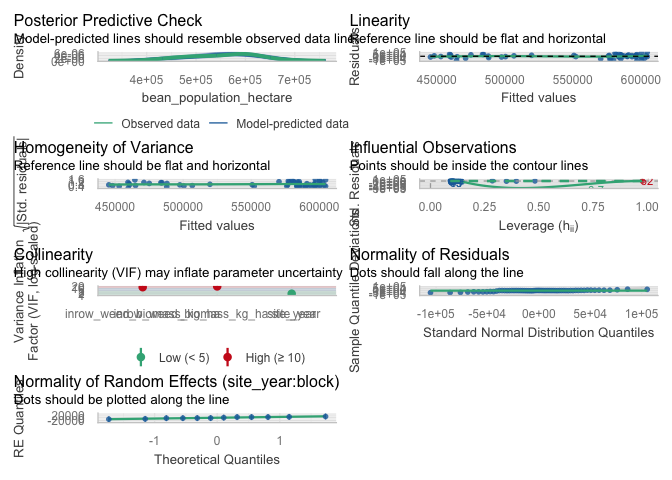<!-- -->

``` r
# Simple linear model diagnostics (population ~ in-row biomass)
check_model(lin_mod_pop_inrow)
```

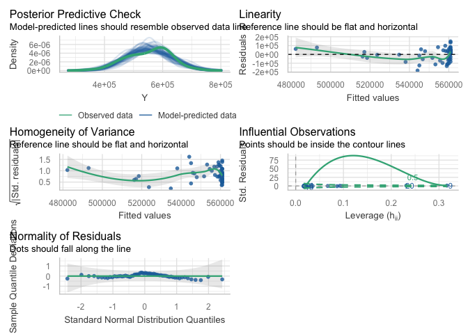<!-- -->

``` r
# Optional specific checks for the in-row population linear model
check_heteroscedasticity(lin_mod_pop_inrow)
```

    ## OK: Error variance appears to be homoscedastic (p = 0.842).

``` r
check_normality(lin_mod_pop_inrow)
```

    ## OK: residuals appear as normally distributed (p = 0.141).

``` r
check_outliers(lin_mod_pop_inrow)
```

    ## OK: No outliers detected.
    ## - Based on the following method and threshold: cook (0.701).
    ## - For variable: (Whole model)

#### Visualisation

``` r
ggplot(dat_pop_inrow, aes(x = B, y = Y)) +
  # points: always black
  geom_point(
    color = "black",
    alpha = 1
  ) +
  # LOESS: uses palette color and appears in legend
  geom_smooth(
    aes(color = "LOESS"),
    method = "loess",
    se = FALSE,
    linewidth = 1,
    linetype = "dashed"
  ) +
  # Linear: always black, not tied to color scale
  stat_function(
    fun = function(x) coef(lin_mod_pop_inrow)[1] +
                      coef(lin_mod_pop_inrow)[2] * x,
    linewidth = 1,
    color = "black"
  ) +
  # Hyperbolic: uses palette color and appears in legend
  stat_function(
    aes(color = "Hyperbolic"),
    fun = function(x) {
      pars <- coef(hyper_mod_pop_inrow)
      pars["Y0"] - (pars["Lmax"] * x) / (pars["K"] + x)
    },
    linewidth = 1,
    linetype = "dotdash"
  ) +
  scale_color_manual(
    name   = NULL,
    breaks = c("LOESS", "Hyperbolic"),
    labels = c(
      "LOESS smooth",
      "Hyperbolic fit"
    ),
    values = c(
      "LOESS"      = line_cols[2],
      "Hyperbolic" = line_cols[4]
    )
  ) +
  # y-axis as whole numbers, no scientific notation
  scale_y_continuous(
    labels = scales::label_comma(accuracy = 1)
  ) +
  guides(
    color = guide_legend(
      override.aes = list(
        linetype = c("dashed", "dotdash"),
        shape    = c(NA, NA),
        alpha    = c(1, 1)
      )
    )
  ) +
  labs(
    x = bquote("In-row weed biomass (kg ha"^-1*")"),
    y = bquote("Bean population (plants ha"^-1*")"),
    title = "Bean population vs in-row weed biomass",
    subtitle = "Data (black), LOESS, and linear vs hyperbolic fits"
  ) +
  theme_classic() +
  theme(
    legend.position = "right"
  )
```

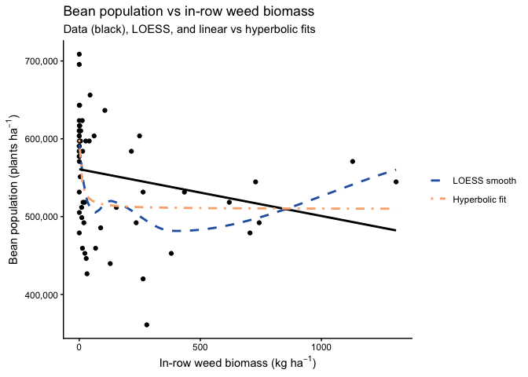<!-- --> \### Seed
weight \#### Dataset

``` r
# ----------------------------------------------------------------------
# Model testing: in-row weed biomass vs 100-seed weight (g)
# ----------------------------------------------------------------------

## Exploratory: regression dataset -------------------------------------

reg_100sw_inrow <- weed_biomass_clean |>
  filter(
    !is.na(inrow_weed_biomass_kg_ha),
    !is.na(seed_weight),   # 100-seed weight column
    !is.na(site_year),
    !is.na(block)
  )

# Quick structure check (optional)
str(reg_100sw_inrow[, c("site_year", "block",
                        "inrow_weed_biomass_kg_ha",
                        "seed_weight")])
```

    ## tibble [60 × 4] (S3: tbl_df/tbl/data.frame)
    ##  $ site_year               : Factor w/ 3 levels "2024.field O2 east",..: 3 3 3 3 3 3 3 3 3 3 ...
    ##  $ block                   : Factor w/ 4 levels "1","2","3","4": 1 1 1 1 1 2 2 2 2 2 ...
    ##  $ inrow_weed_biomass_kg_ha: num [1:60] 380 619.5 19 13.2 9.9 ...
    ##  $ seed_weight             : num [1:60] 17.1 17.5 16.8 16.1 17 ...

#### Mixed model selection (site-year effects)

``` r
### Mixed model selection (site-year effects): 100-seed weight, in-row ----
## Mixed model selection: additive vs interaction ----------------------

options(contrasts = c("contr.sum", "contr.poly"))

# 1) Candidate mixed models --------------------------------------------

# Additive: common slope across site-year (site_year as fixed effect)
sw100_inrow_add <- lmer(
  seed_weight ~ inrow_weed_biomass_kg_ha + site_year +
    (1 | site_year:block),
  data = reg_100sw_inrow
)

# Interaction: slope allowed to differ by site-year
sw100_inrow_int <- lmer(
  seed_weight ~ inrow_weed_biomass_kg_ha * site_year +
    (1 | site_year:block),
  data = reg_100sw_inrow
)

# 2) Likelihood ratio test ---------------------------------------------

lrt_sw100_inrow   <- anova(sw100_inrow_add, sw100_inrow_int)
p_int_sw100_inrow <- lrt_sw100_inrow$`Pr(>Chisq)`[2]

# 3) AIC table with LRT p-value only for interaction model -------------

aic_sw100_inrow <- tibble(
  model = c(
    "Additive: inrow_weed_biomass_kg_ha + site_year",
    "Interaction: inrow_weed_biomass_kg_ha * site_year"
  ),
  AIC = c(AIC(sw100_inrow_add), AIC(sw100_inrow_int))
) |>
  mutate(
    deltaAIC = AIC - min(AIC),
    `LRT p (interaction vs additive)` = c(NA_real_, p_int_sw100_inrow)
  )

# Selection rule: prefer simpler model unless interaction is clearly better
keep_interaction_sw100_inrow <- (p_int_sw100_inrow < 0.05) &&
  (aic_sw100_inrow$deltaAIC[
    aic_sw100_inrow$model ==
      "Interaction: inrow_weed_biomass_kg_ha * site_year"
  ] < 2)

sw100_inrow_mod_best <- if (keep_interaction_sw100_inrow)
  sw100_inrow_int else sw100_inrow_add

chosen_model_name_sw100_inrow <- if (keep_interaction_sw100_inrow) {
  "Interaction: inrow_weed_biomass_kg_ha * site_year"
} else {
  "Additive: inrow_weed_biomass_kg_ha + site_year"
}

aic_sw100_inrow_out <- aic_sw100_inrow |>
  mutate(
    Selected = if_else(model == chosen_model_name_sw100_inrow, "Yes", "")
  )

aic_sw100_inrow_out |>
  kable(
    digits  = 2,
    caption = "100-seed weight vs in-row weed biomass: model comparison (additive vs interaction). LRT p-value compares the interaction model vs the additive model."
  ) |>
  kable_styling(full_width = FALSE, bootstrap_options = c("striped", "hover"))
```

<table class="table table-striped table-hover" style="color: black; width: auto !important; margin-left: auto; margin-right: auto;">

<caption>

100-seed weight vs in-row weed biomass: model comparison (additive vs
interaction). LRT p-value compares the interaction model vs the additive
model.
</caption>

<thead>

<tr>

<th style="text-align:left;">

model
</th>

<th style="text-align:right;">

AIC
</th>

<th style="text-align:right;">

deltaAIC
</th>

<th style="text-align:right;">

LRT p (interaction vs additive)
</th>

<th style="text-align:left;">

Selected
</th>

</tr>

</thead>

<tbody>

<tr>

<td style="text-align:left;">

Additive: inrow_weed_biomass_kg_ha + site_year
</td>

<td style="text-align:right;">

129.54
</td>

<td style="text-align:right;">

0.00
</td>

<td style="text-align:right;">

NA
</td>

<td style="text-align:left;">

Yes
</td>

</tr>

<tr>

<td style="text-align:left;">

Interaction: inrow_weed_biomass_kg_ha \* site_year
</td>

<td style="text-align:right;">

155.93
</td>

<td style="text-align:right;">

26.39
</td>

<td style="text-align:right;">

0.64
</td>

<td style="text-align:left;">

</td>

</tr>

</tbody>

</table>

``` r
cat(
  "\nSelected model for 100-seed weight vs in-row weed biomass:\n  ",
  chosen_model_name_sw100_inrow,
  sprintf("  [LRT p (interaction) = %.3f]\n", p_int_sw100_inrow)
)
```

    ## 
    ## Selected model for 100-seed weight vs in-row weed biomass:
    ##    Additive: inrow_weed_biomass_kg_ha + site_year   [LRT p (interaction) = 0.635]

#### Slope summary via emtrends

``` r
### Slope summary: 100-seed weight vs in-row weed biomass ---------------

if (chosen_model_name_sw100_inrow ==
    "Additive: inrow_weed_biomass_kg_ha + site_year") {
  
  # One common slope across site-years
  emm_slope_sw100_inrow <- emtrends(
    sw100_inrow_mod_best, ~ 1,
    var = "inrow_weed_biomass_kg_ha"
  )
  
  emm_slope_sw100_inrow_df <- summary(
    emm_slope_sw100_inrow,
    infer = c(TRUE, TRUE)
  ) |>
    as_tibble()
  
  trend_col_sw100_inrow <- get_trend_col(
    emm_slope_sw100_inrow_df,
    "inrow_weed_biomass_kg_ha"
  )
  stat_col_sw100_inrow  <- get_stat_col(emm_slope_sw100_inrow_df)
  
  has_df_sw100_inrow <- "df" %in% names(emm_slope_sw100_inrow_df)
  has_p_sw100_inrow  <- "p.value" %in% names(emm_slope_sw100_inrow_df)
  
  slope_tbl_sw100_inrow <- emm_slope_sw100_inrow_df |>
    transmute(
      Scope                               = "Pooled across site-years",
      slope_g_per_kg_inrowweed            = .data[[trend_col_sw100_inrow]],
      slope_g_per_100kg_inrowweed         = .data[[trend_col_sw100_inrow]] * 100,
      SE,
      df         = if (has_df_sw100_inrow) df else NA_real_,
      lower_95CL = lower.CL,
      upper_95CL = upper.CL,
      stat       = if (!is.na(stat_col_sw100_inrow))
        .data[[stat_col_sw100_inrow]] else NA_real_,
      p_value    = if (has_p_sw100_inrow)
        .data[["p.value"]] else NA_real_
    )
  
} else {
  
  # Slopes vary by site-year
  emm_slope_sw100_inrow <- emtrends(
    sw100_inrow_mod_best, ~ site_year,
    var = "inrow_weed_biomass_kg_ha"
  )
  
  emm_slope_sw100_inrow_df <- summary(
    emm_slope_sw100_inrow,
    infer = c(TRUE, TRUE)
  ) |>
    as_tibble()
  
  trend_col_sw100_inrow <- get_trend_col(
    emm_slope_sw100_inrow_df,
    "inrow_weed_biomass_kg_ha"
  )
  stat_col_sw100_inrow  <- get_stat_col(emm_slope_sw100_inrow_df)
  
  has_df_sw100_inrow <- "df" %in% names(emm_slope_sw100_inrow_df)
  has_p_sw100_inrow  <- "p.value" %in% names(emm_slope_sw100_inrow_df)
  
  slope_tbl_sw100_inrow <- emm_slope_sw100_inrow_df |>
    transmute(
      Scope                               = as.character(site_year),
      slope_g_per_kg_inrowweed            = .data[[trend_col_sw100_inrow]],
      slope_g_per_100kg_inrowweed         = .data[[trend_col_sw100_inrow]] * 100,
      SE,
      df         = if (has_df_sw100_inrow) df else NA_real_,
      lower_95CL = lower.CL,
      upper_95CL = upper.CL,
      stat       = if (!is.na(stat_col_sw100_inrow))
        .data[[stat_col_sw100_inrow]] else NA_real_,
      p_value    = if (has_p_sw100_inrow)
        .data[["p.value"]] else NA_real_
    )
}

slope_tbl_sw100_inrow |>
  mutate(
    across(
      c(slope_g_per_kg_inrowweed,
        slope_g_per_100kg_inrowweed,
        SE, lower_95CL, upper_95CL),
      ~ round(.x, 3)
    )
  ) |>
  kable(
    caption = "Slopes of 100-seed weight vs in-row weed biomass (kg ha^-1): mixed-model emtrends",
    col.names = c(
      "Scope (site-year / pooled)",
      "Slope (g per kg in-row weed ha^-1)",
      "Slope (g per 100 kg in-row weed ha^-1)",
      "SE", "df",
      "Lower 95% CL", "Upper 95% CL",
      "Test statistic", "p-value"
    )
  ) |>
  kable_styling(full_width = FALSE, bootstrap_options = c("striped", "hover"))
```

<table class="table table-striped table-hover" style="color: black; width: auto !important; margin-left: auto; margin-right: auto;">

<caption>

Slopes of 100-seed weight vs in-row weed biomass (kg ha^-1): mixed-model
emtrends
</caption>

<thead>

<tr>

<th style="text-align:left;">

Scope (site-year / pooled)
</th>

<th style="text-align:right;">

Slope (g per kg in-row weed ha^-1)
</th>

<th style="text-align:right;">

Slope (g per 100 kg in-row weed ha^-1)
</th>

<th style="text-align:right;">

SE
</th>

<th style="text-align:right;">

df
</th>

<th style="text-align:right;">

Lower 95% CL
</th>

<th style="text-align:right;">

Upper 95% CL
</th>

<th style="text-align:right;">

Test statistic
</th>

<th style="text-align:right;">

p-value
</th>

</tr>

</thead>

<tbody>

<tr>

<td style="text-align:left;">

Pooled across site-years
</td>

<td style="text-align:right;">

0.001
</td>

<td style="text-align:right;">

0.054
</td>

<td style="text-align:right;">

0
</td>

<td style="text-align:right;">

53.66402
</td>

<td style="text-align:right;">

0
</td>

<td style="text-align:right;">

0.001
</td>

<td style="text-align:right;">

1.689297
</td>

<td style="text-align:right;">

0.0969652
</td>

</tr>

</tbody>

</table>

#### Linear vs rectangular hyperbolic response

``` r
## Linear vs rectangular hyperbolic response of 100-seed weight to in-row weed biomass ----

# Use the same plot-level data (no random effects here, just a marginal comparison)
dat_sw100_inrow <- reg_100sw_inrow |>
  select(inrow_weed_biomass_kg_ha, seed_weight) |>
  rename(
    B = inrow_weed_biomass_kg_ha,
    Y = seed_weight
  )

# Quick sanity check (optional)
names(dat_sw100_inrow)    # should be "B" and "Y"
```

    ## [1] "B" "Y"

``` r
# 1) Linear model -------------------------------------------------------

lin_mod_sw100_inrow <- lm(Y ~ B, data = dat_sw100_inrow)

# 2) Rectangular hyperbolic model:
#    Y = Y0 - (Lmax * B) / (K + B)
#    Y0   = weed-free 100-seed weight (g)
#    Lmax = maximum loss in 100-seed weight
#    K    = in-row weed biomass at half of Lmax

start_vals_sw100_inrow <- list(
  Y0   = max(dat_sw100_inrow$Y, na.rm = TRUE),  # near weed-free 100-seed weight
  Lmax = max(dat_sw100_inrow$Y, na.rm = TRUE) - min(dat_sw100_inrow$Y, na.rm = TRUE),
  K    = median(dat_sw100_inrow$B[dat_sw100_inrow$B > 0], na.rm = TRUE)
)

hyper_mod_sw100_inrow <- nls(
  Y ~ Y0 - (Lmax * B) / (K + B),
  data  = dat_sw100_inrow,
  start = start_vals_sw100_inrow
)

summary(hyper_mod_sw100_inrow)
```

    ## 
    ## Formula: Y ~ Y0 - (Lmax * B)/(K + B)
    ## 
    ## Parameters:
    ##      Estimate Std. Error t value Pr(>|t|)    
    ## Y0    18.2001     0.1645 110.618  < 2e-16 ***
    ## Lmax   0.7635     0.2812   2.715  0.00875 ** 
    ## K     26.2661    39.6476   0.662  0.51033    
    ## ---
    ## Signif. codes:  0 '***' 0.001 '**' 0.01 '*' 0.05 '.' 0.1 ' ' 1
    ## 
    ## Residual standard error: 0.7873 on 57 degrees of freedom
    ## 
    ## Number of iterations to convergence: 6 
    ## Achieved convergence tolerance: 3.201e-06

``` r
# 3) AIC and R2 comparison -----------------------------------------------

# AIC
aic_lin_sw100_inrow   <- AIC(lin_mod_sw100_inrow)
aic_hyper_sw100_inrow <- AIC(hyper_mod_sw100_inrow)

# R2 for linear model
gl_lin_sw100_inrow  <- broom::glance(lin_mod_sw100_inrow)
R2_lin_sw100_inrow  <- gl_lin_sw100_inrow$r.squared
R2_lin_sw100_inrow_adj <- gl_lin_sw100_inrow$adj.r.squared

# R2 for nls (hyperbolic)
get_r2_nls <- function(mod) {
  y_hat <- fitted(mod)
  res   <- resid(mod)
  y     <- y_hat + res  # reconstruct observed response
  
  rss <- sum(res^2)
  tss <- sum((y - mean(y))^2)
  1 - rss / tss
}

R2_hyper_sw100_inrow <- get_r2_nls(hyper_mod_sw100_inrow)

# Residual df (more meaningful than n)
df_lin_sw100_inrow   <- df.residual(lin_mod_sw100_inrow)
df_hyper_sw100_inrow <- df.residual(hyper_mod_sw100_inrow)

mod_comp_sw100_inrow <- tibble(
  model = c("Linear", "Hyperbolic"),
  df    = c(df_lin_sw100_inrow, df_hyper_sw100_inrow),
  AIC   = c(aic_lin_sw100_inrow, aic_hyper_sw100_inrow),
  R2    = c(R2_lin_sw100_inrow, R2_hyper_sw100_inrow)
)

mod_comp_sw100_inrow |>
  kable(
    digits  = 3,
    caption = "Model comparison for 100-seed weight vs in-row weed biomass: linear vs rectangular hyperbolic"
  ) |>
  kable_styling(full_width = FALSE, bootstrap_options = c("striped", "hover"))
```

<table class="table table-striped table-hover" style="color: black; width: auto !important; margin-left: auto; margin-right: auto;">

<caption>

Model comparison for 100-seed weight vs in-row weed biomass: linear vs
rectangular hyperbolic
</caption>

<thead>

<tr>

<th style="text-align:left;">

model
</th>

<th style="text-align:right;">

df
</th>

<th style="text-align:right;">

AIC
</th>

<th style="text-align:right;">

R2
</th>

</tr>

</thead>

<tbody>

<tr>

<td style="text-align:left;">

Linear
</td>

<td style="text-align:right;">

58
</td>

<td style="text-align:right;">

146.939
</td>

<td style="text-align:right;">

0.091
</td>

</tr>

<tr>

<td style="text-align:left;">

Hyperbolic
</td>

<td style="text-align:right;">

57
</td>

<td style="text-align:right;">

146.499
</td>

<td style="text-align:right;">

0.127
</td>

</tr>

</tbody>

</table>

#### Diagnostics

``` r
# --- 100-seed weight vs in-row weed biomass ---------------------------

# Mixed model diagnostics (chosen 100-seed weight in-row model)
check_model(sw100_inrow_mod_best)
```

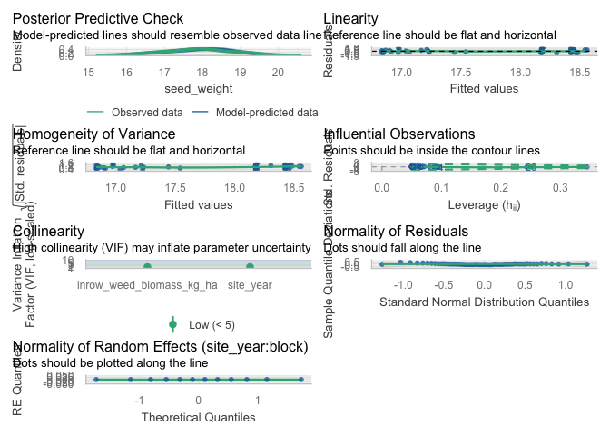<!-- -->

``` r
# Simple linear model diagnostics (100-seed weight ~ in-row biomass)
check_model(lin_mod_sw100_inrow)
```

<!-- -->

``` r
# Optional specific checks for the 100-seed weight linear model (in-row)
check_heteroscedasticity(lin_mod_sw100_inrow)
```

    ## OK: Error variance appears to be homoscedastic (p = 0.242).

``` r
check_normality(lin_mod_sw100_inrow)
```

    ## OK: residuals appear as normally distributed (p = 0.314).

``` r
check_outliers(lin_mod_sw100_inrow)
```

    ## OK: No outliers detected.
    ## - Based on the following method and threshold: cook (0.701).
    ## - For variable: (Whole model)

#### Visualisation

``` r
ggplot(dat_sw100_inrow, aes(x = B, y = Y)) +
  # points: always black
  geom_point(
    color = "black",
    alpha = 1
  ) +
  # LOESS: uses palette color and appears in legend
  geom_smooth(
    aes(color = "LOESS"),
    method = "loess",
    se = FALSE,
    linewidth = 1,
    linetype = "dashed"
  ) +
  # Linear: always black, not tied to color scale
  stat_function(
    fun = function(x) coef(lin_mod_sw100_inrow)[1] +
                      coef(lin_mod_sw100_inrow)[2] * x,
    linewidth = 1,
    color = "black"
  ) +
  # Hyperbolic: uses palette color and appears in legend
  stat_function(
    aes(color = "Hyperbolic"),
    fun = function(x) {
      pars <- coef(hyper_mod_sw100_inrow)
      pars["Y0"] - (pars["Lmax"] * x) / (pars["K"] + x)
    },
    linewidth = 1,
    linetype = "dotdash"
  ) +
  scale_color_manual(
    name   = NULL,
    breaks = c("LOESS", "Hyperbolic"),
    labels = c(
      "LOESS smooth",
      "Hyperbolic fit"
    ),
    values = c(
      "LOESS"      = line_cols[2],
      "Hyperbolic" = line_cols[4]
    )
  ) +
  guides(
    color = guide_legend(
      override.aes = list(
        linetype = c("dashed", "dotdash"),
        shape    = c(NA, NA),
        alpha    = c(1, 1)
      )
    )
  ) +
  labs(
    x = bquote("In-row weed biomass (kg ha"^-1*")"),
    y = "100-seed weight (g)",
    title = "100-seed weight vs in-row weed biomass",
    subtitle = "Data (black), LOESS, and linear vs hyperbolic fits"
  ) +
  theme_classic() +
  theme(
    legend.position = "right"
  )
```

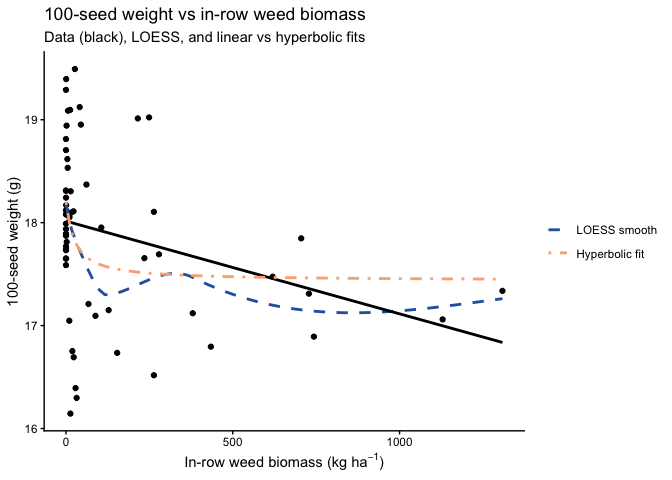<!-- --> \## Inter-row
weed biomass \### Yield \#### Dataset

``` r
# ----------------------------------------------------------------------
# Model testing: interrow weed biomass vs adjusted soybean yield (kg ha^-1)
# ----------------------------------------------------------------------

## Exploratory: regression dataset -------------------------------------

reg_yield_interrow <- weed_biomass_clean |>
  filter(
    !is.na(interrow_weed_biomass_kg_ha),
    !is.na(bean_yield_adj_kg_ha),
    !is.na(site_year),
    !is.na(block)
  )

# Quick structure check (optional)
str(reg_yield_interrow[, c("site_year", "block",
                           "interrow_weed_biomass_kg_ha",
                           "bean_yield_adj_kg_ha")])
```

    ## tibble [60 × 4] (S3: tbl_df/tbl/data.frame)
    ##  $ site_year                  : Factor w/ 3 levels "2024.field O2 east",..: 3 3 3 3 3 3 3 3 3 3 ...
    ##  $ block                      : Factor w/ 4 levels "1","2","3","4": 1 1 1 1 1 2 2 2 2 2 ...
    ##  $ interrow_weed_biomass_kg_ha: num [1:60] 889.8 14.4 137.8 914.7 440.5 ...
    ##  $ bean_yield_adj_kg_ha       : num [1:60] 3145 4263 3391 3110 3571 ...

#### Mixed model selection (site-year effects)

``` r
## Mixed model selection: interrow weed biomass vs adjusted yield ---------

options(contrasts = c("contr.sum", "contr.poly"))

# 1) Candidate mixed models --------------------------------------------

# Additive: common slope across site-year (site_year as fixed effect)
yield_interrow_add <- lmer(
  bean_yield_adj_kg_ha ~ interrow_weed_biomass_kg_ha + site_year +
    (1 | site_year:block),
  data = reg_yield_interrow
)

# Interaction: slope allowed to differ by site-year
yield_interrow_int <- lmer(
  bean_yield_adj_kg_ha ~ interrow_weed_biomass_kg_ha * site_year +
    (1 | site_year:block),
  data = reg_yield_interrow
)

# 2) Likelihood ratio test ---------------------------------------------

lrt_yield_interrow   <- anova(yield_interrow_add, yield_interrow_int)
p_int_yield_interrow <- lrt_yield_interrow$`Pr(>Chisq)`[2]

# 3) AIC table with LRT p-value only for interaction model -------------

aic_yield_interrow <- tibble(
  model = c(
    "Additive: interrow_weed_biomass_kg_ha + site_year",
    "Interaction: interrow_weed_biomass_kg_ha * site_year"
  ),
  AIC = c(AIC(yield_interrow_add), AIC(yield_interrow_int))
) |>
  mutate(
    deltaAIC = AIC - min(AIC),
    `LRT p (interaction vs additive)` = c(NA_real_, p_int_yield_interrow)
  )

# Selection rule: prefer simpler model unless interaction is clearly better
keep_interaction_interrow <- (p_int_yield_interrow < 0.05) &&
  (aic_yield_interrow$deltaAIC[
    aic_yield_interrow$model ==
      "Interaction: interrow_weed_biomass_kg_ha * site_year"
  ] < 2)

yield_interrow_mod_best <- if (keep_interaction_interrow)
  yield_interrow_int else yield_interrow_add

chosen_model_name_yield_interrow <- if (keep_interaction_interrow) {
  "Interaction: interrow_weed_biomass_kg_ha * site_year"
} else {
  "Additive: interrow_weed_biomass_kg_ha + site_year"
}

aic_yield_interrow_out <- aic_yield_interrow |>
  mutate(
    Selected = if_else(model == chosen_model_name_yield_interrow, "Yes", "")
  )

aic_yield_interrow_out |>
  kable(
    digits  = 2,
    caption = "Adjusted soybean yield vs interrow weed biomass: model comparison (additive vs interaction). LRT p-value compares the interaction model vs the additive model."
  ) |>
  kable_styling(full_width = FALSE, bootstrap_options = c("striped", "hover"))
```

<table class="table table-striped table-hover" style="color: black; width: auto !important; margin-left: auto; margin-right: auto;">

<caption>

Adjusted soybean yield vs interrow weed biomass: model comparison
(additive vs interaction). LRT p-value compares the interaction model vs
the additive model.
</caption>

<thead>

<tr>

<th style="text-align:left;">

model
</th>

<th style="text-align:right;">

AIC
</th>

<th style="text-align:right;">

deltaAIC
</th>

<th style="text-align:right;">

LRT p (interaction vs additive)
</th>

<th style="text-align:left;">

Selected
</th>

</tr>

</thead>

<tbody>

<tr>

<td style="text-align:left;">

Additive: interrow_weed_biomass_kg_ha + site_year
</td>

<td style="text-align:right;">

864.81
</td>

<td style="text-align:right;">

0.00
</td>

<td style="text-align:right;">

NA
</td>

<td style="text-align:left;">

Yes
</td>

</tr>

<tr>

<td style="text-align:left;">

Interaction: interrow_weed_biomass_kg_ha \* site_year
</td>

<td style="text-align:right;">

868.69
</td>

<td style="text-align:right;">

3.89
</td>

<td style="text-align:right;">

0.75
</td>

<td style="text-align:left;">

</td>

</tr>

</tbody>

</table>

``` r
cat(
  "\nSelected model for adjusted soybean yield vs interrow weed biomass:\n  ",
  chosen_model_name_yield_interrow,
  sprintf("  [LRT p (interaction) = %.3f]\n", p_int_yield_interrow)
)
```

    ## 
    ## Selected model for adjusted soybean yield vs interrow weed biomass:
    ##    Additive: interrow_weed_biomass_kg_ha + site_year   [LRT p (interaction) = 0.752]

#### Slope summary via emtrends

``` r
## Slope summary: emtrends for yield vs interrow weed biomass ------------

if (chosen_model_name_yield_interrow ==
    "Additive: interrow_weed_biomass_kg_ha + site_year") {
  
  # One common slope across site-years
  emm_slope_interrow <- emtrends(
    yield_interrow_mod_best, ~ 1,
    var = "interrow_weed_biomass_kg_ha"
  )
  
  emm_slope_interrow_df <- summary(
    emm_slope_interrow,
    infer = c(TRUE, TRUE)
  ) |>
    as_tibble()
  
  trend_col_interrow <- get_trend_col(
    emm_slope_interrow_df,
    "interrow_weed_biomass_kg_ha"
  )
  stat_col_interrow  <- get_stat_col(emm_slope_interrow_df)
  
  has_df_interrow <- "df" %in% names(emm_slope_interrow_df)
  has_p_interrow  <- "p.value" %in% names(emm_slope_interrow_df)
  
  slope_tbl_interrow <- emm_slope_interrow_df |>
    transmute(
      Scope              = "Pooled across site-years",
      slope_kg_per_kg    = .data[[trend_col_interrow]],
      slope_kg_per_100kg = .data[[trend_col_interrow]] * 100,
      SE,
      df         = if (has_df_interrow) df else NA_real_,
      lower_95CL = lower.CL,
      upper_95CL = upper.CL,
      stat       = if (!is.na(stat_col_interrow))
        .data[[stat_col_interrow]] else NA_real_,
      p_value    = if (has_p_interrow)
        .data[["p.value"]] else NA_real_
    )
  
} else {
  
  # Slopes vary by site-year
  emm_slope_interrow <- emtrends(
    yield_interrow_mod_best, ~ site_year,
    var = "interrow_weed_biomass_kg_ha"
  )
  
  emm_slope_interrow_df <- summary(
    emm_slope_interrow,
    infer = c(TRUE, TRUE)
  ) |>
    as_tibble()
  
  trend_col_interrow <- get_trend_col(
    emm_slope_interrow_df,
    "interrow_weed_biomass_kg_ha"
  )
  stat_col_interrow  <- get_stat_col(emm_slope_interrow_df)
  
  has_df_interrow <- "df" %in% names(emm_slope_interrow_df)
  has_p_interrow  <- "p.value" %in% names(emm_slope_interrow_df)
  
  slope_tbl_interrow <- emm_slope_interrow_df |>
    transmute(
      Scope              = as.character(site_year),
      slope_kg_per_kg    = .data[[trend_col_interrow]],
      slope_kg_per_100kg = .data[[trend_col_interrow]] * 100,
      SE,
      df         = if (has_df_interrow) df else NA_real_,
      lower_95CL = lower.CL,
      upper_95CL = upper.CL,
      stat       = if (!is.na(stat_col_interrow))
        .data[[stat_col_interrow]] else NA_real_,
      p_value    = if (has_p_interrow)
        .data[["p.value"]] else NA_real_
    )
}

slope_tbl_interrow |>
  mutate(
    across(
      c(slope_kg_per_kg, slope_kg_per_100kg,
        SE, lower_95CL, upper_95CL),
      ~ round(.x, 3)
    )
  ) |>
  kable(
    caption = "Slopes of adjusted soybean yield vs interrow weed biomass (kg ha^-1): mixed-model emtrends",
    col.names = c(
      "Scope (site-year / pooled)",
      "Slope (kg yield per kg interrow weed)",
      "Slope (kg yield per 100 kg interrow weed)",
      "SE", "df",
      "Lower 95% CL", "Upper 95% CL",
      "Test statistic", "p-value"
    )
  ) |>
  kable_styling(full_width = FALSE, bootstrap_options = c("striped", "hover"))
```

<table class="table table-striped table-hover" style="color: black; width: auto !important; margin-left: auto; margin-right: auto;">

<caption>

Slopes of adjusted soybean yield vs interrow weed biomass (kg ha^-1):
mixed-model emtrends
</caption>

<thead>

<tr>

<th style="text-align:left;">

Scope (site-year / pooled)
</th>

<th style="text-align:right;">

Slope (kg yield per kg interrow weed)
</th>

<th style="text-align:right;">

Slope (kg yield per 100 kg interrow weed)
</th>

<th style="text-align:right;">

SE
</th>

<th style="text-align:right;">

df
</th>

<th style="text-align:right;">

Lower 95% CL
</th>

<th style="text-align:right;">

Upper 95% CL
</th>

<th style="text-align:right;">

Test statistic
</th>

<th style="text-align:right;">

p-value
</th>

</tr>

</thead>

<tbody>

<tr>

<td style="text-align:left;">

Pooled across site-years
</td>

<td style="text-align:right;">

-1.113
</td>

<td style="text-align:right;">

-111.319
</td>

<td style="text-align:right;">

0.245
</td>

<td style="text-align:right;">

55.37375
</td>

<td style="text-align:right;">

-1.605
</td>

<td style="text-align:right;">

-0.622
</td>

<td style="text-align:right;">

-4.539413
</td>

<td style="text-align:right;">

3.08e-05
</td>

</tr>

</tbody>

</table>

#### Linear vs rectangular hyperbolic response

``` r
## Linear vs rectangular hyperbolic response of yield to interrow weed biomass ----

# Use the same plot-level data (no random effects here, just a marginal comparison)
dat_yield_interrow <- reg_yield_interrow |>
  select(interrow_weed_biomass_kg_ha, bean_yield_adj_kg_ha) |>
  rename(
    B = interrow_weed_biomass_kg_ha,
    Y = bean_yield_adj_kg_ha
  )

# Quick sanity check (optional)
names(dat_yield_interrow)    # should be "B" and "Y"
```

    ## [1] "B" "Y"

``` r
# 1) Linear model -------------------------------------------------------

lin_mod_interrow <- lm(Y ~ B, data = dat_yield_interrow)

# 2) Rectangular hyperbolic model:
#    Y = Y0 - (Lmax * B) / (K + B)
#    Y0   = weed-free yield
#    Lmax = maximum yield loss
#    K    = interrow biomass at half of Lmax

start_vals_interrow <- list(
  Y0   = max(dat_yield_interrow$Y, na.rm = TRUE),  # near weed-free yield
  Lmax = max(dat_yield_interrow$Y, na.rm = TRUE) -
         min(dat_yield_interrow$Y, na.rm = TRUE),
  K    = median(dat_yield_interrow$B[dat_yield_interrow$B > 0], na.rm = TRUE)
)

hyper_mod_interrow <- nls(
  Y ~ Y0 - (Lmax * B) / (K + B),
  data  = dat_yield_interrow,
  start = start_vals_interrow
)

summary(hyper_mod_interrow)
```

    ## 
    ## Formula: Y ~ Y0 - (Lmax * B)/(K + B)
    ## 
    ## Parameters:
    ##      Estimate Std. Error t value Pr(>|t|)    
    ## Y0     4937.0      100.0  49.353  < 2e-16 ***
    ## Lmax   1664.6      462.3   3.601 0.000666 ***
    ## K       226.2      168.9   1.339 0.185760    
    ## ---
    ## Signif. codes:  0 '***' 0.001 '**' 0.01 '*' 0.05 '.' 0.1 ' ' 1
    ## 
    ## Residual standard error: 514.4 on 57 degrees of freedom
    ## 
    ## Number of iterations to convergence: 7 
    ## Achieved convergence tolerance: 3.074e-06

``` r
# 3) AIC and R2 comparison -----------------------------------------------

# AIC
aic_lin_interrow   <- AIC(lin_mod_interrow)
aic_hyper_interrow <- AIC(hyper_mod_interrow)

# R2 for linear model
gl_lin_interrow     <- broom::glance(lin_mod_interrow)
R2_lin_interrow     <- gl_lin_interrow$r.squared
R2_lin_interrow_adj <- gl_lin_interrow$adj.r.squared

# R2 for nls (hyperbolic)
get_r2_nls <- function(mod) {
  y_hat <- fitted(mod)
  res   <- resid(mod)
  y     <- y_hat + res  # reconstruct observed response
  
  rss <- sum(res^2)
  tss <- sum((y - mean(y))^2)
  1 - rss / tss
}

R2_hyper_interrow <- get_r2_nls(hyper_mod_interrow)

# Residual df (more meaningful than n)
df_lin_interrow   <- df.residual(lin_mod_interrow)
df_hyper_interrow <- df.residual(hyper_mod_interrow)

mod_comp_interrow <- tibble(
  model = c("Linear", "Hyperbolic"),
  df    = c(df_lin_interrow, df_hyper_interrow),
  AIC   = c(aic_lin_interrow, aic_hyper_interrow),
  R2    = c(R2_lin_interrow, R2_hyper_interrow)
)

mod_comp_interrow |>
  kable(
    digits  = 3,
    caption = "Model comparison for adjusted soybean yield vs interrow weed biomass: linear vs rectangular hyperbolic"
  ) |>
  kable_styling(full_width = FALSE, bootstrap_options = c("striped", "hover"))
```

<table class="table table-striped table-hover" style="color: black; width: auto !important; margin-left: auto; margin-right: auto;">

<caption>

Model comparison for adjusted soybean yield vs interrow weed biomass:
linear vs rectangular hyperbolic
</caption>

<thead>

<tr>

<th style="text-align:left;">

model
</th>

<th style="text-align:right;">

df
</th>

<th style="text-align:right;">

AIC
</th>

<th style="text-align:right;">

R2
</th>

</tr>

</thead>

<tbody>

<tr>

<td style="text-align:left;">

Linear
</td>

<td style="text-align:right;">

58
</td>

<td style="text-align:right;">

929.904
</td>

<td style="text-align:right;">

0.372
</td>

</tr>

<tr>

<td style="text-align:left;">

Hyperbolic
</td>

<td style="text-align:right;">

57
</td>

<td style="text-align:right;">

924.363
</td>

<td style="text-align:right;">

0.446
</td>

</tr>

</tbody>

</table>

#### Diagnostics

``` r
## Diagnostics & visualization: yield vs interrow weed biomass ---------

library(performance)

# Mixed model diagnostics (chosen interrow model)
check_model(yield_interrow_mod_best)
```

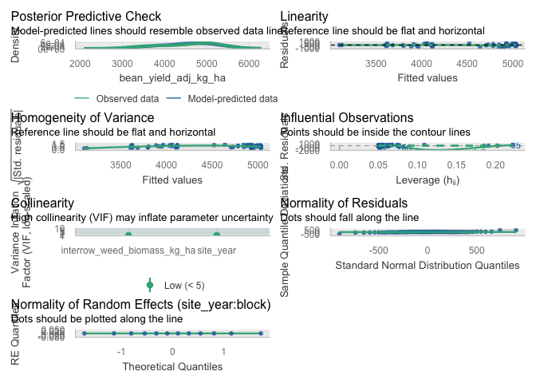<!-- -->

``` r
# Simple linear model diagnostics (interrow)
check_model(lin_mod_interrow)
```

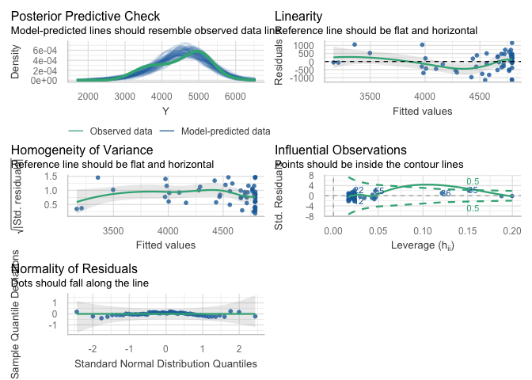<!-- -->

``` r
# Optional specific checks for the interrow linear model
check_heteroscedasticity(lin_mod_interrow)
```

    ## OK: Error variance appears to be homoscedastic (p = 0.507).

``` r
check_normality(lin_mod_interrow)
```

    ## OK: residuals appear as normally distributed (p = 0.383).

``` r
check_outliers(lin_mod_interrow)
```

    ## OK: No outliers detected.
    ## - Based on the following method and threshold: cook (0.701).
    ## - For variable: (Whole model)

#### Visualisation

##### Exploratory

``` r
ggplot(dat_yield_interrow, aes(x = B, y = Y)) +
  # points: always black
  geom_point(
    color = "black",
    alpha = 1
  ) +
  # LOESS: uses palette color and appears in legend
  geom_smooth(
    aes(color = "LOESS"),
    method = "loess",
    se = FALSE,
    linewidth = 1,
    linetype = "dashed"
  ) +
  # Linear: always black, not tied to color scale
  stat_function(
    fun = function(x) coef(lin_mod_interrow)[1] + coef(lin_mod_interrow)[2] * x,
    linewidth = 1,
    color = "black"
  ) +
  # Hyperbolic: uses palette color and appears in legend
  stat_function(
    aes(color = "Hyperbolic"),
    fun = function(x) {
      pars <- coef(hyper_mod_interrow)
      pars["Y0"] - (pars["Lmax"] * x) / (pars["K"] + x)
    },
    linewidth = 1,
    linetype = "dotdash"
  ) +
  scale_color_manual(
    name   = NULL,
    breaks = c("LOESS", "Hyperbolic"),
    labels = c(
      "LOESS smooth",
      "Hyperbolic fit"
    ),
    values = c(
      "LOESS"      = line_cols[2],
      "Hyperbolic" = line_cols[4]
    )
  ) +
  guides(
    color = guide_legend(
      override.aes = list(
        linetype = c("dashed", "dotdash"),
        shape    = c(NA, NA),
        alpha    = c(1, 1)
      )
    )
  ) +
  labs(
    x = bquote("Interrow weed biomass (kg ha"^-1*")"),
    y = bquote("Adjusted soybean yield (kg ha"^-1*")"),
    title = "Yield vs interrow weed biomass",
    subtitle = "Data (black), LOESS, and linear vs hyperbolic fits"
  ) +
  theme_classic() +
  theme(
    legend.position = "right"
  )
```

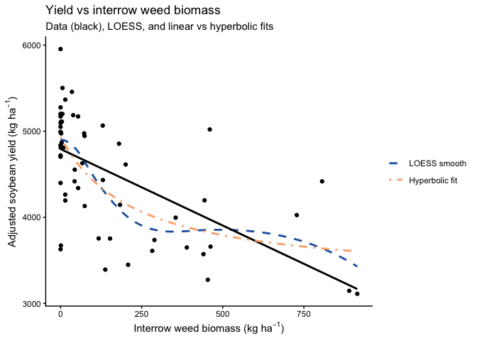<!-- -->

##### Final

``` r
## Yield vs interrow weed biomass: points + hyperbolic fit -------------------

p_yield_interrow_hyper <- ggplot(dat_yield_interrow, aes(x = B, y = Y)) +
  # raw data points
  geom_point(
    color = "black",
    alpha = 1
  ) +
  # rectangular hyperbola fit (single line, fixed color)
  stat_function(
    fun = function(x) {
      pars <- coef(hyper_mod_interrow)
      pars["Y0"] - (pars["Lmax"] * x) / (pars["K"] + x)
    },
    linewidth = 1.2,
    color = line_cols[2] 
  ) +
  labs(
    x = bquote("Interrow weed biomass (kg ha"^-1*")"),
    y = bquote("Adjusted soybean yield (kg ha"^-1*")"),
    title = "Yield vs interrow weed biomass"
  ) +
   theme_classic(base_size = 18)
  theme(axis.text.x  = element_text(lineheight = 0.95, margin = margin(t = 8)),
    axis.title.y = element_text(margin = margin(r = 8)),
    plot.title   = element_text(face = "bold"),
    legend.position = "none"
  )
```

    ## <theme> List of 4
    ##  $ axis.title.y   : <ggplot2::element_text>
    ##   ..@ family       : NULL
    ##   ..@ face         : NULL
    ##   ..@ italic       : chr NA
    ##   ..@ fontweight   : num NA
    ##   ..@ fontwidth    : num NA
    ##   ..@ colour       : NULL
    ##   ..@ size         : NULL
    ##   ..@ hjust        : NULL
    ##   ..@ vjust        : NULL
    ##   ..@ angle        : NULL
    ##   ..@ lineheight   : NULL
    ##   ..@ margin       : <ggplot2::margin> num [1:4] 0 8 0 0
    ##   ..@ debug        : NULL
    ##   ..@ inherit.blank: logi FALSE
    ##  $ axis.text.x    : <ggplot2::element_text>
    ##   ..@ family       : NULL
    ##   ..@ face         : NULL
    ##   ..@ italic       : chr NA
    ##   ..@ fontweight   : num NA
    ##   ..@ fontwidth    : num NA
    ##   ..@ colour       : NULL
    ##   ..@ size         : NULL
    ##   ..@ hjust        : NULL
    ##   ..@ vjust        : NULL
    ##   ..@ angle        : NULL
    ##   ..@ lineheight   : num 0.95
    ##   ..@ margin       : <ggplot2::margin> num [1:4] 8 0 0 0
    ##   ..@ debug        : NULL
    ##   ..@ inherit.blank: logi FALSE
    ##  $ legend.position: chr "none"
    ##  $ plot.title     : <ggplot2::element_text>
    ##   ..@ family       : NULL
    ##   ..@ face         : chr "bold"
    ##   ..@ italic       : chr NA
    ##   ..@ fontweight   : num NA
    ##   ..@ fontwidth    : num NA
    ##   ..@ colour       : NULL
    ##   ..@ size         : NULL
    ##   ..@ hjust        : NULL
    ##   ..@ vjust        : NULL
    ##   ..@ angle        : NULL
    ##   ..@ lineheight   : NULL
    ##   ..@ margin       : NULL
    ##   ..@ debug        : NULL
    ##   ..@ inherit.blank: logi FALSE
    ##  @ complete: logi FALSE
    ##  @ validate: logi TRUE

``` r
p_yield_interrow_hyper
```

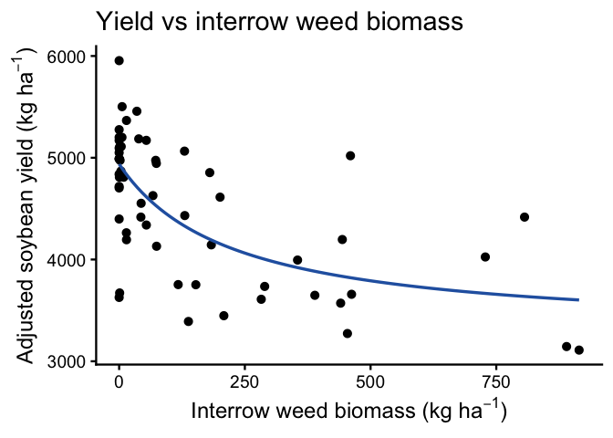<!-- -->

``` r
# Save figure ---------------------------------------------------------------
ggsave(
  filename = here("figs", "analysis", "yield-interrow-hyperbolic.png"),
  plot     = p_yield_interrow_hyper,
  width    = 6,
  height   = 4,
  dpi      = 300
)
```

### Biomass

#### Dataset

``` r
# ----------------------------------------------------------------------
# Model testing: interrow weed biomass vs soybean biomass (kg ha^-1)
# ----------------------------------------------------------------------

## Exploratory: regression dataset -------------------------------------

reg_biomass_interrow <- weed_biomass_clean |>
  filter(
    !is.na(interrow_weed_biomass_kg_ha),
    !is.na(bean_biomass_kg_ha),
    !is.na(site_year),
    !is.na(block)
  )

# Quick structure check (optional)
str(reg_biomass_interrow[, c("site_year", "block",
                             "interrow_weed_biomass_kg_ha",
                             "bean_biomass_kg_ha")])
```

    ## tibble [60 × 4] (S3: tbl_df/tbl/data.frame)
    ##  $ site_year                  : Factor w/ 3 levels "2024.field O2 east",..: 3 3 3 3 3 3 3 3 3 3 ...
    ##  $ block                      : Factor w/ 4 levels "1","2","3","4": 1 1 1 1 1 2 2 2 2 2 ...
    ##  $ interrow_weed_biomass_kg_ha: num [1:60] 889.8 14.4 137.8 914.7 440.5 ...
    ##  $ bean_biomass_kg_ha         : num [1:60] 4475 5349 4358 4154 4606 ...

#### Mixed model selection (site-year effects)

``` r
### Mixed model selection (site-year effects): soybean biomass ---------
## Mixed model selection: additive vs interaction ----------------------

options(contrasts = c("contr.sum", "contr.poly"))

# 1) Candidate mixed models --------------------------------------------

# Additive: common slope across site-year (site_year as fixed effect)
biomass_interrow_add <- lmer(
  bean_biomass_kg_ha ~ interrow_weed_biomass_kg_ha + site_year +
    (1 | site_year:block),
  data = reg_biomass_interrow
)

# Interaction: slope allowed to differ by site-year
biomass_interrow_int <- lmer(
  bean_biomass_kg_ha ~ interrow_weed_biomass_kg_ha * site_year +
    (1 | site_year:block),
  data = reg_biomass_interrow
)

# 2) Likelihood ratio test ---------------------------------------------

lrt_biomass_interrow   <- anova(biomass_interrow_add, biomass_interrow_int)
p_int_biomass_interrow <- lrt_biomass_interrow$`Pr(>Chisq)`[2]

# 3) AIC table with LRT p-value only for interaction model -------------

aic_biomass_interrow <- tibble(
  model = c(
    "Additive: interrow_weed_biomass_kg_ha + site_year",
    "Interaction: interrow_weed_biomass_kg_ha * site_year"
  ),
  AIC = c(AIC(biomass_interrow_add), AIC(biomass_interrow_int))
) |>
  mutate(
    deltaAIC = AIC - min(AIC),
    `LRT p (interaction vs additive)` = c(NA_real_, p_int_biomass_interrow)
  )

# Selection rule: prefer simpler model unless interaction is clearly better
keep_interaction_biomass_interrow <- (p_int_biomass_interrow < 0.05) &&
  (aic_biomass_interrow$deltaAIC[
    aic_biomass_interrow$model ==
      "Interaction: interrow_weed_biomass_kg_ha * site_year"
  ] < 2)

biomass_interrow_mod_best <-
  if (keep_interaction_biomass_interrow) biomass_interrow_int else biomass_interrow_add

chosen_model_name_biomass_interrow <- if (keep_interaction_biomass_interrow) {
  "Interaction: interrow_weed_biomass_kg_ha * site_year"
} else {
  "Additive: interrow_weed_biomass_kg_ha + site_year"
}

aic_biomass_interrow_out <- aic_biomass_interrow |>
  mutate(
    Selected = if_else(model == chosen_model_name_biomass_interrow, "Yes", "")
  )

aic_biomass_interrow_out |>
  kable(
    digits  = 2,
    caption = "Soybean biomass vs interrow weed biomass: model comparison (additive vs interaction). LRT p-value compares the interaction model vs the additive model."
  ) |>
  kable_styling(full_width = FALSE, bootstrap_options = c("striped", "hover"))
```

<table class="table table-striped table-hover" style="color: black; width: auto !important; margin-left: auto; margin-right: auto;">

<caption>

Soybean biomass vs interrow weed biomass: model comparison (additive vs
interaction). LRT p-value compares the interaction model vs the additive
model.
</caption>

<thead>

<tr>

<th style="text-align:left;">

model
</th>

<th style="text-align:right;">

AIC
</th>

<th style="text-align:right;">

deltaAIC
</th>

<th style="text-align:right;">

LRT p (interaction vs additive)
</th>

<th style="text-align:left;">

Selected
</th>

</tr>

</thead>

<tbody>

<tr>

<td style="text-align:left;">

Additive: interrow_weed_biomass_kg_ha + site_year
</td>

<td style="text-align:right;">

952.75
</td>

<td style="text-align:right;">

3.24
</td>

<td style="text-align:right;">

NA
</td>

<td style="text-align:left;">

Yes
</td>

</tr>

<tr>

<td style="text-align:left;">

Interaction: interrow_weed_biomass_kg_ha \* site_year
</td>

<td style="text-align:right;">

949.51
</td>

<td style="text-align:right;">

0.00
</td>

<td style="text-align:right;">

0.08
</td>

<td style="text-align:left;">

</td>

</tr>

</tbody>

</table>

``` r
cat(
  "\nSelected model for soybean biomass vs interrow weed biomass:\n  ",
  chosen_model_name_biomass_interrow,
  sprintf("  [LRT p (interaction) = %.3f]\n", p_int_biomass_interrow)
)
```

    ## 
    ## Selected model for soybean biomass vs interrow weed biomass:
    ##    Additive: interrow_weed_biomass_kg_ha + site_year   [LRT p (interaction) = 0.082]

#### Slope summary via emtrends

``` r
### Slope summary: soybean biomass vs interrow weed biomass ---------------

if (chosen_model_name_biomass_interrow ==
    "Additive: interrow_weed_biomass_kg_ha + site_year") {
  
  # One common slope across site-years
  emm_slope_biomass_interrow <- emtrends(
    biomass_interrow_mod_best, ~ 1,
    var = "interrow_weed_biomass_kg_ha"
  )
  
  emm_slope_biomass_interrow_df <- summary(
    emm_slope_biomass_interrow, infer = c(TRUE, TRUE)
  ) |>
    as_tibble()
  
  trend_col_biomass_interrow <- get_trend_col(
    emm_slope_biomass_interrow_df,
    "interrow_weed_biomass_kg_ha"
  )
  stat_col_biomass_interrow  <- get_stat_col(emm_slope_biomass_interrow_df)
  
  has_df_biomass_interrow <- "df" %in% names(emm_slope_biomass_interrow_df)
  has_p_biomass_interrow  <- "p.value" %in% names(emm_slope_biomass_interrow_df)
  
  slope_tbl_biomass_interrow <- emm_slope_biomass_interrow_df |>
    transmute(
      Scope                        = "Pooled across site-years",
      slope_kgbean_per_kginterrow  = .data[[trend_col_biomass_interrow]],
      slope_kgbean_per_100kginterrow =
        .data[[trend_col_biomass_interrow]] * 100,
      SE,
      df         = if (has_df_biomass_interrow) df else NA_real_,
      lower_95CL = lower.CL,
      upper_95CL = upper.CL,
      stat       = if (!is.na(stat_col_biomass_interrow))
                     .data[[stat_col_biomass_interrow]] else NA_real_,
      p_value    = if (has_p_biomass_interrow)
                     .data[["p.value"]] else NA_real_
    )
  
} else {
  
  # Slopes vary by site-year
  emm_slope_biomass_interrow <- emtrends(
    biomass_interrow_mod_best, ~ site_year,
    var = "interrow_weed_biomass_kg_ha"
  )
  
  emm_slope_biomass_interrow_df <- summary(
    emm_slope_biomass_interrow, infer = c(TRUE, TRUE)
  ) |>
    as_tibble()
  
  trend_col_biomass_interrow <- get_trend_col(
    emm_slope_biomass_interrow_df,
    "interrow_weed_biomass_kg_ha"
  )
  stat_col_biomass_interrow  <- get_stat_col(emm_slope_biomass_interrow_df)
  
  has_df_biomass_interrow <- "df" %in% names(emm_slope_biomass_interrow_df)
  has_p_biomass_interrow  <- "p.value" %in% names(emm_slope_biomass_interrow_df)
  
  slope_tbl_biomass_interrow <- emm_slope_biomass_interrow_df |>
    transmute(
      Scope                        = as.character(site_year),
      slope_kgbean_per_kginterrow  = .data[[trend_col_biomass_interrow]],
      slope_kgbean_per_100kginterrow =
        .data[[trend_col_biomass_interrow]] * 100,
      SE,
      df         = if (has_df_biomass_interrow) df else NA_real_,
      lower_95CL = lower.CL,
      upper_95CL = upper.CL,
      stat       = if (!is.na(stat_col_biomass_interrow))
                     .data[[stat_col_biomass_interrow]] else NA_real_,
      p_value    = if (has_p_biomass_interrow)
                     .data[["p.value"]] else NA_real_
    )
}

slope_tbl_biomass_interrow |>
  mutate(
    across(
      c(slope_kgbean_per_kginterrow,
        slope_kgbean_per_100kginterrow,
        SE, lower_95CL, upper_95CL),
      ~ round(.x, 3)
    )
  ) |>
  kable(
    caption = "Slopes of soybean biomass vs interrow weed biomass (kg ha^-1): mixed-model emtrends",
    col.names = c(
      "Scope (site-year / pooled)",
      "Slope (kg biomass per kg interrow weed)",
      "Slope (kg biomass per 100 kg interrow weed)",
      "SE", "df",
      "Lower 95% CL", "Upper 95% CL",
      "Test statistic", "p-value"
    )
  ) |>
  kable_styling(full_width = FALSE, bootstrap_options = c("striped", "hover"))
```

<table class="table table-striped table-hover" style="color: black; width: auto !important; margin-left: auto; margin-right: auto;">

<caption>

Slopes of soybean biomass vs interrow weed biomass (kg ha^-1):
mixed-model emtrends
</caption>

<thead>

<tr>

<th style="text-align:left;">

Scope (site-year / pooled)
</th>

<th style="text-align:right;">

Slope (kg biomass per kg interrow weed)
</th>

<th style="text-align:right;">

Slope (kg biomass per 100 kg interrow weed)
</th>

<th style="text-align:right;">

SE
</th>

<th style="text-align:right;">

df
</th>

<th style="text-align:right;">

Lower 95% CL
</th>

<th style="text-align:right;">

Upper 95% CL
</th>

<th style="text-align:right;">

Test statistic
</th>

<th style="text-align:right;">

p-value
</th>

</tr>

</thead>

<tbody>

<tr>

<td style="text-align:left;">

Pooled across site-years
</td>

<td style="text-align:right;">

-1.169
</td>

<td style="text-align:right;">

-116.862
</td>

<td style="text-align:right;">

0.538
</td>

<td style="text-align:right;">

55.37375
</td>

<td style="text-align:right;">

-2.246
</td>

<td style="text-align:right;">

-0.091
</td>

<td style="text-align:right;">

-2.173114
</td>

<td style="text-align:right;">

0.0340665
</td>

</tr>

</tbody>

</table>

#### Linear vs rectangular hyperbolic response

``` r
## Linear vs rectangular hyperbolic response of soybean biomass
## to interrow weed biomass ----

# Plot-level data (no random effects here)
dat_biomass_interrow <- reg_biomass_interrow |>
  select(interrow_weed_biomass_kg_ha, bean_biomass_kg_ha) |>
  rename(
    B = interrow_weed_biomass_kg_ha,
    Y = bean_biomass_kg_ha
  )

names(dat_biomass_interrow)  # should be "B" and "Y"
```

    ## [1] "B" "Y"

``` r
# 1) Linear model -------------------------------------------------------

lin_mod_biomass_interrow <- lm(Y ~ B, data = dat_biomass_interrow)

# 2) Rectangular hyperbolic model:
#    Y = Y0 - (Lmax * B) / (K + B)

start_vals_biomass_interrow <- list(
  Y0   = max(dat_biomass_interrow$Y, na.rm = TRUE),
  Lmax = max(dat_biomass_interrow$Y, na.rm = TRUE) -
         min(dat_biomass_interrow$Y, na.rm = TRUE),
  K    = median(dat_biomass_interrow$B[dat_biomass_interrow$B > 0],
                na.rm = TRUE)
)

hyper_mod_biomass_interrow <- nls(
  Y ~ Y0 - (Lmax * B) / (K + B),
  data  = dat_biomass_interrow,
  start = start_vals_biomass_interrow
)

summary(hyper_mod_biomass_interrow)
```

    ## 
    ## Formula: Y ~ Y0 - (Lmax * B)/(K + B)
    ## 
    ## Parameters:
    ##      Estimate Std. Error t value Pr(>|t|)    
    ## Y0     8149.4      319.5  25.508   <2e-16 ***
    ## Lmax   3314.4     1449.3   2.287   0.0259 *  
    ## K       221.4      262.2   0.844   0.4020    
    ## ---
    ## Signif. codes:  0 '***' 0.001 '**' 0.01 '*' 0.05 '.' 0.1 ' ' 1
    ## 
    ## Residual standard error: 1641 on 57 degrees of freedom
    ## 
    ## Number of iterations to convergence: 7 
    ## Achieved convergence tolerance: 4.683e-06

``` r
# 3) AIC and R² comparison ----------------------------------------------

aic_lin_biomass_interrow   <- AIC(lin_mod_biomass_interrow)
aic_hyper_biomass_interrow <- AIC(hyper_mod_biomass_interrow)

gl_lin_biomass_interrow <- broom::glance(lin_mod_biomass_interrow)
R2_lin_biomass_interrow <- gl_lin_biomass_interrow$r.squared

get_r2_nls <- function(mod) {
  y_hat <- fitted(mod)
  res   <- resid(mod)
  y     <- y_hat + res
  rss <- sum(res^2)
  tss <- sum((y - mean(y))^2)
  1 - rss / tss
}

R2_hyper_biomass_interrow <- get_r2_nls(hyper_mod_biomass_interrow)

df_lin_biomass_interrow   <- df.residual(lin_mod_biomass_interrow)
df_hyper_biomass_interrow <- df.residual(hyper_mod_biomass_interrow)

mod_comp_biomass_interrow <- tibble(
  model = c("Linear", "Hyperbolic"),
  df    = c(df_lin_biomass_interrow, df_hyper_biomass_interrow),
  AIC   = c(aic_lin_biomass_interrow, aic_hyper_biomass_interrow),
  R2    = c(R2_lin_biomass_interrow, R2_hyper_biomass_interrow)
)

mod_comp_biomass_interrow |>
  kable(
    digits  = 3,
    caption = "Model comparison for soybean biomass vs interrow weed biomass: linear vs rectangular hyperbolic"
  ) |>
  kable_styling(full_width = FALSE, bootstrap_options = c("striped", "hover"))
```

<table class="table table-striped table-hover" style="color: black; width: auto !important; margin-left: auto; margin-right: auto;">

<caption>

Model comparison for soybean biomass vs interrow weed biomass: linear vs
rectangular hyperbolic
</caption>

<thead>

<tr>

<th style="text-align:left;">

model
</th>

<th style="text-align:right;">

df
</th>

<th style="text-align:right;">

AIC
</th>

<th style="text-align:right;">

R2
</th>

</tr>

</thead>

<tbody>

<tr>

<td style="text-align:left;">

Linear
</td>

<td style="text-align:right;">

58
</td>

<td style="text-align:right;">

1064.325
</td>

<td style="text-align:right;">

0.205
</td>

</tr>

<tr>

<td style="text-align:left;">

Hyperbolic
</td>

<td style="text-align:right;">

57
</td>

<td style="text-align:right;">

1063.553
</td>

<td style="text-align:right;">

0.241
</td>

</tr>

</tbody>

</table>

#### Diagnostics

``` r
# --- Soybean biomass vs interrow weed biomass -------------------------

# Mixed model diagnostics (chosen biomass model)
check_model(biomass_interrow_mod_best)
```

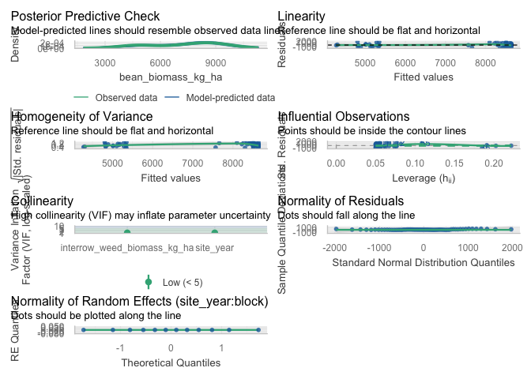<!-- -->

``` r
# Simple linear model diagnostics (biomass ~ interrow biomass)
check_model(lin_mod_biomass_interrow)
```

<!-- -->

``` r
# Optional specific checks for the biomass linear model
check_heteroscedasticity(lin_mod_biomass_interrow)
```

    ## OK: Error variance appears to be homoscedastic (p = 0.394).

``` r
check_normality(lin_mod_biomass_interrow)
```

    ## OK: residuals appear as normally distributed (p = 0.097).

``` r
check_outliers(lin_mod_biomass_interrow)
```

    ## OK: No outliers detected.
    ## - Based on the following method and threshold: cook (0.701).
    ## - For variable: (Whole model)

#### Visualisation

``` r
ggplot(dat_biomass_interrow, aes(x = B, y = Y)) +
  # points: always black
  geom_point(
    color = "black",
    alpha = 1
  ) +
  # LOESS: uses palette color and appears in legend
  geom_smooth(
    aes(color = "LOESS"),
    method = "loess",
    se = FALSE,
    linewidth = 1,
    linetype = "dashed"
  ) +
  # Linear: always black, not tied to color scale
  stat_function(
    fun = function(x) coef(lin_mod_biomass_interrow)[1] +
                     coef(lin_mod_biomass_interrow)[2] * x,
    linewidth = 1,
    color = "black"
  ) +
  # Hyperbolic: uses palette color and appears in legend
  stat_function(
    aes(color = "Hyperbolic"),
    fun = function(x) {
      pars <- coef(hyper_mod_biomass_interrow)
      pars["Y0"] - (pars["Lmax"] * x) / (pars["K"] + x)
    },
    linewidth = 1,
    linetype = "dotdash"
  ) +
  scale_color_manual(
    name   = NULL,
    breaks = c("LOESS", "Hyperbolic"),
    labels = c(
      "LOESS smooth",
      "Hyperbolic fit"
    ),
    values = c(
      "LOESS"      = line_cols[2],
      "Hyperbolic" = line_cols[4]
    )
  ) +
  labs(
    x = bquote("Interrow weed biomass (kg ha"^-1*")"),
    y = bquote("Soybean biomass (kg ha"^-1*")"),
    title = "Soybean biomass vs interrow weed biomass",
    subtitle = "Data (black), LOESS, and linear vs hyperbolic fits"
  ) +
  theme_classic() +
  theme(
    legend.position = "right"
  )
```

<!-- --> \###
Population \#### Dataset

``` r
# ----------------------------------------------------------------------
# Model testing: interrow weed biomass vs bean population (plants ha^-1)
# ----------------------------------------------------------------------

## Exploratory: regression dataset -------------------------------------

reg_pop_interrow <- weed_biomass_clean |>
  filter(
    !is.na(interrow_weed_biomass_kg_ha),
    !is.na(bean_population_hectare),
    !is.na(site_year),
    !is.na(block)
  )

# Quick structure check (optional)
str(reg_pop_interrow[, c("site_year", "block",
                         "interrow_weed_biomass_kg_ha",
                         "bean_population_hectare")])
```

    ## tibble [60 × 4] (S3: tbl_df/tbl/data.frame)
    ##  $ site_year                  : Factor w/ 3 levels "2024.field O2 east",..: 3 3 3 3 3 3 3 3 3 3 ...
    ##  $ block                      : Factor w/ 4 levels "1","2","3","4": 1 1 1 1 1 2 2 2 2 2 ...
    ##  $ interrow_weed_biomass_kg_ha: num [1:60] 889.8 14.4 137.8 914.7 440.5 ...
    ##  $ bean_population_hectare    : num [1:60] 452756 518373 492126 459318 511811 ...

#### Mixed model selection (site-year effects)

``` r
## Mixed model selection: site-year effects (bean population) ----------

options(contrasts = c("contr.sum", "contr.poly"))

# 1) Candidate mixed models --------------------------------------------

# Additive: common slope across site-years
pop_interrow_add <- lmer(
  bean_population_hectare ~ interrow_weed_biomass_kg_ha + site_year +
    (1 | site_year:block),
  data = reg_pop_interrow
)

# Interaction: slope allowed to differ by site-year
pop_interrow_int <- lmer(
  bean_population_hectare ~ interrow_weed_biomass_kg_ha * site_year +
    (1 | site_year:block),
  data = reg_pop_interrow
)

# 2) Likelihood ratio test ---------------------------------------------

lrt_pop_interrow   <- anova(pop_interrow_add, pop_interrow_int)
p_int_pop_interrow <- lrt_pop_interrow$`Pr(>Chisq)`[2]

# 3) AIC table with LRT p-value only for interaction model -------------

aic_pop_interrow <- tibble(
  model = c(
    "Additive: interrow_weed_biomass_kg_ha + site_year",
    "Interaction: interrow_weed_biomass_kg_ha * site_year"
  ),
  AIC = c(AIC(pop_interrow_add), AIC(pop_interrow_int))
) |>
  mutate(
    deltaAIC = AIC - min(AIC),
    `LRT p (interaction vs additive)` = c(NA_real_, p_int_pop_interrow)
  )

# Selection rule: prefer simpler model unless interaction clearly better
keep_interaction_pop_interrow <- (p_int_pop_interrow < 0.05) &&
  (aic_pop_interrow$deltaAIC[
    aic_pop_interrow$model ==
      "Interaction: interrow_weed_biomass_kg_ha * site_year"
  ] < 2)

pop_interrow_mod_best <- if (keep_interaction_pop_interrow)
  pop_interrow_int else pop_interrow_add

chosen_model_name_pop_interrow <- if (keep_interaction_pop_interrow) {
  "Interaction: interrow_weed_biomass_kg_ha * site_year"
} else {
  "Additive: interrow_weed_biomass_kg_ha + site_year"
}

aic_pop_interrow_out <- aic_pop_interrow |>
  mutate(
    Selected = if_else(model == chosen_model_name_pop_interrow, "Yes", "")
  )

aic_pop_interrow_out |>
  kable(
    digits  = 2,
    caption = "Bean population vs interrow weed biomass: model comparison (additive vs interaction). LRT p-value compares the interaction model vs the additive model."
  ) |>
  kable_styling(full_width = FALSE, bootstrap_options = c("striped", "hover"))
```

<table class="table table-striped table-hover" style="color: black; width: auto !important; margin-left: auto; margin-right: auto;">

<caption>

Bean population vs interrow weed biomass: model comparison (additive vs
interaction). LRT p-value compares the interaction model vs the additive
model.
</caption>

<thead>

<tr>

<th style="text-align:left;">

model
</th>

<th style="text-align:right;">

AIC
</th>

<th style="text-align:right;">

deltaAIC
</th>

<th style="text-align:right;">

LRT p (interaction vs additive)
</th>

<th style="text-align:left;">

Selected
</th>

</tr>

</thead>

<tbody>

<tr>

<td style="text-align:left;">

Additive: interrow_weed_biomass_kg_ha + site_year
</td>

<td style="text-align:right;">

1414.36
</td>

<td style="text-align:right;">

16.22
</td>

<td style="text-align:right;">

NA
</td>

<td style="text-align:left;">

Yes
</td>

</tr>

<tr>

<td style="text-align:left;">

Interaction: interrow_weed_biomass_kg_ha \* site_year
</td>

<td style="text-align:right;">

1398.13
</td>

<td style="text-align:right;">

0.00
</td>

<td style="text-align:right;">

0.57
</td>

<td style="text-align:left;">

</td>

</tr>

</tbody>

</table>

``` r
cat(
  "\nSelected model for bean population vs interrow weed biomass:\n  ",
  chosen_model_name_pop_interrow,
  sprintf("  [LRT p (interaction) = %.3f]\n", p_int_pop_interrow)
)
```

    ## 
    ## Selected model for bean population vs interrow weed biomass:
    ##    Additive: interrow_weed_biomass_kg_ha + site_year   [LRT p (interaction) = 0.575]

#### Slope summary via emtrends

``` r
### Slope summary: bean population vs interrow weed biomass ------------

if (chosen_model_name_pop_interrow ==
    "Additive: interrow_weed_biomass_kg_ha + site_year") {
  
  # One common slope across site-years
  emm_slope_pop_interrow <- emtrends(
    pop_interrow_mod_best, ~ 1,
    var = "interrow_weed_biomass_kg_ha"
  )
  
  emm_slope_pop_interrow_df <- summary(
    emm_slope_pop_interrow,
    infer = c(TRUE, TRUE)
  ) |>
    as_tibble()
  
  trend_col_pop_interrow <- get_trend_col(
    emm_slope_pop_interrow_df,
    "interrow_weed_biomass_kg_ha"
  )
  stat_col_pop_interrow  <- get_stat_col(emm_slope_pop_interrow_df)
  
  has_df_pop_interrow <- "df" %in% names(emm_slope_pop_interrow_df)
  has_p_pop_interrow  <- "p.value" %in% names(emm_slope_pop_interrow_df)
  
  slope_tbl_pop_interrow <- emm_slope_pop_interrow_df |>
    transmute(
      Scope                      = "Pooled across site-years",
      slope_plants_per_kgweed    = .data[[trend_col_pop_interrow]],
      slope_plants_per_100kgweed = .data[[trend_col_pop_interrow]] * 100,
      SE,
      df         = if (has_df_pop_interrow) df else NA_real_,
      lower_95CL = lower.CL,
      upper_95CL = upper.CL,
      stat       = if (!is.na(stat_col_pop_interrow))
                     .data[[stat_col_pop_interrow]] else NA_real_,
      p_value    = if (has_p_pop_interrow)
                     .data[["p.value"]] else NA_real_
    )
  
} else {
  
  # Slopes vary by site-year
  emm_slope_pop_interrow <- emtrends(
    pop_interrow_mod_best, ~ site_year,
    var = "interrow_weed_biomass_kg_ha"
  )
  
  emm_slope_pop_interrow_df <- summary(
    emm_slope_pop_interrow,
    infer = c(TRUE, TRUE)
  ) |>
    as_tibble()
  
  trend_col_pop_interrow <- get_trend_col(
    emm_slope_pop_interrow_df,
    "interrow_weed_biomass_kg_ha"
  )
  stat_col_pop_interrow  <- get_stat_col(emm_slope_pop_interrow_df)
  
  has_df_pop_interrow <- "df" %in% names(emm_slope_pop_interrow_df)
  has_p_pop_interrow  <- "p.value" %in% names(emm_slope_pop_interrow_df)
  
  slope_tbl_pop_interrow <- emm_slope_pop_interrow_df |>
    transmute(
      Scope                      = as.character(site_year),
      slope_plants_per_kgweed    = .data[[trend_col_pop_interrow]],
      slope_plants_per_100kgweed = .data[[trend_col_pop_interrow]] * 100,
      SE,
      df         = if (has_df_pop_interrow) df else NA_real_,
      lower_95CL = lower.CL,
      upper_95CL = upper.CL,
      stat       = if (!is.na(stat_col_pop_interrow))
                     .data[[stat_col_pop_interrow]] else NA_real_,
      p_value    = if (has_p_pop_interrow)
                     .data[["p.value"]] else NA_real_
    )
}

slope_tbl_pop_interrow |>
  mutate(
    across(
      c(slope_plants_per_kgweed,
        slope_plants_per_100kgweed,
        SE, lower_95CL, upper_95CL),
      ~ round(.x, 3)
    )
  ) |>
  kable(
    caption = "Slopes of bean population vs interrow weed biomass (kg ha^-1): mixed-model emtrends",
    col.names = c(
      "Scope (site-year / pooled)",
      "Slope (plants ha^-1 per kg interrow weed ha^-1)",
      "Slope (plants ha^-1 per 100 kg interrow weed ha^-1)",
      "SE", "df",
      "Lower 95% CL", "Upper 95% CL",
      "Test statistic", "p-value"
    )
  ) |>
  kable_styling(full_width = FALSE, bootstrap_options = c("striped", "hover"))
```

<table class="table table-striped table-hover" style="color: black; width: auto !important; margin-left: auto; margin-right: auto;">

<caption>

Slopes of bean population vs interrow weed biomass (kg ha^-1):
mixed-model emtrends
</caption>

<thead>

<tr>

<th style="text-align:left;">

Scope (site-year / pooled)
</th>

<th style="text-align:right;">

Slope (plants ha^-1 per kg interrow weed ha^-1)
</th>

<th style="text-align:right;">

Slope (plants ha^-1 per 100 kg interrow weed ha^-1)
</th>

<th style="text-align:right;">

SE
</th>

<th style="text-align:right;">

df
</th>

<th style="text-align:right;">

Lower 95% CL
</th>

<th style="text-align:right;">

Upper 95% CL
</th>

<th style="text-align:right;">

Test statistic
</th>

<th style="text-align:right;">

p-value
</th>

</tr>

</thead>

<tbody>

<tr>

<td style="text-align:left;">

Pooled across site-years
</td>

<td style="text-align:right;">

-35.228
</td>

<td style="text-align:right;">

-3522.836
</td>

<td style="text-align:right;">

33.153
</td>

<td style="text-align:right;">

55.37375
</td>

<td style="text-align:right;">

-101.659
</td>

<td style="text-align:right;">

31.202
</td>

<td style="text-align:right;">

-1.062588
</td>

<td style="text-align:right;">

0.2925813
</td>

</tr>

</tbody>

</table>

#### Linear vs rectangular hyperbolic response

``` r
## Linear vs rectangular hyperbolic response of bean population 
## to interrow weed biomass --------------------------------------------

# Use the same plot-level data (no random effects here)
dat_pop_interrow <- reg_pop_interrow |>
  select(interrow_weed_biomass_kg_ha, bean_population_hectare) |>
  rename(
    B = interrow_weed_biomass_kg_ha,
    Y = bean_population_hectare
  )

# Quick sanity check
names(dat_pop_interrow)  # "B", "Y"
```

    ## [1] "B" "Y"

``` r
# 1) Linear model ------------------------------------------------------

lin_mod_pop_interrow <- lm(Y ~ B, data = dat_pop_interrow)

# 2) Rectangular hyperbolic model:
#    Y = Y0 - (Lmax * B) / (K + B)

start_vals_pop_interrow <- list(
  Y0   = max(dat_pop_interrow$Y, na.rm = TRUE),
  Lmax = max(dat_pop_interrow$Y, na.rm = TRUE) -
         min(dat_pop_interrow$Y, na.rm = TRUE),
  K    = median(dat_pop_interrow$B[dat_pop_interrow$B > 0], na.rm = TRUE)
)

hyper_mod_pop_interrow <- nls(
  Y ~ Y0 - (Lmax * B) / (K + B),
  data  = dat_pop_interrow,
  start = start_vals_pop_interrow
)

summary(hyper_mod_pop_interrow)
```

    ## 
    ## Formula: Y ~ Y0 - (Lmax * B)/(K + B)
    ## 
    ## Parameters:
    ##       Estimate Std. Error t value Pr(>|t|)    
    ## Y0   591433.00   13630.21  43.391  < 2e-16 ***
    ## Lmax  94414.89   26389.12   3.578 0.000715 ***
    ## K        51.78      59.40   0.872 0.387040    
    ## ---
    ## Signif. codes:  0 '***' 0.001 '**' 0.01 '*' 0.05 '.' 0.1 ' ' 1
    ## 
    ## Residual standard error: 63960 on 57 degrees of freedom
    ## 
    ## Number of iterations to convergence: 5 
    ## Achieved convergence tolerance: 6.256e-06

``` r
# 3) AIC and R2 comparison ---------------------------------------------

aic_lin_pop_interrow   <- AIC(lin_mod_pop_interrow)
aic_hyper_pop_interrow <- AIC(hyper_mod_pop_interrow)

gl_lin_pop_interrow <- broom::glance(lin_mod_pop_interrow)
R2_lin_pop_interrow <- gl_lin_pop_interrow$r.squared

get_r2_nls <- function(mod) {
  y_hat <- fitted(mod)
  res   <- resid(mod)
  y     <- y_hat + res
  
  rss <- sum(res^2)
  tss <- sum((y - mean(y))^2)
  1 - rss / tss
}

R2_hyper_pop_interrow <- get_r2_nls(hyper_mod_pop_interrow)

df_lin_pop_interrow   <- df.residual(lin_mod_pop_interrow)
df_hyper_pop_interrow <- df.residual(hyper_mod_pop_interrow)

mod_comp_pop_interrow <- tibble(
  model = c("Linear", "Hyperbolic"),
  df    = c(df_lin_pop_interrow, df_hyper_pop_interrow),
  AIC   = c(aic_lin_pop_interrow, aic_hyper_pop_interrow),
  R2    = c(R2_lin_pop_interrow, R2_hyper_pop_interrow)
)

mod_comp_pop_interrow |>
  kable(
    digits  = 3,
    caption = "Model comparison for bean population vs interrow weed biomass: linear vs rectangular hyperbolic"
  ) |>
  kable_styling(full_width = FALSE, bootstrap_options = c("striped", "hover"))
```

<table class="table table-striped table-hover" style="color: black; width: auto !important; margin-left: auto; margin-right: auto;">

<caption>

Model comparison for bean population vs interrow weed biomass: linear vs
rectangular hyperbolic
</caption>

<thead>

<tr>

<th style="text-align:left;">

model
</th>

<th style="text-align:right;">

df
</th>

<th style="text-align:right;">

AIC
</th>

<th style="text-align:right;">

R2
</th>

</tr>

</thead>

<tbody>

<tr>

<td style="text-align:left;">

Linear
</td>

<td style="text-align:right;">

58
</td>

<td style="text-align:right;">

1509.334
</td>

<td style="text-align:right;">

0.127
</td>

</tr>

<tr>

<td style="text-align:left;">

Hyperbolic
</td>

<td style="text-align:right;">

57
</td>

<td style="text-align:right;">

1503.125
</td>

<td style="text-align:right;">

0.238
</td>

</tr>

</tbody>

</table>

#### Diagnostics

``` r
# --- Bean population vs interrow weed biomass -------------------------

# Mixed model diagnostics (chosen population model)
check_model(pop_interrow_mod_best)
```

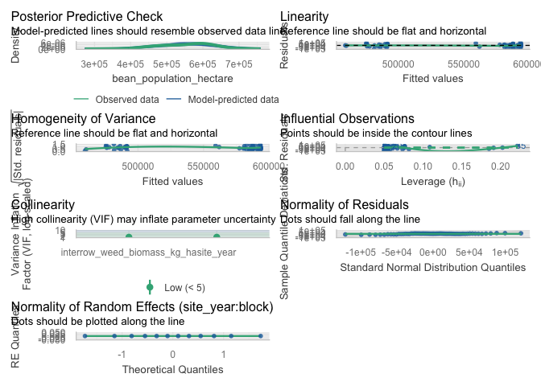<!-- -->

``` r
# Simple linear model diagnostics (population)
check_model(lin_mod_pop_interrow)
```

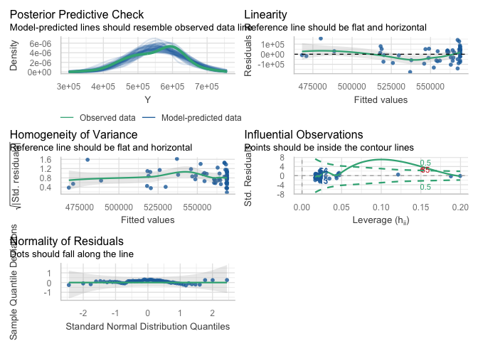<!-- -->

``` r
# Optional specific checks for the population linear model
check_heteroscedasticity(lin_mod_pop_interrow)
```

    ## OK: Error variance appears to be homoscedastic (p = 0.389).

``` r
check_normality(lin_mod_pop_interrow)
```

    ## OK: residuals appear as normally distributed (p = 0.448).

``` r
check_outliers(lin_mod_pop_interrow)
```

    ## OK: No outliers detected.
    ## - Based on the following method and threshold: cook (0.701).
    ## - For variable: (Whole model)

#### Visualisation

``` r
ggplot(dat_pop_interrow, aes(x = B, y = Y)) +
  # points: always black
  geom_point(
    color = "black",
    alpha = 1
  ) +
  # LOESS: appears in legend
  geom_smooth(
    aes(color = "LOESS"),
    method = "loess",
    se = FALSE,
    linewidth = 1,
    linetype = "dashed"
  ) +
  # Linear: black, not in legend
  stat_function(
    fun = function(x) coef(lin_mod_pop_interrow)[1] +
                      coef(lin_mod_pop_interrow)[2] * x,
    linewidth = 1,
    color = "black"
  ) +
  # Hyperbolic: appears in legend
  stat_function(
    aes(color = "Hyperbolic"),
    fun = function(x) {
      pars <- coef(hyper_mod_pop_interrow)
      pars["Y0"] - (pars["Lmax"] * x) / (pars["K"] + x)
    },
    linewidth = 1,
    linetype = "dotdash"
  ) +
  scale_color_manual(
    name   = NULL,
    breaks = c("LOESS", "Hyperbolic"),
    labels = c(
      "LOESS smooth",
      "Hyperbolic fit"
    ),
    values = c(
      "LOESS"      = line_cols[2],
      "Hyperbolic" = line_cols[4]
    )
  ) +
  scale_y_continuous(
    labels = scales::label_comma(accuracy = 1)
  ) +
  guides(
    color = guide_legend(
      override.aes = list(
        linetype = c("dashed", "dotdash"),
        shape    = c(NA, NA),
        alpha    = c(1, 1)
      )
    )
  ) +
  labs(
    x = bquote("Interrow weed biomass (kg ha"^-1*")"),
    y = bquote("Bean population (plants ha"^-1*")"),
    title = "Bean population vs interrow weed biomass",
    subtitle = "Data (black), LOESS, and linear vs hyperbolic fits"
  ) +
  theme_classic() +
  theme(
    legend.position = "right"
  )
```

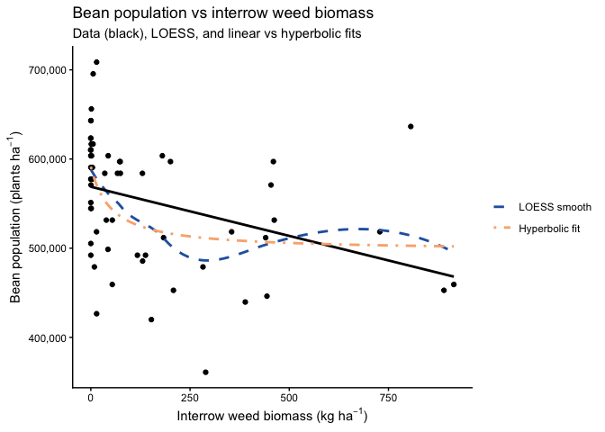<!-- --> \### Seed
weight \#### Dataset

``` r
# ----------------------------------------------------------------------
# Model testing: interrow weed biomass vs 100-seed weight (g)
# ----------------------------------------------------------------------

## Exploratory: regression dataset -------------------------------------

reg_100sw_interrow <- weed_biomass_clean |>
  filter(
    !is.na(interrow_weed_biomass_kg_ha),
    !is.na(seed_weight),   # 100-seed weight column
    !is.na(site_year),
    !is.na(block)
  )

# Quick structure check (optional)
str(reg_100sw_interrow[, c("site_year", "block",
                           "interrow_weed_biomass_kg_ha",
                           "seed_weight")])
```

    ## tibble [60 × 4] (S3: tbl_df/tbl/data.frame)
    ##  $ site_year                  : Factor w/ 3 levels "2024.field O2 east",..: 3 3 3 3 3 3 3 3 3 3 ...
    ##  $ block                      : Factor w/ 4 levels "1","2","3","4": 1 1 1 1 1 2 2 2 2 2 ...
    ##  $ interrow_weed_biomass_kg_ha: num [1:60] 889.8 14.4 137.8 914.7 440.5 ...
    ##  $ seed_weight                : num [1:60] 17.1 17.5 16.8 16.1 17 ...

#### Mixed model selection (site-year effects)

``` r
### Mixed model selection (site-year effects): 100-seed weight ----------

options(contrasts = c("contr.sum", "contr.poly"))

# 1) Candidate mixed models --------------------------------------------

# Additive: common slope across site-year
sw100_interrow_add <- lmer(
  seed_weight ~ interrow_weed_biomass_kg_ha + site_year +
    (1 | site_year:block),
  data = reg_100sw_interrow
)

# Interaction: slope allowed to differ by site-year
sw100_interrow_int <- lmer(
  seed_weight ~ interrow_weed_biomass_kg_ha * site_year +
    (1 | site_year:block),
  data = reg_100sw_interrow
)

# 2) Likelihood ratio test ---------------------------------------------

lrt_sw100_interrow   <- anova(sw100_interrow_add, sw100_interrow_int)
p_int_sw100_interrow <- lrt_sw100_interrow$`Pr(>Chisq)`[2]

# 3) AIC table with LRT p-value only for interaction model -------------

aic_sw100_interrow <- tibble(
  model = c(
    "Additive: interrow_weed_biomass_kg_ha + site_year",
    "Interaction: interrow_weed_biomass_kg_ha * site_year"
  ),
  AIC = c(AIC(sw100_interrow_add), AIC(sw100_interrow_int))
) |>
  mutate(
    deltaAIC = AIC - min(AIC),
    `LRT p (interaction vs additive)` = c(NA_real_, p_int_sw100_interrow)
  )

# Selection rule: prefer simpler model unless interaction clearly better
keep_interaction_sw100_interrow <-
  (p_int_sw100_interrow < 0.05) &&
  (aic_sw100_interrow$deltaAIC[
    aic_sw100_interrow$model ==
      "Interaction: interrow_weed_biomass_kg_ha * site_year"
  ] < 2)

sw100_interrow_mod_best <- if (keep_interaction_sw100_interrow)
  sw100_interrow_int else sw100_interrow_add

chosen_model_name_sw100_interrow <- if (keep_interaction_sw100_interrow) {
  "Interaction: interrow_weed_biomass_kg_ha * site_year"
} else {
  "Additive: interrow_weed_biomass_kg_ha + site_year"
}

aic_sw100_interrow_out <- aic_sw100_interrow |>
  mutate(
    Selected = if_else(model == chosen_model_name_sw100_interrow, "Yes", "")
  )

aic_sw100_interrow_out |>
  kable(
    digits  = 2,
    caption = "100-seed weight vs interrow weed biomass: model comparison (additive vs interaction). LRT p-value compares the interaction model vs the additive model."
  ) |>
  kable_styling(full_width = FALSE, bootstrap_options = c("striped", "hover"))
```

<table class="table table-striped table-hover" style="color: black; width: auto !important; margin-left: auto; margin-right: auto;">

<caption>

100-seed weight vs interrow weed biomass: model comparison (additive vs
interaction). LRT p-value compares the interaction model vs the additive
model.
</caption>

<thead>

<tr>

<th style="text-align:left;">

model
</th>

<th style="text-align:right;">

AIC
</th>

<th style="text-align:right;">

deltaAIC
</th>

<th style="text-align:right;">

LRT p (interaction vs additive)
</th>

<th style="text-align:left;">

Selected
</th>

</tr>

</thead>

<tbody>

<tr>

<td style="text-align:left;">

Additive: interrow_weed_biomass_kg_ha + site_year
</td>

<td style="text-align:right;">

128.89
</td>

<td style="text-align:right;">

0.00
</td>

<td style="text-align:right;">

NA
</td>

<td style="text-align:left;">

Yes
</td>

</tr>

<tr>

<td style="text-align:left;">

Interaction: interrow_weed_biomass_kg_ha \* site_year
</td>

<td style="text-align:right;">

159.51
</td>

<td style="text-align:right;">

30.62
</td>

<td style="text-align:right;">

0.97
</td>

<td style="text-align:left;">

</td>

</tr>

</tbody>

</table>

``` r
cat(
  "\nSelected model for 100-seed weight vs interrow weed biomass:\n  ",
  chosen_model_name_sw100_interrow,
  sprintf("  [LRT p (interaction) = %.3f]\n", p_int_sw100_interrow)
)
```

    ## 
    ## Selected model for 100-seed weight vs interrow weed biomass:
    ##    Additive: interrow_weed_biomass_kg_ha + site_year   [LRT p (interaction) = 0.966]

#### Slope summary via emtrends

``` r
### Slope summary: 100-seed weight vs interrow weed biomass ------------

if (chosen_model_name_sw100_interrow ==
    "Additive: interrow_weed_biomass_kg_ha + site_year") {
  
  # One common slope across site-years
  emm_slope_sw100_interrow <- emtrends(
    sw100_interrow_mod_best, ~ 1,
    var = "interrow_weed_biomass_kg_ha"
  )
  
  emm_slope_sw100_interrow_df <- summary(
    emm_slope_sw100_interrow,
    infer = c(TRUE, TRUE)
  ) |>
    as_tibble()
  
  trend_col_sw100_interrow <- get_trend_col(
    emm_slope_sw100_interrow_df,
    "interrow_weed_biomass_kg_ha"
  )
  stat_col_sw100_interrow  <- get_stat_col(emm_slope_sw100_interrow_df)
  
  has_df_sw100_interrow <- "df" %in% names(emm_slope_sw100_interrow_df)
  has_p_sw100_interrow  <- "p.value" %in% names(emm_slope_sw100_interrow_df)
  
  slope_tbl_sw100_interrow <- emm_slope_sw100_interrow_df |>
    transmute(
      Scope                         = "Pooled across site-years",
      slope_g_per_kgweed            = .data[[trend_col_sw100_interrow]],
      slope_g_per_100kgweed         = .data[[trend_col_sw100_interrow]] * 100,
      SE,
      df         = if (has_df_sw100_interrow) df else NA_real_,
      lower_95CL = lower.CL,
      upper_95CL = upper.CL,
      stat       = if (!is.na(stat_col_sw100_interrow))
                     .data[[stat_col_sw100_interrow]] else NA_real_,
      p_value    = if (has_p_sw100_interrow)
                     .data[["p.value"]] else NA_real_
    )
  
} else {
  
  # Slopes vary by site-year
  emm_slope_sw100_interrow <- emtrends(
    sw100_interrow_mod_best, ~ site_year,
    var = "interrow_weed_biomass_kg_ha"
  )
  
  emm_slope_sw100_interrow_df <- summary(
    emm_slope_sw100_interrow,
    infer = c(TRUE, TRUE)
  ) |>
    as_tibble()
  
  trend_col_sw100_interrow <- get_trend_col(
    emm_slope_sw100_interrow_df,
    "interrow_weed_biomass_kg_ha"
  )
  stat_col_sw100_interrow  <- get_stat_col(emm_slope_sw100_interrow_df)
  
  has_df_sw100_interrow <- "df" %in% names(emm_slope_sw100_interrow_df)
  has_p_sw100_interrow  <- "p.value" %in% names(emm_slope_sw100_interrow_df)
  
  slope_tbl_sw100_interrow <- emm_slope_sw100_interrow_df |>
    transmute(
      Scope                         = as.character(site_year),
      slope_g_per_kgweed            = .data[[trend_col_sw100_interrow]],
      slope_g_per_100kgweed         = .data[[trend_col_sw100_interrow]] * 100,
      SE,
      df         = if (has_df_sw100_interrow) df else NA_real_,
      lower_95CL = lower.CL,
      upper_95CL = upper.CL,
      stat       = if (!is.na(stat_col_sw100_interrow))
                     .data[[stat_col_sw100_interrow]] else NA_real_,
      p_value    = if (has_p_sw100_interrow)
                     .data[["p.value"]] else NA_real_
    )
}

slope_tbl_sw100_interrow |>
  mutate(
    across(
      c(slope_g_per_kgweed,
        slope_g_per_100kgweed,
        SE, lower_95CL, upper_95CL),
      ~ round(.x, 3)
    )
  ) |>
  kable(
    caption = "Slopes of 100-seed weight vs interrow weed biomass (kg ha^-1): mixed-model emtrends",
    col.names = c(
      "Scope (site-year / pooled)",
      "Slope (g per kg interrow weed ha^-1)",
      "Slope (g per 100 kg interrow weed ha^-1)",
      "SE", "df",
      "Lower 95% CL", "Upper 95% CL",
      "Test statistic", "p-value"
    )
  ) |>
  kable_styling(full_width = FALSE, bootstrap_options = c("striped", "hover"))
```

<table class="table table-striped table-hover" style="color: black; width: auto !important; margin-left: auto; margin-right: auto;">

<caption>

Slopes of 100-seed weight vs interrow weed biomass (kg ha^-1):
mixed-model emtrends
</caption>

<thead>

<tr>

<th style="text-align:left;">

Scope (site-year / pooled)
</th>

<th style="text-align:right;">

Slope (g per kg interrow weed ha^-1)
</th>

<th style="text-align:right;">

Slope (g per 100 kg interrow weed ha^-1)
</th>

<th style="text-align:right;">

SE
</th>

<th style="text-align:right;">

df
</th>

<th style="text-align:right;">

Lower 95% CL
</th>

<th style="text-align:right;">

Upper 95% CL
</th>

<th style="text-align:right;">

Test statistic
</th>

<th style="text-align:right;">

p-value
</th>

</tr>

</thead>

<tbody>

<tr>

<td style="text-align:left;">

Pooled across site-years
</td>

<td style="text-align:right;">

-0.001
</td>

<td style="text-align:right;">

-0.062
</td>

<td style="text-align:right;">

0
</td>

<td style="text-align:right;">

55.37375
</td>

<td style="text-align:right;">

-0.001
</td>

<td style="text-align:right;">

0
</td>

<td style="text-align:right;">

-1.807878
</td>

<td style="text-align:right;">

0.0760577
</td>

</tr>

</tbody>

</table>

#### Linear vs rectangular hyperbolic response

``` r
## Linear vs rectangular hyperbolic response of 100-seed weight 
## to interrow weed biomass --------------------------------------------

dat_sw100_interrow <- reg_100sw_interrow |>
  select(interrow_weed_biomass_kg_ha, seed_weight) |>
  rename(
    B = interrow_weed_biomass_kg_ha,
    Y = seed_weight
  )

names(dat_sw100_interrow)  # "B", "Y"
```

    ## [1] "B" "Y"

``` r
# 1) Linear model ------------------------------------------------------

lin_mod_sw100_interrow <- lm(Y ~ B, data = dat_sw100_interrow)

# 2) Rectangular hyperbolic model -------------------------------------

start_vals_sw100_interrow <- list(
  Y0   = max(dat_sw100_interrow$Y, na.rm = TRUE),
  Lmax = max(dat_sw100_interrow$Y, na.rm = TRUE) -
         min(dat_sw100_interrow$Y, na.rm = TRUE),
  K    = median(dat_sw100_interrow$B[dat_sw100_interrow$B > 0], na.rm = TRUE)
)

hyper_mod_sw100_interrow <- nls(
  Y ~ Y0 - (Lmax * B) / (K + B),
  data  = dat_sw100_interrow,
  start = start_vals_sw100_interrow
)

summary(hyper_mod_sw100_interrow)
```

    ## 
    ## Formula: Y ~ Y0 - (Lmax * B)/(K + B)
    ## 
    ## Parameters:
    ##      Estimate Std. Error t value Pr(>|t|)    
    ## Y0    18.1997     0.1449 125.599   <2e-16 ***
    ## Lmax   1.4705     0.8929   1.647    0.105    
    ## K    309.0767   451.7992   0.684    0.497    
    ## ---
    ## Signif. codes:  0 '***' 0.001 '**' 0.01 '*' 0.05 '.' 0.1 ' ' 1
    ## 
    ## Residual standard error: 0.7589 on 57 degrees of freedom
    ## 
    ## Number of iterations to convergence: 6 
    ## Achieved convergence tolerance: 1.865e-06

``` r
# 3) AIC and R2 comparison ---------------------------------------------

aic_lin_sw100_interrow   <- AIC(lin_mod_sw100_interrow)
aic_hyper_sw100_interrow <- AIC(hyper_mod_sw100_interrow)

gl_lin_sw100_interrow <- broom::glance(lin_mod_sw100_interrow)
R2_lin_sw100_interrow <- gl_lin_sw100_interrow$r.squared

get_r2_nls <- function(mod) {
  y_hat <- fitted(mod)
  res   <- resid(mod)
  y     <- y_hat + res
  
  rss <- sum(res^2)
  tss <- sum((y - mean(y))^2)
  1 - rss / tss
}

R2_hyper_sw100_interrow <- get_r2_nls(hyper_mod_sw100_interrow)

df_lin_sw100_interrow   <- df.residual(lin_mod_sw100_interrow)
df_hyper_sw100_interrow <- df.residual(hyper_mod_sw100_interrow)

mod_comp_sw100_interrow <- tibble(
  model = c("Linear", "Hyperbolic"),
  df    = c(df_lin_sw100_interrow, df_hyper_sw100_interrow),
  AIC   = c(aic_lin_sw100_interrow, aic_hyper_sw100_interrow),
  R2    = c(R2_lin_sw100_interrow, R2_hyper_sw100_interrow)
)

mod_comp_sw100_interrow |>
  kable(
    digits  = 3,
    caption = "Model comparison for 100-seed weight vs interrow weed biomass: linear vs rectangular hyperbolic"
  ) |>
  kable_styling(full_width = FALSE, bootstrap_options = c("striped", "hover"))
```

<table class="table table-striped table-hover" style="color: black; width: auto !important; margin-left: auto; margin-right: auto;">

<caption>

Model comparison for 100-seed weight vs interrow weed biomass: linear vs
rectangular hyperbolic
</caption>

<thead>

<tr>

<th style="text-align:left;">

model
</th>

<th style="text-align:right;">

df
</th>

<th style="text-align:right;">

AIC
</th>

<th style="text-align:right;">

R2
</th>

</tr>

</thead>

<tbody>

<tr>

<td style="text-align:left;">

Linear
</td>

<td style="text-align:right;">

58
</td>

<td style="text-align:right;">

141.891
</td>

<td style="text-align:right;">

0.164
</td>

</tr>

<tr>

<td style="text-align:left;">

Hyperbolic
</td>

<td style="text-align:right;">

57
</td>

<td style="text-align:right;">

142.096
</td>

<td style="text-align:right;">

0.189
</td>

</tr>

</tbody>

</table>

#### Diagnostics

``` r
# --- 100-seed weight vs interrow weed biomass ------------------------

# Mixed model diagnostics (chosen 100-seed weight model)
check_model(sw100_interrow_mod_best)
```

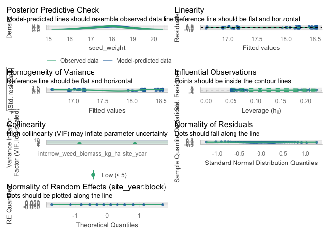<!-- -->

``` r
# Simple linear model diagnostics (100-seed weight)
check_model(lin_mod_sw100_interrow)
```

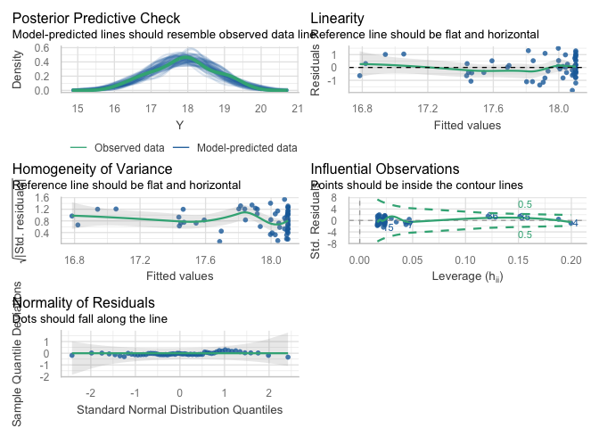<!-- -->

``` r
# Optional specific checks for the 100-seed weight linear model
check_heteroscedasticity(lin_mod_sw100_interrow)
```

    ## OK: Error variance appears to be homoscedastic (p = 0.988).

``` r
check_normality(lin_mod_sw100_interrow)
```

    ## OK: residuals appear as normally distributed (p = 0.597).

``` r
check_outliers(lin_mod_sw100_interrow)
```

    ## OK: No outliers detected.
    ## - Based on the following method and threshold: cook (0.701).
    ## - For variable: (Whole model)

#### Visualisation

``` r
ggplot(dat_sw100_interrow, aes(x = B, y = Y)) +
  # points: always black
  geom_point(
    color = "black",
    alpha = 1
  ) +
  # LOESS: uses palette color and appears in legend
  geom_smooth(
    aes(color = "LOESS"),
    method = "loess",
    se = FALSE,
    linewidth = 1,
    linetype = "dashed"
  ) +
  # Linear: always black, not tied to color scale
  stat_function(
    fun = function(x) coef(lin_mod_sw100_interrow)[1] +
                      coef(lin_mod_sw100_interrow)[2] * x,
    linewidth = 1,
    color = "black"
  ) +
  # Hyperbolic: uses palette color and appears in legend
  stat_function(
    aes(color = "Hyperbolic"),
    fun = function(x) {
      pars <- coef(hyper_mod_sw100_interrow)
      pars["Y0"] - (pars["Lmax"] * x) / (pars["K"] + x)
    },
    linewidth = 1,
    linetype = "dotdash"
  ) +
  scale_color_manual(
    name   = NULL,
    breaks = c("LOESS", "Hyperbolic"),
    labels = c(
      "LOESS smooth",
      "Hyperbolic fit"
    ),
    values = c(
      "LOESS"      = line_cols[2],
      "Hyperbolic" = line_cols[4]
    )
  ) +
  labs(
    x = bquote("Interrow weed biomass (kg ha"^-1*")"),
    y = "100-seed weight (g)",
    title = "100-seed weight vs interrow weed biomass",
    subtitle = "Data (black), LOESS, and linear vs hyperbolic fits"
  ) +
  theme_classic() +
  theme(
    legend.position = "right"
  )
```

<!-- -->
