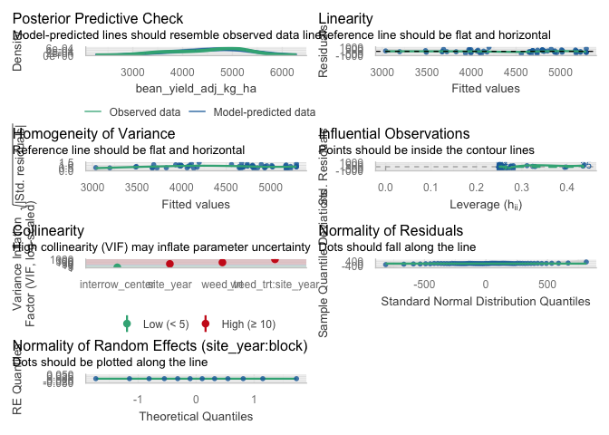
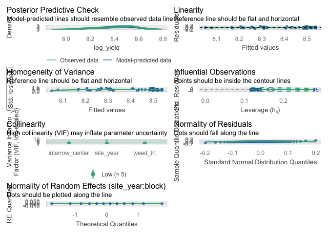
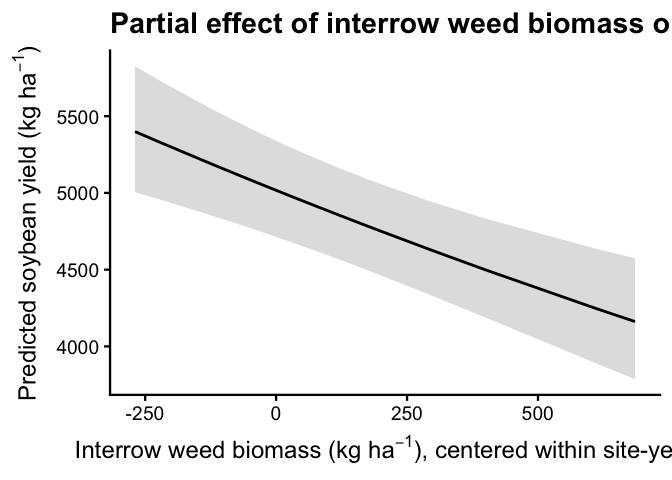

Yield covariate analysis
================

- [Data import & prep](#data-import--prep)
  - [Models on original yield scale](#models-on-original-yield-scale)
  - [Model comparison (original
    scale)](#model-comparison-original-scale)
  - [Diagnostics (original scale)](#diagnostics-original-scale)
  - [Log-transform yield + refit](#log-transform-yield--refit)
  - [Models + comparison (log scale)](#models--comparison-log-scale)
  - [Diagnostics (log scale; final
    model)](#diagnostics-log-scale-final-model)
  - [Adjusted treatment means from the covariate
    model](#adjusted-treatment-means-from-the-covariate-model)

\#Setup

\#Packages

``` r
## Packages -----------------------------------------------------------------

library(tidyverse)    # dplyr, ggplot2, readr, tibble, etc.
library(janitor)
library(readxl)
library(here)

# Mixed models / GLMMs
library(lme4)
library(glmmTMB)
library(DHARMa)
library(emmeans)
library(multcomp)
library(car)
library(ggeffects) #install.packages("ggeffects")

# Tables / reporting
library(kableExtra)
library(broom)        # tidy() / glance() for lm
library(broom.mixed)  # tidy() / glance() for lmer / glmmTMB

# Diagnostics
library(performance)  # check_model(), etc.

# Nonlinear fits
library(minpack.lm)   # nlsLM(), if needed

# Palettes
library(WrensBookshelf)

# Conflict handling ---------------------------------------------------------

library(conflicted)
conflicts_prefer(dplyr::select)
conflicts_prefer(dplyr::filter)
conflicts_prefer(dplyr::recode)

## Treatment level order (used everywhere) ----------------------------------

mow_levels <- c(
  "Rolled, no control",
  "Rolled, mowing",
  "Rolled, high-residue cultivation",
  "Tilled, mowing",
  "Tilled, cultivation"
)

## Color palette for treatments (CVD-safe) ----------------------------------

fill_cols <- WB_brewer(
  name = "WhatWellBuild",
  n    = length(mow_levels),
  type = "discrete"
) |>
  setNames(mow_levels)

## Axis label helpers -------------------------------------------------------

# Break on spaces (every word on its own line)
label_break_spaces <- function(x) {
  stringr::str_replace_all(x, " ", "\n")
}

# Break after the comma: "Rolled,\nno control"
label_break_comma <- function(x) {
  stringr::str_replace_all(x, ", ", ",\n")
}

# Break after comma and split "high-residue cultivation"
# -> "Rolled,\nhigh-residue\ncultivation"
label_break_comma_cult <- function(x) {
  x |>
    stringr::str_replace("high-residue cultivation",
                         "high-residue\ncultivation") |>
    stringr::str_replace_all(", ", ",\n")
}

## Helper: tidy emmeans output regardless of CI column names ---------------

tidy_emm <- function(emm, ref_levels = NULL) {
  emm_df <- as.data.frame(emm)

  lcl_col <- intersect(c("lower.CL", "asymp.LCL"), names(emm_df))[1]
  ucl_col <- intersect(c("upper.CL", "asymp.UCL"), names(emm_df))[1]

  if (is.na(lcl_col) || is.na(ucl_col)) {
    stop("Could not find CI columns in emmeans output.")
  }

  out <- emm_df |>
    dplyr::mutate(
      ci_low  = .data[[lcl_col]],
      ci_high = .data[[ucl_col]]
    )

  if (!is.null(ref_levels) && "weed_trt" %in% names(out)) {
    out <- out |>
      dplyr::mutate(weed_trt = factor(weed_trt, levels = ref_levels))
  }

  out
}
```

# Data import & prep

``` r
## Data import & prep ---------------------------------------------------------

# convenient conversion factor (kg/ha -> lb/ac)
kg_ha_to_lb_ac <- 0.892179   # 1 kg/ha ≈ 0.892179 lb/ac

# 1) Read + clean master (weed + soybean) -------------------------------------

weed_biomass_clean <- read_excel(
  here("data", "raw", "All Treatments", "combined_raw.xlsx")
) |>
  clean_names() |>
  rename(weed_trt = treatment) |>
  mutate(
    year      = factor(year),
    location  = factor(location),
    site_year = factor(interaction(year, location, drop = TRUE)),
    block     = factor(block),
    weed_trt  = recode(
      weed_trt,
      "RNO" = "Rolled, no control",
      "RIM" = "Rolled, mowing",
      "RIC" = "Rolled, high-residue cultivation",
      "TIM" = "Tilled, mowing",
      "TIC" = "Tilled, cultivation"
    ),
    weed_trt = factor(weed_trt, levels = mow_levels)
  ) |>
  # keep only rows with non-missing total weed biomass
  filter(!is.na(weed_biomass)) |>
  # per-area metrics (biomass in g per 0.5 m² quadrat)
  mutate(
    ## ---- WEEDS: total / in-row / interrow ----------------------------------
    weed_biomass_g_m2           = weed_biomass          * 2,   # g/m²
    weed_biomass_kg_ha          = weed_biomass          * 20,  # kg/ha
    weed_biomass_lb_ac          = weed_biomass_kg_ha    * kg_ha_to_lb_ac,

    inrow_weed_biomass_g_m2     = inrow_weed_biomass    * 2,
    inrow_weed_biomass_kg_ha    = inrow_weed_biomass    * 20,
    inrow_weed_biomass_lb_ac    = inrow_weed_biomass_kg_ha * kg_ha_to_lb_ac,

    interrow_weed_biomass_g_m2  = interrow_weed_biomass * 2,
    interrow_weed_biomass_kg_ha = interrow_weed_biomass * 20,
    interrow_weed_biomass_lb_ac = interrow_weed_biomass_kg_ha * kg_ha_to_lb_ac,

    ## ---- SOYBEAN: biomass --------------------------------------------------
    # bean_biomass assumed g per 0.5 m² quadrat (same as weeds)
    bean_biomass_g_m2    = bean_biomass * 2,           # g/m²
    bean_biomass_kg_ha   = bean_biomass * 20,          # kg/ha
    bean_biomass_lb_ac   = bean_biomass_kg_ha * kg_ha_to_lb_ac,

    ## ---- SOYBEAN: adjusted yield (same formulas as before) -----------------
    bean_yield_adj_bu_acre = (((bean_yield / 454) / (16.4 / 43560)) / 60) *
      ((100 - 0.00001) / (100 - 13)),
    bean_yield_adj_lbs_acre = ((bean_yield / 454) / (16.4 / 43560)) *
      ((100 - 0.00001) / (100 - 13)),
    bean_yield_adj_kg_ha = ((bean_yield / 454) / (16.4 / 43560)) * 1.12085 *
      ((100 - 0.00001) / (100 - 13)),

    ## ---- SOYBEAN: population metrics --------------------------------------
    # bean_population assumed plants per 1 m of row
    bean_population_two_meter = bean_population * 2,
    bean_population_hectare   = (bean_population / 0.762) * 10000,
    bean_population_acre      = bean_population_hectare / 2.471
  )

# 2) 2023 Field V subset ------------------------------------------------------

weed_biomass_field_v_2023 <- weed_biomass_clean |>
  filter(
    year == "2023",          # year is a factor; compare to character label
    location == "field v"
  )

# Quick check tables ----------------------------------------------------------

kable(
  head(weed_biomass_clean),
  caption = "All site-years, cleaned (weed + soybean metrics)"
)
```

| id | location | year | weed_trt | block | plot | bean_emergence | bean_biomass | inrow_weed_biomass | interrow_weed_biomass | weed_biomass | bean_population | bean_yield | seed_weight | site_year | weed_biomass_g_m2 | weed_biomass_kg_ha | weed_biomass_lb_ac | inrow_weed_biomass_g_m2 | inrow_weed_biomass_kg_ha | inrow_weed_biomass_lb_ac | interrow_weed_biomass_g_m2 | interrow_weed_biomass_kg_ha | interrow_weed_biomass_lb_ac | bean_biomass_g_m2 | bean_biomass_kg_ha | bean_biomass_lb_ac | bean_yield_adj_bu_acre | bean_yield_adj_lbs_acre | bean_yield_adj_kg_ha | bean_population_two_meter | bean_population_hectare | bean_population_acre |
|:---|:---|:---|:---|:---|---:|---:|---:|---:|---:|---:|---:|---:|---:|:---|---:|---:|---:|---:|---:|---:|---:|---:|---:|---:|---:|---:|---:|---:|---:|---:|---:|---:|
| CU_B1_P101 | field v | 2023 | Tilled, mowing | 1 | 101 | 46.5 | 223.740 | 19.000 | 44.490 | 63.490 | 34.5 | 417.21 | 17.1200 | 2023.field v | 126.98 | 1269.8 | 1132.8889 | 38.00 | 380.0 | 339.028020 | 88.98 | 889.8 | 793.86087 | 447.48 | 4474.8 | 3992.323 | 46.75977 | 2805.586 | 3144.641 | 69 | 452755.9 | 183227.8 |
| CU_B1_P102 | field v | 2023 | Tilled, cultivation | 1 | 102 | 42.5 | 267.460 | 30.975 | 0.720 | 31.695 | 39.5 | 565.54 | 17.4750 | 2023.field v | 63.39 | 633.9 | 565.5523 | 61.95 | 619.5 | 552.704891 | 1.44 | 14.4 | 12.84738 | 534.92 | 5349.2 | 4772.444 | 63.38419 | 3803.051 | 4262.650 | 79 | 518372.7 | 209782.6 |
| CU_B1_P103 | field v | 2023 | Rolled, mowing | 1 | 103 | 36.5 | 217.890 | 0.950 | 6.890 | 7.840 | 37.5 | 449.93 | 16.7525 | 2023.field v | 15.68 | 156.8 | 139.8937 | 1.90 | 19.0 | 16.951401 | 13.78 | 137.8 | 122.94227 | 435.78 | 4357.8 | 3887.938 | 50.42694 | 3025.616 | 3391.262 | 75 | 492126.0 | 199160.7 |
| CU_B1_P104 | field v | 2023 | Rolled, no control | 1 | 104 | 41.0 | 207.675 | 0.660 | 45.735 | 46.395 | 35.0 | 412.59 | 16.1450 | 2023.field v | 92.79 | 927.9 | 827.8529 | 1.32 | 13.2 | 11.776763 | 91.47 | 914.7 | 816.07613 | 415.35 | 4153.5 | 3705.665 | 46.24197 | 2774.518 | 3109.819 | 70 | 459317.6 | 185883.3 |
| CU_B1_P105 | field v | 2023 | Rolled, high-residue cultivation | 1 | 105 | 41.0 | 230.285 | 0.495 | 22.025 | 22.520 | 39.0 | 473.79 | 17.0475 | 2023.field v | 45.04 | 450.4 | 401.8374 | 0.99 | 9.9 | 8.832572 | 44.05 | 440.5 | 393.00485 | 460.57 | 4605.7 | 4109.109 | 53.10110 | 3186.066 | 3571.102 | 78 | 511811.0 | 207127.1 |
| CU_B1_P201 | field v | 2023 | Rolled, high-residue cultivation | 2 | 201 | 36.5 | 208.105 | 6.395 | 19.460 | 25.855 | 33.5 | 484.04 | 17.1500 | 2023.field v | 51.71 | 517.1 | 461.3458 | 12.79 | 127.9 | 114.109694 | 38.92 | 389.2 | 347.23607 | 416.21 | 4162.1 | 3713.338 | 54.24989 | 3254.994 | 3648.359 | 67 | 439632.5 | 177916.9 |

All site-years, cleaned (weed + soybean metrics)

``` r
kable(
  head(weed_biomass_field_v_2023),
  caption = "Field V only, 2023 (weed + soybean metrics)"
)
```

| id | location | year | weed_trt | block | plot | bean_emergence | bean_biomass | inrow_weed_biomass | interrow_weed_biomass | weed_biomass | bean_population | bean_yield | seed_weight | site_year | weed_biomass_g_m2 | weed_biomass_kg_ha | weed_biomass_lb_ac | inrow_weed_biomass_g_m2 | inrow_weed_biomass_kg_ha | inrow_weed_biomass_lb_ac | interrow_weed_biomass_g_m2 | interrow_weed_biomass_kg_ha | interrow_weed_biomass_lb_ac | bean_biomass_g_m2 | bean_biomass_kg_ha | bean_biomass_lb_ac | bean_yield_adj_bu_acre | bean_yield_adj_lbs_acre | bean_yield_adj_kg_ha | bean_population_two_meter | bean_population_hectare | bean_population_acre |
|:---|:---|:---|:---|:---|---:|---:|---:|---:|---:|---:|---:|---:|---:|:---|---:|---:|---:|---:|---:|---:|---:|---:|---:|---:|---:|---:|---:|---:|---:|---:|---:|---:|
| CU_B1_P101 | field v | 2023 | Tilled, mowing | 1 | 101 | 46.5 | 223.740 | 19.000 | 44.490 | 63.490 | 34.5 | 417.21 | 17.1200 | 2023.field v | 126.98 | 1269.8 | 1132.8889 | 38.00 | 380.0 | 339.028020 | 88.98 | 889.8 | 793.86087 | 447.48 | 4474.8 | 3992.323 | 46.75977 | 2805.586 | 3144.641 | 69 | 452755.9 | 183227.8 |
| CU_B1_P102 | field v | 2023 | Tilled, cultivation | 1 | 102 | 42.5 | 267.460 | 30.975 | 0.720 | 31.695 | 39.5 | 565.54 | 17.4750 | 2023.field v | 63.39 | 633.9 | 565.5523 | 61.95 | 619.5 | 552.704891 | 1.44 | 14.4 | 12.84738 | 534.92 | 5349.2 | 4772.444 | 63.38419 | 3803.051 | 4262.650 | 79 | 518372.7 | 209782.6 |
| CU_B1_P103 | field v | 2023 | Rolled, mowing | 1 | 103 | 36.5 | 217.890 | 0.950 | 6.890 | 7.840 | 37.5 | 449.93 | 16.7525 | 2023.field v | 15.68 | 156.8 | 139.8937 | 1.90 | 19.0 | 16.951401 | 13.78 | 137.8 | 122.94227 | 435.78 | 4357.8 | 3887.938 | 50.42694 | 3025.616 | 3391.262 | 75 | 492126.0 | 199160.7 |
| CU_B1_P104 | field v | 2023 | Rolled, no control | 1 | 104 | 41.0 | 207.675 | 0.660 | 45.735 | 46.395 | 35.0 | 412.59 | 16.1450 | 2023.field v | 92.79 | 927.9 | 827.8529 | 1.32 | 13.2 | 11.776763 | 91.47 | 914.7 | 816.07613 | 415.35 | 4153.5 | 3705.665 | 46.24197 | 2774.518 | 3109.819 | 70 | 459317.6 | 185883.3 |
| CU_B1_P105 | field v | 2023 | Rolled, high-residue cultivation | 1 | 105 | 41.0 | 230.285 | 0.495 | 22.025 | 22.520 | 39.0 | 473.79 | 17.0475 | 2023.field v | 45.04 | 450.4 | 401.8374 | 0.99 | 9.9 | 8.832572 | 44.05 | 440.5 | 393.00485 | 460.57 | 4605.7 | 4109.109 | 53.10110 | 3186.066 | 3571.102 | 78 | 511811.0 | 207127.1 |
| CU_B1_P201 | field v | 2023 | Rolled, high-residue cultivation | 2 | 201 | 36.5 | 208.105 | 6.395 | 19.460 | 25.855 | 33.5 | 484.04 | 17.1500 | 2023.field v | 51.71 | 517.1 | 461.3458 | 12.79 | 127.9 | 114.109694 | 38.92 | 389.2 | 347.23607 | 416.21 | 4162.1 | 3713.338 | 54.24989 | 3254.994 | 3648.359 | 67 | 439632.5 | 177916.9 |

Field V only, 2023 (weed + soybean metrics)

\#Dataset

``` r
yield_cov_dat <- weed_biomass_clean |>
  filter(
    !is.na(bean_yield_adj_kg_ha),
    !is.na(interrow_weed_biomass_kg_ha),
    !is.na(site_year),
    !is.na(block),
    !is.na(weed_trt)
  ) |>
  mutate(
    # optional: center biomass within site-year to reduce collinearity
    interrow_center = interrow_weed_biomass_kg_ha -
      ave(interrow_weed_biomass_kg_ha, site_year, FUN = mean, na.rm = TRUE)
  )
```

## Models on original yield scale

``` r
## ------------------------------------------------------------------
## 1) Candidate GLMMs on original yield scale
## ------------------------------------------------------------------

m0_yield <- lmer(
  bean_yield_adj_kg_ha ~ weed_trt * site_year +
    (1 | site_year:block),
  data = yield_cov_dat
)

m1_yield <- lmer(
  bean_yield_adj_kg_ha ~ weed_trt * site_year + interrow_center +
    (1 | site_year:block),
  data = yield_cov_dat
)
```

## Model comparison (original scale)

``` r
## ------------------------------------------------------------------
## 2) Model comparison: does the covariate improve fit?
## ------------------------------------------------------------------

anova_yield_cov <- anova(m0_yield, m1_yield)
anova_yield_cov   # keep this printed for the LRT p-value
```

    ## Data: yield_cov_dat
    ## Models:
    ## m0_yield: bean_yield_adj_kg_ha ~ weed_trt * site_year + (1 | site_year:block)
    ## m1_yield: bean_yield_adj_kg_ha ~ weed_trt * site_year + interrow_center + (1 | site_year:block)
    ##          npar    AIC    BIC  logLik -2*log(L)  Chisq Df Pr(>Chisq)    
    ## m0_yield   17 919.01 954.61 -442.50    885.01                         
    ## m1_yield   18 905.98 943.67 -434.99    869.98 15.031  1  0.0001058 ***
    ## ---
    ## Signif. codes:  0 '***' 0.001 '**' 0.01 '*' 0.05 '.' 0.1 ' ' 1

``` r
# AIC / logLik / R2 summary table
r2_m0 <- performance::r2(m0_yield)
r2_m1 <- performance::r2(m1_yield)
```

    ## Random effect variances not available. Returned R2 does not account for random effects.

``` r
mod_comp_tbl <- tibble(
  model = c("m0: no covariate", "m1: + interrow_center"),
  AIC   = c(AIC(m0_yield), AIC(m1_yield)),
  logLik = c(logLik(m0_yield), logLik(m1_yield)),
  `Marginal R2`    = c(r2_m0$R2_marginal,    r2_m1$R2_marginal),
  `Conditional R2` = c(r2_m0$R2_conditional, r2_m1$R2_conditional)
) |>
  mutate(deltaAIC = AIC - min(AIC))

mod_comp_tbl |>
  kable(
    digits  = 3,
    caption = "Yield GLMMs with and without interrow biomass covariate (original scale)."
  ) |>
  kable_styling(full_width = FALSE, bootstrap_options = c("striped", "hover"))
```

<table class="table table-striped table-hover" style="color: black; width: auto !important; margin-left: auto; margin-right: auto;">

<caption>

Yield GLMMs with and without interrow biomass covariate (original
scale).
</caption>

<thead>

<tr>

<th style="text-align:left;">

model
</th>

<th style="text-align:right;">

AIC
</th>

<th style="text-align:right;">

logLik
</th>

<th style="text-align:right;">

Marginal R2
</th>

<th style="text-align:right;">

Conditional R2
</th>

<th style="text-align:right;">

deltaAIC
</th>

</tr>

</thead>

<tbody>

<tr>

<td style="text-align:left;">

m0: no covariate
</td>

<td style="text-align:right;">

731.495
</td>

<td style="text-align:right;">

-348.747
</td>

<td style="text-align:right;">

0.608
</td>

<td style="text-align:right;">

0.621
</td>

<td style="text-align:right;">

8.653
</td>

</tr>

<tr>

<td style="text-align:left;">

m1: + interrow_center
</td>

<td style="text-align:right;">

722.842
</td>

<td style="text-align:right;">

-343.421
</td>

<td style="text-align:right;">

0.685
</td>

<td style="text-align:right;">

NA
</td>

<td style="text-align:right;">

0.000
</td>

</tr>

</tbody>

</table>

## Diagnostics (original scale)

``` r
## ------------------------------------------------------------------
## 3) Diagnostics (original scale) – motivates log transform
## ------------------------------------------------------------------

check_model(m1_yield)      # main plot you already saved
```

<!-- -->

``` r
check_heteroscedasticity(m1_yield)
```

    ## Warning: Heteroscedasticity (non-constant error variance) detected (p < .001).

``` r
check_normality(m1_yield)
```

    ## OK: residuals appear as normally distributed (p = 0.981).

``` r
check_outliers(m1_yield)
```

    ## OK: No outliers detected.
    ## - Based on the following method and threshold: cook (0.701).
    ## - For variable: (Whole model)

## Log-transform yield + refit

``` r
## ------------------------------------------------------------------
## 4) Log-transform yield and refit models
## ------------------------------------------------------------------

yield_cov_dat <- yield_cov_dat |>
  mutate(log_yield = log(bean_yield_adj_kg_ha))

m0_yield_log <- lmer(
  log_yield ~ weed_trt * site_year +
    (1 | site_year:block),
  data = yield_cov_dat
)

m1_yield_log <- lmer(
  log_yield ~ weed_trt * site_year + interrow_center +
    (1 | site_year:block),
  data = yield_cov_dat
)
```

## Models + comparison (log scale)

``` r
## ------------------------------------------------------------------
## 5) Model comparison on log scale
## ------------------------------------------------------------------

anova_yield_cov_log <- anova(m0_yield_log, m1_yield_log)
anova_yield_cov_log
```

    ## Data: yield_cov_dat
    ## Models:
    ## m0_yield_log: log_yield ~ weed_trt * site_year + (1 | site_year:block)
    ## m1_yield_log: log_yield ~ weed_trt * site_year + interrow_center + (1 | site_year:block)
    ##              npar      AIC     BIC logLik -2*log(L)  Chisq Df Pr(>Chisq)    
    ## m0_yield_log   17  -86.385 -50.781 60.192   -120.39                         
    ## m1_yield_log   18 -101.141 -63.443 68.571   -137.14 16.756  1   4.25e-05 ***
    ## ---
    ## Signif. codes:  0 '***' 0.001 '**' 0.01 '*' 0.05 '.' 0.1 ' ' 1

``` r
r2_m0_log <- performance::r2(m0_yield_log)
r2_m1_log <- performance::r2(m1_yield_log)
```

    ## Random effect variances not available. Returned R2 does not account for random effects.

``` r
mod_comp_tbl_log <- tibble(
  model = c("m0_log: no covariate", "m1_log: + interrow_center"),
  AIC   = c(AIC(m0_yield_log), AIC(m1_yield_log)),
  logLik = c(logLik(m0_yield_log), logLik(m1_yield_log)),
  `Marginal R2`    = c(r2_m0_log$R2_marginal,    r2_m1_log$R2_marginal),
  `Conditional R2` = c(r2_m0_log$R2_conditional, r2_m1_log$R2_conditional)
) |>
  mutate(deltaAIC = AIC - min(AIC))

mod_comp_tbl_log |>
  kable(
    digits  = 3,
    caption = "Yield GLMMs with and without interrow biomass covariate (log scale)."
  ) |>
  kable_styling(full_width = FALSE, bootstrap_options = c("striped", "hover"))
```

<table class="table table-striped table-hover" style="color: black; width: auto !important; margin-left: auto; margin-right: auto;">

<caption>

Yield GLMMs with and without interrow biomass covariate (log scale).
</caption>

<thead>

<tr>

<th style="text-align:left;">

model
</th>

<th style="text-align:right;">

AIC
</th>

<th style="text-align:right;">

logLik
</th>

<th style="text-align:right;">

Marginal R2
</th>

<th style="text-align:right;">

Conditional R2
</th>

<th style="text-align:right;">

deltaAIC
</th>

</tr>

</thead>

<tbody>

<tr>

<td style="text-align:left;">

m0_log: no covariate
</td>

<td style="text-align:right;">

-22.549
</td>

<td style="text-align:right;">

28.274
</td>

<td style="text-align:right;">

0.615
</td>

<td style="text-align:right;">

0.634
</td>

<td style="text-align:right;">

0.000
</td>

</tr>

<tr>

<td style="text-align:left;">

m1_log: + interrow_center
</td>

<td style="text-align:right;">

-15.711
</td>

<td style="text-align:right;">

25.855
</td>

<td style="text-align:right;">

0.698
</td>

<td style="text-align:right;">

NA
</td>

<td style="text-align:right;">

6.838
</td>

</tr>

</tbody>

</table>

\##Compare additive vs interaction for log model & choose final model

Diagnostics for final model

``` r
## ------------------------------------------------------------------
## 6) Additive vs interaction for log-yield covariate model
## ------------------------------------------------------------------

# Additive covariate model (no weed_trt:site_year interaction)
m1_yield_log_add <- lmer(
  log_yield ~ weed_trt + site_year + interrow_center +
    (1 | site_year:block),
  data = yield_cov_dat
)

# 6a. AIC table ------------------------------------------------------
aic_yield_cov <- tibble(
  model = c(
    "Additive: weed_trt + site_year + interrow_center",
    "Interaction: weed_trt * site_year + interrow_center"
  ),
  AIC    = c(AIC(m1_yield_log_add), AIC(m1_yield_log)),
  logLik = c(logLik(m1_yield_log_add), logLik(m1_yield_log))
)

# 6b. Likelihood-ratio test (is the interaction worth keeping?) ------
lrt_yield_cov <- anova(m1_yield_log_add, m1_yield_log)
p_int_yield_cov <- lrt_yield_cov$`Pr(>Chisq)`[2]

# Decide which model to keep (same rule as before: keep additive
# unless interaction is clearly needed)
chosen_model_name_yield_cov <- if (p_int_yield_cov < 0.05) {
  "Interaction: weed_trt * site_year + interrow_center"
} else {
  "Additive: weed_trt + site_year + interrow_center"
}

yield_cov_mod_final <- if (p_int_yield_cov < 0.05) {
  m1_yield_log
} else {
  m1_yield_log_add
}

# 6c. Add ΔAIC and Selected flag -------------------------------------
aic_yield_cov_out <- aic_yield_cov |>
  mutate(
    deltaAIC = AIC - min(AIC),
    Selected = if_else(model == chosen_model_name_yield_cov, "Yes", "")
  )

aic_yield_cov_out |>
  kable(
    digits  = 2,
    caption = "Log-yield GLMM with interrow biomass covariate: model comparison (additive vs interaction in weed_trt × site_year)."
  ) |>
  kable_styling(full_width = FALSE, bootstrap_options = c("striped", "hover"))
```

<table class="table table-striped table-hover" style="color: black; width: auto !important; margin-left: auto; margin-right: auto;">

<caption>

Log-yield GLMM with interrow biomass covariate: model comparison
(additive vs interaction in weed_trt × site_year).
</caption>

<thead>

<tr>

<th style="text-align:left;">

model
</th>

<th style="text-align:right;">

AIC
</th>

<th style="text-align:right;">

logLik
</th>

<th style="text-align:right;">

deltaAIC
</th>

<th style="text-align:left;">

Selected
</th>

</tr>

</thead>

<tbody>

<tr>

<td style="text-align:left;">

Additive: weed_trt + site_year + interrow_center
</td>

<td style="text-align:right;">

-51.87
</td>

<td style="text-align:right;">

35.93
</td>

<td style="text-align:right;">

0.00
</td>

<td style="text-align:left;">

Yes
</td>

</tr>

<tr>

<td style="text-align:left;">

Interaction: weed_trt \* site_year + interrow_center
</td>

<td style="text-align:right;">

-15.71
</td>

<td style="text-align:right;">

25.86
</td>

<td style="text-align:right;">

36.16
</td>

<td style="text-align:left;">

</td>

</tr>

</tbody>

</table>

``` r
# 6d. Show LRT table (optional but handy) ----------------------------
lrt_yield_cov
```

    ## Data: yield_cov_dat
    ## Models:
    ## m1_yield_log_add: log_yield ~ weed_trt + site_year + interrow_center + (1 | site_year:block)
    ## m1_yield_log: log_yield ~ weed_trt * site_year + interrow_center + (1 | site_year:block)
    ##                  npar     AIC     BIC logLik -2*log(L)  Chisq Df Pr(>Chisq)
    ## m1_yield_log_add   10 -108.31 -87.364 64.154   -128.31                     
    ## m1_yield_log       18 -101.14 -63.443 68.571   -137.14 8.8336  8     0.3565

``` r
# 6e. Quick text reminder for yourself -------------------------------
cat(
  "\nSelected model for log-yield covariate analysis (used in all downstream emmeans/plots):\n  ",
  chosen_model_name_yield_cov,
  sprintf("  [LRT p (interaction) = %.3f]\n", p_int_yield_cov)
)
```

    ## 
    ## Selected model for log-yield covariate analysis (used in all downstream emmeans/plots):
    ##    Additive: weed_trt + site_year + interrow_center   [LRT p (interaction) = 0.357]

## Diagnostics (log scale; final model)

``` r
## ------------------------------------------------------------------
## 7) Diagnostics for final (log-yield) model
## ------------------------------------------------------------------

check_model(yield_cov_mod_final)
```

<!-- -->

``` r
check_heteroscedasticity(yield_cov_mod_final)
```

    ## Warning: Heteroscedasticity (non-constant error variance) detected (p < .001).

``` r
check_normality(yield_cov_mod_final)
```

    ## OK: residuals appear as normally distributed (p = 0.240).

``` r
check_outliers(yield_cov_mod_final)
```

    ## OK: No outliers detected.
    ## - Based on the following method and threshold: cook (0.701).
    ## - For variable: (Whole model)

\##Effect size for interrow biomass (log model → % change in yield)

``` r
## ------------------------------------------------------------------
## 8) Effect of interrow biomass on log-yield
## ------------------------------------------------------------------

# helper: find the trend column name from emtrends output
get_trend_col <- function(df, var = "weed_biomass_kg_ha") {
  nm <- grep(paste0("^", var, "\\.trend$"), names(df), value = TRUE)
  if (length(nm) != 1) {
    stop("Could not uniquely identify trend column for ", var)
  }
  nm
}
## ------------------------------------------------------------------
## 7) Effect of interrow biomass on log-yield
## ------------------------------------------------------------------

# Slope of log_yield with respect to interrow_center
emm_slope_log <- emtrends(
  yield_cov_mod_final,
  ~ 1,
  var = "interrow_center"
)

emm_slope_log_df <- summary(emm_slope_log, infer = c(TRUE, TRUE)) |>
  as_tibble()

# use your generic helper to find the trend column
trend_col_log <- get_trend_col(emm_slope_log_df, "interrow_center")

slope_log_df <- emm_slope_log_df |>
  transmute(
    # log-scale slopes per 1 kg and per 100 kg increase
    slope_log_per_kg    = .data[[trend_col_log]],
    slope_log_per_100kg = slope_log_per_kg * 100,
    lower_log_per_100kg = lower.CL * 100,
    upper_log_per_100kg = upper.CL * 100,
    p_value             = p.value,
    # convert to percent change in yield per +100 kg interrow biomass
    pct_change_100 = (exp(slope_log_per_100kg) - 1) * 100,
    pct_low_100    = (exp(lower_log_per_100kg) - 1) * 100,
    pct_up_100     = (exp(upper_log_per_100kg) - 1) * 100
  )

slope_log_df |>
  kable(
    digits  = 2,
    caption = "Effect of interrow weed biomass on yield (log-scale model): percent change in yield per +100 kg ha^-1 interrow biomass."
  ) |>
  kable_styling(full_width = FALSE, bootstrap_options = c("striped", "hover"))
```

<table class="table table-striped table-hover" style="color: black; width: auto !important; margin-left: auto; margin-right: auto;">

<caption>

Effect of interrow weed biomass on yield (log-scale model): percent
change in yield per +100 kg ha^-1 interrow biomass.
</caption>

<thead>

<tr>

<th style="text-align:right;">

slope_log_per_kg
</th>

<th style="text-align:right;">

slope_log_per_100kg
</th>

<th style="text-align:right;">

lower_log_per_100kg
</th>

<th style="text-align:right;">

upper_log_per_100kg
</th>

<th style="text-align:right;">

p_value
</th>

<th style="text-align:right;">

pct_change_100
</th>

<th style="text-align:right;">

pct_low_100
</th>

<th style="text-align:right;">

pct_up_100
</th>

</tr>

</thead>

<tbody>

<tr>

<td style="text-align:right;">

0
</td>

<td style="text-align:right;">

-0.03
</td>

<td style="text-align:right;">

-0.04
</td>

<td style="text-align:right;">

-0.01
</td>

<td style="text-align:right;">

0
</td>

<td style="text-align:right;">

-2.69
</td>

<td style="text-align:right;">

-3.94
</td>

<td style="text-align:right;">

-1.43
</td>

</tr>

</tbody>

</table>

## Adjusted treatment means from the covariate model

``` r
## ------------------------------------------------------------------
## 8) Back-transformed means from covariate log-yield model
##     (site-year, weed management, and their combination)
## ------------------------------------------------------------------

# Helper to back-transform emmeans from log_yield to kg ha⁻¹ ----------
bt_emm_yield <- function(emm_obj) {
  as.data.frame(emm_obj) |>
    as_tibble() |>
    mutate(
      mean_yield_kg_ha = exp(emmean),
      lower_95_kg_ha   = exp(lower.CL),
      upper_95_kg_ha   = exp(upper.CL),
      SE_log           = SE,
      SE_kg_ha         = mean_yield_kg_ha * SE_log
    )
}

## 8a) Site-year means (marginal over weed_trt) -----------------------

emm_site <- emmeans(
  yield_cov_mod_final,
  ~ site_year
)

emm_site_df <- bt_emm_yield(emm_site)

emm_site_df |>
  select(
    site_year,
    mean_yield_kg_ha, SE_kg_ha, df,
    lower_95_kg_ha, upper_95_kg_ha
  ) |>
  kable(
    digits  = 1,
    caption = "Adjusted soybean yield (kg ha⁻¹) by site-year from covariate log-yield model (controlling for interrow biomass and averaging over weed management)."
  ) |>
  kable_styling(full_width = FALSE, bootstrap_options = c("striped", "hover"))
```

<table class="table table-striped table-hover" style="color: black; width: auto !important; margin-left: auto; margin-right: auto;">

<caption>

Adjusted soybean yield (kg ha⁻¹) by site-year from covariate log-yield
model (controlling for interrow biomass and averaging over weed
management).
</caption>

<thead>

<tr>

<th style="text-align:left;">

site_year
</th>

<th style="text-align:right;">

mean_yield_kg_ha
</th>

<th style="text-align:right;">

SE_kg_ha
</th>

<th style="text-align:right;">

df
</th>

<th style="text-align:right;">

lower_95_kg_ha
</th>

<th style="text-align:right;">

upper_95_kg_ha
</th>

</tr>

</thead>

<tbody>

<tr>

<td style="text-align:left;">

2024.field O2 east
</td>

<td style="text-align:right;">

4946.6
</td>

<td style="text-align:right;">

98.7
</td>

<td style="text-align:right;">

8.6
</td>

<td style="text-align:right;">

4726.6
</td>

<td style="text-align:right;">

5176.8
</td>

</tr>

<tr>

<td style="text-align:left;">

2024.field O2 west
</td>

<td style="text-align:right;">

4776.3
</td>

<td style="text-align:right;">

95.3
</td>

<td style="text-align:right;">

8.6
</td>

<td style="text-align:right;">

4563.9
</td>

<td style="text-align:right;">

4998.5
</td>

</tr>

<tr>

<td style="text-align:left;">

2023.field v
</td>

<td style="text-align:right;">

3787.4
</td>

<td style="text-align:right;">

75.6
</td>

<td style="text-align:right;">

8.6
</td>

<td style="text-align:right;">

3618.9
</td>

<td style="text-align:right;">

3963.6
</td>

</tr>

</tbody>

</table>

``` r
## 8b) Weed-management means (marginal over site-year) ----------------

emm_trt <- emmeans(
  yield_cov_mod_final,
  ~ weed_trt
)

emm_trt_df <- bt_emm_yield(emm_trt)

emm_trt_df |>
  select(
    weed_trt,
    mean_yield_kg_ha, SE_kg_ha, df,
    lower_95_kg_ha, upper_95_kg_ha
  ) |>
  kable(
    digits  = 1,
    caption = "Adjusted soybean yield (kg ha⁻¹) by weed management from covariate log-yield model (controlling for interrow biomass and averaging over site-years)."
  ) |>
  kable_styling(full_width = FALSE, bootstrap_options = c("striped", "hover"))
```

<table class="table table-striped table-hover" style="color: black; width: auto !important; margin-left: auto; margin-right: auto;">

<caption>

Adjusted soybean yield (kg ha⁻¹) by weed management from covariate
log-yield model (controlling for interrow biomass and averaging over
site-years).
</caption>

<thead>

<tr>

<th style="text-align:left;">

weed_trt
</th>

<th style="text-align:right;">

mean_yield_kg_ha
</th>

<th style="text-align:right;">

SE_kg_ha
</th>

<th style="text-align:right;">

df
</th>

<th style="text-align:right;">

lower_95_kg_ha
</th>

<th style="text-align:right;">

upper_95_kg_ha
</th>

</tr>

</thead>

<tbody>

<tr>

<td style="text-align:left;">

Rolled, no control
</td>

<td style="text-align:right;">

4536.7
</td>

<td style="text-align:right;">

120.2
</td>

<td style="text-align:right;">

51.6
</td>

<td style="text-align:right;">

4301.7
</td>

<td style="text-align:right;">

4784.5
</td>

</tr>

<tr>

<td style="text-align:left;">

Rolled, mowing
</td>

<td style="text-align:right;">

4445.8
</td>

<td style="text-align:right;">

117.4
</td>

<td style="text-align:right;">

51.6
</td>

<td style="text-align:right;">

4216.4
</td>

<td style="text-align:right;">

4687.7
</td>

</tr>

<tr>

<td style="text-align:left;">

Rolled, high-residue cultivation
</td>

<td style="text-align:right;">

4544.3
</td>

<td style="text-align:right;">

117.2
</td>

<td style="text-align:right;">

51.6
</td>

<td style="text-align:right;">

4315.0
</td>

<td style="text-align:right;">

4785.6
</td>

</tr>

<tr>

<td style="text-align:left;">

Tilled, mowing
</td>

<td style="text-align:right;">

4384.0
</td>

<td style="text-align:right;">

117.2
</td>

<td style="text-align:right;">

51.5
</td>

<td style="text-align:right;">

4155.0
</td>

<td style="text-align:right;">

4625.6
</td>

</tr>

<tr>

<td style="text-align:left;">

Tilled, cultivation
</td>

<td style="text-align:right;">

4455.2
</td>

<td style="text-align:right;">

121.4
</td>

<td style="text-align:right;">

51.5
</td>

<td style="text-align:right;">

4218.1
</td>

<td style="text-align:right;">

4705.6
</td>

</tr>

</tbody>

</table>

``` r
## 8c) Weed management × site-year means ------------------------------

emm_trt_site <- emmeans(
  yield_cov_mod_final,
  ~ weed_trt | site_year
)

emm_trt_site_df <- bt_emm_yield(emm_trt_site)

emm_trt_site_df |>
  select(
    site_year, weed_trt,
    mean_yield_kg_ha, SE_kg_ha, df,
    lower_95_kg_ha, upper_95_kg_ha
  ) |>
  kable(
    digits  = 1,
    caption = "Adjusted soybean yield (kg ha⁻¹) by weed management and site-year from covariate log-yield model (controlling for interrow biomass)."
  ) |>
  kable_styling(full_width = FALSE, bootstrap_options = c("striped", "hover"))
```

<table class="table table-striped table-hover" style="color: black; width: auto !important; margin-left: auto; margin-right: auto;">

<caption>

Adjusted soybean yield (kg ha⁻¹) by weed management and site-year from
covariate log-yield model (controlling for interrow biomass).
</caption>

<thead>

<tr>

<th style="text-align:left;">

site_year
</th>

<th style="text-align:left;">

weed_trt
</th>

<th style="text-align:right;">

mean_yield_kg_ha
</th>

<th style="text-align:right;">

SE_kg_ha
</th>

<th style="text-align:right;">

df
</th>

<th style="text-align:right;">

lower_95_kg_ha
</th>

<th style="text-align:right;">

upper_95_kg_ha
</th>

</tr>

</thead>

<tbody>

<tr>

<td style="text-align:left;">

2024.field O2 east
</td>

<td style="text-align:left;">

Rolled, no control
</td>

<td style="text-align:right;">

5017.2
</td>

<td style="text-align:right;">

156.1
</td>

<td style="text-align:right;">

35.3
</td>

<td style="text-align:right;">

4710.3
</td>

<td style="text-align:right;">

5344.2
</td>

</tr>

<tr>

<td style="text-align:left;">

2024.field O2 east
</td>

<td style="text-align:left;">

Rolled, mowing
</td>

<td style="text-align:right;">

4916.8
</td>

<td style="text-align:right;">

152.5
</td>

<td style="text-align:right;">

35.2
</td>

<td style="text-align:right;">

4616.7
</td>

<td style="text-align:right;">

5236.3
</td>

</tr>

<tr>

<td style="text-align:left;">

2024.field O2 east
</td>

<td style="text-align:left;">

Rolled, high-residue cultivation
</td>

<td style="text-align:right;">

5025.6
</td>

<td style="text-align:right;">

153.3
</td>

<td style="text-align:right;">

34.8
</td>

<td style="text-align:right;">

4723.8
</td>

<td style="text-align:right;">

5346.7
</td>

</tr>

<tr>

<td style="text-align:left;">

2024.field O2 east
</td>

<td style="text-align:left;">

Tilled, mowing
</td>

<td style="text-align:right;">

4848.4
</td>

<td style="text-align:right;">

151.8
</td>

<td style="text-align:right;">

35.5
</td>

<td style="text-align:right;">

4550.0
</td>

<td style="text-align:right;">

5166.4
</td>

</tr>

<tr>

<td style="text-align:left;">

2024.field O2 east
</td>

<td style="text-align:left;">

Tilled, cultivation
</td>

<td style="text-align:right;">

4927.1
</td>

<td style="text-align:right;">

156.4
</td>

<td style="text-align:right;">

35.9
</td>

<td style="text-align:right;">

4619.9
</td>

<td style="text-align:right;">

5254.8
</td>

</tr>

<tr>

<td style="text-align:left;">

2024.field O2 west
</td>

<td style="text-align:left;">

Rolled, no control
</td>

<td style="text-align:right;">

4844.5
</td>

<td style="text-align:right;">

150.7
</td>

<td style="text-align:right;">

35.3
</td>

<td style="text-align:right;">

4548.1
</td>

<td style="text-align:right;">

5160.2
</td>

</tr>

<tr>

<td style="text-align:left;">

2024.field O2 west
</td>

<td style="text-align:left;">

Rolled, mowing
</td>

<td style="text-align:right;">

4747.5
</td>

<td style="text-align:right;">

147.3
</td>

<td style="text-align:right;">

35.2
</td>

<td style="text-align:right;">

4457.8
</td>

<td style="text-align:right;">

5056.0
</td>

</tr>

<tr>

<td style="text-align:left;">

2024.field O2 west
</td>

<td style="text-align:left;">

Rolled, high-residue cultivation
</td>

<td style="text-align:right;">

4852.6
</td>

<td style="text-align:right;">

148.0
</td>

<td style="text-align:right;">

34.8
</td>

<td style="text-align:right;">

4561.2
</td>

<td style="text-align:right;">

5162.7
</td>

</tr>

<tr>

<td style="text-align:left;">

2024.field O2 west
</td>

<td style="text-align:left;">

Tilled, mowing
</td>

<td style="text-align:right;">

4681.5
</td>

<td style="text-align:right;">

146.6
</td>

<td style="text-align:right;">

35.5
</td>

<td style="text-align:right;">

4393.4
</td>

<td style="text-align:right;">

4988.5
</td>

</tr>

<tr>

<td style="text-align:left;">

2024.field O2 west
</td>

<td style="text-align:left;">

Tilled, cultivation
</td>

<td style="text-align:right;">

4757.5
</td>

<td style="text-align:right;">

151.0
</td>

<td style="text-align:right;">

35.9
</td>

<td style="text-align:right;">

4460.8
</td>

<td style="text-align:right;">

5073.9
</td>

</tr>

<tr>

<td style="text-align:left;">

2023.field v
</td>

<td style="text-align:left;">

Rolled, no control
</td>

<td style="text-align:right;">

3841.4
</td>

<td style="text-align:right;">

119.5
</td>

<td style="text-align:right;">

35.3
</td>

<td style="text-align:right;">

3606.4
</td>

<td style="text-align:right;">

4091.8
</td>

</tr>

<tr>

<td style="text-align:left;">

2023.field v
</td>

<td style="text-align:left;">

Rolled, mowing
</td>

<td style="text-align:right;">

3764.5
</td>

<td style="text-align:right;">

116.8
</td>

<td style="text-align:right;">

35.2
</td>

<td style="text-align:right;">

3534.8
</td>

<td style="text-align:right;">

4009.2
</td>

</tr>

<tr>

<td style="text-align:left;">

2023.field v
</td>

<td style="text-align:left;">

Rolled, high-residue cultivation
</td>

<td style="text-align:right;">

3847.9
</td>

<td style="text-align:right;">

117.4
</td>

<td style="text-align:right;">

34.8
</td>

<td style="text-align:right;">

3616.8
</td>

<td style="text-align:right;">

4093.7
</td>

</tr>

<tr>

<td style="text-align:left;">

2023.field v
</td>

<td style="text-align:left;">

Tilled, mowing
</td>

<td style="text-align:right;">

3712.2
</td>

<td style="text-align:right;">

116.2
</td>

<td style="text-align:right;">

35.5
</td>

<td style="text-align:right;">

3483.7
</td>

<td style="text-align:right;">

3955.6
</td>

</tr>

<tr>

<td style="text-align:left;">

2023.field v
</td>

<td style="text-align:left;">

Tilled, cultivation
</td>

<td style="text-align:right;">

3772.5
</td>

<td style="text-align:right;">

119.7
</td>

<td style="text-align:right;">

35.9
</td>

<td style="text-align:right;">

3537.2
</td>

<td style="text-align:right;">

4023.3
</td>

</tr>

</tbody>

</table>

\##Figure

``` r
 ## ------------------------------------------------------------------
## 7) Partial effect of interrow weed biomass on soybean yield
##     (back-transformed to kg ha^-1)
## ------------------------------------------------------------------

library(ggeffects)

# Predictions from the final log-yield model on the linear predictor scale
pred_interrow <- ggpredict(
  yield_cov_mod_final,
  terms = "interrow_center [all]"
)

# Convert to a data frame and back-transform to kg ha^-1
pred_interrow_df <- as.data.frame(pred_interrow) |>
  dplyr::mutate(
    yield_kg    = exp(predicted),
    yield_low   = exp(conf.low),
    yield_high  = exp(conf.high)
  )

p_interrow_partial <- ggplot(pred_interrow_df,
                             aes(x = x, y = yield_kg)) +
  # 95% CI ribbon on kg ha^-1 scale
  geom_ribbon(
    aes(ymin = yield_low, ymax = yield_high),
    fill  = "grey80",
    alpha = 0.6,
    colour = NA
  ) +
  geom_line(linewidth = 1) +
  labs(
    x = bquote("Interrow weed biomass (kg ha"^-1*"), centered within site-year"),
    y = bquote("Predicted soybean yield (kg ha"^-1*")"),
    title = "Partial effect of interrow weed biomass on soybean yield"
  ) +
  theme_classic(base_size = 18) +
  theme(
    plot.title   = element_text(face = "bold"),
    axis.title.x = element_text(margin = margin(t = 8)),
    axis.title.y = element_text(margin = margin(r = 8))
  )

p_interrow_partial
```

<!-- -->

``` r
# Save figure ---------------------------------------------------------------
ggsave(
  filename = here("figs", "analysis", "fig_yield_interrow_partial_effect.png"),
  plot     = p_interrow_partial,
  width    = 9.5,
  height   = 6,
  dpi      = 300
)
```
