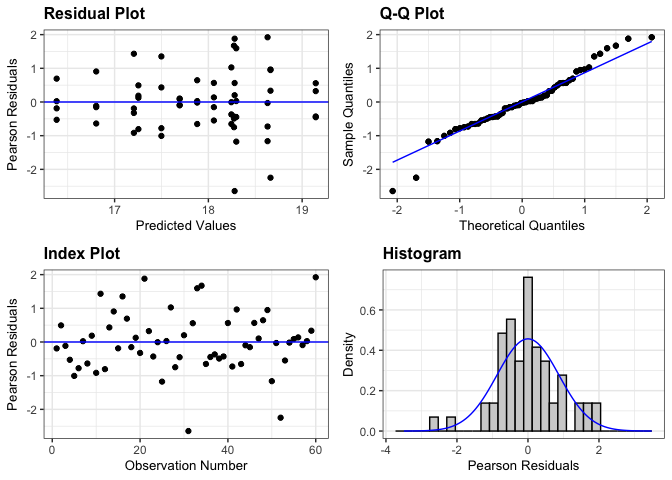
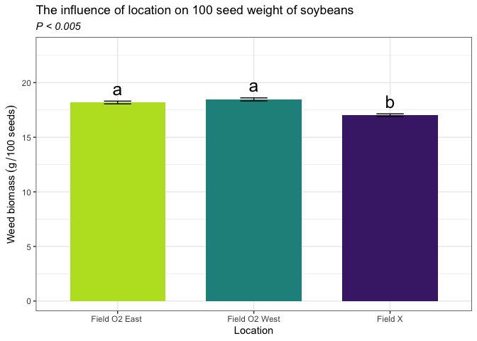

Soybean 100 Seed weight
================

# Load libraries

``` r
#Set work directory
setwd("/Users/ey239/Github/Mowtivation/rmarkdowns")

#Load packages 
library(tidyverse) ##install.packages("tidyverse")
library(knitr)
library(patchwork) ##install.packages("patchwork")
library(skimr)     ##install.packages("skimr")
library(readxl)
library(janitor) ##install.packages("janitor")
library(kableExtra) ##install.packages("kableExtra")
library(webshot) ##install.packages("webshot")
webshot::install_phantomjs()
library(viridis) ##install.packages("viridis")
library(lme4) ##install.packages("lme4")
library(lmerTest) ##install.packages("lmerTest")
library(emmeans) ##install.packages("emmeans")
library(rstatix) ##install.packages("rstatix")
#library(Matrix) ##install.packages("Matrix")
library(multcomp) ##install.packages("multcomp")
library(multcompView) ##install.packages("multcompView")
library(ggResidpanel) ##install.packages("ggResidpanel")
#library(car)
#library(TMB)  ##install.packages("TMB")
#library(glmmTMB)  ##install.packages("glmmTMB")
#library(DHARMa)  ##install.packages("DHARMa")

#Load Functions
MeanPlusSe<-function(x) mean(x)+plotrix::std.error(x)

find_logw0=function(x){c=trunc(log(min(x[x>0],na.rm=T)))
d=exp(c)
return(d)}
```

<br>

# Load and clean data

## Load data

``` r
combined_raw <- read_excel("~/Github/Mowtivation/raw-data/All Treatments/combined_raw.xlsx")
kable(head(combined_raw))
```

| id | location | year | treatment | block | plot | bean_emergence | bean_biomass | intrarow_weed_biomass | interrow_weed_biomass | weed_biomass | bean_population | bean_yield | seed_weight |
|:---|:---|---:|:---|---:|---:|---:|---:|---:|---:|---:|:---|:---|:---|
| CU_B1_P101 | field x | 2023 | TIM | 1 | 101 | 46.5 | 223.740 | 19.000 | 44.490 | 63.490 | 34.5 | 417.21 | 17.119999999999997 |
| CU_B1_P102 | field x | 2023 | TIC | 1 | 102 | 42.5 | 267.460 | 30.975 | 0.720 | 31.695 | 39.5 | 565.54 | 17.475000000000001 |
| CU_B1_P103 | field x | 2023 | RIM | 1 | 103 | 36.5 | 217.890 | 0.950 | 6.890 | 3.920 | 37.5 | 449.93 | 16.752499999999998 |
| CU_B1_P104 | field x | 2023 | RNO | 1 | 104 | 41.0 | 207.675 | 0.660 | 45.735 | 46.395 | 35 | 412.59 | 16.145 |
| CU_B1_P105 | field x | 2023 | RIC | 1 | 105 | 41.0 | 230.285 | 0.495 | 22.025 | 22.520 | 39 | 473.79 | 17.047499999999999 |
| CU_B1_P201 | field x | 2023 | RIC | 2 | 201 | 36.5 | 208.105 | 6.395 | 19.460 | 25.855 | 33.5 | 484.04 | 17.149999999999999 |

<br>

## Clean data

``` r
#Standardaze column names, convert to factors, check for outliers of variable**
clean_combined <- clean_names(combined_raw) |>  
  rename ('weed_control'= treatment) |> 
  mutate(across(c(weed_control, block, plot, location, year), as.factor)) #|> 
  #mutate(is_outlier = totwbm < (quantile(totwbm, 0.25) - 1.5 * IQR(totwbm)) |
                       #wbm > (quantile(totwbm, 0.75) + 1.5 * IQR(totwbm)))

#select and convert data for wbm analysis
  seed_weight_clean <- clean_combined |>  
    filter(!is.na(seed_weight)) |>
  mutate(seed_weight = as.numeric(seed_weight)) #|>  # Convert beanyd to numeric
```

    ## Warning: There was 1 warning in `mutate()`.
    ## ℹ In argument: `seed_weight = as.numeric(seed_weight)`.
    ## Caused by warning:
    ## ! NAs introduced by coercion

``` r
    # Exclude rows with NA in beanyd
  #mutate(
   # bean_yield_adj_bu_acre = (((bean_yield / 454) / (16.4 / 43560)) / 60) * ((100 - 0.00001) / (100 - 14)),
    #bean_yield_adj_lbs_acre = ((bean_yield / 454) / (16.4 / 43560)) * ((100 - 0.00001) / (100 - 14)),
    #bean_yield_adj_kg_ha = ((bean_yield / 454) / (16.4 / 43560)) * 1.12085 * ((100 - 0.00001) / (100 - 14))
  
kable(head(seed_weight_clean)) 
```

| id | location | year | weed_control | block | plot | bean_emergence | bean_biomass | intrarow_weed_biomass | interrow_weed_biomass | weed_biomass | bean_population | bean_yield | seed_weight |
|:---|:---|:---|:---|:---|:---|---:|---:|---:|---:|---:|:---|:---|---:|
| CU_B1_P101 | field x | 2023 | TIM | 1 | 101 | 46.5 | 223.740 | 19.000 | 44.490 | 63.490 | 34.5 | 417.21 | 17.1200 |
| CU_B1_P102 | field x | 2023 | TIC | 1 | 102 | 42.5 | 267.460 | 30.975 | 0.720 | 31.695 | 39.5 | 565.54 | 17.4750 |
| CU_B1_P103 | field x | 2023 | RIM | 1 | 103 | 36.5 | 217.890 | 0.950 | 6.890 | 3.920 | 37.5 | 449.93 | 16.7525 |
| CU_B1_P104 | field x | 2023 | RNO | 1 | 104 | 41.0 | 207.675 | 0.660 | 45.735 | 46.395 | 35 | 412.59 | 16.1450 |
| CU_B1_P105 | field x | 2023 | RIC | 1 | 105 | 41.0 | 230.285 | 0.495 | 22.025 | 22.520 | 39 | 473.79 | 17.0475 |
| CU_B1_P201 | field x | 2023 | RIC | 2 | 201 | 36.5 | 208.105 | 6.395 | 19.460 | 25.855 | 33.5 | 484.04 | 17.1500 |

# Model testing

## Lmer

Block is random Tyler is under the impression that block should always
be random and that post-hoc comparisons should use TUKEY rather the
Fischer. Fisher is bogus apparently.

``` r
random <- lmer( seed_weight  ~ location+weed_control + location:weed_control +(1|location:block) , data =  seed_weight_clean)
```

    ## boundary (singular) fit: see help('isSingular')

``` r
resid_panel(random)
```

<!-- -->

## Joint test (anova)

``` r
 random |> 
  joint_tests() |> 
  kable()  
```

|     | model term            | df1 |   df2 | F.ratio |   p.value |
|:----|:----------------------|----:|------:|--------:|----------:|
| 1   | location              |   2 |  8.64 |  55.421 | 0.0000118 |
| 3   | weed_control          |   4 | 35.04 |   7.117 | 0.0002645 |
| 2   | location:weed_control |   8 | 35.04 |   1.628 | 0.1522190 |

## Means comparison

### Weed-control (S)

``` r
means_weed_control <- emmeans(random, ~  weed_control)
pairwise_comparisons_weed_control<- pairs(means_weed_control) 
kable(head(pairwise_comparisons_weed_control))
```

| contrast  |   estimate |        SE |       df |    t.ratio |   p.value |
|:----------|-----------:|----------:|---------:|-----------:|----------:|
| RIC - RIM |  0.2777083 | 0.1900673 | 35.78415 |  1.4611053 | 0.6300145 |
| RIC - RNO |  0.5114583 | 0.1845467 | 35.03704 |  2.7714303 | 0.0520773 |
| RIC - TIC | -0.4020833 | 0.1845467 | 35.03704 | -2.1787619 | 0.1982810 |
| RIC - TIM | -0.0872917 | 0.1845467 | 35.03704 | -0.4730058 | 0.9977919 |
| RIM - RNO |  0.2337500 | 0.1900673 | 35.78415 |  1.2298276 | 0.7863036 |
| RIM - TIC | -0.6797917 | 0.1900673 | 35.78415 | -3.5765841 | 0.0061115 |

<br> \### Location (S)

``` r
means_location <- emmeans(random, ~  location)
pairwise_comparisons_location<- pairs(means_location) 
kable(head(pairwise_comparisons_location))
```

| contrast | estimate | SE | df | t.ratio | p.value |
|:---|---:|---:|---:|---:|---:|
| field O2 east - field O2 west | -0.275625 | 0.1455301 | 9.103669 | -1.893938 | 0.2473997 |
| field O2 east - field x | 1.156625 | 0.1429493 | 8.639269 | 8.091157 | 0.0000773 |
| field O2 west - field x | 1.432250 | 0.1455301 | 9.103669 | 9.841608 | 0.0000113 |

## Tukey compact letter display

### Weed-control (S)

``` r
cld_weed_control_tukey <-cld(emmeans(random, ~  weed_control, type = "response"), Letters = letters, sort = TRUE, reversed=TRUE)
```

    ## NOTE: Results may be misleading due to involvement in interactions

``` r
cld_weed_control_tukey
```

    ##  weed_control emmean    SE df lower.CL upper.CL .group
    ##  TIC            18.4 0.130 44     18.1     18.6  a    
    ##  TIM            18.0 0.130 44     17.8     18.3  ab   
    ##  RIC            18.0 0.130 44     17.7     18.2  abc  
    ##  RIM            17.7 0.138 44     17.4     18.0   bc  
    ##  RNO            17.4 0.130 44     17.2     17.7    c  
    ## 
    ## Results are averaged over the levels of: location 
    ## Degrees-of-freedom method: kenward-roger 
    ## Confidence level used: 0.95 
    ## P value adjustment: tukey method for comparing a family of 5 estimates 
    ## significance level used: alpha = 0.05 
    ## NOTE: If two or more means share the same grouping symbol,
    ##       then we cannot show them to be different.
    ##       But we also did not show them to be the same.

### Location (S)

``` r
cld_location_tukey <-cld(emmeans(random, ~  location, type = "response"), Letters = letters, sort = TRUE, reversed=TRUE)
```

    ## NOTE: Results may be misleading due to involvement in interactions

``` r
cld_location_tukey
```

    ##  location      emmean    SE   df lower.CL upper.CL .group
    ##  field O2 west   18.5 0.105 9.57     18.2     18.7  a    
    ##  field O2 east   18.2 0.101 8.64     18.0     18.4  a    
    ##  field x         17.0 0.101 8.64     16.8     17.3   b   
    ## 
    ## Results are averaged over the levels of: weed_control 
    ## Degrees-of-freedom method: kenward-roger 
    ## Confidence level used: 0.95 
    ## P value adjustment: tukey method for comparing a family of 3 estimates 
    ## significance level used: alpha = 0.05 
    ## NOTE: If two or more means share the same grouping symbol,
    ##       then we cannot show them to be different.
    ##       But we also did not show them to be the same.

<br> \# Figures

## Weed-control (S)

``` r
seed_weight_clean |> 
  left_join(cld_weed_control_tukey) |> 
  ggplot(aes(x = weed_control, y = seed_weight, fill = weed_control)) +
  stat_summary(geom = "bar", fun = "mean", width = 0.7) +
  stat_summary(geom = "errorbar", fun.data = "mean_se", width = 0.2) +
  stat_summary(geom="text", fun = "MeanPlusSe", aes(label= trimws(.group)),size=6.5,vjust=-0.5) +
  labs(
    x = "Interrow weed control",
     y = expression("100 seed weight " ~ (g ~ 100 ~ seeds^-1)),
  
    title = str_c("The influence of interrow weed control on 100 seed weight of soybeans"),
    subtitle = expression(italic("P < 0.005"))) +
  
  scale_x_discrete(labels = c("Rolled,\nhigh-residue\ncultivation",
                              "Rolled,\ninterrow\nmowing",
                              "Rolled,\nno additional\nweed control",
                          "Tilled,\nstandard\ncultivation",
                              "Tilled,\ninterrow\nmowing")) +
  scale_y_continuous(expand = expansion(mult = c(0.05, 0.3))) +
  scale_fill_viridis(discrete = TRUE, option = "D", direction = -1, end = 0.9, begin = 0.1) +
   theme_bw() +
  theme(
    legend.position = "none",
    strip.background = element_blank(),
    strip.text = element_text(face = "bold", size = 12)
  )
```

<!-- -->

``` r
ggsave("seedt_weigh_weed_control_.png", width = 8, height = 6, dpi = 300)
```

## Location (S)

``` r
seed_weight_clean |> 
  left_join(cld_location_tukey) |> 
  ggplot(aes(x = location, y = seed_weight, fill = location)) +
  stat_summary(geom = "bar", fun = "mean", width = 0.7) +
  stat_summary(geom = "errorbar", fun.data = "mean_se", width = 0.2) +
  stat_summary(geom="text", fun = "MeanPlusSe", aes(label= trimws(.group)),size=6.5,vjust=-0.5) +
  labs(
    x = "Location",
    y = expression("100 seed weight " ~ (g ~ 100 ~ seeds^-1)),
    title = str_c("The influence of location on 100 seed weight of soybeans"),
    subtitle = expression(italic("P < 0.005"))) +
   scale_x_discrete(labels = c("Field O2 East ",
                              "Field O2 West",
                              "Field X")) +
  scale_y_continuous(expand = expansion(mult = c(0.05, 0.3))) +
  scale_fill_viridis(discrete = TRUE, option = "D", direction = -1, end = 0.9, begin = 0.1) +
   theme_bw() +
  theme(
    legend.position = "none",
    strip.background = element_blank(),
    strip.text = element_text(face = "bold", size = 12)
  )
```

<!-- -->

``` r
ggsave("seed_weigjt_location.png", width = 8, height = 6, dpi = 300)
```
