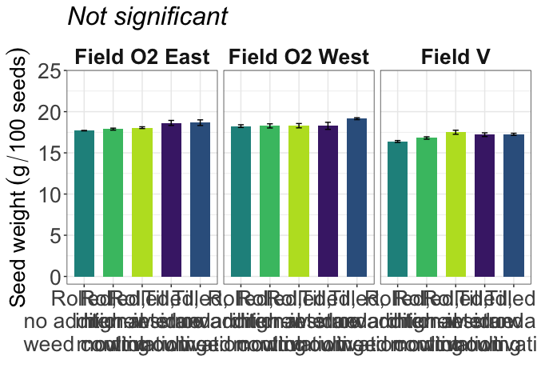

Soybean 100 Seed weight
================

# Load libraries

``` r
#Set work directory
setwd("/Users/ey239/Github/Mowtivation/rmarkdowns")

#Load packages 
library(tidyverse) ##install.packages("tidyverse")
library(knitr)
library(patchwork) ##install.packages("patchwork")
library(skimr)     ##install.packages("skimr")
library(readxl)
library(janitor) ##install.packages("janitor")
library(kableExtra) ##install.packages("kableExtra")
library(webshot) ##install.packages("webshot")
webshot::install_phantomjs()
library(viridis) ##install.packages("viridis")
library(lme4) ##install.packages("lme4")
library(lmerTest) ##install.packages("lmerTest")
library(emmeans) ##install.packages("emmeans")
library(rstatix) ##install.packages("rstatix")
#library(Matrix) ##install.packages("Matrix")
library(multcomp) ##install.packages("multcomp")
library(multcompView) ##install.packages("multcompView")
library(ggResidpanel) ##install.packages("ggResidpanel")
#library(car)
#library(TMB)  ##install.packages("TMB")
#library(glmmTMB)  ##install.packages("glmmTMB")
library(DHARMa)  ##install.packages("DHARMa")
library(performance) ##install.packages("performance")
#Load Functions
MeanPlusSe<-function(x) mean(x)+plotrix::std.error(x)

find_logw0=function(x){c=trunc(log(min(x[x>0],na.rm=T)))
d=exp(c)
return(d)}
```

<br>

# Load and clean data

## Load data

``` r
combined_raw <- read_excel("~/Github/Mowtivation/raw-data/All Treatments/combined_raw.xlsx")
kable(head(combined_raw))
```

| id | location | year | treatment | block | plot | bean_emergence | bean_biomass | intrarow_weed_biomass | interrow_weed_biomass | weed_biomass | bean_population | bean_yield | seed_weight |
|:---|:---|---:|:---|---:|---:|---:|---:|---:|---:|---:|---:|---:|---:|
| CU_B1_P101 | field v | 2023 | TIM | 1 | 101 | 46.5 | 223.740 | 19.000 | 44.490 | 63.490 | 34.5 | 417.21 | 17.1200 |
| CU_B1_P102 | field v | 2023 | TIC | 1 | 102 | 42.5 | 267.460 | 30.975 | 0.720 | 31.695 | 39.5 | 565.54 | 17.4750 |
| CU_B1_P103 | field v | 2023 | RIM | 1 | 103 | 36.5 | 217.890 | 0.950 | 6.890 | 7.840 | 37.5 | 449.93 | 16.7525 |
| CU_B1_P104 | field v | 2023 | RNO | 1 | 104 | 41.0 | 207.675 | 0.660 | 45.735 | 46.395 | 35.0 | 412.59 | 16.1450 |
| CU_B1_P105 | field v | 2023 | RIC | 1 | 105 | 41.0 | 230.285 | 0.495 | 22.025 | 22.520 | 39.0 | 473.79 | 17.0475 |
| CU_B1_P201 | field v | 2023 | RIC | 2 | 201 | 36.5 | 208.105 | 6.395 | 19.460 | 25.855 | 33.5 | 484.04 | 17.1500 |

<br>

## Clean data

``` r
#Standardaze column names, convert to factors, check for outliers of variable**
clean_combined <- clean_names(combined_raw) |>  
  rename ('weed_control'= treatment) |> 
  mutate(across(c(weed_control, block, plot, location, year), as.factor)) #|> 
  #mutate(is_outlier = totwbm < (quantile(totwbm, 0.25) - 1.5 * IQR(totwbm)) |
                       #wbm > (quantile(totwbm, 0.75) + 1.5 * IQR(totwbm)))

#select and convert data for wbm analysis
  seed_weight_clean <- clean_combined |>  
    filter(!is.na(seed_weight)) |>
  mutate(seed_weight = as.numeric(seed_weight)) #|>  # Convert beanyd to numeric
    # Exclude rows with NA in beanyd
  #mutate(
   # bean_yield_adj_bu_acre = (((bean_yield / 454) / (16.4 / 43560)) / 60) * ((100 - 0.00001) / (100 - 14)),
    #bean_yield_adj_lbs_acre = ((bean_yield / 454) / (16.4 / 43560)) * ((100 - 0.00001) / (100 - 14)),
    #bean_yield_adj_kg_ha = ((bean_yield / 454) / (16.4 / 43560)) * 1.12085 * ((100 - 0.00001) / (100 - 14))
  
kable(head(seed_weight_clean)) 
```

| id | location | year | weed_control | block | plot | bean_emergence | bean_biomass | intrarow_weed_biomass | interrow_weed_biomass | weed_biomass | bean_population | bean_yield | seed_weight |
|:---|:---|:---|:---|:---|:---|---:|---:|---:|---:|---:|---:|---:|---:|
| CU_B1_P101 | field v | 2023 | TIM | 1 | 101 | 46.5 | 223.740 | 19.000 | 44.490 | 63.490 | 34.5 | 417.21 | 17.1200 |
| CU_B1_P102 | field v | 2023 | TIC | 1 | 102 | 42.5 | 267.460 | 30.975 | 0.720 | 31.695 | 39.5 | 565.54 | 17.4750 |
| CU_B1_P103 | field v | 2023 | RIM | 1 | 103 | 36.5 | 217.890 | 0.950 | 6.890 | 7.840 | 37.5 | 449.93 | 16.7525 |
| CU_B1_P104 | field v | 2023 | RNO | 1 | 104 | 41.0 | 207.675 | 0.660 | 45.735 | 46.395 | 35.0 | 412.59 | 16.1450 |
| CU_B1_P105 | field v | 2023 | RIC | 1 | 105 | 41.0 | 230.285 | 0.495 | 22.025 | 22.520 | 39.0 | 473.79 | 17.0475 |
| CU_B1_P201 | field v | 2023 | RIC | 2 | 201 | 36.5 | 208.105 | 6.395 | 19.460 | 25.855 | 33.5 | 484.04 | 17.1500 |

# Model testing

## Lmer

Block is random Tyler is under the impression that block should always
be random and that post-hoc comparisons should use TUKEY rather the
Fischer. Fisher is bogus apparently.

``` r
weight.lmer <- lmer( seed_weight  ~ weed_control*location + (1|location:block), data =  seed_weight_clean)
```

    ## boundary (singular) fit: see help('isSingular')

``` r
resid_panel(weight.lmer)
```

<!-- -->

``` r
simulateResiduals(weight.lmer,plot = TRUE) # Residuals and normality look good
```

<!-- -->

    ## Object of Class DHARMa with simulated residuals based on 250 simulations with refit = FALSE . See ?DHARMa::simulateResiduals for help. 
    ##  
    ## Scaled residual values: 0.428 0.72 0.452 0.328 0.2 0.224 0.504 0.24 0.584 0.156 0.94 0.2 0.684 0.82 0.416 0.92 0.708 0.412 0.584 0.36 ...

``` r
check_model(weight.lmer)
```

<!-- -->

## Joint test (anova)

\##Joint test (anova)

``` r
joint_tests(emmeans(weight.lmer, ~ weed_control * location))
```

    ##  model term            df1 df2 F.ratio p.value
    ##  weed_control            4  36   7.462  0.0002
    ##  location                2   9  56.766  <.0001
    ##  weed_control:location   8  36   1.638  0.1484

``` r
options(contrasts = c("contr.sum", "contr.poly"))
weight.anova <- anova(weight.lmer, ddf = "Satterthwaite")
print(weight.anova)
```

    ## Type III Analysis of Variance Table with Satterthwaite's method
    ##                        Sum Sq Mean Sq NumDF DenDF F value    Pr(>F)    
    ## weed_control           5.9969  1.4992     4    45  7.4622 0.0001064 ***
    ## location              22.8096 11.4048     2    45 56.7661  4.95e-13 ***
    ## weed_control:location  2.6327  0.3291     8    45  1.6380 0.1408979    
    ## ---
    ## Signif. codes:  0 '***' 0.001 '**' 0.01 '*' 0.05 '.' 0.1 ' ' 1

br\>

## Tukey means comparisons

### Weed-control (significant)

``` r
tukey_weed_control <- emmeans(weight.lmer, pairwise ~ weed_control, adjust = "tukey")
```

    ## NOTE: Results may be misleading due to involvement in interactions

``` r
tukey_weed_control
```

    ## $emmeans
    ##  weed_control emmean    SE df lower.CL upper.CL
    ##  RIC            18.0 0.129 45     17.7     18.2
    ##  RIM            17.7 0.129 45     17.4     17.9
    ##  RNO            17.4 0.129 45     17.2     17.7
    ##  TIC            18.4 0.129 45     18.1     18.6
    ##  TIM            18.0 0.129 45     17.8     18.3
    ## 
    ## Results are averaged over the levels of: location 
    ## Degrees-of-freedom method: kenward-roger 
    ## Confidence level used: 0.95 
    ## 
    ## $contrasts
    ##  contrast  estimate    SE df t.ratio p.value
    ##  RIC - RIM   0.2992 0.183 36   1.635  0.4857
    ##  RIC - RNO   0.5115 0.183 36   2.795  0.0595
    ##  RIC - TIC  -0.4021 0.183 36  -2.197  0.2039
    ##  RIC - TIM  -0.0873 0.183 36  -0.477  0.9890
    ##  RIM - RNO   0.2123 0.183 36   1.160  0.7735
    ##  RIM - TIC  -0.7013 0.183 36  -3.832  0.0042
    ##  RIM - TIM  -0.3865 0.183 36  -2.112  0.2373
    ##  RNO - TIC  -0.9135 0.183 36  -4.992  0.0001
    ##  RNO - TIM  -0.5988 0.183 36  -3.272  0.0188
    ##  TIC - TIM   0.3148 0.183 36   1.720  0.4348
    ## 
    ## Results are averaged over the levels of: location 
    ## Degrees-of-freedom method: kenward-roger 
    ## P value adjustment: tukey method for comparing a family of 5 estimates

``` r
cld_weed_control_tukey <- cld(emmeans(weight.lmer, ~ weed_control), adjust = "tukey", Letters = letters, sort = TRUE, reversed = TRUE)
```

    ## NOTE: Results may be misleading due to involvement in interactions

    ## Note: adjust = "tukey" was changed to "sidak"
    ## because "tukey" is only appropriate for one set of pairwise comparisons

``` r
cld_weed_control_tukey
```

    ##  weed_control emmean    SE df lower.CL upper.CL .group
    ##  TIC            18.4 0.129 45     18.0     18.7  a    
    ##  TIM            18.0 0.129 45     17.7     18.4  ab   
    ##  RIC            18.0 0.129 45     17.6     18.3  abc  
    ##  RIM            17.7 0.129 45     17.3     18.0   bc  
    ##  RNO            17.4 0.129 45     17.1     17.8    c  
    ## 
    ## Results are averaged over the levels of: location 
    ## Degrees-of-freedom method: kenward-roger 
    ## Confidence level used: 0.95 
    ## Conf-level adjustment: sidak method for 5 estimates 
    ## P value adjustment: tukey method for comparing a family of 5 estimates 
    ## significance level used: alpha = 0.05 
    ## NOTE: If two or more means share the same grouping symbol,
    ##       then we cannot show them to be different.
    ##       But we also did not show them to be the same.

<br>

### Location (Significant)

``` r
tukey_location <- emmeans(weight.lmer, list(pairwise ~ location), adjust = "tukey")
```

    ## NOTE: Results may be misleading due to involvement in interactions

``` r
tukey_location
```

    ## $`emmeans of location`
    ##  location      emmean  SE df lower.CL upper.CL
    ##  field O2 east   18.2 0.1  9     18.0     18.4
    ##  field O2 west   18.4 0.1  9     18.2     18.7
    ##  field v         17.0 0.1  9     16.8     17.3
    ## 
    ## Results are averaged over the levels of: weed_control 
    ## Degrees-of-freedom method: kenward-roger 
    ## Confidence level used: 0.95 
    ## 
    ## $`pairwise differences of location`
    ##  1                             estimate    SE df t.ratio p.value
    ##  field O2 east - field O2 west   -0.263 0.142  9  -1.854  0.2074
    ##  field O2 east - field v          1.157 0.142  9   8.160  0.0001
    ##  field O2 west - field v          1.419 0.142  9  10.014  <.0001
    ## 
    ## Results are averaged over the levels of: weed_control 
    ## Degrees-of-freedom method: kenward-roger 
    ## P value adjustment: tukey method for comparing a family of 3 estimates

``` r
cld_location_tukey <- cld(emmeans(weight.lmer, ~ location), adjust = "tukey", Letters = letters, sort = TRUE, reversed = TRUE)
```

    ## NOTE: Results may be misleading due to involvement in interactions

    ## Note: adjust = "tukey" was changed to "sidak"
    ## because "tukey" is only appropriate for one set of pairwise comparisons

``` r
cld_location_tukey
```

    ##  location      emmean  SE df lower.CL upper.CL .group
    ##  field O2 west   18.4 0.1  9     18.2     18.7  a    
    ##  field O2 east   18.2 0.1  9     17.9     18.5  a    
    ##  field v         17.0 0.1  9     16.7     17.3   b   
    ## 
    ## Results are averaged over the levels of: weed_control 
    ## Degrees-of-freedom method: kenward-roger 
    ## Confidence level used: 0.95 
    ## Conf-level adjustment: sidak method for 3 estimates 
    ## P value adjustment: tukey method for comparing a family of 3 estimates 
    ## significance level used: alpha = 0.05 
    ## NOTE: If two or more means share the same grouping symbol,
    ##       then we cannot show them to be different.
    ##       But we also did not show them to be the same.

\###weed_control:location (not significant)

``` r
tukey_weed_control_location <- emmeans(weight.lmer, list(pairwise ~ weed_control|location), adjust = "tukey")
tukey_weed_control_location
```

    ## $`emmeans of weed_control | location`
    ## location = field O2 east:
    ##  weed_control emmean    SE df lower.CL upper.CL
    ##  RIC            18.1 0.224 45     17.6     18.5
    ##  RIM            17.9 0.224 45     17.4     18.3
    ##  RNO            17.7 0.224 45     17.2     18.1
    ##  TIC            18.7 0.224 45     18.2     19.1
    ##  TIM            18.6 0.224 45     18.2     19.1
    ## 
    ## location = field O2 west:
    ##  weed_control emmean    SE df lower.CL upper.CL
    ##  RIC            18.3 0.224 45     17.8     18.7
    ##  RIM            18.3 0.224 45     17.8     18.7
    ##  RNO            18.2 0.224 45     17.8     18.7
    ##  TIC            19.1 0.224 45     18.7     19.6
    ##  TIM            18.3 0.224 45     17.8     18.7
    ## 
    ## location = field v:
    ##  weed_control emmean    SE df lower.CL upper.CL
    ##  RIC            17.5 0.224 45     17.0     18.0
    ##  RIM            16.8 0.224 45     16.4     17.3
    ##  RNO            16.4 0.224 45     15.9     16.8
    ##  TIC            17.3 0.224 45     16.8     17.7
    ##  TIM            17.2 0.224 45     16.8     17.7
    ## 
    ## Degrees-of-freedom method: kenward-roger 
    ## Confidence level used: 0.95 
    ## 
    ## $`pairwise differences of weed_control | location`
    ## location = field O2 east:
    ##  2         estimate    SE df t.ratio p.value
    ##  RIC - RIM  0.17813 0.317 36   0.562  0.9797
    ##  RIC - RNO  0.36500 0.317 36   1.152  0.7781
    ##  RIC - TIC -0.60375 0.317 36  -1.905  0.3332
    ##  RIC - TIM -0.57250 0.317 36  -1.806  0.3858
    ##  RIM - RNO  0.18688 0.317 36   0.590  0.9758
    ##  RIM - TIC -0.78187 0.317 36  -2.467  0.1211
    ##  RIM - TIM -0.75062 0.317 36  -2.368  0.1475
    ##  RNO - TIC -0.96875 0.317 36  -3.057  0.0321
    ##  RNO - TIM -0.93750 0.317 36  -2.958  0.0407
    ##  TIC - TIM  0.03125 0.317 36   0.099  1.0000
    ## 
    ## location = field O2 west:
    ##  2         estimate    SE df t.ratio p.value
    ##  RIC - RIM  0.02438 0.317 36   0.077  1.0000
    ##  RIC - RNO  0.05250 0.317 36   0.166  0.9998
    ##  RIC - TIC -0.84750 0.317 36  -2.674  0.0781
    ##  RIC - TIM  0.01750 0.317 36   0.055  1.0000
    ##  RIM - RNO  0.02813 0.317 36   0.089  1.0000
    ##  RIM - TIC -0.87187 0.317 36  -2.751  0.0658
    ##  RIM - TIM -0.00688 0.317 36  -0.022  1.0000
    ##  RNO - TIC -0.90000 0.317 36  -2.840  0.0538
    ##  RNO - TIM -0.03500 0.317 36  -0.110  1.0000
    ##  TIC - TIM  0.86500 0.317 36   2.729  0.0691
    ## 
    ## location = field v:
    ##  2         estimate    SE df t.ratio p.value
    ##  RIC - RIM  0.69500 0.317 36   2.193  0.2055
    ##  RIC - RNO  1.11688 0.317 36   3.524  0.0097
    ##  RIC - TIC  0.24500 0.317 36   0.773  0.9367
    ##  RIC - TIM  0.29313 0.317 36   0.925  0.8854
    ##  RIM - RNO  0.42188 0.317 36   1.331  0.6741
    ##  RIM - TIC -0.45000 0.317 36  -1.420  0.6193
    ##  RIM - TIM -0.40187 0.317 36  -1.268  0.7120
    ##  RNO - TIC -0.87187 0.317 36  -2.751  0.0658
    ##  RNO - TIM -0.82375 0.317 36  -2.599  0.0918
    ##  TIC - TIM  0.04813 0.317 36   0.152  0.9999
    ## 
    ## Degrees-of-freedom method: kenward-roger 
    ## P value adjustment: tukey method for comparing a family of 5 estimates

``` r
cld_weed_control_location_tukey <- cld(emmeans(weight.lmer, ~ weed_control|location), adjust = "tukey", Letters = letters, sort = TRUE, reversed = TRUE)
```

    ## Note: adjust = "tukey" was changed to "sidak"
    ## because "tukey" is only appropriate for one set of pairwise comparisons

``` r
cld_weed_control_location_tukey
```

    ## location = field O2 east:
    ##  weed_control emmean    SE df lower.CL upper.CL .group
    ##  TIC            18.7 0.224 45     18.1     19.3  a    
    ##  TIM            18.6 0.224 45     18.0     19.2  a    
    ##  RIC            18.1 0.224 45     17.5     18.7  ab   
    ##  RIM            17.9 0.224 45     17.3     18.5  ab   
    ##  RNO            17.7 0.224 45     17.1     18.3   b   
    ## 
    ## location = field O2 west:
    ##  weed_control emmean    SE df lower.CL upper.CL .group
    ##  TIC            19.1 0.224 45     18.5     19.7  a    
    ##  RIC            18.3 0.224 45     17.7     18.9  a    
    ##  TIM            18.3 0.224 45     17.7     18.9  a    
    ##  RIM            18.3 0.224 45     17.7     18.9  a    
    ##  RNO            18.2 0.224 45     17.6     18.8  a    
    ## 
    ## location = field v:
    ##  weed_control emmean    SE df lower.CL upper.CL .group
    ##  RIC            17.5 0.224 45     16.9     18.1  a    
    ##  TIC            17.3 0.224 45     16.7     17.9  ab   
    ##  TIM            17.2 0.224 45     16.6     17.8  ab   
    ##  RIM            16.8 0.224 45     16.2     17.4  ab   
    ##  RNO            16.4 0.224 45     15.8     17.0   b   
    ## 
    ## Degrees-of-freedom method: kenward-roger 
    ## Confidence level used: 0.95 
    ## Conf-level adjustment: sidak method for 5 estimates 
    ## P value adjustment: tukey method for comparing a family of 5 estimates 
    ## significance level used: alpha = 0.05 
    ## NOTE: If two or more means share the same grouping symbol,
    ##       then we cannot show them to be different.
    ##       But we also did not show them to be the same.

<br> \# Figures

#### weed_control:location (not significant)

``` r
seed_weight_clean |> 
  left_join(cld_weed_control_location_tukey ) |> 
  ggplot(aes(x = factor(weed_control, levels = c("RNO", "RIM", "RIC", "TIM", "TIC")), y = seed_weight, fill = weed_control)) +
  facet_wrap( ~location, labeller = labeller(
    location = c("field O2 east" = "Field O2 East", "field O2 west" = "Field O2 West","field v" = "Field V" )))+
  stat_summary(geom = "bar", fun = "mean", width = 0.7) +
  stat_summary(geom = "errorbar", fun.data = "mean_se", width = 0.2) +
  #stat_summary(geom="text", fun = "MeanPlusSe", aes(label= trimws(.group)),size=6.5,vjust=-0.5) +
  labs(
    x = "",
     y = expression("Seed weight" ~ (g/100 ~ seeds)),

    #title = str_c("The influence of interrow weed control on soybean yield"),
    subtitle = expression(italic("Not significant"))) +
  
  scale_x_discrete(labels = c("Rolled,\nno additional\nweed control",
                              "Rolled,\ninterrow\nmowing",
                              "Rolled,\nhigh-residue\ncultivation",
                              "Tilled,\ninterrow\nmowing",
                          "Tilled,\nstandard\ncultivation")) +
  scale_y_continuous(
  labels = scales::label_comma(),
  expand = expansion(mult = c(0.05, 0.3))
) +
  scale_fill_viridis(discrete = TRUE, option = "D", direction = -1, end = 0.9, begin = 0.1) +
   theme_bw() +
  theme(
    legend.position = "none",
    strip.background = element_blank(),
    strip.text = element_text(face = "bold", size = 20),
    axis.title = element_text(size = 20),  # Increase font size of axis titles
    axis.text = element_text(size = 20),   # Increase font size of axis labels
    plot.title = element_text(size = 24, face = "bold"),  # Increase font size of title
    plot.subtitle = element_text(size = 24, face = "italic")  # Increase font size of subtitle
  )
```

<!-- -->

``` r
ggsave("seed_weight_weed_control_location_kgha.png", width = 24, height = 8, dpi = 300)
```
