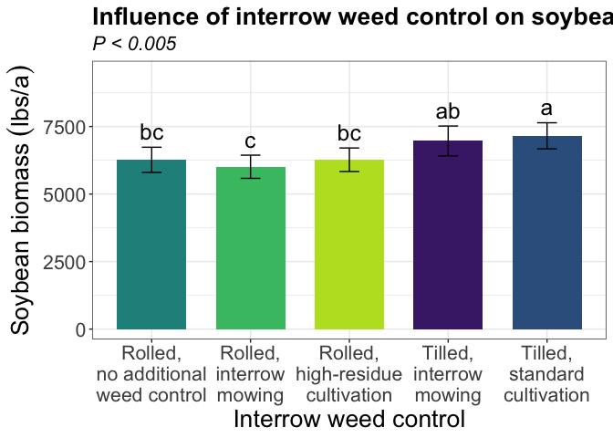
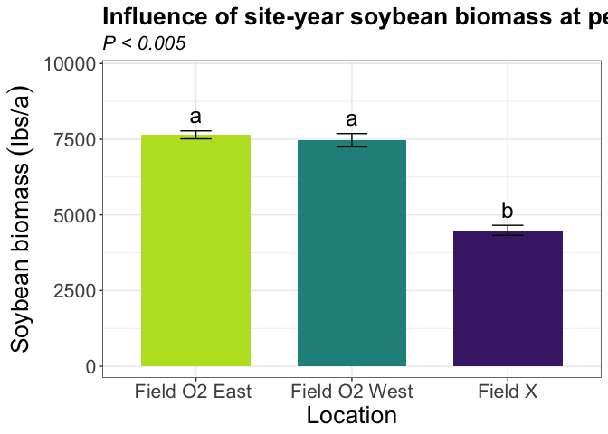
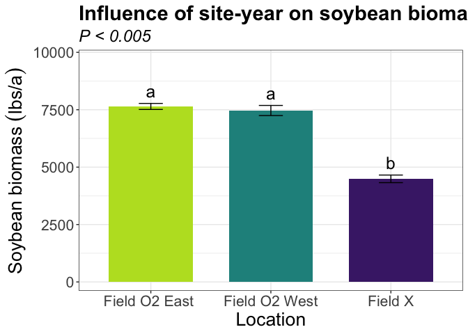

Soybean biomass
================

# Load libraries

``` r
#Set work directory
setwd("/Users/ey239/Github/Mowtivation/rmarkdowns")

#Load packages 
library(tidyverse) ##install.packages("tidyverse")
library(knitr)
library(patchwork) ##install.packages("patchwork")
library(skimr)     ##install.packages("skimr")
library(readxl)
library(janitor) ##install.packages("janitor")

library(kableExtra) ##install.packages("kableExtra")
library(webshot) ##install.packages("webshot")
webshot::install_phantomjs()
library(viridis) ##install.packages("viridis")
library(lme4) ##install.packages("lme4")
library(lmerTest) ##install.packages("lmerTest")
library(emmeans) ##install.packages("emmeans")
library(rstatix) ##install.packages("rstatix")
#library(Matrix) ##install.packages("Matrix")
library(multcomp) ##install.packages("multcomp")
library(multcompView) ##install.packages("multcompView")
library(ggResidpanel) ##install.packages("ggResidpanel")
#library(car)
#library(TMB)  ##install.packages("TMB")
#library(glmmTMB)  ##install.packages("glmmTMB")
#library(DHARMa)  ##install.packages("DHARMa")

#Load Functions
MeanPlusSe<-function(x) mean(x)+plotrix::std.error(x)

find_logw0=function(x){c=trunc(log(min(x[x>0],na.rm=T)))
d=exp(c)
return(d)}
```

<br>

# Load and clean data

## Load data

``` r
combined_raw <- read_excel("~/Github/Mowtivation/raw-data/All Treatments/combined_raw.xlsx")
kable(head(combined_raw))
```

| id | location | year | treatment | block | plot | bean_emergence | bean_biomass | intrarow_weed_biomass | interrow_weed_biomass | weed_biomass | bean_population | bean_yield | seed_weight |
|:---|:---|---:|:---|---:|---:|---:|---:|---:|---:|---:|:---|:---|:---|
| CU_B1_P101 | field x | 2023 | TIM | 1 | 101 | 46.5 | 223.740 | 19.000 | 44.490 | 63.490 | 34.5 | 417.21 | 17.119999999999997 |
| CU_B1_P102 | field x | 2023 | TIC | 1 | 102 | 42.5 | 267.460 | 30.975 | 0.720 | 31.695 | 39.5 | 565.54 | 17.475000000000001 |
| CU_B1_P103 | field x | 2023 | RIM | 1 | 103 | 36.5 | 217.890 | 0.950 | 6.890 | 3.920 | 37.5 | 449.93 | 16.752499999999998 |
| CU_B1_P104 | field x | 2023 | RNO | 1 | 104 | 41.0 | 207.675 | 0.660 | 45.735 | 46.395 | 35 | 412.59 | 16.145 |
| CU_B1_P105 | field x | 2023 | RIC | 1 | 105 | 41.0 | 230.285 | 0.495 | 22.025 | 22.520 | 39 | 473.79 | 17.047499999999999 |
| CU_B1_P201 | field x | 2023 | RIC | 2 | 201 | 36.5 | 208.105 | 6.395 | 19.460 | 25.855 | 33.5 | 484.04 | 17.149999999999999 |

\#Clean data

``` r
#Standardaze column names, convert to factors, check for outliers of variable**
clean_combined <- clean_names(combined_raw) |>  
  rename ('weed_control'= treatment) |> 
  mutate(across(c(weed_control, block, plot, location, year), as.factor)) #|> 
  #mutate(is_outlier = totwbm < (quantile(totwbm, 0.25) - 1.5 * IQR(totwbm)) |
                       #wbm > (quantile(totwbm, 0.75) + 1.5 * IQR(totwbm)))

#select and convert data for wbm analysis
bean_biomass_clean <-clean_combined |>              
  mutate(bean_biomass_grams_meter = (bean_biomass * 2)) |> 
  mutate(bean_biomass_kg_ha = ((bean_biomass/0.5) *(10000))/(1000)) |>
  mutate(bean_biomass_lbs_ac = (((bean_biomass/0.5) *(10000))/(1000))* 0.892179)
kable(head(bean_biomass_clean)) 
```

| id | location | year | weed_control | block | plot | bean_emergence | bean_biomass | intrarow_weed_biomass | interrow_weed_biomass | weed_biomass | bean_population | bean_yield | seed_weight | bean_biomass_grams_meter | bean_biomass_kg_ha | bean_biomass_lbs_ac |
|:---|:---|:---|:---|:---|:---|---:|---:|---:|---:|---:|:---|:---|:---|---:|---:|---:|
| CU_B1_P101 | field x | 2023 | TIM | 1 | 101 | 46.5 | 223.740 | 19.000 | 44.490 | 63.490 | 34.5 | 417.21 | 17.119999999999997 | 447.48 | 4474.8 | 3992.323 |
| CU_B1_P102 | field x | 2023 | TIC | 1 | 102 | 42.5 | 267.460 | 30.975 | 0.720 | 31.695 | 39.5 | 565.54 | 17.475000000000001 | 534.92 | 5349.2 | 4772.444 |
| CU_B1_P103 | field x | 2023 | RIM | 1 | 103 | 36.5 | 217.890 | 0.950 | 6.890 | 3.920 | 37.5 | 449.93 | 16.752499999999998 | 435.78 | 4357.8 | 3887.938 |
| CU_B1_P104 | field x | 2023 | RNO | 1 | 104 | 41.0 | 207.675 | 0.660 | 45.735 | 46.395 | 35 | 412.59 | 16.145 | 415.35 | 4153.5 | 3705.665 |
| CU_B1_P105 | field x | 2023 | RIC | 1 | 105 | 41.0 | 230.285 | 0.495 | 22.025 | 22.520 | 39 | 473.79 | 17.047499999999999 | 460.57 | 4605.7 | 4109.109 |
| CU_B1_P201 | field x | 2023 | RIC | 2 | 201 | 36.5 | 208.105 | 6.395 | 19.460 | 25.855 | 33.5 | 484.04 | 17.149999999999999 | 416.21 | 4162.1 | 3713.338 |

<br> \# Model testing

Block is random Tyler is under the impression that block should always
be random and that post-hoc comparisons should use TUKEY rather the
Fischer. Fisher is bogus apparently.

## Lmer

``` r
random <- lmer(bean_biomass_lbs_ac  ~ location+weed_control + location:weed_control +(1|location:block) , data =bean_biomass_clean)

resid_panel(random)
```

<!-- --> \##
Summary

``` r
summary(random)
```

    ## Linear mixed model fit by REML. t-tests use Satterthwaite's method [
    ## lmerModLmerTest]
    ## Formula: 
    ## bean_biomass_lbs_ac ~ location + weed_control + location:weed_control +  
    ##     (1 | location:block)
    ##    Data: bean_biomass_clean
    ## 
    ## REML criterion at convergence: 729.7
    ## 
    ## Scaled residuals: 
    ##      Min       1Q   Median       3Q      Max 
    ## -1.75210 -0.52112 -0.08177  0.65947  2.12075 
    ## 
    ## Random effects:
    ##  Groups         Name        Variance Std.Dev.
    ##  location:block (Intercept)  68309   261.4   
    ##  Residual                   354984   595.8   
    ## Number of obs: 60, groups:  location:block, 12
    ## 
    ## Fixed effects:
    ##                                       Estimate Std. Error       df t value
    ## (Intercept)                            7534.21     325.30    40.75  23.160
    ## locationfield O2 west                  -870.66     460.05    40.75  -1.893
    ## locationfield x                       -2923.76     460.05    40.75  -6.355
    ## weed_controlRIM                        -342.37     421.30    36.00  -0.813
    ## weed_controlRNO                         -71.20     421.30    36.00  -0.169
    ## weed_controlTIC                         386.94     421.30    36.00   0.918
    ## weed_controlTIM                         572.58     421.30    36.00   1.359
    ## locationfield O2 west:weed_controlRIM   453.72     595.81    36.00   0.762
    ## locationfield x:weed_controlRIM        -206.54     595.81    36.00  -0.347
    ## locationfield O2 west:weed_controlRNO   523.91     595.81    36.00   0.879
    ## locationfield x:weed_controlRNO        -317.86     595.81    36.00  -0.533
    ## locationfield O2 west:weed_controlTIC  1465.23     595.81    36.00   2.459
    ## locationfield x:weed_controlTIC          32.03     595.81    36.00   0.054
    ## locationfield O2 west:weed_controlTIM  1026.79     595.81    36.00   1.723
    ## locationfield x:weed_controlTIM        -657.34     595.81    36.00  -1.103
    ##                                       Pr(>|t|)    
    ## (Intercept)                            < 2e-16 ***
    ## locationfield O2 west                   0.0655 .  
    ## locationfield x                       1.39e-07 ***
    ## weed_controlRIM                         0.4218    
    ## weed_controlRNO                         0.8667    
    ## weed_controlTIC                         0.3645    
    ## weed_controlTIM                         0.1826    
    ## locationfield O2 west:weed_controlRIM   0.4513    
    ## locationfield x:weed_controlRIM         0.7309    
    ## locationfield O2 west:weed_controlRNO   0.3851    
    ## locationfield x:weed_controlRNO         0.5970    
    ## locationfield O2 west:weed_controlTIC   0.0189 *  
    ## locationfield x:weed_controlTIC         0.9574    
    ## locationfield O2 west:weed_controlTIM   0.0934 .  
    ## locationfield x:weed_controlTIM         0.2772    
    ## ---
    ## Signif. codes:  0 '***' 0.001 '**' 0.01 '*' 0.05 '.' 0.1 ' ' 1

    ## 
    ## Correlation matrix not shown by default, as p = 15 > 12.
    ## Use print(x, correlation=TRUE)  or
    ##     vcov(x)        if you need it

``` r
bean_biomass_clean |> count(year,location,weed_control)
```

    ## # A tibble: 15 × 4
    ##    year  location      weed_control     n
    ##    <fct> <fct>         <fct>        <int>
    ##  1 2023  field x       RIC              4
    ##  2 2023  field x       RIM              4
    ##  3 2023  field x       RNO              4
    ##  4 2023  field x       TIC              4
    ##  5 2023  field x       TIM              4
    ##  6 2024  field O2 east RIC              4
    ##  7 2024  field O2 east RIM              4
    ##  8 2024  field O2 east RNO              4
    ##  9 2024  field O2 east TIC              4
    ## 10 2024  field O2 east TIM              4
    ## 11 2024  field O2 west RIC              4
    ## 12 2024  field O2 west RIM              4
    ## 13 2024  field O2 west RNO              4
    ## 14 2024  field O2 west TIC              4
    ## 15 2024  field O2 west TIM              4

## Joint test (anova)

``` r
random |> 
  joint_tests() |> 
  kable()  
```

|     | model term            | df1 | df2 | F.ratio |   p.value |
|:----|:----------------------|----:|----:|--------:|----------:|
| 1   | location              |   2 |   9 |  90.159 | 0.0000011 |
| 3   | weed_control          |   4 |  36 |   8.355 | 0.0000711 |
| 2   | location:weed_control |   8 |  36 |   1.574 | 0.1670857 |

<br>

## Means comparison

### Weed-control (Significant)

``` r
means_weed_control <- emmeans(random, ~  weed_control)
pairwise_comparisons_weed_control<- pairs(means_weed_control) 
kable(head(pairwise_comparisons_weed_control))
```

| contrast  |     estimate |       SE |  df |    t.ratio |   p.value |
|:----------|-------------:|---------:|----:|-----------:|----------:|
| RIC - RIM |   259.980961 | 243.2365 |  36 |  1.0688401 | 0.8743232 |
| RIC - RNO |     2.512971 | 243.2365 |  36 |  0.0103314 | 1.0000000 |
| RIC - TIC |  -886.022965 | 243.2365 |  36 | -3.6426393 | 0.0050473 |
| RIC - TIM |  -695.728619 | 243.2365 |  36 | -2.8602965 | 0.0412881 |
| RIM - RNO |  -257.467990 | 243.2365 |  36 | -1.0585087 | 0.8791639 |
| RIM - TIC | -1146.003925 | 243.2365 |  36 | -4.7114793 | 0.0002169 |

<br>

### Location (Significant)

``` r
means_location <- emmeans(random, ~  location)
pairwise_comparisons_location<- pairs(means_location) 
kable(head(pairwise_comparisons_location))
```

| contrast                      |  estimate |       SE |  df |    t.ratio |   p.value |
|:------------------------------|----------:|---------:|----:|-----------:|----------:|
| field O2 east - field O2 west |  176.7273 | 263.9183 |   9 |  0.6696287 | 0.8893405 |
| field O2 east - field x       | 3153.7011 | 263.9183 |   9 | 11.9495341 | 0.0000024 |
| field O2 west - field x       | 2976.9738 | 263.9183 |   9 | 11.2799054 | 0.0000039 |

## Tukey compact letter display

### Weed-control (Significant)

``` r
cld_weed_control_tukey <-cld(emmeans(random, ~  weed_control , type = "response"), Letters = letters, sort = TRUE, reversed=TRUE)
```

    ## NOTE: Results may be misleading due to involvement in interactions

``` r
cld_weed_control_tukey
```

    ##  weed_control emmean  SE   df lower.CL upper.CL .group
    ##  TIC            7155 188 40.8     6776     7535  a    
    ##  TIM            6965 188 40.8     6586     7344  ab   
    ##  RIC            6269 188 40.8     5890     6649   bc  
    ##  RNO            6267 188 40.8     5888     6646   bc  
    ##  RIM            6009 188 40.8     5630     6389    c  
    ## 
    ## Results are averaged over the levels of: location 
    ## Degrees-of-freedom method: kenward-roger 
    ## Confidence level used: 0.95 
    ## P value adjustment: tukey method for comparing a family of 5 estimates 
    ## significance level used: alpha = 0.05 
    ## NOTE: If two or more means share the same grouping symbol,
    ##       then we cannot show them to be different.
    ##       But we also did not show them to be the same.

<br>

### Location (Significant)

``` r
#location
cld_location_tukey <-cld(emmeans(random, ~  location , type = "response"), Letters = letters, sort = TRUE, reversed=TRUE)
```

    ## NOTE: Results may be misleading due to involvement in interactions

``` r
cld_location_tukey
```

    ##  location      emmean  SE df lower.CL upper.CL .group
    ##  field O2 east   7643 187  9     7221     8066  a    
    ##  field O2 west   7467 187  9     7045     7889  a    
    ##  field x         4490 187  9     4068     4912   b   
    ## 
    ## Results are averaged over the levels of: weed_control 
    ## Degrees-of-freedom method: kenward-roger 
    ## Confidence level used: 0.95 
    ## P value adjustment: tukey method for comparing a family of 3 estimates 
    ## significance level used: alpha = 0.05 
    ## NOTE: If two or more means share the same grouping symbol,
    ##       then we cannot show them to be different.
    ##       But we also did not show them to be the same.

## Fisher compact letter display

### Weed-control (Significant)

``` r
cld_weed_control_fisher <-cld(emmeans(random, ~  weed_control , type = "response"), Letters = letters, adjust = "none",sort = TRUE, reversed=TRUE)
```

    ## NOTE: Results may be misleading due to involvement in interactions

``` r
cld_weed_control_fisher
```

    ##  weed_control emmean  SE   df lower.CL upper.CL .group
    ##  TIC            7155 188 40.8     6776     7535  a    
    ##  TIM            6965 188 40.8     6586     7344  a    
    ##  RIC            6269 188 40.8     5890     6649   b   
    ##  RNO            6267 188 40.8     5888     6646   b   
    ##  RIM            6009 188 40.8     5630     6389   b   
    ## 
    ## Results are averaged over the levels of: location 
    ## Degrees-of-freedom method: kenward-roger 
    ## Confidence level used: 0.95 
    ## significance level used: alpha = 0.05 
    ## NOTE: If two or more means share the same grouping symbol,
    ##       then we cannot show them to be different.
    ##       But we also did not show them to be the same.

### Location (Significant)

``` r
#location
cld_location_fisher <-cld(emmeans(random, ~  location , type = "response"), Letters = letters, adjust = "none",sort = TRUE, reversed=TRUE)
```

    ## NOTE: Results may be misleading due to involvement in interactions

``` r
cld_location_fisher
```

    ##  location      emmean  SE df lower.CL upper.CL .group
    ##  field O2 east   7643 187  9     7221     8066  a    
    ##  field O2 west   7467 187  9     7045     7889  a    
    ##  field x         4490 187  9     4068     4912   b   
    ## 
    ## Results are averaged over the levels of: weed_control 
    ## Degrees-of-freedom method: kenward-roger 
    ## Confidence level used: 0.95 
    ## significance level used: alpha = 0.05 
    ## NOTE: If two or more means share the same grouping symbol,
    ##       then we cannot show them to be different.
    ##       But we also did not show them to be the same.

# Figures using Tukey

## Weed-control (Significant)

``` r
bean_biomass_clean |> 
  left_join(cld_weed_control_tukey) |> 
  ggplot(aes(x = weed_control, y = bean_biomass_lbs_ac, fill = weed_control)) +
  stat_summary(geom = "bar", fun = "mean", width = 0.7) +
  stat_summary(geom = "errorbar", fun.data = "mean_se", width = 0.2) +
  stat_summary(geom="text", fun = "MeanPlusSe", aes(label= trimws(.group)),size=6.5,vjust=-0.5) +
  labs(
    x = "Interrow weed control",
    y = expression("soybean biomass" ~ (lbs * "/" * a)),
    title = str_c("Influence of interrow weed control on soybean biomass at peak weed sampling"),
    subtitle = expression(italic("P < 0.005"))) +
  
  scale_x_discrete(labels = c("Rolled,\nhigh-residue\ncultivation",
                              "Rolled,\ninterrow\nmowing",
                              "Rolled,\nno additional\nweed control",
                          "Tilled,\nstandard\ncultivation",
                              "Tilled,\ninterrow\nmowing")) +
  scale_y_continuous(expand = expansion(mult = c(0.05, 0.3))) +
  scale_fill_viridis(discrete = TRUE, option = "D", direction = -1, end = 0.9, begin = 0.1) +
   theme_bw() +
  theme(
    legend.position = "none",
    strip.background = element_blank(),
    strip.text = element_text(face = "bold", size = 12)
  )
```

<!-- -->

``` r
ggsave("bean_biomass_weed_control_tukey_lbA.png", width = 8, height = 6, dpi = 300)
```

## Location (Significant)

``` r
bean_biomass_clean |> 
  left_join(cld_location_tukey) |> 
  ggplot(aes(x = location, y = bean_biomass_lbs_ac, fill = location)) +
  stat_summary(geom = "bar", fun = "mean", width = 0.7) +
  stat_summary(geom = "errorbar", fun.data = "mean_se", width = 0.2) +
  stat_summary(geom="text", fun = "MeanPlusSe", aes(label= trimws(.group)),size=6.5,vjust=-0.5) +
  labs(
    x = "Location",
    y = expression("Soybean biomass" ~ (lbs * "/" * a)),
    title = str_c("Influence of site-year soybean biomass at peak weed sampling"),
    subtitle = expression(italic("P < 0.005"))) +
  
   scale_x_discrete(labels = c("Field O2 East ",
                              "Field O2 West",
                              "Field X")) +
  scale_y_continuous(expand = expansion(mult = c(0.05, 0.3))) +
  scale_fill_viridis(discrete = TRUE, option = "D", direction = -1, end = 0.9, begin = 0.1) +
   theme_bw() +
  theme(
    legend.position = "none",
    strip.background = element_blank(),
    strip.text = element_text(face = "bold", size = 12)
  )
```

<!-- -->

``` r
ggsave("bean_biomass_location_tukey_lbA.png", width = 12, height = 6, dpi = 300)
```

# Figures using Fisher

## Weed-control (Significant)

``` r
bean_biomass_clean |> 
  left_join(cld_weed_control_fisher) |> 
  ggplot(aes(x = weed_control, y = bean_biomass_lbs_ac, fill = weed_control)) +
  stat_summary(geom = "bar", fun = "mean", width = 0.7) +
  stat_summary(geom = "errorbar", fun.data = "mean_se", width = 0.2) +
  stat_summary(geom="text", fun = "MeanPlusSe", aes(label= trimws(.group)),size=6.5,vjust=-0.5) +
  labs(
    x = "Interrow weed control",
    y = expression("soybean biomass" ~ (lbs * "/" * a)),
    title = str_c("Influence of interrow weed control on soybean biomass at peak weed sampling"),
    subtitle = expression(italic("P < 0.005"))) +
  
  scale_x_discrete(labels = c("Rolled,\nhigh-residue\ncultivation",
                              "Rolled,\ninterrow\nmowing",
                              "Rolled,\nno additional\nweed control",
                          "Tilled,\nstandard\ncultivation",
                              "Tilled,\ninterrow\nmowing")) +
  scale_y_continuous(expand = expansion(mult = c(0.05, 0.3))) +
  scale_fill_viridis(discrete = TRUE, option = "D", direction = -1, end = 0.9, begin = 0.1) +
   theme_bw() +
  theme(
    legend.position = "none",
    strip.background = element_blank(),
    strip.text = element_text(face = "bold", size = 12)
  )
```

<!-- -->

``` r
ggsave("bean_biomass_weed_control_fisher_lbA.png", width = 8, height = 6, dpi = 300)
```

## Location (Significant)

``` r
bean_biomass_clean |> 
  left_join(cld_location_fisher) |> 
  ggplot(aes(x = location, y = bean_biomass_lbs_ac, fill = location)) +
  stat_summary(geom = "bar", fun = "mean", width = 0.7) +
  stat_summary(geom = "errorbar", fun.data = "mean_se", width = 0.2) +
  stat_summary(geom="text", fun = "MeanPlusSe", aes(label= trimws(.group)),size=6.5,vjust=-0.5) +
  labs(
    x = "Location",
    y = expression("Soybean biomass" ~ (lbs * "/" * a)),
    title = str_c("Influence of site-year on soybean biomass at peak weed sampling"),
    subtitle = expression(italic("P < 0.005"))) +
  
   scale_x_discrete(labels = c("Field O2 East ",
                              "Field O2 West",
                              "Field X")) +
  scale_y_continuous(expand = expansion(mult = c(0.05, 0.3))) +
  scale_fill_viridis(discrete = TRUE, option = "D", direction = -1, end = 0.9, begin = 0.1) +
   theme_bw() +
  theme(
    legend.position = "none",
    strip.background = element_blank(),
    strip.text = element_text(face = "bold", size = 12)
  )
```

<!-- -->

``` r
ggsave("bean_biomass_location_fisher_lbA.png", width = 12, height = 6, dpi = 300)
```
