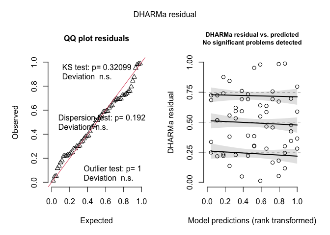
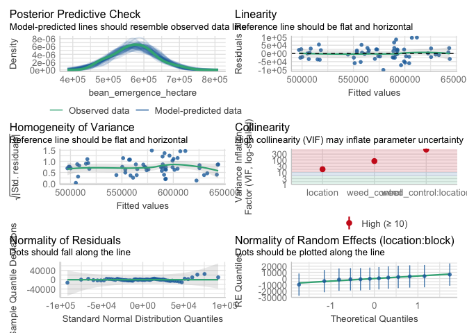
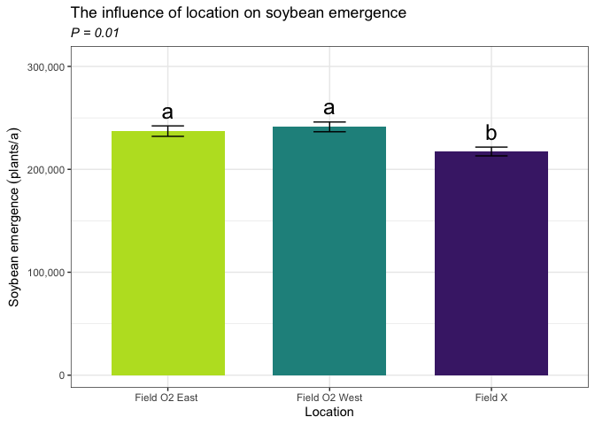
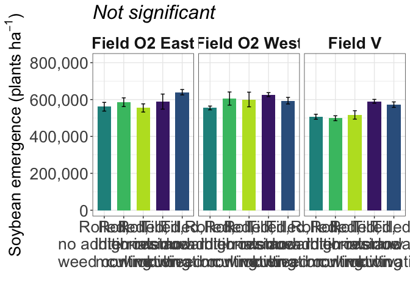

Soybean emergence
================

# Load libraries

``` r
#Set work directory
setwd("/Users/ey239/Github/Mowtivation/rmarkdowns")

#Load packages 
library(tidyverse) ##install.packages("tidyverse")
library(knitr)
library(patchwork) ##install.packages("patchwork")
library(skimr)     ##install.packages("skimr")
library(readxl)
library(janitor) ##install.packages("janitor")

library(kableExtra) ##install.packages("kableExtra")
library(webshot) ##install.packages("webshot")
webshot::install_phantomjs()
library(viridis) ##install.packages("viridis")
library(lme4) ##install.packages("lme4")
library(lmerTest) ##install.packages("lmerTest")
library(emmeans) ##install.packages("emmeans")
library(rstatix) ##install.packages("rstatix")
#library(Matrix) ##install.packages("Matrix")
library(multcomp) ##install.packages("multcomp")
library(multcompView) ##install.packages("multcompView")
library(ggResidpanel) ##install.packages("ggResidpanel")
#library(car)
#library(TMB)  ##install.packages("TMB")
#library(glmmTMB)  ##install.packages("glmmTMB")
library(DHARMa)  ##install.packages("DHARMa")
library(performance) ##install.packages("performance")
#Load Functions
MeanPlusSe<-function(x) mean(x)+plotrix::std.error(x)

find_logw0=function(x){c=trunc(log(min(x[x>0],na.rm=T)))
d=exp(c)
return(d)}
```

<br> \# Load and clean data

\##Load data

``` r
combined_raw <- read_excel("~/Github/Mowtivation/raw-data/All Treatments/combined_raw.xlsx")
kable(head(combined_raw))
```

| id | location | year | treatment | block | plot | bean_emergence | bean_biomass | intrarow_weed_biomass | interrow_weed_biomass | weed_biomass | bean_population | bean_yield | seed_weight |
|:---|:---|---:|:---|---:|---:|---:|---:|---:|---:|---:|---:|---:|---:|
| CU_B1_P101 | field v | 2023 | TIM | 1 | 101 | 46.5 | 223.740 | 19.000 | 44.490 | 63.490 | 34.5 | 417.21 | 17.1200 |
| CU_B1_P102 | field v | 2023 | TIC | 1 | 102 | 42.5 | 267.460 | 30.975 | 0.720 | 31.695 | 39.5 | 565.54 | 17.4750 |
| CU_B1_P103 | field v | 2023 | RIM | 1 | 103 | 36.5 | 217.890 | 0.950 | 6.890 | 7.840 | 37.5 | 449.93 | 16.7525 |
| CU_B1_P104 | field v | 2023 | RNO | 1 | 104 | 41.0 | 207.675 | 0.660 | 45.735 | 46.395 | 35.0 | 412.59 | 16.1450 |
| CU_B1_P105 | field v | 2023 | RIC | 1 | 105 | 41.0 | 230.285 | 0.495 | 22.025 | 22.520 | 39.0 | 473.79 | 17.0475 |
| CU_B1_P201 | field v | 2023 | RIC | 2 | 201 | 36.5 | 208.105 | 6.395 | 19.460 | 25.855 | 33.5 | 484.04 | 17.1500 |

## Clean data

``` r
#Standardaze column names, convert to factors, check for outliers of variable**
clean_combined <- clean_names(combined_raw) |>  
  rename ('weed_control'= treatment) |> 
  mutate(across(c(weed_control, block, plot, location, year), as.factor)) #|> 
  #mutate(is_outlier = totwbm < (quantile(totwbm, 0.25) - 1.5 * IQR(totwbm)) |
                       #wbm > (quantile(totwbm, 0.75) + 1.5 * IQR(totwbm)))

#select and convert data for wbm analysis
bean_emergence_clean <-clean_combined |>              
  mutate(bean_emergence_two_meter = (bean_emergence * 2)) |> 
  mutate(bean_emergence_acre = (((bean_emergence/0.762) *10000)/2.471)) |> 
   mutate(bean_emergence_hectare = ((bean_emergence / 0.762) * 10000))

kable(head(bean_emergence_clean)) 
```

| id | location | year | weed_control | block | plot | bean_emergence | bean_biomass | intrarow_weed_biomass | interrow_weed_biomass | weed_biomass | bean_population | bean_yield | seed_weight | bean_emergence_two_meter | bean_emergence_acre | bean_emergence_hectare |
|:---|:---|:---|:---|:---|:---|---:|---:|---:|---:|---:|---:|---:|---:|---:|---:|---:|
| CU_B1_P101 | field v | 2023 | TIM | 1 | 101 | 46.5 | 223.740 | 19.000 | 44.490 | 63.490 | 34.5 | 417.21 | 17.1200 | 93 | 246959.2 | 610236.2 |
| CU_B1_P102 | field v | 2023 | TIC | 1 | 102 | 42.5 | 267.460 | 30.975 | 0.720 | 31.695 | 39.5 | 565.54 | 17.4750 | 85 | 225715.4 | 557742.8 |
| CU_B1_P103 | field v | 2023 | RIM | 1 | 103 | 36.5 | 217.890 | 0.950 | 6.890 | 7.840 | 37.5 | 449.93 | 16.7525 | 73 | 193849.7 | 479002.6 |
| CU_B1_P104 | field v | 2023 | RNO | 1 | 104 | 41.0 | 207.675 | 0.660 | 45.735 | 46.395 | 35.0 | 412.59 | 16.1450 | 82 | 217749.0 | 538057.7 |
| CU_B1_P105 | field v | 2023 | RIC | 1 | 105 | 41.0 | 230.285 | 0.495 | 22.025 | 22.520 | 39.0 | 473.79 | 17.0475 | 82 | 217749.0 | 538057.7 |
| CU_B1_P201 | field v | 2023 | RIC | 2 | 201 | 36.5 | 208.105 | 6.395 | 19.460 | 25.855 | 33.5 | 484.04 | 17.1500 | 73 | 193849.7 | 479002.6 |

\#Model testing

``` r
emergence.lmer <- lmer(bean_emergence_hectare  ~ weed_control*location + (1|location:block) , data = bean_emergence_clean)

resid_panel(emergence.lmer)
```

<!-- -->

``` r
simulateResiduals(emergence.lmer,plot = TRUE) # Residuals and normality look good
```

<!-- -->

    ## Object of Class DHARMa with simulated residuals based on 250 simulations with refit = FALSE . See ?DHARMa::simulateResiduals for help. 
    ##  
    ## Scaled residual values: 0.636 0.388 0.336 0.724 0.74 0.22 0.516 0.724 0.692 0.464 0.584 0.22 0.232 0.684 0.516 0.876 0.216 0.248 0.732 0.28 ...

``` r
check_model(emergence.lmer)
```

<!-- -->

\##Joint test (anova)

``` r
joint_tests(emmeans(emergence.lmer, ~ weed_control * location))
```

    ##  model term            df1 df2 F.ratio p.value
    ##  weed_control            4  36   4.487  0.0048
    ##  location                2   9   7.721  0.0112
    ##  weed_control:location   8  36   1.218  0.3165

``` r
options(contrasts = c("contr.sum", "contr.poly"))
emergence.anova <- anova(emergence.lmer, ddf = "Satterthwaite")
print(emergence.anova)
```

    ## Type III Analysis of Variance Table with Satterthwaite's method
    ##                           Sum Sq    Mean Sq NumDF DenDF F value   Pr(>F)   
    ## weed_control          3.6827e+10 9.2067e+09     4    36  4.4865 0.004814 **
    ## location              3.1689e+10 1.5845e+10     2     9  7.7212 0.011154 * 
    ## weed_control:location 1.9998e+10 2.4997e+09     8    36  1.2181 0.316550   
    ## ---
    ## Signif. codes:  0 '***' 0.001 '**' 0.01 '*' 0.05 '.' 0.1 ' ' 1

br\>

## Tukey means comparisons

### Weed-control (significant)

``` r
tukey_weed_control <- emmeans(emergence.lmer, pairwise ~ weed_control, adjust = "tukey")
```

    ## NOTE: Results may be misleading due to involvement in interactions

``` r
tukey_weed_control
```

    ## $emmeans
    ##  weed_control emmean    SE   df lower.CL upper.CL
    ##  RIC          557196 13400 44.6   530179   584213
    ##  RIM          563211 13400 44.6   536194   590228
    ##  RNO          540792 13400 44.6   513775   567809
    ##  TIC          602034 13400 44.6   575017   629051
    ##  TIM          602034 13400 44.6   575017   629051
    ## 
    ## Results are averaged over the levels of: location 
    ## Degrees-of-freedom method: kenward-roger 
    ## Confidence level used: 0.95 
    ## 
    ## $contrasts
    ##  contrast  estimate    SE df t.ratio p.value
    ##  RIC - RIM    -6015 18500 36  -0.325  0.9975
    ##  RIC - RNO    16404 18500 36   0.887  0.8998
    ##  RIC - TIC   -44838 18500 36  -2.425  0.1319
    ##  RIC - TIM   -44838 18500 36  -2.425  0.1319
    ##  RIM - RNO    22419 18500 36   1.212  0.7444
    ##  RIM - TIC   -38823 18500 36  -2.099  0.2425
    ##  RIM - TIM   -38823 18500 36  -2.099  0.2425
    ##  RNO - TIC   -61242 18500 36  -3.312  0.0170
    ##  RNO - TIM   -61242 18500 36  -3.312  0.0170
    ##  TIC - TIM        0 18500 36   0.000  1.0000
    ## 
    ## Results are averaged over the levels of: location 
    ## Degrees-of-freedom method: kenward-roger 
    ## P value adjustment: tukey method for comparing a family of 5 estimates

``` r
cld_weed_control_tukey <- cld(emmeans(emergence.lmer, ~ weed_control), adjust = "tukey", Letters = letters, sort = TRUE, reversed = TRUE)
```

    ## NOTE: Results may be misleading due to involvement in interactions

    ## Note: adjust = "tukey" was changed to "sidak"
    ## because "tukey" is only appropriate for one set of pairwise comparisons

``` r
cld_weed_control_tukey
```

    ##  weed_control emmean    SE   df lower.CL upper.CL .group
    ##  TIC          602034 13400 44.6   566057   638011  a    
    ##  TIM          602034 13400 44.6   566057   638011  a    
    ##  RIM          563211 13400 44.6   527234   599188  ab   
    ##  RIC          557196 13400 44.6   521219   593173  ab   
    ##  RNO          540792 13400 44.6   504815   576769   b   
    ## 
    ## Results are averaged over the levels of: location 
    ## Degrees-of-freedom method: kenward-roger 
    ## Confidence level used: 0.95 
    ## Conf-level adjustment: sidak method for 5 estimates 
    ## P value adjustment: tukey method for comparing a family of 5 estimates 
    ## significance level used: alpha = 0.05 
    ## NOTE: If two or more means share the same grouping symbol,
    ##       then we cannot show them to be different.
    ##       But we also did not show them to be the same.

<br>

### Location (Significant)

``` r
tukey_location <- emmeans(emergence.lmer, list(pairwise ~ location), adjust = "tukey")
```

    ## NOTE: Results may be misleading due to involvement in interactions

``` r
tukey_location
```

    ## $`emmeans of location`
    ##  location      emmean    SE df lower.CL upper.CL
    ##  field O2 east 585958 11400  9   560255   611661
    ##  field O2 west 596129 11400  9   570426   621831
    ##  field v       537074 11400  9   511371   562776
    ## 
    ## Results are averaged over the levels of: weed_control 
    ## Degrees-of-freedom method: kenward-roger 
    ## Confidence level used: 0.95 
    ## 
    ## $`pairwise differences of location`
    ##  1                             estimate    SE df t.ratio p.value
    ##  field O2 east - field O2 west   -10171 16100  9  -0.633  0.8062
    ##  field O2 east - field v          48885 16100  9   3.042  0.0338
    ##  field O2 west - field v          59055 16100  9   3.675  0.0128
    ## 
    ## Results are averaged over the levels of: weed_control 
    ## Degrees-of-freedom method: kenward-roger 
    ## P value adjustment: tukey method for comparing a family of 3 estimates

``` r
cld_location_tukey <- cld(emmeans(emergence.lmer, ~ location), adjust = "tukey", Letters = letters, sort = TRUE, reversed = TRUE)
```

    ## NOTE: Results may be misleading due to involvement in interactions

    ## Note: adjust = "tukey" was changed to "sidak"
    ## because "tukey" is only appropriate for one set of pairwise comparisons

``` r
cld_location_tukey
```

    ##  location      emmean    SE df lower.CL upper.CL .group
    ##  field O2 west 596129 11400  9   562919   629338  a    
    ##  field O2 east 585958 11400  9   552748   619168  a    
    ##  field v       537074 11400  9   503864   570283   b   
    ## 
    ## Results are averaged over the levels of: weed_control 
    ## Degrees-of-freedom method: kenward-roger 
    ## Confidence level used: 0.95 
    ## Conf-level adjustment: sidak method for 3 estimates 
    ## P value adjustment: tukey method for comparing a family of 3 estimates 
    ## significance level used: alpha = 0.05 
    ## NOTE: If two or more means share the same grouping symbol,
    ##       then we cannot show them to be different.
    ##       But we also did not show them to be the same.

\###weed_control:location (not significant)

``` r
tukey_weed_control_location <- emmeans(emergence.lmer, list(pairwise ~ weed_control|location), adjust = "tukey")
tukey_weed_control_location
```

    ## $`emmeans of weed_control | location`
    ## location = field O2 east:
    ##  weed_control emmean    SE   df lower.CL upper.CL
    ##  RIC          554462 23200 44.6   507667   601257
    ##  RIM          585630 23200 44.6   538835   632425
    ##  RNO          561024 23200 44.6   514229   607818
    ##  TIC          639764 23200 44.6   592969   686559
    ##  TIM          588911 23200 44.6   542116   635706
    ## 
    ## location = field O2 west:
    ##  weed_control emmean    SE   df lower.CL upper.CL
    ##  RIC          600394 23200 44.6   553599   647188
    ##  RIM          605315 23200 44.6   558520   652110
    ##  RNO          554462 23200 44.6   507667   601257
    ##  TIC          593832 23200 44.6   547037   640627
    ##  TIM          626640 23200 44.6   579846   673435
    ## 
    ## location = field v:
    ##  weed_control emmean    SE   df lower.CL upper.CL
    ##  RIC          516732 23200 44.6   469938   563527
    ##  RIM          498688 23200 44.6   451893   545482
    ##  RNO          506890 23200 44.6   460095   553685
    ##  TIC          572507 23200 44.6   525712   619301
    ##  TIM          590551 23200 44.6   543756   637346
    ## 
    ## Degrees-of-freedom method: kenward-roger 
    ## Confidence level used: 0.95 
    ## 
    ## $`pairwise differences of weed_control | location`
    ## location = field O2 east:
    ##  2         estimate    SE df t.ratio p.value
    ##  RIC - RIM   -31168 32000 36  -0.973  0.8655
    ##  RIC - RNO    -6562 32000 36  -0.205  0.9996
    ##  RIC - TIC   -85302 32000 36  -2.663  0.0799
    ##  RIC - TIM   -34449 32000 36  -1.075  0.8178
    ##  RIM - RNO    24606 32000 36   0.768  0.9381
    ##  RIM - TIC   -54134 32000 36  -1.690  0.4526
    ##  RIM - TIM    -3281 32000 36  -0.102  1.0000
    ##  RNO - TIC   -78740 32000 36  -2.458  0.1233
    ##  RNO - TIM   -27887 32000 36  -0.871  0.9058
    ##  TIC - TIM    50853 32000 36   1.588  0.5147
    ## 
    ## location = field O2 west:
    ##  2         estimate    SE df t.ratio p.value
    ##  RIC - RIM    -4921 32000 36  -0.154  0.9999
    ##  RIC - RNO    45932 32000 36   1.434  0.6105
    ##  RIC - TIC     6562 32000 36   0.205  0.9996
    ##  RIC - TIM   -26247 32000 36  -0.819  0.9229
    ##  RIM - RNO    50853 32000 36   1.588  0.5147
    ##  RIM - TIC    11483 32000 36   0.358  0.9963
    ##  RIM - TIM   -21325 32000 36  -0.666  0.9625
    ##  RNO - TIC   -39370 32000 36  -1.229  0.7347
    ##  RNO - TIM   -72178 32000 36  -2.253  0.1839
    ##  TIC - TIM   -32808 32000 36  -1.024  0.8425
    ## 
    ## location = field v:
    ##  2         estimate    SE df t.ratio p.value
    ##  RIC - RIM    18045 32000 36   0.563  0.9795
    ##  RIC - RNO     9843 32000 36   0.307  0.9980
    ##  RIC - TIC   -55774 32000 36  -1.741  0.4226
    ##  RIC - TIM   -73819 32000 36  -2.305  0.1669
    ##  RIM - RNO    -8202 32000 36  -0.256  0.9990
    ##  RIM - TIC   -73819 32000 36  -2.305  0.1669
    ##  RIM - TIM   -91864 32000 36  -2.868  0.0503
    ##  RNO - TIC   -65617 32000 36  -2.048  0.2645
    ##  RNO - TIM   -83661 32000 36  -2.612  0.0893
    ##  TIC - TIM   -18045 32000 36  -0.563  0.9795
    ## 
    ## Degrees-of-freedom method: kenward-roger 
    ## P value adjustment: tukey method for comparing a family of 5 estimates

``` r
cld_weed_control_location_tukey <- cld(emmeans(emergence.lmer, ~ weed_control|location), adjust = "tukey", Letters = letters, sort = TRUE, reversed = TRUE)
```

    ## Note: adjust = "tukey" was changed to "sidak"
    ## because "tukey" is only appropriate for one set of pairwise comparisons

``` r
cld_weed_control_location_tukey
```

    ## location = field O2 east:
    ##  weed_control emmean    SE   df lower.CL upper.CL .group
    ##  TIC          639764 23200 44.6   577450   702078  a    
    ##  TIM          588911 23200 44.6   526597   651225  a    
    ##  RIM          585630 23200 44.6   523316   647944  a    
    ##  RNO          561024 23200 44.6   498710   623338  a    
    ##  RIC          554462 23200 44.6   492148   616776  a    
    ## 
    ## location = field O2 west:
    ##  weed_control emmean    SE   df lower.CL upper.CL .group
    ##  TIM          626640 23200 44.6   564326   688954  a    
    ##  RIM          605315 23200 44.6   543001   667629  a    
    ##  RIC          600394 23200 44.6   538080   662708  a    
    ##  TIC          593832 23200 44.6   531518   656146  a    
    ##  RNO          554462 23200 44.6   492148   616776  a    
    ## 
    ## location = field v:
    ##  weed_control emmean    SE   df lower.CL upper.CL .group
    ##  TIM          590551 23200 44.6   528237   652865  a    
    ##  TIC          572507 23200 44.6   510193   634820  a    
    ##  RIC          516732 23200 44.6   454418   579046  a    
    ##  RNO          506890 23200 44.6   444576   569204  a    
    ##  RIM          498688 23200 44.6   436374   561002  a    
    ## 
    ## Degrees-of-freedom method: kenward-roger 
    ## Confidence level used: 0.95 
    ## Conf-level adjustment: sidak method for 5 estimates 
    ## P value adjustment: tukey method for comparing a family of 5 estimates 
    ## significance level used: alpha = 0.05 
    ## NOTE: If two or more means share the same grouping symbol,
    ##       then we cannot show them to be different.
    ##       But we also did not show them to be the same.

\#Figures \## Location (S)

``` r
bean_emergence_clean |> 
  left_join(cld_location_tukey) |> 
  ggplot(aes(x = location, y = bean_emergence_acre, fill = location)) +
  stat_summary(geom = "bar", fun = "mean", width = 0.7) +
  stat_summary(geom = "errorbar", fun.data = "mean_se", width = 0.2) +
  stat_summary(geom="text", fun = "MeanPlusSe", aes(label= trimws(.group)),size=6.5,vjust=-0.5) +
  
  labs(
    x = "Location",
    y = expression("Soybean emergence" ~ (plants * "/" * a)),
    title = str_c("The influence of location on soybean emergence"),
    subtitle = expression(italic("P = 0.01"))) +
   scale_x_discrete(labels = c("Field O2 East ",
                              "Field O2 West",
                              "Field X")) +
  scale_y_continuous(labels = scales::label_comma(),expand = expansion(mult = c(0.05, 0.3))) +
  scale_fill_viridis(discrete = TRUE, option = "D", direction = -1, end = 0.9, begin = 0.1) +
   theme_bw() +
  theme(
    legend.position = "none",
    strip.background = element_blank(),
    strip.text = element_text(face = "bold", size = 12)
  )
```

<!-- -->

``` r
ggsave("bean_emergence_location_plantsAc.png", width = 8, height = 6, dpi = 300)
```

#### weed_control:location (not significant)

``` r
bean_emergence_clean |> 
  left_join(cld_weed_control_location_tukey ) |> 
  ggplot(aes(x = factor(weed_control, levels = c("RNO", "RIM", "RIC", "TIM", "TIC")), y =  bean_emergence_hectare, fill = weed_control)) +
  facet_wrap( ~location, labeller = labeller(
    location = c("field O2 east" = "Field O2 East", "field O2 west" = "Field O2 West","field v" = "Field V" )))+
  stat_summary(geom = "bar", fun = "mean", width = 0.7) +
  stat_summary(geom = "errorbar", fun.data = "mean_se", width = 0.2) +
  #stat_summary(geom="text", fun = "MeanPlusSe", aes(label= trimws(.group)),size=6.5,vjust=-0.5) +
  labs(
    x = "",
    y = expression(paste("Soybean emergence (", plants~ha^{-1}, ")")),

    #title = str_c("The influence of interrow weed control on soybean yield"),
    subtitle = expression(italic("Not significant"))) +
  
  scale_x_discrete(labels = c("Rolled,\nno additional\nweed control",
                              "Rolled,\ninterrow\nmowing",
                              "Rolled,\nhigh-residue\ncultivation",
                              "Tilled,\ninterrow\nmowing",
                          "Tilled,\nstandard\ncultivation")) +
  scale_y_continuous(
  labels = scales::label_comma(),
  expand = expansion(mult = c(0.05, 0.3))
) +
  scale_fill_viridis(discrete = TRUE, option = "D", direction = -1, end = 0.9, begin = 0.1) +
   theme_bw() +
  theme(
    legend.position = "none",
    strip.background = element_blank(),
    strip.text = element_text(face = "bold", size = 20),
    axis.title = element_text(size = 20),  # Increase font size of axis titles
    axis.text = element_text(size = 20),   # Increase font size of axis labels
    plot.title = element_text(size = 24, face = "bold"),  # Increase font size of title
    plot.subtitle = element_text(size = 24, face = "italic")  # Increase font size of subtitle
  )
```

<!-- -->

``` r
ggsave("bean_emergence_weed_control_location_kgha.png", width = 24, height = 8, dpi = 300)
```
