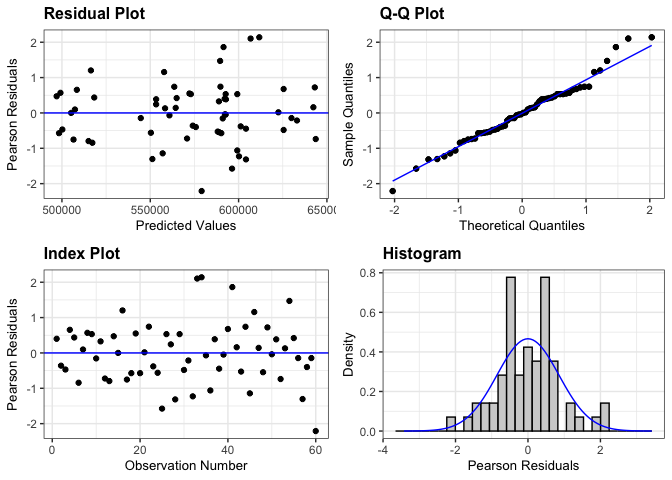
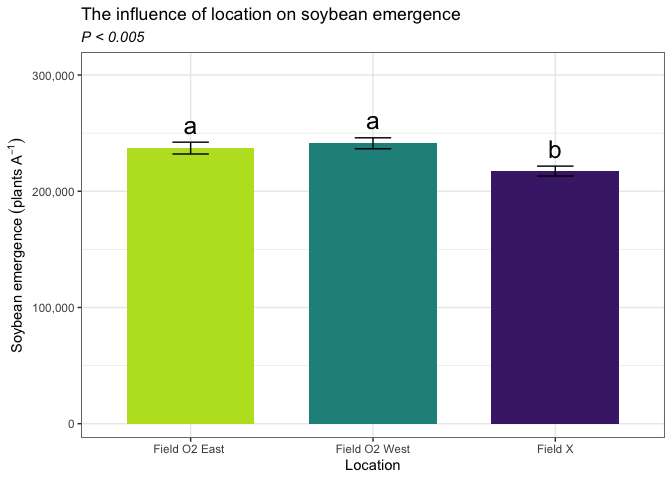

Soybean emergence
================

------------------------------------------------------------------------

# **Load libraries**

``` r
#Set work directory
setwd("/Users/ey239/Github/Mowtivation/rmarkdowns")

#Load packages 
library(tidyverse) ##install.packages("tidyverse")
library(knitr)
library(patchwork) ##install.packages("patchwork")
library(skimr)     ##install.packages("skimr")
library(readxl)
library(janitor) ##install.packages("janitor")

library(kableExtra) ##install.packages("kableExtra")
library(webshot) ##install.packages("webshot")
webshot::install_phantomjs()
library(viridis) ##install.packages("viridis")
library(lme4) ##install.packages("lme4")
library(lmerTest) ##install.packages("lmerTest")
library(emmeans) ##install.packages("emmeans")
library(rstatix) ##install.packages("rstatix")
#library(Matrix) ##install.packages("Matrix")
library(multcomp) ##install.packages("multcomp")
library(multcompView) ##install.packages("multcompView")
library(ggResidpanel) ##install.packages("ggResidpanel")
#library(car)
#library(TMB)  ##install.packages("TMB")
#library(glmmTMB)  ##install.packages("glmmTMB")
#library(DHARMa)  ##install.packages("DHARMa")

#Load Functions
MeanPlusSe<-function(x) mean(x)+plotrix::std.error(x)

find_logw0=function(x){c=trunc(log(min(x[x>0],na.rm=T)))
d=exp(c)
return(d)}
```

<br> \# **Load and Clean Data**

### **Load individual datasets**

``` r
combined_raw <- read_excel("~/Github/Mowtivation/raw-data/All Treatments/combined_raw.xlsx")
kable(head(combined_raw))
```

| id | location | year | treatment | block | plot | bean_emergence | bean_biomass | intrarow_weed_biomass | interrow_weed_biomass | weed_biomass | bean_population | bean_yield |
|:---|:---|---:|:---|---:|---:|---:|---:|---:|---:|---:|:---|:---|
| CU_B1_P101 | field x | 2023 | TIM | 1 | 101 | 46.5 | 223.740 | 19.000 | 44.490 | 63.490 | 34.5 | 417.21 |
| CU_B1_P102 | field x | 2023 | TIC | 1 | 102 | 42.5 | 267.460 | 30.975 | 0.720 | 31.695 | 39.5 | 565.54 |
| CU_B1_P103 | field x | 2023 | RIM | 1 | 103 | 36.5 | 217.890 | 0.950 | 6.890 | 3.920 | 37.5 | 449.93 |
| CU_B1_P104 | field x | 2023 | RNO | 1 | 104 | 41.0 | 207.675 | 0.660 | 45.735 | 46.395 | 35 | 412.59 |
| CU_B1_P105 | field x | 2023 | RIC | 1 | 105 | 41.0 | 230.285 | 0.495 | 22.025 | 22.520 | 39 | 473.79 |
| CU_B1_P201 | field x | 2023 | RIC | 2 | 201 | 36.5 | 208.105 | 6.395 | 19.460 | 25.855 | 33.5 | 484.04 |

``` r
#Standardaze column names, convert to factors, check for outliers of variable**
clean_combined <- clean_names(combined_raw) |>  
  rename ('weed_control'= treatment) |> 
  mutate(across(c(weed_control, block, plot, location, year), as.factor)) #|> 
  #mutate(is_outlier = totwbm < (quantile(totwbm, 0.25) - 1.5 * IQR(totwbm)) |
                       #wbm > (quantile(totwbm, 0.75) + 1.5 * IQR(totwbm)))

#select and convert data for wbm analysis
bean_emergence_clean <-clean_combined |>              
  mutate(bean_emergence_two_meter = (bean_emergence * 2)) |> 
  mutate(bean_emergence_acre = (((bean_emergence/0.762) *10000)/2.471))

kable(head(bean_emergence_clean)) 
```

| id | location | year | weed_control | block | plot | bean_emergence | bean_biomass | intrarow_weed_biomass | interrow_weed_biomass | weed_biomass | bean_population | bean_yield | bean_emergence_two_meter | bean_emergence_acre |
|:---|:---|:---|:---|:---|:---|---:|---:|---:|---:|---:|:---|:---|---:|---:|
| CU_B1_P101 | field x | 2023 | TIM | 1 | 101 | 46.5 | 223.740 | 19.000 | 44.490 | 63.490 | 34.5 | 417.21 | 93 | 246959.2 |
| CU_B1_P102 | field x | 2023 | TIC | 1 | 102 | 42.5 | 267.460 | 30.975 | 0.720 | 31.695 | 39.5 | 565.54 | 85 | 225715.4 |
| CU_B1_P103 | field x | 2023 | RIM | 1 | 103 | 36.5 | 217.890 | 0.950 | 6.890 | 3.920 | 37.5 | 449.93 | 73 | 193849.7 |
| CU_B1_P104 | field x | 2023 | RNO | 1 | 104 | 41.0 | 207.675 | 0.660 | 45.735 | 46.395 | 35 | 412.59 | 82 | 217749.0 |
| CU_B1_P105 | field x | 2023 | RIC | 1 | 105 | 41.0 | 230.285 | 0.495 | 22.025 | 22.520 | 39 | 473.79 | 82 | 217749.0 |
| CU_B1_P201 | field x | 2023 | RIC | 2 | 201 | 36.5 | 208.105 | 6.395 | 19.460 | 25.855 | 33.5 | 484.04 | 73 | 193849.7 |

``` r
random <- lmer(bean_emergence_acre  ~ location+weed_control + location:weed_control +(1|location:block) , data = bean_emergence_clean)

resid_panel(random)
```

<!-- -->

\##**Joint test**

``` r
random |> 
  joint_tests() |> 
  kable()  
```

|     | model term            | df1 | df2 | F.ratio |   p.value |
|:----|:----------------------|----:|----:|--------:|----------:|
| 1   | location              |   2 |   9 |   7.721 | 0.0111542 |
| 3   | weed_control          |   4 |  36 |   4.487 | 0.0048141 |
| 2   | location:weed_control |   8 |  36 |   1.218 | 0.3165498 |

# **Means comparison of totwbm**

``` r
means <- 
 emmeans(random, ~  weed_control)
# Optional: Adjust for multiple comparisons (e.g., using Tukey's method)

pairwise_comparisons<- pairs(means) 
kable(head(pairwise_comparisons))
```

| contrast  |   estimate |       SE |  df |    t.ratio |   p.value |
|:----------|-----------:|---------:|----:|-----------:|----------:|
| RIC - RIM |  -2434.186 | 7484.258 |  36 | -0.3252408 | 0.9997370 |
| RIC - RNO |   6638.689 | 7484.258 |  36 |  0.8870203 | 0.9437231 |
| RIC - TIC | -18145.749 | 7484.258 |  36 | -2.4245221 | 0.1167376 |
| RIC - TIM | -18145.749 | 7484.258 |  36 | -2.4245221 | 0.1167376 |
| RIM - RNO |   9072.874 | 7484.258 |  36 |  1.2122611 | 0.7968936 |
| RIM - TIC | -15711.563 | 7484.258 |  36 | -2.0992813 | 0.2311649 |

``` r
#location
cld_location_tukey <-cld(emmeans(random, ~  location , type = "response"), Letters = letters, sort = TRUE, reversed=TRUE)
```

    ## NOTE: Results may be misleading due to involvement in interactions

``` r
cld_location_tukey
```

    ##  location      emmean   SE df lower.CL upper.CL .group
    ##  field O2 west 241250 4600  9   230848   251652  a    
    ##  field O2 east 237134 4600  9   226732   247536  a    
    ##  field x       217351 4600  9   206949   227752   b   
    ## 
    ## Results are averaged over the levels of: weed_control 
    ## Degrees-of-freedom method: kenward-roger 
    ## Confidence level used: 0.95 
    ## P value adjustment: tukey method for comparing a family of 3 estimates 
    ## significance level used: alpha = 0.05 
    ## NOTE: If two or more means share the same grouping symbol,
    ##       then we cannot show them to be different.
    ##       But we also did not show them to be the same.

\#FIGURES \## **location**

``` r
bean_emergence_clean |> 
  left_join(cld_location_tukey) |> 
  ggplot(aes(x = location, y = bean_emergence_acre, fill = location)) +
  stat_summary(geom = "bar", fun = "mean", width = 0.7) +
  stat_summary(geom = "errorbar", fun.data = "mean_se", width = 0.2) +
  stat_summary(geom="text", fun = "MeanPlusSe", aes(label= trimws(.group)),size=6.5,vjust=-0.5) +
  
  labs(
    x = "Location",
    y = expression("Soybean emergence" ~ (plants ~ A^{-1})),
    title = str_c("The influence of location on soybean emergence"),
    subtitle = expression(italic("P < 0.005"))) +
   scale_x_discrete(labels = c("Field O2 East ",
                              "Field O2 West",
                              "Field X")) +
  scale_y_continuous(labels = scales::label_comma(),expand = expansion(mult = c(0.05, 0.3))) +
  scale_fill_viridis(discrete = TRUE, option = "D", direction = -1, end = 0.9, begin = 0.1) +
   theme_bw() +
  theme(
    legend.position = "none",
    strip.background = element_blank(),
    strip.text = element_text(face = "bold", size = 12)
  )
```

<!-- -->

``` r
ggsave("bean_emergence_location_Ac.png", width = 8, height = 6, dpi = 300)
```
