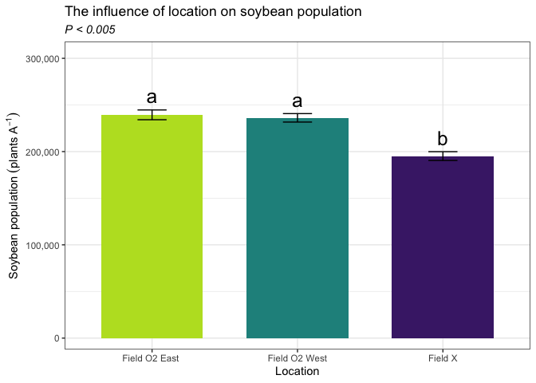

Soybean population
================

Only location had a sigificant impact on soybean population.

# Load libraries

``` r
#Set work directory
setwd("/Users/ey239/Github/Mowtivation/rmarkdowns")

#Load packages 
library(tidyverse) ##install.packages("tidyverse")
library(knitr)
library(patchwork) ##install.packages("patchwork")
library(skimr)     ##install.packages("skimr")
library(readxl)
library(janitor) ##install.packages("janitor")

library(kableExtra) ##install.packages("kableExtra")
library(webshot) ##install.packages("webshot")
webshot::install_phantomjs()
library(viridis) ##install.packages("viridis")
library(lme4) ##install.packages("lme4")
library(lmerTest) ##install.packages("lmerTest")
library(emmeans) ##install.packages("emmeans")
library(rstatix) ##install.packages("rstatix")
#library(Matrix) ##install.packages("Matrix")
library(multcomp) ##install.packages("multcomp")
library(multcompView) ##install.packages("multcompView")
library(ggResidpanel) ##install.packages("ggResidpanel")
#library(car)
#library(TMB)  ##install.packages("TMB")
#library(glmmTMB)  ##install.packages("glmmTMB")
#library(DHARMa)  ##install.packages("DHARMa")

#Load Functions
MeanPlusSe<-function(x) mean(x)+plotrix::std.error(x)

find_logw0=function(x){c=trunc(log(min(x[x>0],na.rm=T)))
d=exp(c)
return(d)}
```

<br> \# Load and clean data\*\*

## Load data

``` r
combined_raw <- read_excel("~/Github/Mowtivation/raw-data/All Treatments/combined_raw.xlsx")
kable(head(combined_raw))
```

| id | location | year | treatment | block | plot | bean_emergence | bean_biomass | intrarow_weed_biomass | interrow_weed_biomass | weed_biomass | bean_population | bean_yield |
|:---|:---|---:|:---|---:|---:|---:|---:|---:|---:|---:|:---|:---|
| CU_B1_P101 | field x | 2023 | TIM | 1 | 101 | 46.5 | 223.740 | 19.000 | 44.490 | 63.490 | 34.5 | 417.21 |
| CU_B1_P102 | field x | 2023 | TIC | 1 | 102 | 42.5 | 267.460 | 30.975 | 0.720 | 31.695 | 39.5 | 565.54 |
| CU_B1_P103 | field x | 2023 | RIM | 1 | 103 | 36.5 | 217.890 | 0.950 | 6.890 | 3.920 | 37.5 | 449.93 |
| CU_B1_P104 | field x | 2023 | RNO | 1 | 104 | 41.0 | 207.675 | 0.660 | 45.735 | 46.395 | 35 | 412.59 |
| CU_B1_P105 | field x | 2023 | RIC | 1 | 105 | 41.0 | 230.285 | 0.495 | 22.025 | 22.520 | 39 | 473.79 |
| CU_B1_P201 | field x | 2023 | RIC | 2 | 201 | 36.5 | 208.105 | 6.395 | 19.460 | 25.855 | 33.5 | 484.04 |

<br>

## Clean data

``` r
#Standardaze column names, convert to factors, check for outliers of variable**
clean_combined <- clean_names(combined_raw) |>  
  rename ('weed_control'= treatment) |> 
  mutate(across(c(weed_control, block, plot, location, year), as.factor)) |>
  mutate(bean_population = as.numeric(bean_population)) #|> 
```

    ## Warning: There was 1 warning in `mutate()`.
    ## ℹ In argument: `bean_population = as.numeric(bean_population)`.
    ## Caused by warning:
    ## ! NAs introduced by coercion

``` r
  #mutate(is_outlier = totwbm < (quantile(totwbm, 0.25) - 1.5 * IQR(totwbm)) |
                       #wbm > (quantile(totwbm, 0.75) + 1.5 * IQR(totwbm)))

#select and convert data for wbm analysis
bean_population_clean <-clean_combined |> 
  mutate(bean_population_two_meter = (bean_population * 2)) |> 
  mutate(bean_population_acre = (((bean_population/0.762) *10000)/2.471))

kable(head(bean_population_clean)) 
```

| id | location | year | weed_control | block | plot | bean_emergence | bean_biomass | intrarow_weed_biomass | interrow_weed_biomass | weed_biomass | bean_population | bean_yield | bean_population_two_meter | bean_population_acre |
|:---|:---|:---|:---|:---|:---|---:|---:|---:|---:|---:|---:|:---|---:|---:|
| CU_B1_P101 | field x | 2023 | TIM | 1 | 101 | 46.5 | 223.740 | 19.000 | 44.490 | 63.490 | 34.5 | 417.21 | 69 | 183227.8 |
| CU_B1_P102 | field x | 2023 | TIC | 1 | 102 | 42.5 | 267.460 | 30.975 | 0.720 | 31.695 | 39.5 | 565.54 | 79 | 209782.6 |
| CU_B1_P103 | field x | 2023 | RIM | 1 | 103 | 36.5 | 217.890 | 0.950 | 6.890 | 3.920 | 37.5 | 449.93 | 75 | 199160.7 |
| CU_B1_P104 | field x | 2023 | RNO | 1 | 104 | 41.0 | 207.675 | 0.660 | 45.735 | 46.395 | 35.0 | 412.59 | 70 | 185883.3 |
| CU_B1_P105 | field x | 2023 | RIC | 1 | 105 | 41.0 | 230.285 | 0.495 | 22.025 | 22.520 | 39.0 | 473.79 | 78 | 207127.1 |
| CU_B1_P201 | field x | 2023 | RIC | 2 | 201 | 36.5 | 208.105 | 6.395 | 19.460 | 25.855 | 33.5 | 484.04 | 67 | 177916.9 |

# Model testing

## Lmer

Block is random Tyler is under the impression that block should always
be random and that post-hoc comparisons should use TUKEY rather the
Fischer. Fisher is bogus apparently.

``` r
random <- lmer(bean_population_acre  ~ location+weed_control + location:weed_control +(1|location:block) , data = bean_population_clean)
```

    ## boundary (singular) fit: see help('isSingular')

``` r
resid_panel(random)
```

<!-- -->

br\>

## Joint test (anova)

``` r
random |> 
  joint_tests() |> 
  kable()  
```

|     | model term            | df1 |   df2 | F.ratio |   p.value |
|:----|:----------------------|----:|------:|--------:|----------:|
| 1   | location              |   2 |  8.64 |  25.795 | 0.0002276 |
| 3   | weed_control          |   4 | 35.04 |   0.547 | 0.7024482 |
| 2   | location:weed_control |   8 | 35.04 |   1.232 | 0.3097339 |

## Means comparison

### Weed-control (NS)

``` r
means_weed_control <- emmeans(random, ~  weed_control)
pairwise_comparisons_weed_control<- pairs(means_weed_control) 
kable(head(pairwise_comparisons_weed_control))
```

| contrast  |    estimate |       SE |       df |    t.ratio |   p.value |
|:----------|------------:|---------:|---------:|-----------:|----------:|
| RIC - RIM |   5458.4773 | 9043.958 | 35.78415 |  0.6035496 | 0.9916907 |
| RIC - RNO |   4868.3716 | 8781.272 | 35.03704 |  0.5544039 | 0.9947287 |
| RIC - TIC |  -5753.5301 | 8781.272 | 35.03704 | -0.6552046 | 0.9872427 |
| RIC - TIM |   3540.6339 | 8781.272 | 35.03704 |  0.4032028 | 0.9990995 |
| RIM - RNO |   -590.1057 | 9043.958 | 35.78415 | -0.0652486 | 1.0000000 |
| RIM - TIC | -11212.0074 | 9043.958 | 35.78415 | -1.2397235 | 0.7801963 |

<br> \### Location (S)

``` r
means_location <- emmeans(random, ~  location)
pairwise_comparisons_location<- pairs(means_location) 
kable(head(pairwise_comparisons_location))
```

| contrast                      |  estimate |       SE |       df |   t.ratio |   p.value |
|:------------------------------|----------:|---------:|---------:|----------:|----------:|
| field O2 east - field O2 west |  3673.408 | 6924.747 | 9.103669 | 0.5304753 | 0.9399834 |
| field O2 east - field x       | 44213.666 | 6801.944 | 8.639269 | 6.5001511 | 0.0004016 |
| field O2 west - field x       | 40540.258 | 6924.747 | 9.103669 | 5.8544027 | 0.0006955 |

## Tukey compact letter display

### Location (S)

``` r
#location
cld_location_tukey <-cld(emmeans(random, ~  location , type = "response"), Letters = letters, sort = TRUE, reversed=TRUE)
```

    ## NOTE: Results may be misleading due to involvement in interactions

``` r
cld_location_tukey
```

    ##  location      emmean   SE   df lower.CL upper.CL .group
    ##  field O2 east 239391 4810 8.64   228441   250341  a    
    ##  field O2 west 235718 4980 9.57   224550   246886  a    
    ##  field x       195177 4810 8.64   184228   206127   b   
    ## 
    ## Results are averaged over the levels of: weed_control 
    ## Degrees-of-freedom method: kenward-roger 
    ## Confidence level used: 0.95 
    ## P value adjustment: tukey method for comparing a family of 3 estimates 
    ## significance level used: alpha = 0.05 
    ## NOTE: If two or more means share the same grouping symbol,
    ##       then we cannot show them to be different.
    ##       But we also did not show them to be the same.

<br> \# Figures

## Location (S)

``` r
bean_population_clean |> 
  left_join(cld_location_tukey) |> 
  ggplot(aes(x = location, y = bean_population_acre, fill = location)) +
  stat_summary(geom = "bar", fun = "mean", width = 0.7) +
  stat_summary(geom = "errorbar", fun.data = "mean_se", width = 0.2) +
  stat_summary(geom="text", fun = "MeanPlusSe", aes(label= trimws(.group)),size=6.5,vjust=-0.5) +
  
  labs(
    x = "Location",
    y = expression("Soybean population" ~ (plants ~ A^{-1})),
    title = str_c("The influence of location on soybean population"),
    subtitle = expression(italic("P < 0.005"))) +
   scale_x_discrete(labels = c("Field O2 East ",
                              "Field O2 West",
                              "Field X")) +
  scale_y_continuous(labels = scales::label_comma(),expand = expansion(mult = c(0.05, 0.3))) +
  scale_fill_viridis(discrete = TRUE, option = "D", direction = -1, end = 0.9, begin = 0.1) +
   theme_bw() +
  theme(
    legend.position = "none",
    strip.background = element_blank(),
    strip.text = element_text(face = "bold", size = 12)
  )
```

<!-- -->

``` r
ggsave("bean_population_location_Ac.png", width = 8, height = 6, dpi = 300)
```
