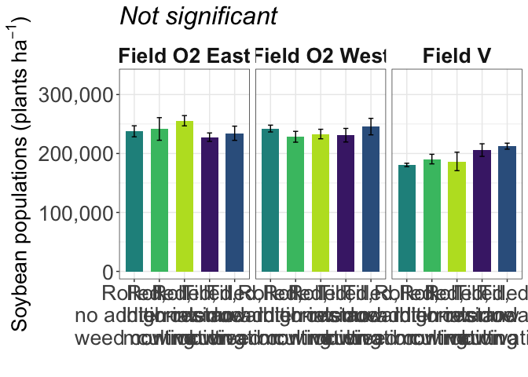

Soybean population
================

Only location had a sigificant impact on soybean population.

# Load libraries

``` r
#Set work directory
setwd("/Users/ey239/Github/Mowtivation/rmarkdowns")

#Load packages 
library(tidyverse) ##install.packages("tidyverse")
library(knitr)
library(patchwork) ##install.packages("patchwork")
library(skimr)     ##install.packages("skimr")
library(readxl)
library(janitor) ##install.packages("janitor")

library(kableExtra) ##install.packages("kableExtra")
library(webshot) ##install.packages("webshot")
webshot::install_phantomjs()
library(viridis) ##install.packages("viridis")
library(lme4) ##install.packages("lme4")
library(lmerTest) ##install.packages("lmerTest")
library(emmeans) ##install.packages("emmeans")
library(rstatix) ##install.packages("rstatix")
#library(Matrix) ##install.packages("Matrix")
library(multcomp) ##install.packages("multcomp")
library(multcompView) ##install.packages("multcompView")
library(ggResidpanel) ##install.packages("ggResidpanel")
#library(car)
#library(TMB)  ##install.packages("TMB")
#library(glmmTMB)  ##install.packages("glmmTMB")
library(DHARMa)  ##install.packages("DHARMa")
library(performance) ##install.packages("performance")
#Load Functions
MeanPlusSe<-function(x) mean(x)+plotrix::std.error(x)

find_logw0=function(x){c=trunc(log(min(x[x>0],na.rm=T)))
d=exp(c)
return(d)}
```

<br> \# Load and clean data\*\*

## Load data

``` r
combined_raw <- read_excel("~/Github/Mowtivation/raw-data/All Treatments/combined_raw.xlsx")
kable(head(combined_raw))
```

| id | location | year | treatment | block | plot | bean_emergence | bean_biomass | intrarow_weed_biomass | interrow_weed_biomass | weed_biomass | bean_population | bean_yield | seed_weight |
|:---|:---|---:|:---|---:|---:|---:|---:|---:|---:|---:|---:|---:|---:|
| CU_B1_P101 | field v | 2023 | TIM | 1 | 101 | 46.5 | 223.740 | 19.000 | 44.490 | 63.490 | 34.5 | 417.21 | 17.1200 |
| CU_B1_P102 | field v | 2023 | TIC | 1 | 102 | 42.5 | 267.460 | 30.975 | 0.720 | 31.695 | 39.5 | 565.54 | 17.4750 |
| CU_B1_P103 | field v | 2023 | RIM | 1 | 103 | 36.5 | 217.890 | 0.950 | 6.890 | 7.840 | 37.5 | 449.93 | 16.7525 |
| CU_B1_P104 | field v | 2023 | RNO | 1 | 104 | 41.0 | 207.675 | 0.660 | 45.735 | 46.395 | 35.0 | 412.59 | 16.1450 |
| CU_B1_P105 | field v | 2023 | RIC | 1 | 105 | 41.0 | 230.285 | 0.495 | 22.025 | 22.520 | 39.0 | 473.79 | 17.0475 |
| CU_B1_P201 | field v | 2023 | RIC | 2 | 201 | 36.5 | 208.105 | 6.395 | 19.460 | 25.855 | 33.5 | 484.04 | 17.1500 |

<br>

## Clean data

``` r
#Standardaze column names, convert to factors, check for outliers of variable**
clean_combined <- clean_names(combined_raw) |>  
  rename ('weed_control'= treatment) |> 
  mutate(across(c(weed_control, block, plot, location, year), as.factor)) |>
  mutate(bean_population = as.numeric(bean_population)) #|> 
  #mutate(is_outlier = totwbm < (quantile(totwbm, 0.25) - 1.5 * IQR(totwbm)) |
                       #wbm > (quantile(totwbm, 0.75) + 1.5 * IQR(totwbm)))

#select and convert data for wbm analysis
bean_population_clean <- clean_combined |> 
  mutate(bean_population_two_meter = (bean_population * 2)) |> 
  mutate(bean_population_acre = (((bean_population/0.762) * 10000) / 2.471)) |> 
  mutate(bean_population_hectare = ((bean_population / 0.762) * 10000))


kable(head(bean_population_clean)) 
```

| id | location | year | weed_control | block | plot | bean_emergence | bean_biomass | intrarow_weed_biomass | interrow_weed_biomass | weed_biomass | bean_population | bean_yield | seed_weight | bean_population_two_meter | bean_population_acre | bean_population_hectare |
|:---|:---|:---|:---|:---|:---|---:|---:|---:|---:|---:|---:|---:|---:|---:|---:|---:|
| CU_B1_P101 | field v | 2023 | TIM | 1 | 101 | 46.5 | 223.740 | 19.000 | 44.490 | 63.490 | 34.5 | 417.21 | 17.1200 | 69 | 183227.8 | 452755.9 |
| CU_B1_P102 | field v | 2023 | TIC | 1 | 102 | 42.5 | 267.460 | 30.975 | 0.720 | 31.695 | 39.5 | 565.54 | 17.4750 | 79 | 209782.6 | 518372.7 |
| CU_B1_P103 | field v | 2023 | RIM | 1 | 103 | 36.5 | 217.890 | 0.950 | 6.890 | 7.840 | 37.5 | 449.93 | 16.7525 | 75 | 199160.7 | 492126.0 |
| CU_B1_P104 | field v | 2023 | RNO | 1 | 104 | 41.0 | 207.675 | 0.660 | 45.735 | 46.395 | 35.0 | 412.59 | 16.1450 | 70 | 185883.3 | 459317.6 |
| CU_B1_P105 | field v | 2023 | RIC | 1 | 105 | 41.0 | 230.285 | 0.495 | 22.025 | 22.520 | 39.0 | 473.79 | 17.0475 | 78 | 207127.1 | 511811.0 |
| CU_B1_P201 | field v | 2023 | RIC | 2 | 201 | 36.5 | 208.105 | 6.395 | 19.460 | 25.855 | 33.5 | 484.04 | 17.1500 | 67 | 177916.9 | 439632.5 |

# Model testing

## Lmer

Block is random Tyler is under the impression that block should always
be random and that post-hoc comparisons should use TUKEY rather the
Fischer. Fisher is bogus apparently.

``` r
population.lmer <- lmer(bean_population_hectare  ~ weed_control*location + (1|location:block) , data = bean_population_clean)
```

    ## boundary (singular) fit: see help('isSingular')

``` r
resid_panel(population.lmer)
```

<!-- -->

``` r
simulateResiduals(population.lmer,plot = TRUE) # Residuals and normality look good
```

<!-- -->

    ## Object of Class DHARMa with simulated residuals based on 250 simulations with refit = FALSE . See ?DHARMa::simulateResiduals for help. 
    ##  
    ## Scaled residual values: 0.116 0.476 0.708 0.592 0.856 0.332 0.496 0.168 0.648 0.7 0.308 0.248 0.032 0.432 0.352 0.916 0.508 0.788 0.672 0.86 ...

``` r
check_model(population.lmer)
```

<!-- -->

br\>

## Joint test (anova)

``` r
joint_tests(emmeans(population.lmer, ~ weed_control * location))
```

    ##  model term            df1 df2 F.ratio p.value
    ##  weed_control            4  36   0.541  0.7066
    ##  location                2   9  26.758  0.0002
    ##  weed_control:location   8  36   1.249  0.3003

``` r
options(contrasts = c("contr.sum", "contr.poly"))
population.anova <- anova(population.lmer, ddf = "Satterthwaite")
print(population.anova)
```

    ## Type III Analysis of Variance Table with Satterthwaite's method
    ##                           Sum Sq    Mean Sq NumDF DenDF F value    Pr(>F)    
    ## weed_control          5.9876e+09 1.4969e+09     4    45  0.5409    0.7064    
    ## location              1.4810e+11 7.4048e+10     2    45 26.7583 2.205e-08 ***
    ## weed_control:location 2.7643e+10 3.4554e+09     8    45  1.2487    0.2941    
    ## ---
    ## Signif. codes:  0 '***' 0.001 '**' 0.01 '*' 0.05 '.' 0.1 ' ' 1

<br>

## Tukey means comparisons

### Weed-control (significant)

``` r
tukey_weed_control <- emmeans(population.lmer, pairwise ~ weed_control, adjust = "tukey")
```

    ## NOTE: Results may be misleading due to involvement in interactions

``` r
tukey_weed_control
```

    ## $emmeans
    ##  weed_control emmean    SE df lower.CL upper.CL
    ##  RIC          556102 15200 45   525517   586688
    ##  RIM          544073 15200 45   513487   574658
    ##  RNO          544073 15200 45   513487   574658
    ##  TIC          570319 15200 45   539734   600905
    ##  TIM          547354 15200 45   516768   577939
    ## 
    ## Results are averaged over the levels of: location 
    ## Degrees-of-freedom method: kenward-roger 
    ## Confidence level used: 0.95 
    ## 
    ## $contrasts
    ##  contrast  estimate    SE df t.ratio p.value
    ##  RIC - RIM    12030 21500 36   0.560  0.9799
    ##  RIC - RNO    12030 21500 36   0.560  0.9799
    ##  RIC - TIC   -14217 21500 36  -0.662  0.9632
    ##  RIC - TIM     8749 21500 36   0.407  0.9940
    ##  RIM - RNO        0 21500 36   0.000  1.0000
    ##  RIM - TIC   -26247 21500 36  -1.222  0.7387
    ##  RIM - TIM    -3281 21500 36  -0.153  0.9999
    ##  RNO - TIC   -26247 21500 36  -1.222  0.7387
    ##  RNO - TIM    -3281 21500 36  -0.153  0.9999
    ##  TIC - TIM    22966 21500 36   1.069  0.8208
    ## 
    ## Results are averaged over the levels of: location 
    ## Degrees-of-freedom method: kenward-roger 
    ## P value adjustment: tukey method for comparing a family of 5 estimates

``` r
cld_weed_control_tukey <- cld(emmeans(population.lmer, ~ weed_control), adjust = "tukey", Letters = letters, sort = TRUE, reversed = TRUE)
```

    ## NOTE: Results may be misleading due to involvement in interactions

    ## Note: adjust = "tukey" was changed to "sidak"
    ## because "tukey" is only appropriate for one set of pairwise comparisons

``` r
cld_weed_control_tukey
```

    ##  weed_control emmean    SE df lower.CL upper.CL .group
    ##  TIC          570319 15200 45   529596   611042  a    
    ##  RIC          556102 15200 45   515380   596825  a    
    ##  TIM          547354 15200 45   506631   588076  a    
    ##  RIM          544073 15200 45   503350   584795  a    
    ##  RNO          544073 15200 45   503350   584795  a    
    ## 
    ## Results are averaged over the levels of: location 
    ## Degrees-of-freedom method: kenward-roger 
    ## Confidence level used: 0.95 
    ## Conf-level adjustment: sidak method for 5 estimates 
    ## P value adjustment: tukey method for comparing a family of 5 estimates 
    ## significance level used: alpha = 0.05 
    ## NOTE: If two or more means share the same grouping symbol,
    ##       then we cannot show them to be different.
    ##       But we also did not show them to be the same.

<br>

### Location (Significant)

``` r
tukey_location <- emmeans(population.lmer, list(pairwise ~ location), adjust = "tukey")
```

    ## NOTE: Results may be misleading due to involvement in interactions

``` r
tukey_location
```

    ## $`emmeans of location`
    ##  location      emmean    SE df lower.CL upper.CL
    ##  field O2 east 591535 11800  9   564926   618145
    ##  field O2 west 583333 11800  9   556724   609943
    ##  field v       482284 11800  9   455674   508893
    ## 
    ## Results are averaged over the levels of: weed_control 
    ## Degrees-of-freedom method: kenward-roger 
    ## Confidence level used: 0.95 
    ## 
    ## $`pairwise differences of location`
    ##  1                             estimate    SE df t.ratio p.value
    ##  field O2 east - field O2 west     8202 16600  9   0.493  0.8763
    ##  field O2 east - field v         109252 16600  9   6.568  0.0003
    ##  field O2 west - field v         101050 16600  9   6.074  0.0005
    ## 
    ## Results are averaged over the levels of: weed_control 
    ## Degrees-of-freedom method: kenward-roger 
    ## P value adjustment: tukey method for comparing a family of 3 estimates

``` r
cld_location_tukey <- cld(emmeans(population.lmer, ~ location), adjust = "tukey", Letters = letters, sort = TRUE, reversed = TRUE)
```

    ## NOTE: Results may be misleading due to involvement in interactions

    ## Note: adjust = "tukey" was changed to "sidak"
    ## because "tukey" is only appropriate for one set of pairwise comparisons

``` r
cld_location_tukey
```

    ##  location      emmean    SE df lower.CL upper.CL .group
    ##  field O2 east 591535 11800  9   557154   625917  a    
    ##  field O2 west 583333 11800  9   548952   617715  a    
    ##  field v       482284 11800  9   447902   516665   b   
    ## 
    ## Results are averaged over the levels of: weed_control 
    ## Degrees-of-freedom method: kenward-roger 
    ## Confidence level used: 0.95 
    ## Conf-level adjustment: sidak method for 3 estimates 
    ## P value adjustment: tukey method for comparing a family of 3 estimates 
    ## significance level used: alpha = 0.05 
    ## NOTE: If two or more means share the same grouping symbol,
    ##       then we cannot show them to be different.
    ##       But we also did not show them to be the same.

\###weed_control:location (not significant)

``` r
tukey_weed_control_location <- emmeans(population.lmer, list(pairwise ~ weed_control|location), adjust = "tukey")
tukey_weed_control_location
```

    ## $`emmeans of weed_control | location`
    ## location = field O2 east:
    ##  weed_control emmean    SE df lower.CL upper.CL
    ##  RIC          631562 26300 45   578586   684538
    ##  RIM          597113 26300 45   544137   650089
    ##  RNO          587270 26300 45   534294   640246
    ##  TIC          579068 26300 45   526092   632044
    ##  TIM          562664 26300 45   509688   615640
    ## 
    ## location = field O2 west:
    ##  weed_control emmean    SE df lower.CL upper.CL
    ##  RIC          575787 26300 45   522812   628763
    ##  RIM          564304 26300 45   511328   617280
    ##  RNO          598753 26300 45   545777   651729
    ##  TIC          606955 26300 45   553980   659931
    ##  TIM          570866 26300 45   517890   623842
    ## 
    ## location = field v:
    ##  weed_control emmean    SE df lower.CL upper.CL
    ##  RIC          460958 26300 45   407982   513934
    ##  RIM          470800 26300 45   417825   523776
    ##  RNO          446194 26300 45   393218   499170
    ##  TIC          524934 26300 45   471958   577910
    ##  TIM          508530 26300 45   455554   561506
    ## 
    ## Degrees-of-freedom method: kenward-roger 
    ## Confidence level used: 0.95 
    ## 
    ## $`pairwise differences of weed_control | location`
    ## location = field O2 east:
    ##  2         estimate    SE df t.ratio p.value
    ##  RIC - RIM    34449 37200 36   0.926  0.8849
    ##  RIC - RNO    44291 37200 36   1.191  0.7565
    ##  RIC - TIC    52493 37200 36   1.411  0.6246
    ##  RIC - TIM    68898 37200 36   1.852  0.3608
    ##  RIM - RNO     9843 37200 36   0.265  0.9989
    ##  RIM - TIC    18045 37200 36   0.485  0.9883
    ##  RIM - TIM    34449 37200 36   0.926  0.8849
    ##  RNO - TIC     8202 37200 36   0.221  0.9994
    ##  RNO - TIM    24606 37200 36   0.662  0.9633
    ##  TIC - TIM    16404 37200 36   0.441  0.9918
    ## 
    ## location = field O2 west:
    ##  2         estimate    SE df t.ratio p.value
    ##  RIC - RIM    11483 37200 36   0.309  0.9979
    ##  RIC - RNO   -22966 37200 36  -0.617  0.9714
    ##  RIC - TIC   -31168 37200 36  -0.838  0.9169
    ##  RIC - TIM     4921 37200 36   0.132  0.9999
    ##  RIM - RNO   -34449 37200 36  -0.926  0.8849
    ##  RIM - TIC   -42651 37200 36  -1.147  0.7808
    ##  RIM - TIM    -6562 37200 36  -0.176  0.9998
    ##  RNO - TIC    -8202 37200 36  -0.221  0.9994
    ##  RNO - TIM    27887 37200 36   0.750  0.9430
    ##  TIC - TIM    36089 37200 36   0.970  0.8667
    ## 
    ## location = field v:
    ##  2         estimate    SE df t.ratio p.value
    ##  RIC - RIM    -9843 37200 36  -0.265  0.9989
    ##  RIC - RNO    14764 37200 36   0.397  0.9945
    ##  RIC - TIC   -63976 37200 36  -1.720  0.4350
    ##  RIC - TIM   -47572 37200 36  -1.279  0.7055
    ##  RIM - RNO    24606 37200 36   0.662  0.9633
    ##  RIM - TIC   -54134 37200 36  -1.455  0.5971
    ##  RIM - TIM   -37730 37200 36  -1.014  0.8471
    ##  RNO - TIC   -78740 37200 36  -2.117  0.2353
    ##  RNO - TIM   -62336 37200 36  -1.676  0.4611
    ##  TIC - TIM    16404 37200 36   0.441  0.9918
    ## 
    ## Degrees-of-freedom method: kenward-roger 
    ## P value adjustment: tukey method for comparing a family of 5 estimates

``` r
cld_weed_control_location_tukey <- cld(emmeans(population.lmer, ~ weed_control|location), adjust = "tukey", Letters = letters, sort = TRUE, reversed = TRUE)
```

    ## Note: adjust = "tukey" was changed to "sidak"
    ## because "tukey" is only appropriate for one set of pairwise comparisons

``` r
cld_weed_control_location_tukey
```

    ## location = field O2 east:
    ##  weed_control emmean    SE df lower.CL upper.CL .group
    ##  RIC          631562 26300 45   561028   702096  a    
    ##  RIM          597113 26300 45   526579   667647  a    
    ##  RNO          587270 26300 45   516736   657804  a    
    ##  TIC          579068 26300 45   508534   649602  a    
    ##  TIM          562664 26300 45   492130   633198  a    
    ## 
    ## location = field O2 west:
    ##  weed_control emmean    SE df lower.CL upper.CL .group
    ##  TIC          606955 26300 45   536421   677489  a    
    ##  RNO          598753 26300 45   528219   669287  a    
    ##  RIC          575787 26300 45   505253   646321  a    
    ##  TIM          570866 26300 45   500332   641400  a    
    ##  RIM          564304 26300 45   493770   634838  a    
    ## 
    ## location = field v:
    ##  weed_control emmean    SE df lower.CL upper.CL .group
    ##  TIC          524934 26300 45   454400   595468  a    
    ##  TIM          508530 26300 45   437996   579064  a    
    ##  RIM          470800 26300 45   400267   541334  a    
    ##  RIC          460958 26300 45   390424   531492  a    
    ##  RNO          446194 26300 45   375660   516728  a    
    ## 
    ## Degrees-of-freedom method: kenward-roger 
    ## Confidence level used: 0.95 
    ## Conf-level adjustment: sidak method for 5 estimates 
    ## P value adjustment: tukey method for comparing a family of 5 estimates 
    ## significance level used: alpha = 0.05 
    ## NOTE: If two or more means share the same grouping symbol,
    ##       then we cannot show them to be different.
    ##       But we also did not show them to be the same.

# Figures

## Weed-control (Not significant)

``` r
bean_population_clean |> 
  left_join(cld_weed_control_tukey) |> 
  ggplot(aes(x = factor(weed_control, levels = c("RNO", "RIM", "RIC", "TIM", "TIC")), y = bean_population_acre, fill = weed_control)) +
  stat_summary(geom = "bar", fun = "mean", width = 0.7) +
  stat_summary(geom = "errorbar", fun.data = "mean_se", width = 0.2) +
  #stat_summary(geom="text", fun = "MeanPlusSe", aes(label= trimws(.group)),size=6.5,vjust=-0.5) +
  
  labs(
    x = "Interrow weed control",
    y = expression("Soybean population" ~ (plants * "/" * a)),
    title = str_c("The influence of interrow weed control on soybean population"),
    subtitle = expression(italic("Not significant"))) +
   scale_x_discrete(labels = c("Rolled,\nno additional\nweed control",
                              "Rolled,\ninterrow\nmowing",
                              "Rolled,\nhigh-residue\ncultivation",
                              "Tilled,\ninterrow\nmowing",
                          "Tilled,\nstandard\ncultivation")) +
  scale_y_continuous(labels = scales::label_comma(),expand = expansion(mult = c(0.05, 0.3))) +
  scale_fill_viridis(discrete = TRUE, option = "D", direction = -1, end = 0.9, begin = 0.1) +
   theme_bw() +
  theme(
    legend.position = "none",
    strip.background = element_blank(),
    strip.text = element_text(face = "bold", size = 12),
    axis.title = element_text(size = 20),  # Increase font size of axis titles
    axis.text = element_text(size = 16),   # Increase font size of axis labels
    plot.title = element_text(size = 22, face = "bold"),  # Increase font size of title
    plot.subtitle = element_text(size = 18, face = "italic")  # Increase font size of subtitle
  )
```

<!-- -->

``` r
ggsave("bean_population_weed_control_a.png", width = 10, height = 6, dpi = 300)
```

\###Kg/hectare \#### weed_control:location (not significant)

``` r
bean_population_clean |> 
  left_join(cld_weed_control_location_tukey ) |> 
  ggplot(aes(x = factor(weed_control, levels = c("RNO", "RIM", "RIC", "TIM", "TIC")), y =  bean_population_hectare, fill = weed_control)) +
  facet_wrap( ~location, labeller = labeller(
    location = c("field O2 east" = "Field O2 East", "field O2 west" = "Field O2 West","field v" = "Field V" )))+
  stat_summary(geom = "bar", fun = "mean", width = 0.7) +
  stat_summary(geom = "errorbar", fun.data = "mean_se", width = 0.2) +
  #stat_summary(geom="text", fun = "MeanPlusSe", aes(label= trimws(.group)),size=6.5,vjust=-0.5) +
  labs(
    x = "",
    y = expression(paste("Soybean populations (", plants~ha^{-1}, ")")),

    #title = str_c("The influence of interrow weed control on soybean yield"),
    subtitle = expression(italic("Not significant"))) +
  
  scale_x_discrete(labels = c("Rolled,\nno additional\nweed control",
                              "Rolled,\ninterrow\nmowing",
                              "Rolled,\nhigh-residue\ncultivation",
                              "Tilled,\ninterrow\nmowing",
                          "Tilled,\nstandard\ncultivation")) +
  scale_y_continuous(
  labels = scales::label_comma(),
  expand = expansion(mult = c(0.05, 0.3))
) +
  scale_fill_viridis(discrete = TRUE, option = "D", direction = -1, end = 0.9, begin = 0.1) +
   theme_bw() +
  theme(
    legend.position = "none",
    strip.background = element_blank(),
    strip.text = element_text(face = "bold", size = 20),
    axis.title = element_text(size = 20),  # Increase font size of axis titles
    axis.text = element_text(size = 20),   # Increase font size of axis labels
    plot.title = element_text(size = 24, face = "bold"),  # Increase font size of title
    plot.subtitle = element_text(size = 24, face = "italic")  # Increase font size of subtitle
  )
```

<!-- -->

``` r
ggsave("bean_population_weed_control_location_kgha.png", width = 24, height = 8, dpi = 300)
```
