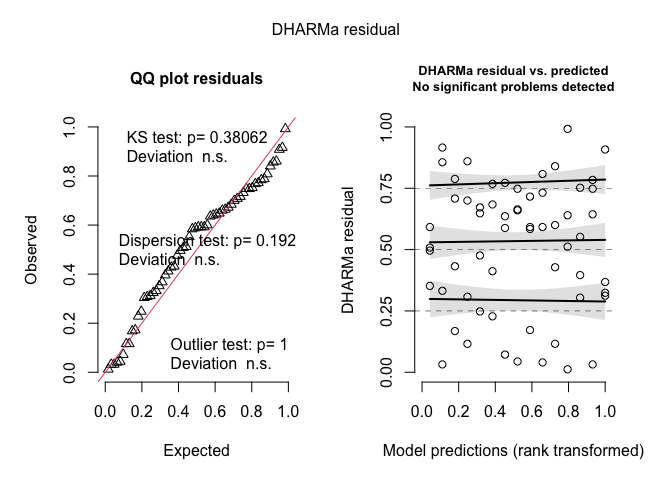
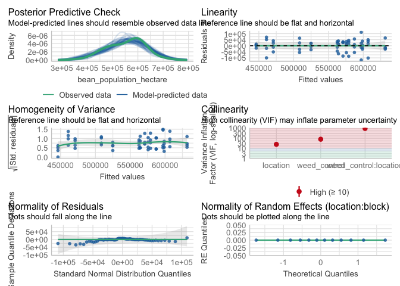

Soybean population
================

Only location had a sigificant impact on soybean population.

# Load libraries

``` r
#Set work directory
setwd("/Users/ey239/Github/Mowtivation/rmarkdowns")

#Load packages 
library(tidyverse) ##install.packages("tidyverse")
library(knitr)
library(patchwork) ##install.packages("patchwork")
library(skimr)     ##install.packages("skimr")
library(readxl)
library(janitor) ##install.packages("janitor")

library(kableExtra) ##install.packages("kableExtra")
library(webshot) ##install.packages("webshot")
webshot::install_phantomjs()
library(viridis) ##install.packages("viridis")
library(lme4) ##install.packages("lme4")
library(lmerTest) ##install.packages("lmerTest")
library(emmeans) ##install.packages("emmeans")
library(rstatix) ##install.packages("rstatix")
#library(Matrix) ##install.packages("Matrix")
library(multcomp) ##install.packages("multcomp")
library(multcompView) ##install.packages("multcompView")
library(ggResidpanel) ##install.packages("ggResidpanel")
#library(car)
#library(TMB)  ##install.packages("TMB")
#library(glmmTMB)  ##install.packages("glmmTMB")
library(DHARMa)  ##install.packages("DHARMa")
library(performance) ##install.packages("performance")
#Load Functions
MeanPlusSe<-function(x) mean(x)+plotrix::std.error(x)

find_logw0=function(x){c=trunc(log(min(x[x>0],na.rm=T)))
d=exp(c)
return(d)}
```

<br> \# Load and clean data\*\*

## Load data

``` r
combined_raw <- read_excel("~/Github/Mowtivation/raw-data/All Treatments/combined_raw.xlsx")
kable(head(combined_raw))
```

| id | location | year | treatment | block | plot | bean_emergence | bean_biomass | intrarow_weed_biomass | interrow_weed_biomass | weed_biomass | bean_population | bean_yield | seed_weight |
|:---|:---|---:|:---|---:|---:|---:|---:|---:|---:|---:|:---|:---|:---|
| CU_B1_P101 | field x | 2023 | TIM | 1 | 101 | 46.5 | 223.740 | 19.000 | 44.490 | 63.490 | 34.5 | 417.21 | 17.119999999999997 |
| CU_B1_P102 | field x | 2023 | TIC | 1 | 102 | 42.5 | 267.460 | 30.975 | 0.720 | 31.695 | 39.5 | 565.54 | 17.475000000000001 |
| CU_B1_P103 | field x | 2023 | RIM | 1 | 103 | 36.5 | 217.890 | 0.950 | 6.890 | 3.920 | 37.5 | 449.93 | 16.752499999999998 |
| CU_B1_P104 | field x | 2023 | RNO | 1 | 104 | 41.0 | 207.675 | 0.660 | 45.735 | 46.395 | 35 | 412.59 | 16.145 |
| CU_B1_P105 | field x | 2023 | RIC | 1 | 105 | 41.0 | 230.285 | 0.495 | 22.025 | 22.520 | 39 | 473.79 | 17.047499999999999 |
| CU_B1_P201 | field x | 2023 | RIC | 2 | 201 | 36.5 | 208.105 | 6.395 | 19.460 | 25.855 | 33.5 | 484.04 | 17.149999999999999 |

<br>

## Clean data

``` r
#Standardaze column names, convert to factors, check for outliers of variable**
clean_combined <- clean_names(combined_raw) |>  
  rename ('weed_control'= treatment) |> 
  mutate(across(c(weed_control, block, plot, location, year), as.factor)) |>
  mutate(bean_population = as.numeric(bean_population)) #|> 
```

    ## Warning: There was 1 warning in `mutate()`.
    ## ℹ In argument: `bean_population = as.numeric(bean_population)`.
    ## Caused by warning:
    ## ! NAs introduced by coercion

``` r
  #mutate(is_outlier = totwbm < (quantile(totwbm, 0.25) - 1.5 * IQR(totwbm)) |
                       #wbm > (quantile(totwbm, 0.75) + 1.5 * IQR(totwbm)))

#select and convert data for wbm analysis
bean_population_clean <-clean_combined |> 
  mutate(bean_population_two_meter = (bean_population * 2)) |> 
  mutate(bean_population_acre = (((bean_population/0.762) *10000)/2.471))

kable(head(bean_population_clean)) 
```

| id | location | year | weed_control | block | plot | bean_emergence | bean_biomass | intrarow_weed_biomass | interrow_weed_biomass | weed_biomass | bean_population | bean_yield | seed_weight | bean_population_two_meter | bean_population_acre |
|:---|:---|:---|:---|:---|:---|---:|---:|---:|---:|---:|---:|:---|:---|---:|---:|
| CU_B1_P101 | field x | 2023 | TIM | 1 | 101 | 46.5 | 223.740 | 19.000 | 44.490 | 63.490 | 34.5 | 417.21 | 17.119999999999997 | 69 | 183227.8 |
| CU_B1_P102 | field x | 2023 | TIC | 1 | 102 | 42.5 | 267.460 | 30.975 | 0.720 | 31.695 | 39.5 | 565.54 | 17.475000000000001 | 79 | 209782.6 |
| CU_B1_P103 | field x | 2023 | RIM | 1 | 103 | 36.5 | 217.890 | 0.950 | 6.890 | 3.920 | 37.5 | 449.93 | 16.752499999999998 | 75 | 199160.7 |
| CU_B1_P104 | field x | 2023 | RNO | 1 | 104 | 41.0 | 207.675 | 0.660 | 45.735 | 46.395 | 35.0 | 412.59 | 16.145 | 70 | 185883.3 |
| CU_B1_P105 | field x | 2023 | RIC | 1 | 105 | 41.0 | 230.285 | 0.495 | 22.025 | 22.520 | 39.0 | 473.79 | 17.047499999999999 | 78 | 207127.1 |
| CU_B1_P201 | field x | 2023 | RIC | 2 | 201 | 36.5 | 208.105 | 6.395 | 19.460 | 25.855 | 33.5 | 484.04 | 17.149999999999999 | 67 | 177916.9 |

# Model testing

## Lmer

Block is random Tyler is under the impression that block should always
be random and that post-hoc comparisons should use TUKEY rather the
Fischer. Fisher is bogus apparently.

``` r
random <- lmer(bean_population_acre  ~ weed_control+(1|location:block) , data = bean_population_clean)

resid_panel(random)
```

<!-- -->

``` r
simulateResiduals(random,plot = TRUE) # Residuals and normality look good
```

<!-- -->

    ## Object of Class DHARMa with simulated residuals based on 250 simulations with refit = FALSE . See ?DHARMa::simulateResiduals for help. 
    ##  
    ## Scaled residual values: 0.092 0.224 0.26 0.152 0.264 0.048 0.096 0.036 0.38 0.428 0.152 0.18 0.004 0.12 0.044 0.368 0.136 0.308 0.384 0.66 ...

``` r
check_model(random)
```

<!-- -->

br\>

## Joint test (anova)

``` r
random |> 
  joint_tests() |> 
  kable()  
```

| model term   | df1 | df2 | F.ratio |   p.value |
|:-------------|----:|----:|--------:|----------:|
| weed_control |   4 |  43 |   0.478 | 0.7517162 |

## Means comparison

### Weed-control (NS)

``` r
means_weed_control <- emmeans(random, ~  weed_control)
pairwise_comparisons_weed_control<- pairs(means_weed_control) 
kable(head(pairwise_comparisons_weed_control))
```

| contrast  |   estimate |       SE |       df |    t.ratio |   p.value |
|:----------|-----------:|---------:|---------:|-----------:|----------:|
| RIC - RIM |   4563.037 | 9324.546 | 43.20640 |  0.4893575 | 0.9973097 |
| RIC - RNO |   4868.372 | 9076.962 | 43.00195 |  0.5363437 | 0.9955533 |
| RIC - TIC |  -5753.530 | 9076.962 | 43.00195 | -0.6338607 | 0.9891558 |
| RIC - TIM |   3540.634 | 9076.962 | 43.00195 |  0.3900682 | 0.9992475 |
| RIM - RNO |    305.335 | 9324.546 | 43.20640 |  0.0327453 | 1.0000000 |
| RIM - TIC | -10316.567 | 9324.546 | 43.20640 | -1.1063882 | 0.8543955 |

<br>

## Tukey compact letter display

### Weed-control (Not significant)

``` r
#location
cld_weed_control_tukey <-cld(emmeans(random, ~ weed_control , type = "response"), Letters = letters, sort = TRUE, reversed=TRUE)
cld_weed_control_tukey
```

    ##  weed_control emmean   SE   df lower.CL upper.CL .group
    ##  TIC          230805 8690 29.8   213047   248563  a    
    ##  RIC          225052 8690 29.8   207293   242810  a    
    ##  TIM          221511 8690 29.8   203753   239269  a    
    ##  RIM          220489 8950 32.0   202256   238721  a    
    ##  RNO          220183 8690 29.8   202425   237941  a    
    ## 
    ## Degrees-of-freedom method: kenward-roger 
    ## Confidence level used: 0.95 
    ## P value adjustment: tukey method for comparing a family of 5 estimates 
    ## significance level used: alpha = 0.05 
    ## NOTE: If two or more means share the same grouping symbol,
    ##       then we cannot show them to be different.
    ##       But we also did not show them to be the same.

<br> \# Figures

## Weed-control (Not significant)

``` r
bean_population_clean |> 
  left_join(cld_weed_control_tukey) |> 
  ggplot(aes(x = factor(weed_control, levels = c("RNO", "RIM", "RIC", "TIM", "TIC")), y = bean_population_acre, fill = weed_control)) +
  stat_summary(geom = "bar", fun = "mean", width = 0.7) +
  stat_summary(geom = "errorbar", fun.data = "mean_se", width = 0.2) +
  #stat_summary(geom="text", fun = "MeanPlusSe", aes(label= trimws(.group)),size=6.5,vjust=-0.5) +
  
  labs(
    x = "Interrow weed control",
    y = expression("Soybean population" ~ (plants * "/" * a)),
    title = str_c("The influence of interrow weed control on soybean population"),
    subtitle = expression(italic("Not significant"))) +
   scale_x_discrete(labels = c("Rolled,\nno additional\nweed control",
                              "Rolled,\ninterrow\nmowing",
                              "Rolled,\nhigh-residue\ncultivation",
                              "Tilled,\ninterrow\nmowing",
                          "Tilled,\nstandard\ncultivation")) +
  scale_y_continuous(labels = scales::label_comma(),expand = expansion(mult = c(0.05, 0.3))) +
  scale_fill_viridis(discrete = TRUE, option = "D", direction = -1, end = 0.9, begin = 0.1) +
   theme_bw() +
  theme(
    legend.position = "none",
    strip.background = element_blank(),
    strip.text = element_text(face = "bold", size = 12),
    axis.title = element_text(size = 20),  # Increase font size of axis titles
    axis.text = element_text(size = 16),   # Increase font size of axis labels
    plot.title = element_text(size = 22, face = "bold"),  # Increase font size of title
    plot.subtitle = element_text(size = 18, face = "italic")  # Increase font size of subtitle
  )
```

<!-- -->

``` r
ggsave("bean_population_weed_control_a.png", width = 10, height = 6, dpi = 300)
```
