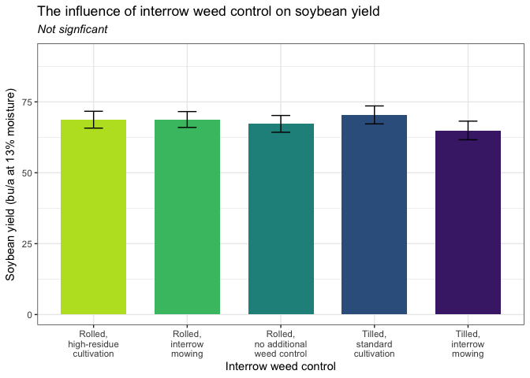

Bean Yield
================

# **Load libraries**

``` r
#Set work directory
setwd("/Users/ey239/Github/Mowtivation/rmarkdowns")

#Load packages 
library(tidyverse) ##install.packages("tidyverse")
library(knitr)
library(patchwork) ##install.packages("patchwork")
library(skimr)     ##install.packages("skimr")
library(readxl)
library(janitor) ##install.packages("janitor")
library(kableExtra) ##install.packages("kableExtra")
library(webshot) ##install.packages("webshot")
webshot::install_phantomjs()
library(viridis) ##install.packages("viridis")
library(lme4) ##install.packages("lme4")
library(lmerTest) ##install.packages("lmerTest")
library(emmeans) ##install.packages("emmeans")
library(rstatix) ##install.packages("rstatix")
#library(Matrix) ##install.packages("Matrix")
library(multcomp) ##install.packages("multcomp")
library(multcompView) ##install.packages("multcompView")
library(ggResidpanel) ##install.packages("ggResidpanel")
#library(car)
#library(TMB)  ##install.packages("TMB")
#library(glmmTMB)  ##install.packages("glmmTMB")
#library(DHARMa)  ##install.packages("DHARMa")

#Load Functions
MeanPlusSe<-function(x) mean(x)+plotrix::std.error(x)

find_logw0=function(x){c=trunc(log(min(x[x>0],na.rm=T)))
d=exp(c)
return(d)}
```

<br>

# **Load and Clean Data**

### **Load individual datasets**

``` r
combined_raw <- read_excel("~/Github/Mowtivation/raw-data/All Treatments/combined_raw.xlsx")
kable(head(combined_raw))
```

| id | location | year | treatment | block | plot | bean_emergence | bean_biomass | intrarow_weed_biomass | interrow_weed_biomass | weed_biomass | bean_population | bean_yield |
|:---|:---|---:|:---|---:|---:|---:|---:|---:|---:|---:|:---|:---|
| CU_B1_P101 | field x | 2023 | TIM | 1 | 101 | 46.5 | 223.740 | 19.000 | 44.490 | 63.490 | 34.5 | 417.21 |
| CU_B1_P102 | field x | 2023 | TIC | 1 | 102 | 42.5 | 267.460 | 30.975 | 0.720 | 31.695 | 39.5 | 565.54 |
| CU_B1_P103 | field x | 2023 | RIM | 1 | 103 | 36.5 | 217.890 | 0.950 | 6.890 | 3.920 | 37.5 | 449.93 |
| CU_B1_P104 | field x | 2023 | RNO | 1 | 104 | 41.0 | 207.675 | 0.660 | 45.735 | 46.395 | 35 | 412.59 |
| CU_B1_P105 | field x | 2023 | RIC | 1 | 105 | 41.0 | 230.285 | 0.495 | 22.025 | 22.520 | 39 | 473.79 |
| CU_B1_P201 | field x | 2023 | RIC | 2 | 201 | 36.5 | 208.105 | 6.395 | 19.460 | 25.855 | 33.5 | 484.04 |

``` r
#Standardaze column names, convert to factors, check for outliers of variable**
clean_combined <- clean_names(combined_raw) |>  
  rename ('weed_control'= treatment) |> 
  mutate(across(c(weed_control, block, plot, location, year), as.factor)) #|> 
  #mutate(is_outlier = totwbm < (quantile(totwbm, 0.25) - 1.5 * IQR(totwbm)) |
                       #wbm > (quantile(totwbm, 0.75) + 1.5 * IQR(totwbm)))

#select and convert data for wbm analysis
  bean_yield_clean <- clean_combined |>  
    filter(!is.na(bean_yield)) |>
  mutate(bean_yield = as.numeric(bean_yield)) |>  # Convert beanyd to numeric
    # Exclude rows with NA in beanyd
  mutate(
    bean_yield_adj_bu_acre = (((bean_yield / 454) / (16.4 / 43560)) / 60) * ((100 - 0.00001) / (100 - 14)),
    bean_yield_adj_lbs_acre = ((bean_yield / 454) / (16.4 / 43560)) * ((100 - 0.00001) / (100 - 14)),
    bean_yield_adj_kg_ha = ((bean_yield / 454) / (16.4 / 43560)) * 1.12085 * ((100 - 0.00001) / (100 - 14))
  )
```

    ## Warning: There was 1 warning in `mutate()`.
    ## ℹ In argument: `bean_yield = as.numeric(bean_yield)`.
    ## Caused by warning:
    ## ! NAs introduced by coercion

``` r
kable(head(bean_yield_clean)) 
```

| id | location | year | weed_control | block | plot | bean_emergence | bean_biomass | intrarow_weed_biomass | interrow_weed_biomass | weed_biomass | bean_population | bean_yield | bean_yield_adj_bu_acre | bean_yield_adj_lbs_acre | bean_yield_adj_kg_ha |
|:---|:---|:---|:---|:---|:---|---:|---:|---:|---:|---:|:---|---:|---:|---:|---:|
| CU_B1_P101 | field x | 2023 | TIM | 1 | 101 | 46.5 | 223.740 | 19.000 | 44.490 | 63.490 | 34.5 | 417.21 | 47.30348 | 2838.209 | 3181.207 |
| CU_B1_P102 | field x | 2023 | TIC | 1 | 102 | 42.5 | 267.460 | 30.975 | 0.720 | 31.695 | 39.5 | 565.54 | 64.12122 | 3847.273 | 4312.216 |
| CU_B1_P103 | field x | 2023 | RIM | 1 | 103 | 36.5 | 217.890 | 0.950 | 6.890 | 3.920 | 37.5 | 449.93 | 51.01330 | 3060.798 | 3430.695 |
| CU_B1_P104 | field x | 2023 | RNO | 1 | 104 | 41.0 | 207.675 | 0.660 | 45.735 | 46.395 | 35 | 412.59 | 46.77967 | 2806.780 | 3145.979 |
| CU_B1_P105 | field x | 2023 | RIC | 1 | 105 | 41.0 | 230.285 | 0.495 | 22.025 | 22.520 | 39 | 473.79 | 53.71855 | 3223.113 | 3612.626 |
| CU_B1_P201 | field x | 2023 | RIC | 2 | 201 | 36.5 | 208.105 | 6.395 | 19.460 | 25.855 | 33.5 | 484.04 | 54.88070 | 3292.842 | 3690.782 |

<br>

## **Model testing**

### **block is random**

\#Ask tyler about model format, should block always be fixed, etc.
should location be nested in year? Do i need to transform data if zeros
are present? How to separate year from location?

Last meeting we updated the model and determined that for most of mhy
work, block should be random using model below and that post hoc
comparisons should use TUKEY ratther the Fischer.

``` r
random <- lmer( bean_yield_adj_bu_acre  ~ location+weed_control + location:weed_control +(1|location:block) , data =  bean_yield_clean)

resid_panel(random)
```

<!-- -->

<br>

\##**Joint test**

``` r
 random |> 
  joint_tests() |> 
  kable()  
```

|     | model term            | df1 |   df2 | F.ratio |   p.value |
|:----|:----------------------|----:|------:|--------:|----------:|
| 1   | location              |   2 |  8.67 |  34.446 | 0.0000752 |
| 3   | weed_control          |   4 | 35.03 |   1.135 | 0.3562477 |
| 2   | location:weed_control |   8 | 35.03 |   1.248 | 0.3013225 |

<br>

# **Means comparison**

``` r
means <- emmeans(random, ~  weed_control)
# Optional: Adjust for multiple comparisons (e.g., using Tukey's method)

pairwise_comparisons<- pairs(means) 
kable(head(pairwise_comparisons))
```

| contrast  |   estimate |       SE |       df |    t.ratio |   p.value |
|:----------|-----------:|---------:|---------:|-----------:|----------:|
| RIC - RIM | -0.1501923 | 2.819198 | 35.73048 | -0.0532748 | 1.0000000 |
| RIC - RNO |  1.4725294 | 2.736174 | 35.03121 |  0.5381710 | 0.9955121 |
| RIC - TIC | -1.6850234 | 2.736174 | 35.03121 | -0.6158319 | 0.9907685 |
| RIC - TIM |  3.7934286 | 2.736174 | 35.03121 |  1.3863988 | 0.6832901 |
| RIM - RNO |  1.6227217 | 2.819198 | 35.73048 |  0.5755969 | 0.9935448 |
| RIM - TIC | -1.5348311 | 2.819198 | 35.73048 | -0.5444212 | 0.9952174 |

### **Fisher’s method for comparing means**

``` r
#weed_control
cld_weed_control_tukey <-cld(emmeans(random, ~  weed_control, type = "response"), Letters = letters, sort = TRUE, reversed=TRUE)
```

    ## NOTE: Results may be misleading due to involvement in interactions

``` r
cld_weed_control_tukey
```

    ##  weed_control emmean   SE   df lower.CL upper.CL .group
    ##  TIC            70.4 1.96 43.9     66.5     74.3  a    
    ##  RIM            68.9 2.07 44.0     64.7     73.0  a    
    ##  RIC            68.7 1.96 43.9     64.8     72.7  a    
    ##  RNO            67.2 1.96 43.9     63.3     71.2  a    
    ##  TIM            64.9 1.96 43.9     61.0     68.9  a    
    ## 
    ## Results are averaged over the levels of: location 
    ## Degrees-of-freedom method: kenward-roger 
    ## Confidence level used: 0.95 
    ## P value adjustment: tukey method for comparing a family of 5 estimates 
    ## significance level used: alpha = 0.05 
    ## NOTE: If two or more means share the same grouping symbol,
    ##       then we cannot show them to be different.
    ##       But we also did not show them to be the same.

``` r
#location
cld_location_tukey <-cld(emmeans(random, ~  location, type = "response"), Letters = letters, sort = TRUE, reversed=TRUE)
```

    ## NOTE: Results may be misleading due to involvement in interactions

``` r
cld_location_tukey
```

    ##  location      emmean   SE   df lower.CL upper.CL .group
    ##  field O2 east   74.7 1.58 8.67     71.1     78.3  a    
    ##  field O2 west   72.0 1.63 9.54     68.3     75.6  a    
    ##  field x         57.4 1.58 8.67     53.8     61.0   b   
    ## 
    ## Results are averaged over the levels of: weed_control 
    ## Degrees-of-freedom method: kenward-roger 
    ## Confidence level used: 0.95 
    ## P value adjustment: tukey method for comparing a family of 3 estimates 
    ## significance level used: alpha = 0.05 
    ## NOTE: If two or more means share the same grouping symbol,
    ##       then we cannot show them to be different.
    ##       But we also did not show them to be the same.

``` r
#weed_control|location
cld_weed_control_location_tukey <-cld(emmeans(random, ~  weed_control|location, type = "response"), Letters = letters, sort = TRUE, reversed=TRUE)
cld_weed_control_location_tukey
```

    ## location = field O2 east:
    ##  weed_control emmean   SE   df lower.CL upper.CL .group
    ##  RIC            77.8 3.39 43.9     71.0     84.6  a    
    ##  RNO            76.6 3.39 43.9     69.8     83.4  a    
    ##  RIM            75.2 3.39 43.9     68.4     82.1  a    
    ##  TIM            72.3 3.39 43.9     65.5     79.2  a    
    ##  TIC            71.7 3.39 43.9     64.8     78.5  a    
    ## 
    ## location = field O2 west:
    ##  weed_control emmean   SE   df lower.CL upper.CL .group
    ##  TIC            79.5 3.39 43.9     72.7     86.4  a    
    ##  TIM            71.0 3.39 43.9     64.1     77.8  a    
    ##  RIC            70.9 3.39 43.9     64.0     77.7  a    
    ##  RIM            69.5 3.95 44.0     61.5     77.5  a    
    ##  RNO            68.9 3.39 43.9     62.1     75.8  a    
    ## 
    ## location = field x:
    ##  weed_control emmean   SE   df lower.CL upper.CL .group
    ##  RIM            61.9 3.39 43.9     55.1     68.7  a    
    ##  TIC            60.0 3.39 43.9     53.2     66.8  a    
    ##  RIC            57.5 3.39 43.9     50.7     64.3  a    
    ##  RNO            56.2 3.39 43.9     49.4     63.0  a    
    ##  TIM            51.5 3.39 43.9     44.6     58.3  a    
    ## 
    ## Degrees-of-freedom method: kenward-roger 
    ## Confidence level used: 0.95 
    ## P value adjustment: tukey method for comparing a family of 5 estimates 
    ## significance level used: alpha = 0.05 
    ## NOTE: If two or more means share the same grouping symbol,
    ##       then we cannot show them to be different.
    ##       But we also did not show them to be the same.

# **FIGURES** only location was significant

## **weed_control**

``` r
bean_yield_clean |> 
  left_join(cld_weed_control_tukey) |> 
  ggplot(aes(x = weed_control, y = bean_yield_adj_bu_acre, fill = weed_control)) +
  stat_summary(geom = "bar", fun = "mean", width = 0.7) +
  stat_summary(geom = "errorbar", fun.data = "mean_se", width = 0.2) +
  #stat_summary(geom="text", fun = "MeanPlusSe", aes(label= trimws(.group)),size=6.5,vjust=-0.5) +
  labs(
    x = "Method of interrow weed control",
    y = expression("Soybean yield" ~ (bu ~ acre^{-1})),
    title = str_c("The influence of the method of interrow weed control on soybean yield"),
    subtitle = expression(italic("Not signficant"))) +
  
  scale_x_discrete(labels = c("Rolled,\nhigh-residue\ncultivation",
                              "Rolled,\ninterrow\nmowing",
                              "Rolled,\nno additional\nweed control",
                          "Tilled,\nstandard\ncultivation",
                              "Tilled,\ninterrow\nmowing")) +
  scale_y_continuous(expand = expansion(mult = c(0.05, 0.3))) +
  scale_fill_viridis(discrete = TRUE, option = "D", direction = -1, end = 0.9, begin = 0.1) +
   theme_bw() +
  theme(
    legend.position = "none",
    strip.background = element_blank(),
    strip.text = element_text(face = "bold", size = 12)
  )
```

    ## Warning: Removed 1 row containing non-finite outside the scale range (`stat_summary()`).
    ## Removed 1 row containing non-finite outside the scale range (`stat_summary()`).

<!-- -->

``` r
ggsave("beanydall_plot_cutivation.png", width = 8, height = 6, dpi = 300)
```

    ## Warning: Removed 1 row containing non-finite outside the scale range (`stat_summary()`).
    ## Removed 1 row containing non-finite outside the scale range (`stat_summary()`).

## **location**

``` r
bean_yield_clean |> 
  left_join(cld_location_tukey) |> 
  ggplot(aes(x = location, y = bean_yield_adj_bu_acre, fill = location)) +
  stat_summary(geom = "bar", fun = "mean", width = 0.7) +
  stat_summary(geom = "errorbar", fun.data = "mean_se", width = 0.2) +
  #stat_summary(geom="text", fun = "MeanPlusSe", aes(label= trimws(.group)),size=6.5,vjust=-0.5) +
  labs(
    x = "Location",
    y = expression("Soybean yield" ~ (bu ~ A^{-1})),
    title = str_c("The influence of location on soybean yield"),
    subtitle = expression(italic("P < 0.005"))) +
   scale_x_discrete(labels = c("Field O2 East ",
                              "Field O2 West",
                              "Field X")) +
  scale_y_continuous(expand = expansion(mult = c(0.05, 0.3))) +
  scale_fill_viridis(discrete = TRUE, option = "D", direction = -1, end = 0.9, begin = 0.1) +
   theme_bw() +
  theme(
    legend.position = "none",
    strip.background = element_blank(),
    strip.text = element_text(face = "bold", size = 12)
  )
```

    ## Warning: Removed 1 row containing non-finite outside the scale range (`stat_summary()`).
    ## Removed 1 row containing non-finite outside the scale range (`stat_summary()`).

<!-- -->

``` r
ggsave("beanydall_location.png", width = 8, height = 6, dpi = 300)
```

    ## Warning: Removed 1 row containing non-finite outside the scale range (`stat_summary()`).
    ## Removed 1 row containing non-finite outside the scale range (`stat_summary()`).
