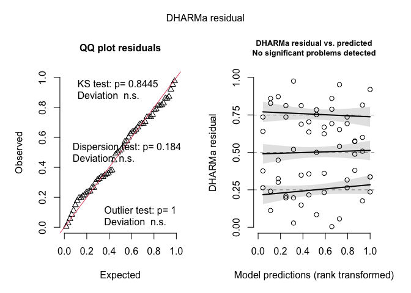
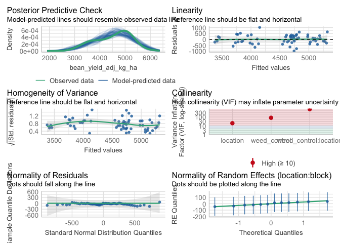
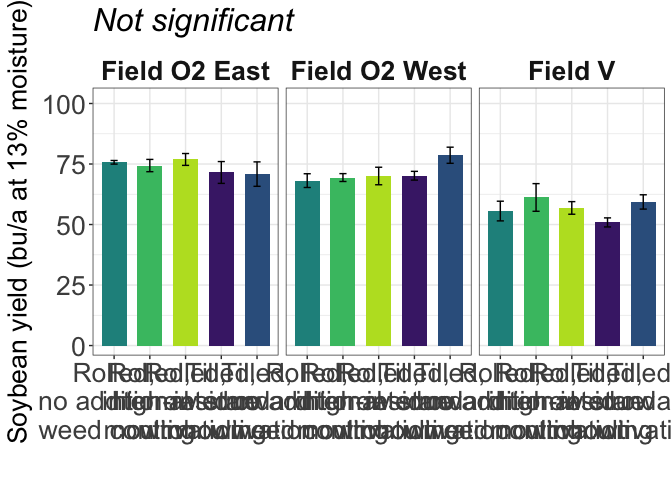

Bean Yield
================

# Load libraries

``` r
#Set work directory
setwd("/Users/ey239/Github/Mowtivation/rmarkdowns")

#Load packages 
library(tidyverse) ##install.packages("tidyverse")
library(knitr)
library(patchwork) ##install.packages("patchwork")
library(skimr)     ##install.packages("skimr")
library(readxl)
library(janitor) ##install.packages("janitor")
library(kableExtra) ##install.packages("kableExtra")
library(webshot) ##install.packages("webshot")
webshot::install_phantomjs()
library(viridis) ##install.packages("viridis")
library(lmerTest) ##install.packages("lmerTest")
library(emmeans) ##install.packages("emmeans")
library(rstatix) ##install.packages("rstatix")
#library(Matrix) ##install.packages("Matrix")
library(multcomp) ##install.packages("multcomp")
library(multcompView) ##install.packages("multcompView")
library(ggResidpanel) ##install.packages("ggResidpanel")
#library(car)
#library(TMB)  ##install.packages("TMB")
#library(glmmTMB)  ##install.packages("glmmTMB")
library(DHARMa)  ##install.packages("DHARMa")
library(performance) ##install.packages("performance")
#Load Functions
MeanPlusSe<-function(x) mean(x)+plotrix::std.error(x)

find_logw0=function(x){c=trunc(log(min(x[x>0],na.rm=T)))
d=exp(c)
return(d)}
```

<br>

# Load and clean data

## Load data

``` r
combined_raw <- read_excel("~/Github/Mowtivation/raw-data/All Treatments/combined_raw.xlsx")
kable(head(combined_raw))
```

| id | location | year | treatment | block | plot | bean_emergence | bean_biomass | intrarow_weed_biomass | interrow_weed_biomass | weed_biomass | bean_population | bean_yield | seed_weight |
|:---|:---|---:|:---|---:|---:|---:|---:|---:|---:|---:|---:|---:|---:|
| CU_B1_P101 | field v | 2023 | TIM | 1 | 101 | 46.5 | 223.740 | 19.000 | 44.490 | 63.490 | 34.5 | 417.21 | 17.1200 |
| CU_B1_P102 | field v | 2023 | TIC | 1 | 102 | 42.5 | 267.460 | 30.975 | 0.720 | 31.695 | 39.5 | 565.54 | 17.4750 |
| CU_B1_P103 | field v | 2023 | RIM | 1 | 103 | 36.5 | 217.890 | 0.950 | 6.890 | 7.840 | 37.5 | 449.93 | 16.7525 |
| CU_B1_P104 | field v | 2023 | RNO | 1 | 104 | 41.0 | 207.675 | 0.660 | 45.735 | 46.395 | 35.0 | 412.59 | 16.1450 |
| CU_B1_P105 | field v | 2023 | RIC | 1 | 105 | 41.0 | 230.285 | 0.495 | 22.025 | 22.520 | 39.0 | 473.79 | 17.0475 |
| CU_B1_P201 | field v | 2023 | RIC | 2 | 201 | 36.5 | 208.105 | 6.395 | 19.460 | 25.855 | 33.5 | 484.04 | 17.1500 |

<br>

## Clean data

``` r
#Standardaze column names, convert to factors, check for outliers of variable**
clean_combined <- clean_names(combined_raw) |>  
  rename ('weed_control'= treatment) |> 
  mutate(across(c(weed_control, block, plot, location, year), as.factor)) 

#select and convert data for wbm analysis
  bean_yield_clean <- clean_combined |>  
    filter(!is.na(bean_yield)) |>
  mutate(bean_yield = as.numeric(bean_yield)) |>  # Convert beanyd to numeric
    # Exclude rows with NA in beanyd
  mutate(
    bean_yield_adj_bu_acre = (((bean_yield / 454) / (16.4 / 43560)) / 60) * ((100 - 0.00001) / (100 - 13)),
    bean_yield_adj_lbs_acre = ((bean_yield / 454) / (16.4 / 43560)) * ((100 - 0.00001) / (100 - 13)),
    bean_yield_adj_kg_ha = ((bean_yield / 454) / (16.4 / 43560)) * 1.12085 * ((100 - 0.00001) / (100 - 13))
  )
kable(head(bean_yield_clean)) 
```

| id | location | year | weed_control | block | plot | bean_emergence | bean_biomass | intrarow_weed_biomass | interrow_weed_biomass | weed_biomass | bean_population | bean_yield | seed_weight | bean_yield_adj_bu_acre | bean_yield_adj_lbs_acre | bean_yield_adj_kg_ha |
|:---|:---|:---|:---|:---|:---|---:|---:|---:|---:|---:|---:|---:|---:|---:|---:|---:|
| CU_B1_P101 | field v | 2023 | TIM | 1 | 101 | 46.5 | 223.740 | 19.000 | 44.490 | 63.490 | 34.5 | 417.21 | 17.1200 | 46.75977 | 2805.586 | 3144.641 |
| CU_B1_P102 | field v | 2023 | TIC | 1 | 102 | 42.5 | 267.460 | 30.975 | 0.720 | 31.695 | 39.5 | 565.54 | 17.4750 | 63.38419 | 3803.051 | 4262.650 |
| CU_B1_P103 | field v | 2023 | RIM | 1 | 103 | 36.5 | 217.890 | 0.950 | 6.890 | 7.840 | 37.5 | 449.93 | 16.7525 | 50.42694 | 3025.616 | 3391.262 |
| CU_B1_P104 | field v | 2023 | RNO | 1 | 104 | 41.0 | 207.675 | 0.660 | 45.735 | 46.395 | 35.0 | 412.59 | 16.1450 | 46.24197 | 2774.518 | 3109.819 |
| CU_B1_P105 | field v | 2023 | RIC | 1 | 105 | 41.0 | 230.285 | 0.495 | 22.025 | 22.520 | 39.0 | 473.79 | 17.0475 | 53.10110 | 3186.066 | 3571.102 |
| CU_B1_P201 | field v | 2023 | RIC | 2 | 201 | 36.5 | 208.105 | 6.395 | 19.460 | 25.855 | 33.5 | 484.04 | 17.1500 | 54.24989 | 3254.994 | 3648.359 |

<br>

# Model testing

## Lmer

Block is random Tyler is under the impression that block should always
be random and that post-hoc comparisons should use TUKEY rather the
Fischer. Fisher is bogus apparently.

``` r
yield.lmer <- lmer( bean_yield_adj_kg_ha  ~ weed_control*location + (1|location:block) , data =  bean_yield_clean)


resid_panel(yield.lmer)
```

<!-- -->

``` r
simulateResiduals(yield.lmer,plot = TRUE) # Residuals and normality look good
```

<!-- -->

    ## Object of Class DHARMa with simulated residuals based on 250 simulations with refit = FALSE . See ?DHARMa::simulateResiduals for help. 
    ##  
    ## Scaled residual values: 0.264 0.736 0.028 0.112 0.3 0.324 0.828 0.196 0.812 0.736 0.64 0.208 0.448 0.976 0.86 0.872 0.24 0.52 0.196 0.376 ...

``` r
check_model(yield.lmer)
```

<!-- -->

<br>

## Anova

``` r
 joint_tests(emmeans(yield.lmer, ~ weed_control * location))
```

    ##  model term            df1 df2 F.ratio p.value
    ##  weed_control            4  36   1.205  0.3256
    ##  location                2   9  34.191  0.0001
    ##  weed_control:location   8  36   1.273  0.2882

<br>

## Tukey means comparisons

### Weed-control (not significant)

``` r
tukey_weed_control <- emmeans(yield.lmer, list(pairwise ~ weed_control), adjust = "tukey")
```

    ## NOTE: Results may be misleading due to involvement in interactions

``` r
tukey_weed_control
```

    ## $`emmeans of weed_control`
    ##  weed_control emmean  SE   df lower.CL upper.CL
    ##  RIC            4568 129 44.8     4309     4828
    ##  RIM            4594 129 44.8     4335     4854
    ##  RNO            4470 129 44.8     4211     4730
    ##  TIC            4680 129 44.8     4421     4940
    ##  TIM            4316 129 44.8     4057     4576
    ## 
    ## Results are averaged over the levels of: location 
    ## Degrees-of-freedom method: kenward-roger 
    ## Confidence level used: 0.95 
    ## 
    ## $`pairwise differences of weed_control`
    ##  1         estimate  SE df t.ratio p.value
    ##  RIC - RIM    -26.1 179 36  -0.145  0.9999
    ##  RIC - RNO     97.9 179 36   0.546  0.9817
    ##  RIC - TIC   -112.0 179 36  -0.625  0.9701
    ##  RIC - TIM    252.2 179 36   1.407  0.6273
    ##  RIM - RNO    124.0 179 36   0.692  0.9570
    ##  RIM - TIC    -85.9 179 36  -0.479  0.9888
    ##  RIM - TIM    278.3 179 36   1.552  0.5365
    ##  RNO - TIC   -209.9 179 36  -1.171  0.7675
    ##  RNO - TIM    154.3 179 36   0.861  0.9092
    ##  TIC - TIM    364.2 179 36   2.032  0.2719
    ## 
    ## Results are averaged over the levels of: location 
    ## Degrees-of-freedom method: kenward-roger 
    ## P value adjustment: tukey method for comparing a family of 5 estimates

``` r
cld_weed_control_tukey <- cld(emmeans(yield.lmer, ~ weed_control), adjust = "tukey", Letters = letters, sort = TRUE, reversed = TRUE)
```

    ## NOTE: Results may be misleading due to involvement in interactions

    ## Note: adjust = "tukey" was changed to "sidak"
    ## because "tukey" is only appropriate for one set of pairwise comparisons

``` r
cld_weed_control_tukey
```

    ##  weed_control emmean  SE   df lower.CL upper.CL .group
    ##  TIC            4680 129 44.8     4335     5026  a    
    ##  RIM            4594 129 44.8     4249     4940  a    
    ##  RIC            4568 129 44.8     4223     4914  a    
    ##  RNO            4470 129 44.8     4125     4816  a    
    ##  TIM            4316 129 44.8     3971     4662  a    
    ## 
    ## Results are averaged over the levels of: location 
    ## Degrees-of-freedom method: kenward-roger 
    ## Confidence level used: 0.95 
    ## Conf-level adjustment: sidak method for 5 estimates 
    ## P value adjustment: tukey method for comparing a family of 5 estimates 
    ## significance level used: alpha = 0.05 
    ## NOTE: If two or more means share the same grouping symbol,
    ##       then we cannot show them to be different.
    ##       But we also did not show them to be the same.

<br>

### Location (significant)

``` r
tukey_location <- emmeans(yield.lmer, list(pairwise ~ location), adjust = "tukey")
```

    ## NOTE: Results may be misleading due to involvement in interactions

``` r
tukey_location
```

    ## $`emmeans of location`
    ##  location      emmean  SE df lower.CL upper.CL
    ##  field O2 east   4967 106  9     4727     5207
    ##  field O2 west   4793 106  9     4554     5033
    ##  field v         3817 106  9     3578     4057
    ## 
    ## Results are averaged over the levels of: weed_control 
    ## Degrees-of-freedom method: kenward-roger 
    ## Confidence level used: 0.95 
    ## 
    ## $`pairwise differences of location`
    ##  1                             estimate  SE df t.ratio p.value
    ##  field O2 east - field O2 west      174 150  9   1.159  0.5047
    ##  field O2 east - field v           1150 150  9   7.670  0.0001
    ##  field O2 west - field v            976 150  9   6.511  0.0003
    ## 
    ## Results are averaged over the levels of: weed_control 
    ## Degrees-of-freedom method: kenward-roger 
    ## P value adjustment: tukey method for comparing a family of 3 estimates

``` r
cld_location_tukey <- cld(emmeans(yield.lmer, ~ location), adjust = "tukey", Letters = letters, sort = TRUE, reversed = TRUE)
```

    ## NOTE: Results may be misleading due to involvement in interactions

    ## Note: adjust = "tukey" was changed to "sidak"
    ## because "tukey" is only appropriate for one set of pairwise comparisons

``` r
cld_location_tukey
```

    ##  location      emmean  SE df lower.CL upper.CL .group
    ##  field O2 east   4967 106  9     4657     5277  a    
    ##  field O2 west   4793 106  9     4484     5103  a    
    ##  field v         3817 106  9     3507     4127   b   
    ## 
    ## Results are averaged over the levels of: weed_control 
    ## Degrees-of-freedom method: kenward-roger 
    ## Confidence level used: 0.95 
    ## Conf-level adjustment: sidak method for 3 estimates 
    ## P value adjustment: tukey method for comparing a family of 3 estimates 
    ## significance level used: alpha = 0.05 
    ## NOTE: If two or more means share the same grouping symbol,
    ##       then we cannot show them to be different.
    ##       But we also did not show them to be the same.

<br>

\###weed_control:location (not significant)

``` r
tukey_weed_control_location <- emmeans(yield.lmer, list(pairwise ~ weed_control|location), adjust = "tukey")
tukey_weed_control_location
```

    ## $`emmeans of weed_control | location`
    ## location = field O2 east:
    ##  weed_control emmean  SE   df lower.CL upper.CL
    ##  RIC            5171 223 44.8     4721     5620
    ##  RIM            5001 223 44.8     4552     5450
    ##  RNO            5091 223 44.8     4642     5541
    ##  TIC            4764 223 44.8     4314     5213
    ##  TIM            4809 223 44.8     4359     5258
    ## 
    ## location = field O2 west:
    ##  weed_control emmean  SE   df lower.CL upper.CL
    ##  RIC            4711 223 44.8     4261     5160
    ##  RIM            4667 223 44.8     4218     5117
    ##  RNO            4583 223 44.8     4133     5032
    ##  TIC            5287 223 44.8     4838     5737
    ##  TIM            4718 223 44.8     4269     5168
    ## 
    ## location = field v:
    ##  weed_control emmean  SE   df lower.CL upper.CL
    ##  RIC            3824 223 44.8     3374     4273
    ##  RIM            4115 223 44.8     3665     4564
    ##  RNO            3737 223 44.8     3288     4187
    ##  TIC            3990 223 44.8     3541     4439
    ##  TIM            3421 223 44.8     2972     3871
    ## 
    ## Degrees-of-freedom method: kenward-roger 
    ## Confidence level used: 0.95 
    ## 
    ## $`pairwise differences of weed_control | location`
    ## location = field O2 east:
    ##  2         estimate  SE df t.ratio p.value
    ##  RIC - RIM   169.59 310 36   0.546  0.9817
    ##  RIC - RNO    79.14 310 36   0.255  0.9990
    ##  RIC - TIC   407.01 310 36   1.311  0.6862
    ##  RIC - TIM   361.79 310 36   1.165  0.7706
    ##  RIM - RNO   -90.45 310 36  -0.291  0.9984
    ##  RIM - TIC   237.43 310 36   0.765  0.9390
    ##  RIM - TIM   192.20 310 36   0.619  0.9711
    ##  RNO - TIC   327.87 310 36   1.056  0.8273
    ##  RNO - TIM   282.65 310 36   0.910  0.8910
    ##  TIC - TIM   -45.22 310 36  -0.146  0.9999
    ## 
    ## location = field O2 west:
    ##  2         estimate  SE df t.ratio p.value
    ##  RIC - RIM    43.34 310 36   0.140  0.9999
    ##  RIC - RNO   128.13 310 36   0.413  0.9936
    ##  RIC - TIC  -576.60 310 36  -1.857  0.3581
    ##  RIC - TIM    -7.54 310 36  -0.024  1.0000
    ##  RIM - RNO    84.79 310 36   0.273  0.9987
    ##  RIM - TIC  -619.94 310 36  -1.997  0.2880
    ##  RIM - TIM   -50.88 310 36  -0.164  0.9998
    ##  RNO - TIC  -704.74 310 36  -2.270  0.1782
    ##  RNO - TIM  -135.67 310 36  -0.437  0.9921
    ##  TIC - TIM   569.07 310 36   1.833  0.3712
    ## 
    ## location = field v:
    ##  2         estimate  SE df t.ratio p.value
    ##  RIC - RIM  -291.17 310 36  -0.938  0.8802
    ##  RIC - RNO    86.40 310 36   0.278  0.9986
    ##  RIC - TIC  -166.46 310 36  -0.536  0.9829
    ##  RIC - TIM   402.29 310 36   1.296  0.6954
    ##  RIM - RNO   377.56 310 36   1.216  0.7421
    ##  RIM - TIC   124.70 310 36   0.402  0.9943
    ##  RIM - TIM   693.45 310 36   2.234  0.1907
    ##  RNO - TIC  -252.86 310 36  -0.814  0.9245
    ##  RNO - TIM   315.89 310 36   1.017  0.8456
    ##  TIC - TIM   568.75 310 36   1.832  0.3717
    ## 
    ## Degrees-of-freedom method: kenward-roger 
    ## P value adjustment: tukey method for comparing a family of 5 estimates

``` r
cld_weed_control_location_tukey <- cld(emmeans(yield.lmer, ~ weed_control|location), adjust = "tukey", Letters = letters, sort = TRUE, reversed = TRUE)
```

    ## Note: adjust = "tukey" was changed to "sidak"
    ## because "tukey" is only appropriate for one set of pairwise comparisons

``` r
cld_weed_control_location_tukey
```

    ## location = field O2 east:
    ##  weed_control emmean  SE   df lower.CL upper.CL .group
    ##  RIC            5171 223 44.8     4572     5769  a    
    ##  RNO            5091 223 44.8     4493     5690  a    
    ##  RIM            5001 223 44.8     4403     5599  a    
    ##  TIM            4809 223 44.8     4210     5407  a    
    ##  TIC            4764 223 44.8     4165     5362  a    
    ## 
    ## location = field O2 west:
    ##  weed_control emmean  SE   df lower.CL upper.CL .group
    ##  TIC            5287 223 44.8     4689     5886  a    
    ##  TIM            4718 223 44.8     4120     5317  a    
    ##  RIC            4711 223 44.8     4112     5309  a    
    ##  RIM            4667 223 44.8     4069     5266  a    
    ##  RNO            4583 223 44.8     3984     5181  a    
    ## 
    ## location = field v:
    ##  weed_control emmean  SE   df lower.CL upper.CL .group
    ##  RIM            4115 223 44.8     3516     4713  a    
    ##  TIC            3990 223 44.8     3391     4588  a    
    ##  RIC            3824 223 44.8     3225     4422  a    
    ##  RNO            3737 223 44.8     3139     4336  a    
    ##  TIM            3421 223 44.8     2823     4020  a    
    ## 
    ## Degrees-of-freedom method: kenward-roger 
    ## Confidence level used: 0.95 
    ## Conf-level adjustment: sidak method for 5 estimates 
    ## P value adjustment: tukey method for comparing a family of 5 estimates 
    ## significance level used: alpha = 0.05 
    ## NOTE: If two or more means share the same grouping symbol,
    ##       then we cannot show them to be different.
    ##       But we also did not show them to be the same.

# Figures

\###Bu/a \#### weed_control:location (not significant)

``` r
bean_yield_clean |> 
  left_join(cld_weed_control_location_tukey) |> 
  ggplot(aes(x = factor(weed_control, levels = c("RNO", "RIM", "RIC", "TIM", "TIC")), y = bean_yield_adj_bu_acre, fill = weed_control)) + 
facet_wrap( ~location, labeller = labeller(
    location = c("field O2 east" = "Field O2 East", "field O2 west" = "Field O2 West","field v" = "Field V" )))+
  stat_summary(geom = "bar", fun = "mean", width = 0.7) +
  stat_summary(geom = "errorbar", fun.data = "mean_se", width = 0.2) +
  #stat_summary(geom="text", fun = "MeanPlusSe", aes(label= trimws(.group)),size=6.5,vjust=-0.5) +
  labs(
    x = "",
    y = expression(paste("Soybean yield (", bu, "/", a, " at 13% moisture)")),
    #title = str_c("The influence of interrow weed control on soybean yield"),
    subtitle = expression(italic("Not significant"))) +
  
  scale_x_discrete(labels = c("Rolled,\nno additional\nweed control",
                              "Rolled,\ninterrow\nmowing",
                              "Rolled,\nhigh-residue\ncultivation",
                              "Tilled,\ninterrow\nmowing",
                          "Tilled,\nstandard\ncultivation")) +
  scale_y_continuous(expand = expansion(mult = c(0.05, 0.3))) +
  scale_fill_viridis(discrete = TRUE, option = "D", direction = -1, end = 0.9, begin = 0.1) +
   theme_bw() +
  theme(
    legend.position = "none",
    strip.background = element_blank(),
    strip.text = element_text(face = "bold", size = 20),
    axis.title = element_text(size = 20),  # Increase font size of axis titles
    axis.text = element_text(size = 20),   # Increase font size of axis labels
    plot.title = element_text(size = 24, face = "bold"),  # Increase font size of title
    plot.subtitle = element_text(size = 24, face = "italic")  # Increase font size of subtitle
  )
```

<!-- -->

``` r
ggsave("bean_yield_weed_control_location_bua.png", width = 24, height = 8, dpi = 300)
```

\###Kg/hectare \#### weed_control:location (not significant)

``` r
bean_yield_clean |> 
  left_join(cld_weed_control_location_tukey) |> 
  ggplot(aes(x = factor(weed_control, levels = c("RNO", "RIM", "RIC", "TIM", "TIC")), y =  bean_yield_adj_kg_ha, fill = weed_control)) +
  facet_wrap( ~location, labeller = labeller(
    location = c("field O2 east" = "Field O2 East", "field O2 west" = "Field O2 West","field v" = "Field V" )))+
  stat_summary(geom = "bar", fun = "mean", width = 0.7) +
  stat_summary(geom = "errorbar", fun.data = "mean_se", width = 0.2) +
  #stat_summary(geom="text", fun = "MeanPlusSe", aes(label= trimws(.group)),size=6.5,vjust=-0.5) +
  labs(
    x = "",
    y = expression(paste("Soybean yield (", kg~ha^{-1}, " at 13% moisture)")),

    #title = str_c("The influence of interrow weed control on soybean yield"),
    subtitle = expression(italic("Not significant"))) +
  
  scale_x_discrete(labels = c("Rolled,\nno additional\nweed control",
                              "Rolled,\ninterrow\nmowing",
                              "Rolled,\nhigh-residue\ncultivation",
                              "Tilled,\ninterrow\nmowing",
                          "Tilled,\nstandard\ncultivation")) +
  scale_y_continuous(expand = expansion(mult = c(0.05, 0.3))) +
  scale_fill_viridis(discrete = TRUE, option = "D", direction = -1, end = 0.9, begin = 0.1) +
   theme_bw() +
  theme(
    legend.position = "none",
    strip.background = element_blank(),
    strip.text = element_text(face = "bold", size = 20),
    axis.title = element_text(size = 20),  # Increase font size of axis titles
    axis.text = element_text(size = 20),   # Increase font size of axis labels
    plot.title = element_text(size = 24, face = "bold"),  # Increase font size of title
    plot.subtitle = element_text(size = 24, face = "italic")  # Increase font size of subtitle
  )
```

<!-- -->

``` r
ggsave("bean_yield_weed_control_location_kgha.png", width = 24, height = 8, dpi = 300)
```
