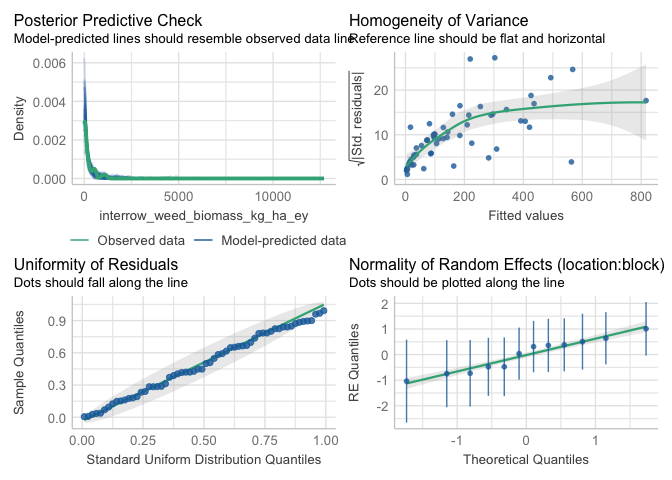
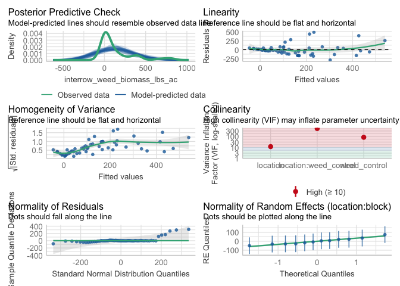
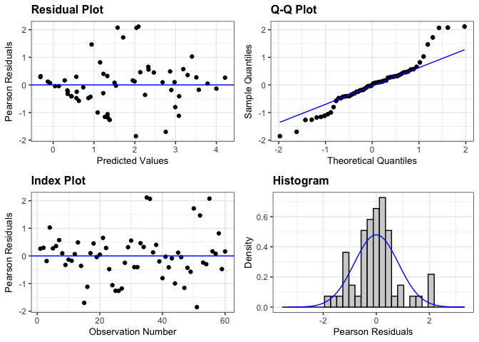
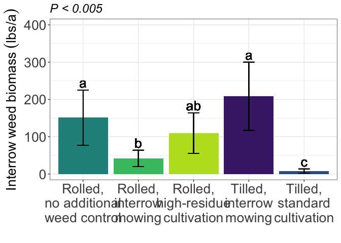
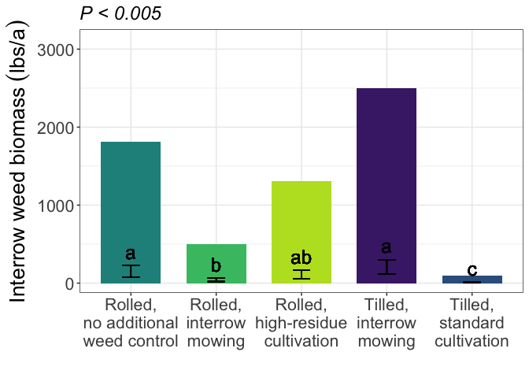

interrow weed biomass
================

# Load libraries

``` r
#Set work directory
setwd("/Users/ey239/Github/Mowtivation/rmarkdowns")

#Load packages 
library(tidyverse) ##install.packages("tidyverse")
library(knitr)
library(patchwork) ##install.packages("patchwork")
library(skimr)     ##install.packages("skimr")
library(readxl)
library(janitor) ##install.packages("janitor")

library(kableExtra) ##install.packages("kableExtra")
library(webshot) ##install.packages("webshot")
webshot::install_phantomjs()
library(viridis) ##install.packages("viridis")
library(lme4) ##install.packages("lme4")
library(lmerTest) ##install.packages("lmerTest")
library(emmeans) ##install.packages("emmeans")
library(rstatix) ##install.packages("rstatix")
#library(Matrix) ##install.packages("Matrix")
library(multcomp) ##install.packages("multcomp")
library(multcompView) ##install.packages("multcompView")
library(ggResidpanel) ##install.packages("ggResidpanel")
#library(car)
#library(TMB)  ##install.packages("TMB")
library(glmmTMB)  ##install.packages("glmmTMB")
library(DHARMa)  ##install.packages("DHARMa")
library(performance) ##install.packages("performance")

#Load Functions
MeanPlusSe<-function(x) mean(x)+plotrix::std.error(x)

find_logw0=function(x){c=trunc(log(min(x[x>0],na.rm=T)))
d=exp(c)
return(d)}
```

<br>

# Load and Clean Data

## Load data

``` r
combined_raw <- read_excel("~/Github/Mowtivation/raw-data/All Treatments/combined_raw.xlsx")
kable(head(combined_raw))
```

| id | location | year | treatment | block | plot | bean_emergence | bean_biomass | intrarow_weed_biomass | interrow_weed_biomass | weed_biomass | bean_population | bean_yield | seed_weight |
|:---|:---|---:|:---|---:|---:|---:|---:|---:|---:|---:|:---|:---|:---|
| CU_B1_P101 | field x | 2023 | TIM | 1 | 101 | 46.5 | 223.740 | 19.000 | 44.490 | 63.490 | 34.5 | 417.21 | 17.119999999999997 |
| CU_B1_P102 | field x | 2023 | TIC | 1 | 102 | 42.5 | 267.460 | 30.975 | 0.720 | 31.695 | 39.5 | 565.54 | 17.475000000000001 |
| CU_B1_P103 | field x | 2023 | RIM | 1 | 103 | 36.5 | 217.890 | 0.950 | 6.890 | 3.920 | 37.5 | 449.93 | 16.752499999999998 |
| CU_B1_P104 | field x | 2023 | RNO | 1 | 104 | 41.0 | 207.675 | 0.660 | 45.735 | 46.395 | 35 | 412.59 | 16.145 |
| CU_B1_P105 | field x | 2023 | RIC | 1 | 105 | 41.0 | 230.285 | 0.495 | 22.025 | 22.520 | 39 | 473.79 | 17.047499999999999 |
| CU_B1_P201 | field x | 2023 | RIC | 2 | 201 | 36.5 | 208.105 | 6.395 | 19.460 | 25.855 | 33.5 | 484.04 | 17.149999999999999 |

## Clean data

``` r
#Standardaze column names, convert to factors, check for outliers of variable**
clean_combined <- clean_names(combined_raw) |>  
  rename ('weed_control'= treatment) |> 
  mutate(across(c(weed_control, block, plot, location, year), as.factor)) #|> 
  #mutate(is_outlier = totwbm < (quantile(totwbm, 0.25) - 1.5 * IQR(totwbm)) |
                       #wbm > (quantile(totwbm, 0.75) + 1.5 * IQR(totwbm)))

#select and convert data for wbm analysis
interrow_weed_biomass_clean <-clean_combined |>              
  mutate(log_interrow_weed_biomass_grams_meter=  (log((interrow_weed_biomass*2)+1)))|>
  mutate(interrow_weed_biomass_grams_meter = (interrow_weed_biomass /0.4026))|> # 
 
  mutate(interrow_weed_biomass_kg_ha = (interrow_weed_biomass_grams_meter *(10000))/(1000)) |>
  mutate(interrow_weed_biomass_lbs_ac = ((interrow_weed_biomass_grams_meter *(10000))/(1000))* 0.892179)
kable(head(interrow_weed_biomass_clean)) 
```

| id | location | year | weed_control | block | plot | bean_emergence | bean_biomass | intrarow_weed_biomass | interrow_weed_biomass | weed_biomass | bean_population | bean_yield | seed_weight | log_interrow_weed_biomass_grams_meter | interrow_weed_biomass_grams_meter | interrow_weed_biomass_kg_ha | interrow_weed_biomass_lbs_ac |
|:---|:---|:---|:---|:---|:---|---:|---:|---:|---:|---:|:---|:---|:---|---:|---:|---:|---:|
| CU_B1_P101 | field x | 2023 | TIM | 1 | 101 | 46.5 | 223.740 | 19.000 | 44.490 | 63.490 | 34.5 | 417.21 | 17.119999999999997 | 4.499587 | 110.506706 | 1105.06706 | 985.91763 |
| CU_B1_P102 | field x | 2023 | TIC | 1 | 102 | 42.5 | 267.460 | 30.975 | 0.720 | 31.695 | 39.5 | 565.54 | 17.475000000000001 | 0.891998 | 1.788376 | 17.88376 | 15.95551 |
| CU_B1_P103 | field x | 2023 | RIM | 1 | 103 | 36.5 | 217.890 | 0.950 | 6.890 | 3.920 | 37.5 | 449.93 | 16.752499999999998 | 2.693275 | 17.113761 | 171.13761 | 152.68538 |
| CU_B1_P104 | field x | 2023 | RNO | 1 | 104 | 41.0 | 207.675 | 0.660 | 45.735 | 46.395 | 35 | 412.59 | 16.145 | 4.526884 | 113.599106 | 1135.99106 | 1013.50737 |
| CU_B1_P105 | field x | 2023 | RIC | 1 | 105 | 41.0 | 230.285 | 0.495 | 22.025 | 22.520 | 39 | 473.79 | 17.047499999999999 | 3.807773 | 54.706905 | 547.06905 | 488.08352 |
| CU_B1_P201 | field x | 2023 | RIC | 2 | 201 | 36.5 | 208.105 | 6.395 | 19.460 | 25.855 | 33.5 | 484.04 | 17.149999999999999 | 3.686878 | 48.335817 | 483.35817 | 431.24201 |

``` r
# Model testing
```

Block is random Tyler is under the impression that block should always
be random and that post-hoc comparisons should use TUKEY rather the
Fischer. Fisher is bogus apparently.

## Lmer (no transformation)

``` r
random <- lmer(interrow_weed_biomass_lbs_ac  ~ location+weed_control + location:weed_control +(1|location:block) , data = interrow_weed_biomass_clean)

resid_panel(random)
```

<!-- -->

``` r
### Two checks specifically for a generalize linear approach
simulateResiduals(random,plot = TRUE) # Residuals and normality look good
```

<!-- -->

    ## Object of Class DHARMa with simulated residuals based on 250 simulations with refit = FALSE . See ?DHARMa::simulateResiduals for help. 
    ##  
    ## Scaled residual values: 0.968 0.54 0.556 1 0.8 0.7 0.588 0.556 0.508 0.4 0.1 0.464 0.52 0.38 0.024 0.124 0.148 0.592 0.516 0.36 ...

``` r
check_model(random) #Perfect, preditions match real data
```

<!-- -->

\###Joint test (anova)

``` r
random |> 
  joint_tests() |> 
  kable()  
```

|     | model term            | df1 | df2 | F.ratio |   p.value |
|:----|:----------------------|----:|----:|--------:|----------:|
| 1   | location              |   2 |   9 |   3.924 | 0.0595212 |
| 3   | weed_control          |   4 |  36 |   4.136 | 0.0073744 |
| 2   | location:weed_control |   8 |  36 |   1.079 | 0.3996164 |

### Means comparison

#### Weed-control (Significant)

``` r
means_weed_control <- emmeans(random, ~  weed_control)
pairwise_comparisons_weed_control<- pairs(means_weed_control) 
kable(pairwise_comparisons_weed_control)
```

| contrast  |   estimate |       SE |  df |    t.ratio |   p.value |
|:----------|-----------:|---------:|----:|-----------:|----------:|
| RIC - RIM |  122.18708 | 85.74339 |  36 |  1.4250321 | 0.6160311 |
| RIC - RNO |  -85.41000 | 85.74339 |  36 | -0.9961117 | 0.8553525 |
| RIC - TIC |  175.39982 | 85.74339 |  36 |  2.0456366 | 0.2657208 |
| RIC - TIM | -101.42091 | 85.74339 |  36 | -1.1828423 | 0.7609488 |
| RIM - RNO | -207.59708 | 85.74339 |  36 | -2.4211438 | 0.1328428 |
| RIM - TIC |   53.21274 | 85.74339 |  36 |  0.6206045 | 0.9708240 |
| RIM - TIM | -223.60799 | 85.74339 |  36 | -2.6078744 | 0.0901057 |
| RNO - TIC |  260.80982 | 85.74339 |  36 |  3.0417483 | 0.0333017 |
| RNO - TIM |  -16.01091 | 85.74339 |  36 | -0.1867306 | 0.9997144 |
| TIC - TIM | -276.82073 | 85.74339 |  36 | -3.2284789 | 0.0209644 |

br\>

#### Location (Not significant)

``` r
means_location <- emmeans(random, ~  location)
pairwise_comparisons_location<- pairs(means_location) 
kable(pairwise_comparisons_location)
```

| contrast | estimate | SE | df | t.ratio | p.value |
|:---|---:|---:|---:|---:|---:|
| field O2 east - field O2 west | -68.15995 | 85.3656 | 9 | -0.7984475 | 0.7132393 |
| field O2 east - field x | -232.59036 | 85.3656 | 9 | -2.7246379 | 0.0555373 |
| field O2 west - field x | -164.43041 | 85.3656 | 9 | -1.9261904 | 0.1868747 |
| \#### Location | weed-control (Not significant) |  |  |  |  |

``` r
means_weed_control_location <- emmeans(random, ~  weed_control|location)
pairwise_comparisons_weed_control_location<- pairs(means_weed_control_location) 
kable(pairwise_comparisons_weed_control_location)
```

| contrast  | location      |    estimate |       SE |  df |    t.ratio |   p.value |
|:----------|:--------------|------------:|---------:|----:|-----------:|----------:|
| RIC - RIM | field O2 east |  -24.791984 | 148.5119 |  36 | -0.1669360 | 0.9998169 |
| RIC - RNO | field O2 east | -136.314358 | 148.5119 |  36 | -0.9178682 | 0.8881417 |
| RIC - TIC | field O2 east |  -31.744819 | 148.5119 |  36 | -0.2137527 | 0.9995124 |
| RIC - TIM | field O2 east | -126.619169 | 148.5119 |  36 | -0.8525859 | 0.9120249 |
| RIM - RNO | field O2 east | -111.522375 | 148.5119 |  36 | -0.7509322 | 0.9427228 |
| RIM - TIC | field O2 east |   -6.952836 | 148.5119 |  36 | -0.0468167 | 0.9999989 |
| RIM - TIM | field O2 east | -101.827186 | 148.5119 |  36 | -0.6856500 | 0.9583198 |
| RNO - TIC | field O2 east |  104.569539 | 148.5119 |  36 |  0.7041155 | 0.9542260 |
| RNO - TIM | field O2 east |    9.695189 | 148.5119 |  36 |  0.0652822 | 0.9999957 |
| TIC - TIM | field O2 east |  -94.874350 | 148.5119 |  36 | -0.6388333 | 0.9676131 |
| RIC - RIM | field O2 west |  212.518545 | 148.5119 |  36 |  1.4309865 | 0.6123152 |
| RIC - RNO | field O2 west |   -6.869734 | 148.5119 |  36 | -0.0462571 | 0.9999989 |
| RIC - TIC | field O2 west |  237.227427 | 148.5119 |  36 |  1.5973630 | 0.5086720 |
| RIC - TIM | field O2 west |   75.927181 | 148.5119 |  36 |  0.5112531 | 0.9857045 |
| RIM - RNO | field O2 west | -219.388279 | 148.5119 |  36 | -1.4772436 | 0.5833904 |
| RIM - TIC | field O2 west |   24.708882 | 148.5119 |  36 |  0.1663764 | 0.9998194 |
| RIM - TIM | field O2 west | -136.591364 | 148.5119 |  36 | -0.9197334 | 0.8874121 |
| RNO - TIC | field O2 west |  244.097161 | 148.5119 |  36 |  1.6436201 | 0.4804384 |
| RNO - TIM | field O2 west |   82.796915 | 148.5119 |  36 |  0.5575103 | 0.9802812 |
| TIC - TIM | field O2 west | -161.300246 | 148.5119 |  36 | -1.0861098 | 0.8124370 |
| RIC - RIM | field x       |  178.834688 | 148.5119 |  36 |  1.2041774 | 0.7489590 |
| RIC - RNO | field x       | -113.045905 | 148.5119 |  36 | -0.7611908 | 0.9399829 |
| RIC - TIC | field x       |  320.716855 | 148.5119 |  36 |  2.1595362 | 0.2181999 |
| RIC - TIM | field x       | -253.570745 | 148.5119 |  36 | -1.7074101 | 0.4423395 |
| RIM - RNO | field x       | -291.880592 | 148.5119 |  36 | -1.9653682 | 0.3030440 |
| RIM - TIC | field x       |  141.882167 | 148.5119 |  36 |  0.9553588 | 0.8729828 |
| RIM - TIM | field x       | -432.405433 | 148.5119 |  36 | -2.9115875 | 0.0454539 |
| RNO - TIC | field x       |  433.762760 | 148.5119 |  36 |  2.9207271 | 0.0444864 |
| RNO - TIM | field x       | -140.524841 | 148.5119 |  36 | -0.9462193 | 0.8767734 |
| TIC - TIM | field x       | -574.287600 | 148.5119 |  36 | -3.8669464 | 0.0038207 |

### Tukey compact letter display

#### Weed-control (Significant)

``` r
#weed control
cld_weed_control_tukey <-cld(emmeans(random, ~  weed_control , type = "response"), Letters = letters, sort = TRUE, reversed=TRUE)
```

    ## NOTE: Results may be misleading due to involvement in interactions

``` r
cld_weed_control_tukey
```

    ##  weed_control emmean   SE   df lower.CL upper.CL .group
    ##  TIM           289.6 64.5 42.7    159.6      420  a    
    ##  RNO           273.6 64.5 42.7    143.6      404  a    
    ##  RIC           188.2 64.5 42.7     58.2      318  ab   
    ##  RIM            66.0 64.5 42.7    -64.0      196  ab   
    ##  TIC            12.8 64.5 42.7   -117.2      143   b   
    ## 
    ## Results are averaged over the levels of: location 
    ## Degrees-of-freedom method: kenward-roger 
    ## Confidence level used: 0.95 
    ## P value adjustment: tukey method for comparing a family of 5 estimates 
    ## significance level used: alpha = 0.05 
    ## NOTE: If two or more means share the same grouping symbol,
    ##       then we cannot show them to be different.
    ##       But we also did not show them to be the same.

### Fisher compact letter display

#### Weed-control (Significant)

``` r
 cld_weed_control_fisher <-cld(emmeans(random,~  weed_control,type = "response"), Letters = letters, sort = TRUE, adjust="none", reversed=TRUE)
```

    ## NOTE: Results may be misleading due to involvement in interactions

``` r
 cld_weed_control_fisher
```

    ##  weed_control emmean   SE   df lower.CL upper.CL .group
    ##  TIM           289.6 64.5 42.7    159.6      420  a    
    ##  RNO           273.6 64.5 42.7    143.6      404  a    
    ##  RIC           188.2 64.5 42.7     58.2      318  ab   
    ##  RIM            66.0 64.5 42.7    -64.0      196   bc  
    ##  TIC            12.8 64.5 42.7   -117.2      143    c  
    ## 
    ## Results are averaged over the levels of: location 
    ## Degrees-of-freedom method: kenward-roger 
    ## Confidence level used: 0.95 
    ## significance level used: alpha = 0.05 
    ## NOTE: If two or more means share the same grouping symbol,
    ##       then we cannot show them to be different.
    ##       But we also did not show them to be the same.

## Lmer (log transformation)

``` r
random_log <- lmer(log_interrow_weed_biomass_grams_meter  ~ location+weed_control + location:weed_control +(1|location:block) , data = interrow_weed_biomass_clean)

resid_panel(random_log)
```

<!-- -->
\###Joint test (anova)

``` r
random_log |> 
  joint_tests() |> 
  kable()  
```

|     | model term            | df1 | df2 | F.ratio |   p.value |
|:----|:----------------------|----:|----:|--------:|----------:|
| 1   | location              |   2 |   9 |   6.059 | 0.0215374 |
| 3   | weed_control          |   4 |  36 |   8.044 | 0.0000968 |
| 2   | location:weed_control |   8 |  36 |   1.531 | 0.1810875 |

### Means comparison

#### Weed-control (Significant)

``` r
means_weed_control_log <- emmeans(random_log, ~  weed_control)
pairwise_comparisons_weed_control_log<- pairs(means_weed_control) 
kable(pairwise_comparisons_weed_control_log)
```

| contrast  |   estimate |       SE |  df |    t.ratio |   p.value |
|:----------|-----------:|---------:|----:|-----------:|----------:|
| RIC - RIM |  122.18708 | 85.74339 |  36 |  1.4250321 | 0.6160311 |
| RIC - RNO |  -85.41000 | 85.74339 |  36 | -0.9961117 | 0.8553525 |
| RIC - TIC |  175.39982 | 85.74339 |  36 |  2.0456366 | 0.2657208 |
| RIC - TIM | -101.42091 | 85.74339 |  36 | -1.1828423 | 0.7609488 |
| RIM - RNO | -207.59708 | 85.74339 |  36 | -2.4211438 | 0.1328428 |
| RIM - TIC |   53.21274 | 85.74339 |  36 |  0.6206045 | 0.9708240 |
| RIM - TIM | -223.60799 | 85.74339 |  36 | -2.6078744 | 0.0901057 |
| RNO - TIC |  260.80982 | 85.74339 |  36 |  3.0417483 | 0.0333017 |
| RNO - TIM |  -16.01091 | 85.74339 |  36 | -0.1867306 | 0.9997144 |
| TIC - TIM | -276.82073 | 85.74339 |  36 | -3.2284789 | 0.0209644 |

#### Location (Significant)

``` r
means_location_log <- emmeans(random_log, ~  location)
pairwise_comparisons_location_log<- pairs(means_location_log) 
kable(pairwise_comparisons_location_log)
```

| contrast                      |   estimate |        SE |  df |    t.ratio |   p.value |
|:------------------------------|-----------:|----------:|----:|-----------:|----------:|
| field O2 east - field O2 west | -0.4087562 | 0.4740756 |   9 | -0.8622174 | 0.6759673 |
| field O2 east - field x       | -1.5890210 | 0.4740756 |   9 | -3.3518307 | 0.0209452 |
| field O2 west - field x       | -1.1802648 | 0.4740756 |   9 | -2.4896133 | 0.0800027 |

#### Location\|weed-control (Not significant)

``` r
means_weed_control_location_log <- emmeans(random_log, ~  weed_control|location)
pairwise_comparisons_weed_control_location_log<- pairs(means_weed_control_location_log) 
kable(pairwise_comparisons_weed_control_location_log)
```

| contrast  | location      |   estimate |        SE |  df |    t.ratio |   p.value |
|:----------|:--------------|-----------:|----------:|----:|-----------:|----------:|
| RIC - RIM | field O2 east | -0.8678678 | 0.7738918 |  36 | -1.1214331 | 0.7942229 |
| RIC - RNO | field O2 east | -1.2200847 | 0.7738918 |  36 | -1.5765572 | 0.5215001 |
| RIC - TIC | field O2 east | -0.5823230 | 0.7738918 |  36 | -0.7524606 | 0.9423196 |
| RIC - TIM | field O2 east | -1.6686159 | 0.7738918 |  36 | -2.1561361 | 0.2195253 |
| RIM - RNO | field O2 east | -0.3522168 | 0.7738918 |  36 | -0.4551242 | 0.9907727 |
| RIM - TIC | field O2 east |  0.2855448 | 0.7738918 |  36 |  0.3689725 | 0.9958675 |
| RIM - TIM | field O2 east | -0.8007481 | 0.7738918 |  36 | -1.0347030 | 0.8375964 |
| RNO - TIC | field O2 east |  0.6377616 | 0.7738918 |  36 |  0.8240967 | 0.9214276 |
| RNO - TIM | field O2 east | -0.4485313 | 0.7738918 |  36 | -0.5795788 | 0.9772559 |
| TIC - TIM | field O2 east | -1.0862929 | 0.7738918 |  36 | -1.4036755 | 0.6293332 |
| RIC - RIM | field O2 west |  0.8080277 | 0.7738918 |  36 |  1.0441095 | 0.8331181 |
| RIC - RNO | field O2 west |  0.0457217 | 0.7738918 |  36 |  0.0590803 | 0.9999971 |
| RIC - TIC | field O2 west |  1.6926095 | 0.7738918 |  36 |  2.1871399 | 0.2076511 |
| RIC - TIM | field O2 west | -0.9519778 | 0.7738918 |  36 | -1.2301175 | 0.7341158 |
| RIM - RNO | field O2 west | -0.7623060 | 0.7738918 |  36 | -0.9850292 | 0.8602632 |
| RIM - TIC | field O2 west |  0.8845818 | 0.7738918 |  36 |  1.1430304 | 0.7827423 |
| RIM - TIM | field O2 west | -1.7600055 | 0.7738918 |  36 | -2.2742270 | 0.1768107 |
| RNO - TIC | field O2 west |  1.6468878 | 0.7738918 |  36 |  2.1280596 | 0.2306888 |
| RNO - TIM | field O2 west | -0.9976995 | 0.7738918 |  36 | -1.2891978 | 0.6993611 |
| TIC - TIM | field O2 west | -2.6445873 | 0.7738918 |  36 | -3.4172574 | 0.0128997 |
| RIC - RIM | field x       |  0.6130952 | 0.7738918 |  36 |  0.7922235 | 0.9312079 |
| RIC - RNO | field x       |  0.1066903 | 0.7738918 |  36 |  0.1378620 | 0.9999145 |
| RIC - TIC | field x       |  2.9410992 | 0.7738918 |  36 |  3.8004013 | 0.0045958 |
| RIC - TIM | field x       | -0.7040552 | 0.7738918 |  36 | -0.9097592 | 0.8912835 |
| RIM - RNO | field x       | -0.5064050 | 0.7738918 |  36 | -0.6543615 | 0.9647001 |
| RIM - TIC | field x       |  2.3280040 | 0.7738918 |  36 |  3.0081778 | 0.0361179 |
| RIM - TIM | field x       | -1.3171504 | 0.7738918 |  36 | -1.7019828 | 0.4455371 |
| RNO - TIC | field x       |  2.8344090 | 0.7738918 |  36 |  3.6625393 | 0.0067057 |
| RNO - TIM | field x       | -0.8107454 | 0.7738918 |  36 | -1.0476212 | 0.8314315 |
| TIC - TIM | field x       | -3.6451544 | 0.7738918 |  36 | -4.7101605 | 0.0003328 |

### Tukey compact letter display

#### Weed-control (Significant)

``` r
#weed control
cld_weed_control_tukey_log <-cld(emmeans(random_log, ~  weed_control , type = "response"), Letters = letters, sort = TRUE, reversed=TRUE)
```

    ## NOTE: Results may be misleading due to involvement in interactions

``` r
cld_weed_control_tukey_log
```

    ##  weed_control emmean    SE   df lower.CL upper.CL .group
    ##  TIM           2.796 0.343 41.3    2.104     3.49  a    
    ##  RNO           2.044 0.343 41.3    1.352     2.74  ab   
    ##  RIC           1.688 0.343 41.3    0.996     2.38  ab   
    ##  RIM           1.503 0.343 41.3    0.812     2.19   bc  
    ##  TIC           0.337 0.343 41.3   -0.354     1.03    c  
    ## 
    ## Results are averaged over the levels of: location 
    ## Degrees-of-freedom method: kenward-roger 
    ## Confidence level used: 0.95 
    ## P value adjustment: tukey method for comparing a family of 5 estimates 
    ## significance level used: alpha = 0.05 
    ## NOTE: If two or more means share the same grouping symbol,
    ##       then we cannot show them to be different.
    ##       But we also did not show them to be the same.

#### Location (Significant)

``` r
#location
cld_location_tukey_log <-cld(emmeans(random_log, ~  location , type = "response"), Letters = letters, sort = TRUE, reversed=TRUE)
```

    ## NOTE: Results may be misleading due to involvement in interactions

``` r
cld_location_tukey_log
```

    ##  location      emmean    SE df lower.CL upper.CL .group
    ##  field x         2.60 0.335  9    1.838     3.35  a    
    ##  field O2 west   1.42 0.335  9    0.658     2.17  ab   
    ##  field O2 east   1.01 0.335  9    0.249     1.77   b   
    ## 
    ## Results are averaged over the levels of: weed_control 
    ## Degrees-of-freedom method: kenward-roger 
    ## Confidence level used: 0.95 
    ## P value adjustment: tukey method for comparing a family of 3 estimates 
    ## significance level used: alpha = 0.05 
    ## NOTE: If two or more means share the same grouping symbol,
    ##       then we cannot show them to be different.
    ##       But we also did not show them to be the same.

for weed seed look into quasi or negative binomial, hurdle model, or 0
inflated

### Fisher compact letter display

#### Weed-control (Significant)

``` r
 cld_weed_control_fisher_log <-cld(emmeans(random_log,~  weed_control,type = "response"), Letters = letters, sort = TRUE, adjust="none", reversed=TRUE)
```

    ## NOTE: Results may be misleading due to involvement in interactions

``` r
 cld_weed_control_fisher_log
```

    ##  weed_control emmean    SE   df lower.CL upper.CL .group
    ##  TIM           2.796 0.343 41.3    2.104     3.49  a    
    ##  RNO           2.044 0.343 41.3    1.352     2.74  ab   
    ##  RIC           1.688 0.343 41.3    0.996     2.38   b   
    ##  RIM           1.503 0.343 41.3    0.812     2.19   b   
    ##  TIC           0.337 0.343 41.3   -0.354     1.03    c  
    ## 
    ## Results are averaged over the levels of: location 
    ## Degrees-of-freedom method: kenward-roger 
    ## Confidence level used: 0.95 
    ## significance level used: alpha = 0.05 
    ## NOTE: If two or more means share the same grouping symbol,
    ##       then we cannot show them to be different.
    ##       But we also did not show them to be the same.

#### Location (Significant)

``` r
 cld_weed_control_fisher_log <-cld(emmeans(random_log,~  location,type = "response"), Letters = letters, sort = TRUE, adjust="none", reversed=TRUE)
```

    ## NOTE: Results may be misleading due to involvement in interactions

``` r
cld_weed_control_fisher_log
```

    ##  location      emmean    SE df lower.CL upper.CL .group
    ##  field x         2.60 0.335  9    1.838     3.35  a    
    ##  field O2 west   1.42 0.335  9    0.658     2.17   b   
    ##  field O2 east   1.01 0.335  9    0.249     1.77   b   
    ## 
    ## Results are averaged over the levels of: weed_control 
    ## Degrees-of-freedom method: kenward-roger 
    ## Confidence level used: 0.95 
    ## significance level used: alpha = 0.05 
    ## NOTE: If two or more means share the same grouping symbol,
    ##       then we cannot show them to be different.
    ##       But we also did not show them to be the same.

\#GLMM Redo this after changing block to 12 blocks (note that )

``` r
model_tweedie_log <- glmmTMB(
interrow_weed_biomass_lbs_ac ~  weed_control + (1|location) + (1|block)+
  (1|location:block), 
  data = interrow_weed_biomass_clean, 
  family = tweedie(link = "log")

)
### Two checks specifically for a generalize linear approach
simulateResiduals(model_tweedie_log,plot = TRUE) # Residuals and normality look good
```

<!-- -->

    ## Object of Class DHARMa with simulated residuals based on 250 simulations with refit = FALSE . See ?DHARMa::simulateResiduals for help. 
    ##  
    ## Scaled residual values: 0.876 0.744 0.852 0.948 0.884 0.904 0.836 0.868 0.3389136 0.804 0.62 0.2663145 0.82 0.668 0.22 0.448 0.648 0.888 0.496 0.8 ...

``` r
check_model(model_tweedie_log) #Perfect, preditions match real data
```

    ## `check_outliers()` does not yet support models of class `glmmTMB`.

<!-- -->

``` r
summary(model_tweedie_log )
```

    ##  Family: tweedie  ( log )
    ## Formula:          
    ## interrow_weed_biomass_lbs_ac ~ weed_control + (1 | location) +  
    ##     (1 | block) + (1 | location:block)
    ## Data: interrow_weed_biomass_clean
    ## 
    ##      AIC      BIC   logLik deviance df.resid 
    ##    630.2    651.1   -305.1    610.2       50 
    ## 
    ## Random effects:
    ## 
    ## Conditional model:
    ##  Groups         Name        Variance  Std.Dev. 
    ##  location       (Intercept) 1.323e-01 3.637e-01
    ##  block          (Intercept) 8.746e-09 9.352e-05
    ##  location:block (Intercept) 4.878e-01 6.985e-01
    ## Number of obs: 60, groups:  location, 3; block, 4; location:block, 12
    ## 
    ## Dispersion parameter for tweedie family (): 8.01 
    ## 
    ## Conditional model:
    ##                 Estimate Std. Error z value Pr(>|z|)    
    ## (Intercept)       4.9116     0.4984   9.854  < 2e-16 ***
    ## weed_controlRIM  -0.9577     0.5701  -1.680 0.092998 .  
    ## weed_controlRNO   0.3239     0.5169   0.627 0.530871    
    ## weed_controlTIC  -2.6187     0.7413  -3.533 0.000412 ***
    ## weed_controlTIM   0.6454     0.5209   1.239 0.215328    
    ## ---
    ## Signif. codes:  0 '***' 0.001 '**' 0.01 '*' 0.05 '.' 0.1 ' ' 1

``` r
VarCorr(model_tweedie_log )
```

    ## 
    ## Conditional model:
    ##  Groups         Name        Std.Dev.  
    ##  location       (Intercept) 3.6374e-01
    ##  block          (Intercept) 9.3518e-05
    ##  location:block (Intercept) 6.9846e-01

### Joint test (anova)

``` r
model_tweedie_log |> 
  joint_tests() |> 
  kable()  
```

| model term   | df1 | df2 | F.ratio |  Chisq |  p.value |
|:-------------|----:|----:|--------:|-------:|---------:|
| weed_control |   4 | Inf |   6.726 | 26.904 | 2.08e-05 |

## Fisher compact letter display

### Weed-control (S)

``` r
cld_weed_control_fisher <-cld(emmeans(model_tweedie_log, ~  weed_control, type = "response"), Letters = letters,adjust = "none", sort = TRUE, reversed=TRUE)
cld_weed_control_fisher
```

    ##  weed_control response     SE  df asymp.LCL asymp.UCL .group
    ##  TIM             259.1 114.00 Inf    109.52       613  a    
    ##  RNO             187.8  92.00 Inf     71.92       491  a    
    ##  RIC             135.9  67.70 Inf     51.15       361  ab   
    ##  RIM              52.1  27.20 Inf     18.74       145   b   
    ##  TIC               9.9   7.05 Inf      2.45        40    c  
    ## 
    ## Confidence level used: 0.95 
    ## Intervals are back-transformed from the log scale 
    ## Tests are performed on the log scale 
    ## significance level used: alpha = 0.05 
    ## NOTE: If two or more means share the same grouping symbol,
    ##       then we cannot show them to be different.
    ##       But we also did not show them to be the same.

# Figures

## Weed-control

``` r
interrow_weed_biomass_clean |> 
  left_join(cld_weed_control_fisher) |> 
  ggplot(aes(x = factor(weed_control, levels = c("RNO", "RIM", "RIC", "TIM", "TIC")), y = response, fill = weed_control)) +
  #stat_summary(geom = "bar", fun = mean, width = 0.7) +  # Ensuring mean calculation
  #stat_summary(geom = "errorbar", fun.data = mean_se, width = 0.2) +  # Explicit mean_se
  #stat_summary(geom = "text", fun = mean, aes(label = trimws(.group)), 
               #size = 6.5, vjust = -0.5) +  # Adjusting labels) 
  geom_bar(stat="identity", position=position_dodge()) + 
  geom_errorbar(aes(ymin=response-SE, ymax=response+SE), width=.2,
                 position=position_dodge(.9))+
geom_text(aes(label = trimws(.group), y = response + (SE + 20)), size = 6.5) +
  labs(
    x = "",
    y = expression("Interrow weed biomass" ~ (lbs * "/" * a)),
    #title = str_c("Influence of interrow weed control on interrow weed biomass"),
    subtitle = expression(italic("P < 0.005"))) +
  
 scale_x_discrete(labels = c("Rolled,\nno additional\nweed control",
                              "Rolled,\ninterrow\nmowing",
                              "Rolled,\nhigh-residue\ncultivation",
                              "Tilled,\ninterrow\nmowing",
                          "Tilled,\nstandard\ncultivation")) +
  scale_y_continuous(expand = expansion(mult = c(0.05, 0.3))) +
  scale_fill_viridis(discrete = TRUE, option = "D", direction = -1, end = 0.9, begin = 0.1) +
   theme_bw() +
  theme(
    legend.position = "none",
    strip.background = element_blank(),
    strip.text = element_text(face = "bold", size = 12),
    axis.title = element_text(size = 20),  # Increase font size of axis titles
    axis.text = element_text(size = 20),   # Increase font size of axis labels
    plot.title = element_text(size = 22, face = "bold"),  # Increase font size of title
    plot.subtitle = element_text(size = 18, face = "italic")  # Increase font size of subtitle
  )
```

<!-- -->

``` r
ggsave("interrow_weed_biomass_weed_control_lbac.png", width = 10, height = 6, dpi = 300)
```

``` r
interrow_weed_biomass_clean |> 
  left_join(cld_weed_control_fisher) |> 
  ggplot(aes(x = factor(weed_control, levels = c("RNO", "RIM", "RIC", "TIM", "TIC")), 
             y = response, 
             fill = weed_control)) +
  geom_bar(stat = "identity", width = 0.7) +
  geom_errorbar(aes(ymin = response - SE, ymax = response + SE), width = 0.2) +
  geom_text(aes(y = response + SE, label = trimws(.group)), size = 6.5, vjust = -0.5) +
  labs(
    x = "",
    y = expression("Interrow weed biomass" ~ (lbs * "/" * a)),
    subtitle = expression(italic("P < 0.005"))
  ) +
  scale_x_discrete(labels = c("Rolled,\nno additional\nweed control",
                               "Rolled,\ninterrow\nmowing",
                               "Rolled,\nhigh-residue\ncultivation",
                               "Tilled,\ninterrow\nmowing",
                               "Tilled,\nstandard\ncultivation")) +
  scale_y_continuous(expand = expansion(mult = c(0.05, 0.3))) +
  scale_fill_viridis(discrete = TRUE, option = "D", direction = -1, end = 0.9, begin = 0.1) +
  theme_bw() +
  theme(
    legend.position = "none",
    strip.background = element_blank(),
    strip.text = element_text(face = "bold", size = 12),
    axis.title = element_text(size = 20),
    axis.text = element_text(size = 16),
    plot.title = element_text(size = 22, face = "bold"),
    plot.subtitle = element_text(size = 18, face = "italic")
  )
```

    ## Joining with `by = join_by(weed_control)`

<!-- -->

``` r
ggsave("interrow_weed_biomass_weed_control_lbac.png", width = 10, height = 6, dpi = 300)
```
