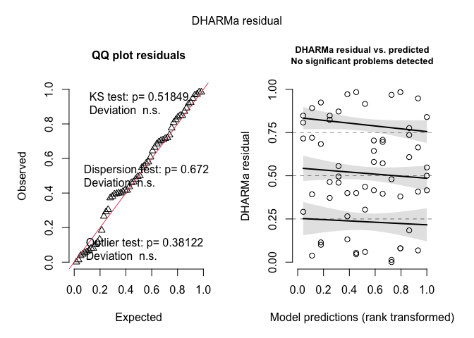
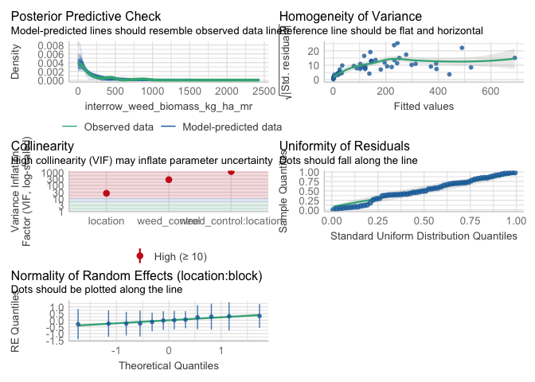
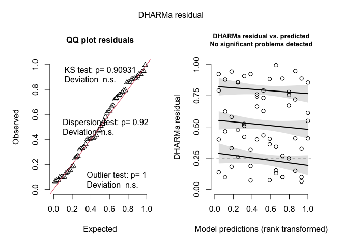
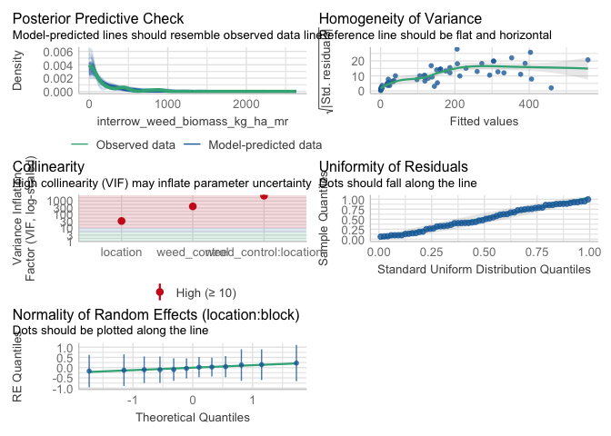
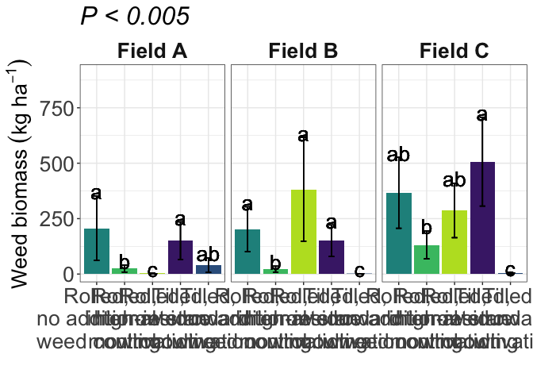

interrow weed biomass
================

# Load libraries

``` r
#Set work directory
setwd("/Users/ey239/Github/Mowtivation/rmarkdowns")

#Load packages 
library(tidyverse) ##install.packages("tidyverse")
library(knitr)
library(patchwork) ##install.packages("patchwork")
library(skimr)     ##install.packages("skimr")
library(readxl)
library(janitor) ##install.packages("janitor")

library(kableExtra) ##install.packages("kableExtra")
library(webshot) ##install.packages("webshot")
webshot::install_phantomjs()
library(viridis) ##install.packages("viridis")
library(lme4) ##install.packages("lme4")
library(lmerTest) ##install.packages("lmerTest")
library(emmeans) ##install.packages("emmeans")
library(rstatix) ##install.packages("rstatix")
#library(Matrix) ##install.packages("Matrix")
library(multcomp) ##install.packages("multcomp")
library(multcompView) ##install.packages("multcompView")
library(ggResidpanel) ##install.packages("ggResidpanel")
#library(car)
#library(TMB)  ##install.packages("TMB")
library(glmmTMB)  ##install.packages("glmmTMB")
library(DHARMa)  ##install.packages("DHARMa")
library(performance) ##install.packages("performance")

#Load Functions
MeanPlusSe<-function(x) mean(x)+plotrix::std.error(x)

find_logw0=function(x){c=trunc(log(min(x[x>0],na.rm=T)))
d=exp(c)
return(d)}
```

<br>

# Load and Clean Data

## Load data

``` r
combined_raw <- read_excel("~/Github/Mowtivation/raw-data/All Treatments/combined_raw.xlsx")
kable(head(combined_raw))
```

| id | location | year | treatment | block | plot | bean_emergence | bean_biomass | intrarow_weed_biomass | interrow_weed_biomass | weed_biomass | bean_population | bean_yield | seed_weight |
|:---|:---|---:|:---|---:|---:|---:|---:|---:|---:|---:|---:|---:|---:|
| CU_B1_P101 | field x | 2023 | TIM | 1 | 101 | 46.5 | 223.740 | 19.000 | 44.490 | 63.490 | 34.5 | 417.21 | 17.1200 |
| CU_B1_P102 | field x | 2023 | TIC | 1 | 102 | 42.5 | 267.460 | 30.975 | 0.720 | 31.695 | 39.5 | 565.54 | 17.4750 |
| CU_B1_P103 | field x | 2023 | RIM | 1 | 103 | 36.5 | 217.890 | 0.950 | 6.890 | 7.840 | 37.5 | 449.93 | 16.7525 |
| CU_B1_P104 | field x | 2023 | RNO | 1 | 104 | 41.0 | 207.675 | 0.660 | 45.735 | 46.395 | 35.0 | 412.59 | 16.1450 |
| CU_B1_P105 | field x | 2023 | RIC | 1 | 105 | 41.0 | 230.285 | 0.495 | 22.025 | 22.520 | 39.0 | 473.79 | 17.0475 |
| CU_B1_P201 | field x | 2023 | RIC | 2 | 201 | 36.5 | 208.105 | 6.395 | 19.460 | 25.855 | 33.5 | 484.04 | 17.1500 |

## Clean data

``` r
#Standardaze column names, convert to factors, check for outliers of variable**
clean_combined <- clean_names(combined_raw) |>  
  rename ('weed_control'= treatment) |> 
  mutate(across(c(weed_control, block, plot, location, year), as.factor)) #|> 
  #mutate(is_outlier = totwbm < (quantile(totwbm, 0.25) - 1.5 * IQR(totwbm)) |
                       #wbm > (quantile(totwbm, 0.75) + 1.5 * IQR(totwbm)))

#select and convert data for wbm analysis
interrow_weed_biomass_clean <- clean_combined |>
  mutate(
    interrow_weed_biomass_grams_meter_mr = interrow_weed_biomass / 0.5,
    interrow_weed_biomass_grams_meter_ey = interrow_weed_biomass / 0.4,
    interrow_weed_biomass_kg_ha_mr = interrow_weed_biomass_grams_meter_mr * 10,
    interrow_weed_biomass_kg_ha_ey = interrow_weed_biomass_grams_meter_ey * 10,
    interrow_weed_biomass_lbs_ac_mr = interrow_weed_biomass_kg_ha_mr * 0.892179,
    interrow_weed_biomass_lbs_ac_ey = interrow_weed_biomass_kg_ha_ey * 0.892179
  )

kable(head(interrow_weed_biomass_clean))
```

| id | location | year | weed_control | block | plot | bean_emergence | bean_biomass | intrarow_weed_biomass | interrow_weed_biomass | weed_biomass | bean_population | bean_yield | seed_weight | interrow_weed_biomass_grams_meter_mr | interrow_weed_biomass_grams_meter_ey | interrow_weed_biomass_kg_ha_mr | interrow_weed_biomass_kg_ha_ey | interrow_weed_biomass_lbs_ac_mr | interrow_weed_biomass_lbs_ac_ey |
|:---|:---|:---|:---|:---|:---|---:|---:|---:|---:|---:|---:|---:|---:|---:|---:|---:|---:|---:|---:|
| CU_B1_P101 | field x | 2023 | TIM | 1 | 101 | 46.5 | 223.740 | 19.000 | 44.490 | 63.490 | 34.5 | 417.21 | 17.1200 | 88.98 | 111.2250 | 889.8 | 1112.250 | 793.86087 | 992.32609 |
| CU_B1_P102 | field x | 2023 | TIC | 1 | 102 | 42.5 | 267.460 | 30.975 | 0.720 | 31.695 | 39.5 | 565.54 | 17.4750 | 1.44 | 1.8000 | 14.4 | 18.000 | 12.84738 | 16.05922 |
| CU_B1_P103 | field x | 2023 | RIM | 1 | 103 | 36.5 | 217.890 | 0.950 | 6.890 | 7.840 | 37.5 | 449.93 | 16.7525 | 13.78 | 17.2250 | 137.8 | 172.250 | 122.94227 | 153.67783 |
| CU_B1_P104 | field x | 2023 | RNO | 1 | 104 | 41.0 | 207.675 | 0.660 | 45.735 | 46.395 | 35.0 | 412.59 | 16.1450 | 91.47 | 114.3375 | 914.7 | 1143.375 | 816.07613 | 1020.09516 |
| CU_B1_P105 | field x | 2023 | RIC | 1 | 105 | 41.0 | 230.285 | 0.495 | 22.025 | 22.520 | 39.0 | 473.79 | 17.0475 | 44.05 | 55.0625 | 440.5 | 550.625 | 393.00485 | 491.25606 |
| CU_B1_P201 | field x | 2023 | RIC | 2 | 201 | 36.5 | 208.105 | 6.395 | 19.460 | 25.855 | 33.5 | 484.04 | 17.1500 | 38.92 | 48.6500 | 389.2 | 486.500 | 347.23607 | 434.04508 |

Block is random Tyler is under the impression that block should always
be random and that post-hoc comparisons should use TUKEY rather the
Fischer. Fisher is bogus apparently.

\#Matt Ryan conversion \##Glmm with Tweedie regression \###Metric

``` r
model_tweedie_log_mr <- glmmTMB(
interrow_weed_biomass_kg_ha_mr ~  weed_control*location +
  (1|location:block), 
  data = interrow_weed_biomass_clean, 
  family = tweedie(link = "log")

)
### Two checks specifically for a generalize linear approach
simulateResiduals(model_tweedie_log_mr,plot = TRUE) # Residuals and normality look good
```

<!-- -->

    ## Object of Class DHARMa with simulated residuals based on 250 simulations with refit = FALSE . See ?DHARMa::simulateResiduals for help. 
    ##  
    ## Scaled residual values: 0.84 0.924 0.58 0.948 0.776 0.736 0.664 0.644 0.1003531 0.5 0.416 0.1144547 0.608 0.416 0.068 0.184 0.408 0.704 0.684 0.548 ...

``` r
check_model(model_tweedie_log_mr) 
```

    ## `check_outliers()` does not yet support models of class `glmmTMB`.

<!-- -->

``` r
summary(model_tweedie_log_mr )
```

    ##  Family: tweedie  ( log )
    ## Formula:          
    ## interrow_weed_biomass_kg_ha_mr ~ weed_control * location + (1 |  
    ##     location:block)
    ## Data: interrow_weed_biomass_clean
    ## 
    ##      AIC      BIC   logLik deviance df.resid 
    ##    611.4    649.1   -287.7    575.4       42 
    ## 
    ## Random effects:
    ## 
    ## Conditional model:
    ##  Groups         Name        Variance Std.Dev.
    ##  location:block (Intercept) 0.1515   0.3893  
    ## Number of obs: 60, groups:  location:block, 12
    ## 
    ## Dispersion parameter for tweedie family (): 6.61 
    ## 
    ## Conditional model:
    ##                                       Estimate Std. Error z value Pr(>|z|)    
    ## (Intercept)                             0.5242     1.1951   0.439 0.660941    
    ## weed_controlRIM                         2.6586     1.3782   1.929 0.053731 .  
    ## weed_controlRNO                         4.1337     1.3327   3.102 0.001923 ** 
    ## weed_controlTIC                         2.7119     1.4127   1.920 0.054906 .  
    ## weed_controlTIM                         4.2658     1.3140   3.246 0.001169 ** 
    ## locationfield O2 west                   4.7018     1.3319   3.530 0.000415 ***
    ## locationfield x                         5.1318     1.3002   3.947 7.92e-05 ***
    ## weed_controlRIM:locationfield O2 west  -4.8965     1.6551  -2.958 0.003093 ** 
    ## weed_controlRNO:locationfield O2 west  -4.1287     1.5275  -2.703 0.006873 ** 
    ## weed_controlTIC:locationfield O2 west  -8.7960     2.1322  -4.125 3.70e-05 ***
    ## weed_controlTIM:locationfield O2 west  -4.4359     1.5319  -2.896 0.003785 ** 
    ## weed_controlRIM:locationfield x        -3.4337     1.5562  -2.206 0.027356 *  
    ## weed_controlRNO:locationfield x        -3.9128     1.4778  -2.648 0.008106 ** 
    ## weed_controlTIC:locationfield x        -7.2007     1.8119  -3.974 7.07e-05 ***
    ## weed_controlTIM:locationfield x        -3.7009     1.4625  -2.531 0.011390 *  
    ## ---
    ## Signif. codes:  0 '***' 0.001 '**' 0.01 '*' 0.05 '.' 0.1 ' ' 1

``` r
VarCorr(model_tweedie_log_mr )
```

    ## 
    ## Conditional model:
    ##  Groups         Name        Std.Dev.
    ##  location:block (Intercept) 0.38929

### Joint test (anova)

``` r
model_tweedie_log_mr |> 
  joint_tests() |> 
  kable()  
```

|     | model term            | df1 | df2 | F.ratio |  Chisq |   p.value |
|:----|:----------------------|----:|----:|--------:|-------:|----------:|
| 1   | weed_control          |   4 | Inf |  11.490 | 45.960 | 0.0000000 |
| 3   | location              |   2 | Inf |   4.529 |  9.058 | 0.0107968 |
| 2   | weed_control:location |   8 | Inf |   2.950 | 23.600 | 0.0026695 |

## Fisher compact letter display

### Weed_control\|location (significant)

``` r
cld_weed_control_location_fisher_metric_mr<-cld(emmeans(model_tweedie_log_mr, ~  weed_control|location, type = "response"), Letters = letters,adjust = "none", sort = TRUE, reversed=TRUE)
cld_weed_control_location_fisher_metric_mr
```

    ## location = field O2 east:
    ##  weed_control response      SE  df asymp.LCL asymp.UCL .group
    ##  TIM           120.300  72.200 Inf    37.119    389.89  a    
    ##  RNO           105.412  70.300 Inf    28.518    389.63  a    
    ##  TIC            25.433  20.700 Inf     5.160    125.35  ab   
    ##  RIM            24.113  18.400 Inf     5.386    107.97  ab   
    ##  RIC             1.689   2.020 Inf     0.162     17.58   b   
    ## 
    ## location = field O2 west:
    ##  weed_control response      SE  df asymp.LCL asymp.UCL .group
    ##  RNO           186.964 115.000 Inf    55.885    625.49  a    
    ##  RIC           186.038 112.000 Inf    56.892    608.35  a    
    ##  TIM           156.945  89.800 Inf    51.147    481.59  a    
    ##  RIM            19.847  16.100 Inf     4.050     97.26   b   
    ##  TIC             0.424   0.639 Inf     0.022      8.15    c  
    ## 
    ## location = field x:
    ##  weed_control response      SE  df asymp.LCL asymp.UCL .group
    ##  TIM           503.164 238.000 Inf   199.305   1270.29  a    
    ##  RNO           356.701 183.000 Inf   130.574    974.43  a    
    ##  RIC           286.002 147.000 Inf   104.451    783.12  a    
    ##  RIM           131.744  76.100 Inf    42.495    408.44  a    
    ##  TIC             3.213   3.490 Inf     0.381     27.07   b   
    ## 
    ## Confidence level used: 0.95 
    ## Intervals are back-transformed from the log scale 
    ## Tests are performed on the log scale 
    ## significance level used: alpha = 0.05 
    ## NOTE: If two or more means share the same grouping symbol,
    ##       then we cannot show them to be different.
    ##       But we also did not show them to be the same.

\##Glmm with zero inflated tweedie model

``` r
model_tweedie_zero_mr <- glmmTMB(interrow_weed_biomass_kg_ha_mr ~  weed_control*location + 
  (1|location:block), 
  data = interrow_weed_biomass_clean, 
  family = tweedie(link = "log"),
  zi = ~ 1

)
### Two checks specifically for a generalize linear approach
simulateResiduals(model_tweedie_zero_mr,plot = TRUE) # Residuals and normality look good
```

<!-- -->

    ## Object of Class DHARMa with simulated residuals based on 250 simulations with refit = FALSE . See ?DHARMa::simulateResiduals for help. 
    ##  
    ## Scaled residual values: 0.856 0.944 0.664 0.948 0.78 0.756 0.72 0.744 0.3276402 0.548 0.408 0.1810956 0.672 0.4 0.148 0.248 0.408 0.76 0.58 0.612 ...

``` r
check_model(model_tweedie_zero_mr) #Perfect, preditions match real data
```

    ## `check_outliers()` does not yet support models of class `glmmTMB`.

<!-- -->

``` r
summary(model_tweedie_zero_mr)
```

    ##  Family: tweedie  ( log )
    ## Formula:          
    ## interrow_weed_biomass_kg_ha_mr ~ weed_control * location + (1 |  
    ##     location:block)
    ## Zero inflation:                                  ~1
    ## Data: interrow_weed_biomass_clean
    ## 
    ##      AIC      BIC   logLik deviance df.resid 
    ##    610.2    650.0   -286.1    572.2       41 
    ## 
    ## Random effects:
    ## 
    ## Conditional model:
    ##  Groups         Name        Variance Std.Dev.
    ##  location:block (Intercept) 0.06466  0.2543  
    ## Number of obs: 60, groups:  location:block, 12
    ## 
    ## Dispersion parameter for tweedie family (): 4.21 
    ## 
    ## Conditional model:
    ##                                       Estimate Std. Error z value Pr(>|z|)    
    ## (Intercept)                             0.6939     1.0138   0.685 0.493640    
    ## weed_controlRIM                         2.5069     1.1688   2.145 0.031967 *  
    ## weed_controlRNO                         4.6377     1.2067   3.843 0.000121 ***
    ## weed_controlTIC                         2.9959     1.2742   2.351 0.018710 *  
    ## weed_controlTIM                         4.3232     1.1441   3.779 0.000158 ***
    ## locationfield O2 west                   5.2521     1.1803   4.450 8.60e-06 ***
    ## locationfield x                         4.9655     1.1008   4.511 6.46e-06 ***
    ## weed_controlRIM:locationfield O2 west  -5.3813     1.4329  -3.756 0.000173 ***
    ## weed_controlRNO:locationfield O2 west  -5.2736     1.4067  -3.749 0.000178 ***
    ## weed_controlTIC:locationfield O2 west  -9.6380     1.8767  -5.135 2.81e-07 ***
    ## weed_controlTIM:locationfield O2 west  -5.2572     1.3687  -3.841 0.000123 ***
    ## weed_controlRIM:locationfield x        -3.2865     1.3217  -2.486 0.012901 *  
    ## weed_controlRNO:locationfield x        -4.3931     1.3183  -3.332 0.000861 ***
    ## weed_controlTIC:locationfield x        -7.2826     1.5958  -4.564 5.03e-06 ***
    ## weed_controlTIM:locationfield x        -3.7539     1.2707  -2.954 0.003136 ** 
    ## ---
    ## Signif. codes:  0 '***' 0.001 '**' 0.01 '*' 0.05 '.' 0.1 ' ' 1
    ## 
    ## Zero-inflation model:
    ##             Estimate Std. Error z value Pr(>|z|)    
    ## (Intercept)  -1.9882     0.5583  -3.561  0.00037 ***
    ## ---
    ## Signif. codes:  0 '***' 0.001 '**' 0.01 '*' 0.05 '.' 0.1 ' ' 1

``` r
VarCorr(model_tweedie_zero_mr )
```

    ## 
    ## Conditional model:
    ##  Groups         Name        Std.Dev.
    ##  location:block (Intercept) 0.25429

### Joint test (anova)

``` r
model_tweedie_zero_mr |> 
  joint_tests() |> 
  kable()  
```

|     | model term            | df1 | df2 | F.ratio |  Chisq |   p.value |
|:----|:----------------------|----:|----:|--------:|-------:|----------:|
| 1   | weed_control          |   4 | Inf |  14.696 | 58.784 | 0.0000000 |
| 3   | location              |   2 | Inf |   4.728 |  9.456 | 0.0088430 |
| 2   | weed_control:location |   8 | Inf |   4.337 | 34.696 | 0.0000303 |

``` r
options(contrasts = c("contr.sum", "contr.poly"))
Anova(model_tweedie_zero_mr, type = 3)
```

    ## Analysis of Deviance Table (Type III Wald chisquare tests)
    ## 
    ## Response: interrow_weed_biomass_kg_ha_mr
    ##                         Chisq Df Pr(>Chisq)    
    ## (Intercept)            0.4686  1  0.4936397    
    ## weed_control          20.7575  4  0.0003537 ***
    ## location              22.4138  2  1.358e-05 ***
    ## weed_control:location 34.6986  8  3.034e-05 ***
    ## ---
    ## Signif. codes:  0 '***' 0.001 '**' 0.01 '*' 0.05 '.' 0.1 ' ' 1

## Fisher compact letter display

### Weed_control\|location (significant)

``` r
cld_weed_control_fisher_zero <-cld(emmeans(model_tweedie_zero_mr, ~  weed_control|location, type = "response"), Letters = letters,adjust = "none", sort = TRUE, reversed=TRUE)
cld_weed_control_fisher_zero
```

    ## location = field O2 east:
    ##  weed_control response      SE  df asymp.LCL asymp.UCL .group
    ##  RNO           206.775 145.000 Inf   52.2407    818.44  a    
    ##  TIM           150.972  84.600 Inf   50.3657    452.54  a    
    ##  TIC            40.038  32.800 Inf    8.0417    199.35  ab   
    ##  RIM            24.555  15.400 Inf    7.1848     83.92   b   
    ##  RIC             2.002   2.030 Inf    0.2745     14.60    c  
    ## 
    ## location = field O2 west:
    ##  weed_control response      SE  df asymp.LCL asymp.UCL .group
    ##  RIC           382.226 234.000 Inf  115.1620   1268.62  a    
    ##  RNO           202.366 101.000 Inf   75.9238    539.38  a    
    ##  TIM           150.207  71.300 Inf   59.2322    380.91  a    
    ##  RIM            21.577  14.000 Inf    6.0503     76.95   b   
    ##  TIC             0.498   0.615 Inf    0.0445      5.59    c  
    ## 
    ## location = field x:
    ##  weed_control response      SE  df asymp.LCL asymp.UCL .group
    ##  TIM           507.083 200.000 Inf  233.7619   1099.98  a    
    ##  RNO           366.514 160.000 Inf  155.8321    862.03  ab   
    ##  RIC           286.986 123.000 Inf  123.9228    664.62  ab   
    ##  RIM           131.616  63.100 Inf   51.4098    336.96   b   
    ##  TIC             3.946   3.810 Inf    0.5959     26.13    c  
    ## 
    ## Confidence level used: 0.95 
    ## Intervals are back-transformed from the log scale 
    ## Tests are performed on the log scale 
    ## significance level used: alpha = 0.05 
    ## NOTE: If two or more means share the same grouping symbol,
    ##       then we cannot show them to be different.
    ##       But we also did not show them to be the same.

# Figures

\##lbs/a \###Matt conversion

``` r
interrow_weed_biomass_clean |> 
  left_join(cld_weed_control_fisher_zero) |> 
  ggplot(aes(x = factor(weed_control, levels = c("RNO", "RIM", "RIC", "TIM", "TIC")), y = response, fill = weed_control)) +
  facet_wrap( ~location, labeller = labeller(
    location = c("field O2 east" = "Field A", "field O2 west" = "Field B","field x" = "Field C" )))+
  #stat_summary(geom = "bar", fun = mean, width = 0.7) +  # Ensuring mean calculation
  #stat_summary(geom = "errorbar", fun.data = mean_se, width = 0.2) +  # Explicit mean_se
  #stat_summary(geom = "text", fun = mean, aes(label = trimws(.group)), 
               #size = 6.5, vjust = -0.5) +  # Adjusting labels) 
  geom_bar(stat="identity", position=position_dodge()) + 
  geom_errorbar(aes(ymin=response-SE, ymax=response+SE), width=.2,
                 position=position_dodge(.9))+
geom_text(aes(label = trimws(.group), y = response + (SE + 20)), size = 7) +
  labs(
    x = "",
    y = expression("Weed biomass" ~ (kg~ha^{-1})),
    #title = str_c("Influence of interrow weed control on interrow weed biomass"),
    subtitle = expression(italic("P < 0.005"))) +
  
 scale_x_discrete(labels = c("Rolled,\nno additional\nweed control",
                              "Rolled,\ninterrow\nmowing",
                              "Rolled,\nhigh-residue\ncultivation",
                              "Tilled,\ninterrow\nmowing",
                          "Tilled,\nstandard\ncultivation")) +
  scale_y_continuous(expand = expansion(mult = c(0.05, 0.3))) +
  scale_fill_viridis(discrete = TRUE, option = "D", direction = -1, end = 0.9, begin = 0.1) +
   theme_bw() +
  theme(
    legend.position = "none",
    strip.background = element_blank(),
    strip.text = element_text(face = "bold", size = 20),
    axis.title = element_text(size = 20),  # Increase font size of axis titles
    axis.text = element_text(size = 20),   # Increase font size of axis labels
    plot.title = element_text(size = 24, face = "bold"),  # Increase font size of title
    plot.subtitle = element_text(size = 24, face = "italic")  # Increase font size of subtitle
  )
```

<!-- -->

``` r
ggsave("interrow_weed_biomass_weed_control_location_kg_ha_mr.png", width = 24, height = 8, dpi = 300)
```

\###Eric conversion

\##Metric \###Matt conversion

``` r
interrow_weed_biomass_clean |> 
  left_join(cld_weed_control_fisher_zero) |> 
  ggplot(aes(x = factor(weed_control, levels = c("RNO", "RIM", "RIC", "TIM", "TIC")), y = response, fill = weed_control)) +
  facet_wrap( ~location, labeller = labeller(
    location = c("field O2 east" = "Field A", "field O2 west" = "Field B","field x" = "Field C" )))+
  #stat_summary(geom = "bar", fun = mean, width = 0.7) +  # Ensuring mean calculation
  #stat_summary(geom = "errorbar", fun.data = mean_se, width = 0.2) +  # Explicit mean_se
  #stat_summary(geom = "text", fun = mean, aes(label = trimws(.group)), 
               #size = 6.5, vjust = -0.5) +  # Adjusting labels) 
  geom_bar(stat="identity", position=position_dodge()) + 
  geom_errorbar(aes(ymin=response-SE, ymax=response+SE), width=.2,
                 position=position_dodge(.9))+
geom_text(aes(label = trimws(.group), y = response + (SE + 20)), size = 7) +
  labs(
    x = "",
    y = expression("Weed biomass" ~ (kg~ha^{-1})),
    #title = str_c("Influence of interrow weed control on interrow weed biomass"),
    subtitle = expression(italic("P < 0.005"))) +
  
 scale_x_discrete(labels = c("Rolled,\nno additional\nweed control",
                              "Rolled,\ninterrow\nmowing",
                              "Rolled,\nhigh-residue\ncultivation",
                              "Tilled,\ninterrow\nmowing",
                          "Tilled,\nstandard\ncultivation")) +
  scale_y_continuous(expand = expansion(mult = c(0.05, 0.3))) +
  scale_fill_viridis(discrete = TRUE, option = "D", direction = -1, end = 0.9, begin = 0.1) +
   theme_bw() +
  theme(
    legend.position = "none",
    strip.background = element_blank(),
    strip.text = element_text(face = "bold", size = 20),
    axis.title = element_text(size = 20),  # Increase font size of axis titles
    axis.text = element_text(size = 20),   # Increase font size of axis labels
    plot.title = element_text(size = 24, face = "bold"),  # Increase font size of title
    plot.subtitle = element_text(size = 24, face = "italic")  # Increase font size of subtitle
  )
```

<!-- -->

``` r
ggsave("interrow_weed_biomass_weed_control_location_kg_ha_mr.png", width = 24, height = 8, dpi = 300)
```

\###Eric conversion
