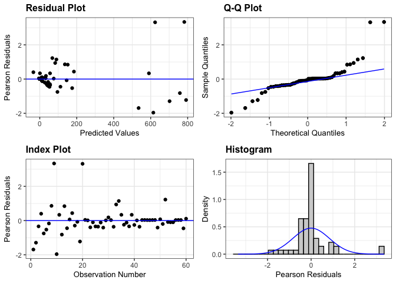
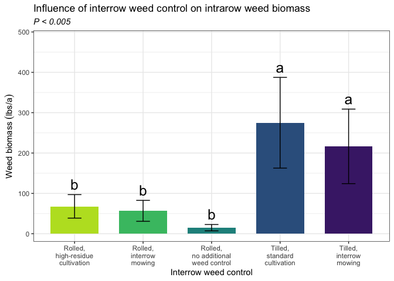
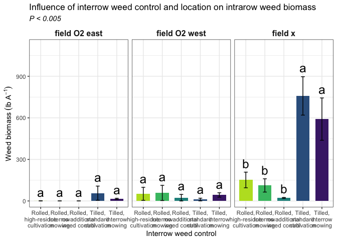

Intrarow weed biomass
================

# Load libraries

``` r
#Set work directory
setwd("/Users/ey239/Github/Mowtivation/rmarkdowns")

#Load packages 
library(tidyverse) ##install.packages("tidyverse")
library(knitr)
library(patchwork) ##install.packages("patchwork")
library(skimr)     ##install.packages("skimr")
library(readxl)
library(janitor) ##install.packages("janitor")

library(kableExtra) ##install.packages("kableExtra")
library(webshot) ##install.packages("webshot")
webshot::install_phantomjs()
library(viridis) ##install.packages("viridis")
library(lme4) ##install.packages("lme4")
library(lmerTest) ##install.packages("lmerTest")
library(emmeans) ##install.packages("emmeans")
library(rstatix) ##install.packages("rstatix")
#library(Matrix) ##install.packages("Matrix")
library(multcomp) ##install.packages("multcomp")
library(multcompView) ##install.packages("multcompView")
library(ggResidpanel) ##install.packages("ggResidpanel")
#library(car)
#library(TMB)  ##install.packages("TMB")
#library(glmmTMB)  ##install.packages("glmmTMB")
#library(DHARMa)  ##install.packages("DHARMa")

#Load Functions
MeanPlusSe<-function(x) mean(x)+plotrix::std.error(x)

find_logw0=function(x){c=trunc(log(min(x[x>0],na.rm=T)))
d=exp(c)
return(d)}
```

<br>

# Load and clean data

## Load data

``` r
combined_raw <- read_excel("~/Github/Mowtivation/raw-data/All Treatments/combined_raw.xlsx")
kable(head(combined_raw))
```

| id | location | year | treatment | block | plot | bean_emergence | bean_biomass | intrarow_weed_biomass | interrow_weed_biomass | weed_biomass | bean_population | bean_yield |
|:---|:---|---:|:---|---:|---:|---:|---:|---:|---:|---:|:---|:---|
| CU_B1_P101 | field x | 2023 | TIM | 1 | 101 | 46.5 | 223.740 | 19.000 | 44.490 | 63.490 | 34.5 | 417.21 |
| CU_B1_P102 | field x | 2023 | TIC | 1 | 102 | 42.5 | 267.460 | 30.975 | 0.720 | 31.695 | 39.5 | 565.54 |
| CU_B1_P103 | field x | 2023 | RIM | 1 | 103 | 36.5 | 217.890 | 0.950 | 6.890 | 3.920 | 37.5 | 449.93 |
| CU_B1_P104 | field x | 2023 | RNO | 1 | 104 | 41.0 | 207.675 | 0.660 | 45.735 | 46.395 | 35 | 412.59 |
| CU_B1_P105 | field x | 2023 | RIC | 1 | 105 | 41.0 | 230.285 | 0.495 | 22.025 | 22.520 | 39 | 473.79 |
| CU_B1_P201 | field x | 2023 | RIC | 2 | 201 | 36.5 | 208.105 | 6.395 | 19.460 | 25.855 | 33.5 | 484.04 |

## Clean data

``` r
#Standardaze column names, convert to factors, check for outliers of variable**
clean_combined <- clean_names(combined_raw) |>  
  rename ('weed_control'= treatment) |> 
  mutate(across(c(weed_control, block, plot, location, year), as.factor)) #|> 
  #mutate(is_outlier = totwbm < (quantile(totwbm, 0.25) - 1.5 * IQR(totwbm)) |
                       #wbm > (quantile(totwbm, 0.75) + 1.5 * IQR(totwbm)))

#select and convert data for wbm analysis
intrarow_weed_biomass_clean <-clean_combined |>              
  mutate(intrarow_weed_biomass_grams_meter = (intrarow_weed_biomass * 2)) |> 
  mutate(intrarow_weed_biomass_kg_ha = ((intrarow_weed_biomass/0.5) *(10000))/(1000)) |>
  mutate(intrarow_weed_biomass_lbs_ac = (((intrarow_weed_biomass/0.5) *(10000))/(1000))* 0.892179)
kable(head(intrarow_weed_biomass_clean)) 
```

| id | location | year | weed_control | block | plot | bean_emergence | bean_biomass | intrarow_weed_biomass | interrow_weed_biomass | weed_biomass | bean_population | bean_yield | intrarow_weed_biomass_grams_meter | intrarow_weed_biomass_kg_ha | intrarow_weed_biomass_lbs_ac |
|:---|:---|:---|:---|:---|:---|---:|---:|---:|---:|---:|:---|:---|---:|---:|---:|
| CU_B1_P101 | field x | 2023 | TIM | 1 | 101 | 46.5 | 223.740 | 19.000 | 44.490 | 63.490 | 34.5 | 417.21 | 38.00 | 380.0 | 339.028020 |
| CU_B1_P102 | field x | 2023 | TIC | 1 | 102 | 42.5 | 267.460 | 30.975 | 0.720 | 31.695 | 39.5 | 565.54 | 61.95 | 619.5 | 552.704891 |
| CU_B1_P103 | field x | 2023 | RIM | 1 | 103 | 36.5 | 217.890 | 0.950 | 6.890 | 3.920 | 37.5 | 449.93 | 1.90 | 19.0 | 16.951401 |
| CU_B1_P104 | field x | 2023 | RNO | 1 | 104 | 41.0 | 207.675 | 0.660 | 45.735 | 46.395 | 35 | 412.59 | 1.32 | 13.2 | 11.776763 |
| CU_B1_P105 | field x | 2023 | RIC | 1 | 105 | 41.0 | 230.285 | 0.495 | 22.025 | 22.520 | 39 | 473.79 | 0.99 | 9.9 | 8.832572 |
| CU_B1_P201 | field x | 2023 | RIC | 2 | 201 | 36.5 | 208.105 | 6.395 | 19.460 | 25.855 | 33.5 | 484.04 | 12.79 | 127.9 | 114.109694 |

# Model testing

Block is random Tyler is under the impression that block should always
be random and that post-hoc comparisons should use TUKEY rather the
Fischer. Fisher is bogus apparently.

## Lmer

``` r
random <- lmer(intrarow_weed_biomass_lbs_ac  ~ location+weed_control + location:weed_control +(1|location:block) , data = intrarow_weed_biomass_clean)

resid_panel(random)
```

<!-- -->

\##Joint test (anova)

``` r
random |> 
  joint_tests() |> 
  kable()  
```

|     | model term            | df1 | df2 | F.ratio |   p.value |
|:----|:----------------------|----:|----:|--------:|----------:|
| 1   | location              |   2 |   9 |  27.322 | 0.0001504 |
| 3   | weed_control          |   4 |  36 |  11.421 | 0.0000044 |
| 2   | location:weed_control |   8 |  36 |  10.361 | 0.0000002 |

<br>

## Means comparison

### Weed-control (S)

``` r
means_weed_control <- emmeans(random, ~  weed_control)
pairwise_comparisons_weed_control<- pairs(means_weed_control) 
kable(head(pairwise_comparisons_weed_control))
```

| contrast  |   estimate |       SE |  df |    t.ratio |   p.value |
|:----------|-----------:|---------:|----:|-----------:|----------:|
| RIC - RIM |   11.09276 | 47.19779 |  36 |  0.2350271 | 0.9999606 |
| RIC - RNO |   52.82443 | 47.19779 |  36 |  1.1192142 | 0.8492384 |
| RIC - TIC | -207.17140 | 47.19779 |  36 | -4.3894305 | 0.0005720 |
| RIC - TIM | -148.61472 | 47.19779 |  36 | -3.1487646 | 0.0195777 |
| RIM - RNO |   41.73167 | 47.19779 |  36 |  0.8841871 | 0.9445400 |
| RIM - TIC | -218.26416 | 47.19779 |  36 | -4.6244576 | 0.0002823 |

<br>

### Location (S)

``` r
means_location <- emmeans(random, ~  location)
pairwise_comparisons_location<- pairs(means_location) 
kable(head(pairwise_comparisons_location))
```

| contrast | estimate | SE | df | t.ratio | p.value |
|:---|---:|---:|---:|---:|---:|
| field O2 east - field O2 west | -23.01376 | 47.11941 | 9 | -0.4884135 | 0.9521427 |
| field O2 east - field x | -312.49908 | 47.11941 | 9 | -6.6320669 | 0.0002870 |
| field O2 west - field x | -289.48532 | 47.11941 | 9 | -6.1436533 | 0.0005100 |
| \### Location | weed-control (S) |  |  |  |  |

``` r
means_weed_control_location <- emmeans(random, ~  weed_control|location)
pairwise_comparisons_weed_control_location<- pairs(means_weed_control_location) 
kable(head(pairwise_comparisons_weed_control_location))
```

| contrast  | location      |    estimate |       SE |  df |    t.ratio |   p.value |
|:----------|:--------------|------------:|---------:|----:|-----------:|----------:|
| RIC - RIM | field O2 east |   0.3791761 | 81.74896 |  36 |  0.0046383 | 1.0000000 |
| RIC - RNO | field O2 east |   0.4906985 | 81.74896 |  36 |  0.0060025 | 1.0000000 |
| RIC - TIC | field O2 east | -56.0288412 | 81.74896 |  36 | -0.6853768 | 0.9838996 |
| RIC - TIM | field O2 east | -14.5425177 | 81.74896 |  36 | -0.1778924 | 0.9999924 |
| RIM - RNO | field O2 east |   0.1115224 | 81.74896 |  36 |  0.0013642 | 1.0000000 |
| RIM - TIC | field O2 east | -56.4080173 | 81.74896 |  36 | -0.6900151 | 0.9833366 |

## Tukey compact letter display

### Weed-control (S)

``` r
cld_weed_control_tukey <-cld(emmeans(random, ~  weed_control , type = "response"), Letters = letters, sort = TRUE, reversed=TRUE)
```

    ## NOTE: Results may be misleading due to involvement in interactions

``` r
cld_weed_control_tukey
```

    ##  weed_control emmean   SE   df lower.CL upper.CL .group
    ##  TIC           275.1 35.5 42.7   203.43    346.7  a    
    ##  TIM           216.5 35.5 42.7   144.88    288.1  a    
    ##  RIC            67.9 35.5 42.7    -3.74    139.5   b   
    ##  RIM            56.8 35.5 42.7   -14.83    128.4   b   
    ##  RNO            15.1 35.5 42.7   -56.56     86.7   b   
    ## 
    ## Results are averaged over the levels of: location 
    ## Degrees-of-freedom method: kenward-roger 
    ## Confidence level used: 0.95 
    ## P value adjustment: tukey method for comparing a family of 5 estimates 
    ## significance level used: alpha = 0.05 
    ## NOTE: If two or more means share the same grouping symbol,
    ##       then we cannot show them to be different.
    ##       But we also did not show them to be the same.

<br>

### Location (S)

``` r
#location
cld_location_tukey <-cld(emmeans(random, ~  location , type = "response"), Letters = letters, sort = TRUE, reversed=TRUE)
```

    ## NOTE: Results may be misleading due to involvement in interactions

``` r
cld_location_tukey
```

    ##  location      emmean   SE df lower.CL upper.CL .group
    ##  field x        326.9 33.3  9    251.6    402.3  a    
    ##  field O2 west   37.4 33.3  9    -37.9    112.8   b   
    ##  field O2 east   14.4 33.3  9    -60.9     89.8   b   
    ## 
    ## Results are averaged over the levels of: weed_control 
    ## Degrees-of-freedom method: kenward-roger 
    ## Confidence level used: 0.95 
    ## P value adjustment: tukey method for comparing a family of 3 estimates 
    ## significance level used: alpha = 0.05 
    ## NOTE: If two or more means share the same grouping symbol,
    ##       then we cannot show them to be different.
    ##       But we also did not show them to be the same.

<br>

### Weed-control:Location (S)

``` r
#weed_control|location
cld_weed_control_location_tukey <-cld(emmeans(random, ~  weed_control|location , type = "response"), Letters = letters, sort = TRUE, reversed=TRUE)
cld_weed_control_location_tukey
```

    ## location = field O2 east:
    ##  weed_control  emmean   SE   df lower.CL upper.CL .group
    ##  TIC           56.520 61.5 42.7    -67.6      181  a    
    ##  TIM           15.033 61.5 42.7   -109.0      139  a    
    ##  RIC            0.491 61.5 42.7   -123.6      125  a    
    ##  RIM            0.112 61.5 42.7   -124.0      124  a    
    ##  RNO            0.000 61.5 42.7   -124.1      124  a    
    ## 
    ## location = field O2 west:
    ##  weed_control  emmean   SE   df lower.CL upper.CL .group
    ##  RIM           58.014 61.5 42.7    -66.1      182  a    
    ##  RIC           51.479 61.5 42.7    -72.6      176  a    
    ##  TIM           43.694 61.5 42.7    -80.4      168  a    
    ##  RNO           23.598 61.5 42.7   -100.5      148  a    
    ##  TIC           10.438 61.5 42.7   -113.6      135  a    
    ## 
    ## location = field x:
    ##  weed_control  emmean   SE   df lower.CL upper.CL .group
    ##  TIC          758.241 61.5 42.7    634.2      882  a    
    ##  TIM          590.801 61.5 42.7    466.7      715  a    
    ##  RIC          151.715 61.5 42.7     27.6      276   b   
    ##  RIM          112.281 61.5 42.7    -11.8      236   b   
    ##  RNO           21.613 61.5 42.7   -102.5      146   b   
    ## 
    ## Degrees-of-freedom method: kenward-roger 
    ## Confidence level used: 0.95 
    ## P value adjustment: tukey method for comparing a family of 5 estimates 
    ## significance level used: alpha = 0.05 
    ## NOTE: If two or more means share the same grouping symbol,
    ##       then we cannot show them to be different.
    ##       But we also did not show them to be the same.

\#Figures \## Weed-control

This perhaps should be looked as an interaction between rolled cereal
rye and interrow weed control.

``` r
intrarow_weed_biomass_clean |> 
  left_join(cld_weed_control_tukey) |> 
  ggplot(aes(x = weed_control, y = intrarow_weed_biomass_lbs_ac, fill = weed_control)) +
  stat_summary(geom = "bar", fun = "mean", width = 0.7) +
  stat_summary(geom = "errorbar", fun.data = "mean_se", width = 0.2) +
  stat_summary(geom="text", fun = "MeanPlusSe", aes(label= trimws(.group)),size=6.5,vjust=-0.5) +
  labs(
    x = "Interrow weed control",
    y = expression("Weed biomass" ~ (lb ~ A^{-1})),
    title = str_c("Influence of interrow weed control on intrarow weed biomass"),
    subtitle = expression(italic("P < 0.005"))) +
  
  scale_x_discrete(labels = c("Rolled,\nhigh-residue\ncultivation",
                              "Rolled,\ninterrow\nmowing",
                              "Rolled,\nno additional\nweed control",
                          "Tilled,\nstandard\ncultivation",
                              "Tilled,\ninterrow\nmowing")) +
  scale_y_continuous(expand = expansion(mult = c(0.05, 0.3))) +
  scale_fill_viridis(discrete = TRUE, option = "D", direction = -1, end = 0.9, begin = 0.1) +
   theme_bw() +
  theme(
    legend.position = "none",
    strip.background = element_blank(),
    strip.text = element_text(face = "bold", size = 12)
  )
```

<!-- -->

``` r
ggsave("intrarow_weed_biomass_weed_control_lbA.png", width = 8, height = 6, dpi = 300)
```

## Weed-control:location

``` r
intrarow_weed_biomass_clean |> 
  left_join(cld_weed_control_location_tukey) |> 
  ggplot(aes(x = weed_control, y = intrarow_weed_biomass_lbs_ac, fill = weed_control)) +
  facet_wrap(~location )+
  stat_summary(geom = "bar", fun = "mean", width = 0.7) +
  stat_summary(geom = "errorbar", fun.data = "mean_se", width = 0.2) +
  stat_summary(geom="text", fun = "MeanPlusSe", aes(label= trimws(.group)),size=6.5,vjust=-0.5) +
  labs(
    x = "Interrow weed control",
    y = expression("Weed biomass" ~ (lb ~ A^{-1})),
    title = str_c("Influence of interrow weed control and location on intrarow weed biomass"),
    subtitle = expression(italic("P < 0.005"))) +
  
  scale_x_discrete(labels = c("Rolled,\nhigh-residue\ncultivation",
                              "Rolled,\ninterrow\nmowing",
                              "Rolled,\nno additional\nweed control",
                          "Tilled,\nstandard\ncultivation",
                              "Tilled,\ninterrow\nmowing")) +
  scale_y_continuous(expand = expansion(mult = c(0.05, 0.3))) +
  scale_fill_viridis(discrete = TRUE, option = "D", direction = -1, end = 0.9, begin = 0.1) +
   theme_bw() +
  theme(
    legend.position = "none",
    strip.background = element_blank(),
    strip.text = element_text(face = "bold", size = 12)
  )
```

<!-- -->

``` r
ggsave("intrarow_weed_biomass_weed_control_location_lbA.png", width = 12, height = 6, dpi = 300)
```
