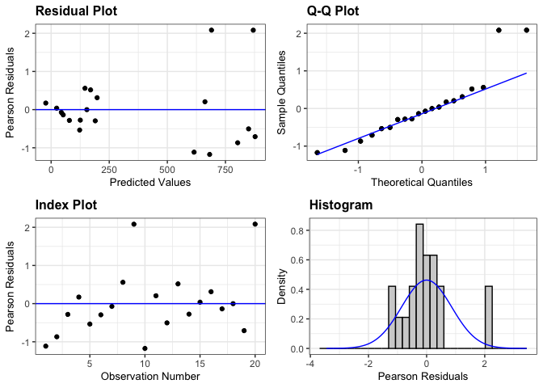
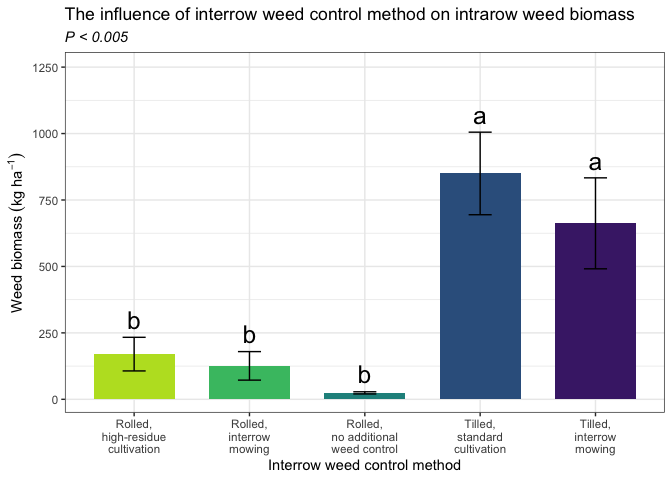

Intrarow weed biomass
================

``` r
#Set work directory
setwd("/Users/ey239/Github/Mowtivation/rmarkdowns")

#Load packages 
library(tidyverse) ##install.packages("tidyverse")
library(knitr)
library(patchwork) ##install.packages("patchwork")
library(skimr)     ##install.packages("skimr")
library(readxl)
library(janitor) ##install.packages("janitor")

library(kableExtra) ##install.packages("kableExtra")
library(webshot) ##install.packages("webshot")
webshot::install_phantomjs()
library(viridis) ##install.packages("viridis")
library(lme4) ##install.packages("lme4")
library(lmerTest) ##install.packages("lmerTest")
library(emmeans) ##install.packages("emmeans")
library(rstatix) ##install.packages("rstatix")
#library(Matrix) ##install.packages("Matrix")
library(multcomp) ##install.packages("multcomp")
library(multcompView) ##install.packages("multcompView")
library(ggResidpanel) ##install.packages("ggResidpanel")
#library(car)
#library(TMB)  ##install.packages("TMB")
#library(glmmTMB)  ##install.packages("glmmTMB")
#library(DHARMa)  ##install.packages("DHARMa")

#Load Functions
MeanPlusSe<-function(x) mean(x)+plotrix::std.error(x)

find_logw0=function(x){c=trunc(log(min(x[x>0],na.rm=T)))
d=exp(c)
return(d)}
```

<br>

# **Load and Clean Data**

### **Load individual datasets**

``` r
cu_raw_2023 <- read_excel("~/Github/Mowtivation/raw-data/cornell_raw_2023.xlsx")
kable(head(cu_raw_2023))
```

| id | loc | year | trt | block | pllot | emerge | bbm | intrabm | interbm | totwbm | totmbm | beanden | beanyd |
|:---|:---|---:|:---|---:|---:|---:|---:|---:|---:|---:|:---|---:|---:|
| CU_B1_P101 | field x | 2023 | TIM | 1 | 101 | 46.5 | 223.740 | 19.000 | 44.490 | 63.490 | Na | 34.5 | 417.21 |
| CU_B1_P102 | field x | 2023 | TIC | 1 | 102 | 42.5 | 267.460 | 30.975 | 0.720 | 31.695 | Na | 39.5 | 565.54 |
| CU_B1_P103 | field x | 2023 | RIM | 1 | 103 | 36.5 | 217.890 | 0.950 | 6.890 | 3.920 | 285.95 | 37.5 | 449.93 |
| CU_B1_P104 | field x | 2023 | RNO | 1 | 104 | 41.0 | 207.675 | 0.660 | 45.735 | 46.395 | 241.03 | 35.0 | 412.59 |
| CU_B1_P105 | field x | 2023 | RIC | 1 | 105 | 41.0 | 230.285 | 0.495 | 22.025 | 22.520 | 306.64 | 39.0 | 473.79 |
| CU_B1_P201 | field x | 2023 | RIC | 2 | 201 | 36.5 | 208.105 | 6.395 | 19.460 | 25.855 | 370.94499999999999 | 33.5 | 484.04 |

``` r
#Standardaze column names, convert to factors, check for outliers of variable**
clean_2023 <- clean_names(cu_raw_2023) |>  
  rename ('cultivation'= trt) |> 
  mutate(across(c(cultivation, block, pllot, loc), as.factor)) #|> 
  #mutate(is_outlier = totwbm < (quantile(totwbm, 0.25) - 1.5 * IQR(totwbm)) |
                       #wbm > (quantile(totwbm, 0.75) + 1.5 * IQR(totwbm)))

#select and convert data for wbm analysis
intrabm_clean_2023 <-clean_2023 |>              
  mutate(intrabm_grams_meter = (intrabm * 2)) |> 
  mutate(intrabm_kg_ha = ((intrabm/0.5) *(10000))/(1000)) |>
  mutate(intrabm_lbs_ac = (((intrabm/0.5) *(10000))/(1000))* 0.892179)
kable(head(intrabm_clean_2023)) 
```

| id | loc | year | cultivation | block | pllot | emerge | bbm | intrabm | interbm | totwbm | totmbm | beanden | beanyd | intrabm_grams_meter | intrabm_kg_ha | intrabm_lbs_ac |
|:---|:---|---:|:---|:---|:---|---:|---:|---:|---:|---:|:---|---:|---:|---:|---:|---:|
| CU_B1_P101 | field x | 2023 | TIM | 1 | 101 | 46.5 | 223.740 | 19.000 | 44.490 | 63.490 | Na | 34.5 | 417.21 | 38.00 | 380.0 | 339.028020 |
| CU_B1_P102 | field x | 2023 | TIC | 1 | 102 | 42.5 | 267.460 | 30.975 | 0.720 | 31.695 | Na | 39.5 | 565.54 | 61.95 | 619.5 | 552.704891 |
| CU_B1_P103 | field x | 2023 | RIM | 1 | 103 | 36.5 | 217.890 | 0.950 | 6.890 | 3.920 | 285.95 | 37.5 | 449.93 | 1.90 | 19.0 | 16.951401 |
| CU_B1_P104 | field x | 2023 | RNO | 1 | 104 | 41.0 | 207.675 | 0.660 | 45.735 | 46.395 | 241.03 | 35.0 | 412.59 | 1.32 | 13.2 | 11.776763 |
| CU_B1_P105 | field x | 2023 | RIC | 1 | 105 | 41.0 | 230.285 | 0.495 | 22.025 | 22.520 | 306.64 | 39.0 | 473.79 | 0.99 | 9.9 | 8.832572 |
| CU_B1_P201 | field x | 2023 | RIC | 2 | 201 | 36.5 | 208.105 | 6.395 | 19.460 | 25.855 | 370.94499999999999 | 33.5 | 484.04 | 12.79 | 127.9 | 114.109694 |

<br>

## **Model testing**

### **block is fixed**

``` r
intrabm_fixed <- lm(intrabm_kg_ha  ~ cultivation + block  , data = intrabm_clean_2023)

resid_panel(intrabm_fixed)
```

<!-- -->

### **block is random**

``` r
intrabm_ran <- lmer(intrabm_kg_ha  ~ cultivation + (1|block)  , data = intrabm_clean_2023)

resid_panel(intrabm_ran)
```

<!-- -->

<br>

\##**Joint test**

``` r
 intrabm_fixed |> 
  joint_tests() |> 
  kable()  
```

| model term  | df1 | df2 | F.ratio |   p.value |
|:------------|----:|----:|--------:|----------:|
| cultivation |   4 |  12 |  12.026 | 0.0003674 |
| block       |   3 |  12 |   1.426 | 0.2835749 |

<br>

# **Means comparison**

``` r
intrabm_means_2023 <- 
 emmeans(intrabm_fixed, ~  cultivation)
# Optional: Adjust for multiple comparisons (e.g., using Tukey's method)

pairwise_comparisons<- pairs(intrabm_means_2023) 
kable(head(pairwise_comparisons))
```

| contrast  | estimate |       SE |  df |    t.ratio |   p.value |
|:----------|---------:|---------:|----:|-----------:|----------:|
| RIC - RIM |   44.200 | 149.1049 |  12 |  0.2964356 | 0.9998594 |
| RIC - RNO |  145.825 | 149.1049 |  12 |  0.9780026 | 0.9227376 |
| RIC - TIC | -679.825 | 149.1049 |  12 | -4.5593734 | 0.0039262 |
| RIC - TIM | -492.150 | 149.1049 |  12 | -3.3006960 | 0.0373990 |
| RIM - RNO |  101.625 | 149.1049 |  12 |  0.6815671 | 0.9858945 |
| RIM - TIC | -724.025 | 149.1049 |  12 | -4.8558090 | 0.0023637 |

### **Fisher’s method for comparing means**

``` r
#mowing
cld_cultivation_fisher <-cld(emmeans(intrabm_fixed, ~  cultivation, type = "response"), Letters = letters, sort = TRUE, adjust="none", reversed=TRUE)
cld_cultivation_fisher
```

    ##  cultivation emmean  SE df lower.CL upper.CL .group
    ##  TIC          849.9 105 12    620.2     1080  a    
    ##  TIM          662.2 105 12    432.5      892  a    
    ##  RIC          170.1 105 12    -59.7      400   b   
    ##  RIM          125.8 105 12   -103.9      356   b   
    ##  RNO           24.2 105 12   -205.5      254   b   
    ## 
    ## Results are averaged over the levels of: block 
    ## Confidence level used: 0.95 
    ## significance level used: alpha = 0.05 
    ## NOTE: If two or more means share the same grouping symbol,
    ##       then we cannot show them to be different.
    ##       But we also did not show them to be the same.

# **FIGURES**

## **Cultivation**

``` r
intrabm_clean_2023 |> 
  left_join(cld_cultivation_fisher) |> 
  ggplot(aes(x = cultivation, y = intrabm_kg_ha, fill = cultivation)) +
  stat_summary(geom = "bar", fun = "mean", width = 0.7) +
  stat_summary(geom = "errorbar", fun.data = "mean_se", width = 0.2) +
  stat_summary(geom="text", fun = "MeanPlusSe", aes(label= trimws(.group)),size=6.5,vjust=-0.5) +
  labs(
    x = "Interrow weed control method",
    y = expression("Weed biomass" ~ (kg ~ ha^{-1})),
    title = str_c("The influence of interrow weed control method on intrarow weed biomass"),
    subtitle = expression(italic("P < 0.005"))) +
  
  scale_x_discrete(labels = c("Rolled,\nhigh-residue\ncultivation",
                              "Rolled,\ninterrow\nmowing",
                              "Rolled,\nno additional\nweed control",
                          "Tilled,\nstandard\ncultivation",
                              "Tilled,\ninterrow\nmowing")) +
  scale_y_continuous(expand = expansion(mult = c(0.05, 0.3))) +
  scale_fill_viridis(discrete = TRUE, option = "D", direction = -1, end = 0.9, begin = 0.1) +
   theme_bw() +
  theme(
    legend.position = "none",
    strip.background = element_blank(),
    strip.text = element_text(face = "bold", size = 12)
  )
```

<!-- -->

``` r
ggsave("intrabm_plot_cutivation.png", width = 8, height = 6, dpi = 300)
```
