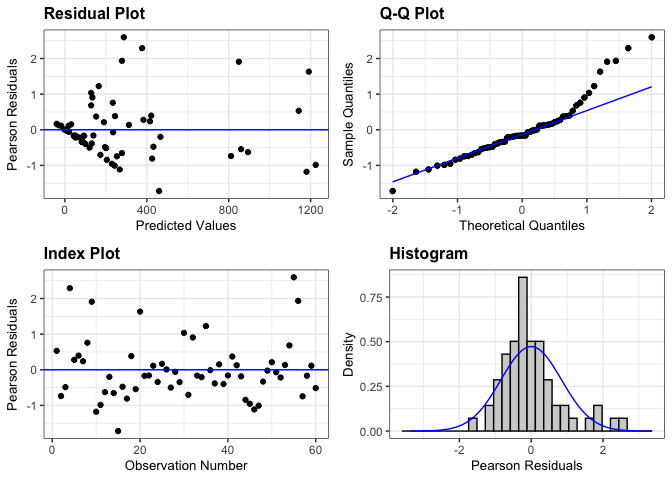
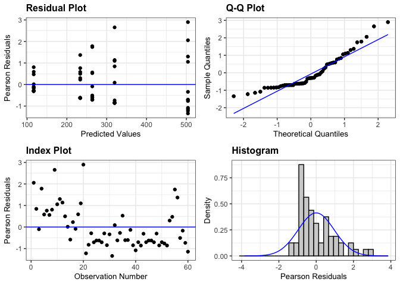
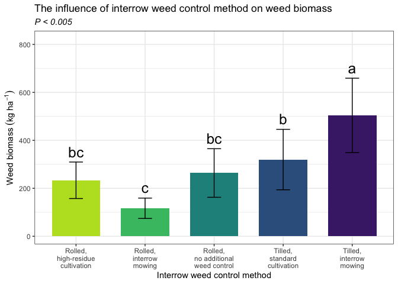
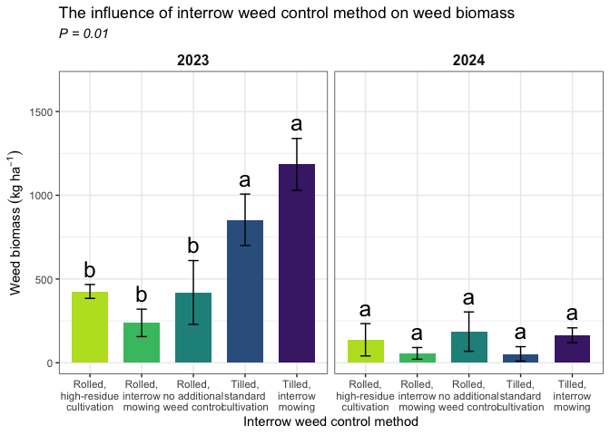

Weed biomass
================

# **Load libraries**

``` r
#Set work directory
setwd("/Users/ey239/Github/Mowtivation/rmarkdowns")

#Load packages 
library(tidyverse) ##install.packages("tidyverse")
library(knitr)
library(patchwork) ##install.packages("patchwork")
library(skimr)     ##install.packages("skimr")
library(readxl)
library(janitor) ##install.packages("janitor")

library(kableExtra) ##install.packages("kableExtra")
library(webshot) ##install.packages("webshot")
webshot::install_phantomjs()
library(viridis) ##install.packages("viridis")
library(lme4) ##install.packages("lme4")
library(lmerTest) ##install.packages("lmerTest")
library(emmeans) ##install.packages("emmeans")
library(rstatix) ##install.packages("rstatix")
#library(Matrix) ##install.packages("Matrix")
library(multcomp) ##install.packages("multcomp")
library(multcompView) ##install.packages("multcompView")
library(ggResidpanel) ##install.packages("ggResidpanel")
#library(car)
#library(TMB)  ##install.packages("TMB")
#library(glmmTMB)  ##install.packages("glmmTMB")
#library(DHARMa)  ##install.packages("DHARMa")

#Load Functions
MeanPlusSe<-function(x) mean(x)+plotrix::std.error(x)

find_logw0=function(x){c=trunc(log(min(x[x>0],na.rm=T)))
d=exp(c)
return(d)}
```

<br>

# **Load and Clean Data**

### **Load individual datasets**

``` r
cu_raw_all <- read_excel("~/Github/Mowtivation/raw-data/cornell_raw_all.xlsx")
kable(head(cu_raw_all))
```

| id | loc | year | trt | block | pllot | emerge | bbm | intrabm | interbm | totwbm | totmbm | beanden | beanyd |
|:---|:---|---:|:---|---:|---:|:---|---:|---:|---:|---:|:---|:---|:---|
| CU_B1_P101 | field x | 2023 | TIM | 1 | 101 | 46.5 | 223.740 | 19.000 | 44.490 | 63.490 | Na | 34.5 | 417.21 |
| CU_B1_P102 | field x | 2023 | TIC | 1 | 102 | 42.5 | 267.460 | 30.975 | 0.720 | 31.695 | Na | 39.5 | 565.54 |
| CU_B1_P103 | field x | 2023 | RIM | 1 | 103 | 36.5 | 217.890 | 0.950 | 6.890 | 3.920 | 285.95 | 37.5 | 449.93 |
| CU_B1_P104 | field x | 2023 | RNO | 1 | 104 | 41 | 207.675 | 0.660 | 45.735 | 46.395 | 241.03 | 35 | 412.59 |
| CU_B1_P105 | field x | 2023 | RIC | 1 | 105 | 41 | 230.285 | 0.495 | 22.025 | 22.520 | 306.64 | 39 | 473.79 |
| CU_B1_P201 | field x | 2023 | RIC | 2 | 201 | 36.5 | 208.105 | 6.395 | 19.460 | 25.855 | 370.94499999999999 | 33.5 | 484.04 |

``` r
#Standardaze column names, convert to factors, check for outliers of variable**
clean_all <- clean_names(cu_raw_all) |>  
  rename ('cultivation'= trt) |> 
  mutate(across(c(cultivation, block, pllot, loc, year), as.factor)) #|> 
  #mutate(is_outlier = totwbm < (quantile(totwbm, 0.25) - 1.5 * IQR(totwbm)) |
                       #wbm > (quantile(totwbm, 0.75) + 1.5 * IQR(totwbm)))

#select and convert data for wbm analysis
totwbm_clean_all <-clean_all |>              
  mutate(totwbm_grams_meter = (totwbm * 2)) |> 
  mutate(totwbm_kg_ha = ((totwbm/0.5) *(10000))/(1000)) |>
  mutate(totwbm_lbs_ac = (((totwbm/0.5) *(10000))/(1000))* 0.892179)
kable(head(totwbm_clean_all)) 
```

| id | loc | year | cultivation | block | pllot | emerge | bbm | intrabm | interbm | totwbm | totmbm | beanden | beanyd | totwbm_grams_meter | totwbm_kg_ha | totwbm_lbs_ac |
|:---|:---|:---|:---|:---|:---|:---|---:|---:|---:|---:|:---|:---|:---|---:|---:|---:|
| CU_B1_P101 | field x | 2023 | TIM | 1 | 101 | 46.5 | 223.740 | 19.000 | 44.490 | 63.490 | Na | 34.5 | 417.21 | 126.98 | 1269.8 | 1132.88889 |
| CU_B1_P102 | field x | 2023 | TIC | 1 | 102 | 42.5 | 267.460 | 30.975 | 0.720 | 31.695 | Na | 39.5 | 565.54 | 63.39 | 633.9 | 565.55227 |
| CU_B1_P103 | field x | 2023 | RIM | 1 | 103 | 36.5 | 217.890 | 0.950 | 6.890 | 3.920 | 285.95 | 37.5 | 449.93 | 7.84 | 78.4 | 69.94683 |
| CU_B1_P104 | field x | 2023 | RNO | 1 | 104 | 41 | 207.675 | 0.660 | 45.735 | 46.395 | 241.03 | 35 | 412.59 | 92.79 | 927.9 | 827.85289 |
| CU_B1_P105 | field x | 2023 | RIC | 1 | 105 | 41 | 230.285 | 0.495 | 22.025 | 22.520 | 306.64 | 39 | 473.79 | 45.04 | 450.4 | 401.83742 |
| CU_B1_P201 | field x | 2023 | RIC | 2 | 201 | 36.5 | 208.105 | 6.395 | 19.460 | 25.855 | 370.94499999999999 | 33.5 | 484.04 | 51.71 | 517.1 | 461.34576 |

<br> \### **block is fixed**

``` r
totwbm_fixed <- lmer(totwbm_kg_ha  ~ loc*year*cultivation + block 
                     +(1 | year/loc) , data = totwbm_clean_all)
```

    ## fixed-effect model matrix is rank deficient so dropping 15 columns / coefficients

    ## Warning in as_lmerModLT(model, devfun): Model may not have converged with 2
    ## eigenvalues close to zero: 6.2e-10 1.7e-12

``` r
resid_panel(totwbm_fixed)
```

<!-- -->
\### **block is random**

``` r
totwbm_ran <- lmer(totwbm_kg_ha  ~ cultivation + (1|block)  , data = totwbm_clean_all)
```

    ## boundary (singular) fit: see help('isSingular')

``` r
resid_panel(totwbm_ran)
```

<!-- -->

\##**Joint test**

``` r
 totwbm_fixed |> 
  joint_tests() |> 
  kable()  
```

    ## NOTE: A nesting structure was detected in the fitted model:
    ##     loc %in% year

|     | model term           | df1 |       df2 | F.ratio |   p.value | note |
|:----|:---------------------|----:|----------:|--------:|----------:|:-----|
| 3   | year                 |   1 | 1330489.9 |   0.331 | 0.5653497 |      |
| 5   | cultivation          |   4 |      42.0 |   7.446 | 0.0001256 |      |
| 6   | block                |   3 |      42.0 |   0.303 | 0.8227344 |      |
| 1   | loc:year             |   1 |  657582.9 |   0.011 | 0.9182477 | e    |
| 4   | year:cultivation     |   4 |      42.0 |   6.662 | 0.0003024 |      |
| 2   | loc:year:cultivation |   4 |      42.0 |   0.556 | 0.6956497 | e    |

<br>

# **Means comparison of totwbm**

``` r
totwbm_means_all <- 
 emmeans(totwbm_fixed, ~  cultivation)
# Optional: Adjust for multiple comparisons (e.g., using Tukey's method)

pairwise_comparisons<- pairs(totwbm_means_all) 
kable(head(pairwise_comparisons))
```

| contrast  |   estimate |       SE |  df |    t.ratio |   p.value |
|:----------|-----------:|---------:|----:|-----------:|----------:|
| RIC - RIM |  134.50625 | 104.1279 |  42 |  1.2917411 | 0.7446820 |
| RIC - RNO |  -21.18125 | 104.1279 |  42 | -0.2034158 | 0.9999831 |
| RIC - TIC | -171.75000 | 104.1279 |  42 | -1.6494143 | 0.4912564 |
| RIC - TIM | -392.55625 | 104.1279 |  42 | -3.7699441 | 0.0030209 |
| RIM - RNO | -155.68750 | 104.1279 |  42 | -1.4951569 | 0.6020206 |
| RIM - TIC | -306.25625 | 104.1279 |  42 | -2.9411554 | 0.0313831 |

### **Fisher’s method for comparing means**

``` r
#mowing
cld_cultivation_fisher <-cld(emmeans(totwbm_fixed, ~  cultivation , type = "response"), Letters = letters, sort = TRUE, adjust="none", reversed=TRUE)
```

    ## NOTE: A nesting structure was detected in the fitted model:
    ##     loc %in% year

    ## NOTE: Results may be misleading due to involvement in interactions

``` r
cld_cultivation_fisher
```

    ##  cultivation emmean  SE    df lower.CL upper.CL .group
    ##  TIM            674 444 55639     -197     1545  a    
    ##  TIC            453 444 55639     -417     1324   b   
    ##  RNO            303 444 55639     -568     1173   bc  
    ##  RIC            282 444 55639     -589     1152   bc  
    ##  RIM            147 444 55639     -724     1018    c  
    ## 
    ## Results are averaged over the levels of: block, loc, year 
    ## Degrees-of-freedom method: kenward-roger 
    ## Confidence level used: 0.95 
    ## significance level used: alpha = 0.05 
    ## NOTE: If two or more means share the same grouping symbol,
    ##       then we cannot show them to be different.
    ##       But we also did not show them to be the same.

``` r
#mowing
cld_cultivation_year_fisher <-cld(emmeans(totwbm_fixed, ~  cultivation|year , type = "response"), Letters = letters, sort = TRUE, adjust="none", reversed=TRUE)
```

    ## NOTE: A nesting structure was detected in the fitted model:
    ##     loc %in% year

    ## NOTE: Results may be misleading due to involvement in interactions

``` r
cld_cultivation_year_fisher
```

    ## year = 2023:
    ##  cultivation emmean  SE    df lower.CL upper.CL .group
    ##  TIM         1184.3 699 47852     -185     2554  a    
    ##  TIC          853.7 699 47852     -515     2223  a    
    ##  RIC          425.9 699 47852     -943     1795   b   
    ##  RNO          419.6 699 47852     -950     1789   b   
    ##  RIM          238.2 699 47852    -1131     1607   b   
    ## 
    ## year = 2024:
    ##  cultivation emmean  SE    df lower.CL upper.CL .group
    ##  RNO          186.0 549 72972     -890     1262  a    
    ##  TIM          163.9 549 72972     -912     1240  a    
    ##  RIC          137.3 549 72972     -939     1213  a    
    ##  RIM           56.0 549 72972    -1020     1132  a    
    ##  TIC           52.9 549 72972    -1023     1129  a    
    ## 
    ## Results are averaged over the levels of: block, loc 
    ## Degrees-of-freedom method: kenward-roger 
    ## Confidence level used: 0.95 
    ## significance level used: alpha = 0.05 
    ## NOTE: If two or more means share the same grouping symbol,
    ##       then we cannot show them to be different.
    ##       But we also did not show them to be the same.

# **FIGURES**

## **Cultivation**

``` r
totwbm_clean_all |> 
  left_join(cld_cultivation_fisher) |> 
  ggplot(aes(x = cultivation, y = totwbm_kg_ha, fill = cultivation)) +
  stat_summary(geom = "bar", fun = "mean", width = 0.7) +
  stat_summary(geom = "errorbar", fun.data = "mean_se", width = 0.2) +
  stat_summary(geom="text", fun = "MeanPlusSe", aes(label= trimws(.group)),size=6.5,vjust=-0.5) +
  labs(
    x = "Interrow weed control method",
    y = expression("Weed biomass" ~ (kg ~ ha^{-1})),
    title = str_c("The influence of interrow weed control method on weed biomass"),
    subtitle = expression(italic("P < 0.005"))) +
  
  scale_x_discrete(labels = c("Rolled,\nhigh-residue\ncultivation",
                              "Rolled,\ninterrow\nmowing",
                              "Rolled,\nno additional\nweed control",
                          "Tilled,\nstandard\ncultivation",
                              "Tilled,\ninterrow\nmowing")) +
  scale_y_continuous(expand = expansion(mult = c(0.05, 0.3))) +
  scale_fill_viridis(discrete = TRUE, option = "D", direction = -1, end = 0.9, begin = 0.1) +
   theme_bw() +
  theme(
    legend.position = "none",
    strip.background = element_blank(),
    strip.text = element_text(face = "bold", size = 12)
  )
```

<!-- -->

``` r
ggsave("wbm_all_plot_mowing.png", width = 8, height = 6, dpi = 300)
```

## **Cultivation:year**

``` r
totwbm_clean_all |> 
  left_join(cld_cultivation_year_fisher) |> 
  ggplot(aes(x = cultivation, y = totwbm_kg_ha, fill = cultivation)) +
  facet_wrap(~year )+
  stat_summary(geom = "bar", fun = "mean", width = 0.7) +
  stat_summary(geom = "errorbar", fun.data = "mean_se", width = 0.2) +
  stat_summary(geom="text", fun = "MeanPlusSe", aes(label= trimws(.group)),size=6.5,vjust=-0.5) +
  labs(
    x = "Interrow weed control method",
    y = expression("Weed biomass" ~ (kg ~ ha^{-1})),
    title = str_c("The influence of interrow weed control method on weed biomass"),
    subtitle = expression(italic("P = 0.01"))) +
  
  scale_x_discrete(labels = c("Rolled,\nhigh-residue\ncultivation",
                              "Rolled,\ninterrow\nmowing",
                              "Rolled,\nno additional\nweed control",
                          "Tilled,\nstandard\ncultivation",
                              "Tilled,\ninterrow\nmowing")) +
  scale_y_continuous(expand = expansion(mult = c(0.05, 0.3))) +
  scale_fill_viridis(discrete = TRUE, option = "D", direction = -1, end = 0.9, begin = 0.1) +
   theme_bw() +
  theme(
    legend.position = "none",
    strip.background = element_blank(),
    strip.text = element_text(face = "bold", size = 12)
  )
```

<!-- -->

``` r
ggsave("wbm_all_plot_mowing_year.png", width = 12, height = 6, dpi = 300)
```
