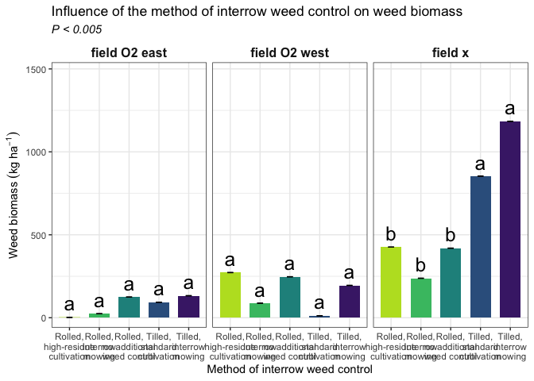
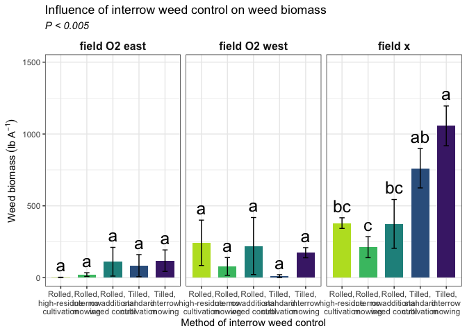

Weed biomass
================

# **Load libraries**

``` r
#Set work directory
setwd("/Users/ey239/Github/Mowtivation/rmarkdowns")

#Load packages 
library(tidyverse) ##install.packages("tidyverse")
library(knitr)
library(patchwork) ##install.packages("patchwork")
library(skimr)     ##install.packages("skimr")
library(readxl)
library(janitor) ##install.packages("janitor")

library(kableExtra) ##install.packages("kableExtra")
library(webshot) ##install.packages("webshot")
webshot::install_phantomjs()
library(viridis) ##install.packages("viridis")
library(lme4) ##install.packages("lme4")
library(lmerTest) ##install.packages("lmerTest")
library(emmeans) ##install.packages("emmeans")
library(rstatix) ##install.packages("rstatix")
#library(Matrix) ##install.packages("Matrix")
library(multcomp) ##install.packages("multcomp")
library(multcompView) ##install.packages("multcompView")
library(ggResidpanel) ##install.packages("ggResidpanel")
#library(car)
#library(TMB)  ##install.packages("TMB")
#library(glmmTMB)  ##install.packages("glmmTMB")
#library(DHARMa)  ##install.packages("DHARMa")

#Load Functions
MeanPlusSe<-function(x) mean(x)+plotrix::std.error(x)

find_logw0=function(x){c=trunc(log(min(x[x>0],na.rm=T)))
d=exp(c)
return(d)}
```

<br>

# **Load and Clean Data**

### **Load individual datasets**

``` r
combined_raw <- read_excel("~/Github/Mowtivation/raw-data/All Treatments/combined_raw.xlsx")
kable(head(combined_raw))
```

| id | location | year | treatment | block | plot | bean_emergence | bean_biomass | intrarow_weed_biomass | interrow_weed_biomass | weed_biomass | bean_population | bean_yield |
|:---|:---|---:|:---|---:|---:|---:|---:|---:|---:|---:|:---|:---|
| CU_B1_P101 | field x | 2023 | TIM | 1 | 101 | 46.5 | 223.740 | 19.000 | 44.490 | 63.490 | 34.5 | 417.21 |
| CU_B1_P102 | field x | 2023 | TIC | 1 | 102 | 42.5 | 267.460 | 30.975 | 0.720 | 31.695 | 39.5 | 565.54 |
| CU_B1_P103 | field x | 2023 | RIM | 1 | 103 | 36.5 | 217.890 | 0.950 | 6.890 | 3.920 | 37.5 | 449.93 |
| CU_B1_P104 | field x | 2023 | RNO | 1 | 104 | 41.0 | 207.675 | 0.660 | 45.735 | 46.395 | 35 | 412.59 |
| CU_B1_P105 | field x | 2023 | RIC | 1 | 105 | 41.0 | 230.285 | 0.495 | 22.025 | 22.520 | 39 | 473.79 |
| CU_B1_P201 | field x | 2023 | RIC | 2 | 201 | 36.5 | 208.105 | 6.395 | 19.460 | 25.855 | 33.5 | 484.04 |

``` r
#Standardaze column names, convert to factors, check for outliers of variable**
clean_combined <- clean_names(combined_raw) |>  
  rename ('weed_control'= treatment) |> 
  mutate(across(c(weed_control, block, plot, location, year), as.factor)) #|> 
  #mutate(is_outlier = totwbm < (quantile(totwbm, 0.25) - 1.5 * IQR(totwbm)) |
                       #wbm > (quantile(totwbm, 0.75) + 1.5 * IQR(totwbm)))

#select and convert data for wbm analysis
weed_biomass_clean <-clean_combined |>              
  mutate(weed_biomass_grams_meter = (weed_biomass * 2)) |> 
  mutate(weed_biomass_kg_ha = ((weed_biomass/0.5) *(10000))/(1000)) |>
  mutate(weed_biomass_lbs_ac = (((weed_biomass/0.5) *(10000))/(1000))* 0.892179)
kable(head(weed_biomass_clean)) 
```

| id | location | year | weed_control | block | plot | bean_emergence | bean_biomass | intrarow_weed_biomass | interrow_weed_biomass | weed_biomass | bean_population | bean_yield | weed_biomass_grams_meter | weed_biomass_kg_ha | weed_biomass_lbs_ac |
|:---|:---|:---|:---|:---|:---|---:|---:|---:|---:|---:|:---|:---|---:|---:|---:|
| CU_B1_P101 | field x | 2023 | TIM | 1 | 101 | 46.5 | 223.740 | 19.000 | 44.490 | 63.490 | 34.5 | 417.21 | 126.98 | 1269.8 | 1132.88889 |
| CU_B1_P102 | field x | 2023 | TIC | 1 | 102 | 42.5 | 267.460 | 30.975 | 0.720 | 31.695 | 39.5 | 565.54 | 63.39 | 633.9 | 565.55227 |
| CU_B1_P103 | field x | 2023 | RIM | 1 | 103 | 36.5 | 217.890 | 0.950 | 6.890 | 3.920 | 37.5 | 449.93 | 7.84 | 78.4 | 69.94683 |
| CU_B1_P104 | field x | 2023 | RNO | 1 | 104 | 41.0 | 207.675 | 0.660 | 45.735 | 46.395 | 35 | 412.59 | 92.79 | 927.9 | 827.85289 |
| CU_B1_P105 | field x | 2023 | RIC | 1 | 105 | 41.0 | 230.285 | 0.495 | 22.025 | 22.520 | 39 | 473.79 | 45.04 | 450.4 | 401.83742 |
| CU_B1_P201 | field x | 2023 | RIC | 2 | 201 | 36.5 | 208.105 | 6.395 | 19.460 | 25.855 | 33.5 | 484.04 | 51.71 | 517.1 | 461.34576 |

<br> \### **block is random** \#Ask tyler about model format, should
block always be fixed, etc. should location be nested in year? Do i need
to transform data if zeros are present? How to separate year from
location?

Last meeting we updated the model and determined that for most of mhy
work, block should be random using model below and that post hoc
comparisons should use TUKEY ratther the Fischer.

``` r
random <- lmer(weed_biomass_kg_ha  ~ location+weed_control + location:weed_control +(1|location:block) , data = weed_biomass_clean)

resid_panel(random)
```

<!-- -->

``` r
summary(random)
```

    ## Linear mixed model fit by REML. t-tests use Satterthwaite's method [
    ## lmerModLmerTest]
    ## Formula: 
    ## weed_biomass_kg_ha ~ location + weed_control + location:weed_control +  
    ##     (1 | location:block)
    ##    Data: weed_biomass_clean
    ## 
    ## REML criterion at convergence: 639.7
    ## 
    ## Scaled residuals: 
    ##      Min       1Q   Median       3Q      Max 
    ## -1.50265 -0.50660 -0.09458  0.22898  2.74794 
    ## 
    ## Random effects:
    ##  Groups         Name        Variance Std.Dev.
    ##  location:block (Intercept)  2151     46.38  
    ##  Residual                   52991    230.20  
    ## Number of obs: 60, groups:  location:block, 12
    ## 
    ## Fixed effects:
    ##                                       Estimate Std. Error       df t value
    ## (Intercept)                              2.275    117.412   44.728   0.019
    ## locationfield O2 west                  269.975    166.045   44.728   1.626
    ## locationfield x                        423.625    166.045   44.728   2.551
    ## weed_controlRIM                         21.950    162.774   36.000   0.135
    ## weed_controlRNO                        122.475    162.774   36.000   0.752
    ## weed_controlTIC                         91.450    162.774   36.000   0.562
    ## weed_controlTIM                        130.575    162.774   36.000   0.802
    ## locationfield O2 west:weed_controlRIM -206.425    230.197   36.000  -0.897
    ## locationfield x:weed_controlRIM       -209.700    230.197   36.000  -0.911
    ## locationfield O2 west:weed_controlRNO -147.525    230.197   36.000  -0.641
    ## locationfield x:weed_controlRNO       -128.825    230.197   36.000  -0.560
    ## locationfield O2 west:weed_controlTIC -351.550    230.197   36.000  -1.527
    ## locationfield x:weed_controlTIC        336.375    230.197   36.000   1.461
    ## locationfield O2 west:weed_controlTIM -207.825    230.197   36.000  -0.903
    ## locationfield x:weed_controlTIM        627.875    230.197   36.000   2.728
    ##                                       Pr(>|t|)   
    ## (Intercept)                             0.9846   
    ## locationfield O2 west                   0.1110   
    ## locationfield x                         0.0142 * 
    ## weed_controlRIM                         0.8935   
    ## weed_controlRNO                         0.4567   
    ## weed_controlTIC                         0.5777   
    ## weed_controlTIM                         0.4277   
    ## locationfield O2 west:weed_controlRIM   0.3758   
    ## locationfield x:weed_controlRIM         0.3684   
    ## locationfield O2 west:weed_controlRNO   0.5257   
    ## locationfield x:weed_controlRNO         0.5792   
    ## locationfield O2 west:weed_controlTIC   0.1355   
    ## locationfield x:weed_controlTIC         0.1526   
    ## locationfield O2 west:weed_controlTIM   0.3726   
    ## locationfield x:weed_controlTIM         0.0098 **
    ## ---
    ## Signif. codes:  0 '***' 0.001 '**' 0.01 '*' 0.05 '.' 0.1 ' ' 1

    ## 
    ## Correlation matrix not shown by default, as p = 15 > 12.
    ## Use print(x, correlation=TRUE)  or
    ##     vcov(x)        if you need it

``` r
weed_biomass_clean |> count(year,location
                            ,weed_control)
```

    ## # A tibble: 15 × 4
    ##    year  location      weed_control     n
    ##    <fct> <fct>         <fct>        <int>
    ##  1 2023  field x       RIC              4
    ##  2 2023  field x       RIM              4
    ##  3 2023  field x       RNO              4
    ##  4 2023  field x       TIC              4
    ##  5 2023  field x       TIM              4
    ##  6 2024  field O2 east RIC              4
    ##  7 2024  field O2 east RIM              4
    ##  8 2024  field O2 east RNO              4
    ##  9 2024  field O2 east TIC              4
    ## 10 2024  field O2 east TIM              4
    ## 11 2024  field O2 west RIC              4
    ## 12 2024  field O2 west RIM              4
    ## 13 2024  field O2 west RNO              4
    ## 14 2024  field O2 west TIC              4
    ## 15 2024  field O2 west TIM              4

\##**Joint test**

``` r
random |> 
  joint_tests() |> 
  kable()  
```

|     | model term            | df1 | df2 | F.ratio |   p.value |
|:----|:----------------------|----:|----:|--------:|----------:|
| 1   | location              |   2 |   9 |  27.281 | 0.0001513 |
| 3   | weed_control          |   4 |  36 |   4.563 | 0.0043917 |
| 2   | location:weed_control |   8 |  36 |   3.938 | 0.0019773 |

<br>

# **Means comparison of totwbm**

``` r
means <- 
 emmeans(random, ~  weed_control)
# Optional: Adjust for multiple comparisons (e.g., using Tukey's method)

pairwise_comparisons<- pairs(means) 
kable(head(pairwise_comparisons))
```

| contrast  |   estimate |      SE |  df |    t.ratio |   p.value |
|:----------|-----------:|--------:|----:|-----------:|----------:|
| RIC - RIM |  116.75833 | 93.9776 |  36 |  1.2424060 | 0.7784467 |
| RIC - RNO |  -30.35833 | 93.9776 |  36 | -0.3230380 | 0.9997472 |
| RIC - TIC |  -86.39167 | 93.9776 |  36 | -0.9192793 | 0.9338602 |
| RIC - TIM | -270.59167 | 93.9776 |  36 | -2.8793208 | 0.0393548 |
| RIM - RNO | -147.11667 | 93.9776 |  36 | -1.5654439 | 0.5549704 |
| RIM - TIC | -203.15000 | 93.9776 |  36 | -2.1616853 | 0.2042768 |

### **Tukey’s method for comparing means**

``` r
#mowing
cld_weed_control_tukey <-cld(emmeans(random, ~  weed_control , type = "response"), Letters = letters, sort = TRUE, reversed=TRUE)
```

    ## NOTE: Results may be misleading due to involvement in interactions

``` r
cld_weed_control_tukey
```

    ##  weed_control emmean   SE   df lower.CL upper.CL .group
    ##  TIM             504 67.8 44.7    367.5      641  a    
    ##  TIC             320 67.8 44.7    183.3      456  ab   
    ##  RNO             264 67.8 44.7    127.3      400  ab   
    ##  RIC             233 67.8 44.7     96.9      370   b   
    ##  RIM             117 67.8 44.7    -19.8      253   b   
    ## 
    ## Results are averaged over the levels of: location 
    ## Degrees-of-freedom method: kenward-roger 
    ## Confidence level used: 0.95 
    ## P value adjustment: tukey method for comparing a family of 5 estimates 
    ## significance level used: alpha = 0.05 
    ## NOTE: If two or more means share the same grouping symbol,
    ##       then we cannot show them to be different.
    ##       But we also did not show them to be the same.

``` r
#location
cld_location_tukey <-cld(emmeans(random, ~  location , type = "response"), Letters = letters, sort = TRUE, reversed=TRUE)
```

    ## NOTE: Results may be misleading due to involvement in interactions

``` r
cld_location_tukey
```

    ##  location      emmean   SE df lower.CL upper.CL .group
    ##  field x        624.3 56.5  9    496.6      752  a    
    ##  field O2 west  162.9 56.5  9     35.2      291   b   
    ##  field O2 east   75.6 56.5  9    -52.1      203   b   
    ## 
    ## Results are averaged over the levels of: weed_control 
    ## Degrees-of-freedom method: kenward-roger 
    ## Confidence level used: 0.95 
    ## P value adjustment: tukey method for comparing a family of 3 estimates 
    ## significance level used: alpha = 0.05 
    ## NOTE: If two or more means share the same grouping symbol,
    ##       then we cannot show them to be different.
    ##       But we also did not show them to be the same.

``` r
#weed_control|location
cld_weed_control_location_tukey <-cld(emmeans(random, ~  weed_control|location , type = "response"), Letters = letters, sort = TRUE, reversed=TRUE)
cld_weed_control_location_tukey
```

    ## location = field O2 east:
    ##  weed_control  emmean  SE   df lower.CL upper.CL .group
    ##  TIM           132.85 117 44.7  -103.67      369  a    
    ##  RNO           124.75 117 44.7  -111.77      361  a    
    ##  TIC            93.72 117 44.7  -142.79      330  a    
    ##  RIM            24.23 117 44.7  -212.29      261  a    
    ##  RIC             2.27 117 44.7  -234.24      239  a    
    ## 
    ## location = field O2 west:
    ##  weed_control  emmean  SE   df lower.CL upper.CL .group
    ##  RIC           272.25 117 44.7    35.73      509  a    
    ##  RNO           247.20 117 44.7    10.68      484  a    
    ##  TIM           195.00 117 44.7   -41.52      432  a    
    ##  RIM            87.78 117 44.7  -148.74      324  a    
    ##  TIC            12.15 117 44.7  -224.37      249  a    
    ## 
    ## location = field x:
    ##  weed_control  emmean  SE   df lower.CL upper.CL .group
    ##  TIM          1184.35 117 44.7   947.83     1421  a    
    ##  TIC           853.73 117 44.7   617.21     1090  ab   
    ##  RIC           425.90 117 44.7   189.38      662   bc  
    ##  RNO           419.55 117 44.7   183.03      656   bc  
    ##  RIM           238.15 117 44.7     1.63      475    c  
    ## 
    ## Degrees-of-freedom method: kenward-roger 
    ## Confidence level used: 0.95 
    ## P value adjustment: tukey method for comparing a family of 5 estimates 
    ## significance level used: alpha = 0.05 
    ## NOTE: If two or more means share the same grouping symbol,
    ##       then we cannot show them to be different.
    ##       But we also did not show them to be the same.

# **FIGURES**

## **Cultivation**

\#For these figures, why doesn’t it let my use weed_biomass_kg_ha for my
Y value?

``` r
weed_biomass_clean |> 
  left_join(cld_weed_control_tukey) |> 
  ggplot(aes(x = weed_control, y = emmean, fill = weed_control)) +
  stat_summary(geom = "bar", fun = "mean", width = 0.7) +
  stat_summary(geom = "errorbar", fun.data = "mean_se", width = 0.2) +
  stat_summary(geom="text", fun = "MeanPlusSe", aes(label= trimws(.group)),size=6.5,vjust=-0.5) +
  labs(
    x = "Interrow weed control method",
    y = expression("Weed biomass" ~ (kg ~ ha^{-1})),
    title = str_c("The influence of interrow weed control method on weed biomass"),
    subtitle = expression(italic("P < 0.005"))) +
  
  scale_x_discrete(labels = c("Rolled,\nhigh-residue\ncultivation",
                              "Rolled,\ninterrow\nmowing",
                              "Rolled,\nno additional\nweed control",
                          "Tilled,\nstandard\ncultivation",
                              "Tilled,\ninterrow\nmowing")) +
  scale_y_continuous(expand = expansion(mult = c(0.05, 0.3))) +
  scale_fill_viridis(discrete = TRUE, option = "D", direction = -1, end = 0.9, begin = 0.1) +
   theme_bw() +
  theme(
    legend.position = "none",
    strip.background = element_blank(),
    strip.text = element_text(face = "bold", size = 12)
  )
```

<!-- -->

``` r
ggsave("weed_biomass_weed_control.png", width = 8, height = 6, dpi = 300)
```

## \*\*weed_control:location\*

``` r
weed_biomass_clean |> 
  left_join(cld_weed_control_location_tukey) |> 
  ggplot(aes(x = weed_control, y = weed_biomass_kg_ha, fill = weed_control)) +
  facet_wrap(~location )+
  stat_summary(geom = "bar", fun = "mean", width = 0.7) +
  stat_summary(geom = "errorbar", fun.data = "mean_se", width = 0.2) +
  stat_summary(geom="text", fun = "MeanPlusSe", aes(label= trimws(.group)),size=6.5,vjust=-0.5) +
  labs(
    x = "Method of interrow weed control",
    y = expression("Weed biomass" ~ (kg ~ ha^{-1})),
    title = str_c("Influence of the method of interrow weed control on weed biomass"),
    subtitle = expression(italic("P < 0.005"))) +
  
  scale_x_discrete(labels = c("Rolled,\nhigh-residue\ncultivation",
                              "Rolled,\ninterrow\nmowing",
                              "Rolled,\nno additional\nweed control",
                          "Tilled,\nstandard\ncultivation",
                              "Tilled,\ninterrow\nmowing")) +
  scale_y_continuous(expand = expansion(mult = c(0.05, 0.3))) +
  scale_fill_viridis(discrete = TRUE, option = "D", direction = -1, end = 0.9, begin = 0.1) +
   theme_bw() +
  theme(
    legend.position = "none",
    strip.background = element_blank(),
    strip.text = element_text(face = "bold", size = 12)
  )
```

<!-- -->

``` r
ggsave("weed_biomass_weed_control_location.png", width = 12, height = 6, dpi = 300)
```

\#Ask tyler if a transformation may be appopriate due to such low values
and number of zeros for weeds in field O2 East and O2 West
