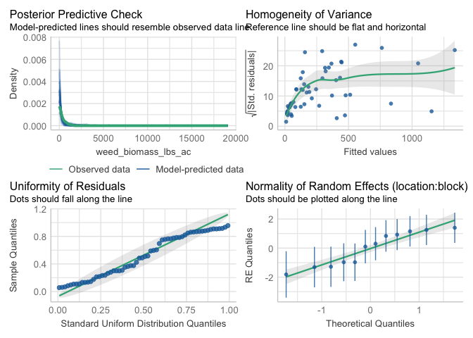
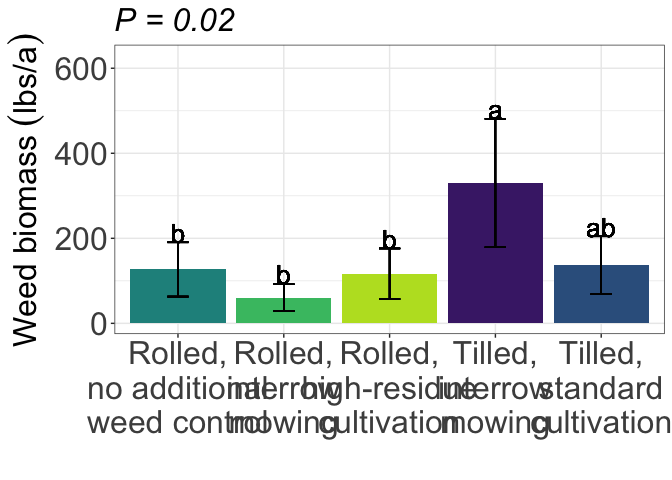
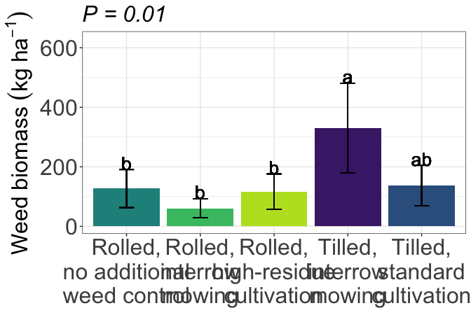

Weed biomass
================

# Load libraries

``` r
#Set work directory
setwd("/Users/ey239/Github/Mowtivation/rmarkdowns")

#Load packages 
library(tidyverse) ##install.packages("tidyverse")
library(knitr)
library(patchwork) ##install.packages("patchwork")
library(skimr)     ##install.packages("skimr")
library(readxl)
library(janitor) ##install.packages("janitor")

library(kableExtra) ##install.packages("kableExtra")
library(webshot) ##install.packages("webshot")
webshot::install_phantomjs()
library(viridis) ##install.packages("viridis")
library(lme4) ##install.packages("lme4")
library(lmerTest) ##install.packages("lmerTest")
library(emmeans) ##install.packages("emmeans")
library(rstatix) ##install.packages("rstatix")
#library(Matrix) ##install.packages("Matrix")
library(multcomp) ##install.packages("multcomp")
library(multcompView) ##install.packages("multcompView")
library(ggResidpanel) ##install.packages("ggResidpanel")
#library(car)
#library(TMB)  ##install.packages("TMB")
library(glmmTMB)  ##install.packages("glmmTMB")
library(DHARMa)  ##install.packages("DHARMa")
library(performance) ##install.packages("performance")

#Load Functions
MeanPlusSe<-function(x) mean(x)+plotrix::std.error(x)

find_logw0=function(x){c=trunc(log(min(x[x>0],na.rm=T)))
d=exp(c)
return(d)}
```

<br>

# Load and clean data

## Load data

``` r
combined_raw <- read_excel("~/Github/Mowtivation/raw-data/All Treatments/combined_raw.xlsx")
kable(head(combined_raw))
```

| id | location | year | treatment | block | plot | bean_emergence | bean_biomass | intrarow_weed_biomass | interrow_weed_biomass | weed_biomass | bean_population | bean_yield | seed_weight |
|:---|:---|---:|:---|---:|---:|---:|---:|---:|---:|---:|---:|---:|---:|
| CU_B1_P101 | field x | 2023 | TIM | 1 | 101 | 46.5 | 223.740 | 19.000 | 44.490 | 63.490 | 34.5 | 417.21 | 17.1200 |
| CU_B1_P102 | field x | 2023 | TIC | 1 | 102 | 42.5 | 267.460 | 30.975 | 0.720 | 31.695 | 39.5 | 565.54 | 17.4750 |
| CU_B1_P103 | field x | 2023 | RIM | 1 | 103 | 36.5 | 217.890 | 0.950 | 6.890 | 7.840 | 37.5 | 449.93 | 16.7525 |
| CU_B1_P104 | field x | 2023 | RNO | 1 | 104 | 41.0 | 207.675 | 0.660 | 45.735 | 46.395 | 35.0 | 412.59 | 16.1450 |
| CU_B1_P105 | field x | 2023 | RIC | 1 | 105 | 41.0 | 230.285 | 0.495 | 22.025 | 22.520 | 39.0 | 473.79 | 17.0475 |
| CU_B1_P201 | field x | 2023 | RIC | 2 | 201 | 36.5 | 208.105 | 6.395 | 19.460 | 25.855 | 33.5 | 484.04 | 17.1500 |

\##Clean data

``` r
#Standardaze column names, convert to factors, check for outliers of variable**
clean_combined <- clean_names(combined_raw) |>  
  rename ('weed_control'= treatment) |> 
  mutate(across(c(weed_control, block, plot, location, year), as.factor)) #|> 
  #mutate(is_outlier = totwbm < (quantile(totwbm, 0.25) - 1.5 * IQR(totwbm)) |
                       #wbm > (quantile(totwbm, 0.75) + 1.5 * IQR(totwbm)))

#select and convert data for wbm analysis
weed_biomass_clean <-clean_combined |> 
  mutate(log_weed_biomass_grams_meter=  (log((weed_biomass*2)+1)))|>
  mutate(weed_biomass_grams_meter = (weed_biomass /0.5)) |> 
  mutate(weed_biomass_kg_ha = (weed_biomass_grams_meter *(10000))/(1000)) |>
  mutate(weed_biomass_lbs_ac = ((weed_biomass_grams_meter *(10000))/(1000))* 0.892179)
kable(head(weed_biomass_clean)) 
```

| id | location | year | weed_control | block | plot | bean_emergence | bean_biomass | intrarow_weed_biomass | interrow_weed_biomass | weed_biomass | bean_population | bean_yield | seed_weight | log_weed_biomass_grams_meter | weed_biomass_grams_meter | weed_biomass_kg_ha | weed_biomass_lbs_ac |
|:---|:---|:---|:---|:---|:---|---:|---:|---:|---:|---:|---:|---:|---:|---:|---:|---:|---:|
| CU_B1_P101 | field x | 2023 | TIM | 1 | 101 | 46.5 | 223.740 | 19.000 | 44.490 | 63.490 | 34.5 | 417.21 | 17.1200 | 4.851874 | 126.98 | 1269.8 | 1132.8889 |
| CU_B1_P102 | field x | 2023 | TIC | 1 | 102 | 42.5 | 267.460 | 30.975 | 0.720 | 31.695 | 39.5 | 565.54 | 17.4750 | 4.164958 | 63.39 | 633.9 | 565.5523 |
| CU_B1_P103 | field x | 2023 | RIM | 1 | 103 | 36.5 | 217.890 | 0.950 | 6.890 | 7.840 | 37.5 | 449.93 | 16.7525 | 2.814210 | 15.68 | 156.8 | 139.8937 |
| CU_B1_P104 | field x | 2023 | RNO | 1 | 104 | 41.0 | 207.675 | 0.660 | 45.735 | 46.395 | 35.0 | 412.59 | 16.1450 | 4.541058 | 92.79 | 927.9 | 827.8529 |
| CU_B1_P105 | field x | 2023 | RIC | 1 | 105 | 41.0 | 230.285 | 0.495 | 22.025 | 22.520 | 39.0 | 473.79 | 17.0475 | 3.829511 | 45.04 | 450.4 | 401.8374 |
| CU_B1_P201 | field x | 2023 | RIC | 2 | 201 | 36.5 | 208.105 | 6.395 | 19.460 | 25.855 | 33.5 | 484.04 | 17.1500 | 3.964805 | 51.71 | 517.1 | 461.3458 |

<br> \# Model testing

Block is random Tyler is under the impression that block should always
be random and that post-hoc comparisons should use TUKEY rather the
Fischer. Fisher is bogus apparently.

\#GLMM

``` r
model_tweedie_log <- glmmTMB(weed_biomass_lbs_ac ~  weed_control + (1|location:block), 
  data = weed_biomass_clean, 
  family = tweedie(link = "log")

)

### Two checks specifically for a generalize linear approach
simulateResiduals(model_tweedie_log,plot = TRUE) # Residuals and normality look good
```

<!-- -->

    ## Object of Class DHARMa with simulated residuals based on 250 simulations with refit = FALSE . See ?DHARMa::simulateResiduals for help. 
    ##  
    ## Scaled residual values: 0.86 0.868 0.796 0.932 0.848 0.88 0.82 0.916 0.956 0.764 0.764 0.908 0.9 0.696 0.424 0.776 0.756 0.872 0.876 0.888 ...

``` r
check_model(model_tweedie_log) #Perfect, preditions match real data
```

    ## `check_outliers()` does not yet support models of class `glmmTMB`.

<!-- -->

``` r
summary(model_tweedie_log )
```

    ##  Family: tweedie  ( log )
    ## Formula:          weed_biomass_lbs_ac ~ weed_control + (1 | location:block)
    ## Data: weed_biomass_clean
    ## 
    ##      AIC      BIC   logLik deviance df.resid 
    ##    717.1    733.9   -350.6    701.1       52 
    ## 
    ## Random effects:
    ## 
    ## Conditional model:
    ##  Groups         Name        Variance Std.Dev.
    ##  location:block (Intercept) 1.502    1.226   
    ## Number of obs: 60, groups:  location:block, 12
    ## 
    ## Dispersion parameter for tweedie family (): 6.26 
    ## 
    ## Conditional model:
    ##                 Estimate Std. Error z value Pr(>|z|)    
    ## (Intercept)      4.75953    0.50946   9.342   <2e-16 ***
    ## weed_controlRIM -0.65624    0.50652  -1.296   0.1951    
    ## weed_controlRNO  0.08289    0.48464   0.171   0.8642    
    ## weed_controlTIC  0.15797    0.47697   0.331   0.7405    
    ## weed_controlTIM  1.03975    0.46986   2.213   0.0269 *  
    ## ---
    ## Signif. codes:  0 '***' 0.001 '**' 0.01 '*' 0.05 '.' 0.1 ' ' 1

``` r
VarCorr(model_tweedie_log )
```

    ## 
    ## Conditional model:
    ##  Groups         Name        Std.Dev.
    ##  location:block (Intercept) 1.2256

#### Joint test (anova)

``` r
model_tweedie_log |> 
  joint_tests() |> 
  kable()  
```

| model term   | df1 | df2 | F.ratio |  Chisq |   p.value |
|:-------------|----:|----:|--------:|-------:|----------:|
| weed_control |   4 | Inf |   3.313 | 13.252 | 0.0101034 |

``` r
options(contrasts = c("contr.sum", "contr.poly"))
Anova(model_tweedie_log, type = 3)
```

    ## Analysis of Deviance Table (Type III Wald chisquare tests)
    ## 
    ## Response: weed_biomass_lbs_ac
    ##               Chisq Df Pr(>Chisq)    
    ## (Intercept)  87.279  1     <2e-16 ***
    ## weed_control 13.253  4     0.0101 *  
    ## ---
    ## Signif. codes:  0 '***' 0.001 '**' 0.01 '*' 0.05 '.' 0.1 ' ' 1

<br>

## Fisher compact letter display

### Weed-control (S)

``` r
cld_weed_control_fisher <-cld(emmeans(model_tweedie_log, ~  weed_control, type = "response"), Letters = letters,adjust = "none", sort = TRUE, reversed=TRUE)
cld_weed_control_fisher
```

    ##  weed_control response    SE  df asymp.LCL asymp.UCL .group
    ##  TIM             330.1 151.0 Inf     134.6       809  a    
    ##  TIC             136.7  68.0 Inf      51.5       363  ab   
    ##  RNO             126.8  63.8 Inf      47.3       340   b   
    ##  RIC             116.7  59.4 Inf      43.0       317   b   
    ##  RIM              60.5  31.4 Inf      21.9       168   b   
    ## 
    ## Confidence level used: 0.95 
    ## Intervals are back-transformed from the log scale 
    ## Tests are performed on the log scale 
    ## significance level used: alpha = 0.05 
    ## NOTE: If two or more means share the same grouping symbol,
    ##       then we cannot show them to be different.
    ##       But we also did not show them to be the same.

### Location (Significant)

# Figures

\###lbs/a \#### Weed-control (S)

``` r
weed_biomass_clean |> 
  left_join(cld_weed_control_fisher) |> 
  ggplot(aes(x = factor(weed_control, levels = c("RNO", "RIM", "RIC", "TIM", "TIC")), y = response, fill = weed_control)) +
  #stat_summary(geom = "bar", fun = "mean", width = 0.7) +
  #stat_summary(geom = "errorbar", fun.data = "mean_se", width = 0.2) +
  #stat_summary(geom="text", fun = "MeanPlusSe", aes(label= trimws(.group)),size=6.5,vjust=-0.5) +
  geom_bar(stat="identity", position=position_dodge()) + 
  geom_errorbar(aes(ymin=response-SE, ymax=response+SE), width=.2,
                 position=position_dodge(.9))+
geom_text(aes(label = trimws(.group), y = response + (SE + 23)), size = 7) +
  labs(
    x = "",
     y = expression("Weed biomass" ~ (lbs * "/" * a)),
    #title = str_c("Influence of interrow weed control on weed biomass"),
    subtitle = expression(italic("P = 0.02"))) +
  
  scale_x_discrete(labels = c("Rolled,\nno additional\nweed control",
                              "Rolled,\ninterrow\nmowing",
                              "Rolled,\nhigh-residue\ncultivation",
                              "Tilled,\ninterrow\nmowing",
                          "Tilled,\nstandard\ncultivation")) +
  scale_y_continuous(expand = expansion(mult = c(0.05, 0.3))) +
  scale_fill_viridis(discrete = TRUE, option = "D", direction = -1, end = 0.9, begin = 0.1) +
   theme_bw() +
  theme(
    legend.position = "none",
    strip.background = element_blank(),
    strip.text = element_text(face = "bold", size = 12),
    axis.title = element_text(size = 24),  # Increase font size of axis titles
    axis.text = element_text(size = 24),   # Increase font size of axis labels
    plot.title = element_text(size = 24, face = "bold"),  # Increase font size of title
    plot.subtitle = element_text(size = 24, face = "italic")  # Increase font size of subtitle
  
  )
```

<!-- -->

``` r
ggsave("weed_biomass_weed_control_lbsacre.png", width = 10, height = 8, dpi = 300)
```

\###Kg/hectare \#### Weed-control (S)

``` r
weed_biomass_clean |> 
  left_join(cld_weed_control_fisher) |> 
  ggplot(aes(x = factor(weed_control, levels = c("RNO", "RIM", "RIC", "TIM", "TIC")), y = response, fill = weed_control)) +
  #stat_summary(geom = "bar", fun = "mean", width = 0.7) +
  #stat_summary(geom = "errorbar", fun.data = "mean_se", width = 0.2) +
  #stat_summary(geom="text", fun = "MeanPlusSe", aes(label= trimws(.group)),size=6.5,vjust=-0.5) +
  geom_bar(stat="identity", position=position_dodge()) + 
  geom_errorbar(aes(ymin=response-SE, ymax=response+SE), width=.2,
                 position=position_dodge(.9))+
geom_text(aes(label = trimws(.group), y = response + (SE + 23)), size = 7) +
  labs(
    x = "",
      y = expression("Weed biomass" ~ (kg ~ ha^{-1})),
    #title = str_c("Influence of interrow weed control on weed biomass"),
    subtitle = expression(italic("P = 0.01"))) +
  
  scale_x_discrete(labels = c("Rolled,\nno additional\nweed control",
                              "Rolled,\ninterrow\nmowing",
                              "Rolled,\nhigh-residue\ncultivation",
                              "Tilled,\ninterrow\nmowing",
                          "Tilled,\nstandard\ncultivation")) +
  scale_y_continuous(expand = expansion(mult = c(0.05, 0.3))) +
  scale_fill_viridis(discrete = TRUE, option = "D", direction = -1, end = 0.9, begin = 0.1) +
   theme_bw() +
  theme(
    legend.position = "none",
    strip.background = element_blank(),
    strip.text = element_text(face = "bold", size = 12),
    axis.title = element_text(size = 24),  # Increase font size of axis titles
    axis.text = element_text(size = 24),   # Increase font size of axis labels
    plot.title = element_text(size = 24, face = "bold"),  # Increase font size of title
    plot.subtitle = element_text(size = 24, face = "italic")  # Increase font size of subtitle
  
  )
```

<!-- -->

``` r
ggsave("weed_biomass_weed_control_kgha.png", width = 10, height = 8, dpi = 300)
```
