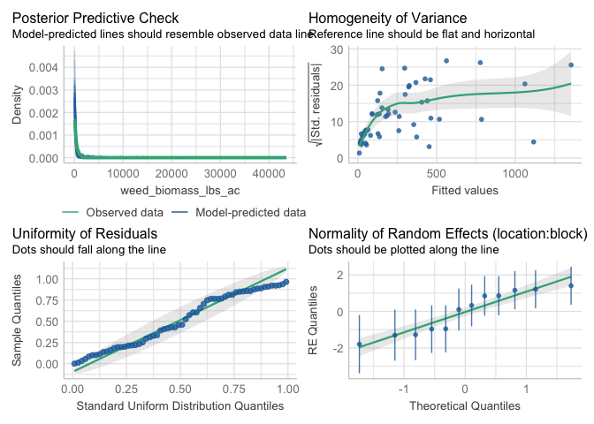

Weed biomass
================

# Load libraries

``` r
#Set work directory
setwd("/Users/ey239/Github/Mowtivation/rmarkdowns")

#Load packages 
library(tidyverse) ##install.packages("tidyverse")
library(knitr)
library(patchwork) ##install.packages("patchwork")
library(skimr)     ##install.packages("skimr")
library(readxl)
library(janitor) ##install.packages("janitor")

library(kableExtra) ##install.packages("kableExtra")
library(webshot) ##install.packages("webshot")
webshot::install_phantomjs()
library(viridis) ##install.packages("viridis")
library(lme4) ##install.packages("lme4")
library(lmerTest) ##install.packages("lmerTest")
library(emmeans) ##install.packages("emmeans")
library(rstatix) ##install.packages("rstatix")
#library(Matrix) ##install.packages("Matrix")
library(multcomp) ##install.packages("multcomp")
library(multcompView) ##install.packages("multcompView")
library(ggResidpanel) ##install.packages("ggResidpanel")
#library(car)
#library(TMB)  ##install.packages("TMB")
library(glmmTMB)  ##install.packages("glmmTMB")
library(DHARMa)  ##install.packages("DHARMa")
library(performance) ##install.packages("performance")

#Load Functions
MeanPlusSe<-function(x) mean(x)+plotrix::std.error(x)

find_logw0=function(x){c=trunc(log(min(x[x>0],na.rm=T)))
d=exp(c)
return(d)}
```

<br>

# Load and clean data

## Load data

``` r
combined_raw <- read_excel("~/Github/Mowtivation/raw-data/All Treatments/combined_raw.xlsx")
kable(head(combined_raw))
```

| id | location | year | treatment | block | plot | bean_emergence | bean_biomass | intrarow_weed_biomass | interrow_weed_biomass | weed_biomass | bean_population | bean_yield | seed_weight |
|:---|:---|---:|:---|---:|---:|---:|---:|---:|---:|---:|:---|:---|:---|
| CU_B1_P101 | field x | 2023 | TIM | 1 | 101 | 46.5 | 223.740 | 19.000 | 44.490 | 63.490 | 34.5 | 417.21 | 17.119999999999997 |
| CU_B1_P102 | field x | 2023 | TIC | 1 | 102 | 42.5 | 267.460 | 30.975 | 0.720 | 31.695 | 39.5 | 565.54 | 17.475000000000001 |
| CU_B1_P103 | field x | 2023 | RIM | 1 | 103 | 36.5 | 217.890 | 0.950 | 6.890 | 3.920 | 37.5 | 449.93 | 16.752499999999998 |
| CU_B1_P104 | field x | 2023 | RNO | 1 | 104 | 41.0 | 207.675 | 0.660 | 45.735 | 46.395 | 35 | 412.59 | 16.145 |
| CU_B1_P105 | field x | 2023 | RIC | 1 | 105 | 41.0 | 230.285 | 0.495 | 22.025 | 22.520 | 39 | 473.79 | 17.047499999999999 |
| CU_B1_P201 | field x | 2023 | RIC | 2 | 201 | 36.5 | 208.105 | 6.395 | 19.460 | 25.855 | 33.5 | 484.04 | 17.149999999999999 |

\##Clean data

``` r
#Standardaze column names, convert to factors, check for outliers of variable**
clean_combined <- clean_names(combined_raw) |>  
  rename ('weed_control'= treatment) |> 
  mutate(across(c(weed_control, block, plot, location, year), as.factor)) #|> 
  #mutate(is_outlier = totwbm < (quantile(totwbm, 0.25) - 1.5 * IQR(totwbm)) |
                       #wbm > (quantile(totwbm, 0.75) + 1.5 * IQR(totwbm)))

#select and convert data for wbm analysis
weed_biomass_clean <-clean_combined |> 
  mutate(log_weed_biomass_grams_meter=  (log((weed_biomass*2)+1)))|>
  mutate(weed_biomass_grams_meter = (weed_biomass * 2)) |> 
  mutate(weed_biomass_kg_ha = ((weed_biomass/0.5) *(10000))/(1000)) |>
  mutate(weed_biomass_lbs_ac = (((weed_biomass/0.5) *(10000))/(1000))* 0.892179)
kable(head(weed_biomass_clean)) 
```

| id | location | year | weed_control | block | plot | bean_emergence | bean_biomass | intrarow_weed_biomass | interrow_weed_biomass | weed_biomass | bean_population | bean_yield | seed_weight | log_weed_biomass_grams_meter | weed_biomass_grams_meter | weed_biomass_kg_ha | weed_biomass_lbs_ac |
|:---|:---|:---|:---|:---|:---|---:|---:|---:|---:|---:|:---|:---|:---|---:|---:|---:|---:|
| CU_B1_P101 | field x | 2023 | TIM | 1 | 101 | 46.5 | 223.740 | 19.000 | 44.490 | 63.490 | 34.5 | 417.21 | 17.119999999999997 | 4.851874 | 126.98 | 1269.8 | 1132.88889 |
| CU_B1_P102 | field x | 2023 | TIC | 1 | 102 | 42.5 | 267.460 | 30.975 | 0.720 | 31.695 | 39.5 | 565.54 | 17.475000000000001 | 4.164958 | 63.39 | 633.9 | 565.55227 |
| CU_B1_P103 | field x | 2023 | RIM | 1 | 103 | 36.5 | 217.890 | 0.950 | 6.890 | 3.920 | 37.5 | 449.93 | 16.752499999999998 | 2.179287 | 7.84 | 78.4 | 69.94683 |
| CU_B1_P104 | field x | 2023 | RNO | 1 | 104 | 41.0 | 207.675 | 0.660 | 45.735 | 46.395 | 35 | 412.59 | 16.145 | 4.541058 | 92.79 | 927.9 | 827.85289 |
| CU_B1_P105 | field x | 2023 | RIC | 1 | 105 | 41.0 | 230.285 | 0.495 | 22.025 | 22.520 | 39 | 473.79 | 17.047499999999999 | 3.829511 | 45.04 | 450.4 | 401.83742 |
| CU_B1_P201 | field x | 2023 | RIC | 2 | 201 | 36.5 | 208.105 | 6.395 | 19.460 | 25.855 | 33.5 | 484.04 | 17.149999999999999 | 3.964805 | 51.71 | 517.1 | 461.34576 |

<br> \# Model testing

Block is random Tyler is under the impression that block should always
be random and that post-hoc comparisons should use TUKEY rather the
Fischer. Fisher is bogus apparently.

## Lmer

\###lb_ac

``` r
random <- lmer(weed_biomass_lbs_ac  ~ location+weed_control + location:weed_control +(1|location:block) , data = weed_biomass_clean)

resid_panel(random)
```

<!-- --> \####
Summary

``` r
summary(random)
```

    ## Linear mixed model fit by REML. t-tests use Satterthwaite's method [
    ## lmerModLmerTest]
    ## Formula: 
    ## weed_biomass_lbs_ac ~ location + weed_control + location:weed_control +  
    ##     (1 | location:block)
    ##    Data: weed_biomass_clean
    ## 
    ## REML criterion at convergence: 629.4
    ## 
    ## Scaled residuals: 
    ##      Min       1Q   Median       3Q      Max 
    ## -1.50265 -0.50660 -0.09458  0.22898  2.74794 
    ## 
    ## Random effects:
    ##  Groups         Name        Variance Std.Dev.
    ##  location:block (Intercept)  1712     41.38  
    ##  Residual                   42180    205.38  
    ## Number of obs: 60, groups:  location:block, 12
    ## 
    ## Fixed effects:
    ##                                       Estimate Std. Error      df t value
    ## (Intercept)                               2.03     104.75   44.73   0.019
    ## locationfield O2 west                   240.87     148.14   44.73   1.626
    ## locationfield x                         377.95     148.14   44.73   2.551
    ## weed_controlRIM                          19.58     145.22   36.00   0.135
    ## weed_controlRNO                         109.27     145.22   36.00   0.752
    ## weed_controlTIC                          81.59     145.22   36.00   0.562
    ## weed_controlTIM                         116.50     145.22   36.00   0.802
    ## locationfield O2 west:weed_controlRIM  -184.17     205.38   36.00  -0.897
    ## locationfield x:weed_controlRIM        -187.09     205.38   36.00  -0.911
    ## locationfield O2 west:weed_controlRNO  -131.62     205.38   36.00  -0.641
    ## locationfield x:weed_controlRNO        -114.94     205.38   36.00  -0.560
    ## locationfield O2 west:weed_controlTIC  -313.65     205.38   36.00  -1.527
    ## locationfield x:weed_controlTIC         300.11     205.38   36.00   1.461
    ## locationfield O2 west:weed_controlTIM  -185.42     205.38   36.00  -0.903
    ## locationfield x:weed_controlTIM         560.18     205.38   36.00   2.728
    ##                                       Pr(>|t|)   
    ## (Intercept)                             0.9846   
    ## locationfield O2 west                   0.1110   
    ## locationfield x                         0.0142 * 
    ## weed_controlRIM                         0.8935   
    ## weed_controlRNO                         0.4567   
    ## weed_controlTIC                         0.5777   
    ## weed_controlTIM                         0.4277   
    ## locationfield O2 west:weed_controlRIM   0.3758   
    ## locationfield x:weed_controlRIM         0.3684   
    ## locationfield O2 west:weed_controlRNO   0.5257   
    ## locationfield x:weed_controlRNO         0.5792   
    ## locationfield O2 west:weed_controlTIC   0.1355   
    ## locationfield x:weed_controlTIC         0.1526   
    ## locationfield O2 west:weed_controlTIM   0.3726   
    ## locationfield x:weed_controlTIM         0.0098 **
    ## ---
    ## Signif. codes:  0 '***' 0.001 '**' 0.01 '*' 0.05 '.' 0.1 ' ' 1

    ## 
    ## Correlation matrix not shown by default, as p = 15 > 12.
    ## Use print(x, correlation=TRUE)  or
    ##     vcov(x)        if you need it

``` r
weed_biomass_clean |> count(year,location,weed_control)
```

    ## # A tibble: 15 × 4
    ##    year  location      weed_control     n
    ##    <fct> <fct>         <fct>        <int>
    ##  1 2023  field x       RIC              4
    ##  2 2023  field x       RIM              4
    ##  3 2023  field x       RNO              4
    ##  4 2023  field x       TIC              4
    ##  5 2023  field x       TIM              4
    ##  6 2024  field O2 east RIC              4
    ##  7 2024  field O2 east RIM              4
    ##  8 2024  field O2 east RNO              4
    ##  9 2024  field O2 east TIC              4
    ## 10 2024  field O2 east TIM              4
    ## 11 2024  field O2 west RIC              4
    ## 12 2024  field O2 west RIM              4
    ## 13 2024  field O2 west RNO              4
    ## 14 2024  field O2 west TIC              4
    ## 15 2024  field O2 west TIM              4

#### Joint test (anova)

``` r
random |> 
  joint_tests() |> 
  kable()  
```

|     | model term            | df1 | df2 | F.ratio |   p.value |
|:----|:----------------------|----:|----:|--------:|----------:|
| 1   | location              |   2 |   9 |  27.281 | 0.0001513 |
| 3   | weed_control          |   4 |  36 |   4.563 | 0.0043917 |
| 2   | location:weed_control |   8 |  36 |   3.938 | 0.0019773 |

<br>

\###log_g

``` r
random_log <- lmer(log_weed_biomass_grams_meter  ~ location+weed_control + location:weed_control +(1|location:block) , data = weed_biomass_clean)

resid_panel(random_log)
```

<!-- --> \####
Summary

``` r
summary(random_log)
```

    ## Linear mixed model fit by REML. t-tests use Satterthwaite's method [
    ## lmerModLmerTest]
    ## Formula: 
    ## log_weed_biomass_grams_meter ~ location + weed_control + location:weed_control +  
    ##     (1 | location:block)
    ##    Data: weed_biomass_clean
    ## 
    ## REML criterion at convergence: 165.7
    ## 
    ## Scaled residuals: 
    ##      Min       1Q   Median       3Q      Max 
    ## -1.83272 -0.46178  0.01824  0.26626  1.92755 
    ## 
    ## Random effects:
    ##  Groups         Name        Variance Std.Dev.
    ##  location:block (Intercept) 0.3147   0.561   
    ##  Residual                   1.2433   1.115   
    ## Number of obs: 60, groups:  location:block, 12
    ## 
    ## Fixed effects:
    ##                                       Estimate Std. Error      df t value
    ## (Intercept)                             0.1853     0.6241 38.6861   0.297
    ## locationfield O2 west                   1.7879     0.8826 38.6861   2.026
    ## locationfield x                         3.5750     0.8826 38.6861   4.050
    ## weed_controlRIM                         0.8302     0.7884 36.0000   1.053
    ## weed_controlRNO                         1.1745     0.7884 36.0000   1.490
    ## weed_controlTIC                         1.1172     0.7884 36.0000   1.417
    ## weed_controlTIM                         1.8608     0.7884 36.0000   2.360
    ## locationfield O2 west:weed_controlRIM  -1.3872     1.1150 36.0000  -1.244
    ## locationfield x:weed_controlRIM        -1.5773     1.1150 36.0000  -1.415
    ## locationfield O2 west:weed_controlRNO  -1.4278     1.1150 36.0000  -1.280
    ## locationfield x:weed_controlRNO        -1.6017     1.1150 36.0000  -1.436
    ## locationfield O2 west:weed_controlTIC  -2.5999     1.1150 36.0000  -2.332
    ## locationfield x:weed_controlTIC        -0.4597     1.1150 36.0000  -0.412
    ## locationfield O2 west:weed_controlTIM  -0.8955     1.1150 36.0000  -0.803
    ## locationfield x:weed_controlTIM        -0.8629     1.1150 36.0000  -0.774
    ##                                       Pr(>|t|)    
    ## (Intercept)                           0.768076    
    ## locationfield O2 west                 0.049740 *  
    ## locationfield x                       0.000238 ***
    ## weed_controlRIM                       0.299394    
    ## weed_controlRNO                       0.145029    
    ## weed_controlTIC                       0.165086    
    ## weed_controlTIM                       0.023813 *  
    ## locationfield O2 west:weed_controlRIM 0.221524    
    ## locationfield x:weed_controlRIM       0.165793    
    ## locationfield O2 west:weed_controlRNO 0.208566    
    ## locationfield x:weed_controlRNO       0.159510    
    ## locationfield O2 west:weed_controlTIC 0.025432 *  
    ## locationfield x:weed_controlTIC       0.682603    
    ## locationfield O2 west:weed_controlTIM 0.427206    
    ## locationfield x:weed_controlTIM       0.444066    
    ## ---
    ## Signif. codes:  0 '***' 0.001 '**' 0.01 '*' 0.05 '.' 0.1 ' ' 1

    ## 
    ## Correlation matrix not shown by default, as p = 15 > 12.
    ## Use print(x, correlation=TRUE)  or
    ##     vcov(x)        if you need it

``` r
weed_biomass_clean |> count(year,location,weed_control)
```

    ## # A tibble: 15 × 4
    ##    year  location      weed_control     n
    ##    <fct> <fct>         <fct>        <int>
    ##  1 2023  field x       RIC              4
    ##  2 2023  field x       RIM              4
    ##  3 2023  field x       RNO              4
    ##  4 2023  field x       TIC              4
    ##  5 2023  field x       TIM              4
    ##  6 2024  field O2 east RIC              4
    ##  7 2024  field O2 east RIM              4
    ##  8 2024  field O2 east RNO              4
    ##  9 2024  field O2 east TIC              4
    ## 10 2024  field O2 east TIM              4
    ## 11 2024  field O2 west RIC              4
    ## 12 2024  field O2 west RIM              4
    ## 13 2024  field O2 west RNO              4
    ## 14 2024  field O2 west TIC              4
    ## 15 2024  field O2 west TIM              4

#### Joint test (anova)

``` r
random_log |> 
  joint_tests() |> 
  kable()  
```

|     | model term            | df1 | df2 | F.ratio |   p.value |
|:----|:----------------------|----:|----:|--------:|----------:|
| 1   | location              |   2 |   9 |  14.257 | 0.0016226 |
| 3   | weed_control          |   4 |  36 |   3.152 | 0.0254934 |
| 2   | location:weed_control |   8 |  36 |   1.275 | 0.2869980 |

<br>

## Means comparison

### Weed-control (S)

``` r
means_weed_control <- emmeans(random, ~  weed_control)
pairwise_comparisons_weed_control<- pairs(means_weed_control) 
kable(head(pairwise_comparisons_weed_control))
```

| contrast  |   estimate |       SE |  df |    t.ratio |   p.value |
|:----------|-----------:|---------:|----:|-----------:|----------:|
| RIC - RIM |  104.16933 | 83.84484 |  36 |  1.2424060 | 0.7784467 |
| RIC - RNO |  -27.08507 | 83.84484 |  36 | -0.3230380 | 0.9997472 |
| RIC - TIC |  -77.07683 | 83.84484 |  36 | -0.9192793 | 0.9338602 |
| RIC - TIM | -241.41620 | 83.84484 |  36 | -2.8793208 | 0.0393548 |
| RIM - RNO | -131.25440 | 83.84484 |  36 | -1.5654439 | 0.5549704 |
| RIM - TIC | -181.24616 | 83.84484 |  36 | -2.1616853 | 0.2042768 |

<br>

### Weed-control (S)

``` r
means_weed_control_log <- emmeans(random_log, ~  weed_control)
pairwise_comparisons_weed_control_log<- pairs(means_weed_control_log) 
kable(head(pairwise_comparisons_weed_control_log))
```

| contrast  |   estimate |        SE |  df |    t.ratio |   p.value |
|:----------|-----------:|----------:|----:|-----------:|----------:|
| RIC - RIM |  0.1579664 | 0.4552117 |  36 |  0.3470174 | 0.9996177 |
| RIC - RNO | -0.1646817 | 0.4552117 |  36 | -0.3617694 | 0.9995144 |
| RIC - TIC | -0.0973703 | 0.4552117 |  36 | -0.2139011 | 0.9999774 |
| RIC - TIM | -1.2746642 | 0.4552117 |  36 | -2.8001569 | 0.0479855 |
| RIM - RNO | -0.3226481 | 0.4552117 |  36 | -0.7087869 | 0.9809088 |
| RIM - TIC | -0.2553367 | 0.4552117 |  36 | -0.5609185 | 0.9943785 |

<br>

### Location (S)

``` r
means_location <- emmeans(random, ~  location)
pairwise_comparisons_location<- pairs(means_location) 
kable(head(pairwise_comparisons_location))
```

| contrast                      |   estimate |      SE |  df |   t.ratio |   p.value |
|:------------------------------|-----------:|--------:|----:|----------:|----------:|
| field O2 east - field O2 west |  -77.89615 | 71.2328 |   9 | -1.093543 | 0.6607478 |
| field O2 east - field x       | -489.60107 | 71.2328 |   9 | -6.873253 | 0.0002184 |
| field O2 west - field x       | -411.70492 | 71.2328 |   9 | -5.779710 | 0.0007983 |

### Location\|weed-control (S)

``` r
means_weed_control_location <- emmeans(random, ~  weed_control|location)
pairwise_comparisons_weed_control_location<- pairs(means_weed_control_location) 
kable(head(pairwise_comparisons_weed_control_location))
```

| contrast  | location      |   estimate |       SE |  df |    t.ratio |   p.value |
|:----------|:--------------|-----------:|---------:|----:|-----------:|----------:|
| RIC - RIM | field O2 east |  -19.58333 | 145.2235 |  36 | -0.1348496 | 0.9999985 |
| RIC - RNO | field O2 east | -109.26962 | 145.2235 |  36 | -0.7524237 | 0.9742786 |
| RIC - TIC | field O2 east |  -81.58977 | 145.2235 |  36 | -0.5618220 | 0.9943296 |
| RIC - TIM | field O2 east | -116.49627 | 145.2235 |  36 | -0.8021859 | 0.9648682 |
| RIM - RNO | field O2 east |  -89.68629 | 145.2235 |  36 | -0.6175741 | 0.9906172 |
| RIM - TIC | field O2 east |  -62.00644 | 145.2235 |  36 | -0.4269724 | 0.9987535 |

<br>

## Tukey compact letter display

### Weed-control (S)

``` r
cld_weed_control_random_tukey <-cld(emmeans(random, ~  weed_control , type = "response"), Letters = letters, sort = TRUE, reversed=TRUE)
```

    ## NOTE: Results may be misleading due to involvement in interactions

``` r
cld_weed_control_random_tukey
```

    ##  weed_control emmean   SE   df lower.CL upper.CL .group
    ##  TIM             450 60.5 44.7    327.9      572  a    
    ##  TIC             285 60.5 44.7    163.5      407  ab   
    ##  RNO             235 60.5 44.7    113.6      357  ab   
    ##  RIC             208 60.5 44.7     86.5      330   b   
    ##  RIM             104 60.5 44.7    -17.7      226   b   
    ## 
    ## Results are averaged over the levels of: location 
    ## Degrees-of-freedom method: kenward-roger 
    ## Confidence level used: 0.95 
    ## P value adjustment: tukey method for comparing a family of 5 estimates 
    ## significance level used: alpha = 0.05 
    ## NOTE: If two or more means share the same grouping symbol,
    ##       then we cannot show them to be different.
    ##       But we also did not show them to be the same.

<br>

``` r
cld_weed_control_tukey_log <-cld(emmeans(random_log, ~  weed_control , type = "response"), Letters = letters, sort = TRUE, reversed=TRUE)
```

    ## NOTE: Results may be misleading due to involvement in interactions

``` r
cld_weed_control_tukey_log
```

    ##  weed_control emmean   SE   df lower.CL upper.CL .group
    ##  TIM            3.25 0.36 38.7     2.52     3.98  a    
    ##  RNO            2.14 0.36 38.7     1.41     2.87  ab   
    ##  TIC            2.07 0.36 38.7     1.34     2.80  ab   
    ##  RIC            1.97 0.36 38.7     1.24     2.70  ab   
    ##  RIM            1.81 0.36 38.7     1.09     2.54   b   
    ## 
    ## Results are averaged over the levels of: location 
    ## Degrees-of-freedom method: kenward-roger 
    ## Confidence level used: 0.95 
    ## P value adjustment: tukey method for comparing a family of 5 estimates 
    ## significance level used: alpha = 0.05 
    ## NOTE: If two or more means share the same grouping symbol,
    ##       then we cannot show them to be different.
    ##       But we also did not show them to be the same.

\#GLMM

``` r
model_tweedie_log <- glmmTMB(
weed_biomass_lbs_ac ~  weed_control + (1|location:block), 
  data = weed_biomass_clean, 
  family = tweedie(link = "log")

)
### Two checks specifically for a generalize linear approach
simulateResiduals(model_tweedie_log,plot = TRUE) # Residuals and normality look good
```

<!-- -->

    ## Object of Class DHARMa with simulated residuals based on 250 simulations with refit = FALSE . See ?DHARMa::simulateResiduals for help. 
    ##  
    ## Scaled residual values: 0.812 0.852 0.656 0.924 0.856 0.884 0.848 0.92 0.964 0.792 0.764 0.856 0.812 0.768 0.416 0.764 0.704 0.92 0.904 0.888 ...

``` r
check_model(model_tweedie_log) #Perfect, preditions match real data
```

    ## `check_outliers()` does not yet support models of class `glmmTMB`.

<!-- -->

``` r
summary(model_tweedie_log )
```

    ##  Family: tweedie  ( log )
    ## Formula:          weed_biomass_lbs_ac ~ weed_control + (1 | location:block)
    ## Data: weed_biomass_clean
    ## 
    ##      AIC      BIC   logLik deviance df.resid 
    ##    715.7    732.4   -349.8    699.7       52 
    ## 
    ## Random effects:
    ## 
    ## Conditional model:
    ##  Groups         Name        Variance Std.Dev.
    ##  location:block (Intercept) 1.481    1.217   
    ## Number of obs: 60, groups:  location:block, 12
    ## 
    ## Dispersion parameter for tweedie family (): 6.23 
    ## 
    ## Conditional model:
    ##                 Estimate Std. Error z value Pr(>|z|)    
    ## (Intercept)       4.7117     0.5111   9.218   <2e-16 ***
    ## weed_controlRIM  -0.6490     0.5131  -1.265   0.2059    
    ## weed_controlRNO   0.1336     0.4884   0.274   0.7844    
    ## weed_controlTIC   0.2168     0.4818   0.450   0.6527    
    ## weed_controlTIM   1.0949     0.4748   2.306   0.0211 *  
    ## ---
    ## Signif. codes:  0 '***' 0.001 '**' 0.01 '*' 0.05 '.' 0.1 ' ' 1

``` r
VarCorr(model_tweedie_log )
```

    ## 
    ## Conditional model:
    ##  Groups         Name        Std.Dev.
    ##  location:block (Intercept) 1.2168

``` r
model_tweedie_gaussian <- glmmTMB(
weed_biomass_lbs_ac ~  weed_control + (1|location:block), 
  data = weed_biomass_clean, 
  family = gaussian(),

)
### Two checks specifically for a generalize linear approach
simulateResiduals(model_tweedie_gaussian,plot = TRUE) # Residuals and normality look good
```

<!-- -->

    ## Object of Class DHARMa with simulated residuals based on 250 simulations with refit = FALSE . See ?DHARMa::simulateResiduals for help. 
    ##  
    ## Scaled residual values: 0.984 0.832 0.444 0.952 0.78 0.788 0.744 0.844 0.996 0.908 0.908 0.884 0.696 0.52 0.28 0.584 0.46 0.736 0.852 0.992 ...

``` r
check_model(model_tweedie_gaussian) #Perfect, preditions match real data
```

    ## `check_outliers()` does not yet support models of class `glmmTMB`.

<!-- -->

#### Joint test (anova)

``` r
model_tweedie_log |> 
  joint_tests() |> 
  kable()  
```

| model term   | df1 | df2 | F.ratio |  Chisq |   p.value |
|:-------------|----:|----:|--------:|-------:|----------:|
| weed_control |   4 | Inf |   3.453 | 13.812 | 0.0079204 |

``` r
options(contrasts = c("contr.sum", "contr.poly"))
Anova(model_tweedie_log, type = 3)
```

    ## Analysis of Deviance Table (Type III Wald chisquare tests)
    ## 
    ## Response: weed_biomass_lbs_ac
    ##               Chisq Df Pr(>Chisq)    
    ## (Intercept)  84.971  1    < 2e-16 ***
    ## weed_control 13.812  4    0.00792 ** 
    ## ---
    ## Signif. codes:  0 '***' 0.001 '**' 0.01 '*' 0.05 '.' 0.1 ' ' 1

<br>

## Fisher compact letter display

### Weed-control (S)

``` r
cld_weed_control_fisher <-cld(emmeans(model_tweedie_log, ~  weed_control, type = "response"), Letters = letters,adjust = "none", sort = TRUE, reversed=TRUE)
cld_weed_control_fisher
```

    ##  weed_control response    SE  df asymp.LCL asymp.UCL .group
    ##  TIM             332.5 152.0 Inf     135.9       813  a    
    ##  TIC             138.2  68.7 Inf      52.2       366  ab   
    ##  RNO             127.1  63.9 Inf      47.5       341   b   
    ##  RIC             111.2  56.9 Inf      40.8       303   b   
    ##  RIM              58.1  30.3 Inf      20.9       161   b   
    ## 
    ## Confidence level used: 0.95 
    ## Intervals are back-transformed from the log scale 
    ## Tests are performed on the log scale 
    ## significance level used: alpha = 0.05 
    ## NOTE: If two or more means share the same grouping symbol,
    ##       then we cannot show them to be different.
    ##       But we also did not show them to be the same.

### Location (Significant)

# Figures

## Weed-control (S)

``` r
weed_biomass_clean |> 
  left_join(cld_weed_control_fisher) |> 
  ggplot(aes(x = factor(weed_control, levels = c("RNO", "RIM", "RIC", "TIM", "TIC")), y = weed_biomass_lbs_ac, fill = weed_control)) +
  stat_summary(geom = "bar", fun = "mean", width = 0.7) +
  stat_summary(geom = "errorbar", fun.data = "mean_se", width = 0.2) +
  stat_summary(geom="text", fun = "MeanPlusSe", aes(label= trimws(.group)),size=6.5,vjust=-0.5) +
  labs(
    x = "Interrow weed control",
     y = expression("Weed biomass" ~ (lbs * "/" * a)),
    title = str_c("Influence of interrow weed control on weed biomass"),
    subtitle = expression(italic("P < 0.005"))) +
  
  scale_x_discrete(labels = c("Rolled,\nno additional\nweed control",
                              "Rolled,\ninterrow\nmowing",
                              "Rolled,\nhigh-residue\ncultivation",
                              "Tilled,\ninterrow\nmowing",
                          "Tilled,\nstandard\ncultivation")) +
  scale_y_continuous(expand = expansion(mult = c(0.05, 0.3))) +
  scale_fill_viridis(discrete = TRUE, option = "D", direction = -1, end = 0.9, begin = 0.1) +
   theme_bw() +
  theme(
    legend.position = "none",
    strip.background = element_blank(),
    strip.text = element_text(face = "bold", size = 12),
    axis.title = element_text(size = 20),  # Increase font size of axis titles
    axis.text = element_text(size = 16),   # Increase font size of axis labels
    plot.title = element_text(size = 22, face = "bold"),  # Increase font size of title
    plot.subtitle = element_text(size = 18, face = "italic")  # Increase font size of subtitle
  
  )
```

<!-- -->

``` r
ggsave("weed_biomass_weed_control_lbsacre.png", width = 10, height = 6, dpi = 300)
```
