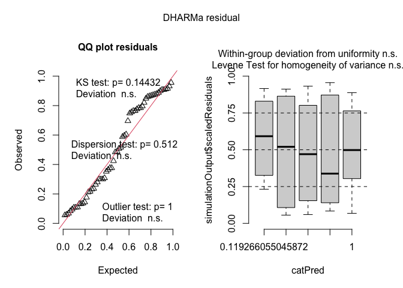
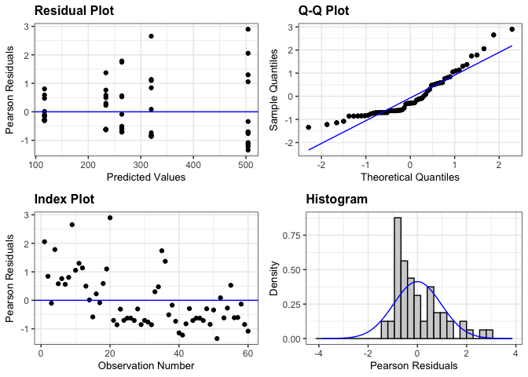
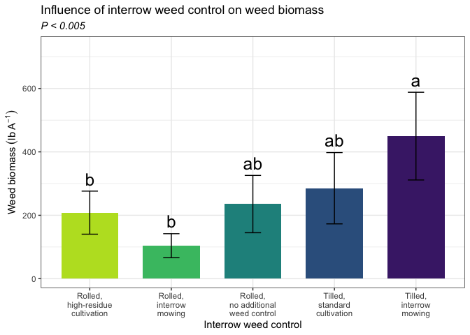

Weed biomass
================

# **Load libraries**

``` r
#Set work directory
setwd("/Users/ey239/Github/Mowtivation/rmarkdowns")

#Load packages 
library(tidyverse) ##install.packages("tidyverse")
library(knitr)
library(patchwork) ##install.packages("patchwork")
library(skimr)     ##install.packages("skimr")
library(readxl)
library(janitor) ##install.packages("janitor")

library(kableExtra) ##install.packages("kableExtra")
library(webshot) ##install.packages("webshot")
webshot::install_phantomjs()
library(viridis) ##install.packages("viridis")
library(lme4) ##install.packages("lme4")
library(lmerTest) ##install.packages("lmerTest")
library(emmeans) ##install.packages("emmeans")
library(rstatix) ##install.packages("rstatix")
#library(Matrix) ##install.packages("Matrix")
library(multcomp) ##install.packages("multcomp")
library(multcompView) ##install.packages("multcompView")
library(ggResidpanel) ##install.packages("ggResidpanel")
#library(car)
#library(TMB)  ##install.packages("TMB")
#library(glmmTMB)  ##install.packages("glmmTMB")
#library(DHARMa)  ##install.packages("DHARMa")

#Load Functions
MeanPlusSe<-function(x) mean(x)+plotrix::std.error(x)

find_logw0=function(x){c=trunc(log(min(x[x>0],na.rm=T)))
d=exp(c)
return(d)}
```

<br>

# **Load and Clean Data**

### **Load individual datasets**

``` r
combined_raw <- read_excel("~/Github/Mowtivation/raw-data/All Treatments/combined_raw.xlsx")
kable(head(combined_raw))
```

| id | location | year | treatment | block | plot | bean_emergence | bean_biomass | intrarow_weed_biomass | interrow_weed_biomass | weed_biomass | bean_population | bean_yield |
|:---|:---|---:|:---|---:|---:|---:|---:|---:|---:|---:|:---|:---|
| CU_B1_P101 | field x | 2023 | TIM | 1 | 101 | 46.5 | 223.740 | 19.000 | 44.490 | 63.490 | 34.5 | 417.21 |
| CU_B1_P102 | field x | 2023 | TIC | 1 | 102 | 42.5 | 267.460 | 30.975 | 0.720 | 31.695 | 39.5 | 565.54 |
| CU_B1_P103 | field x | 2023 | RIM | 1 | 103 | 36.5 | 217.890 | 0.950 | 6.890 | 3.920 | 37.5 | 449.93 |
| CU_B1_P104 | field x | 2023 | RNO | 1 | 104 | 41.0 | 207.675 | 0.660 | 45.735 | 46.395 | 35 | 412.59 |
| CU_B1_P105 | field x | 2023 | RIC | 1 | 105 | 41.0 | 230.285 | 0.495 | 22.025 | 22.520 | 39 | 473.79 |
| CU_B1_P201 | field x | 2023 | RIC | 2 | 201 | 36.5 | 208.105 | 6.395 | 19.460 | 25.855 | 33.5 | 484.04 |

``` r
#Standardaze column names, convert to factors, check for outliers of variable**
clean_combined <- clean_names(combined_raw) |>  
  rename ('weed_control'= treatment) |> 
  mutate(across(c(weed_control, block, plot, location, year), as.factor)) #|> 
  #mutate(is_outlier = totwbm < (quantile(totwbm, 0.25) - 1.5 * IQR(totwbm)) |
                       #wbm > (quantile(totwbm, 0.75) + 1.5 * IQR(totwbm)))

#select and convert data for wbm analysis
weed_biomass_clean <-clean_combined |>              
  mutate(weed_biomass_grams_meter = (weed_biomass * 2)) |> 
  mutate(weed_biomass_kg_ha = ((weed_biomass/0.5) *(10000))/(1000)) |>
  mutate(weed_biomass_lbs_ac = (((weed_biomass/0.5) *(10000))/(1000))* 0.892179)
kable(head(weed_biomass_clean)) 
```

| id | location | year | weed_control | block | plot | bean_emergence | bean_biomass | intrarow_weed_biomass | interrow_weed_biomass | weed_biomass | bean_population | bean_yield | weed_biomass_grams_meter | weed_biomass_kg_ha | weed_biomass_lbs_ac |
|:---|:---|:---|:---|:---|:---|---:|---:|---:|---:|---:|:---|:---|---:|---:|---:|
| CU_B1_P101 | field x | 2023 | TIM | 1 | 101 | 46.5 | 223.740 | 19.000 | 44.490 | 63.490 | 34.5 | 417.21 | 126.98 | 1269.8 | 1132.88889 |
| CU_B1_P102 | field x | 2023 | TIC | 1 | 102 | 42.5 | 267.460 | 30.975 | 0.720 | 31.695 | 39.5 | 565.54 | 63.39 | 633.9 | 565.55227 |
| CU_B1_P103 | field x | 2023 | RIM | 1 | 103 | 36.5 | 217.890 | 0.950 | 6.890 | 3.920 | 37.5 | 449.93 | 7.84 | 78.4 | 69.94683 |
| CU_B1_P104 | field x | 2023 | RNO | 1 | 104 | 41.0 | 207.675 | 0.660 | 45.735 | 46.395 | 35 | 412.59 | 92.79 | 927.9 | 827.85289 |
| CU_B1_P105 | field x | 2023 | RIC | 1 | 105 | 41.0 | 230.285 | 0.495 | 22.025 | 22.520 | 39 | 473.79 | 45.04 | 450.4 | 401.83742 |
| CU_B1_P201 | field x | 2023 | RIC | 2 | 201 | 36.5 | 208.105 | 6.395 | 19.460 | 25.855 | 33.5 | 484.04 | 51.71 | 517.1 | 461.34576 |

<br> \### **block is fixed** \#Ask tyler about model format, should
block always be fixed, etc. should location be nested in year? Do i need
to transform data if zeros are present? How to separate year from
location?

``` r
fixed <- lmer(weed_biomass_kg_ha  ~ location*weed_control + block 
                     +(1 | year/location) , data = weed_biomass_clean)
```

    ## Warning in as_lmerModLT(model, devfun): Model may not have converged with 2
    ## eigenvalues close to zero: 2.0e-09 1.0e-09

``` r
resid_panel(fixed)
```

<!-- --> \###
**block is random**

``` r
random <- lmer(weed_biomass_kg_ha  ~ weed_control + (1|block)  , data = weed_biomass_clean)
```

    ## boundary (singular) fit: see help('isSingular')

``` r
resid_panel(random)
```

<!-- -->

\##**Joint test**

``` r
fixed |> 
  joint_tests() |> 
  kable()  
```

|     | model term            | df1 |      df2 | F.ratio |   p.value |
|:----|:----------------------|----:|---------:|--------:|----------:|
| 1   | location              |   2 | 776767.1 |   0.161 | 0.8516331 |
| 3   | weed_control          |   4 |     42.0 |   4.181 | 0.0061225 |
| 4   | block                 |   3 |     42.0 |   0.303 | 0.8227344 |
| 2   | location:weed_control |   8 |     42.0 |   3.609 | 0.0028349 |

<br>

# **Means comparison of totwbm**

``` r
means <- 
 emmeans(fixed, ~  weed_control)
# Optional: Adjust for multiple comparisons (e.g., using Tukey's method)

pairwise_comparisons<- pairs(means) 
kable(head(pairwise_comparisons))
```

| contrast  |   estimate |      SE |  df |    t.ratio |   p.value |
|:----------|-----------:|--------:|----:|-----------:|----------:|
| RIC - RIM |  116.75833 | 98.1727 |  42 |  1.1893157 | 0.8088102 |
| RIC - RNO |  -30.35833 | 98.1727 |  42 | -0.3092340 | 0.9998025 |
| RIC - TIC |  -86.39167 | 98.1727 |  42 | -0.8799969 | 0.9452934 |
| RIC - TIM | -270.59167 | 98.1727 |  42 | -2.7562823 | 0.0505728 |
| RIM - RNO | -147.11667 | 98.1727 |  42 | -1.4985497 | 0.5995633 |
| RIM - TIC | -203.15000 | 98.1727 |  42 | -2.0693126 | 0.2399844 |

### **Fisher’s method for comparing means**

``` r
#mowing
cld_weed_control_fisher <-cld(emmeans(fixed, ~  weed_control , type = "response"), Letters = letters, sort = TRUE, adjust="none", reversed=TRUE)
```

    ## NOTE: Results may be misleading due to involvement in interactions

``` r
cld_weed_control_fisher
```

    ##  weed_control emmean  SE    df lower.CL upper.CL .group
    ##  TIM             504 446 71338     -369     1378  a    
    ##  TIC             320 446 71338     -554     1193  ab   
    ##  RNO             264 446 71338     -610     1137   bc  
    ##  RIC             233 446 71338     -640     1107   bc  
    ##  RIM             117 446 71338     -757      990    c  
    ## 
    ## Results are averaged over the levels of: location, block 
    ## Degrees-of-freedom method: kenward-roger 
    ## Confidence level used: 0.95 
    ## significance level used: alpha = 0.05 
    ## NOTE: If two or more means share the same grouping symbol,
    ##       then we cannot show them to be different.
    ##       But we also did not show them to be the same.

``` r
#mowing
cld_weed_control_location_fisher <-cld(emmeans(fixed, ~  weed_control|location , type = "response"), Letters = letters, sort = TRUE, adjust="none", reversed=TRUE)
cld_weed_control_location_fisher
```

    ## location = field O2 east:
    ##  weed_control  emmean  SE    df lower.CL upper.CL .group
    ##  TIM           132.85 721 54213    -1280     1545  a    
    ##  RNO           124.75 721 54213    -1288     1537  a    
    ##  TIC            93.72 721 54213    -1319     1506  a    
    ##  RIM            24.23 721 54213    -1388     1437  a    
    ##  RIC             2.27 721 54213    -1410     1415  a    
    ## 
    ## location = field O2 west:
    ##  weed_control  emmean  SE    df lower.CL upper.CL .group
    ##  RIC           272.25 721 54213    -1140     1685  a    
    ##  RNO           247.20 721 54213    -1165     1660  a    
    ##  TIM           195.00 721 54213    -1218     1608  a    
    ##  RIM            87.78 721 54213    -1325     1500  a    
    ##  TIC            12.15 721 54213    -1400     1425  a    
    ## 
    ## location = field x:
    ##  weed_control  emmean  SE    df lower.CL upper.CL .group
    ##  TIM          1184.35 721 54213     -228     2597  a    
    ##  TIC           853.73 721 54213     -559     2266  a    
    ##  RIC           425.90 721 54213     -987     1838   b   
    ##  RNO           419.55 721 54213     -993     1832   b   
    ##  RIM           238.15 721 54213    -1174     1651   b   
    ## 
    ## Results are averaged over the levels of: block 
    ## Degrees-of-freedom method: kenward-roger 
    ## Confidence level used: 0.95 
    ## significance level used: alpha = 0.05 
    ## NOTE: If two or more means share the same grouping symbol,
    ##       then we cannot show them to be different.
    ##       But we also did not show them to be the same.

# **FIGURES**

## **Cultivation**

\#For these figures, why doesn’t it let my use weed_biomass_kg_ha for my
Y value?

``` r
clean_combined |> 
  left_join(cld_weed_control_fisher) |> 
  ggplot(aes(x = weed_control, y = emmean, fill = weed_control)) +
  stat_summary(geom = "bar", fun = "mean", width = 0.7) +
  stat_summary(geom = "errorbar", fun.data = "mean_se", width = 0.2) +
  stat_summary(geom="text", fun = "MeanPlusSe", aes(label= trimws(.group)),size=6.5,vjust=-0.5) +
  labs(
    x = "Interrow weed control method",
    y = expression("Weed biomass" ~ (kg ~ ha^{-1})),
    title = str_c("The influence of interrow weed control method on weed biomass"),
    subtitle = expression(italic("P < 0.005"))) +
  
  scale_x_discrete(labels = c("Rolled,\nhigh-residue\ncultivation",
                              "Rolled,\ninterrow\nmowing",
                              "Rolled,\nno additional\nweed control",
                          "Tilled,\nstandard\ncultivation",
                              "Tilled,\ninterrow\nmowing")) +
  scale_y_continuous(expand = expansion(mult = c(0.05, 0.3))) +
  scale_fill_viridis(discrete = TRUE, option = "D", direction = -1, end = 0.9, begin = 0.1) +
   theme_bw() +
  theme(
    legend.position = "none",
    strip.background = element_blank(),
    strip.text = element_text(face = "bold", size = 12)
  )
```

<!-- -->

``` r
ggsave("weed_biomass_weed_control.png", width = 8, height = 6, dpi = 300)
```

## **weed_control:location**

``` r
clean_combined |> 
  left_join(cld_weed_control_location_fisher) |> 
  ggplot(aes(x = weed_control, y = emmean, fill = weed_control)) +
  facet_wrap(~location )+
  stat_summary(geom = "bar", fun = "mean", width = 0.7) +
  stat_summary(geom = "errorbar", fun.data = "mean_se", width = 0.2) +
  stat_summary(geom="text", fun = "MeanPlusSe", aes(label= trimws(.group)),size=6.5,vjust=-0.5) +
  labs(
    x = "Method of interrow weed control",
    y = expression("Weed biomass" ~ (kg ~ ha^{-1})),
    title = str_c("Influence of the method of interrow weed control on weed biomass"),
    subtitle = expression(italic("P < 0.005"))) +
  
  scale_x_discrete(labels = c("Rolled,\nhigh-residue\ncultivation",
                              "Rolled,\ninterrow\nmowing",
                              "Rolled,\nno additional\nweed control",
                          "Tilled,\nstandard\ncultivation",
                              "Tilled,\ninterrow\nmowing")) +
  scale_y_continuous(expand = expansion(mult = c(0.05, 0.3))) +
  scale_fill_viridis(discrete = TRUE, option = "D", direction = -1, end = 0.9, begin = 0.1) +
   theme_bw() +
  theme(
    legend.position = "none",
    strip.background = element_blank(),
    strip.text = element_text(face = "bold", size = 12)
  )
```

<!-- -->

``` r
ggsave("weed_biomass_weed_control_location.png", width = 12, height = 6, dpi = 300)
```
