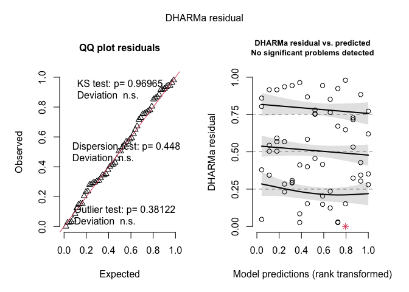

Weed biomass
================

# Load libraries

``` r
#Set work directory
setwd("/Users/ey239/Github/Mowtivation/rmarkdowns")

#Load packages 
library(tidyverse) ##install.packages("tidyverse")
library(knitr)
library(patchwork) ##install.packages("patchwork")
library(skimr)     ##install.packages("skimr")
library(readxl)
library(janitor) ##install.packages("janitor")

library(kableExtra) ##install.packages("kableExtra")
library(webshot) ##install.packages("webshot")
webshot::install_phantomjs()
library(viridis) ##install.packages("viridis")
library(lme4) ##install.packages("lme4")
library(lmerTest) ##install.packages("lmerTest")
library(emmeans) ##install.packages("emmeans")
library(rstatix) ##install.packages("rstatix")
#library(Matrix) ##install.packages("Matrix")
library(multcomp) ##install.packages("multcomp")
library(multcompView) ##install.packages("multcompView")
library(ggResidpanel) ##install.packages("ggResidpanel")
#library(car)
#library(TMB)  ##install.packages("TMB")
library(glmmTMB)  ##install.packages("glmmTMB")
library(DHARMa)  ##install.packages("DHARMa")
library(performance) ##install.packages("performance")

#Load Functions
MeanPlusSe<-function(x) mean(x)+plotrix::std.error(x)

find_logw0=function(x){c=trunc(log(min(x[x>0],na.rm=T)))
d=exp(c)
return(d)}
```

<br>

# Load and clean data

## Load data

``` r
combined_raw <- read_excel("~/Github/Mowtivation/raw-data/All Treatments/combined_raw.xlsx")
kable(head(combined_raw))
```

| id | location | year | treatment | block | plot | bean_emergence | bean_biomass | intrarow_weed_biomass | interrow_weed_biomass | weed_biomass | bean_population | bean_yield | seed_weight |
|:---|:---|---:|:---|---:|---:|---:|---:|---:|---:|---:|---:|---:|---:|
| CU_B1_P101 | field x | 2023 | TIM | 1 | 101 | 46.5 | 223.740 | 19.000 | 44.490 | 63.490 | 34.5 | 417.21 | 17.1200 |
| CU_B1_P102 | field x | 2023 | TIC | 1 | 102 | 42.5 | 267.460 | 30.975 | 0.720 | 31.695 | 39.5 | 565.54 | 17.4750 |
| CU_B1_P103 | field x | 2023 | RIM | 1 | 103 | 36.5 | 217.890 | 0.950 | 6.890 | 7.840 | 37.5 | 449.93 | 16.7525 |
| CU_B1_P104 | field x | 2023 | RNO | 1 | 104 | 41.0 | 207.675 | 0.660 | 45.735 | 46.395 | 35.0 | 412.59 | 16.1450 |
| CU_B1_P105 | field x | 2023 | RIC | 1 | 105 | 41.0 | 230.285 | 0.495 | 22.025 | 22.520 | 39.0 | 473.79 | 17.0475 |
| CU_B1_P201 | field x | 2023 | RIC | 2 | 201 | 36.5 | 208.105 | 6.395 | 19.460 | 25.855 | 33.5 | 484.04 | 17.1500 |

\##Clean data

``` r
#Standardaze column names, convert to factors, check for outliers of variable**
clean_combined <- clean_names(combined_raw) |>  
  rename ('weed_control'= treatment) |> 
  mutate(across(c(weed_control, block, plot, location, year), as.factor)) #|> 
  #mutate(is_outlier = totwbm < (quantile(totwbm, 0.25) - 1.5 * IQR(totwbm)) |
                       #wbm > (quantile(totwbm, 0.75) + 1.5 * IQR(totwbm)))

#select and convert data for wbm analysis
weed_biomass_clean <-clean_combined |> 
  mutate(weed_biomass_grams_meter = (weed_biomass /0.5)) |> 
  mutate(weed_biomass_kg_ha = (weed_biomass_grams_meter *(10000))/(1000)) |>
  mutate(weed_biomass_lbs_ac = ((weed_biomass_grams_meter *(10000))/(1000))* 0.892179)
kable(head(weed_biomass_clean)) 
```

| id | location | year | weed_control | block | plot | bean_emergence | bean_biomass | intrarow_weed_biomass | interrow_weed_biomass | weed_biomass | bean_population | bean_yield | seed_weight | weed_biomass_grams_meter | weed_biomass_kg_ha | weed_biomass_lbs_ac |
|:---|:---|:---|:---|:---|:---|---:|---:|---:|---:|---:|---:|---:|---:|---:|---:|---:|
| CU_B1_P101 | field x | 2023 | TIM | 1 | 101 | 46.5 | 223.740 | 19.000 | 44.490 | 63.490 | 34.5 | 417.21 | 17.1200 | 126.98 | 1269.8 | 1132.8889 |
| CU_B1_P102 | field x | 2023 | TIC | 1 | 102 | 42.5 | 267.460 | 30.975 | 0.720 | 31.695 | 39.5 | 565.54 | 17.4750 | 63.39 | 633.9 | 565.5523 |
| CU_B1_P103 | field x | 2023 | RIM | 1 | 103 | 36.5 | 217.890 | 0.950 | 6.890 | 7.840 | 37.5 | 449.93 | 16.7525 | 15.68 | 156.8 | 139.8937 |
| CU_B1_P104 | field x | 2023 | RNO | 1 | 104 | 41.0 | 207.675 | 0.660 | 45.735 | 46.395 | 35.0 | 412.59 | 16.1450 | 92.79 | 927.9 | 827.8529 |
| CU_B1_P105 | field x | 2023 | RIC | 1 | 105 | 41.0 | 230.285 | 0.495 | 22.025 | 22.520 | 39.0 | 473.79 | 17.0475 | 45.04 | 450.4 | 401.8374 |
| CU_B1_P201 | field x | 2023 | RIC | 2 | 201 | 36.5 | 208.105 | 6.395 | 19.460 | 25.855 | 33.5 | 484.04 | 17.1500 | 51.71 | 517.1 | 461.3458 |

<br> \# Model testing

Block is random Tyler is under the impression that block should always
be random and that post-hoc comparisons should use TUKEY rather the
Fischer. Fisher is bogus apparently.

\#GLMM

``` r
model_tweedie_log <- glmmTMB(weed_biomass_lbs_ac ~  weed_control*location + (1|location:block), 
  data = weed_biomass_clean, 
  family = tweedie(link = "log")

)

### Two checks specifically for a generalize linear approach
simulateResiduals(model_tweedie_log,plot = TRUE) # Residuals and normality look good
```

<!-- -->

    ## Object of Class DHARMa with simulated residuals based on 250 simulations with refit = FALSE . See ?DHARMa::simulateResiduals for help. 
    ##  
    ## Scaled residual values: 0.608 0.484 0.436 0.888 0.564 0.64 0.648 0.692 0.704 0.436 0.488 0.52 0.612 0.312 0.084 0.4 0.42 0.72 0.488 0.644 ...

``` r
check_model(model_tweedie_log) #Perfect, preditions match real data
```

    ## `check_outliers()` does not yet support models of class `glmmTMB`.

<!-- -->

``` r
summary(model_tweedie_log )
```

    ##  Family: tweedie  ( log )
    ## Formula:          
    ## weed_biomass_lbs_ac ~ weed_control * location + (1 | location:block)
    ## Data: weed_biomass_clean
    ## 
    ##      AIC      BIC   logLik deviance df.resid 
    ##    706.0    743.7   -335.0    670.0       42 
    ## 
    ## Random effects:
    ## 
    ## Conditional model:
    ##  Groups         Name        Variance Std.Dev.
    ##  location:block (Intercept) 0.2138   0.4624  
    ## Number of obs: 60, groups:  location:block, 12
    ## 
    ## Dispersion parameter for tweedie family (): 5.81 
    ## 
    ## Conditional model:
    ##                                       Estimate Std. Error z value Pr(>|z|)    
    ## (Intercept)                             0.6233     1.1086   0.562 0.573928    
    ## weed_controlRIM                         2.4588     1.2777   1.924 0.054313 .  
    ## weed_controlRNO                         3.8035     1.2290   3.095 0.001970 ** 
    ## weed_controlTIC                         3.5248     1.2426   2.837 0.004559 ** 
    ## weed_controlTIM                         4.2203     1.2121   3.482 0.000498 ***
    ## locationfield O2 west                   4.6389     1.2376   3.748 0.000178 ***
    ## locationfield x                         5.4188     1.2049   4.497 6.89e-06 ***
    ## weed_controlRIM:locationfield O2 west  -3.6957     1.4920  -2.477 0.013248 *  
    ## weed_controlRNO:locationfield O2 west  -4.0328     1.4064  -2.867 0.004138 ** 
    ## weed_controlTIC:locationfield O2 west  -6.5484     1.5589  -4.201 2.66e-05 ***
    ## weed_controlTIM:locationfield O2 west  -4.2300     1.4012  -3.019 0.002538 ** 
    ## weed_controlRIM:locationfield x        -3.0727     1.4191  -2.165 0.030364 *  
    ## weed_controlRNO:locationfield x        -3.9551     1.3606  -2.907 0.003650 ** 
    ## weed_controlTIC:locationfield x        -2.9297     1.3581  -2.157 0.030983 *  
    ## weed_controlTIM:locationfield x        -3.2866     1.3261  -2.478 0.013200 *  
    ## ---
    ## Signif. codes:  0 '***' 0.001 '**' 0.01 '*' 0.05 '.' 0.1 ' ' 1

``` r
VarCorr(model_tweedie_log )
```

    ## 
    ## Conditional model:
    ##  Groups         Name        Std.Dev.
    ##  location:block (Intercept) 0.46244

#### Joint test (anova)

``` r
model_tweedie_log |> 
  joint_tests() |> 
  kable()  
```

|     | model term            | df1 | df2 | F.ratio |  Chisq |   p.value |
|:----|:----------------------|----:|----:|--------:|-------:|----------:|
| 1   | weed_control          |   4 | Inf |   4.794 | 19.176 | 0.0007254 |
| 3   | location              |   2 | Inf |  16.145 | 32.290 | 0.0000001 |
| 2   | weed_control:location |   8 | Inf |   2.892 | 23.136 | 0.0031911 |

``` r
options(contrasts = c("contr.sum", "contr.poly"))
Anova(model_tweedie_log, type = 3)
```

    ## Analysis of Deviance Table (Type III Wald chisquare tests)
    ## 
    ## Response: weed_biomass_lbs_ac
    ##                         Chisq Df Pr(>Chisq)    
    ## (Intercept)            0.3162  1   0.573928    
    ## weed_control          14.5176  4   0.005814 ** 
    ## location              20.2575  2  3.992e-05 ***
    ## weed_control:location 23.1384  8   0.003191 ** 
    ## ---
    ## Signif. codes:  0 '***' 0.001 '**' 0.01 '*' 0.05 '.' 0.1 ' ' 1

<br>

## Fisher compact letter display

### Weed-control (S)

``` r
cld_weed_control_fisher <-cld(emmeans(model_tweedie_log, ~  weed_control, type = "response"), Letters = letters,adjust = "none", sort = TRUE, reversed=TRUE)
```

    ## NOTE: Results may be misleading due to involvement in interactions

``` r
cld_weed_control_fisher
```

    ##  weed_control response   SE  df asymp.LCL asymp.UCL .group
    ##  TIM             296.1 88.2 Inf     165.1       531  a    
    ##  RNO             166.8 62.8 Inf      79.7       349  ab   
    ##  TIC              76.8 31.3 Inf      34.6       171   bc  
    ##  RIM              65.3 24.9 Inf      30.9       138    c  
    ##  RIC              53.3 24.0 Inf      22.0       129    c  
    ## 
    ## Results are averaged over the levels of: location 
    ## Confidence level used: 0.95 
    ## Intervals are back-transformed from the log scale 
    ## Tests are performed on the log scale 
    ## significance level used: alpha = 0.05 
    ## NOTE: If two or more means share the same grouping symbol,
    ##       then we cannot show them to be different.
    ##       But we also did not show them to be the same.

## Fisher compact letter display

weed_control\|location (Significant)

``` r
cld_weed_control_location_fisher <-cld(emmeans(model_tweedie_log, ~  weed_control|location, type = "response"), Letters = letters,adjust = "none", sort = TRUE, reversed=TRUE)
cld_weed_control_location_fisher
```

    ## location = field O2 east:
    ##  weed_control response     SE  df asymp.LCL asymp.UCL .group
    ##  TIM            126.92  72.50 Inf    41.434     388.8  a    
    ##  RNO             83.66  56.10 Inf    22.486     311.3  ab   
    ##  TIC             63.32  43.50 Inf    16.452     243.7  ab   
    ##  RIM             21.80  16.10 Inf     5.127      92.7   bc  
    ##  RIC              1.87   2.07 Inf     0.212      16.4    c  
    ## 
    ## location = field O2 west:
    ##  weed_control response     SE  df asymp.LCL asymp.UCL .group
    ##  RIC            192.91 113.00 Inf    61.236     607.7  a    
    ##  TIM            191.03 102.00 Inf    66.950     545.1  a    
    ##  RNO            153.37  98.40 Inf    43.633     539.1  a    
    ##  RIM             56.00  39.30 Inf    14.127     222.0  ab   
    ##  TIC              9.38   8.14 Inf     1.714      51.3   b   
    ## 
    ## location = field x:
    ##  weed_control response     SE  df asymp.LCL asymp.UCL .group
    ##  TIM           1070.43 446.00 Inf   472.913    2422.9  a    
    ##  TIC            762.97 332.00 Inf   325.261    1789.7  ab   
    ##  RIC            420.79 198.00 Inf   167.393    1057.8  abc  
    ##  RNO            361.57 176.00 Inf   139.646     936.2   bc  
    ##  RIM            227.73 117.00 Inf    83.302     622.6    c  
    ## 
    ## Confidence level used: 0.95 
    ## Intervals are back-transformed from the log scale 
    ## Tests are performed on the log scale 
    ## significance level used: alpha = 0.05 
    ## NOTE: If two or more means share the same grouping symbol,
    ##       then we cannot show them to be different.
    ##       But we also did not show them to be the same.

# Figures

\###lbs/a \#### Weed_control\|Location (Significant)

``` r
weed_biomass_clean |> 
  left_join(cld_weed_control_location_fisher) |> 
  ggplot(aes(x = factor(weed_control, levels = c("RNO", "RIM", "RIC", "TIM", "TIC")), y = response, fill = weed_control)) +
facet_wrap( ~location, labeller = labeller(
    location = c("field O2 east" = "Field A", "field O2 west" = "Field B","field x" = "Field C" )))+
  #stat_summary(geom = "bar", fun = "mean", width = 0.7) +
  #stat_summary(geom = "errorbar", fun.data = "mean_se", width = 0.2) +
  #stat_summary(geom="text", fun = "MeanPlusSe", aes(label= trimws(.group)),size=6.5,vjust=-0.5) +
  geom_bar(stat="identity", position=position_dodge()) + 
  geom_errorbar(aes(ymin=response-SE, ymax=response+SE), width=.2,
                 position=position_dodge(.9))+
geom_text(aes(label = trimws(.group), y = response + (SE + 48)), size = 7) +
  labs(
    x = "",
     y = expression("Weed biomass" ~ (lbs * "/" * a)),
    #title = str_c("Influence of interrow weed control on weed biomass"),
    subtitle = expression(italic("P < 0.005"))) +
  
  scale_x_discrete(labels = c("Rolled,\nno additional\nweed control",
                              "Rolled,\ninterrow\nmowing",
                              "Rolled,\nhigh-residue\ncultivation",
                              "Tilled,\ninterrow\nmowing",
                          "Tilled,\nstandard\ncultivation")) +
  scale_y_continuous(expand = expansion(mult = c(0.05, 0.3))) +
  scale_fill_viridis(discrete = TRUE, option = "D", direction = -1, end = 0.9, begin = 0.1) +
   theme_bw() +
  theme(
    legend.position = "none",
    strip.background = element_blank(),
    strip.text = element_text(face = "bold", size = 20),
    axis.title = element_text(size = 20),  # Increase font size of axis titles
    axis.text = element_text(size = 20),   # Increase font size of axis labels
    plot.title = element_text(size = 24, face = "bold"),  # Increase font size of title
    plot.subtitle = element_text(size = 24, face = "italic")  # Increase font size of subtitle
  
  )
```

<!-- -->

``` r
ggsave("weed_biomass_weed_control_location_lb_acre.png", width = 24, height = 8, dpi = 300)
```

# Figures

\###Kg/h \#### Weed_control\|Location (Significant)

``` r
weed_biomass_clean |> 
  left_join(cld_weed_control_location_fisher) |> 
  ggplot(aes(x = factor(weed_control, levels = c("RNO", "RIM", "RIC", "TIM", "TIC")), y = response, fill = weed_control)) +
facet_wrap( ~location, labeller = labeller(
    location = c("field O2 east" = "Field A", "field O2 west" = "Field B","field x" = "Field C" )))+
  #stat_summary(geom = "bar", fun = "mean", width = 0.7) +
  #stat_summary(geom = "errorbar", fun.data = "mean_se", width = 0.2) +
  #stat_summary(geom="text", fun = "MeanPlusSe", aes(label= trimws(.group)),size=6.5,vjust=-0.5) +
  geom_bar(stat="identity", position=position_dodge()) + 
  geom_errorbar(aes(ymin=response-SE, ymax=response+SE), width=.2,
                 position=position_dodge(.9))+
geom_text(aes(label = trimws(.group), y = response + (SE + 48)), size = 7) +
  labs(
    x = "",
     y = expression("Weed biomass" ~ (kg~ha^{-1})),
    #title = str_c("Influence of interrow weed control on weed biomass"),
    subtitle = expression(italic("P < 0.005"))) +
  
  scale_x_discrete(labels = c("Rolled,\nno additional\nweed control",
                              "Rolled,\ninterrow\nmowing",
                              "Rolled,\nhigh-residue\ncultivation",
                              "Tilled,\ninterrow\nmowing",
                          "Tilled,\nstandard\ncultivation")) +
  scale_y_continuous(expand = expansion(mult = c(0.05, 0.3))) +
  scale_fill_viridis(discrete = TRUE, option = "D", direction = -1, end = 0.9, begin = 0.1) +
   theme_bw() +
  theme(
    legend.position = "none",
    strip.background = element_blank(),
    strip.text = element_text(face = "bold", size = 20),
    axis.title = element_text(size = 20),  # Increase font size of axis titles
    axis.text = element_text(size = 20),   # Increase font size of axis labels
    plot.title = element_text(size = 24, face = "bold"),  # Increase font size of title
    plot.subtitle = element_text(size = 24, face = "italic")  # Increase font size of subtitle
  
  )
```

<!-- -->

``` r
ggsave("weed_biomass_weed_control_location_kg_ha.png", width = 24, height = 8, dpi = 300)
```
